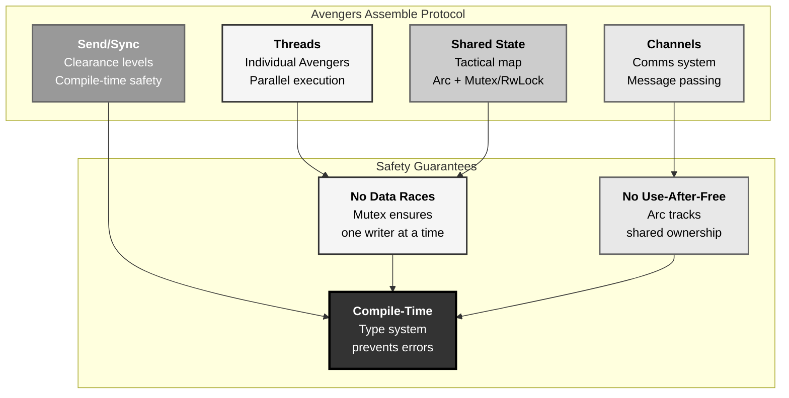
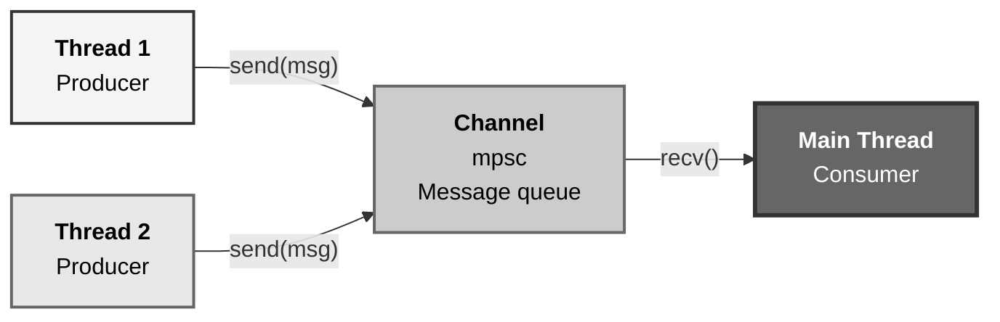
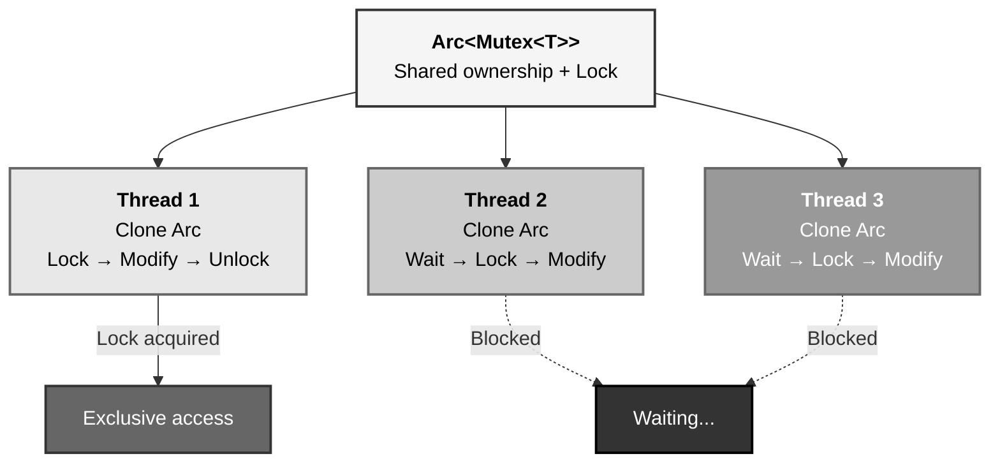
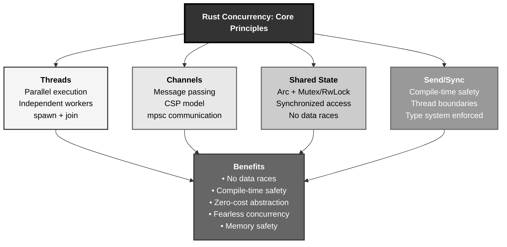

# Rust Concurrency: The Avengers Assemble Protocol Pattern

## The Answer (Minto Pyramid)

**Concurrency in Rust enables safe parallel execution through threads, message passing (channels), and shared state (Arc/Mutex), with compile-time guarantees preventing data races via the ownership system and Send/Sync traits that ensure thread-safe value transfer and shared access.**

Rust provides fearless concurrency—the type system prevents data races at compile time. Three concurrency patterns exist: **threads** (spawn independent workers), **message passing** (channels for communication), **shared state** (Arc for ownership, Mutex/RwLock for synchronization). The `Send` trait marks types safe to transfer between threads. The `Sync` trait marks types safe to share references between threads. Arc<Mutex<T>> enables thread-safe shared mutable state. Channels provide CSP-style message passing. All patterns guarantee memory safety—no data races possible.

**Three Supporting Principles:**

1. **Ownership-Based Safety**: Borrow checker prevents data races at compile time
2. **Send/Sync Traits**: Compiler enforces thread-safety requirements
3. **Zero-Cost**: Concurrency abstractions compile to efficient native code

**Why This Matters**: Rust eliminates entire classes of concurrency bugs (data races, use-after-free) at compile time while maintaining performance. Understanding Rust concurrency unlocks safe, fast parallel programming.

---

## The MCU Metaphor: Avengers Assemble Protocol

Think of Rust concurrency like the Avengers coordinating during missions:

### The Mapping

| Avengers Protocol | Rust Concurrency |
|-------------------|------------------|
| **Individual Avenger** | Thread (independent worker) |
| **Mission briefing** | thread::spawn (create thread) |
| **Comms channel** | mpsc channel (message passing) |
| **Shared tactical map** | Arc<Mutex<T>> (shared state) |
| **Arc Reactor core** | Arc (atomic reference counting) |
| **Security lock** | Mutex (mutual exclusion) |
| **Read-only intel** | RwLock (multiple readers, single writer) |
| **Team assembly** | join() (wait for completion) |
| **Clearance level** | Send trait (can cross thread boundary) |
| **Shared access** | Sync trait (can be shared between threads) |

### The Story

The Avengers demonstrate perfect concurrency patterns during missions:

**Individual Avengers (`Threads`)**: Each Avenger is an independent worker—Iron Man flies reconnaissance, Cap coordinates ground troops, Thor handles aerial threats. They operate **concurrently**, each in their own execution context. Nick Fury spawns missions (`thread::spawn`): "Tony, investigate sector 7. Steve, evacuate civilians. Thor, neutralize the portal." Each thread runs independently, doing work in parallel.

**Comms Channel (`mpsc::channel`)**: Avengers communicate via secure comms—**message passing**. Tony finds intel, sends it through the channel: "Enemy coordinates: (42.3, -71.1)." Cap receives the message, acts on it. This is `mpsc` (multiple producer, single consumer): many Avengers can send messages, one command center receives. Messages are **moved** (Send trait)—once sent, the sender can't access them. Thread-safe communication without shared memory.

**Shared Tactical Map (`Arc<Mutex<T>>`)**: Sometimes Avengers need **shared state**—a holographic tactical map everyone updates. The map has an **Arc Reactor core** (`Arc`) providing shared ownership—multiple Avengers reference the same map. But simultaneous updates would conflict, so there's a **security lock** (`Mutex`)—only one Avenger modifies at a time. Tony locks the map, updates enemy positions, unlocks. Steve waits, locks, adds civilian locations, unlocks. Mutex prevents data races—guaranteed one writer at a time.

**Read-Only Intel (`RwLock`)**: Some data is read frequently, written rarely. Mission parameters: all Avengers read constantly (enemy count, objectives), but only command updates occasionally. `RwLock` allows **multiple simultaneous readers** (all Avengers reading) or **one writer** (command updating). Efficient for read-heavy workloads.

**Team Assembly (`join`)**: After completing missions, Avengers report back. Fury waits for everyone: "Don't proceed until all threads return." This is `join()`—blocks until the thread completes, ensuring all work finishes before moving forward.

Similarly, Rust concurrency provides coordination primitives: spawn threads (independent Avengers), communicate via channels (comms), share state safely (Arc/Mutex for tactical map), ensure thread safety (Send/Sync traits as clearance levels), and synchronize completion (join for team assembly). The compiler enforces safety—no data races, no undefined behavior. Fearless concurrency.

---

## The Problem Without Safe Concurrency

Without Rust's guarantees, concurrent programming is treacherous:

```rust path=null start=null
// ❌ In other languages: data races possible
// Thread 1: counter++
// Thread 2: counter++
// Result: undefined! Could be +1, +2, or corrupt

// ❌ Use after free
// Thread 1: frees memory
// Thread 2: accesses freed memory (crash!)

// ❌ Deadlocks from incorrect locking
// Thread 1: locks A, waits for B
// Thread 2: locks B, waits for A
// Both stuck forever

// ❌ Race conditions
// Thread 1: if counter == 0 { ... }
// Thread 2: counter = 1
// Timing-dependent bugs
```

**Problems:**

1. **Data Races**: Simultaneous reads/writes without synchronization
2. **Use After Free**: Access to freed memory from other threads
3. **Deadlocks**: Circular lock dependencies
4. **Race Conditions**: Timing-dependent behavior
5. **No Compile-Time Safety**: Bugs only appear at runtime

---

## The Solution: Rust Concurrency Primitives

Rust provides safe concurrency through ownership and type system:

### Creating Threads

```rust path=null start=null
use std::thread;
use std::time::Duration;

fn main() {
    // Spawn a thread
    let handle = thread::spawn(|| {
        for i in 1..5 {
            println!("Thread: {}", i);
            thread::sleep(Duration::from_millis(100));
        }
    });
    
    // Main thread continues
    for i in 1..3 {
        println!("Main: {}", i);
        thread::sleep(Duration::from_millis(100));
    }
    
    // Wait for thread to complete
    handle.join().unwrap();
    println!("Thread finished");
}
```

### Message Passing (Channels)

```rust path=null start=null
use std::sync::mpsc;
use std::thread;

fn main() {
    let (tx, rx) = mpsc::channel();
    
    thread::spawn(move || {
        let messages = vec!["Hello", "from", "thread"];
        
        for msg in messages {
            tx.send(msg).unwrap();
        }
    });
    
    for received in rx {
        println!("Received: {}", received);
    }
}
```

### Shared State (Arc + Mutex)

```rust path=null start=null
use std::sync::{Arc, Mutex};
use std::thread;

fn main() {
    let counter = Arc::new(Mutex::new(0));
    let mut handles = vec![];
    
    for _ in 0..10 {
        let counter_clone = Arc::clone(&counter);
        
        let handle = thread::spawn(move || {
            let mut num = counter_clone.lock().unwrap();
            *num += 1;
        });
        
        handles.push(handle);
    }
    
    for handle in handles {
        handle.join().unwrap();
    }
    
    println!("Result: {}", *counter.lock().unwrap());  // 10
}
```

### RwLock for Read-Heavy Workloads

```rust path=null start=null
use std::sync::{Arc, RwLock};
use std::thread;

fn main() {
    let data = Arc::new(RwLock::new(vec![1, 2, 3]));
    let mut handles = vec![];
    
    // Multiple readers
    for i in 0..5 {
        let data_clone = Arc::clone(&data);
        
        let handle = thread::spawn(move || {
            let r = data_clone.read().unwrap();
            println!("Reader {}: {:?}", i, *r);
        });
        
        handles.push(handle);
    }
    
    // Single writer
    let data_clone = Arc::clone(&data);
    let handle = thread::spawn(move || {
        let mut w = data_clone.write().unwrap();
        w.push(4);
    });
    handles.push(handle);
    
    for handle in handles {
        handle.join().unwrap();
    }
}
```

---

## Visual Mental Model



### Message Passing Flow



### Shared State Synchronization



---

## Anatomy of Rust Concurrency

### 1. Basic Thread Creation

```rust path=null start=null
use std::thread;

fn main() {
    // Spawn thread with closure
    let handle = thread::spawn(|| {
        println!("Hello from thread!");
    });
    
    // Wait for completion
    handle.join().unwrap();
    
    // Spawn with move to capture environment
    let data = vec![1, 2, 3];
    let handle = thread::spawn(move || {
        println!("Data: {:?}", data);
    });
    
    handle.join().unwrap();
}
```

### 2. Message Passing with Channels

```rust path=null start=null
use std::sync::mpsc;
use std::thread;

fn main() {
    let (tx, rx) = mpsc::channel();
    
    // Single producer
    thread::spawn(move || {
        for i in 0..5 {
            tx.send(i).unwrap();
        }
    });
    
    // Consumer
    for received in rx {
        println!("Received: {}", received);
    }
    
    // Multiple producers
    let (tx, rx) = mpsc::channel();
    
    for i in 0..3 {
        let tx_clone = tx.clone();
        thread::spawn(move || {
            tx_clone.send(i).unwrap();
        });
    }
    drop(tx);  // Drop original sender
    
    for received in rx {
        println!("Received: {}", received);
    }
}
```

### 3. Shared State with Arc and Mutex

```rust path=null start=null
use std::sync::{Arc, Mutex};
use std::thread;

fn main() {
    let counter = Arc::new(Mutex::new(0));
    let mut handles = vec![];
    
    for _ in 0..10 {
        let counter = Arc::clone(&counter);
        
        let handle = thread::spawn(move || {
            // Lock, modify, automatically unlock when guard drops
            let mut num = counter.lock().unwrap();
            *num += 1;
        });
        
        handles.push(handle);
    }
    
    for handle in handles {
        handle.join().unwrap();
    }
    
    println!("Final count: {}", *counter.lock().unwrap());
}
```

### 4. RwLock for Read-Heavy Access

```rust path=null start=null
use std::sync::{Arc, RwLock};
use std::thread;

fn main() {
    let data = Arc::new(RwLock::new(0));
    let mut handles = vec![];
    
    // Spawn readers
    for _ in 0..5 {
        let data = Arc::clone(&data);
        let handle = thread::spawn(move || {
            let r = data.read().unwrap();
            println!("Read: {}", *r);
        });
        handles.push(handle);
    }
    
    // Spawn writer
    let data = Arc::clone(&data);
    let handle = thread::spawn(move || {
        let mut w = data.write().unwrap();
        *w += 1;
        println!("Written");
    });
    handles.push(handle);
    
    for handle in handles {
        handle.join().unwrap();
    }
}
```

### 5. Send and Sync Traits

```rust path=null start=null
use std::thread;

// Send: type can be transferred between threads
// Sync: type can be shared between threads (&T is Send)

fn main() {
    // i32 implements Send + Sync
    let x = 42;
    thread::spawn(move || {
        println!("{}", x);  // Moved to thread
    });
    
    // String implements Send + Sync
    let s = String::from("hello");
    thread::spawn(move || {
        println!("{}", s);  // Moved to thread
    });
    
    // Rc does NOT implement Send (not thread-safe)
    // use std::rc::Rc;
    // let rc = Rc::new(5);
    // thread::spawn(move || {
    //     println!("{}", rc);  // ERROR: Rc is not Send
    // });
    
    // Arc implements Send + Sync (thread-safe)
    use std::sync::Arc;
    let arc = Arc::new(5);
    thread::spawn(move || {
        println!("{}", arc);  // OK: Arc is Send
    });
}
```

---

## Common Concurrency Patterns

### Pattern 1: Worker Pool

```rust path=null start=null
use std::sync::{Arc, Mutex};
use std::sync::mpsc;
use std::thread;

fn main() {
    let (tx, rx) = mpsc::channel();
    let rx = Arc::new(Mutex::new(rx));
    
    // Spawn worker threads
    let mut handles = vec![];
    for id in 0..4 {
        let rx = Arc::clone(&rx);
        
        let handle = thread::spawn(move || {
            loop {
                let job = rx.lock().unwrap().recv();
                
                match job {
                    Ok(num) => {
                        println!("Worker {} processing: {}", id, num);
                        thread::sleep(std::time::Duration::from_millis(100));
                    }
                    Err(_) => break,
                }
            }
        });
        
        handles.push(handle);
    }
    
    // Send work
    for i in 0..10 {
        tx.send(i).unwrap();
    }
    drop(tx);
    
    for handle in handles {
        handle.join().unwrap();
    }
}
```

### Pattern 2: Parallel Map-Reduce

```rust path=null start=null
use std::sync::{Arc, Mutex};
use std::thread;

fn main() {
    let data = vec![1, 2, 3, 4, 5, 6, 7, 8];
    let result = Arc::new(Mutex::new(0));
    let mut handles = vec![];
    
    let chunk_size = data.len() / 4;
    
    for chunk in data.chunks(chunk_size) {
        let result = Arc::clone(&result);
        let chunk = chunk.to_vec();
        
        let handle = thread::spawn(move || {
            let sum: i32 = chunk.iter().sum();
            let mut r = result.lock().unwrap();
            *r += sum;
        });
        
        handles.push(handle);
    }
    
    for handle in handles {
        handle.join().unwrap();
    }
    
    println!("Total sum: {}", *result.lock().unwrap());
}
```

### Pattern 3: Producer-Consumer

```rust path=null start=null
use std::sync::mpsc;
use std::thread;
use std::time::Duration;

fn main() {
    let (tx, rx) = mpsc::channel();
    
    // Producer
    thread::spawn(move || {
        for i in 0..5 {
            println!("Producing: {}", i);
            tx.send(i).unwrap();
            thread::sleep(Duration::from_millis(100));
        }
    });
    
    // Consumer
    thread::spawn(move || {
        for received in rx {
            println!("Consuming: {}", received);
            thread::sleep(Duration::from_millis(200));
        }
    })
    .join()
    .unwrap();
}
```

### Pattern 4: Barrier Synchronization

```rust path=null start=null
use std::sync::{Arc, Barrier};
use std::thread;

fn main() {
    let barrier = Arc::new(Barrier::new(3));
    let mut handles = vec![];
    
    for i in 0..3 {
        let barrier = Arc::clone(&barrier);
        
        let handle = thread::spawn(move || {
            println!("Thread {} before barrier", i);
            barrier.wait();
            println!("Thread {} after barrier", i);
        });
        
        handles.push(handle);
    }
    
    for handle in handles {
        handle.join().unwrap();
    }
}
```

### Pattern 5: Scoped Threads

```rust path=null start=null
use std::thread;

fn main() {
    let mut data = vec![1, 2, 3];
    
    thread::scope(|s| {
        s.spawn(|| {
            println!("Length: {}", data.len());
        });
        
        s.spawn(|| {
            println!("First: {:?}", data.first());
        });
    });
    
    // Scoped threads automatically joined
    println!("After scope: {:?}", data);
}
```

---

## Real-World Use Cases

### Use Case 1: Parallel File Processing

```rust path=null start=null
use std::sync::{Arc, Mutex};
use std::thread;

fn process_files(files: Vec<String>) -> Vec<usize> {
    let results = Arc::new(Mutex::new(Vec::new()));
    let mut handles = vec![];
    
    for file in files {
        let results = Arc::clone(&results);
        
        let handle = thread::spawn(move || {
            // Simulate file processing
            let size = file.len() * 100;
            
            let mut r = results.lock().unwrap();
            r.push(size);
        });
        
        handles.push(handle);
    }
    
    for handle in handles {
        handle.join().unwrap();
    }
    
    Arc::try_unwrap(results).unwrap().into_inner().unwrap()
}

fn main() {
    let files = vec![
        "file1.txt".to_string(),
        "file2.txt".to_string(),
        "file3.txt".to_string(),
    ];
    
    let sizes = process_files(files);
    println!("Sizes: {:?}", sizes);
}
```

### Use Case 2: Web Server Request Handler

```rust path=null start=null
use std::sync::{Arc, Mutex};
use std::thread;

struct ConnectionPool {
    connections: Arc<Mutex<Vec<String>>>,
}

impl ConnectionPool {
    fn new(size: usize) -> Self {
        let connections = (0..size)
            .map(|i| format!("Connection-{}", i))
            .collect();
        
        ConnectionPool {
            connections: Arc::new(Mutex::new(connections)),
        }
    }
    
    fn acquire(&self) -> Option<String> {
        self.connections.lock().unwrap().pop()
    }
    
    fn release(&self, conn: String) {
        self.connections.lock().unwrap().push(conn);
    }
}

fn main() {
    let pool = ConnectionPool::new(3);
    let mut handles = vec![];
    
    for i in 0..5 {
        let pool_clone = ConnectionPool {
            connections: Arc::clone(&pool.connections),
        };
        
        let handle = thread::spawn(move || {
            if let Some(conn) = pool_clone.acquire() {
                println!("Request {} using {}", i, conn);
                thread::sleep(std::time::Duration::from_millis(100));
                pool_clone.release(conn);
            }
        });
        
        handles.push(handle);
    }
    
    for handle in handles {
        handle.join().unwrap();
    }
}
```

### Use Case 3: Concurrent Cache

```rust path=null start=null
use std::collections::HashMap;
use std::sync::{Arc, RwLock};
use std::thread;

struct Cache {
    data: Arc<RwLock<HashMap<String, i32>>>,
}

impl Cache {
    fn new() -> Self {
        Cache {
            data: Arc::new(RwLock::new(HashMap::new())),
        }
    }
    
    fn get(&self, key: &str) -> Option<i32> {
        self.data.read().unwrap().get(key).copied()
    }
    
    fn set(&self, key: String, value: i32) {
        self.data.write().unwrap().insert(key, value);
    }
    
    fn clone_handle(&self) -> Self {
        Cache {
            data: Arc::clone(&self.data),
        }
    }
}

fn main() {
    let cache = Cache::new();
    cache.set("key1".to_string(), 42);
    
    let mut handles = vec![];
    
    // Multiple readers
    for i in 0..5 {
        let cache = cache.clone_handle();
        
        let handle = thread::spawn(move || {
            if let Some(value) = cache.get("key1") {
                println!("Reader {}: {}", i, value);
            }
        });
        
        handles.push(handle);
    }
    
    for handle in handles {
        handle.join().unwrap();
    }
}
```

---

## Key Takeaways



### The Mental Model

Think of concurrency like the Avengers Assemble Protocol:
- **Individual Avengers** → Threads (independent parallel workers)
- **Comms channel** → mpsc (message passing, Send trait)
- **Tactical map** → Arc<Mutex<T>> (shared state, synchronized access)
- **Clearance levels** → Send/Sync traits (compile-time thread safety)

### Core Principles

1. **Threads**: Create with `thread::spawn`, wait with `join()`
2. **Message Passing**: Use channels (mpsc) for CSP-style communication
3. **Shared State**: Arc for ownership, Mutex/RwLock for synchronization
4. **Send Trait**: Types safe to transfer between threads
5. **Sync Trait**: Types safe to share references between threads

### The Guarantee

Rust concurrency provides:
- **No Data Races**: Compiler prevents simultaneous unsynchronized access
- **No Use-After-Free**: Arc tracks ownership, prevents premature deallocation
- **Compile-Time Safety**: Borrow checker + Send/Sync enforce thread safety
- **Zero-Cost**: Abstractions compile to efficient native code

All with **fearless concurrency**—write parallel code confidently.

---

**Remember**: Concurrency in Rust isn't just threading—it's **compile-time-verified safe parallelism**. Like the Avengers (independent workers communicating via comms, sharing tactical maps with security locks, clearance levels for access), Rust threads operate independently, communicate via channels (message passing with Send), share state safely (Arc/Mutex with compile-time checks), and coordinate via Send/Sync traits. The ownership system prevents data races, the type system enforces thread safety, and the compiler guarantees correctness. Assemble your parallel operations, let Rust prevent the chaos.
