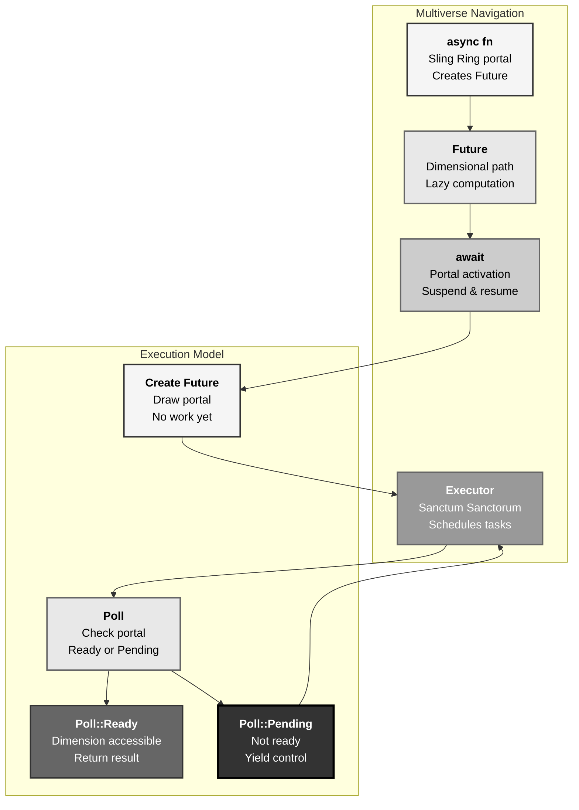
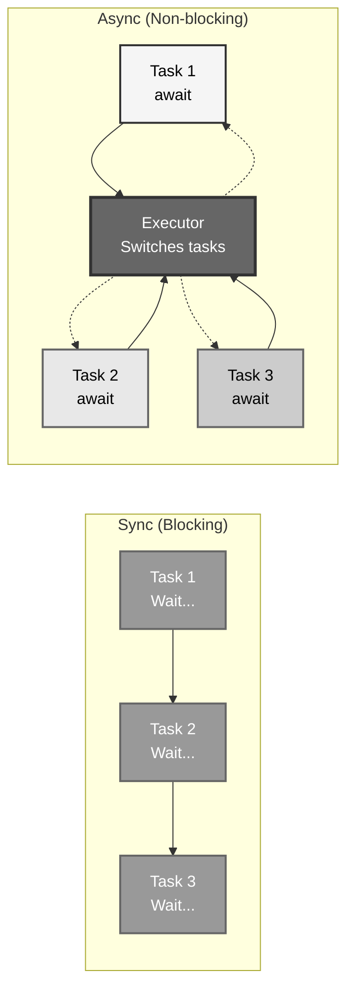
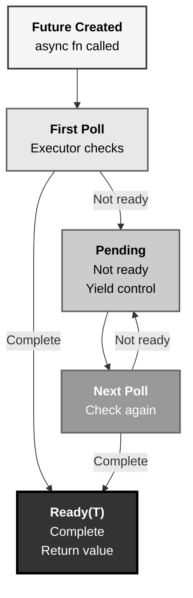
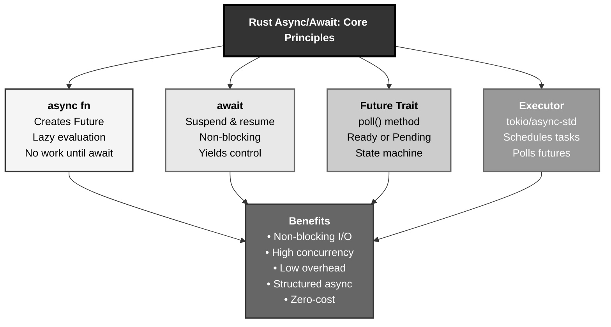

# Rust Async/Await: The Multiverse Navigation Pattern

## The Answer (Minto Pyramid)

**Async/await in Rust enables non-blocking concurrent I/O through Futures (lazy computations), async functions (return Future types), await expressions (suspend until ready), and executors (runtime schedulers like tokio) that poll futures to completion without blocking threads, achieving high-performance concurrent operations with minimal resource overhead.**

Async Rust provides cooperative concurrency for I/O-bound tasks. An `async` function returns a `Future`—a lazy computation that does nothing until polled. The `await` keyword suspends execution until the Future completes, yielding control to the executor. **Executors** (tokio, async-std) schedule and poll futures efficiently. Unlike threads (OS-level parallelism), async tasks are lightweight—thousands run on few threads. `Future` trait defines `poll()` method returning `Poll::Ready(T)` or `Poll::Pending`. Async enables high-concurrency servers, network clients, and I/O-heavy workloads with minimal overhead.

**Three Supporting Principles:**

1. **Lazy Evaluation**: Futures do nothing until awaited or polled
2. **Cooperative Scheduling**: Tasks yield control via await, no preemption
3. **Zero-Cost Abstraction**: Async compiles to state machines, minimal overhead

**Why This Matters**: Async/await enables scalable I/O without thread-per-connection overhead. Understanding async Rust unlocks high-performance network services, databases, and concurrent systems.

---

## The MCU Metaphor: Multiverse Navigation

Think of Rust async/await like Doctor Strange navigating the multiverse with the Sling Ring:

### The Mapping

| Multiverse Navigation | Rust Async/Await |
|-----------------------|------------------|
| **Sling Ring portal** | async function (creates Future) |
| **Dimensional path** | Future (lazy computation) |
| **Portal activation** | await (suspend & resume) |
| **Strange's consciousness** | Task (unit of async work) |
| **Time Stone checkpoint** | Poll state (Ready or Pending) |
| **Sanctum Sanctorum** | Executor (tokio, async-std) |
| **Multiple portals open** | Concurrent futures (join, select) |
| **Portal planning** | Lazy evaluation (no work until await) |
| **Switching portals** | Yielding control (cooperative) |

### The Story

Doctor Strange uses the Sling Ring to navigate dimensions, demonstrating async patterns perfectly:

**Sling Ring Portal (`async fn`)**: Strange draws a portal with the Sling Ring—this is an `async` function. Drawing the portal **creates a Future**, but doesn't activate it yet. The portal exists (Future created), but no dimensional travel happens. This is **lazy evaluation**: define the work (async fn), but don't execute until needed. Like `async fn travel() -> Location`—creates a Future, doesn't travel yet.

**Portal Activation (`await`)**: Strange steps through the portal—this is `await`. When he enters, his consciousness **suspends** in the current dimension and **resumes** in the target dimension. While Strange travels dimension A→B, his body can handle other tasks in dimension A (non-blocking). The `await` keyword says "pause here until this Future completes, but let other work proceed." Strange doesn't stand frozen waiting—he's productive in multiple dimensions.

**Sanctum Sanctorum (`Executor`)**: The Sanctum is the **executor**—it manages all open portals. When Strange has 100 portals open (100 Futures), the Sanctum **schedules** which ones to check. It polls each portal: "Is dimension X ready?" If yes (`Poll::Ready`), Strange gets the result. If no (`Poll::Pending`), Strange moves to the next portal. This is **cooperative scheduling**—Futures voluntarily yield control via `await`, and the executor decides what to poll next.

**Multiple Portals (`join`, `select`)**: Strange can manage multiple portals simultaneously. `join!` waits for ALL portals to complete—"Don't proceed until I've checked dimensions A, B, and C." `select!` takes the FIRST ready portal—"As soon as ANY dimension responds, act on it." This is concurrent I/O: Strange doesn't block on slow dimensions; he checks others while waiting.

**Time Stone Checkpoints (`Poll`)**: Each portal check has two states: `Poll::Ready(result)` (dimension accessible, result available) or `Poll::Pending` (dimension not ready, check later). The Time Stone lets Strange see portal states without wasting effort—he only processes ready dimensions, doesn't spin-wait on pending ones.

Similarly, Rust async/await enables efficient concurrency: create Futures (draw portals), await them (activate travel), let the executor schedule (Sanctum manages 100+ portals), and handle multiple operations concurrently (join/select for coordinated navigation). Non-blocking, cooperative, zero-cost—like navigating 14 million futures efficiently.

---

## The Problem Without Async

Before async, I/O-bound tasks required blocking or complex callbacks:

```rust path=null start=null
// ❌ Blocking I/O: thread waits, wastes resources
// fn fetch_data() -> Data {
//     // Blocks thread until network responds
//     network::read()  // Thread idle during I/O
// }

// ❌ Thread-per-connection: doesn't scale
// for connection in connections {
//     thread::spawn(move || {
//         handle(connection);  // 10,000 connections = 10,000 threads!
//     });
// }

// ❌ Callback hell (other languages)
// fetch_user(user_id, |user| {
//     fetch_posts(user, |posts| {
//         fetch_comments(posts, |comments| {
//             // Deeply nested, hard to read
//         });
//     });
// });
```

**Problems:**

1. **Blocking Wastes Resources**: Threads idle during I/O
2. **Thread Overhead**: OS threads expensive, don't scale to 10,000+ connections
3. **Callback Hell**: Nested callbacks unreadable, hard to maintain
4. **No Structured Concurrency**: Difficult to coordinate multiple operations
5. **Poor Performance**: Thread-per-connection model inefficient

---

## The Solution: Async/Await Syntax

Rust provides async/await for non-blocking concurrency:

### Basic Async Function

```rust path=null start=null
// Async function returns Future
async fn fetch_data() -> String {
    // Simulate async work
    String::from("data")
}

#[tokio::main]
async fn main() {
    // Await the Future
    let data = fetch_data().await;
    println!("{}", data);
}
```

### Awaiting Multiple Futures

```rust path=null start=null
async fn task_one() -> i32 {
    // Simulate work
    1
}

async fn task_two() -> i32 {
    2
}

#[tokio::main]
async fn main() {
    // Sequential: wait for each
    let a = task_one().await;
    let b = task_two().await;
    println!("Sequential: {}, {}", a, b);
    
    // Concurrent: run both
    let (a, b) = tokio::join!(task_one(), task_two());
    println!("Concurrent: {}, {}", a, b);
}
```

### Select First Completed

```rust path=null start=null
use tokio::time::{sleep, Duration};

async fn fast_task() -> &'static str {
    sleep(Duration::from_millis(100)).await;
    "fast"
}

async fn slow_task() -> &'static str {
    sleep(Duration::from_millis(500)).await;
    "slow"
}

#[tokio::main]
async fn main() {
    tokio::select! {
        result = fast_task() => println!("First: {}", result),
        result = slow_task() => println!("First: {}", result),
    }
}
```

### Async Blocks

```rust path=null start=null
#[tokio::main]
async fn main() {
    let future = async {
        println!("Starting async block");
        42
    };
    
    let result = future.await;
    println!("Result: {}", result);
}
```

---

## Visual Mental Model



### Async vs Sync Execution



### Future Polling Lifecycle



---

## Anatomy of Async Rust

### 1. Basic Async Function

```rust path=null start=null
// Async function returns impl Future<Output = T>
async fn hello() -> String {
    String::from("Hello, async!")
}

#[tokio::main]
async fn main() {
    // Calling async fn creates Future, doesn't execute
    let future = hello();
    
    // Await executes the Future
    let result = future.await;
    println!("{}", result);
}
```

### 2. Concurrent Execution with join!

```rust path=null start=null
use tokio::time::{sleep, Duration};

async fn task_a() -> i32 {
    sleep(Duration::from_millis(100)).await;
    println!("Task A done");
    1
}

async fn task_b() -> i32 {
    sleep(Duration::from_millis(100)).await;
    println!("Task B done");
    2
}

#[tokio::main]
async fn main() {
    // Run concurrently, wait for both
    let (a, b) = tokio::join!(task_a(), task_b());
    println!("Results: {} + {} = {}", a, b, a + b);
}
```

### 3. Racing with select!

```rust path=null start=null
use tokio::time::{sleep, Duration};

#[tokio::main]
async fn main() {
    let task1 = async {
        sleep(Duration::from_millis(100)).await;
        "Task 1"
    };
    
    let task2 = async {
        sleep(Duration::from_millis(200)).await;
        "Task 2"
    };
    
    tokio::select! {
        result = task1 => println!("Winner: {}", result),
        result = task2 => println!("Winner: {}", result),
    }
}
```

### 4. Spawning Tasks

```rust path=null start=null
use tokio::task;

async fn background_task(id: i32) {
    println!("Task {} starting", id);
    tokio::time::sleep(tokio::time::Duration::from_millis(100)).await;
    println!("Task {} done", id);
}

#[tokio::main]
async fn main() {
    let mut handles = vec![];
    
    for i in 0..5 {
        let handle = task::spawn(background_task(i));
        handles.push(handle);
    }
    
    for handle in handles {
        handle.await.unwrap();
    }
}
```

### 5. Async Streams

```rust path=null start=null
use tokio_stream::{self as stream, StreamExt};

#[tokio::main]
async fn main() {
    let mut stream = stream::iter(vec![1, 2, 3, 4, 5]);
    
    while let Some(value) = stream.next().await {
        println!("Stream value: {}", value);
    }
}
```

---

## Common Async Patterns

### Pattern 1: Timeout

```rust path=null start=null
use tokio::time::{sleep, timeout, Duration};

async fn long_operation() -> String {
    sleep(Duration::from_secs(10)).await;
    String::from("Done")
}

#[tokio::main]
async fn main() {
    match timeout(Duration::from_secs(2), long_operation()).await {
        Ok(result) => println!("Result: {}", result),
        Err(_) => println!("Operation timed out"),
    }
}
```

### Pattern 2: Retry Logic

```rust path=null start=null
use tokio::time::{sleep, Duration};

async fn unreliable_operation() -> Result<String, String> {
    // Simulate failure
    Err("Failed".to_string())
}

async fn retry<F, Fut, T, E>(mut op: F, max_attempts: u32) -> Result<T, E>
where
    F: FnMut() -> Fut,
    Fut: std::future::Future<Output = Result<T, E>>,
{
    let mut attempts = 0;
    
    loop {
        attempts += 1;
        
        match op().await {
            Ok(result) => return Ok(result),
            Err(e) => {
                if attempts >= max_attempts {
                    return Err(e);
                }
                sleep(Duration::from_millis(100 * attempts as u64)).await;
            }
        }
    }
}

#[tokio::main]
async fn main() {
    match retry(unreliable_operation, 3).await {
        Ok(result) => println!("Success: {}", result),
        Err(e) => println!("Failed after retries: {}", e),
    }
}
```

### Pattern 3: Parallel Processing

```rust path=null start=null
use tokio::task;

async fn process_item(item: i32) -> i32 {
    // Simulate processing
    tokio::time::sleep(tokio::time::Duration::from_millis(100)).await;
    item * 2
}

#[tokio::main]
async fn main() {
    let items = vec![1, 2, 3, 4, 5];
    
    let mut handles = vec![];
    
    for item in items {
        let handle = task::spawn(async move {
            process_item(item).await
        });
        handles.push(handle);
    }
    
    let mut results = vec![];
    for handle in handles {
        results.push(handle.await.unwrap());
    }
    
    println!("Results: {:?}", results);
}
```

### Pattern 4: Async Channels

```rust path=null start=null
use tokio::sync::mpsc;

#[tokio::main]
async fn main() {
    let (tx, mut rx) = mpsc::channel(32);
    
    // Producer
    tokio::spawn(async move {
        for i in 0..5 {
            tx.send(i).await.unwrap();
        }
    });
    
    // Consumer
    while let Some(value) = rx.recv().await {
        println!("Received: {}", value);
    }
}
```

### Pattern 5: Cancellation with select!

```rust path=null start=null
use tokio::time::{sleep, Duration};

#[tokio::main]
async fn main() {
    let work = async {
        for i in 0..10 {
            println!("Working: {}", i);
            sleep(Duration::from_millis(100)).await;
        }
    };
    
    let cancel = async {
        sleep(Duration::from_millis(300)).await;
    };
    
    tokio::select! {
        _ = work => println!("Work completed"),
        _ = cancel => println!("Cancelled"),
    }
}
```

---

## Real-World Use Cases

### Use Case 1: HTTP Server

```rust path=null start=null
use std::convert::Infallible;
use std::net::SocketAddr;

async fn handle_request() -> Result<String, Infallible> {
    // Simulate async processing
    tokio::time::sleep(tokio::time::Duration::from_millis(10)).await;
    Ok("Hello, World!".to_string())
}

#[tokio::main]
async fn main() {
    // Simulated server
    for i in 0..5 {
        let response = handle_request().await;
        println!("Request {}: {:?}", i, response);
    }
}
```

### Use Case 2: Database Connection Pool

```rust path=null start=null
use tokio::sync::Semaphore;
use std::sync::Arc;

struct ConnectionPool {
    semaphore: Arc<Semaphore>,
}

impl ConnectionPool {
    fn new(max_connections: usize) -> Self {
        ConnectionPool {
            semaphore: Arc::new(Semaphore::new(max_connections)),
        }
    }
    
    async fn acquire(&self) -> Result<(), &'static str> {
        self.semaphore.acquire().await.map(|_| ()).map_err(|_| "Failed to acquire")
    }
}

#[tokio::main]
async fn main() {
    let pool = ConnectionPool::new(3);
    
    let mut handles = vec![];
    
    for i in 0..5 {
        let pool_clone = ConnectionPool {
            semaphore: Arc::clone(&pool.semaphore),
        };
        
        let handle = tokio::spawn(async move {
            if pool_clone.acquire().await.is_ok() {
                println!("Connection {} acquired", i);
                tokio::time::sleep(tokio::time::Duration::from_millis(100)).await;
                println!("Connection {} released", i);
            }
        });
        
        handles.push(handle);
    }
    
    for handle in handles {
        handle.await.unwrap();
    }
}
```

### Use Case 3: Concurrent API Requests

```rust path=null start=null
use tokio::time::{sleep, Duration};

async fn fetch_user(id: i32) -> String {
    sleep(Duration::from_millis(100)).await;
    format!("User {}", id)
}

async fn fetch_posts(user_id: i32) -> Vec<String> {
    sleep(Duration::from_millis(150)).await;
    vec![format!("Post 1 by user {}", user_id)]
}

async fn fetch_comments(post_id: i32) -> Vec<String> {
    sleep(Duration::from_millis(100)).await;
    vec![format!("Comment on post {}", post_id)]
}

#[tokio::main]
async fn main() {
    // Concurrent fetching
    let (user, posts, comments) = tokio::join!(
        fetch_user(1),
        fetch_posts(1),
        fetch_comments(1)
    );
    
    println!("User: {}", user);
    println!("Posts: {:?}", posts);
    println!("Comments: {:?}", comments);
}
```

---

## Key Takeaways



### The Mental Model

Think of async/await like Multiverse Navigation:
- **Sling Ring portal** → async fn (creates Future, lazy)
- **Portal activation** → await (suspend, resume, non-blocking)
- **Sanctum Sanctorum** → Executor (schedules, polls futures)
- **Multiple portals** → Concurrent futures (join, select)

### Core Principles

1. **async fn**: Returns Future, lazy evaluation, no work until awaited
2. **await**: Suspends execution, yields to executor, resumes when ready
3. **Future Trait**: `poll()` returns `Poll::Ready(T)` or `Poll::Pending`
4. **Executor**: Runtime (tokio, async-std) schedules and polls futures
5. **Cooperative**: Tasks voluntarily yield via await, no preemption

### The Guarantee

Rust async provides:
- **Non-Blocking**: Tasks don't block threads during I/O
- **Scalability**: Thousands of tasks on few threads
- **Zero-Cost**: Compiles to state machines, minimal overhead
- **Type Safety**: Borrow checker enforces safety even in async context

All with **structured concurrency** and **composable futures**.

---

**Remember**: Async/await isn't just callbacks—it's **cooperative non-blocking concurrency with lazy evaluation**. Like Doctor Strange navigating the multiverse (draw portals without activating, await to travel dimensions, Sanctum manages 100+ portals, check states without blocking), async functions create Futures (lazy portals), await suspends and resumes (dimension travel), executors schedule efficiently (Sanctum coordination), and you compose operations (join/select for multiverse strategy). No thread-per-connection overhead, no callback hell, just clean cooperative concurrency. Draw your portals, await the multiverse, let the executor navigate 14 million futures.
