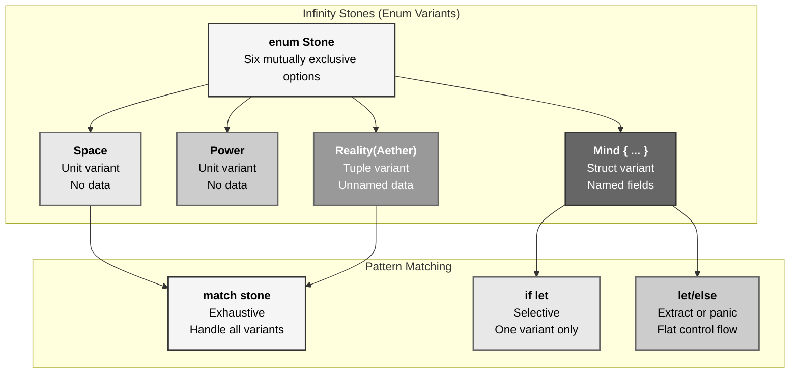
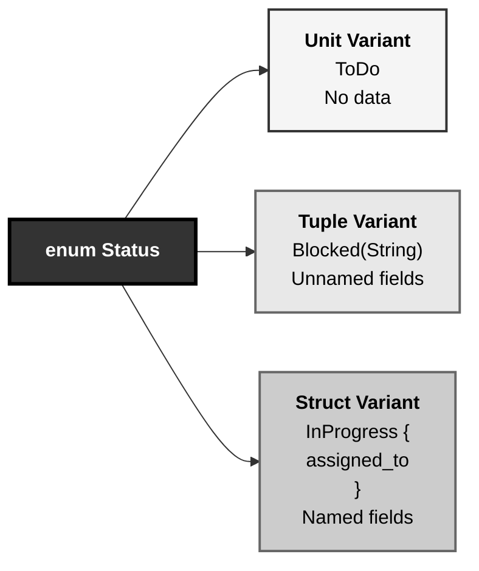
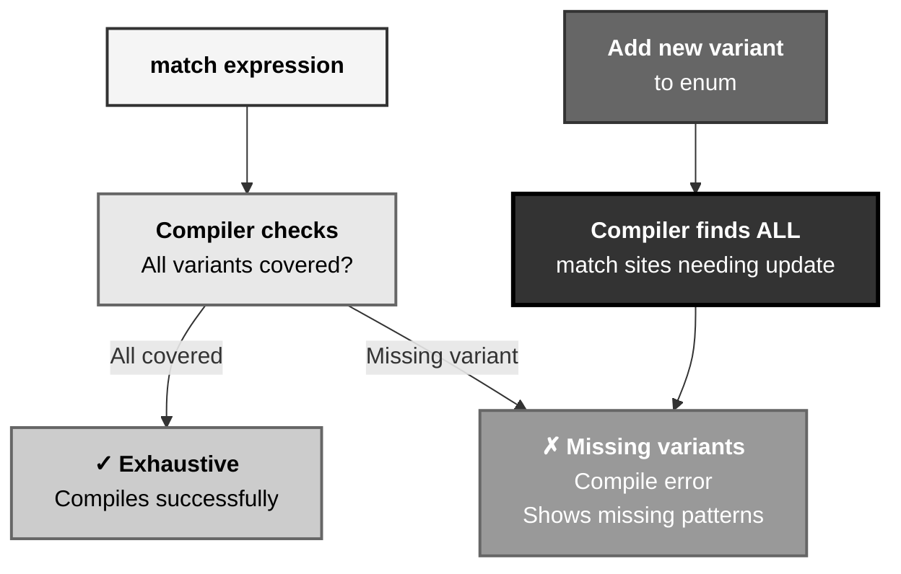
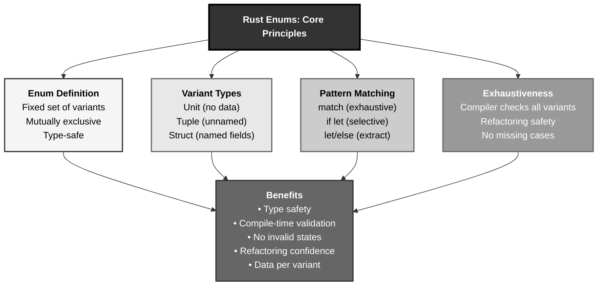

# Rust Enums: The Infinity Stones Selection Pattern

## The Answer (Minto Pyramid)

**Enums in Rust define types with a fixed set of possible values (variants), enabling type-safe representation of mutually exclusive options through pattern matching (match, if let, let/else), with variants that can hold data (unit, tuple, struct-like), providing compile-time exhaustiveness checking that prevents missing cases and enables compiler-driven refactoring when variants change.**

An enum (enumeration) is a type defined with the `enum` keyword listing all possible variants. Unlike C-style enums that are just named constants, Rust enums can attach data to variants—unit variants (no data), tuple variants (unnamed fields), or struct-like variants (named fields). **Pattern matching** via `match` is exhaustive—the compiler ensures all variants are handled. Shorthand syntax (`if let`, `let/else`) handles specific variants without full match. Enums model mutually exclusive states at compile time, eliminating entire classes of runtime errors.

**Three Supporting Principles:**

1. **Type-Level State Machine**: Enums encode valid states at compile time
2. **Exhaustive Matching**: Compiler enforces handling all variants
3. **Data-Carrying Variants**: Each variant can hold different data types

**Why This Matters**: Enums are Rust's most powerful data modeling feature. They replace null pointers, error codes, and runtime validation with compile-time guarantees, enabling "make illegal states unrepresentable" design.

---

## The MCU Metaphor: Infinity Stones Selection

Think of Rust enums like choosing which Infinity Stone to wield—mutually exclusive, type-safe options:

### The Mapping

| Infinity Stones | Rust Enums |
|----------------|------------|
| **Six stones (mutually exclusive)** | Enum type (fixed variants) |
| **Space Stone** | Unit variant (no data) |
| **Power Stone** | Unit variant (no data) |
| **Reality Stone (Aether form)** | Tuple variant (unnamed data) |
| **Mind Stone (in scepter)** | Struct-like variant (named fields) |
| **Stone selection** | Pattern matching (match) |
| **Thanos checking stones** | Exhaustive matching |
| **Specific stone check** | if let (selective matching) |
| **Stone swap** | let/else (extract or panic) |
| **Gauntlet state** | Enum with data variants |

### The Story

The Infinity Stones demonstrate perfect enum patterns:

**Six Stones (`enum` Definition)**: The universe has exactly six Infinity Stones—Space, Power, Reality, Mind, Time, Soul. You can't wield seventh stone; you can't create "Lightning Stone." This is an **enum**: a fixed set of mutually exclusive options. At any moment, you're either holding Space Stone OR Power Stone OR Reality Stone—never two simultaneously in one variable. Like `enum Stone { Space, Power, Reality, Mind, Time, Soul }`—the type system enforces "exactly one of these."

**Stone Types (`Variants with Data`)**: Stones exist in different forms. The **Space Stone** is a simple cube—a **unit variant** with no additional data. The **Reality Stone** appears as the Aether, a liquid form—a **tuple variant** carrying unnamed data like `Reality(AetherVolume)`. The **Mind Stone** was embedded in Loki's scepter with specific properties—a **struct-like variant** with named fields: `Mind { container: Scepter, wielder: String }`. Each variant can carry different data types based on what that stone needs.

**Stone Selection (`match`)**: When Thanos checks which stone he's obtained, he uses **pattern matching**. `match stone { Stone::Space => open_portals(), Stone::Power => destroy_planets(), Stone::Reality => alter_matter(), ... }`. The compiler is **exhaustive**—if Thanos forgets to handle the Time Stone, Rust stops him at compile time: "error: pattern `Time` not covered." This is **compiler-driven refactoring**: add a new stone variant, and Rust shows every place in the codebase that needs updating.

**Specific Stone Check (`if let`)**: Sometimes you only care about one stone. Instead of matching all six, use `if let`: "If this is the Mind Stone, extract its wielder; otherwise, I don't care." `if let Stone::Mind { wielder } = stone { contact(wielder) }`. Concise when you only need one variant.

**Stone Swap (`let/else`)**: When extracting data from a specific variant or panicking, use `let/else`: `let Stone::Mind { wielder } = stone else { panic!("Not Mind Stone!") }; use_wielder(wielder);`. Flat control flow without nesting.

Similarly, Rust enums provide type-safe alternatives: define fixed options (six stones), attach variant-specific data (stone forms), match exhaustively (Thanos checks), handle specific cases (`if let` for targeted checks), and extract or panic (`let/else` for assertions). The compiler prevents missing cases—no stone slips through unhandled.

---

## The Problem Without Enums

Before enums, developers use strings or integers to represent limited options:

```rust path=null start=null
// ❌ String-based state: no compile-time safety
struct Ticket {
    status: String,  // Could be "To-Do", "In Progress", "Done"... or "garbage"
}

impl Ticket {
    fn new(status: String) -> Self {
        // Runtime validation required!
        if status != "To-Do" && status != "In Progress" && status != "Done" {
            panic!("Invalid status");
        }
        Ticket { status }
    }
}

// ❌ Integer constants: no type safety
const STATUS_TODO: i32 = 0;
const STATUS_IN_PROGRESS: i32 = 1;
const STATUS_DONE: i32 = 2;

struct Ticket {
    status: i32,  // Could be 0, 1, 2... or 999
}

// ❌ No compile-time exhaustiveness checking
fn process(status: String) {
    if status == "To-Do" {
        // ...
    } else if status == "In Progress" {
        // ...
    }
    // Forgot "Done"! No compiler error.
}
```

**Problems:**

1. **No Type Safety**: Strings/integers allow invalid values
2. **Runtime Validation**: Must check validity at runtime
3. **No Exhaustiveness**: Compiler can't detect missing cases
4. **No Refactoring Safety**: Adding new state breaks code silently
5. **No Data Attachment**: Can't associate variant-specific data

---

## The Solution: Enum Definition and Matching

Rust provides enums with exhaustive pattern matching:

### Basic Enum Definition

```rust path=null start=null
// Define enum with fixed variants
enum Status {
    ToDo,
    InProgress,
    Done,
}

// Now Status is a type - only these three values possible
let status = Status::ToDo;
```

### Pattern Matching with match

```rust path=null start=null
enum Status {
    ToDo,
    InProgress,
    Done,
}

fn is_done(status: &Status) -> bool {
    match status {
        Status::Done => true,
        Status::InProgress | Status::ToDo => false,
    }
}

// Multiple patterns with |
fn needs_attention(status: &Status) -> bool {
    match status {
        Status::ToDo | Status::InProgress => true,
        Status::Done => false,
    }
}
```

### Exhaustiveness Checking

```rust path=null start=null
enum Status {
    ToDo,
    InProgress,
    Done,
}

// ❌ Compiler error: non-exhaustive
// fn process(status: &Status) {
//     match status {
//         Status::ToDo => println!("Todo"),
//         Status::InProgress => println!("In Progress"),
//         // Missing Done! Compile error.
//     }
// }

// ✅ Catch-all with _
fn process(status: &Status) {
    match status {
        Status::Done => println!("Complete"),
        _ => println!("Not done"),  // Handles all other variants
    }
}
```

### Variants with Data

```rust path=null start=null
enum Status {
    ToDo,
    InProgress { assigned_to: String },  // Struct-like variant
    Done,
}

// Access data via pattern matching
fn get_assignee(status: &Status) -> Option<&str> {
    match status {
        Status::InProgress { assigned_to } => Some(assigned_to),
        _ => None,
    }
}

// Create instances
let status = Status::InProgress {
    assigned_to: String::from("Alice"),
};
```

---

## Visual Mental Model



### Variant Types



### Exhaustive Matching Flow



---

## Anatomy of Enums

### 1. Basic Enum Definition

```rust path=null start=null
// C-style enum: just labels
enum Status {
    ToDo,
    InProgress,
    Done,
}

// Usage
let status = Status::ToDo;

// Must derive traits explicitly
#[derive(Debug, PartialEq, Clone)]
enum Status {
    ToDo,
    InProgress,
    Done,
}

// Now can debug print, compare, clone
let s1 = Status::ToDo;
let s2 = Status::ToDo;
println!("{:?}", s1);  // ToDo
assert_eq!(s1, s2);    // Works with PartialEq
```

### 2. Exhaustive Pattern Matching

```rust path=null start=null
enum Shape {
    Circle,
    Square,
    Rectangle,
    Triangle,
    Pentagon,
}

impl Shape {
    fn sides(&self) -> u8 {
        match self {
            Shape::Circle => 0,
            Shape::Triangle => 3,
            Shape::Square | Shape::Rectangle => 4,
            Shape::Pentagon => 5,
        }
    }
}

// Catch-all pattern
fn is_quadrilateral(shape: &Shape) -> bool {
    match shape {
        Shape::Square | Shape::Rectangle => true,
        _ => false,  // Handles all other variants
    }
}
```

### 3. Variants with Data

```rust path=null start=null
// Mix of variant types
enum Message {
    Quit,                       // Unit variant
    Move { x: i32, y: i32 },   // Struct-like variant
    Write(String),              // Tuple variant
    ChangeColor(u8, u8, u8),   // Tuple variant (3 fields)
}

// Pattern matching with data extraction
fn process(msg: Message) {
    match msg {
        Message::Quit => {
            println!("Quit");
        }
        Message::Move { x, y } => {
            println!("Move to ({}, {})", x, y);
        }
        Message::Write(text) => {
            println!("Write: {}", text);
        }
        Message::ChangeColor(r, g, b) => {
            println!("Color: RGB({}, {}, {})", r, g, b);
        }
    }
}

fn main() {
    process(Message::Quit);
    process(Message::Move { x: 10, y: 20 });
    process(Message::Write(String::from("Hello")));
    process(Message::ChangeColor(255, 0, 0));
}
```

### 4. if let and let/else

```rust path=null start=null
enum Status {
    ToDo,
    InProgress { assigned_to: String },
    Done,
}

// if let: handle one variant
fn print_assignee(status: &Status) {
    if let Status::InProgress { assigned_to } = status {
        println!("Assigned to: {}", assigned_to);
    } else {
        println!("Not assigned");
    }
}

// let/else: extract or early return
fn get_assignee(status: &Status) -> &str {
    let Status::InProgress { assigned_to } = status else {
        panic!("Only InProgress tickets have assignees");
    };
    assigned_to
}

// Concise compared to match
fn get_assignee_match(status: &Status) -> &str {
    match status {
        Status::InProgress { assigned_to } => assigned_to,
        _ => panic!("Only InProgress tickets have assignees"),
    }
}
```

### 5. Enum Methods

```rust path=null start=null
#[derive(Debug, PartialEq)]
enum Status {
    ToDo,
    InProgress { assigned_to: String },
    Done,
}

impl Status {
    fn is_done(&self) -> bool {
        matches!(self, Status::Done)
    }
    
    fn is_in_progress(&self) -> bool {
        matches!(self, Status::InProgress { .. })
    }
    
    fn assignee(&self) -> Option<&str> {
        match self {
            Status::InProgress { assigned_to } => Some(assigned_to),
            _ => None,
        }
    }
    
    fn description(&self) -> &str {
        match self {
            Status::ToDo => "To-Do",
            Status::InProgress { .. } => "In Progress",
            Status::Done => "Done",
        }
    }
}

fn main() {
    let status = Status::InProgress {
        assigned_to: String::from("Alice"),
    };
    
    assert!(status.is_in_progress());
    assert_eq!(status.assignee(), Some("Alice"));
    assert_eq!(status.description(), "In Progress");
}
```

---

## Common Enum Patterns

### Pattern 1: State Machine

```rust path=null start=null
enum ConnectionState {
    Disconnected,
    Connecting,
    Connected { session_id: String },
    Error { message: String },
}

struct Connection {
    state: ConnectionState,
}

impl Connection {
    fn new() -> Self {
        Connection {
            state: ConnectionState::Disconnected,
        }
    }
    
    fn connect(&mut self, session_id: String) {
        match &self.state {
            ConnectionState::Disconnected => {
                self.state = ConnectionState::Connecting;
                // ... connection logic
                self.state = ConnectionState::Connected { session_id };
            }
            _ => println!("Already connecting/connected"),
        }
    }
    
    fn is_connected(&self) -> bool {
        matches!(self.state, ConnectionState::Connected { .. })
    }
}
```

### Pattern 2: Result-Like Custom Types

```rust path=null start=null
enum HttpResponse {
    Ok { body: String, status: u16 },
    Redirect { location: String },
    ClientError { code: u16, message: String },
    ServerError { code: u16, message: String },
}

impl HttpResponse {
    fn is_success(&self) -> bool {
        matches!(self, HttpResponse::Ok { .. })
    }
    
    fn status_code(&self) -> u16 {
        match self {
            HttpResponse::Ok { status, .. } => *status,
            HttpResponse::Redirect { .. } => 302,
            HttpResponse::ClientError { code, .. } => *code,
            HttpResponse::ServerError { code, .. } => *code,
        }
    }
}
```

### Pattern 3: Nested Enums

```rust path=null start=null
enum PaymentMethod {
    CreditCard {
        number: String,
        exp: (u8, u16),
    },
    PayPal {
        email: String,
    },
    BankTransfer {
        account: String,
        routing: String,
    },
}

enum PaymentStatus {
    Pending,
    Processing {
        method: PaymentMethod,
    },
    Completed {
        method: PaymentMethod,
        transaction_id: String,
    },
    Failed {
        method: PaymentMethod,
        error: String,
    },
}

fn process_payment(status: &PaymentStatus) {
    match status {
        PaymentStatus::Processing { method } => {
            match method {
                PaymentMethod::CreditCard { number, .. } => {
                    println!("Processing card ending in {}", &number[number.len()-4..]);
                }
                PaymentMethod::PayPal { email } => {
                    println!("Processing PayPal for {}", email);
                }
                PaymentMethod::BankTransfer { .. } => {
                    println!("Processing bank transfer");
                }
            }
        }
        _ => {}
    }
}
```

### Pattern 4: Enum with Associated Data and Methods

```rust path=null start=null
#[derive(Debug)]
enum Task {
    Todo { description: String },
    InProgress { description: String, assignee: String },
    Done { description: String, completed_by: String },
}

impl Task {
    fn description(&self) -> &str {
        match self {
            Task::Todo { description } => description,
            Task::InProgress { description, .. } => description,
            Task::Done { description, .. } => description,
        }
    }
    
    fn assign(&mut self, assignee: String) {
        if let Task::Todo { description } = self {
            *self = Task::InProgress {
                description: description.clone(),
                assignee,
            };
        }
    }
    
    fn complete(&mut self, completed_by: String) {
        match self {
            Task::InProgress { description, .. } => {
                *self = Task::Done {
                    description: description.clone(),
                    completed_by,
                };
            }
            _ => {}
        }
    }
}
```

### Pattern 5: Discriminated Union (Replace Inheritance)

```rust path=null start=null
// Instead of inheritance, use enums
enum Shape {
    Circle { radius: f64 },
    Rectangle { width: f64, height: f64 },
    Triangle { base: f64, height: f64 },
}

impl Shape {
    fn area(&self) -> f64 {
        match self {
            Shape::Circle { radius } => std::f64::consts::PI * radius * radius,
            Shape::Rectangle { width, height } => width * height,
            Shape::Triangle { base, height } => 0.5 * base * height,
        }
    }
    
    fn perimeter(&self) -> f64 {
        match self {
            Shape::Circle { radius } => 2.0 * std::f64::consts::PI * radius,
            Shape::Rectangle { width, height } => 2.0 * (width + height),
            Shape::Triangle { base, height } => {
                // Simplified - assume isosceles
                let side = (height * height + (base / 2.0).powi(2)).sqrt();
                base + 2.0 * side
            }
        }
    }
}

fn main() {
    let shapes = vec![
        Shape::Circle { radius: 5.0 },
        Shape::Rectangle { width: 4.0, height: 6.0 },
        Shape::Triangle { base: 3.0, height: 4.0 },
    ];
    
    for shape in &shapes {
        println!("Area: {:.2}, Perimeter: {:.2}", shape.area(), shape.perimeter());
    }
}
```

---

## Real-World Use Cases

### Use Case 1: Configuration Options

```rust path=null start=null
enum LogLevel {
    Debug,
    Info,
    Warning,
    Error,
}

enum LogDestination {
    Console,
    File { path: String },
    Remote { url: String, api_key: String },
}

struct Logger {
    level: LogLevel,
    destination: LogDestination,
}

impl Logger {
    fn log(&self, level: LogLevel, message: &str) {
        // Check if should log based on level
        if !self.should_log(&level) {
            return;
        }
        
        let formatted = format!("[{:?}] {}", level, message);
        
        match &self.destination {
            LogDestination::Console => {
                println!("{}", formatted);
            }
            LogDestination::File { path } => {
                // Write to file
                println!("Writing to {}: {}", path, formatted);
            }
            LogDestination::Remote { url, .. } => {
                // Send to remote
                println!("Sending to {}: {}", url, formatted);
            }
        }
    }
    
    fn should_log(&self, level: &LogLevel) -> bool {
        // Simplified level checking
        true
    }
}
```

### Use Case 2: Command Pattern

```rust path=null start=null
enum Command {
    CreateUser { name: String, email: String },
    DeleteUser { id: u64 },
    UpdateUser { id: u64, name: Option<String>, email: Option<String> },
    ListUsers,
}

fn execute_command(cmd: Command) {
    match cmd {
        Command::CreateUser { name, email } => {
            println!("Creating user: {} ({})", name, email);
        }
        Command::DeleteUser { id } => {
            println!("Deleting user: {}", id);
        }
        Command::UpdateUser { id, name, email } => {
            println!("Updating user {}", id);
            if let Some(n) = name {
                println!("  New name: {}", n);
            }
            if let Some(e) = email {
                println!("  New email: {}", e);
            }
        }
        Command::ListUsers => {
            println!("Listing all users");
        }
    }
}

fn main() {
    let commands = vec![
        Command::CreateUser {
            name: "Alice".to_string(),
            email: "alice@example.com".to_string(),
        },
        Command::UpdateUser {
            id: 1,
            name: Some("Alice Smith".to_string()),
            email: None,
        },
        Command::ListUsers,
    ];
    
    for cmd in commands {
        execute_command(cmd);
    }
}
```

### Use Case 3: Parser/AST Nodes

```rust path=null start=null
enum Expression {
    Number(f64),
    Add(Box<Expression>, Box<Expression>),
    Subtract(Box<Expression>, Box<Expression>),
    Multiply(Box<Expression>, Box<Expression>),
    Divide(Box<Expression>, Box<Expression>),
}

impl Expression {
    fn evaluate(&self) -> f64 {
        match self {
            Expression::Number(n) => *n,
            Expression::Add(left, right) => left.evaluate() + right.evaluate(),
            Expression::Subtract(left, right) => left.evaluate() - right.evaluate(),
            Expression::Multiply(left, right) => left.evaluate() * right.evaluate(),
            Expression::Divide(left, right) => left.evaluate() / right.evaluate(),
        }
    }
}

fn main() {
    // Represents: (5 + 3) * 2
    let expr = Expression::Multiply(
        Box::new(Expression::Add(
            Box::new(Expression::Number(5.0)),
            Box::new(Expression::Number(3.0)),
        )),
        Box::new(Expression::Number(2.0)),
    );
    
    println!("Result: {}", expr.evaluate());  // 16.0
}
```

---

## Key Takeaways



### The Mental Model

Think of enums like Infinity Stones:
- **Six stones** → Fixed enum variants (mutually exclusive)
- **Different stone forms** → Unit, tuple, struct-like variants
- **Thanos checking** → Exhaustive pattern matching
- **Specific stone search** → if let (selective handling)

### Core Principles

1. **Enum Definition**: Fixed set of variants, mutually exclusive at type level
2. **Variant Types**: Unit (no data), tuple (unnamed fields), struct-like (named fields)
3. **Pattern Matching**: `match` exhaustive, `if let` selective, `let/else` extract-or-panic
4. **Exhaustiveness**: Compiler ensures all variants handled, enables safe refactoring
5. **Data Attachment**: Each variant carries different data types as needed

### The Guarantee

Rust enums provide:
- **Type Safety**: Invalid states unrepresentable at compile time
- **Exhaustiveness**: Compiler catches missing match arms
- **Refactoring Confidence**: Adding variants shows all update sites
- **Zero Runtime Overhead**: Match compiles to efficient jump tables

All with **"make illegal states unrepresentable"** design philosophy.

---

**Remember**: Enums aren't just named constants—they're **type-level state machines with compile-time validation**. Like Infinity Stones (mutually exclusive options, different forms, exhaustive checking), enums encode valid states at the type level, carry variant-specific data, and require exhaustive matching. The compiler prevents missing cases (pattern not covered), enables compiler-driven refactoring (add variant, fix all matches), and eliminates entire classes of bugs (invalid states, missing handlers). Choose your stone wisely, match exhaustively, let the compiler guide your refactoring. Six stones, zero runtime errors.
