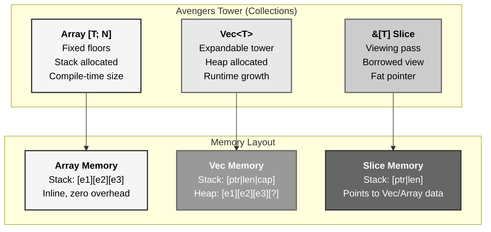
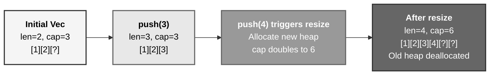
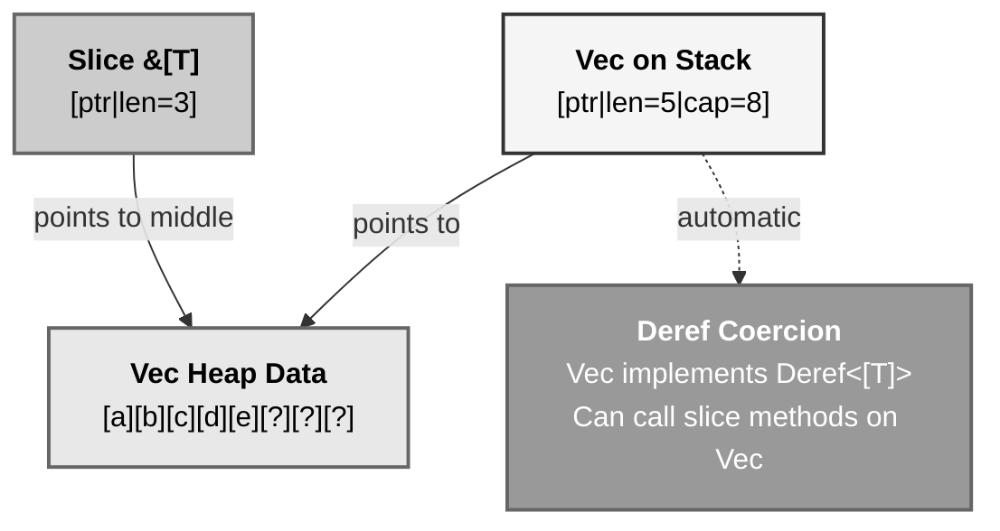
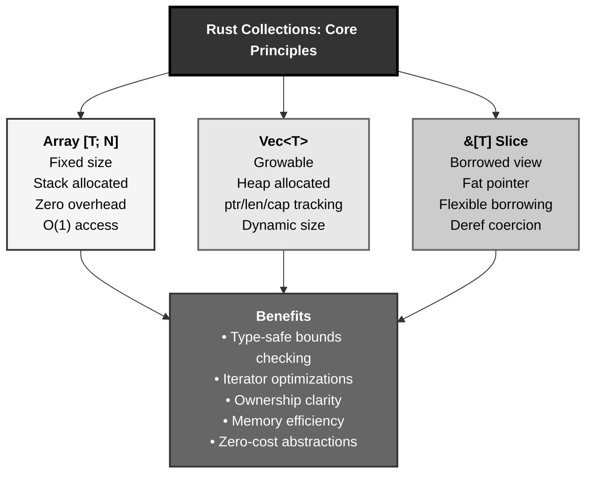

# Rust Collections: The Avengers Tower Floors System

## The Answer (Minto Pyramid)

**Rust provides three fundamental collection types for storing multiple values: fixed-size arrays ([T; N]) allocated on the stack with compile-time known size, growable vectors (Vec<T>) allocated on the heap with runtime-determined capacity and length, and slice references (&[T] or &mut [T]) providing views into contiguous sequences without ownership—arrays offer O(1) access with zero memory overhead but inflexible size, Vec provides dynamic growth with push/pop/resize operations and three-field memory layout (pointer/length/capacity), while slices enable flexible borrowing of subsets with fat-pointer representation (pointer + length) and deref coercion from Vec to &[T].**

Arrays (`[T; N]`) have fixed size known at compile time, stored entirely on the stack. Vectors (`Vec<T>`) allocate on the heap, track length (elements used) and capacity (space reserved), and automatically resize when full. Slices (`&[T]`) are fat pointers (pointer + length) referencing contiguous data without ownership, created from arrays or vectors via `&arr[..]` or `.as_slice()`. **The key insight**: arrays = stack + fixed, Vec = heap + growable, slices = borrowed views.

**Three Supporting Principles:**

1. **Stack vs Heap Allocation**: Arrays on stack (fixed), Vec on heap (dynamic)
2. **Ownership vs Borrowing**: Vec owns, slices borrow with fat pointers
3. **Iterator Optimization**: Iteration removes bounds checks, prefer `for x in &vec` over `for i in 0..vec.len()`

**Why This Matters**: Collections are the workhorses of Rust programs. Choosing the right type (array/Vec/slice) based on size knowledge, ownership needs, and performance requirements is fundamental to idiomatic Rust.

---

## The MCU Metaphor: Avengers Tower Floor System

Think of Rust collections like managing floors in Avengers Tower—fixed layouts, expandable space, and flexible access:

### The Mapping

| Avengers Tower | Rust Collections |
|----------------|------------------|
| **Original fixed floors (1-10)** | Array `[T; N]` (compile-time size) |
| **Expandable tower (Stark upgrades)** | `Vec<T>` (heap-allocated, growable) |
| **Floor viewing pass** | Slice `&[T]` (borrowed view) |
| **Elevator access (floor number)** | Indexing `vec[i]` or `arr[i]` |
| **Tower expansion (add floors)** | `vec.push()` and resize |
| **Floor manifest (count)** | `vec.len()` (length field) |
| **Building capacity (max before expansion)** | `vec.capacity()` |
| **Floor inspection tour** | Iterator `.iter()` |
| **Partial floor access (floors 5-8)** | Slice `&vec[5..8]` |
| **Construction crew tracking** | Memory layout (pointer/length/capacity) |

### The Story

The Avengers Tower demonstrates perfect collection patterns:

**Original Fixed Floors (`[T; N]` Array)**: Stark Industries built Avengers Tower with **10 fixed floors**—the architectural blueprint specified exactly 10 levels, each with precise measurements. You can't add an 11th floor without demolishing and rebuilding; the structure is baked into the foundation. This is a **stack-allocated array**: `let floors: [Office; 10] = [...]`. The compiler knows at compile time how many floors exist—the entire structure sits in the stack memory frame, no heap allocation, O(1) access to any floor (`floors[3]`), but **immutable size**. If you need 11 floors, you need a new tower. Perfect when size is known upfront (e.g., 12 months in a year, 7 days a week).

**Expandable Tower (`Vec<T>`)**: Then Stark upgraded—**Tony Stark's Modular Tower**. The original 10 floors live on the heap, with a **construction crew tracking three things**: (1) pointer to the current tower location, (2) **length** (how many floors are currently occupied, say 10), (3) **capacity** (how many floors fit before needing expansion, say 12). When you `tower.push(new_floor)`, if length < capacity, just add the floor. If length == capacity, Stark's team **resizes**: allocate a bigger plot of land (new heap memory, usually 2x capacity), copy all 10 floors over, deallocate the old site, then add the 11th floor. This is **`Vec<T>`**—heap-allocated, growable, tracks length and capacity separately. Use `Vec::with_capacity(20)` if you know you'll need 20 floors upfront to avoid mid-construction resizing overhead.

**Floor Viewing Pass (`&[T]` Slice)**: The Avengers don't need full ownership of the tower to visit floors—they get a **viewing pass** that specifies which floors they can access. Natasha gets a pass for floors 5-8 (`&tower[5..8]`). The pass is a **fat pointer**: (1) pointer to floor 5's address, (2) length = 4 floors. She can inspect (read-only) those 4 floors without owning the tower, and the pass expires when she's done (lifetime ends). This is **`&[T]`**—a borrowed slice. If she needs to modify, get a mutable pass (`&mut [T]`), but she still can't add/remove floors, only modify existing ones. Slices enable flexible borrowing: pass `&[T]` to functions instead of `&Vec<T>` to accept any contiguous sequence (Vec slices, array slices, subsets).

**Elevator Access (Indexing)**: To visit floor 7, take the elevator (`tower[7]`). The elevator checks bounds—if you press floor 25 and there are only 10 floors, the elevator **panics** (runtime bounds check). For safe access, use `tower.get(7)` which returns `Option<&Office>`—`Some(&office)` if floor 7 exists, `None` if out of bounds. Rust always bounds-checks array/Vec indexing at runtime unless the compiler can prove it's safe (e.g., iterators guarantee in-bounds access, allowing optimization).

**Floor Inspection Tour (Iterators)**: Instead of visiting each floor by number (`for i in 0..tower.len() { visit(tower[i]) }`), take a guided tour: `for office in &tower { visit(office) }`. The tour guide (iterator) guarantees you'll visit every floor exactly once, in order, without going out of bounds. This lets Rust **remove bounds checks** from the compiled code—the tour is provably safe. Use `.iter()` for explicit iteration or `&tower` in for loops (implements `IntoIterator` for `&Vec<T>`). The iterator returns `&Office` references without consuming the tower.

Similarly, Rust collections provide: fixed arrays (stack-allocated, compile-time size), growable Vec (heap, length + capacity), and borrowed slices (fat pointers, flexible views). Arrays optimize for zero overhead, Vec optimizes for dynamic growth, slices optimize for flexible borrowing. The compiler ensures bounds safety, ownership rules prevent use-after-free, and iterators enable zero-cost abstractions.

---

## The Problem Without Proper Collections

Before understanding Rust's collection types, developers face these issues:

```rust path=null start=null
// ❌ Array: fixed size, can't grow
let mut tickets: [Ticket; 10] = [...];
// What if we need 11 tickets? Can't add!

// ❌ Trying runtime-sized array
let n = get_ticket_count(); // Only known at runtime
let tickets: [Ticket; n];    // ❌ Compile error: non-constant value

// ❌ Manual heap allocation (unsafe, error-prone)
let ptr = unsafe { std::alloc::alloc(...) };
// No automatic cleanup, bounds checking, or resize logic

// ❌ Vec indexing without bounds checking awareness
let tickets = vec![...];
let ticket = tickets[100]; // Panics if out of bounds!

// ❌ Not using slices, forcing unnecessary ownership
fn process_tickets(tickets: Vec<Ticket>) { // Takes ownership!
    // Caller loses tickets after this call
}
```

**Problems:**

1. **Fixed Array Size**: Arrays require compile-time size, can't handle dynamic data
2. **Manual Growth**: No built-in mechanism for resizing collections
3. **Ownership Confusion**: Passing entire Vec transfers ownership unnecessarily
4. **Bounds Check Overhead**: Manual indexing slower than iterator-based access
5. **No Flexible Views**: Can't easily work with subsets of collections

---

## The Solution: Arrays, Vec, and Slices

Rust provides three collection primitives with clear tradeoffs:

### Fixed-Size Arrays

```rust path=null start=null
// Array type syntax: [<type>; <count>]
let numbers: [u32; 3] = [1, 2, 3];

// Repeat value syntax
let zeros: [i32; 5] = [0; 5]; // [0, 0, 0, 0, 0]

// Access with bounds checking
let first = numbers[0];           // 1
let maybe = numbers.get(10);      // None (no panic)

// Stack allocation, zero overhead
// Memory: just the three u32 values side-by-side
```

### Growable Vectors

```rust path=null start=null
// Create empty vector
let mut tickets: Vec<Ticket> = Vec::new();

// Initialize with values
let numbers = vec![1, 2, 3];

// Add elements
tickets.push(ticket1);
tickets.push(ticket2);

// Pre-allocate capacity
let mut v = Vec::with_capacity(100); // No reallocation until 100 elements

// Memory layout: pointer, length, capacity on stack
// Actual data on heap
```

### Slice References

```rust path=null start=null
let numbers = vec![1, 2, 3, 4, 5];

// Full slice
let slice: &[i32] = &numbers[..];
// Or via method
let slice: &[i32] = numbers.as_slice();

// Partial slice (subset)
let subset: &[i32] = &numbers[1..4]; // [2, 3, 4]

// Mutable slice
let mut numbers = vec![1, 2, 3];
let slice: &mut [i32] = &mut numbers;
slice[0] = 42; // Modify first element
```

---

## Visual Mental Model



### Vec Growth and Resize



### Slice vs Vec Relationship



---

## Anatomy of Collections

### 1. Array Basics

```rust path=null start=null
// Fixed-size array
let numbers: [u32; 5] = [1, 2, 3, 4, 5];

// Repeat syntax
let zeros = [0; 100]; // 100 zeros

// Indexing with bounds checking
assert_eq!(numbers[0], 1);
assert_eq!(numbers.get(10), None); // Safe access

// Arrays are stack-allocated
fn stack_allocated() {
    let arr = [1, 2, 3]; // Lives on this function's stack frame
} // arr dropped when function exits

// Size is part of the type
fn takes_array_of_three(arr: [i32; 3]) {
    // Only accepts arrays of exactly 3 elements
}

// Arrays of different sizes are different types
let a: [i32; 3] = [1, 2, 3];
let b: [i32; 5] = [1, 2, 3, 4, 5];
// `a` and `b` have different types!
```

### 2. Vec Fundamentals

```rust path=null start=null
// Creating vectors
let mut v1: Vec<i32> = Vec::new();
let v2 = vec![1, 2, 3];
let v3 = Vec::with_capacity(10);

// Adding elements
v1.push(1);
v1.push(2);
v1.push(3);

// Removing elements
let last = v1.pop(); // Returns Option<T>
assert_eq!(last, Some(3));

// Accessing elements
assert_eq!(v2[0], 1);
assert_eq!(v2.get(0), Some(&1));
assert_eq!(v2.get(10), None);

// Length and capacity
let mut v = Vec::with_capacity(5);
assert_eq!(v.len(), 0);        // No elements yet
assert_eq!(v.capacity(), 5);   // Space for 5

v.push(1);
v.push(2);
assert_eq!(v.len(), 2);
assert_eq!(v.capacity(), 5);   // Still 5

// Forcing resize
v.push(3);
v.push(4);
v.push(5);
v.push(6); // Triggers resize, capacity likely doubles
assert_eq!(v.len(), 6);
assert!(v.capacity() >= 6);
```

### 3. Vec Memory Layout

```rust path=null start=null
// Vec structure (conceptual)
// pub struct Vec<T> {
//     ptr: *mut T,        // Pointer to heap
//     len: usize,         // Number of elements
//     capacity: usize,    // Space reserved
// }

let mut v = Vec::with_capacity(3);
v.push(1);
v.push(2);

// Stack (Vec structure):
//   ptr      -> points to heap
//   len      = 2
//   capacity = 3
//
// Heap:
//   [1][2][uninitialized]

// String is just Vec<u8>!
// pub struct String {
//     vec: Vec<u8>,
// }
```

### 4. Slice References

```rust path=null start=null
// Creating slices from Vec
let numbers = vec![1, 2, 3, 4, 5];

let all: &[i32] = &numbers[..];      // All elements
let first_three: &[i32] = &numbers[..3];  // [1, 2, 3]
let from_two: &[i32] = &numbers[2..];     // [3, 4, 5]
let middle: &[i32] = &numbers[1..4];      // [2, 3, 4]

// Slices from arrays
let arr = [1, 2, 3, 4, 5];
let slice: &[i32] = &arr[1..3]; // [2, 3]

// Mutable slices
let mut numbers = vec![1, 2, 3];
let slice: &mut [i32] = &mut numbers[..];
slice[0] = 42;
assert_eq!(numbers[0], 42);

// Slice limitations: can't grow/shrink
let mut v = vec![1, 2, 3];
let slice: &mut [i32] = &mut v;
// slice.push(4); // ❌ Error: no push method on slices!
```

### 5. Deref Coercion

```rust path=null start=null
// Vec implements Deref<Target = [T]>
// This means &Vec<T> can coerce to &[T]

let numbers = vec![1, 2, 3];

// .iter() is actually a method on &[T], not Vec!
// But works on Vec due to deref coercion
let sum: i32 = numbers.iter().sum();

// Prefer &[T] in function parameters
fn process_slice(s: &[i32]) {
    // Works with Vec, arrays, or any slice
}

process_slice(&numbers);        // Vec
process_slice(&[1, 2, 3]);     // Array
process_slice(&numbers[1..]);  // Slice subset

// But for mutation, &mut Vec is more powerful
fn add_element(v: &mut Vec<i32>) {
    v.push(4); // Can grow the Vec
}

fn modify_slice(s: &mut [i32]) {
    s[0] = 42; // Can only modify existing elements
}
```

---

## Common Collection Patterns

### Pattern 1: Pre-allocate When Size Known

```rust path=null start=null
fn process_data(count: usize) -> Vec<i32> {
    // ✅ Good: pre-allocate to avoid resizing
    let mut results = Vec::with_capacity(count);
    
    for i in 0..count {
        results.push(i as i32 * 2);
    }
    
    results
}

fn process_data_slow(count: usize) -> Vec<i32> {
    // ❌ Slower: multiple reallocations
    let mut results = Vec::new();
    
    for i in 0..count {
        results.push(i as i32 * 2);
    }
    
    results
}
```

### Pattern 2: Iterator Over Indexing

```rust path=null start=null
let numbers = vec![1, 2, 3, 4, 5];

// ✅ Preferred: iterator (no bounds checks in generated code)
for n in &numbers {
    println!("{}", n);
}

// ✅ Also good: explicit .iter()
for n in numbers.iter() {
    println!("{}", n);
}

// ❌ Slower: manual indexing (bounds checks every iteration)
for i in 0..numbers.len() {
    println!("{}", numbers[i]);
}

// Iterators enable optimizations
let sum: i32 = numbers.iter().sum(); // Compiler can vectorize
```

### Pattern 3: Slice Parameters for Flexibility

```rust path=null start=null
// ✅ Good: accepts any contiguous sequence
fn sum_all(values: &[i32]) -> i32 {
    values.iter().sum()
}

// Can call with Vec, array, or slice
let v = vec![1, 2, 3];
let a = [4, 5, 6];

assert_eq!(sum_all(&v), 6);
assert_eq!(sum_all(&a), 15);
assert_eq!(sum_all(&v[1..]), 5); // Subset

// ❌ Less flexible: only accepts Vec
fn sum_vec_only(values: &Vec<i32>) -> i32 {
    values.iter().sum()
}
// Can't call with arrays or slices!
```

### Pattern 4: Collecting Iterator Results

```rust path=null start=null
let numbers = vec![1, 2, 3, 4, 5];

// Collect into Vec
let doubled: Vec<i32> = numbers.iter()
    .map(|&n| n * 2)
    .collect();

// Type hint with turbofish
let doubled = numbers.iter()
    .map(|&n| n * 2)
    .collect::<Vec<i32>>();

// Filter and collect
let evens: Vec<i32> = numbers.iter()
    .filter(|&&n| n % 2 == 0)
    .copied() // Convert &i32 to i32
    .collect();

// Chain operations
let result: Vec<i32> = numbers.iter()
    .filter(|&&n| n > 2)
    .map(|&n| n * n)
    .collect();
```

### Pattern 5: Safe Element Access

```rust path=null start=null
let numbers = vec![1, 2, 3];

// ❌ Panics if out of bounds
let item = numbers[10]; // Runtime panic!

// ✅ Safe with Option
match numbers.get(10) {
    Some(n) => println!("Found: {}", n),
    None => println!("Out of bounds"),
}

// ✅ Safe with unwrap_or
let item = numbers.get(10).unwrap_or(&0);

// ✅ Safe with if let
if let Some(item) = numbers.get(2) {
    println!("Item: {}", item);
}
```

---

## Real-World Use Cases

### Use Case 1: Fixed-Size Buffers

```rust path=null start=null
// Reading fixed-size data (e.g., file headers, network packets)
fn read_header(file: &mut File) -> std::io::Result<[u8; 16]> {
    let mut buffer = [0u8; 16];
    file.read_exact(&mut buffer)?;
    Ok(buffer)
}

// RGB color (always 3 components)
struct Color {
    rgb: [u8; 3],
}

impl Color {
    fn new(r: u8, g: u8, b: u8) -> Self {
        Color { rgb: [r, g, b] }
    }
}

// Week days (always 7)
const DAYS: [&str; 7] = [
    "Monday", "Tuesday", "Wednesday", "Thursday",
    "Friday", "Saturday", "Sunday"
];
```

### Use Case 2: Dynamic Collections

```rust path=null start=null
// User input with unknown size
fn collect_user_input() -> Vec<String> {
    let mut inputs = Vec::new();
    
    loop {
        let mut line = String::new();
        std::io::stdin().read_line(&mut line).unwrap();
        
        if line.trim() == "done" {
            break;
        }
        
        inputs.push(line.trim().to_string());
    }
    
    inputs
}

// Accumulating results
fn find_all_matches(haystack: &str, needle: &str) -> Vec<usize> {
    haystack
        .match_indices(needle)
        .map(|(i, _)| i)
        .collect()
}

// Growing collection
struct TaskQueue {
    tasks: Vec<Task>,
}

impl TaskQueue {
    fn add(&mut self, task: Task) {
        self.tasks.push(task);
    }
    
    fn next(&mut self) -> Option<Task> {
        if self.tasks.is_empty() {
            None
        } else {
            Some(self.tasks.remove(0))
        }
    }
}
```

### Use Case 3: Efficient Slicing

```rust path=null start=null
// Process chunks without copying
fn process_chunks(data: &[u8], chunk_size: usize) {
    for chunk in data.chunks(chunk_size) {
        // chunk is &[u8], no allocation
        process_chunk(chunk);
    }
}

fn process_chunk(chunk: &[u8]) {
    println!("Processing {} bytes", chunk.len());
}

// Splitting without allocation
fn parse_fields(line: &str) -> Vec<&str> {
    // Returns Vec of &str slices into the original string
    line.split(',').collect()
}

// Window operations
fn moving_average(values: &[f64], window: usize) -> Vec<f64> {
    values
        .windows(window)
        .map(|w| w.iter().sum::<f64>() / window as f64)
        .collect()
}
```

### Use Case 4: Iteration Patterns

```rust path=null start=null
let numbers = vec![1, 2, 3, 4, 5];

// Consuming iteration (takes ownership)
for n in numbers { // numbers moved
    println!("{}", n);
}
// numbers no longer available here

// Borrowing iteration (read-only)
let numbers = vec![1, 2, 3, 4, 5];
for n in &numbers { // borrow
    println!("{}", n); // n is &i32
}
// numbers still available

// Mutable iteration
let mut numbers = vec![1, 2, 3];
for n in &mut numbers { // mutable borrow
    *n *= 2; // n is &mut i32
}
assert_eq!(numbers, vec![2, 4, 6]);

// Explicit iterators
let numbers = vec![1, 2, 3];
let doubled: Vec<i32> = numbers.iter()
    .map(|&n| n * 2)
    .collect();
```

---

## Key Takeaways



### The Mental Model

Think of collections like Avengers Tower floors:
- **Fixed floors (array)** → Stack-allocated, compile-time size, zero overhead
- **Expandable tower (Vec)** → Heap-allocated, tracks length/capacity, auto-resize
- **Viewing pass (slice)** → Borrowed fat pointer, flexible access without ownership

### Core Principles

1. **Arrays `[T; N]`**: Fixed size, stack allocated, compile-time known, O(1) access, zero overhead
2. **Vectors `Vec<T>`**: Growable, heap allocated, tracks pointer/length/capacity, auto-resize on push
3. **Slices `&[T]`**: Borrowed views, fat pointers (ptr + len), work with arrays/Vec/subsets
4. **Iterator Preference**: Use `for x in &vec` over manual indexing—removes bounds checks
5. **Deref Coercion**: `Vec<T>` derefs to `[T]`, enabling slice methods on vectors

### The Guarantee

Rust collections provide:
- **Bounds Safety**: Panics on out-of-bounds indexing, Option for safe access
- **Ownership Tracking**: Vec owns, slices borrow, compiler enforces lifetimes
- **Iterator Optimization**: Zero-cost iteration without manual bounds checks
- **Memory Control**: Explicit heap vs stack, pre-allocation with `with_capacity`

All with **type safety, memory safety, and zero-cost abstractions**.

---

**Remember**: Collections aren't just containers—they're **memory layout strategies with ownership semantics**. Like Avengers Tower floors (fixed vs expandable vs viewing passes), choose arrays for compile-time-known sizes on the stack, Vec for dynamic heap growth, and slices for flexible borrowed access. Prefer `&[T]` parameters over `&Vec<T>` for flexibility, use iterators to eliminate bounds checks, pre-allocate with `Vec::with_capacity` when size is predictable. The compiler guarantees bounds safety, ownership rules prevent use-after-free, and deref coercion bridges Vec and slices. Stack for fixed, heap for growth, slices for views. Ten floors, infinite scalability, zero overhead.
