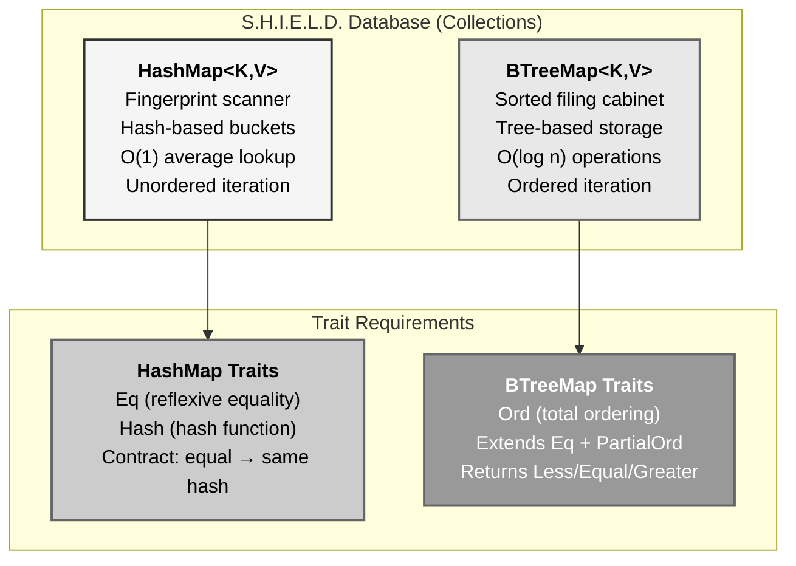
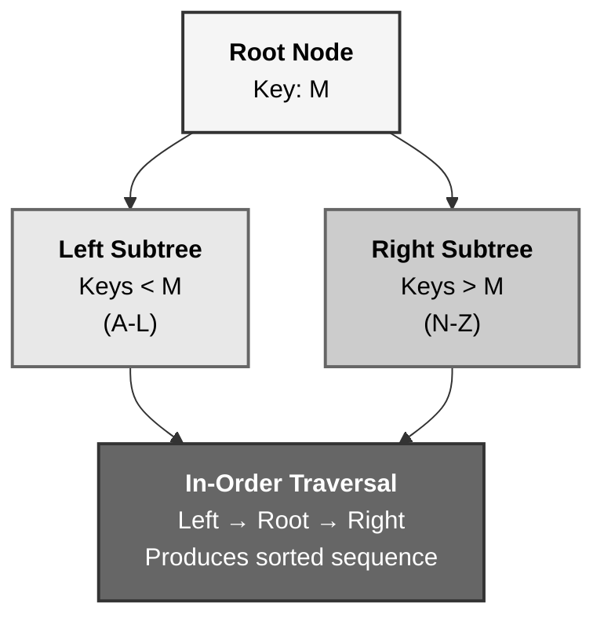
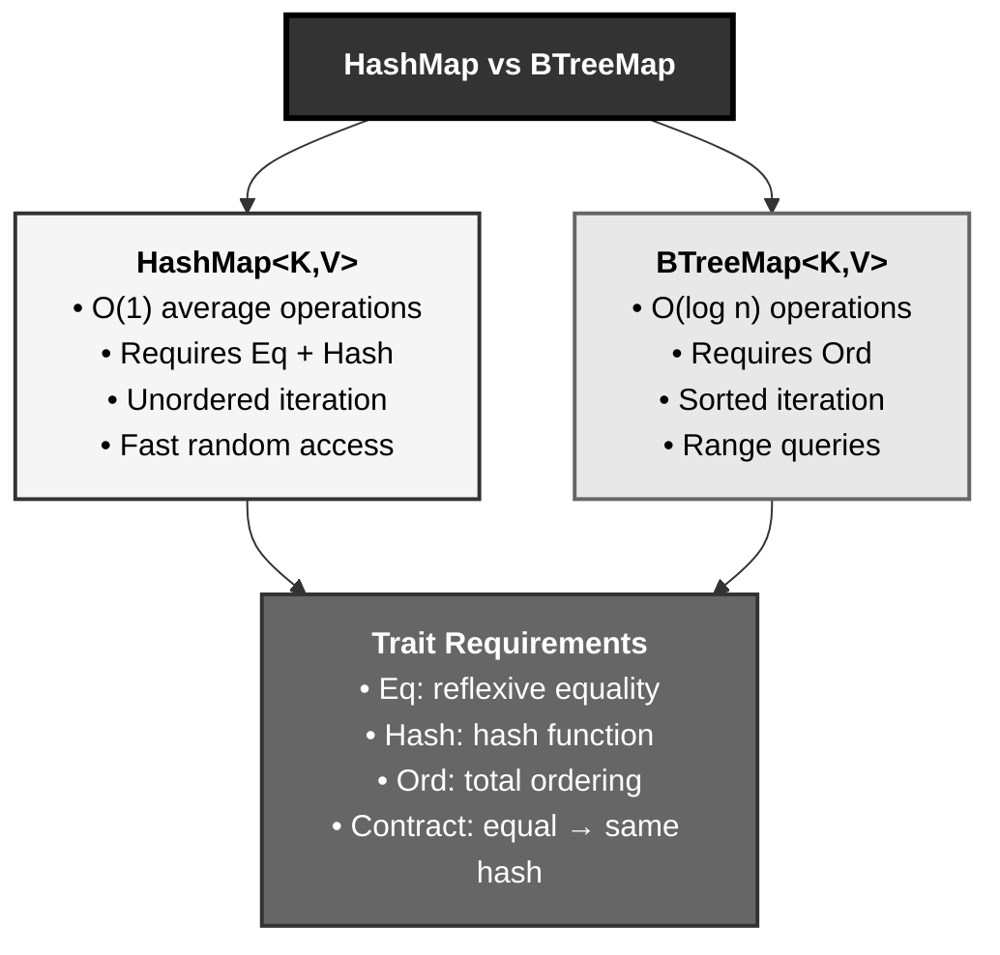

# Rust HashMap and BTreeMap: The S.H.I.E.L.D. Database System

## The Answer (Minto Pyramid)

**Rust provides two key-value collection types from std::collections: HashMap<K, V> using hash-based lookups requiring keys to implement Eq + Hash traits for O(1) average-case operations with unordered iteration, and BTreeMap<K, V> using tree-based storage requiring keys to implement Ord trait for O(log n) operations with sorted iteration—HashMap excels at fast random access via hashing (map key to bucket, handle collisions with Eq), while BTreeMap maintains sorted order enabling range queries and deterministic iteration, with both returning Option<V> for safe access via get() and Option<V> for insert() when replacing existing keys.**

HashMap uses a hash function to map keys to buckets (array indices), storing key-value pairs and handling collisions. Keys must be hashable (`Hash` trait) and comparable for equality with reflexivity (`Eq` extends `PartialEq`). BTreeMap stores entries in a balanced tree sorted by key, requiring total ordering (`Ord` extends `Eq + PartialOrd`). **The key insight**: HashMap = fast + unordered (hash-based), BTreeMap = sorted + predictable (tree-based).

**Three Supporting Principles:**

1. **Trait Requirements**: HashMap needs `Eq + Hash`, BTreeMap needs `Ord`
2. **Performance Trade-offs**: HashMap O(1) average, BTreeMap O(log n) guaranteed
3. **Ordering Guarantees**: HashMap has none, BTreeMap maintains sorted order

**Why This Matters**: Hash maps are fundamental data structures for associative lookups. Understanding trait requirements (Eq/Hash vs Ord) and performance characteristics (O(1) vs O(log n), unordered vs sorted) is essential for choosing the right collection.

---

## The MCU Metaphor: S.H.I.E.L.D. Database System

Think of Rust's key-value maps like S.H.I.E.L.D.'s agent database—fast lookup vs sorted records:

### The Mapping

| S.H.I.E.L.D. Database | Rust HashMap/BTreeMap |
|----------------------|----------------------|
| **Agent ID card (unique)** | Key (must be unique) |
| **Agent profile** | Value |
| **Fingerprint scanner** | Hash function |
| **Biometric hash** | Hash output (`u64`) |
| **Storage vault (numbered)** | HashMap buckets (array) |
| **Fingerprint match check** | `Eq` trait (equality) |
| **Twin agent verification** | Reflexivity (`a == a`) |
| **Sorted filing cabinet** | BTreeMap (ordered tree) |
| **Alphabetical order** | `Ord` trait (comparison) |
| **Range query (agents A-M)** | BTreeMap range operations |

### The Story

The S.H.I.E.L.D. database demonstrates perfect key-value collection patterns:

**Agent ID Lookup (`HashMap`)**: S.H.I.E.L.D. has millions of agents—finding one by ID must be instant. When Agent Romanoff arrives, she scans her ID card. The **biometric scanner** (hash function) reads her fingerprint, computes a **hash** (a `u64` number), and uses that hash to determine which **storage vault** (bucket) contains her profile. The hash `12847` might map to vault #47 (hash % num_vaults). Open vault #47, check if the fingerprint on file **matches exactly** (Eq trait)—if yes, retrieve her profile. This is **O(1) constant time** on average: hash the key, go to the bucket, check equality, done. The **Eq trait** ensures reflexivity: Romanoff's fingerprint always matches itself (`a == a` must be true), critical for retrieval. If the hash collides (two agents hash to the same vault), S.H.I.E.L.D. stores both in vault #47 and checks each with `Eq` until finding the right one.

**Hash Requirements (`Hash + Eq` Traits)**: The fingerprint scanner needs two guarantees: (1) **Hash trait**—every agent can be hashed to a `u64`, (2) **Eq trait**—can check exact equality with reflexivity. Unlike `PartialEq`, `Eq` guarantees reflexivity: `a == a` is always true. Floating-point NaN fails this (`NaN != NaN`), so f32/f64 can't be HashMap keys—if Romanoff's fingerprint was NaN, she couldn't retrieve her own profile! The **Eq and Hash contract**: if two keys are equal, their hashes must be equal. Break this, and the database fails—imagine two agents with identical fingerprints but different hashes; one inserts, the other can't find it.

**Sorted Filing Cabinet (`BTreeMap`)**: Director Fury needs a different system for monthly reports—agents listed **alphabetically by last name**, with fast range queries like "all agents with last names A-M." HashMap can't do this; iteration order is random (vault #47, then #3, then #91...). Enter **BTreeMap**: a balanced tree where entries are **sorted by key**. Insert Agent Carter, Agent Banner, Agent Stark—the tree maintains order: Banner < Carter < Stark. Iteration visits them in order. Need agents A-M? BTreeMap provides `range("A".."N")` in O(log n) time. The trade-off: insertion/retrieval is O(log n) instead of O(1), but you get deterministic order and range queries. The **Ord trait** requires total ordering: every key must be comparable with `cmp()` returning Less, Equal, or Greater. `Ord` extends `Eq + PartialOrd`, ensuring both equality checking and ordering comparison.

**When to Choose Which**: Use **HashMap** for fast lookups when order doesn't matter (agent ID lookup by fingerprint). Use **BTreeMap** when you need sorted iteration or range queries (reports ordered alphabetically). HashMap's unordered iteration visits buckets arbitrarily; BTreeMap's in-order traversal is predictable. Both use `Option<V>` for safe access: `map.get(&key)` returns `Some(&value)` or `None` if key absent, preventing panics.

Similarly, Rust provides HashMap (hash-based, O(1), requires Eq+Hash, unordered) and BTreeMap (tree-based, O(log n), requires Ord, sorted). Choose based on performance needs (fast vs ordered), trait availability (can your key type implement Hash vs Ord?), and access patterns (random lookup vs sorted iteration). The compiler enforces trait bounds—HashMap keys must be Eq+Hash, BTreeMap keys must be Ord—guaranteeing correct behavior.

---

## The Problem Without Key-Value Maps

Before HashMap/BTreeMap, developers use inefficient alternatives:

```rust path=null start=null
// ❌ Linear search in Vec (O(n) lookups)
struct Database {
    entries: Vec<(String, AgentProfile)>, // Key-value pairs
}

impl Database {
    fn find(&self, id: &str) -> Option<&AgentProfile> {
        // O(n) - must check every entry!
        for (key, value) in &self.entries {
            if key == id {
                return Some(value);
            }
        }
        None
    }
}

// ❌ No trait enforcement - manual checking
fn store_key_value(key: SomeType, value: String) {
    // How do we hash SomeType? How do we compare it?
    // Manual implementation error-prone
}

// ❌ Unordered iteration when order matters
let mut ids = vec!["C", "A", "B"];
// Need sorted output but Vec doesn't maintain order
ids.sort(); // Extra O(n log n) step every time

// ❌ No range queries on unordered data
// "Give me all entries with keys 10-20"
// Must check every entry!
```

**Problems:**

1. **O(n) Lookups**: Linear search through Vec for every get/insert/remove
2. **No Hash Abstraction**: Manual hashing implementation, collision handling
3. **Missing Trait Bounds**: No compiler enforcement of Eq/Hash/Ord requirements
4. **Unordered When Needed**: Random iteration order when sorted is required
5. **No Range Queries**: Can't efficiently retrieve subsets of sorted data

---

## The Solution: HashMap and BTreeMap

Rust provides two standard key-value collections with clear trade-offs:

### HashMap Basics

```rust path=null start=null
use std::collections::HashMap;

// Create empty HashMap
let mut scores: HashMap<String, i32> = HashMap::new();

// Insert key-value pairs
scores.insert(String::from("Blue"), 10);
scores.insert(String::from("Red"), 50);

// Access values
let team = String::from("Blue");
let score = scores.get(&team); // Returns Option<&i32>
assert_eq!(score, Some(&10));

// Update value
scores.insert(String::from("Blue"), 25); // Replaces 10

// Remove entry
scores.remove(&String::from("Red"));
```

### BTreeMap Basics

```rust path=null start=null
use std::collections::BTreeMap;

// Create empty BTreeMap
let mut map: BTreeMap<String, i32> = BTreeMap::new();

// Insert maintains sorted order by key
map.insert(String::from("Charlie"), 30);
map.insert(String::from("Alice"), 10);
map.insert(String::from("Bob"), 20);

// Iteration is sorted!
for (key, value) in &map {
    println!("{}: {}", key, value);
}
// Output: Alice: 10, Bob: 20, Charlie: 30

// Range queries
let range = map.range(String::from("A")..String::from("C"));
// Returns entries from "Alice" to "Bob" (excluding "Charlie")
```

### Trait Requirements

```rust path=null start=null
use std::collections::HashMap;

// ✅ Valid HashMap key (implements Eq + Hash)
#[derive(PartialEq, Eq, Hash)]
struct AgentId {
    number: u32,
    region: String,
}

let mut agents: HashMap<AgentId, String> = HashMap::new();
agents.insert(
    AgentId { number: 1, region: "NY".to_string() },
    "Romanoff".to_string()
);

// ❌ Cannot use f32 as HashMap key
// f32 implements Hash but NOT Eq (NaN != NaN breaks reflexivity)
// let mut bad: HashMap<f32, String> = HashMap::new(); // Won't compile!

// ✅ Valid BTreeMap key (implements Ord)
#[derive(PartialEq, Eq, PartialOrd, Ord)]
struct Timestamp {
    seconds: u64,
}

use std::collections::BTreeMap;
let mut events: BTreeMap<Timestamp, String> = BTreeMap::new();
```

---

## Visual Mental Model



### HashMap Lookup Process


### BTreeMap Ordering



---

## Anatomy of HashMap and BTreeMap

### 1. HashMap Operations

```rust path=null start=null
use std::collections::HashMap;

let mut map = HashMap::new();

// Insert returns Option<V> (previous value if key existed)
let old = map.insert("key1", 10);
assert_eq!(old, None); // No previous value

let old = map.insert("key1", 20);
assert_eq!(old, Some(10)); // Returns replaced value

// Get returns Option<&V>
assert_eq!(map.get("key1"), Some(&20));
assert_eq!(map.get("key2"), None);

// Get mutable reference
if let Some(value) = map.get_mut("key1") {
    *value += 5;
}
assert_eq!(map.get("key1"), Some(&25));

// Check existence
assert!(map.contains_key("key1"));
assert!(!map.contains_key("key2"));

// Remove returns Option<V>
let removed = map.remove("key1");
assert_eq!(removed, Some(25));
assert_eq!(map.get("key1"), None);

// Entry API for advanced patterns
map.entry("key2").or_insert(50);
map.entry("key2").or_insert(60); // Doesn't overwrite
assert_eq!(map.get("key2"), Some(&50));
```

### 2. HashMap Iteration

```rust path=null start=null
use std::collections::HashMap;

let mut map = HashMap::new();
map.insert("a", 1);
map.insert("b", 2);
map.insert("c", 3);

// Iterate over key-value pairs (unordered!)
for (key, value) in &map {
    println!("{}: {}", key, value);
}
// Output order is NOT guaranteed: might be b, a, c

// Iterate over keys only
for key in map.keys() {
    println!("Key: {}", key);
}

// Iterate over values only
for value in map.values() {
    println!("Value: {}", value);
}

// Mutable iteration
for (key, value) in &mut map {
    *value *= 2;
}
```

### 3. HashMap with Custom Types

```rust path=null start=null
use std::collections::HashMap;

#[derive(Debug, PartialEq, Eq, Hash)]
struct AgentId {
    number: u32,
    division: String,
}

#[derive(Debug)]
struct Agent {
    name: String,
    clearance: u8,
}

fn main() {
    let mut agents: HashMap<AgentId, Agent> = HashMap::new();
    
    agents.insert(
        AgentId {
            number: 007,
            division: "MI6".to_string(),
        },
        Agent {
            name: "Bond".to_string(),
            clearance: 10,
        }
    );
    
    let bond_id = AgentId {
        number: 007,
        division: "MI6".to_string(),
    };
    
    if let Some(agent) = agents.get(&bond_id) {
        println!("Agent: {}, Clearance: {}", agent.name, agent.clearance);
    }
}
```

### 4. BTreeMap Operations

```rust path=null start=null
use std::collections::BTreeMap;

let mut map = BTreeMap::new();

// Insert maintains sorted order
map.insert(3, "three");
map.insert(1, "one");
map.insert(2, "two");

// Iteration is sorted by key
for (key, value) in &map {
    println!("{}: {}", key, value);
}
// Output: 1: one, 2: two, 3: three

// Range queries
let range = map.range(1..=2);
for (key, value) in range {
    println!("{}: {}", key, value);
}
// Output: 1: one, 2: two

// Get first and last
assert_eq!(map.first_key_value(), Some((&1, &"one")));
assert_eq!(map.last_key_value(), Some((&3, &"three")));

// Pop first and last
let first = map.pop_first();
assert_eq!(first, Some((1, "one")));
```

### 5. Eq and Hash Contract

```rust path=null start=null
use std::collections::HashMap;
use std::hash::{Hash, Hasher};

// ✅ Correct: Eq and Hash contract maintained
#[derive(Debug, PartialEq, Eq)]
struct Point {
    x: i32,
    y: i32,
}

impl Hash for Point {
    fn hash<H: Hasher>(&self, state: &mut H) {
        // Hash both fields used in Eq
        self.x.hash(state);
        self.y.hash(state);
    }
}

// If two Points are equal, they hash to same value ✅

// ❌ WRONG: Breaking Eq/Hash contract
#[derive(Debug, PartialEq, Eq)]
struct BrokenPoint {
    x: i32,
    y: i32,
    metadata: String, // Used in Eq but NOT in Hash!
}

impl Hash for BrokenPoint {
    fn hash<H: Hasher>(&self, state: &mut H) {
        self.x.hash(state);
        self.y.hash(state);
        // Forgot metadata! Two equal points might hash differently!
    }
}

// ❌ This breaks HashMap - equal keys with different hashes!
```

---

## Common HashMap/BTreeMap Patterns

### Pattern 1: Entry API for Upsert

```rust path=null start=null
use std::collections::HashMap;

let text = "hello world hello";
let mut word_count: HashMap<&str, i32> = HashMap::new();

for word in text.split_whitespace() {
    // Insert 0 if not present, then increment
    *word_count.entry(word).or_insert(0) += 1;
}

assert_eq!(word_count.get("hello"), Some(&2));
assert_eq!(word_count.get("world"), Some(&1));

// Avoid multiple lookups
let mut map: HashMap<String, Vec<i32>> = HashMap::new();
map.entry("key".to_string())
    .or_insert_with(Vec::new)
    .push(1);
```

### Pattern 2: Frequency Counting

```rust path=null start=null
use std::collections::HashMap;

fn character_frequency(s: &str) -> HashMap<char, usize> {
    let mut freq = HashMap::new();
    
    for ch in s.chars() {
        *freq.entry(ch).or_insert(0) += 1;
    }
    
    freq
}

let freq = character_frequency("hello");
assert_eq!(freq.get(&'l'), Some(&2));
assert_eq!(freq.get(&'o'), Some(&1));
```

### Pattern 3: BTreeMap for Sorted Output

```rust path=null start=null
use std::collections::BTreeMap;

fn top_scores() -> Vec<(String, i32)> {
    let mut scores = BTreeMap::new();
    scores.insert("Alice", 95);
    scores.insert("Charlie", 88);
    scores.insert("Bob", 92);
    
    // Collect in sorted order (alphabetically)
    scores.into_iter()
        .map(|(name, score)| (name.to_string(), score))
        .collect()
}

let sorted = top_scores();
assert_eq!(sorted[0].0, "Alice");
assert_eq!(sorted[1].0, "Bob");
assert_eq!(sorted[2].0, "Charlie");
```

### Pattern 4: Range Queries with BTreeMap

```rust path=null start=null
use std::collections::BTreeMap;

struct EventLog {
    events: BTreeMap<u64, String>, // timestamp -> event
}

impl EventLog {
    fn new() -> Self {
        EventLog {
            events: BTreeMap::new(),
        }
    }
    
    fn add_event(&mut self, timestamp: u64, event: String) {
        self.events.insert(timestamp, event);
    }
    
    fn events_in_range(&self, start: u64, end: u64) -> Vec<&String> {
        self.events
            .range(start..=end)
            .map(|(_, event)| event)
            .collect()
    }
}

let mut log = EventLog::new();
log.add_event(100, "Start".to_string());
log.add_event(200, "Middle".to_string());
log.add_event(300, "End".to_string());

let range = log.events_in_range(150, 250);
assert_eq!(range, vec!["Middle"]);
```

### Pattern 5: Caching with HashMap

```rust path=null start=null
use std::collections::HashMap;

struct Cache<K, V> {
    store: HashMap<K, V>,
}

impl<K: Eq + std::hash::Hash, V> Cache<K, V> {
    fn new() -> Self {
        Cache {
            store: HashMap::new(),
        }
    }
    
    fn get_or_compute<F>(&mut self, key: K, compute: F) -> &V
    where
        F: FnOnce() -> V,
    {
        self.store.entry(key).or_insert_with(compute)
    }
}

fn expensive_computation(n: i32) -> i32 {
    // Simulate expensive work
    n * n
}

let mut cache = Cache::new();
let result1 = cache.get_or_compute(5, || expensive_computation(5));
let result2 = cache.get_or_compute(5, || expensive_computation(5)); // Uses cached value
assert_eq!(result1, result2);
```

---

## Real-World Use Cases

### Use Case 1: Configuration Storage

```rust path=null start=null
use std::collections::HashMap;

struct Config {
    settings: HashMap<String, String>,
}

impl Config {
    fn new() -> Self {
        let mut settings = HashMap::new();
        settings.insert("host".to_string(), "localhost".to_string());
        settings.insert("port".to_string(), "8080".to_string());
        
        Config { settings }
    }
    
    fn get(&self, key: &str) -> Option<&str> {
        self.settings.get(key).map(|s| s.as_str())
    }
    
    fn set(&mut self, key: String, value: String) {
        self.settings.insert(key, value);
    }
}

let mut config = Config::new();
assert_eq!(config.get("host"), Some("localhost"));
config.set("timeout".to_string(), "30".to_string());
```

### Use Case 2: Grouping Data

```rust path=null start=null
use std::collections::HashMap;

#[derive(Debug)]
struct Student {
    name: String,
    grade: char,
}

fn group_by_grade(students: Vec<Student>) -> HashMap<char, Vec<String>> {
    let mut grouped: HashMap<char, Vec<String>> = HashMap::new();
    
    for student in students {
        grouped
            .entry(student.grade)
            .or_insert_with(Vec::new)
            .push(student.name);
    }
    
    grouped
}

let students = vec![
    Student { name: "Alice".to_string(), grade: 'A' },
    Student { name: "Bob".to_string(), grade: 'B' },
    Student { name: "Charlie".to_string(), grade: 'A' },
];

let grouped = group_by_grade(students);
assert_eq!(grouped.get(&'A').unwrap().len(), 2);
```

### Use Case 3: Time-Series Data with BTreeMap

```rust path=null start=null
use std::collections::BTreeMap;

struct TimeSeries {
    data: BTreeMap<i64, f64>, // timestamp -> value
}

impl TimeSeries {
    fn new() -> Self {
        TimeSeries {
            data: BTreeMap::new(),
        }
    }
    
    fn add(&mut self, timestamp: i64, value: f64) {
        self.data.insert(timestamp, value);
    }
    
    fn average_in_window(&self, start: i64, end: i64) -> Option<f64> {
        let values: Vec<f64> = self.data
            .range(start..=end)
            .map(|(_, v)| *v)
            .collect();
        
        if values.is_empty() {
            None
        } else {
            Some(values.iter().sum::<f64>() / values.len() as f64)
        }
    }
}

let mut series = TimeSeries::new();
series.add(100, 10.0);
series.add(200, 20.0);
series.add(300, 30.0);

let avg = series.average_in_window(150, 250);
assert_eq!(avg, Some(20.0));
```

---

## Key Takeaways



### The Mental Model

Think of key-value maps like S.H.I.E.L.D. databases:
- **Fingerprint scanner (HashMap)** → Hash key to bucket, O(1) lookup, unordered
- **Sorted filing cabinet (BTreeMap)** → Tree storage, O(log n), sorted iteration
- **Trait requirements** → Eq+Hash for hashing, Ord for ordering

### Core Principles

1. **HashMap<K, V>**: Hash-based, O(1) average, requires `Eq + Hash`, unordered iteration
2. **BTreeMap<K, V>**: Tree-based, O(log n) guaranteed, requires `Ord`, sorted iteration
3. **Eq vs PartialEq**: Eq adds reflexivity (`a == a` always true), required for HashMap
4. **Hash Trait**: Maps keys to u64, used to select bucket in HashMap
5. **Ord Trait**: Total ordering (Less/Equal/Greater), enables BTreeMap sorting

### The Guarantee

Rust key-value maps provide:
- **Type Safety**: Compiler enforces trait bounds (Eq+Hash vs Ord)
- **Safe Access**: get() returns Option<&V>, preventing panics
- **Performance Clarity**: O(1) vs O(log n) trade-offs explicit
- **Eq/Hash Contract**: Breaking it causes incorrect behavior (compiler can't check)

All with **trait-based guarantees and clear performance characteristics**.

---

**Remember**: HashMap and BTreeMap aren't just dictionaries—they're **trait-bounded collections with algorithmic guarantees**. Like S.H.I.E.L.D. databases (fingerprint scanner vs sorted cabinet), choose HashMap for O(1) random access when keys implement Eq+Hash and order doesn't matter, or BTreeMap for O(log n) sorted iteration and range queries when keys implement Ord. The Eq trait ensures reflexivity (critical for retrieval), Hash maps to buckets, and the Eq+Hash contract (equal keys → equal hashes) must be maintained manually. BTreeMap's Ord enables tree balancing and sorted output. Use entry() API to avoid duplicate lookups, prefer BTreeMap for deterministic iteration. The compiler enforces trait bounds, but you must maintain contracts. Fast hashing, sorted trees, zero surprises.
