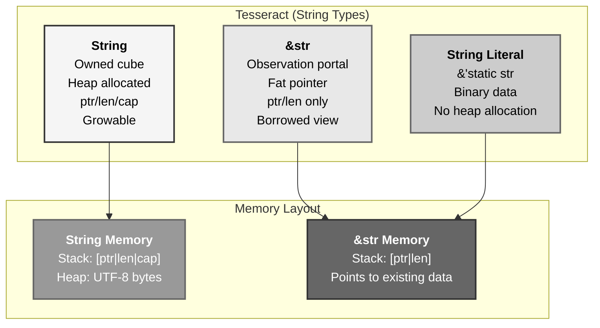
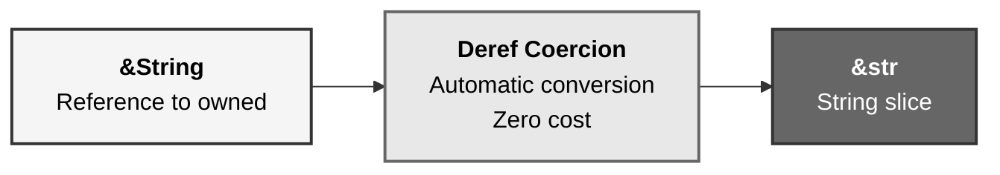
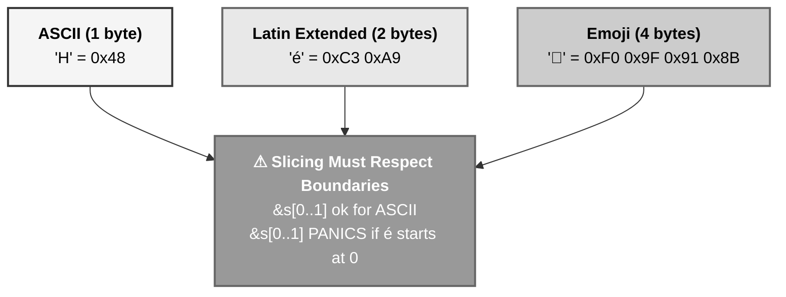
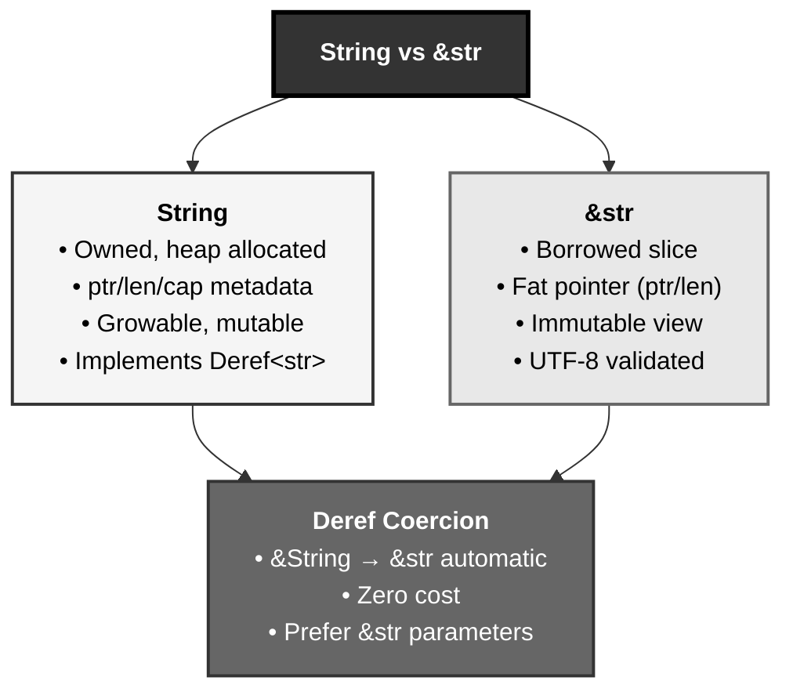

# Rust Strings: The Tesseract Energy Container System

## The Answer (Minto Pyramid)

**Rust provides two primary string types: String (owned, heap-allocated, growable Vec<u8> of UTF-8 bytes with pointer/length/capacity) and &str (borrowed string slice, fat pointer with pointer + length to UTF-8 data elsewhere)—String owns its data enabling mutation and growth, while &str is a view into existing UTF-8 bytes (from String, literals, or other sources) represented as a fat pointer without ownership, with String implementing Deref<Target = str> enabling automatic coercion from &String to &str, making &str the preferred parameter type for flexible function signatures accepting any string reference.**

String is `Vec<u8>` wrapped with UTF-8 validation, stored on the heap with three-field stack metadata (pointer, length, capacity). String slices (&str) are references to contiguous UTF-8 bytes, stored as fat pointers (pointer + length) without capacity since they don't own data. **The key insight**: String = owned + growable (heap Vec), &str = borrowed view (fat pointer), with deref coercion bridging them.

**Three Supporting Principles:**

1. **Ownership Distinction**: String owns heap data, &str borrows from elsewhere
2. **Memory Layout**: String has ptr/len/cap, &str has ptr/len (fat pointer)
3. **Deref Coercion**: `String` implements `Deref<Target = str>`, enabling &String → &str

**Why This Matters**: String handling is ubiquitous in programming. Understanding owned String vs borrowed &str, UTF-8 representation, and deref coercion patterns is fundamental to idiomatic Rust and avoiding unnecessary allocations.

---

## The MCU Metaphor: The Tesseract Energy Container

Think of Rust strings like the Tesseract's energy containment—full container vs viewing window:

### The Mapping

| Tesseract System | Rust Strings |
|------------------|--------------|
| **Tesseract cube (owned)** | `String` (owned, heap) |
| **Energy within cube** | UTF-8 bytes (heap data) |
| **Cube metadata (size, capacity)** | String's ptr/len/cap fields |
| **Observation portal** | `&str` (borrowed slice) |
| **Portal view (no ownership)** | Fat pointer (ptr + len) |
| **Portal to specific section** | String slice `&s[1..4]` |
| **String literal "Tesseract"** | `&str` literal (binary data) |
| **Energy transfer (growable)** | String push_str() mutation |
| **Automatic portal** | Deref coercion (&String → &str) |
| **UTF-8 encoding** | Energy signatures (byte sequence) |

### The Story

The Tesseract energy system demonstrates perfect string ownership patterns:

**The Tesseract Cube (`String`)**: S.H.I.E.L.D. stores the Tesseract's energy in a **containment cube**—a physical container that **owns** the energy. The cube is heap-allocated (too large for stack), tracked with **three pieces of metadata** on the stack: (1) **pointer** to the cube's location in the facility, (2) **length** (how much energy currently stored), (3) **capacity** (maximum energy before needing bigger cube). When you create `let mut energy = String::from("Tesseract")`, you allocate a heap buffer, copy "Tesseract" bytes into it, and store ptr/len/cap on the stack. The cube is **growable**: `energy.push_str(" Power")` adds more bytes, potentially reallocating to a bigger cube if capacity exceeded. The **String owns** the heap data—when the cube variable drops, the heap buffer is deallocated. This is `String`: heap-allocated, growable, owned UTF-8 bytes.

**Observation Portal (`&str`)**: Scientists don't need to own the entire cube to study the energy—they use an **observation portal** that provides a **view** into specific sections. The portal is a **fat pointer**: (1) pointer to where in the cube to look, (2) length of the section visible. When you create `let view: &str = &energy[0..10]`, you get a reference (portal) showing the first 10 bytes without owning them. The portal has **no capacity field**—it doesn't own the energy, so it doesn't track how much space was allocated. Multiple portals can view the same cube simultaneously (shared borrows). When a portal closes (`view` drops), the cube remains—only the viewing window is gone, not the data. This is `&str`: a borrowed view, fat pointer (ptr + len), no ownership.

**String Literals (Binary Portals)**: When you write `let name = "Tesseract"` in code, the compiler bakes those UTF-8 bytes into your **program binary** at compile time. The literal `"Tesseract"` is a `&'static str`—a portal (fat pointer) to bytes stored in the binary's read-only data section, valid for the entire program lifetime. No heap allocation, no String—just a view into binary data. Literals are `&str` because they reference existing bytes elsewhere (the binary).

**Deref Coercion (Automatic Portal)**: The cube implements `Deref<Target = str>`, meaning whenever you have a **&String** (reference to the cube), Rust can automatically convert it to **&str** (portal) via **deref coercion**. When a function expects `fn analyze(data: &str)`, you can pass `&energy` (where `energy: String`)—Rust automatically coerces `&String` to `&str`. This is why **&str is preferred in function parameters**: accepts String references, literals, slices, any `&str` source. The coercion is zero-cost—just creates a fat pointer (ptr + len) from the String's metadata.

**UTF-8 Energy Signatures**: The Tesseract's energy has specific **signatures** (UTF-8 encoding)—multi-byte patterns representing characters. ASCII characters (English letters) use 1 byte, accented characters use 2-3 bytes, emoji use 4 bytes. The length field tracks **bytes**, not characters! `"Hello"` is 5 bytes, `"Héllo"` is 6 bytes (é = 2 bytes), `"👋"` is 4 bytes. Slicing must respect UTF-8 boundaries—`&s[0..1]` panics if byte 1 is mid-character. Rust's `chars()` iterator handles proper character boundaries.

Similarly, Rust provides String (owned heap container, growable, ptr/len/cap metadata) and &str (borrowed fat pointer, view into UTF-8 elsewhere). String owns and can mutate, &str references without ownership. Deref coercion bridges them (&String → &str automatically). Prefer &str in function parameters for flexibility—accepts String refs, literals, slices. The compiler enforces ownership, prevents dangling references, and ensures UTF-8 validity.

---

## The Problem Without Proper String Types

Before understanding String vs &str, developers face confusion:

```rust path=null start=null
// ❌ Confusion about ownership
fn process_text(text: String) {
    // Takes ownership! Caller loses the string
    println!("{}", text);
}

let data = String::from("Important");
process_text(data);
// data moved, can't use anymore!

// ❌ Unnecessary allocations
fn get_greeting() -> String {
    // Allocates new String every call!
    String::from("Hello")
}

// Better: return &'static str for literals
fn get_greeting_better() -> &'static str {
    "Hello" // No allocation, references binary
}

// ❌ Not using &str parameters
fn count_chars(s: &String) -> usize {
    // Forces callers to have String, can't pass literals!
    s.len()
}

// Can't do this:
// count_chars(&"hello"); // Error: expected &String, found &str

// ❌ Byte vs character confusion
let s = String::from("Hello👋");
let len = s.len(); // 9 bytes, not 6 characters!
// s[0..6] // Panics! Index 6 is mid-emoji
```

**Problems:**

1. **Ownership Confusion**: Taking String parameters when only reading
2. **Unnecessary Allocations**: Creating String for literals
3. **Inflexible APIs**: Using &String instead of &str parameters
4. **Byte/Character Confusion**: Treating len() as character count
5. **Invalid Slicing**: Not respecting UTF-8 boundaries

---

## The Solution: String and &str with Deref Coercion

Rust provides clear ownership semantics and automatic coercion:

### String Basics (Owned)

```rust path=null start=null
// Create owned String (heap allocated)
let mut s1 = String::new();
let s2 = String::from("Hello");
let s3 = "Hello".to_string();

// Mutation requires ownership
s1.push_str("World");
s1.push('!');

// Memory layout: stack has ptr/len/cap, heap has bytes
// Stack: [ptr | len=6 | cap=8]
//          ↓
// Heap:  [H][e][l][l][o][!][?][?]
```

### String Slices (Borrowed)

```rust path=null start=null
let s = String::from("Hello World");

// Create slices (borrows)
let hello: &str = &s[0..5];   // "Hello"
let world: &str = &s[6..11];  // "World"
let full: &str = &s[..];      // Full string

// String literals are &str
let literal: &str = "Hello";  // &'static str

// Memory layout: fat pointer (ptr + len)
// Stack: [ptr | len=5]
//          ↓
// Heap:  [H][e][l][l][o][ ][W][o][r][l][d]
```

### Deref Coercion

```rust path=null start=null
// Function accepting &str
fn print_text(s: &str) {
    println!("{}", s);
}

let owned = String::from("Hello");

// All of these work:
print_text(&owned);           // &String → &str (deref coercion)
print_text("Hello");          // &str literal
print_text(&owned[0..3]);     // &str slice

// String implements Deref<Target = str>
use std::ops::Deref;

impl Deref for String {
    type Target = str;
    fn deref(&self) -> &str {
        // Returns &str view of String's data
    }
}
```

---

## Visual Mental Model



### Deref Coercion Flow



### UTF-8 Character Boundaries



---

## Anatomy of Strings

### 1. String Creation and Mutation

```rust path=null start=null
// Various ways to create String
let s1 = String::new();              // Empty
let s2 = String::from("Hello");      // From literal
let s3 = "Hello".to_string();        // Also from literal
let s4 = String::with_capacity(10);  // Pre-allocate

// Mutation (requires mut)
let mut s = String::from("Hello");
s.push_str(" World");  // Append &str
s.push('!');           // Append char
s.insert(5, ',');      // Insert at index
s.pop();               // Remove last char, returns Option<char>

// Capacity management
let mut s = String::with_capacity(10);
assert_eq!(s.capacity(), 10);
assert_eq!(s.len(), 0);

s.push_str("Hello");
assert_eq!(s.len(), 5);
assert_eq!(s.capacity(), 10); // No reallocation

s.push_str(" World!");
assert_eq!(s.len(), 12);
assert!(s.capacity() >= 12); // May have reallocated
```

### 2. String Slices and Indexing

```rust path=null start=null
let s = String::from("Hello World");

// Create slices
let hello = &s[0..5];      // "Hello"
let world = &s[6..];       // "World"
let full = &s[..];         // Entire string
let middle = &s[3..8];     // "lo Wo"

// ❌ Direct indexing not allowed (not O(1) for UTF-8)
// let ch = s[0]; // Error: String cannot be indexed by integer

// ✅ Use bytes() or chars()
let first_byte = s.as_bytes()[0];  // 72 ('H' in ASCII)

// Iterate characters (handles UTF-8)
for ch in s.chars() {
    println!("{}", ch);
}

// Iterate bytes
for byte in s.bytes() {
    println!("{}", byte);
}
```

### 3. String Literals and Lifetimes

```rust path=null start=null
// String literal type is &'static str
let s: &'static str = "Hello";

// Lives in binary, valid for entire program
fn get_greeting() -> &'static str {
    "Welcome" // No heap allocation
}

// Can be coerced to &str with shorter lifetime
fn use_str(s: &str) {
    println!("{}", s);
}

use_str("literal"); // &'static str → &str

// String → &str conversion
let owned = String::from("Hello");
let borrowed: &str = &owned;  // &String → &str via deref coercion
let borrowed2: &str = &owned[..]; // Explicit slice
let borrowed3: &str = owned.as_str(); // Explicit conversion
```

### 4. Deref Coercion in Action

```rust path=null start=null
// Function accepting &str (idiomatic)
fn print_length(s: &str) {
    println!("Length: {}", s.len());
}

// All these work thanks to deref coercion
let owned = String::from("Hello");
print_length(&owned);        // &String → &str
print_length("literal");     // &'static str
print_length(&owned[1..4]);  // Explicit slice

// Deref coercion also works with methods
let s = String::from("hello world");
let upper = s.to_uppercase(); // to_uppercase() is on str, not String!
                               // Works via deref coercion

// Manual deref if needed
let s = String::from("Hello");
let slice: &str = &*s;  // Explicit deref then borrow
```

### 5. UTF-8 Handling

```rust path=null start=null
// UTF-8 strings: bytes vs characters
let s = String::from("Hello👋");

// Length is in bytes, not characters!
assert_eq!(s.len(), 9);  // "Hello" = 5 bytes, "👋" = 4 bytes

// Character count
let char_count = s.chars().count();
assert_eq!(char_count, 6);

// ❌ Invalid slicing panics
// let bad = &s[0..6]; // PANIC! Index 6 is mid-emoji

// ✅ Safe slicing
let hello = &s[0..5]; // "Hello" (safe, ends on boundary)

// Iterate properly
for (i, ch) in s.char_indices() {
    println!("Char '{}' starts at byte {}", ch, i);
}
// Output:
// Char 'H' starts at byte 0
// Char 'e' starts at byte 1
// ...
// Char '👋' starts at byte 5
```

---

## Common String Patterns

### Pattern 1: Prefer &str Parameters

```rust path=null start=null
// ✅ Good: accepts any string reference
fn process(text: &str) {
    println!("{}", text);
}

// Can call with String, literal, or slice
let owned = String::from("Hello");
process(&owned);
process("literal");
process(&owned[0..3]);

// ❌ Bad: forces String ownership or &String
fn process_bad(text: String) {
    // Caller loses ownership!
}

fn process_also_bad(text: &String) {
    // Can only accept &String, not literals or slices
}
```

### Pattern 2: Return &'static str for Constants

```rust path=null start=null
// ✅ Good: no allocation
fn get_error_message(code: i32) -> &'static str {
    match code {
        404 => "Not Found",
        500 => "Internal Error",
        _ => "Unknown",
    }
}

// ❌ Bad: unnecessary allocation
fn get_error_bad(code: i32) -> String {
    match code {
        404 => String::from("Not Found"), // Allocates each time!
        500 => String::from("Internal Error"),
        _ => String::from("Unknown"),
    }
}
```

### Pattern 3: String Building

```rust path=null start=null
// Efficient string building
let mut result = String::with_capacity(100); // Pre-allocate

for i in 0..10 {
    result.push_str(&format!("Item {}, ", i));
}

// Or use format! macro for one-offs
let name = "Alice";
let greeting = format!("Hello, {}!", name);

// Concatenation with +
let s1 = String::from("Hello");
let s2 = " World";
let combined = s1 + s2; // s1 moved, s2 borrowed
```

### Pattern 4: Safe Slicing

```rust path=null start=null
// Safe slicing with checks
fn safe_slice(s: &str, start: usize, end: usize) -> Option<&str> {
    if end > s.len() {
        return None;
    }
    
    // Check if indices are on character boundaries
    if !s.is_char_boundary(start) || !s.is_char_boundary(end) {
        return None;
    }
    
    Some(&s[start..end])
}

let s = "Hello👋";
assert_eq!(safe_slice(s, 0, 5), Some("Hello"));
assert_eq!(safe_slice(s, 0, 6), None); // Mid-emoji
```

### Pattern 5: String Conversion Patterns

```rust path=null start=null
// &str → String
let s: &str = "hello";
let owned = s.to_string();
let owned2 = String::from(s);
let owned3 = s.to_owned();

// String → &str
let owned = String::from("hello");
let borrowed: &str = &owned;
let borrowed2: &str = owned.as_str();

// Splitting and collecting
let s = "one,two,three";
let parts: Vec<&str> = s.split(',').collect();
assert_eq!(parts, vec!["one", "two", "three"]);

// Joining
let words = vec!["Hello", "World"];
let joined = words.join(" ");
assert_eq!(joined, "Hello World");
```

---

## Real-World Use Cases

### Use Case 1: Text Processing

```rust path=null start=null
fn word_count(text: &str) -> usize {
    text.split_whitespace().count()
}

fn capitalize_first(s: &str) -> String {
    let mut chars = s.chars();
    match chars.next() {
        Some(first) => {
            first.to_uppercase().collect::<String>() + chars.as_str()
        }
        None => String::new(),
    }
}

let text = "hello world";
assert_eq!(word_count(text), 2);
assert_eq!(capitalize_first(text), "Hello world");
```

### Use Case 2: String Builder

```rust path=null start=null
struct StringBuilder {
    buffer: String,
}

impl StringBuilder {
    fn new() -> Self {
        StringBuilder {
            buffer: String::new(),
        }
    }
    
    fn with_capacity(capacity: usize) -> Self {
        StringBuilder {
            buffer: String::with_capacity(capacity),
        }
    }
    
    fn append(&mut self, s: &str) -> &mut Self {
        self.buffer.push_str(s);
        self
    }
    
    fn build(self) -> String {
        self.buffer
    }
}

let result = StringBuilder::with_capacity(50)
    .append("Hello")
    .append(" ")
    .append("World")
    .build();

assert_eq!(result, "Hello World");
```

### Use Case 3: Path Manipulation

```rust path=null start=null
fn file_extension(path: &str) -> Option<&str> {
    path.rfind('.').map(|i| &path[i+1..])
}

fn file_stem(path: &str) -> &str {
    let without_dir = path.rsplit('/').next().unwrap_or(path);
    without_dir.split('.').next().unwrap_or(without_dir)
}

let path = "documents/report.txt";
assert_eq!(file_extension(path), Some("txt"));
assert_eq!(file_stem(path), "report");
```

---

## Key Takeaways



### The Mental Model

Think of strings like Tesseract containers:
- **Owned cube (String)** → Heap allocated, ptr/len/cap, growable
- **Observation portal (&str)** → Fat pointer view, ptr/len only
- **Binary portal (literal)** → &'static str in program binary

### Core Principles

1. **String**: Owned, heap-allocated Vec<u8> with UTF-8 validation, ptr/len/cap
2. **&str**: Borrowed slice, fat pointer (ptr + len), view into UTF-8 data
3. **Deref Coercion**: String implements Deref<Target = str>, &String → &str automatic
4. **UTF-8 Bytes**: len() is bytes, not characters; slicing must respect boundaries
5. **Parameter Idiom**: Prefer `&str` in function parameters for maximum flexibility

### The Guarantee

Rust strings provide:
- **UTF-8 Validity**: All String and &str values are valid UTF-8
- **Memory Safety**: Ownership prevents dangling string references
- **Zero-Cost Coercion**: &String → &str is just metadata reshaping
- **Boundary Safety**: Invalid slicing panics at runtime to prevent corruption

All with **clear ownership semantics and UTF-8 guarantees**.

---

**Remember**: String and &str aren't just text containers—they're **ownership-aware UTF-8 views with deref coercion**. Like the Tesseract (owned cube vs observation portal), String owns heap data with growth capability (ptr/len/cap), while &str is a borrowed fat-pointer view (ptr/len) into existing UTF-8 bytes. Deref coercion bridges them automatically (&String → &str). Prefer &str parameters to accept String refs, literals, and slices. Respect UTF-8 boundaries when slicing—len() counts bytes, not characters. Pre-allocate with `String::with_capacity()` for known sizes. The compiler enforces ownership, prevents use-after-free, and validates UTF-8. Owned energy, borrowed portals, automatic coercion.
