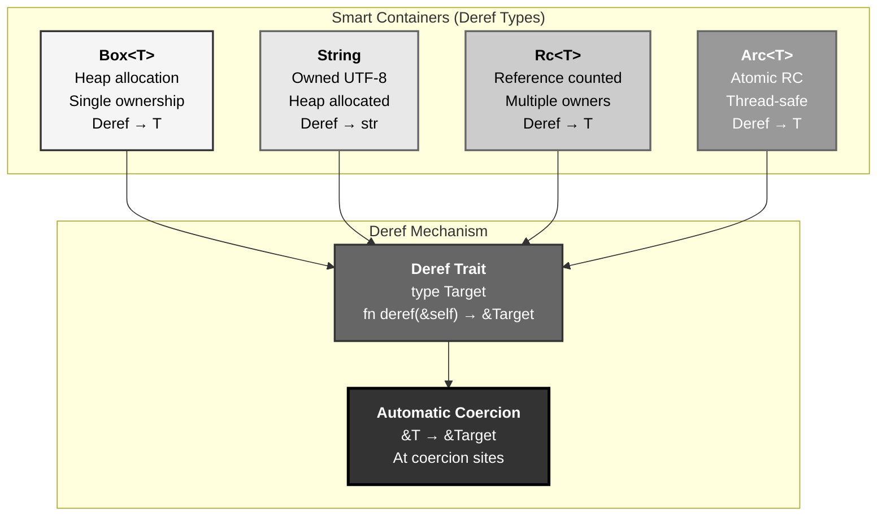
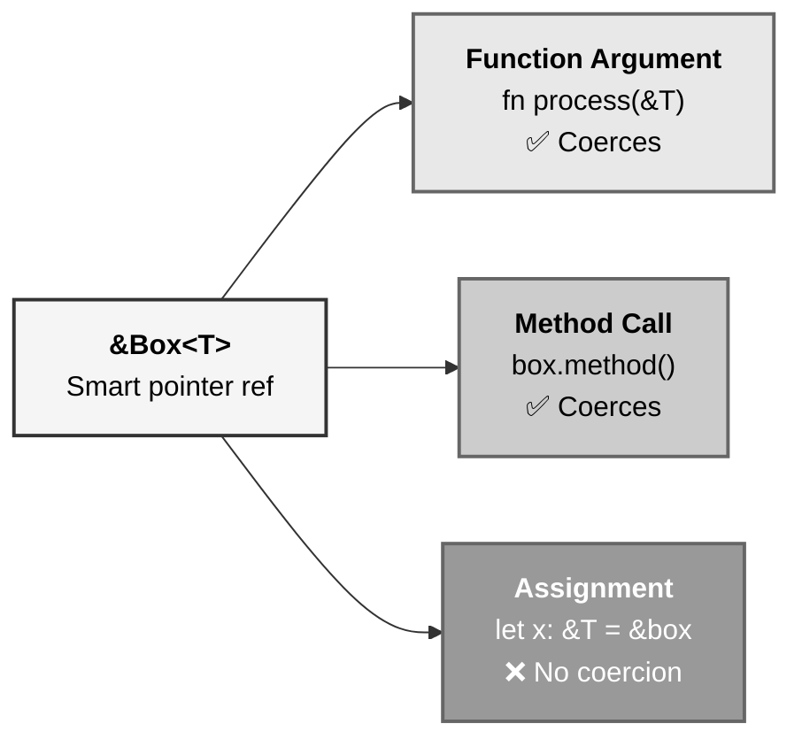
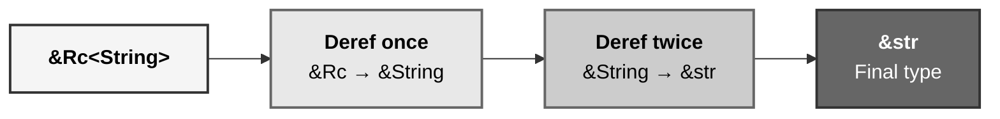
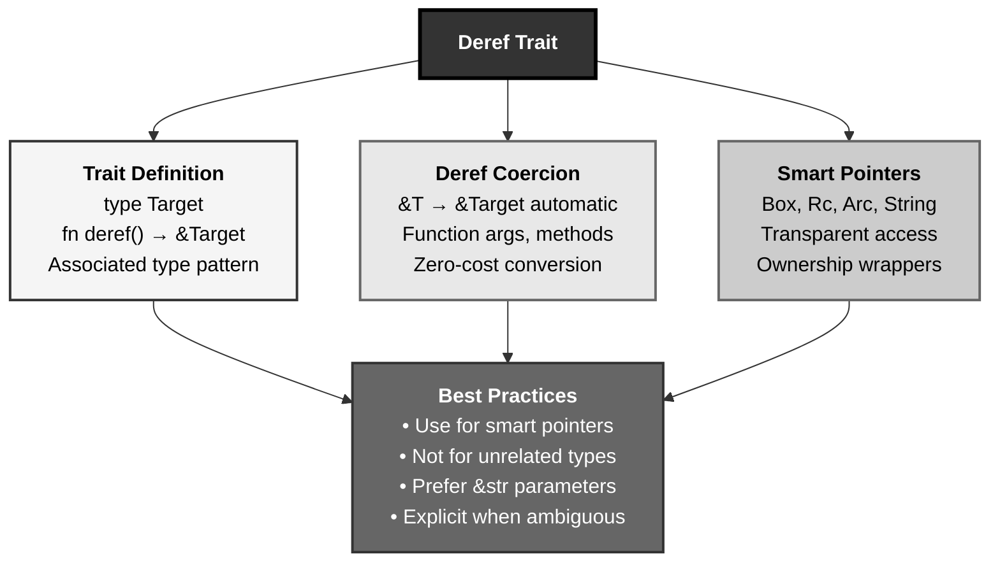

# Rust Deref Trait: The Smart Container Access Protocol

## The Answer (Minto Pyramid)

**The Deref trait enables deref coercion, a language feature where types implementing Deref<Target = U> allow automatic conversion from &T to &U in coercion contexts (function arguments, method calls), with the trait defining a single method deref(&self) -> &Target that returns a reference to the target type—this powers smart pointers (Box, Rc, Arc, String) by providing transparent access to wrapped values, allowing &Box<T> to behave like &T and &String to automatically coerce to &str, though deref coercion should be used judiciously as it's primarily intended for smart pointer types rather than general-purpose type conversion to avoid confusion about which methods are being called.**

Deref trait has one associated type `Target` and one method `deref(&self) -> &Self::Target`. When `T: Deref<Target = U>`, the compiler automatically inserts `.deref()` calls to convert `&T` to `&U` in coercion sites. String implements `Deref<Target = str>` (enabling &String → &str), Box<T> implements `Deref<Target = T>` (enabling &Box<T> → &T). **The key insight**: Deref = automatic reference conversion, enabling smart pointers to act like regular references.

**Three Supporting Principles:**

1. **Automatic Coercion**: Compiler inserts deref() calls in specific contexts
2. **Associated Type**: Target specifies what &T coerces to
3. **Smart Pointer Idiom**: Primary use case is pointer-like types, not general conversion

**Why This Matters**: Deref coercion enables ergonomic smart pointer usage. Understanding when coercion occurs (function args, method calls) vs when it doesn't (assignment, explicit type annotations) is crucial for writing idiomatic Rust and avoiding confusion.

---

## The MCU Metaphor: Stark Industries Smart Container Protocol

Think of the Deref trait like Stark's smart container access system—automatic delegation to the contained item:

### The Mapping

| Stark Container System | Rust Deref |
|----------------------|------------|
| **Smart container (arc reactor case)** | Smart pointer (Box, Rc, Arc) |
| **Access protocol** | `Deref` trait |
| **Automatic door opening** | Deref coercion (&T → &Target) |
| **Item inside container** | Target type |
| **deref() method** | Opens container, returns &item |
| **Transparent access** | &Box<T> acts like &T |
| **String encryption box** | String (wraps str data) |
| **Auto-decryption** | &String → &str coercion |
| **Security check contexts** | Coercion sites (fn args, methods) |
| **Manual override** | Explicit *deref or .deref() |

### The Story

Stark's smart container system demonstrates perfect Deref patterns:

**Smart Containers (`Deref` Trait)**: Stark Industries stores sensitive items in **smart containers**—protective cases with automatic access protocols. The Arc Reactor sits in a reinforced container (`Box<ArcReactor>`). When a scientist needs to **examine** the reactor, they don't manually open the case—the **access protocol** (`Deref` trait) automatically opens it, providing transparent access. The protocol has one rule: implement `deref(&self) -> &ContainedItem`. For `Box<ArcReactor>`, calling `container.deref()` returns `&ArcReactor`. The compiler knows about this protocol and **automatically** calls `.deref()` when needed. When you pass `&container` to a function expecting `&ArcReactor`, the compiler inserts `.deref()` behind the scenes—**deref coercion**. The scientist works with the reactor as if the container wasn't there.

**Automatic Door Opening (Coercion Sites)**: The access protocol triggers in specific **security check contexts** (coercion sites): (1) **Function arguments**: passing `&Box<T>` to function expecting `&T`, (2) **Method calls**: calling `reactor.power_level()` on `&Box<ArcReactor>` finds method on `ArcReactor`, (3) **Return type coercion**: returning `&Box<T>` where `&T` expected. The protocol does **NOT** trigger in: (1) **Variable assignment**: `let x: &ArcReactor = &container` requires explicit `&*container`, (2) **Explicit type annotations**: compiler doesn't coerce when types mismatch without context. Think of it as automatic doors that open when approaching a function entrance but require manual override elsewhere.

**String Encryption Box (`String` Deref Example)**: Stark stores classified strings in **encryption boxes** (`String`). The raw text (`str` data) lives inside the box on the heap. The `String` smart container implements the access protocol: `Deref<Target = str>`. When a function needs `&str` text, you can pass `&String` directly—the protocol automatically "decrypts" (derefs) to `&str`. This is why **&str is preferred in function parameters**: accepts both `&String` (via coercion) and `&str` directly. The coercion is **zero-cost**—just metadata reshaping, no actual data movement. The encrypted box (`String`) remains intact; you're just getting a view (`&str`) of the contents.

**Box, Rc, Arc Smart Pointers**: Stark uses different container types: **Box** (single ownership, heap-allocated), **Rc** (reference-counted, multiple read-only owners), **Arc** (atomic reference-counted, thread-safe). All implement `Deref<Target = T>`, so `&Box<T>`, `&Rc<T>`, `&Arc<T>` all automatically coerce to `&T`. When you call `reactor_box.clone()` where `reactor_box: Box<ArcReactor>` and `ArcReactor` has a `clone()` method, deref coercion finds `clone()` on `&ArcReactor`. The container becomes **transparent** for method access. This is the **smart pointer idiom**: containers that act like references to the inner type.

**Don't Abuse the Protocol (Best Practices)**: Deref coercion is powerful but can confuse. If both `Box<T>` and `T` have a `power_level()` method, which is called on `&box`? (Answer: `Box`'s method takes precedence, then `T`'s via coercion.) Stick to the **smart pointer idiom**: use Deref for pointer-like types (Box, String, Rc, Arc), not general type conversion. Don't implement `Deref` for `Email` to coerce to `String`—that's a misuse. Deref is for **ownership wrappers** that logically "contain" the target type, not for unrelated conversions.

Similarly, Rust's Deref trait enables automatic &T → &Target conversion in coercion contexts, powering smart pointers by making containers transparent. String derefs to str, Box<T> to T, enabling ergonomic APIs. The compiler inserts deref() calls at coercion sites (function args, method calls). Use Deref for smart pointer types, not arbitrary conversions—clarity over cleverness.

---

## The Problem Without Deref Coercion

Before Deref, smart pointer usage would be verbose:

```rust path=null start=null
// ❌ Without Deref: manual dereferencing everywhere
let boxed = Box::new(42);

fn process(x: &i32) {
    println!("{}", x);
}

// Would need explicit dereferencing
process(&*boxed);  // &*boxed gets &i32 from Box<i32>

// ❌ String without Deref
let s = String::from("hello");

fn print_str(text: &str) {
    println!("{}", text);
}

// Would need manual conversion
print_str(&*s);  // Explicit deref

// ❌ Method calls need explicit deref
let s = String::from("HELLO");
let lower = (*s).to_lowercase(); // Verbose!

// ❌ Smart pointers lose ergonomic advantage
let data = Rc::new(vec![1, 2, 3]);
let len = (*data).len(); // Manual deref every time
```

**Problems:**

1. **Verbose Syntax**: Explicit `&*` everywhere with smart pointers
2. **Lost Ergonomics**: Smart pointers don't feel transparent
3. **Inconsistent Experience**: Different syntax for owned vs wrapped values
4. **Method Call Complexity**: Need manual deref for every method
5. **API Awkwardness**: Can't pass &String where &str expected without conversion

---

## The Solution: Deref Trait with Automatic Coercion

Rust provides the Deref trait for transparent smart pointer access:

### Deref Trait Definition

```rust path=null start=null
use std::ops::Deref;

pub trait Deref {
    type Target: ?Sized;  // Associated type
    
    fn deref(&self) -> &Self::Target;
}

// Example: Box<T> implements Deref
impl<T: ?Sized> Deref for Box<T> {
    type Target = T;
    
    fn deref(&self) -> &T {
        // Returns reference to heap-allocated T
    }
}

// Example: String implements Deref  
impl Deref for String {
    type Target = str;
    
    fn deref(&self) -> &str {
        // Returns &str view of String's data
    }
}
```

### Deref Coercion in Action

```rust path=null start=null
use std::ops::Deref;

// Function expecting &str
fn print_text(s: &str) {
    println!("{}", s);
}

let owned = String::from("Hello");

// ✅ Deref coercion: &String → &str automatically
print_text(&owned);  // Compiler inserts .deref()

// With Box
let boxed = Box::new(42);

fn print_num(n: &i32) {
    println!("{}", n);
}

// ✅ Deref coercion: &Box<i32> → &i32 automatically
print_num(&boxed);

// Method calls also use deref coercion
let s = String::from("hello");
let len = s.len(); // len() is on str, not String!
                    // Works via deref coercion
```

### Manual Deref When Needed

```rust path=null start=null
let s = String::from("hello");

// Explicit deref with * operator
let slice: &str = &*s;  // *s derefs to str, & takes reference

// Or explicit .deref() call
let slice2: &str = s.deref();

// Needed when assigning to explicitly typed variable
let boxed = Box::new(42);
let value_ref: &i32 = &*boxed;  // Explicit, no coercion here
```

---

## Visual Mental Model



### Coercion Sites



### Deref Chain



---

## Anatomy of Deref

### 1. Implementing Deref

```rust path=null start=null
use std::ops::Deref;

struct MyBox<T>(T);

impl<T> MyBox<T> {
    fn new(value: T) -> MyBox<T> {
        MyBox(value)
    }
}

// Implement Deref to make MyBox transparent
impl<T> Deref for MyBox<T> {
    type Target = T;
    
    fn deref(&self) -> &T {
        &self.0  // Return reference to wrapped value
    }
}

fn main() {
    let boxed = MyBox::new(42);
    
    // Can use *boxed to get &i32
    let value: &i32 = &*boxed;
    assert_eq!(*value, 42);
    
    // Deref coercion in function call
    fn print_num(n: &i32) {
        println!("{}", n);
    }
    
    print_num(&boxed);  // &MyBox<i32> → &i32 via coercion
}
```

### 2. Standard Library Smart Pointers

```rust path=null start=null
use std::rc::Rc;
use std::sync::Arc;

// Box: single ownership, heap allocation
let boxed = Box::new(String::from("Hello"));
let len = boxed.len();  // len() on &str via String's Deref

// Rc: reference counted, multiple owners
let rc1 = Rc::new(vec![1, 2, 3]);
let rc2 = Rc::clone(&rc1);
assert_eq!(rc1.len(), 3);  // len() on Vec via Deref

// Arc: atomic reference counted, thread-safe
let arc = Arc::new(42);
let value = *arc;  // Deref to get &i32, then copy i32
assert_eq!(value, 42);

// All implement Deref<Target = T>
```

### 3. Deref Coercion Sites

```rust path=null start=null
let s = String::from("hello");

// ✅ Function arguments
fn takes_str(text: &str) {}
takes_str(&s);  // &String → &str

// ✅ Method calls
let upper = s.to_uppercase();  // to_uppercase() is on str

// ✅ Returning from functions
fn get_str(s: &String) -> &str {
    s  // &String → &str coercion
}

// ❌ Variable assignment with explicit type
let slice: &str = &s;  // Actually THIS works!
// But this doesn't:
// let slice: &str = s;  // Error: expected &str, found String

// ❌ Pattern matching
match &s {
    slice: &str => {} // Doesn't work, need explicit pattern
}
```

### 4. Deref Chains

```rust path=null start=null
use std::rc::Rc;

// Multiple Deref steps
let rc_string: Rc<String> = Rc::new(String::from("hello"));

fn print_str(s: &str) {
    println!("{}", s);
}

// &Rc<String> → &String → &str (two derefs!)
print_str(&rc_string);

// Compiler inserts multiple .deref() calls:
// print_str(rc_string.deref().deref());
```

### 5. DerefMut for Mutable Dereferencing

```rust path=null start=null
use std::ops::{Deref, DerefMut};

struct MyBox<T>(T);

impl<T> Deref for MyBox<T> {
    type Target = T;
    fn deref(&self) -> &T {
        &self.0
    }
}

impl<T> DerefMut for MyBox<T> {
    fn deref_mut(&mut self) -> &mut T {
        &mut self.0
    }
}

let mut boxed = MyBox(vec![1, 2, 3]);

// DerefMut enables mutable access
boxed.push(4);  // push() on &mut Vec via DerefMut

assert_eq!(*boxed, vec![1, 2, 3, 4]);
```

---

## Common Deref Patterns

### Pattern 1: Smart Pointer Wrapper

```rust path=null start=null
use std::ops::Deref;

// Cache wrapper with transparent access
struct Cached<T> {
    value: T,
    cached_at: std::time::Instant,
}

impl<T> Cached<T> {
    fn new(value: T) -> Self {
        Cached {
            value,
            cached_at: std::time::Instant::now(),
        }
    }
}

impl<T> Deref for Cached<T> {
    type Target = T;
    
    fn deref(&self) -> &T {
        &self.value
    }
}

// Use it transparently
let cached_data = Cached::new(vec![1, 2, 3]);
assert_eq!(cached_data.len(), 3);  // len() on Vec via Deref
```

### Pattern 2: Newtype with Deref

```rust path=null start=null
use std::ops::Deref;

// Newtype pattern with transparent access
struct UserId(String);

impl Deref for UserId {
    type Target = str;  // Deref to str, not String!
    
    fn deref(&self) -> &str {
        &self.0
    }
}

let user_id = UserId(String::from("user123"));

// Can use string methods directly
assert_eq!(user_id.len(), 7);
assert!(user_id.starts_with("user"));
```

### Pattern 3: Prefer &str Parameters

```rust path=null start=null
// ✅ Good: accepts String, &str, Box<str>, etc.
fn process_text(text: &str) {
    println!("{}", text);
}

let s = String::from("hello");
let boxed = Box::new(String::from("world"));

process_text(&s);      // &String → &str
process_text("literal");  // &str directly
process_text(&boxed);   // &Box<String> → &String → &str

// ❌ Bad: only accepts String
fn process_bad(text: &String) {
    println!("{}", text);
}
// Can't pass literals or &str!
```

### Pattern 4: Explicit Deref When Needed

```rust path=null start=null
let s = String::from("hello");

// Manual deref for explicit type conversion
let slice: &str = &*s;  // *s: str (unsized!), &: &str

// Or use .as_ref() or .as_str()
let slice2: &str = s.as_str();

// With Box
let boxed = Box::new(vec![1, 2, 3]);
let vec_ref: &Vec<i32> = &*boxed;
```

### Pattern 5: Avoid Deref for Unrelated Types

```rust path=null start=null
// ❌ DON'T do this: Deref for unrelated conversion
struct Email(String);

// This is a misuse of Deref!
impl Deref for Email {
    type Target = String;
    fn deref(&self) -> &String {
        &self.0
    }
}

// ✅ Instead: provide explicit conversion methods
impl Email {
    fn as_str(&self) -> &str {
        &self.0
    }
    
    fn to_string(self) -> String {
        self.0
    }
}
```

---

## Real-World Use Cases

### Use Case 1: Rc for Shared Ownership

```rust path=null start=null
use std::rc::Rc;

struct Node {
    value: i32,
    parent: Option<Rc<Node>>,
}

impl Node {
    fn new(value: i32, parent: Option<Rc<Node>>) -> Rc<Node> {
        Rc::new(Node { value, parent })
    }
    
    fn get_value(&self) -> i32 {
        self.value
    }
}

let root = Node::new(1, None);
let child = Node::new(2, Some(Rc::clone(&root)));

// Deref makes Rc transparent
assert_eq!(root.get_value(), 1);     // &Rc<Node> → &Node
assert_eq!(child.get_value(), 2);
```

### Use Case 2: Arc for Thread-Safe Sharing

```rust path=null start=null
use std::sync::Arc;
use std::thread;

let data = Arc::new(vec![1, 2, 3, 4, 5]);

let handles: Vec<_> = (0..3)
    .map(|i| {
        let data = Arc::clone(&data);
        thread::spawn(move || {
            // Deref makes Arc transparent
            println!("Thread {}: sum = {}", i, data.iter().sum::<i32>());
        })
    })
    .collect();

for handle in handles {
    handle.join().unwrap();
}
```

### Use Case 3: Custom Smart Pointer

```rust path=null start=null
use std::ops::{Deref, DerefMut};

struct Logged<T> {
    value: T,
    access_count: usize,
}

impl<T> Logged<T> {
    fn new(value: T) -> Self {
        Logged { value, access_count: 0 }
    }
    
    fn accesses(&self) -> usize {
        self.access_count
    }
}

impl<T> Deref for Logged<T> {
    type Target = T;
    
    fn deref(&self) -> &T {
        &self.value
    }
}

impl<T> DerefMut for Logged<T> {
    fn deref_mut(&mut self) -> &mut T {
        self.access_count += 1;
        &mut self.value
    }
}

let mut logged = Logged::new(vec![1, 2, 3]);
logged.push(4);  // Triggers DerefMut, increments count
logged.push(5);

assert_eq!(logged.accesses(), 2);
assert_eq!(*logged, vec![1, 2, 3, 4, 5]);
```

---

## Key Takeaways



### The Mental Model

Think of Deref like Stark's smart containers:
- **Access protocol (Deref)** → type Target + deref() method
- **Automatic door (coercion)** → &T → &Target at specific sites
- **Smart containers (Box/Rc/Arc)** → Transparent access to wrapped values

### Core Principles

1. **Deref Trait**: Associated type Target, method deref(&self) → &Target
2. **Coercion Sites**: Function args, method calls, return types (NOT assignment/matching)
3. **Smart Pointers**: Box, Rc, Arc, String all implement Deref for transparency
4. **Deref Chains**: Multiple derefs possible (&Rc<String> → &String → &str)
5. **Best Practice**: Use Deref for ownership wrappers, not arbitrary conversions

### The Guarantee

Rust Deref provides:
- **Zero-Cost Coercion**: Just metadata reshaping, no runtime overhead
- **Transparent Access**: Smart pointers feel like regular references
- **Clear Semantics**: Coercion only at specific, predictable sites
- **Type Safety**: Compiler tracks all conversions, prevents invalid derefs

All with **automatic but controlled type coercion**.

---

**Remember**: Deref isn't just automatic conversion—it's the **smart pointer transparency protocol**. Like Stark's containers (automatic access to wrapped items), Deref enables &Box<T> → &T, &String → &str with zero cost. The compiler inserts deref() calls at coercion sites (function args, method calls) but NOT everywhere (assignment needs explicit &*). Use Deref for ownership wrappers (Box/Rc/Arc/String), not unrelated type conversions—it's for making containers transparent, not bypassing type system. Prefer &str over &String in parameters to accept all string types. DerefMut enables mutable access. The protocol makes smart pointers ergonomic without sacrificing safety. Transparent containers, automatic protocol, explicit when needed.
