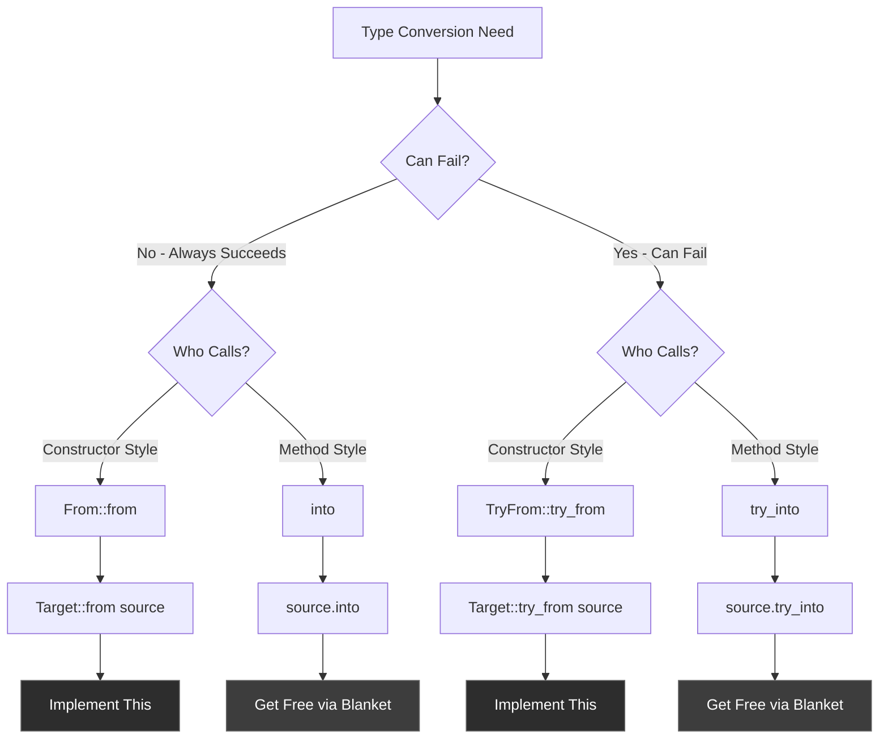
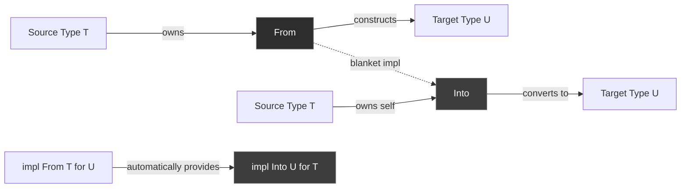
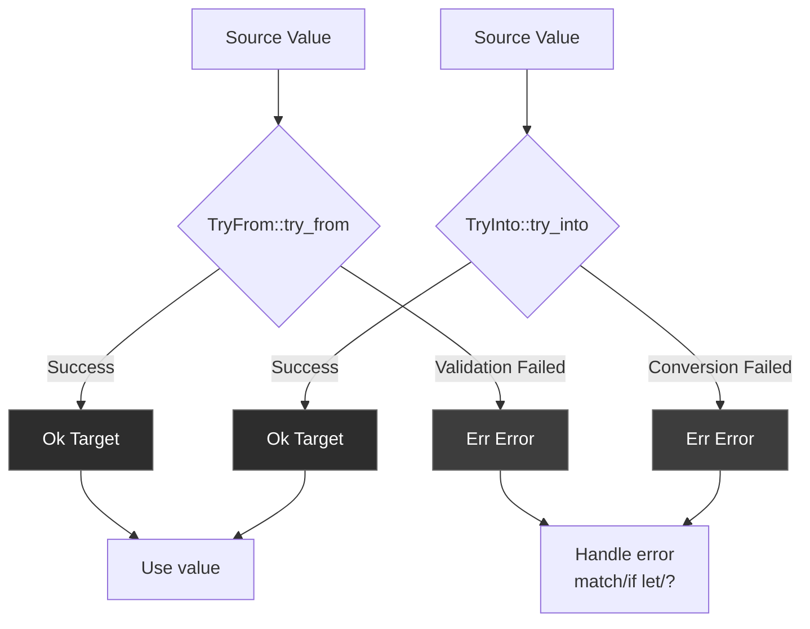
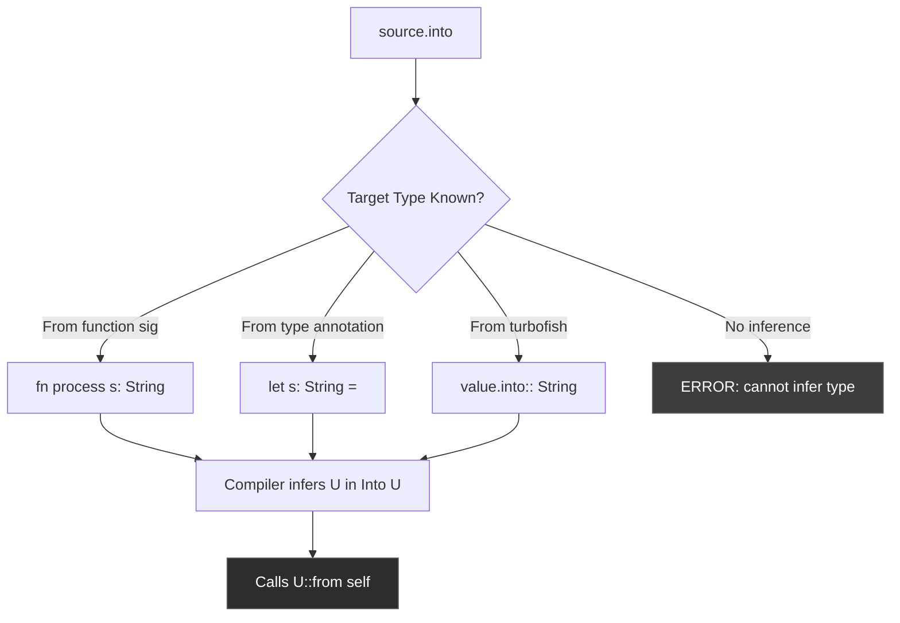
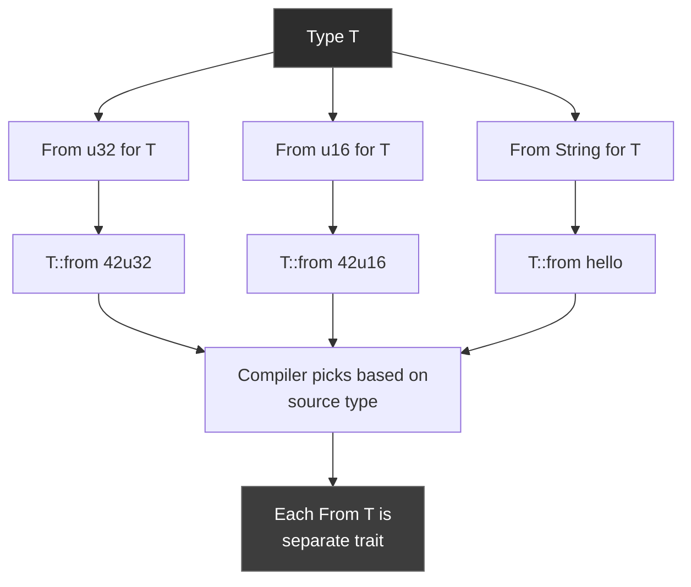

# R56: From/Into/TryFrom/TryInto Traits - Type Conversion Protocols

**Answer-First (Minto Pyramid)**

Rust's From/Into traits provide infallible type conversions (guaranteed to succeed), while TryFrom/TryInto handle fallible conversions (can fail with an error). From<T> converts T into Self; Into<T> converts self into T. The type system enforces safe, explicit conversions without runtime overhead. TryFrom/TryInto return Result types for validation. These traits are dual: implementing From automatically provides Into via blanket implementation.

---

## 1. The Problem: Type Mismatches and Conversion Safety

### 1.1 The Core Challenge

When passing data between functions, you often have a value of one type but need another:

```rust
// Function expects String
fn process(title: String) { /* ... */ }

// But you have &str
let s: &str = "A title";
process(s); // ❌ ERROR: expected String, found &str
```

You need explicit conversion. But you want:
- **Type safety** - No silent failures or data loss
- **Clarity** - Obvious conversion intent
- **Consistency** - Standard interface across all types
- **Error handling** - Graceful failure when conversion isn't possible

### 1.2 What From/Into/TryFrom/TryInto Provide

**From/Into (Infallible)**: Conversions that always succeed
```rust
let s: String = "hello".into(); // &str → String always works
```

**TryFrom/TryInto (Fallible)**: Conversions that can fail with validation
```rust
let age: u8 = 300u32.try_into()?; // u32 → u8 can overflow
```

---

## 2. The Solution: Four Conversion Traits

### 2.1 From Trait - Ownership-Taking Construction

```rust
pub trait From<T>: Sized {
    fn from(value: T) -> Self;
}
```

**Pattern**: Target type constructs itself FROM source type

```rust
// String implements From<&str>
let title = String::from("A title");

// Usage context
impl Ticket {
    pub fn new(title: String) {
        // ...
    }
}

// Explicit conversion
let ticket = Ticket::new(String::from("A title"));
```

### 2.2 Into Trait - Method-Style Conversion

```rust
pub trait Into<T>: Sized {
    fn into(self) -> T;
}
```

**Pattern**: Source type converts itself INTO target type

```rust
// Automatic via blanket implementation
let title: String = "A title".into();

// More ergonomic in function calls
let ticket = Ticket::new("A title".into());
```

### 2.3 TryFrom Trait - Validated Construction

```rust
pub trait TryFrom<T>: Sized {
    type Error;
    fn try_from(value: T) -> Result<Self, Self::Error>;
}
```

**Pattern**: Target type constructs itself with validation

```rust
use std::convert::TryFrom;

let age: Result<u8, _> = u8::try_from(300u32);
assert!(age.is_err()); // Overflow!
```

### 2.4 TryInto Trait - Method-Style Validated Conversion

```rust
pub trait TryInto<T>: Sized {
    type Error;
    fn try_into(self) -> Result<T, Self::Error>;
}
```

**Pattern**: Source type tries to convert itself

```rust
use std::convert::TryInto;

let age: Result<u8, _> = 300u32.try_into();
assert!(age.is_err());
```

---

## 3. Mental Model: Infinity Gauntlet Transformation Protocol

Think of type conversions as the Infinity Gauntlet's transformation capabilities:

**The Metaphor:**
- **Reality Stone (From)** - Constructs new reality from raw matter (target constructs from source)
- **Space Stone (Into)** - Matter transforms itself to new location (source transforms to target)
- **Soul Stone (TryFrom)** - Validates soul worthiness before transformation (checked construction)
- **Time Stone (TryInto)** - Attempts transformation with potential timeline failure (checked conversion)

### Metaphor Mapping Table

| Concept | MCU Metaphor | Technical Reality |
|---------|--------------|-------------------|
| From<T> | Reality Stone creating new form from input | Target::from(source) - constructor pattern |
| Into<T> | Space Stone teleporting matter | source.into() - method pattern |
| TryFrom<T> | Soul Stone requiring sacrifice validation | Target::try_from(source)? with Result |
| TryInto<T> | Time Stone with timeline branch risk | source.try_into()? with error handling |
| Blanket impl | Gauntlet's automatic power synergy | From impl auto-provides Into |
| Type inference | Gauntlet sensing intent | Compiler deduces target from context |
| Associated Error | Transformation rejection cause | Each impl defines failure type |

### The Transformation Story

The Infinity Gauntlet's transformation protocol has four modes:

**Reality Stone (From)**: When Thanos uses the Reality Stone, he constructs a new reality FROM existing matter. The stone takes ownership of the input and guarantees successful transformation. This is `From<T>`: the target type takes source data and constructs itself, always succeeding.

**Space Stone (Into)**: When matter passes through the Space Stone, it transforms itself INTO its destination form. The stone enables matter to self-convert. This is `Into<T>`: the source type converts itself, with the target type inferred from context.

**Soul Stone (TryFrom)**: The Soul Stone requires sacrifice—it validates worthiness before transformation. Not all who seek transformation are worthy (Thanos: worthy, Clint: rejected initially). This is `TryFrom<T>`: construction WITH validation, returning Result for success/failure.

**Time Stone (TryInto)**: When Strange attempts timeline manipulation, some branches succeed, others fail catastrophically. Attempting transformation might branch into error timelines. This is `TryInto<T>`: self-conversion with potential failure paths.

**Gauntlet Synergy**: The Gauntlet's stones work in harmony—possessing the Reality Stone automatically grants Space Stone capabilities. Similarly, implementing `From` automatically provides `Into` via Rust's blanket implementation. You only need to implement one.

---

## 4. Anatomy: How the Traits Work

### 4.1 The From Trait Definition

```rust
pub trait From<T>: Sized {
    //           ^        ^
    //           |        |-- Supertrait: implementor must be Sized
    //           |----------- Generic: can convert FROM different types
    
    fn from(value: T) -> Self;
    //      ^^^^^        ^^^^
    //      |            |---- Returns the target type
    //      |----------------- Takes ownership of source
}
```

**Key characteristics**:
- Generic parameter `T` - can implement multiple times with different sources
- `Sized` supertrait - both T and Self must have known size at compile time
- Associated function (not method) - called as `Type::from(value)`
- Takes ownership - consumes the source value

### 4.2 The Into Trait Definition

```rust
pub trait Into<T>: Sized {
    //          ^
    //          |---- Generic: can convert INTO different targets
    
    fn into(self) -> T;
    //      ^^^^     ^
    //      |        |---- Returns target type
    //      |------------- Consumes self
}
```

**Blanket implementation** (provided by std):
```rust
impl<T, U> Into<U> for T
where
    U: From<T>,  // If U can be constructed FROM T
{
    fn into(self) -> U {
        U::from(self)  // Delegate to From impl
    }
}
```

This means: **If you implement From, you get Into for free.**

### 4.3 Implicit and Explicit Sized Bounds

Every generic type parameter has an **implicit `Sized` bound**:

```rust
// What you write:
pub struct Foo<T> {
    inner: T,
}

// What the compiler sees:
pub struct Foo<T: Sized> {
    inner: T,
}
```

**Negative trait bound** (opting out):
```rust
pub struct Foo<T: ?Sized> {
    //              ^^^^^^
    //              "T may or may not be Sized"
    inner: Box<T>,  // Requires indirection for unsized types
}
```

This allows `Foo<str>` or `Foo<dyn Trait>` (DSTs).

### 4.4 The TryFrom Trait Definition

```rust
pub trait TryFrom<T>: Sized {
    type Error;  // Associated type for error
    //   ^^^^^
    //   Each impl specifies its own error type
    
    fn try_from(value: T) -> Result<Self, Self::Error>;
    //                       ^^^^^^
    //                       Can fail - returns Result
}
```

### 4.5 The TryInto Trait and Blanket Implementation

```rust
pub trait TryInto<T>: Sized {
    type Error;
    fn try_into(self) -> Result<T, Self::Error>;
}

// Blanket implementation
impl<T, U> TryInto<U> for T
where
    U: TryFrom<T>,
{
    type Error = U::Error;
    
    fn try_into(self) -> Result<U, Self::Error> {
        U::try_from(self)
    }
}
```

**Pattern**: Identical to From/Into duality—implement TryFrom, get TryInto free.

---

## 5. Common Patterns

### 5.1 String Conversions (Most Common Use Case)

```rust
// &str → String (infallible)
impl From<&str> for String {
    fn from(s: &str) -> String {
        s.to_string()
    }
}

// Usage
let s1: String = String::from("hello");  // Explicit From
let s2: String = "hello".into();          // Into via inference
let s3 = "hello".to_string();             // Alternative (not From/Into)

fn process(title: String) { /* ... */ }

// Ergonomic with Into
process("hello".into());  // Cleaner than String::from()
```

### 5.2 Multiple From Implementations

Because `From<T>` is generic over T, you can implement it multiple times:

```rust
struct WrappingU32 {
    inner: u32,
}

impl From<u32> for WrappingU32 {
    fn from(value: u32) -> Self {
        WrappingU32 { inner: value }
    }
}

impl From<u16> for WrappingU32 {
    fn from(value: u16) -> Self {
        WrappingU32 { inner: value.into() }
        //                   ^^^^^^^^^^^^
        //                   u16 → u32 via Into
    }
}

// Usage - compiler picks correct impl
let w1: WrappingU32 = 42u32.into();
let w2: WrappingU32 = 42u16.into();
```

Each `From<T>` with different T is a **separate trait implementation**.

### 5.3 Type Inference with Into

`.into()` requires the compiler to infer the target type from context:

**Inference from function signature:**
```rust
fn process(s: String) { /* ... */ }

process("hello".into());  // Compiler knows target is String
```

**Inference from variable type annotation:**
```rust
let title: String = "hello".into();
```

**Ambiguity error (won't compile):**
```rust
let title = "hello".into();  // ❌ ERROR: can't infer type
```

### 5.4 Validated Conversions with TryFrom

```rust
use std::convert::TryFrom;

impl TryFrom<i32> for PositiveInt {
    type Error = &'static str;
    
    fn try_from(value: i32) -> Result<Self, Self::Error> {
        if value > 0 {
            Ok(PositiveInt { inner: value })
        } else {
            Err("Value must be positive")
        }
    }
}

// Usage
let valid: Result<PositiveInt, _> = PositiveInt::try_from(42);
assert!(valid.is_ok());

let invalid: Result<PositiveInt, _> = PositiveInt::try_from(-5);
assert!(invalid.is_err());

// With ? operator
fn create_positive(n: i32) -> Result<PositiveInt, &'static str> {
    let pos = PositiveInt::try_from(n)?;  // Early return on error
    Ok(pos)
}
```

### 5.5 Custom Error Types

```rust
use std::convert::TryFrom;

#[derive(Debug)]
enum ConversionError {
    TooLarge,
    TooSmall,
    Invalid,
}

impl TryFrom<i64> for SmallInt {
    type Error = ConversionError;
    
    fn try_from(value: i64) -> Result<Self, Self::Error> {
        if value > 100 {
            Err(ConversionError::TooLarge)
        } else if value < 0 {
            Err(ConversionError::TooSmall)
        } else {
            Ok(SmallInt { inner: value as i32 })
        }
    }
}
```

### 5.6 Combining From and TryFrom

```rust
// Infallible conversion
impl From<u32> for LargeInt {
    fn from(value: u32) -> Self {
        LargeInt { inner: value as i64 }
    }
}

// Fallible conversion
impl TryFrom<LargeInt> for u32 {
    type Error = &'static str;
    
    fn try_from(value: LargeInt) -> Result<Self, Self::Error> {
        if value.inner <= u32::MAX as i64 {
            Ok(value.inner as u32)
        } else {
            Err("Value too large for u32")
        }
    }
}

// One direction is guaranteed, reverse requires checking
let large: LargeInt = 42u32.into();           // Always works
let small: u32 = large.try_into().unwrap();   // Might fail
```

---

## 6. Use Cases: When to Use Each Trait

### 6.1 Use From When...

✅ **Conversion is guaranteed to succeed**
```rust
// u32 → u64 never fails
impl From<u32> for u64 {
    fn from(value: u32) -> Self {
        value as u64
    }
}
```

✅ **You're wrapping types for encapsulation**
```rust
struct Meters(f64);

impl From<f64> for Meters {
    fn from(value: f64) -> Self {
        Meters(value)
    }
}
```

✅ **Building domain types from validated inputs** (when validation is elsewhere)
```rust
// Assume title is already validated
impl From<ValidatedTitle> for Title {
    fn from(validated: ValidatedTitle) -> Self {
        Title { value: validated.into_string() }
    }
}
```

### 6.2 Use Into When...

✅ **You want ergonomic API boundaries**
```rust
// Accept anything convertible to String
fn greet(name: impl Into<String>) {
    let name = name.into();
    println!("Hello, {}", name);
}

greet("Alice");              // &str
greet(String::from("Bob"));  // String
greet("Eve".to_string());    // String
```

✅ **Method chaining with conversions**
```rust
let result = "value"
    .into()          // &str → String
    .replace(" ", "_")
    .into_bytes();   // String → Vec<u8>
```

### 6.3 Use TryFrom When...

✅ **Conversion involves validation**
```rust
impl TryFrom<String> for Email {
    type Error = ValidationError;
    
    fn try_from(value: String) -> Result<Self, Self::Error> {
        if value.contains('@') {
            Ok(Email { address: value })
        } else {
            Err(ValidationError::InvalidEmail)
        }
    }
}
```

✅ **Narrowing conversions that can overflow**
```rust
let large: u64 = 1_000_000_000;
let small: u8 = large.try_into()?;  // Will fail
```

✅ **Parsing or deserialization**
```rust
impl TryFrom<&str> for IpAddr {
    type Error = ParseError;
    
    fn try_from(s: &str) -> Result<Self, Self::Error> {
        s.parse()
    }
}
```

### 6.4 Use TryInto When...

✅ **Chaining fallible conversions**
```rust
fn process(value: u64) -> Result<SmallValue, Error> {
    let small: u8 = value.try_into()?;
    Ok(SmallValue::new(small))
}
```

✅ **Error propagation with ?**
```rust
fn convert_all(values: Vec<i64>) -> Result<Vec<u8>, ConversionError> {
    values
        .into_iter()
        .map(|v| v.try_into())
        .collect()
}
```

---

## 7. Comparison: From vs Into vs TryFrom vs TryInto



### Comparison Table

| Aspect | From | Into | TryFrom | TryInto |
|--------|------|------|---------|---------|
| **Return Type** | Self | T | Result<Self, Error> | Result<T, Error> |
| **Can Fail** | No | No | Yes | Yes |
| **Call Style** | Target::from(source) | source.into() | Target::try_from(source) | source.try_into() |
| **Who Implements** | You implement | Blanket impl | You implement | Blanket impl |
| **Type Inference** | Explicit target | Inferred from context | Explicit target | Inferred from context |
| **Error Handling** | N/A | N/A | Associated Error type | Associated Error type |
| **Use Case** | Guaranteed conversions | Ergonomic APIs | Validated conversions | Chained fallible ops |

### Decision Tree

```
Need type conversion?
│
├─ Can the conversion fail?
│  │
│  ├─ NO → Use From/Into
│  │  │
│  │  └─ Prefer implementing From
│  │     (get Into for free)
│  │
│  └─ YES → Use TryFrom/TryInto
│     │
│     └─ Prefer implementing TryFrom
│        (get TryInto for free)
│
└─ Which to call?
   │
   ├─ Target type known → From/TryFrom
   │
   └─ Target type inferred → Into/TryInto
```

---

## 8. Detailed Examples

### 8.1 Building a Type-Safe Ticket System

```rust
use std::convert::{From, TryFrom};

// Domain types with validation
#[derive(Debug)]
struct TicketTitle(String);

#[derive(Debug)]
struct TicketDescription(String);

#[derive(Debug)]
enum ValidationError {
    TitleTooShort,
    TitleTooLong,
    DescriptionEmpty,
}

// TryFrom for validated construction
impl TryFrom<String> for TicketTitle {
    type Error = ValidationError;
    
    fn try_from(value: String) -> Result<Self, Self::Error> {
        let len = value.len();
        if len < 3 {
            Err(ValidationError::TitleTooShort)
        } else if len > 50 {
            Err(ValidationError::TitleTooLong)
        } else {
            Ok(TicketTitle(value))
        }
    }
}

impl TryFrom<String> for TicketDescription {
    type Error = ValidationError;
    
    fn try_from(value: String) -> Result<Self, Self::Error> {
        if value.is_empty() {
            Err(ValidationError::DescriptionEmpty)
        } else {
            Ok(TicketDescription(value))
        }
    }
}

// Ticket struct
#[derive(Debug)]
struct Ticket {
    title: TicketTitle,
    description: TicketDescription,
}

impl Ticket {
    // Ergonomic API accepting anything convertible
    pub fn new(
        title: impl TryInto<TicketTitle, Error = ValidationError>,
        description: impl TryInto<TicketDescription, Error = ValidationError>,
    ) -> Result<Self, ValidationError> {
        Ok(Ticket {
            title: title.try_into()?,
            description: description.try_into()?,
        })
    }
}

// Usage
fn main() -> Result<(), ValidationError> {
    // Valid ticket
    let ticket = Ticket::new(
        "Fix login bug".to_string(),
        "Users can't log in with email".to_string()
    )?;
    
    // Invalid - title too short
    let err = Ticket::new(
        "ab".to_string(),
        "Description".to_string()
    );
    assert!(err.is_err());
    
    Ok(())
}
```

### 8.2 Multi-Source Conversions

```rust
use std::convert::From;

#[derive(Debug)]
struct UserId(u64);

// From u64
impl From<u64> for UserId {
    fn from(id: u64) -> Self {
        UserId(id)
    }
}

// From u32 (widening conversion)
impl From<u32> for UserId {
    fn from(id: u32) -> Self {
        UserId(id as u64)
    }
}

// From String (assuming valid format)
impl From<String> for UserId {
    fn from(s: String) -> Self {
        // In production, use TryFrom for parsing
        UserId(s.parse().unwrap_or(0))
    }
}

// Generic function accepting any convertible type
fn process_user(id: impl Into<UserId>) {
    let user_id = id.into();
    println!("Processing user {:?}", user_id);
}

fn main() {
    process_user(42u64);                    // From<u64>
    process_user(100u32);                   // From<u32>
    process_user("12345".to_string());      // From<String>
}
```

### 8.3 Bidirectional Conversions

```rust
use std::convert::{From, TryFrom};

#[derive(Debug)]
struct Celsius(f64);

#[derive(Debug)]
struct Fahrenheit(f64);

// Celsius → Fahrenheit (infallible)
impl From<Celsius> for Fahrenheit {
    fn from(c: Celsius) -> Self {
        Fahrenheit(c.0 * 9.0 / 5.0 + 32.0)
    }
}

// Fahrenheit → Celsius (infallible)
impl From<Fahrenheit> for Celsius {
    fn from(f: Fahrenheit) -> Self {
        Celsius((f.0 - 32.0) * 5.0 / 9.0)
    }
}

fn main() {
    let celsius = Celsius(100.0);
    let fahrenheit: Fahrenheit = celsius.into();
    println!("{:?} = {:?}", Celsius(100.0), fahrenheit);
    
    let back: Celsius = fahrenheit.into();
    println!("{:?} = {:?}", back, Fahrenheit(212.0));
}
```

### 8.4 Error Propagation with TryInto and ?

```rust
use std::convert::TryFrom;

#[derive(Debug)]
struct Age(u8);

#[derive(Debug)]
enum AgeError {
    Negative,
    TooOld,
}

impl TryFrom<i32> for Age {
    type Error = AgeError;
    
    fn try_from(value: i32) -> Result<Self, Self::Error> {
        if value < 0 {
            Err(AgeError::Negative)
        } else if value > 150 {
            Err(AgeError::TooOld)
        } else {
            Ok(Age(value as u8))
        }
    }
}

// Using ? operator for error propagation
fn validate_ages(inputs: Vec<i32>) -> Result<Vec<Age>, AgeError> {
    let mut ages = Vec::new();
    for input in inputs {
        // try_into with ? propagates error immediately
        let age: Age = input.try_into()?;
        ages.push(age);
    }
    Ok(ages)
}

// More idiomatic with iterator
fn validate_ages_iter(inputs: Vec<i32>) -> Result<Vec<Age>, AgeError> {
    inputs.into_iter()
        .map(|i| i.try_into())
        .collect()
}

fn main() -> Result<(), AgeError> {
    let valid = validate_ages(vec![25, 30, 45])?;
    println!("Valid ages: {:?}", valid);
    
    let invalid = validate_ages(vec![25, 200, 30]);
    assert!(invalid.is_err());
    
    Ok(())
}
```

---

## 9. Architecture Diagrams

### 9.1 From/Into Duality and Blanket Implementation



### 9.2 TryFrom/TryInto Error Paths



### 9.3 Type Inference Flow for Into



### 9.4 Multiple From Implementations



---

## 10. Best Practices and Idioms

### 10.1 Prefer From Over Into in Implementations

✅ **Do:**
```rust
impl From<u32> for MyType {
    fn from(value: u32) -> Self {
        MyType { inner: value }
    }
}
// Into is provided automatically
```

❌ **Don't:**
```rust
impl Into<MyType> for u32 {
    fn into(self) -> MyType {
        MyType { inner: self }
    }
}
// Doesn't provide From, less idiomatic
```

**Why?** The blanket implementation ensures From → Into but not Into → From. Implementing From is standard practice.

### 10.2 Use Into for Flexible API Boundaries

✅ **Flexible:**
```rust
fn create_ticket(title: impl Into<String>) {
    let title = title.into();
    // Accepts &str, String, Cow<str>, etc.
}
```

❌ **Rigid:**
```rust
fn create_ticket(title: String) {
    // Callers must explicitly convert
}
```

### 10.3 TryFrom for Domain Validation

✅ **Type-safe validation:**
```rust
impl TryFrom<String> for Email {
    type Error = ValidationError;
    
    fn try_from(s: String) -> Result<Self, Self::Error> {
        if s.contains('@') && s.len() > 3 {
            Ok(Email { address: s })
        } else {
            Err(ValidationError::InvalidFormat)
        }
    }
}

let email: Email = input.try_into()?;
// Email type guarantees validity
```

❌ **Runtime validation:**
```rust
struct Email {
    address: String,
}

impl Email {
    fn new(s: String) -> Result<Self, ValidationError> {
        // Same validation, but Email can be constructed
        // elsewhere without validation
    }
}
```

### 10.4 Associated Error Types Should Be Meaningful

✅ **Specific errors:**
```rust
#[derive(Debug)]
enum ParseError {
    InvalidFormat,
    OutOfRange,
    EmptyInput,
}

impl TryFrom<&str> for CustomType {
    type Error = ParseError;
    // ...
}
```

❌ **Generic errors:**
```rust
impl TryFrom<&str> for CustomType {
    type Error = String;  // Too vague
    // ...
}
```

### 10.5 Don't Implement From for Lossy Conversions

❌ **Lossy conversion:**
```rust
impl From<f64> for u32 {
    fn from(f: f64) -> u32 {
        f as u32  // Loses precision, can truncate
    }
}
```

✅ **Use TryFrom instead:**
```rust
impl TryFrom<f64> for u32 {
    type Error = ConversionError;
    
    fn try_from(f: f64) -> Result<u32, Self::Error> {
        if f >= 0.0 && f <= u32::MAX as f64 && f.fract() == 0.0 {
            Ok(f as u32)
        } else {
            Err(ConversionError::OutOfRange)
        }
    }
}
```

### 10.6 Leverage ? Operator with TryInto

✅ **Clean error propagation:**
```rust
fn process(input: Vec<i32>) -> Result<Vec<u8>, ConversionError> {
    input
        .into_iter()
        .map(|x| x.try_into())
        .collect()
}
```

❌ **Manual error handling:**
```rust
fn process(input: Vec<i32>) -> Result<Vec<u8>, ConversionError> {
    let mut result = Vec::new();
    for x in input {
        match x.try_into() {
            Ok(v) => result.push(v),
            Err(e) => return Err(e),
        }
    }
    Ok(result)
}
```

---

## 11. Common Pitfalls

### 11.1 Type Inference Ambiguity

❌ **Compiler can't infer:**
```rust
let s = "hello".into();  // ERROR: can't infer target type
```

✅ **Fix with annotation:**
```rust
let s: String = "hello".into();
```

✅ **Or use explicit From:**
```rust
let s = String::from("hello");
```

### 11.2 Orphan Rule Violations

You can only implement `From<T> for U` if:
- You own type `U`, OR
- You own type `T`

❌ **Can't implement:**
```rust
// Neither String nor u32 are in your crate
impl From<u32> for String {  // ERROR: orphan rule
    // ...
}
```

✅ **Newtype pattern:**
```rust
struct MyU32(u32);

impl From<MyU32> for String {  // OK: you own MyU32
    fn from(m: MyU32) -> String {
        m.0.to_string()
    }
}
```

### 11.3 Circular Conversions

❌ **Infinite recursion:**
```rust
impl From<A> for B {
    fn from(a: A) -> B {
        a.into()  // Calls From<A> for B → infinite recursion
    }
}
```

✅ **Explicit construction:**
```rust
impl From<A> for B {
    fn from(a: A) -> B {
        B { field: a.field }
    }
}
```

### 11.4 Confusing From and Into Directionality

From: `impl From<T> for U` means U::from(T) → U
Into: `impl Into<U> for T` means T.into() → U

They're **dual** but directionality matters:
- From focuses on the **target** (U) constructing from **source** (T)
- Into focuses on the **source** (T) converting to **target** (U)

---

## 12. Testing Conversion Traits

### 12.1 Testing From Implementations

```rust
#[cfg(test)]
mod tests {
    use super::*;
    
    #[test]
    fn test_from_u32() {
        let user_id: UserId = 42u32.into();
        assert_eq!(user_id.0, 42);
    }
    
    #[test]
    fn test_from_string() {
        let title = TicketTitle::from("Valid Title".to_string());
        assert_eq!(title.0, "Valid Title");
    }
    
    #[test]
    fn test_into_inference() {
        fn accepts_string(_s: String) {}
        
        // Should compile and work
        accepts_string("hello".into());
    }
}
```

### 12.2 Testing TryFrom Implementations

```rust
#[cfg(test)]
mod tests {
    use super::*;
    use std::convert::TryInto;
    
    #[test]
    fn test_tryinto_valid() {
        let age: Result<Age, _> = 25.try_into();
        assert!(age.is_ok());
        assert_eq!(age.unwrap().0, 25);
    }
    
    #[test]
    fn test_tryinto_negative() {
        let age: Result<Age, _> = (-5).try_into();
        assert!(age.is_err());
    }
    
    #[test]
    fn test_tryinto_too_large() {
        let age: Result<Age, _> = 200.try_into();
        assert!(age.is_err());
    }
    
    #[test]
    fn test_error_propagation() {
        fn convert_all(values: Vec<i32>) -> Result<Vec<Age>, AgeError> {
            values.into_iter()
                .map(|v| v.try_into())
                .collect()
        }
        
        let valid = convert_all(vec![25, 30, 45]);
        assert!(valid.is_ok());
        
        let invalid = convert_all(vec![25, 200, 30]);
        assert!(invalid.is_err());
    }
}
```

---

## 13. Advanced Topics

### 13.1 Generic From with Trait Bounds

```rust
use std::convert::From;

struct Wrapper<T>(T);

impl<T> From<T> for Wrapper<T> {
    fn from(value: T) -> Self {
        Wrapper(value)
    }
}

// With trait bounds
struct DebugWrapper<T>(T);

impl<T: std::fmt::Debug> From<T> for DebugWrapper<T> {
    fn from(value: T) -> Self {
        println!("Wrapping: {:?}", value);
        DebugWrapper(value)
    }
}
```

### 13.2 From and Deref Interaction

```rust
use std::ops::Deref;
use std::convert::From;

struct SmartString(String);

impl From<&str> for SmartString {
    fn from(s: &str) -> Self {
        SmartString(s.to_string())
    }
}

impl Deref for SmartString {
    type Target = str;
    
    fn deref(&self) -> &str {
        &self.0
    }
}

// Combined usage
let smart: SmartString = "hello".into();
assert_eq!(&*smart, "hello");  // Deref
```

### 13.3 Conditional Conversions with where Clauses

```rust
struct Container<T> {
    items: Vec<T>,
}

impl<T, U> From<Vec<T>> for Container<U>
where
    U: From<T>,
{
    fn from(vec: Vec<T>) -> Self {
        Container {
            items: vec.into_iter().map(|t| t.into()).collect(),
        }
    }
}

// Usage
let ints: Vec<u32> = vec![1, 2, 3];
let longs: Container<u64> = Container::from(ints);
```

---

## 14. Real-World Examples

### 14.1 HTTP Status Code Conversion

```rust
use std::convert::{From, TryFrom};

#[derive(Debug, PartialEq)]
enum HttpStatus {
    Ok,
    NotFound,
    InternalServerError,
}

impl From<HttpStatus> for u16 {
    fn from(status: HttpStatus) -> u16 {
        match status {
            HttpStatus::Ok => 200,
            HttpStatus::NotFound => 404,
            HttpStatus::InternalServerError => 500,
        }
    }
}

impl TryFrom<u16> for HttpStatus {
    type Error = &'static str;
    
    fn try_from(code: u16) -> Result<Self, Self::Error> {
        match code {
            200 => Ok(HttpStatus::Ok),
            404 => Ok(HttpStatus::NotFound),
            500 => Ok(HttpStatus::InternalServerError),
            _ => Err("Unknown status code"),
        }
    }
}

fn main() -> Result<(), &'static str> {
    let status = HttpStatus::Ok;
    let code: u16 = status.into();
    assert_eq!(code, 200);
    
    let back: HttpStatus = code.try_into()?;
    assert_eq!(back, HttpStatus::Ok);
    
    Ok(())
}
```

### 14.2 Configuration Builder Pattern

```rust
use std::convert::From;

#[derive(Default)]
struct Config {
    host: String,
    port: u16,
    timeout: u64,
}

struct ConfigBuilder {
    config: Config,
}

impl ConfigBuilder {
    fn new() -> Self {
        ConfigBuilder {
            config: Config::default(),
        }
    }
    
    fn host(mut self, host: impl Into<String>) -> Self {
        self.config.host = host.into();
        self
    }
    
    fn port(mut self, port: u16) -> Self {
        self.config.port = port;
        self
    }
    
    fn timeout(mut self, timeout: u64) -> Self {
        self.config.timeout = timeout;
        self
    }
    
    fn build(self) -> Config {
        self.config
    }
}

fn main() {
    let config = ConfigBuilder::new()
        .host("localhost")       // &str
        .host("example.com".to_string())  // String
        .port(8080)
        .timeout(30)
        .build();
}
```

---

## Summary

**From/Into** provide infallible conversions with automatic blanket implementations (implement From, get Into free). Use From for guaranteed conversions, Into for ergonomic APIs accepting multiple types. **TryFrom/TryInto** handle fallible conversions returning Result, enabling validation and error reporting. Generic parameter T allows multiple implementations per target type. Type inference determines Into/TryInto target from context (function signatures, annotations). Follow best practices: implement From (not Into), use TryFrom for validation, leverage ? with TryInto, provide meaningful Error types. These traits form Rust's standard conversion protocol—master them for idiomatic, type-safe code.
