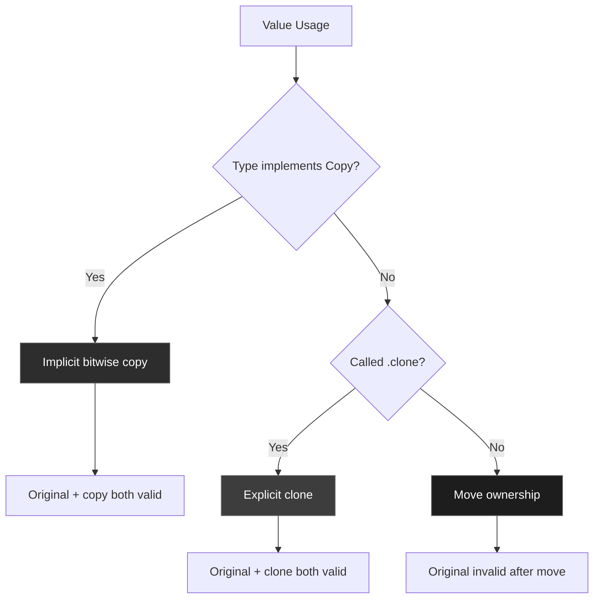
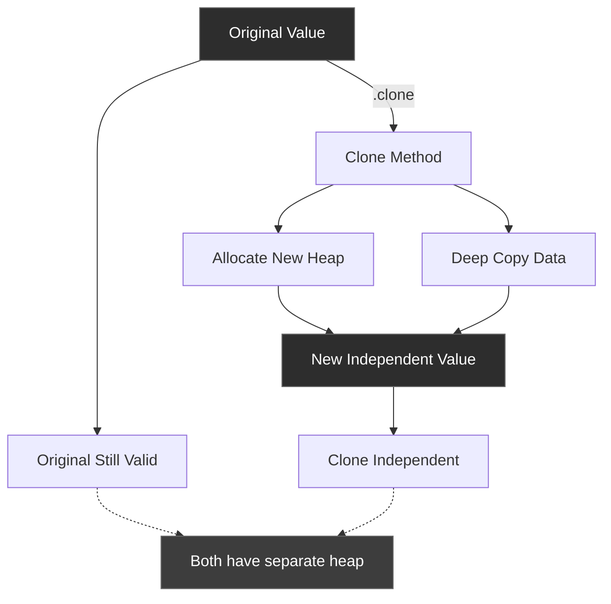
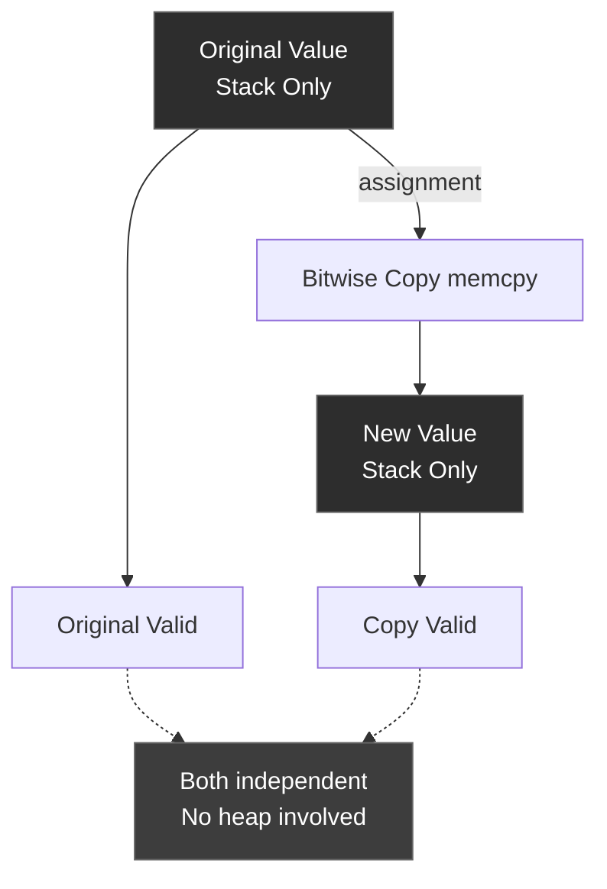
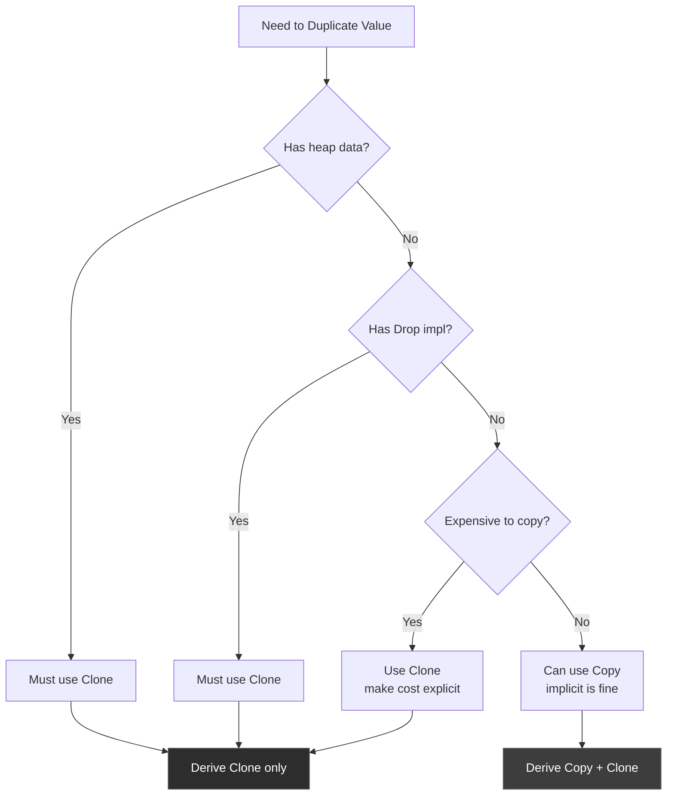
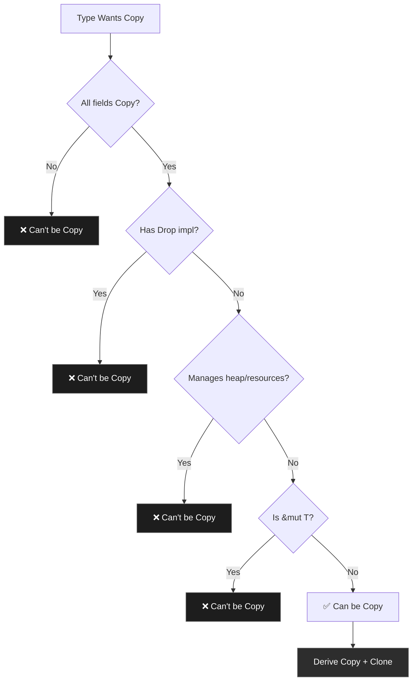

# R57: Clone and Copy Traits - Duplication Semantics in Rust

**Answer-First (Minto Pyramid)**

Clone enables explicit deep copying via .clone() method, creating independent heap-allocated duplicates. Copy enables implicit bitwise copying for stack-only types, automatically duplicating values on assignment/pass. Copy requires Clone (subtrait) and restricts types to those without heap resources or Drop implementations. Clone works for any type; Copy only for cheap-to-copy types (integers, bools, references, tuples of Copy types). Use Copy for primitive-like types, Clone for complex types with heap data. Copy types don't move; Clone types require explicit duplication.

---

## 1. The Problem: Ownership Prevents Reuse After Move

### 1.1 The Core Challenge

Rust's ownership rules mean values move on assignment, preventing further use:

```rust
fn consumer(s: String) { /* consumes s */ }

fn example() {
    let s = String::from("hello");
    consumer(s);              // s moved here
    println!("{}", s);        // ❌ ERROR: value used after move
}
```

You want to:
- **Keep using** the original value after passing to a function
- **Create duplicates** when needed
- **Maintain safety** - no dangling pointers or double-frees
- **Performance clarity** - explicit when copying is expensive

### 1.2 What Clone and Copy Provide

**Clone (Explicit Duplication)**: Manually create deep copies
```rust
let s = String::from("hello");
let t = s.clone();      // Explicit: allocates new heap memory
consumer(t);            // t consumed
println!("{}", s);      // ✅ s still valid
```

**Copy (Implicit Duplication)**: Automatic bitwise copies
```rust
let x: u32 = 5;
let y = x;              // Implicit: x bitwise copied to y
consumer(y);            // y consumed
println!("{}", x);      // ✅ x still valid (was copied, not moved)
```

---

## 2. The Solution: Two Duplication Strategies

### 2.1 Clone Trait - Explicit Deep Copying

```rust
pub trait Clone {
    fn clone(&self) -> Self;
    
    // Optional: optimization hint
    fn clone_from(&mut self, source: &Self) {
        *self = source.clone();
    }
}
```

**Pattern**: Call `.clone()` to create owned duplicate

```rust
let original = String::from("hello");
let duplicate = original.clone();  // Explicit allocation

// Both independent
assert_eq!(original, "hello");
assert_eq!(duplicate, "hello");
```

**Memory impact**: Allocates new heap memory for heap-based types

### 2.2 Copy Trait - Implicit Bitwise Copying

```rust
pub trait Copy: Clone { }
//              ^^^^^
//              Supertrait: Copy requires Clone
```

**Pattern**: Assignment/passing automatically copies

```rust
let x: i32 = 42;
let y = x;      // Implicit bitwise copy (memcpy)

// Both valid
assert_eq!(x, 42);
assert_eq!(y, 42);
```

**Memory impact**: Zero overhead - just copies stack bytes

### 2.3 Key Differences

| Aspect | Clone | Copy |
|--------|-------|------|
| **Invocation** | Explicit `.clone()` | Implicit (automatic) |
| **Trait type** | Regular trait | Marker trait (empty) |
| **Cost** | Can be expensive (heap) | Always cheap (stack only) |
| **Types** | Any type | Only stack-only types |
| **Move semantics** | Still moves unless cloned | Never moves |
| **Supertrait** | None | Requires Clone |

---

## 3. Mental Model: Time Stone Duplication Protocol

Think of Clone and Copy as the Time Stone's duplication capabilities from Doctor Strange:

**The Metaphor:**
- **Clone (Time Stone Active Duplication)** - Strange actively creates a duplicate timeline, allocating full resources
- **Copy (Automatic Timeline Branching)** - Simple moments automatically branch with no effort

### Metaphor Mapping Table

| Concept | MCU Metaphor | Technical Reality |
|---------|--------------|-------------------|
| Clone trait | Time Stone active duplication | Explicit .clone() creates new heap allocation |
| Copy trait | Automatic timeline split | Implicit bitwise memcpy on stack |
| Clone::clone() | Strange channeling stone power | Calls allocation + deep copy logic |
| Copy semantics | Natural time branching | Compiler inserts automatic memcpy |
| Heap data (String) | Complex timeline with divergent events | Requires Clone, can't be Copy |
| Stack data (i32) | Simple moment snapshot | Can be Copy (cheap) |
| Drop constraint | Timeline requiring cleanup ritual | Copy forbidden if Drop implemented |
| Supertrait (Clone) | Basic duplication ability | Copy requires Clone implementation |

### The Duplication Story

The Time Stone's duplication protocol has two modes:

**Active Duplication (Clone)**: When Doctor Strange needs to create a duplicate of a complex scenario (like the battle on Titan), he actively channels the Time Stone's power. This requires:
- **Conscious effort** - He must explicitly invoke `.clone()`
- **Resource allocation** - New timelines need full context (heap memory)
- **Deep copying** - All details of the scenario duplicated independently
- **Expensive operation** - Takes time and energy proportional to complexity

Example: `String::clone()` allocates new heap buffer and copies all characters.

**Automatic Branching (Copy)**: For simple moments (like the state of a counter), time naturally branches without effort:
- **No conscious effort** - Happens automatically on assignment
- **Trivial cost** - Just a snapshot of the moment (stack bytes)
- **Shallow copying** - Only immediate state, no complex resources
- **Instant operation** - Bitwise copy (memcpy) is nearly free

Example: `i32` copy just duplicates 4 bytes on the stack.

**The Constraint**: Complex timelines requiring cleanup rituals (Drop implementations) can't auto-branch. String manages heap memory (needs cleanup), so it can only be actively duplicated (Clone), not auto-branched (Copy).

---

## 4. Anatomy: How the Traits Work

### 4.1 Clone Trait Definition

```rust
pub trait Clone {
    // Required method
    fn clone(&self) -> Self;
    //      ^^^^^     ^^^^
    //      |         |---- Returns owned Self
    //      |-------------- Borrows self (non-consuming)
    
    // Optional method with default impl
    fn clone_from(&mut self, source: &Self) {
        *self = source.clone();
    }
}
```

**Characteristics**:
- Takes `&self` - borrows, doesn't consume
- Returns `Self` - owned value
- Can allocate heap memory
- Can be expensive (depends on type)
- Default `clone_from` optimizes repeated cloning

### 4.2 Copy Trait Definition

```rust
pub trait Copy: Clone { }
//              ^^^^^
//              Supertrait: must also implement Clone
```

**Characteristics**:
- Marker trait - no methods
- Supertrait is Clone
- Changes move semantics to copy semantics
- Compiler inserts automatic bitwise copies
- Only allowed for specific types

### 4.3 Copy Type Requirements

A type can implement Copy **only if**:

1. **No heap resources** - Type doesn't manage heap memory, file handles, etc.
2. **No Drop implementation** - Type doesn't have custom cleanup
3. **All fields are Copy** - Struct/tuple fields must all be Copy
4. **Not a mutable reference** - `&mut T` can never be Copy

```rust
// ✅ Can be Copy - all fields are Copy
#[derive(Copy, Clone)]
struct Point {
    x: i32,  // Copy
    y: i32,  // Copy
}

// ❌ Can't be Copy - String is not Copy
struct Label {
    text: String,  // Manages heap memory
}

// ❌ Can't be Copy - has Drop
struct Resource;
impl Drop for Resource {
    fn drop(&mut self) { /* cleanup */ }
}
```

### 4.4 The Copy-Clone Relationship

```rust
// Copy is a subtrait of Clone
pub trait Copy: Clone { }

// This means:
impl Copy for MyType { }  // ❌ ERROR: also need Clone

impl Clone for MyType {
    fn clone(&self) -> Self { /* ... */ }
}
impl Copy for MyType { }  // ✅ OK: Clone satisfied
```

**Why?** If Rust can copy implicitly (Copy), it must also work explicitly (Clone). Copy provides no-op Clone automatically.

### 4.5 Implicit Copy Semantics

When a type implements Copy, these operations copy instead of move:

```rust
let x: i32 = 5;

// Assignment copies
let y = x;          // x copied to y, both valid

// Function argument copies
fn consume(n: i32) { /* ... */ }
consume(x);         // x copied, still valid

// Return value copies
fn returns() -> i32 { x }
let z = returns();  // x copied, still valid
```

Without Copy, these would **move** ownership.

---

## 5. Common Patterns

### 5.1 Deriving Clone and Copy

Most types derive Clone and Copy:

```rust
// Copy types (must also derive Clone)
#[derive(Copy, Clone)]
struct Point {
    x: i32,
    y: i32,
}

// Clone-only types (heap data)
#[derive(Clone)]
struct Person {
    name: String,     // String is Clone, not Copy
    age: u32,
}
```

**Derive expansion** (what the compiler generates):
```rust
// For Point (Copy + Clone)
impl Clone for Point {
    fn clone(&self) -> Self {
        *self  // Just bitwise copy
    }
}
impl Copy for Point { }  // Empty marker

// For Person (Clone only)
impl Clone for Person {
    fn clone(&self) -> Self {
        Person {
            name: self.name.clone(),  // Calls String::clone
            age: self.age,             // Copy
        }
    }
}
```

### 5.2 Explicit Cloning with Clone

```rust
fn process(s: String) { /* consumes s */ }

fn main() {
    let original = String::from("hello");
    
    // Clone before passing
    process(original.clone());
    
    // Original still valid
    println!("{}", original);
}
```

**When to use**:
- Passing to function that takes ownership
- Storing in multiple places
- Creating backups before mutation

### 5.3 Avoiding Unnecessary Clones

❌ **Wasteful**:
```rust
fn print_string(s: String) {
    println!("{}", s);
}

let s = String::from("hello");
print_string(s.clone());  // Unnecessary heap allocation
```

✅ **Efficient**:
```rust
fn print_string(s: &str) {  // Take reference
    println!("{}", s);
}

let s = String::from("hello");
print_string(&s);  // No clone needed
```

### 5.4 Copy Types in Collections

```rust
// Copy types: simple to duplicate
let numbers: Vec<i32> = vec![1, 2, 3];
let first = numbers[0];     // Copies i32
let second = numbers[0];    // Copies again - both valid

// Clone types: must be explicit
let names: Vec<String> = vec!["Alice".to_string()];
let first = names[0].clone();   // Must clone
let second = names[0].clone();  // Must clone again
```

### 5.5 Clone for Shared Ownership

```rust
use std::rc::Rc;

let data = Rc::new(String::from("shared"));
let reference1 = data.clone();  // ✅ Clones Rc, not String
let reference2 = data.clone();  // ✅ Clones Rc, not String

// All point to same String heap data
assert_eq!(Rc::strong_count(&data), 3);
```

**Note**: `Rc::clone()` is cheap - just increments reference count.

---

## 6. Use Cases: When to Use Clone vs Copy

### 6.1 Use Clone When...

✅ **Type manages heap resources**
```rust
#[derive(Clone)]
struct Buffer {
    data: Vec<u8>,  // Heap allocation
}
```

✅ **Copying is expensive** (make it explicit)
```rust
#[derive(Clone)]
struct LargeStruct {
    big_array: [u8; 10_000],  // 10KB copy
}

let large = LargeStruct { big_array: [0; 10_000] };
let copy = large.clone();  // Explicit: "I know this is expensive"
```

✅ **Type has custom Drop**
```rust
#[derive(Clone)]
struct FileHandle {
    path: String,
}

impl Drop for FileHandle {
    fn drop(&mut self) {
        // Cleanup logic
    }
}
```

### 6.2 Use Copy When...

✅ **Type is small and stack-only**
```rust
#[derive(Copy, Clone)]
struct Color {
    r: u8,
    g: u8,
    b: u8,
}
```

✅ **Semantic copying is trivial**
```rust
#[derive(Copy, Clone)]
struct Coordinate {
    x: f64,
    y: f64,
}

let p1 = Coordinate { x: 1.0, y: 2.0 };
let p2 = p1;  // Implicit copy - feels natural
```

✅ **Type acts like primitive**
```rust
#[derive(Copy, Clone)]
enum Status {
    Active,
    Inactive,
}
```

### 6.3 Don't Use Copy When...

❌ **Type manages resources**
```rust
// ❌ Can't derive Copy
struct Connection {
    socket: TcpStream,  // Manages OS resource
}
```

❌ **Copying is semantically meaningful**
```rust
// ❌ Don't make this Copy (even if technically possible)
#[derive(Clone)]  // Not Copy
struct UserId(u64);

// Copying a user ID should be explicit and rare
let user = UserId(123);
let duplicate = user.clone();  // Clear intent
```

❌ **Type will grow in future**
```rust
// ❌ Don't make Copy if might add heap field later
#[derive(Clone)]  // Not Copy - future-proofing
struct Config {
    value: i32,
    // Might add: settings: HashMap<String, String>
}
```

---

## 7. Comparison: Clone vs Copy vs Move



### Comparison Table

| Operation | Copy Type (i32) | Clone Type (String) | Move (default) |
|-----------|----------------|---------------------|----------------|
| **Assignment** | let y = x; (copy) | let y = x; (move) | let y = x; (move) |
| **Original valid?** | ✅ Yes | ❌ No (unless cloned) | ❌ No |
| **Explicit dup** | Can call .clone() | Must call .clone() | N/A |
| **Cost** | Free (bitwise) | Expensive (heap alloc) | Free (ptr copy) |
| **Semantics** | Duplication | Duplication | Transfer ownership |

### Decision Tree

```
Need to reuse value after passing?
│
├─ Type is Copy?
│  ├─ YES → Just use it (automatic copy)
│  └─ NO → Explicitly .clone()
│
└─ Don't need reuse?
   └─ Pass by value (moves ownership)
```

---

## 8. Detailed Examples

### 8.1 Clone for Heap-Allocated Types

```rust
#[derive(Clone, Debug)]
struct Task {
    title: String,
    description: String,
}

fn process_task(task: Task) {
    println!("Processing: {:?}", task);
}

fn main() {
    let task = Task {
        title: "Write docs".to_string(),
        description: "Document Clone trait".to_string(),
    };
    
    // Clone before passing
    process_task(task.clone());
    
    // Original still valid
    println!("Original task: {:?}", task);
}
```

**Memory layout**:
```
Stack:
  task: { ptr_title, len, cap, ptr_desc, len, cap }
         |                    |
         v                    v
Heap:    [W][r][i][t][e]...  [D][o][c][u][m]...

After clone():
Stack:
  task:       { ptr1, len, cap, ptr2, len, cap }
  cloned_task: { ptr3, len, cap, ptr4, len, cap }
                |                |
                v                v
Heap:          [W][r][i]...     [D][o][c]...  (NEW allocations)
```

### 8.2 Copy for Stack-Only Types

```rust
#[derive(Copy, Clone, Debug)]
struct Point {
    x: i32,
    y: i32,
}

fn translate(mut p: Point, dx: i32, dy: i32) -> Point {
    p.x += dx;
    p.y += dy;
    p
}

fn main() {
    let p1 = Point { x: 0, y: 0 };
    let p2 = translate(p1, 10, 20);  // p1 copied
    
    // Both valid
    println!("p1: {:?}", p1);  // (0, 0)
    println!("p2: {:?}", p2);  // (10, 20)
}
```

**Memory layout**:
```
Stack:
  p1: { x: 0, y: 0 }        (8 bytes)
  
  // After assignment/pass
  p1: { x: 0, y: 0 }        (still valid)
  p2: { x: 10, y: 20 }      (bitwise copy)
  
  No heap allocations!
```

### 8.3 Mixed Clone and Copy in Structs

```rust
#[derive(Clone, Debug)]
struct User {
    id: u64,          // Copy
    name: String,     // Clone only
    age: u32,         // Copy
}

fn main() {
    let user1 = User {
        id: 1,
        name: "Alice".to_string(),
        age: 30,
    };
    
    let user2 = user1.clone();
    
    // Clone implementation:
    // - id: copied (Copy)
    // - name: cloned (heap allocation)
    // - age: copied (Copy)
    
    println!("{:?}", user1);  // Still valid
    println!("{:?}", user2);  // Independent copy
}
```

### 8.4 Copy Type Constraints

```rust
// ✅ Can derive Copy - all fields Copy
#[derive(Copy, Clone)]
struct Pair {
    first: i32,   // Copy
    second: i32,  // Copy
}

// ❌ Can't derive Copy - String not Copy
// #[derive(Copy, Clone)]  // ERROR
#[derive(Clone)]
struct Label {
    text: String,  // Not Copy
}

// ✅ Can derive Copy - references are Copy
#[derive(Copy, Clone)]
struct Ref<'a> {
    data: &'a i32,  // Shared ref is Copy
}

// ❌ Can't derive Copy - mutable refs not Copy
// #[derive(Copy, Clone)]  // ERROR
struct MutRef<'a> {
    data: &'a mut i32,  // Mutable ref never Copy
}
```

### 8.5 Clone vs Copy Performance

```rust
use std::time::Instant;

#[derive(Clone)]
struct LargeClone {
    data: Vec<u8>,  // Heap allocation
}

#[derive(Copy, Clone)]
struct SmallCopy {
    data: [u8; 8],  // Stack only
}

fn bench_clone() {
    let large = LargeClone { data: vec![0u8; 10_000] };
    
    let start = Instant::now();
    for _ in 0..1_000 {
        let _ = large.clone();  // 1000 heap allocations
    }
    println!("Clone: {:?}", start.elapsed());
}

fn bench_copy() {
    let small = SmallCopy { data: [0u8; 8] };
    
    let start = Instant::now();
    for _ in 0..1_000 {
        let _ = small;  // 1000 bitwise copies
    }
    println!("Copy: {:?}", start.elapsed());
}

// Clone: ~100-200µs (heap allocations)
// Copy: ~1-5µs (stack copies)
```

---

## 9. Architecture Diagrams

### 9.1 Clone Memory Allocation



### 9.2 Copy Bitwise Semantics



### 9.3 Clone vs Copy Decision Tree



### 9.4 Copy Trait Constraint Diagram



---

## 10. Best Practices and Idioms

### 10.1 Always Derive When Possible

✅ **Do:**
```rust
#[derive(Clone)]
struct MyType {
    field: String,
}
```

❌ **Don't:**
```rust
impl Clone for MyType {
    fn clone(&self) -> Self {
        MyType {
            field: self.field.clone(),
        }
    }
}
// Manual impl - unnecessary and error-prone
```

### 10.2 Copy Requires Clone

✅ **Do:**
```rust
#[derive(Copy, Clone)]
struct Point { x: i32, y: i32 }
```

❌ **Don't:**
```rust
#[derive(Copy)]  // ❌ ERROR: Copy requires Clone
struct Point { x: i32, y: i32 }
```

### 10.3 Make Clones Explicit and Rare

✅ **Prefer borrowing:**
```rust
fn process(data: &String) {  // Borrow
    println!("{}", data);
}

let s = String::from("hello");
process(&s);  // No clone needed
```

❌ **Avoid unnecessary clones:**
```rust
fn process(data: String) {  // Takes ownership
    println!("{}", data);
}

let s = String::from("hello");
process(s.clone());  // Wasteful if s not needed after
```

### 10.4 Clone Is Not Cheap - Document When Used

✅ **Document expensive clones:**
```rust
// Clone is expensive: 10MB heap allocation
let backup = large_dataset.clone();
```

### 10.5 Consider Rc/Arc for Shared Ownership

Instead of cloning large data:

❌ **Multiple clones:**
```rust
let data = vec![0u8; 1_000_000];
let copy1 = data.clone();  // 1MB allocation
let copy2 = data.clone();  // 1MB allocation
let copy3 = data.clone();  // 1MB allocation
```

✅ **Shared ownership:**
```rust
use std::rc::Rc;

let data = Rc::new(vec![0u8; 1_000_000]);
let ref1 = data.clone();  // Just increments count
let ref2 = data.clone();  // Just increments count
let ref3 = data.clone();  // Just increments count
```

### 10.6 Don't Make Types Copy Unless Obvious

❌ **Questionable:**
```rust
#[derive(Copy, Clone)]
struct BigStruct {
    data: [u8; 1024],  // 1KB - too large for Copy?
}
```

✅ **Be conservative:**
```rust
#[derive(Clone)]  // Not Copy - explicit cloning
struct BigStruct {
    data: [u8; 1024],
}
```

**Rule of thumb**: If copying feels significant, use Clone only.

---

## 11. Common Pitfalls

### 11.1 Forgetting Clone Returns New Value

❌ **Wrong:**
```rust
let s = String::from("hello");
s.clone();  // ❌ Clone result discarded!
println!("{}", s);
```

✅ **Correct:**
```rust
let s = String::from("hello");
let t = s.clone();  // ✅ Capture cloned value
println!("{} {}", s, t);
```

### 11.2 Unnecessary Clones in Loops

❌ **Inefficient:**
```rust
let data = String::from("hello");
for _ in 0..100 {
    process(data.clone());  // 100 heap allocations!
}
```

✅ **Efficient:**
```rust
let data = String::from("hello");
for _ in 0..100 {
    process(&data);  // Borrow instead
}
```

### 11.3 Cloning in Performance-Critical Code

```rust
// Profile first!
fn hot_path(input: &Vec<i32>) -> Vec<i32> {
    let mut result = input.clone();  // Is this necessary?
    // Can we work with references instead?
    result.sort();
    result
}
```

### 11.4 Copy Types with Large Arrays

❌ **Bad idea:**
```rust
#[derive(Copy, Clone)]
struct Large {
    data: [u8; 10_000],  // 10KB copy on every assignment!
}

let x = Large { data: [0; 10_000] };
let y = x;  // Implicit 10KB copy
```

✅ **Better:**
```rust
#[derive(Clone)]  // Not Copy
struct Large {
    data: Vec<u8>,  // Heap - just copies pointer
}
```

### 11.5 Deriving Copy on Future-Unstable Types

```rust
// Today: small, stack-only
#[derive(Copy, Clone)]
struct Config {
    port: u16,
    timeout: u32,
}

// Tomorrow: adds heap field
// #[derive(Copy, Clone)]  // ❌ BREAKS: can't add cache: HashMap
struct Config {
    port: u16,
    timeout: u32,
    cache: HashMap<String, String>,  // Can't be Copy now!
}
```

**Lesson**: Only derive Copy on truly primitive-like types that won't grow.

---

## 12. Testing Clone and Copy

### 12.1 Testing Clone Independence

```rust
#[cfg(test)]
mod tests {
    use super::*;
    
    #[test]
    fn clone_creates_independent_copy() {
        let original = String::from("hello");
        let mut cloned = original.clone();
        
        cloned.push_str(" world");
        
        assert_eq!(original, "hello");      // Original unchanged
        assert_eq!(cloned, "hello world");  // Clone modified
    }
    
    #[test]
    fn clone_allocates_new_heap() {
        let s1 = String::from("test");
        let s2 = s1.clone();
        
        // Different heap addresses
        assert_ne!(s1.as_ptr(), s2.as_ptr());
    }
}
```

### 12.2 Testing Copy Semantics

```rust
#[cfg(test)]
mod tests {
    #[test]
    fn copy_type_survives_move() {
        let x: i32 = 42;
        let y = x;  // Copy
        
        assert_eq!(x, 42);  // x still valid
        assert_eq!(y, 42);  // y has copy
    }
    
    #[test]
    fn copy_type_in_function() {
        fn consume(n: i32) -> i32 { n + 1 }
        
        let x: i32 = 10;
        let result = consume(x);  // x copied
        
        assert_eq!(x, 10);         // x still valid
        assert_eq!(result, 11);
    }
}
```

### 12.3 Testing Clone_from Optimization

```rust
#[cfg(test)]
mod tests {
    #[test]
    fn clone_from_reuses_allocation() {
        let source = String::from("hello world");
        let mut target = String::new();
        
        // clone_from may reuse target's allocation
        target.clone_from(&source);
        
        assert_eq!(target, "hello world");
    }
}
```

---

## 13. Advanced Topics

### 13.1 Custom Clone Implementation

Sometimes you need custom clone logic:

```rust
struct Database {
    connection: DbConnection,
}

impl Clone for Database {
    fn clone(&self) -> Self {
        // Custom: create new connection instead of cloning
        Database {
            connection: DbConnection::new_connection(),
        }
    }
}
```

### 13.2 Conditional Clone with Trait Bounds

```rust
struct Wrapper<T> {
    value: T,
}

// Only Clone if T is Clone
impl<T: Clone> Clone for Wrapper<T> {
    fn clone(&self) -> Self {
        Wrapper {
            value: self.value.clone(),
        }
    }
}
```

### 13.3 Clone and Smart Pointers

```rust
use std::rc::Rc;
use std::sync::Arc;

// Rc::clone - cheap (just increments refcount)
let rc1 = Rc::new(String::from("shared"));
let rc2 = rc1.clone();  // Increments count, no data clone
assert_eq!(Rc::strong_count(&rc1), 2);

// Arc::clone - cheap (atomic increment)
let arc1 = Arc::new(vec![1, 2, 3]);
let arc2 = arc1.clone();  // Thread-safe increment
assert_eq!(Arc::strong_count(&arc1), 2);

// Prefer Rc::clone(&rc) over rc.clone() for clarity
let rc3 = Rc::clone(&rc1);  // Clear: cloning Rc, not data
```

### 13.4 Clone and ToOwned

```rust
// ToOwned - more general than Clone
pub trait ToOwned {
    type Owned;
    fn to_owned(&self) -> Self::Owned;
}

// Example: &str -> String
let s: &str = "hello";
let owned: String = s.to_owned();  // Allocates String

// str doesn't impl Clone (unsized), but impls ToOwned
```

---

## 14. Real-World Examples

### 14.1 Configuration System

```rust
#[derive(Clone, Debug)]
struct AppConfig {
    host: String,
    port: u16,
    max_connections: u32,
    features: Vec<String>,
}

fn apply_overrides(mut config: AppConfig, overrides: &[Override]) -> AppConfig {
    for override in overrides {
        // Mutate config
    }
    config
}

fn main() {
    let base_config = AppConfig {
        host: "localhost".to_string(),
        port: 8080,
        max_connections: 100,
        features: vec!["auth".to_string()],
    };
    
    // Clone for different environments
    let dev_config = apply_overrides(base_config.clone(), &dev_overrides);
    let prod_config = apply_overrides(base_config.clone(), &prod_overrides);
    
    // base_config still valid for reference
}
```

### 14.2 Game Entity System

```rust
#[derive(Copy, Clone, Debug)]
struct Position {
    x: f32,
    y: f32,
}

#[derive(Copy, Clone, Debug)]
struct Velocity {
    dx: f32,
    dy: f32,
}

#[derive(Clone, Debug)]
struct Entity {
    position: Position,  // Copy
    velocity: Velocity,  // Copy
    name: String,        // Clone only
}

fn update_entities(entities: &mut [Entity], dt: f32) {
    for entity in entities {
        // Position and Velocity are Copy - easy to work with
        let pos = entity.position;  // Copy
        let vel = entity.velocity;  // Copy
        
        entity.position = Position {
            x: pos.x + vel.dx * dt,
            y: pos.y + vel.dy * dt,
        };
    }
}
```

### 14.3 Snapshot System

```rust
#[derive(Clone, Debug)]
struct GameState {
    player_position: Position,
    enemies: Vec<Enemy>,
    score: u32,
    level: u32,
}

struct SnapshotManager {
    history: Vec<GameState>,
    max_history: usize,
}

impl SnapshotManager {
    fn save_snapshot(&mut self, state: &GameState) {
        // Clone state for history
        self.history.push(state.clone());
        
        if self.history.len() > self.max_history {
            self.history.remove(0);
        }
    }
    
    fn restore_snapshot(&self, index: usize) -> Option<GameState> {
        self.history.get(index).cloned()  // Clone to return owned
    }
}
```

---

## Summary

**Clone** enables explicit deep copying via `.clone()`, allocating independent heap data. **Copy** enables implicit bitwise copying for stack-only types without heap resources. Copy requires Clone (subtrait) and restricts to cheap-to-copy types. Clone works for any type; Copy only for primitive-like types. Use `#[derive(Clone)]` for types with heap data; `#[derive(Copy, Clone)]` for simple stack types. Copy types never move on assignment; Clone types require explicit duplication. Copy changes semantics (copy vs move); Clone is just a method. Avoid unnecessary clones in hot paths—prefer borrowing. Copy forbidden for types with Drop, heap resources, or mutable references. Master these traits for idiomatic Rust ownership patterns.
