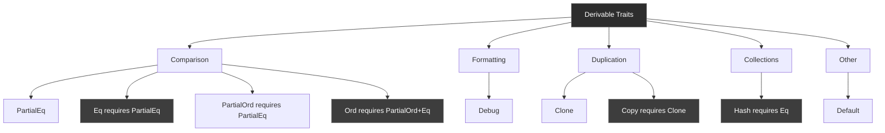

# R58: Derive Macros - Automatic Trait Implementation

**Answer-First (Minto Pyramid)**

Derive macros automatically generate trait implementations at compile-time, eliminating boilerplate for common traits (Debug, Clone, PartialEq, etc.). Specified as #[derive(Trait)] attributes above struct/enum definitions, they inspect type structure and generate appropriate code. Standard library provides derivable traits; third-party crates (serde, thiserror) offer custom derives. Derived implementations compare/clone fields in declaration order, require all fields to implement the derived trait. Use cargo-expand to inspect generated code. Derive reduces errors, ensures consistency, adapts automatically to struct changes.

---

## 1. The Problem: Boilerplate Trait Implementations

### 1.1 The Core Challenge

Implementing common traits manually is tedious and error-prone:

```rust
struct Ticket {
    title: String,
    description: String,
    status: String,
}

// Manual PartialEq - tedious!
impl PartialEq for Ticket {
    fn eq(&self, other: &Self) -> bool {
        self.title == other.title
            && self.description == other.description
            && self.status == other.status
    }
}

// Manual Clone - more tedium!
impl Clone for Ticket {
    fn clone(&self) -> Self {
        Ticket {
            title: self.title.clone(),
            description: self.description.clone(),
            status: self.status.clone(),
        }
    }
}

// Manual Debug - even more tedium!
impl std::fmt::Debug for Ticket {
    fn fmt(&self, f: &mut std::fmt::Formatter) -> std::fmt::Result {
        f.debug_struct("Ticket")
            .field("title", &self.title)
            .field("description", &self.description)
            .field("status", &self.status)
            .finish()
    }
}
```

Problems:
- **Repetitive** - Same pattern for every type
- **Brittle** - Adding fields requires updating all implementations
- **Error-prone** - Easy to forget fields or make mistakes
- **Verbose** - Hundreds of lines for simple types

### 1.2 What Derive Macros Provide

```rust
#[derive(Debug, Clone, PartialEq)]
struct Ticket {
    title: String,
    description: String,
    status: String,
}

// That's it! Three traits implemented automatically.
```

Benefits:
- **Automatic** - Compiler generates implementations
- **Consistent** - Generated code follows best practices
- **Maintainable** - Adapts when you add/remove fields
- **Concise** - One line instead of dozens

---

## 2. The Solution: Compile-Time Code Generation

### 2.1 What Are Derive Macros?

**Derive macros** are special Rust macros that:
1. Inspect your type's structure at compile time
2. Generate trait implementation code automatically
3. Insert that code into your program

```rust
#[derive(Clone)]
//      ^^^^^
//      This derive attribute triggers code generation
struct Point {
    x: i32,
    y: i32,
}

// Compiler generates:
impl Clone for Point {
    fn clone(&self) -> Self {
        Point {
            x: self.x.clone(),  // i32 is Copy, so this just copies
            y: self.y.clone(),
        }
    }
}
```

### 2.2 Standard Derivable Traits

Rust's standard library provides these derivable traits:

| Trait | Purpose | Requirements |
|-------|---------|--------------|
| `Debug` | Format with {:?} | All fields must be Debug |
| `Clone` | Explicit duplication | All fields must be Clone |
| `Copy` | Implicit duplication | All fields must be Copy, no heap |
| `PartialEq` | Equality comparison (==) | All fields must be PartialEq |
| `Eq` | Total equality | Must also derive PartialEq |
| `PartialOrd` | Ordering (<, >) | All fields must be PartialOrd |
| `Ord` | Total ordering | Must also derive PartialOrd + Eq |
| `Hash` | Hash for HashMap | All fields must be Hash |
| `Default` | Default values | All fields must be Default |

### 2.3 Syntax

```rust
// Single trait
#[derive(Debug)]
struct Point { x: i32, y: i32 }

// Multiple traits (comma-separated)
#[derive(Debug, Clone, PartialEq)]
struct Point { x: i32, y: i32 }

// Multiple attributes (equivalent)
#[derive(Debug)]
#[derive(Clone)]
#[derive(PartialEq)]
struct Point { x: i32, y: i32 }
```

---

## 3. Mental Model: Pym Particles Automatic Sizing Protocol

Think of derive macros as Ant-Man's Pym Particles technology - automatic transformation based on predefined rules:

**The Metaphor:**
- **Derive Macro** - Pym Particles disk triggering automatic transformation
- **Type Structure** - Original object being transformed (suit, vehicle, building)
- **Generated Code** - The transformation effect applied to the object
- **Trait Requirements** - Transformation compatibility (can only shrink objects that are "quantum compatible")

### Metaphor Mapping Table

| Concept | MCU Metaphor | Technical Reality |
|---------|--------------|-------------------|
| #[derive(...)] | Pym Particles disk attached to object | Attribute macro on type definition |
| Compiler analysis | Scanning object structure for compatibility | Inspecting type fields and structure |
| Code generation | Applying transformation effect | Generating trait impl code |
| Field requirements | All components must be quantum-compatible | All fields must implement the trait |
| cargo-expand | Viewing transformation in slow motion | Expanding macro to see generated code |
| Standard derives | Proven transformation formulas (shrink/grow) | Built-in derivable traits |
| Custom derives | Experimental formulas (time travel) | Third-party procedural macros |
| Derive failure | Non-compatible material detected | Field doesn't implement required trait |

### The Automatic Transformation Story

When Ant-Man attaches a Pym Particles disk to an object, the transformation happens automatically based on the disk's programming:

**Automatic Process**: Scott Lang doesn't manually shrink every atom—he just attaches the disk, and Pym Particles handle the details. Similarly, `#[derive(Clone)]` doesn't require you to write clone logic—the compiler analyzes your type and generates appropriate code.

**Compatibility Requirements**: Pym Particles only work on quantum-compatible materials. If any component isn't compatible, the transformation fails. Similarly, `#[derive(Clone)]` only works if ALL fields are `Clone`. One non-Clone field breaks the entire derivation.

**Consistent Application**: Pym Particles apply consistently to every component—if you shrink a car, the engine, wheels, and chassis all shrink proportionally. Similarly, derived implementations apply consistently to every field in declaration order.

**Observable Results**: Using specialized equipment, you can observe the transformation in detail (slow-motion replay). Similarly, `cargo-expand` lets you inspect exactly what code the derive macro generated.

---

## 4. Anatomy: How Derive Macros Work

### 4.1 The Derive Process

```
1. Parse:     #[derive(Clone)] → Compiler parses attribute
              struct Point { x: i32, y: i32 }
                 ↓
2. Analyze:   Check that Point's fields (x: i32, y: i32)
              all implement Clone
                 ↓
3. Generate:  Create impl Clone for Point { ... }
                 ↓
4. Insert:    Add generated code to compilation
                 ↓
5. Compile:   Compile as if you wrote it manually
```

### 4.2 Generated Code Example

**Your code:**
```rust
#[derive(Clone)]
struct Point {
    x: i32,
    y: i32,
}
```

**Generated code (simplified):**
```rust
impl Clone for Point {
    fn clone(&self) -> Self {
        Point {
            x: self.x.clone(),
            y: self.y.clone(),
        }
    }
}
```

**Actual generated code (cargo-expand):**
```rust
#[automatically_derived]
impl ::core::clone::Clone for Point {
    #[inline]
    fn clone(&self) -> Point {
        Point {
            x: ::core::clone::Clone::clone(&self.x),
            y: ::core::clone::Clone::clone(&self.y),
        }
    }
}
```

### 4.3 Field Order Matters

Derived implementations process fields in **declaration order**:

```rust
#[derive(PartialEq)]
struct Ticket {
    id: u64,        // Compared first
    title: String,  // Compared second
    status: String, // Compared third
}

// Generated eq compares in this order:
// id == other.id && title == other.title && status == other.status
```

For `PartialOrd` and `Ord`, this determines comparison order:
```rust
#[derive(PartialOrd, Ord, PartialEq, Eq)]
struct Version {
    major: u32,  // Compared first (most significant)
    minor: u32,  // Compared second
    patch: u32,  // Compared third (least significant)
}

// v1.2.3 < v1.3.0 < v2.0.0
```

### 4.4 Trait Requirements

Derive macros require all fields to implement the derived trait:

```rust
#[derive(Clone)]
struct Container {
    data: String,     // ✅ String implements Clone
    count: u32,       // ✅ u32 implements Clone
    callback: fn(),   // ✅ fn() implements Clone
}

// ❌ This won't compile:
#[derive(Clone)]
struct Container {
    data: String,
    file: std::fs::File,  // ❌ File doesn't implement Clone!
}
```

**Error message:**
```
error[E0277]: the trait bound `File: Clone` is not satisfied
```

---

## 5. Common Patterns

### 5.1 Standard Trait Derives

**Debug** - Essential for development:
```rust
#[derive(Debug)]
struct Point {
    x: i32,
    y: i32,
}

let p = Point { x: 10, y: 20 };
println!("{:?}", p);  // Point { x: 10, y: 20 }
println!("{:#?}", p); // Pretty-print
// Point {
//     x: 10,
//     y: 20,
// }
```

**Clone** - Explicit duplication:
```rust
#[derive(Clone)]
struct User {
    name: String,
    age: u32,
}

let user1 = User { name: "Alice".to_string(), age: 30 };
let user2 = user1.clone();  // Explicit clone
```

**Copy** - Implicit duplication (requires Clone):
```rust
#[derive(Copy, Clone)]  // Copy requires Clone
struct Point {
    x: i32,
    y: i32,
}

let p1 = Point { x: 1, y: 2 };
let p2 = p1;  // Implicit copy, p1 still valid
```

**PartialEq** - Equality comparison:
```rust
#[derive(PartialEq)]
struct Point {
    x: i32,
    y: i32,
}

let p1 = Point { x: 1, y: 2 };
let p2 = Point { x: 1, y: 2 };
assert!(p1 == p2);  // true
```

**Eq** - Total equality (requires PartialEq):
```rust
#[derive(PartialEq, Eq)]  // Eq requires PartialEq
struct UserId(u64);
```

### 5.2 Ordering Traits

**PartialOrd** - Partial ordering:
```rust
#[derive(PartialOrd, PartialEq)]
struct Priority {
    level: u32,
}

let p1 = Priority { level: 1 };
let p2 = Priority { level: 2 };
assert!(p1 < p2);
```

**Ord** - Total ordering (requires PartialOrd + Eq + PartialEq):
```rust
#[derive(Ord, PartialOrd, Eq, PartialEq)]
struct Timestamp {
    seconds: u64,
}

let mut times = vec![
    Timestamp { seconds: 100 },
    Timestamp { seconds: 50 },
    Timestamp { seconds: 200 },
];
times.sort();  // Uses Ord
```

### 5.3 Hash for Collections

```rust
use std::collections::HashMap;

#[derive(Hash, Eq, PartialEq)]
struct UserId(u64);

let mut map: HashMap<UserId, String> = HashMap::new();
map.insert(UserId(1), "Alice".to_string());
map.insert(UserId(2), "Bob".to_string());
```

### 5.4 Default for Initialization

```rust
#[derive(Default)]
struct Config {
    host: String,     // Default: ""
    port: u16,        // Default: 0
    enabled: bool,    // Default: false
}

let config = Config::default();
assert_eq!(config.port, 0);
```

### 5.5 Combining Multiple Derives

```rust
#[derive(Debug, Clone, PartialEq, Eq, Hash)]
struct User {
    id: u64,
    name: String,
}

// Now User can:
// - Be printed with {:?}
// - Be cloned explicitly
// - Be compared with ==
// - Be used as HashMap key
```

---

## 6. Use Cases: When to Derive Each Trait

### 6.1 Debug - Always Derive

✅ **Derive Debug on everything:**
```rust
#[derive(Debug)]
struct MyType {
    // ...
}
```

**Why?** Essential for:
- Debugging with `println!("{:?}", value)`
- Error messages
- Testing assertions
- Development workflow

**Exception:** Only skip for types with sensitive data (passwords, keys).

### 6.2 Clone - Derive When Duplication Needed

✅ **Derive when:**
- Type needs explicit duplication
- Passing to functions that take ownership
- Storing in multiple places

```rust
#[derive(Clone)]
struct Config {
    settings: HashMap<String, String>,
}

let config = Config { settings: HashMap::new() };
let backup = config.clone();  // Explicit clone for backup
```

❌ **Don't derive when:**
- Type manages unique resources (file handles, connections)
- Cloning is semantically wrong (unique IDs)

### 6.3 Copy - Derive for Small Stack Types

✅ **Derive when:**
- Type is small (<= 16 bytes)
- All fields are Copy
- Acts like a primitive

```rust
#[derive(Copy, Clone)]
struct Point {
    x: f64,
    y: f64,
}
```

❌ **Don't derive when:**
- Type contains heap data (String, Vec)
- Type has Drop implementation
- Copying might be expensive

### 6.4 PartialEq - Derive for Comparison

✅ **Derive when:**
- Type needs equality comparison
- Comparing all fields makes sense

```rust
#[derive(PartialEq)]
struct User {
    id: u64,
    name: String,
}
```

❌ **Don't derive when:**
- Need custom equality logic (e.g., case-insensitive strings)
- Some fields shouldn't be compared

### 6.5 Hash - Derive for Collection Keys

✅ **Derive when:**
- Type will be HashMap/HashSet key
- Also derive Eq + PartialEq

```rust
#[derive(Hash, Eq, PartialEq)]
struct CacheKey {
    user_id: u64,
    resource: String,
}
```

---

## 7. Inspecting Generated Code

### 7.1 Using cargo-expand

Install cargo-expand:
```bash
cargo install cargo-expand
```

Expand macros:
```bash
cargo expand
```

**Example:**

Your code:
```rust
#[derive(Clone, Debug)]
struct Point {
    x: i32,
    y: i32,
}
```

Expanded (cargo expand):
```rust
struct Point {
    x: i32,
    y: i32,
}

#[automatically_derived]
impl ::core::clone::Clone for Point {
    #[inline]
    fn clone(&self) -> Point {
        Point {
            x: ::core::clone::Clone::clone(&self.x),
            y: ::core::clone::Clone::clone(&self.y),
        }
    }
}

#[automatically_derived]
impl ::core::fmt::Debug for Point {
    fn fmt(&self, f: &mut ::core::fmt::Formatter) -> ::core::fmt::Result {
        ::core::fmt::Formatter::debug_struct_field2_finish(
            f,
            "Point",
            "x",
            &self.x,
            "y",
            &&self.y,
        )
    }
}
```

### 7.2 IDE Support

Most IDEs can expand macros inline:
- **rust-analyzer**: "Expand macro recursively" command
- **IntelliJ Rust**: "Show macro expansion" action

---

## 8. Custom Derive Macros

### 8.1 Third-Party Derives

Popular crates provide custom derive macros:

**serde** - Serialization:
```rust
use serde::{Serialize, Deserialize};

#[derive(Serialize, Deserialize)]
struct User {
    name: String,
    age: u32,
}

// Enables JSON/YAML/etc. serialization
let json = serde_json::to_string(&user)?;
```

**thiserror** - Error types:
```rust
use thiserror::Error;

#[derive(Error, Debug)]
enum MyError {
    #[error("IO error: {0}")]
    Io(#[from] std::io::Error),
    
    #[error("Parse error: {0}")]
    Parse(String),
}
```

**clap** - CLI argument parsing:
```rust
use clap::Parser;

#[derive(Parser)]
struct Args {
    #[arg(short, long)]
    verbose: bool,
    
    file: String,
}
```

### 8.2 Writing Custom Derives

Custom derive macros are procedural macros. Basic structure:

```rust
// In a separate crate with proc-macro = true
use proc_macro::TokenStream;
use quote::quote;
use syn::{parse_macro_input, DeriveInput};

#[proc_macro_derive(MyTrait)]
pub fn derive_my_trait(input: TokenStream) -> TokenStream {
    let input = parse_macro_input!(input as DeriveInput);
    let name = &input.ident;
    
    let expanded = quote! {
        impl MyTrait for #name {
            // Generated implementation
        }
    };
    
    TokenStream::from(expanded)
}
```

**Resources:**
- [The Little Book of Rust Macros](https://veykril.github.io/tlborm/)
- [Proc Macro Workshop](https://github.com/dtolnay/proc-macro-workshop)

---

## 9. Architecture Diagrams

### 9.1 Derive Macro Flow

```mermaid
graph TD
    A[#[derive Trait]] --> B[Compiler Parse]
    B --> C{All fields<br/>implement Trait?}
    
    C -->|No| D[Compile Error]
    C -->|Yes| E[Generate impl Code]
    
    E --> F[Insert into AST]
    F --> G[Compile as Normal]
    
    G --> H[Final Binary]
    
    D --> I[Show Error Message]
    
    style E fill:#2d2d2d,stroke:#666,color:#fff
    style H fill:#2d2d2d,stroke:#666,color:#fff
    style D fill:#3d3d3d,stroke:#666,color:#fff
```

### 9.2 Field Requirement Check

```mermaid
graph TD
    A[Type with #[derive Clone]] --> B[Field 1: String]
    A --> C[Field 2: u32]
    A --> D[Field 3: File]
    
    B --> E{String: Clone?}
    C --> F{u32: Clone?}
    D --> G{File: Clone?}
    
    E -->|Yes| H[✓]
    F -->|Yes| I[✓]
    G -->|No| J[✗ Error]
    
    H --> K{All checked?}
    I --> K
    J --> L[Compilation Fails]
    
    K -->|Yes| M[Generate impl]
    
    style M fill:#2d2d2d,stroke:#666,color:#fff
    style L fill:#1d1d1d,stroke:#666,color:#fff
```

### 9.3 Standard Derivable Traits Hierarchy



### 9.4 Derive vs Manual Implementation

```mermaid
graph LR
    A[Need Trait Impl] --> B{Standard<br/>behavior?}
    
    B -->|Yes| C[#[derive Trait]]
    B -->|No| D[Manual impl]
    
    C --> E[Automatic<br/>Consistent<br/>Maintainable]
    
    D --> F[Custom logic<br/>Special cases<br/>Optimization]
    
    style C fill:#2d2d2d,stroke:#666,color:#fff
    style E fill:#2d2d2d,stroke:#666,color:#fff
    style D fill:#3d3d3d,stroke:#666,color:#fff
```

---

## 10. Best Practices

### 10.1 Always Derive Debug

✅ **Do:**
```rust
#[derive(Debug)]
struct MyType {
    // ...
}
```

**Why?** You'll thank yourself when debugging.

### 10.2 Derive Order Convention

✅ **Consistent ordering:**
```rust
#[derive(Debug, Clone, PartialEq, Eq, PartialOrd, Ord, Hash)]
struct MyType {
    // ...
}
```

Common conventions:
1. Debug (always first)
2. Clone/Copy
3. Equality (PartialEq, Eq)
4. Ordering (PartialOrd, Ord)
5. Hash
6. Other traits

### 10.3 Derive Dependencies

Respect trait requirements:

✅ **Do:**
```rust
#[derive(Copy, Clone)]  // Copy requires Clone
#[derive(Eq, PartialEq)]  // Eq requires PartialEq
#[derive(Ord, PartialOrd, Eq, PartialEq)]  // Ord requires all
```

❌ **Don't:**
```rust
#[derive(Copy)]  // ❌ Missing Clone
#[derive(Eq)]    // ❌ Missing PartialEq
```

### 10.4 Don't Derive Unnecessarily

❌ **Don't over-derive:**
```rust
#[derive(Debug, Clone, PartialEq, Eq, PartialOrd, Ord, Hash, Default)]
struct InternalState {
    // Do you really need all these?
}
```

✅ **Derive what you need:**
```rust
#[derive(Debug)]  // Just what's needed
struct InternalState {
    // ...
}
```

### 10.5 Custom Implementation When Needed

Sometimes manual is better:

```rust
#[derive(Clone)]  // Auto-derive Clone
struct User {
    id: u64,
    name: String,
    password_hash: String,
}

// But custom Debug to hide password
impl std::fmt::Debug for User {
    fn fmt(&self, f: &mut std::fmt::Formatter) -> std::fmt::Result {
        f.debug_struct("User")
            .field("id", &self.id)
            .field("name", &self.name)
            .field("password_hash", &"[REDACTED]")
            .finish()
    }
}
```

---

## 11. Common Pitfalls

### 11.1 Forgetting Trait Dependencies

❌ **Error:**
```rust
#[derive(Copy)]  // ❌ Copy requires Clone
struct Point {
    x: i32,
    y: i32,
}
```

✅ **Fix:**
```rust
#[derive(Copy, Clone)]
struct Point {
    x: i32,
    y: i32,
}
```

### 11.2 Deriving on Non-Compatible Types

❌ **Error:**
```rust
#[derive(Copy, Clone)]
struct Container {
    data: String,  // ❌ String is not Copy
}
```

✅ **Fix:**
```rust
#[derive(Clone)]  // Remove Copy
struct Container {
    data: String,
}
```

### 11.3 Field Order Affecting Behavior

```rust
#[derive(PartialOrd, Ord, PartialEq, Eq)]
struct Version {
    patch: u32,  // ⚠️ Wrong order! patch compared first
    minor: u32,
    major: u32,
}

// v0.0.2 > v1.0.1 (because 2 > 1 in first field)
```

✅ **Fix - order matters:**
```rust
#[derive(PartialOrd, Ord, PartialEq, Eq)]
struct Version {
    major: u32,  // ✅ Most significant first
    minor: u32,
    patch: u32,
}
```

### 11.4 Deriving Hash Without Eq

❌ **Inconsistent:**
```rust
#[derive(Hash, PartialEq)]  // ❌ Should also derive Eq
struct Key {
    id: u64,
}
```

✅ **Consistent:**
```rust
#[derive(Hash, Eq, PartialEq)]
struct Key {
    id: u64,
}
```

**Why?** HashMap requires `Eq` for correctness.

---

## 12. Testing Derived Traits

### 12.1 Testing Debug

```rust
#[cfg(test)]
mod tests {
    use super::*;
    
    #[test]
    fn test_debug_format() {
        #[derive(Debug)]
        struct Point { x: i32, y: i32 }
        
        let p = Point { x: 1, y: 2 };
        let debug = format!("{:?}", p);
        
        assert!(debug.contains("Point"));
        assert!(debug.contains("x: 1"));
        assert!(debug.contains("y: 2"));
    }
}
```

### 12.2 Testing PartialEq

```rust
#[cfg(test)]
mod tests {
    #[test]
    fn test_equality() {
        #[derive(PartialEq)]
        struct Point { x: i32, y: i32 }
        
        let p1 = Point { x: 1, y: 2 };
        let p2 = Point { x: 1, y: 2 };
        let p3 = Point { x: 2, y: 1 };
        
        assert_eq!(p1, p2);
        assert_ne!(p1, p3);
    }
}
```

### 12.3 Testing Ord

```rust
#[cfg(test)]
mod tests {
    #[test]
    fn test_ordering() {
        #[derive(Ord, PartialOrd, Eq, PartialEq)]
        struct Priority { level: u32 }
        
        let p1 = Priority { level: 1 };
        let p2 = Priority { level: 2 };
        let p3 = Priority { level: 3 };
        
        let mut vec = vec![p3, p1, p2];
        vec.sort();
        
        assert_eq!(vec[0].level, 1);
        assert_eq!(vec[1].level, 2);
        assert_eq!(vec[2].level, 3);
    }
}
```

---

## 13. Real-World Examples

### 13.1 Domain Model

```rust
#[derive(Debug, Clone, PartialEq, Eq)]
pub struct User {
    pub id: UserId,
    pub email: Email,
    pub created_at: Timestamp,
}

#[derive(Debug, Clone, Copy, PartialEq, Eq, Hash)]
pub struct UserId(pub u64);

#[derive(Debug, Clone, PartialEq, Eq)]
pub struct Email(String);

#[derive(Debug, Clone, Copy, PartialEq, Eq, PartialOrd, Ord)]
pub struct Timestamp(pub u64);
```

### 13.2 Configuration System

```rust
#[derive(Debug, Clone, PartialEq)]
pub struct AppConfig {
    pub server: ServerConfig,
    pub database: DatabaseConfig,
    pub logging: LoggingConfig,
}

#[derive(Debug, Clone, PartialEq)]
pub struct ServerConfig {
    #[serde(default = "default_host")]
    pub host: String,
    
    #[serde(default = "default_port")]
    pub port: u16,
}

fn default_host() -> String {
    "0.0.0.0".to_string()
}

fn default_port() -> u16 {
    8080
}
```

### 13.3 Error Types with thiserror

```rust
use thiserror::Error;

#[derive(Error, Debug)]
pub enum ApplicationError {
    #[error("Database error: {0}")]
    Database(#[from] sqlx::Error),
    
    #[error("Validation error: {0}")]
    Validation(String),
    
    #[error("Not found: {0}")]
    NotFound(String),
    
    #[error("Unauthorized")]
    Unauthorized,
}
```

### 13.4 API Types with serde

```rust
use serde::{Serialize, Deserialize};

#[derive(Debug, Clone, Serialize, Deserialize)]
pub struct CreateUserRequest {
    pub email: String,
    pub name: String,
}

#[derive(Debug, Clone, Serialize, Deserialize)]
pub struct UserResponse {
    pub id: u64,
    pub email: String,
    pub name: String,
    pub created_at: String,
}
```

---

## Summary

**Derive macros** automatically generate trait implementations at compile-time via `#[derive(Trait)]` attributes. Standard library provides nine derivable traits (Debug, Clone, Copy, PartialEq, Eq, PartialOrd, Ord, Hash, Default). All fields must implement the derived trait; compiler checks this requirement. Generated code processes fields in declaration order, affecting comparison/ordering semantics. Use `cargo-expand` to inspect generated code. Third-party crates (serde, thiserror, clap) provide powerful custom derives. Always derive Debug for development; derive other traits as needed. Respect trait dependencies (Copy requires Clone, Eq requires PartialEq, Ord requires PartialOrd+Eq). Derive macros eliminate boilerplate, ensure consistency, adapt automatically to type changes—essential for idiomatic Rust development.
