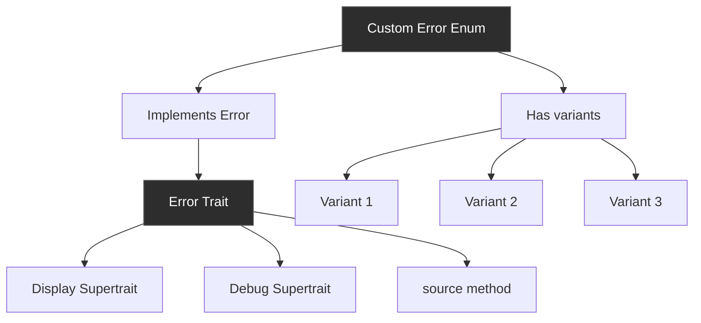
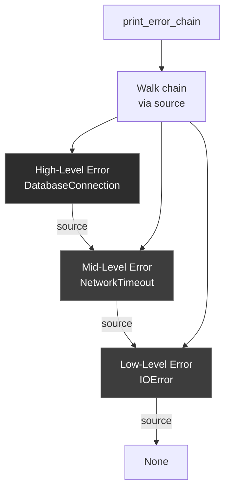
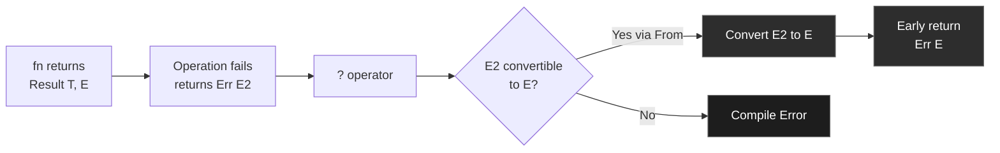

# R59: Custom Error Types and thiserror - Structured Error Handling

**Answer-First (Minto Pyramid)**

Custom error types use enums to represent different failure modes with type-safe variants. The std::error::Error trait requires Debug + Display implementations for error reporting. thiserror crate eliminates boilerplate via derive macros, providing #[error(...)] attributes for Display formatting and #[from] for automatic From implementations. Error enums enable pattern matching on failure cases, Error::source() links error chains, TryFrom/TryInto return Result for fallible conversions. Use error enums over strings for maintainability, implement Error trait for ecosystem compatibility, leverage thiserror for production code.

---

## 1. The Problem: String Errors Are Brittle

### 1.1 The Core Challenge

Using strings for errors creates fragile, unmaintainable code:

```rust
fn validate_ticket(title: &str) -> Result<(), String> {
    if title.is_empty() {
        return Err("Title cannot be empty".to_string());
    }
    if title.len() > 50 {
        return Err("Title too long".to_string());
    }
    Ok(())
}

// Caller must match on strings - brittle!
match validate_ticket(title) {
    Ok(()) => println!("Valid"),
    Err(msg) if msg.contains("empty") => {
        // This breaks if error message changes!
    }
    Err(msg) => println!("Error: {}", msg),
}
```

Problems:
- **No type safety** - Strings can be anything
- **Brittle matching** - Changes to error messages break code
- **Poor IDE support** - No autocomplete for error cases
- **Hard to document** - No explicit error contract
- **Missing context** - Can't attach structured data

### 1.2 What Custom Error Types Provide

```rust
#[derive(thiserror::Error, Debug)]
enum TicketError {
    #[error("Title cannot be empty")]
    TitleEmpty,
    
    #[error("Title too long: {length} chars (max 50)")]
    TitleTooLong { length: usize },
    
    #[error("Description cannot be empty")]
    DescriptionEmpty,
}

fn validate_ticket(title: &str) -> Result<(), TicketError> {
    if title.is_empty() {
        return Err(TicketError::TitleEmpty);
    }
    if title.len() > 50 {
        return Err(TicketError::TitleTooLong { length: title.len() });
    }
    Ok(())
}

// Type-safe error handling
match validate_ticket(title) {
    Ok(()) => println!("Valid"),
    Err(TicketError::TitleEmpty) => {
        // Compiler ensures this variant exists
    }
    Err(TicketError::TitleTooLong { length }) => {
        // Structured data available
        println!("Too long: {} chars", length);
    }
    _ => {}
}
```

Benefits:
- **Type safety** - Errors are checked at compile time
- **Exhaustive matching** - Compiler ensures all cases handled
- **Rich context** - Attach structured data to errors
- **Self-documenting** - Error variants are explicit API
- **Refactor-safe** - Renaming errors shows compiler errors

---

## 2. The Solution: Error Enums + Error Trait + thiserror

### 2.1 Error Enums - Typed Failure Modes

```rust
enum ParseError {
    NotANumber,
    TooLarge,
    Negative,
}

fn parse_u32(s: &str) -> Result<u32, ParseError> {
    let n: i64 = s.parse()
        .map_err(|_| ParseError::NotANumber)?;
    
    if n < 0 {
        return Err(ParseError::Negative);
    }
    if n > u32::MAX as i64 {
        return Err(ParseError::TooLarge);
    }
    Ok(n as u32)
}
```

### 2.2 The Error Trait - Standardized Interface

```rust
pub trait Error: Debug + Display {
    fn source(&self) -> Option<&(dyn Error + 'static)> {
        None
    }
}
```

**Requirements:**
- **Debug** - Developer-friendly representation ({:?})
- **Display** - User-friendly error message ({})
- **source()** - Optional error cause for chaining

### 2.3 thiserror - Derive-Based Error Creation

```rust
use thiserror::Error;

#[derive(Error, Debug)]
pub enum MyError {
    #[error("IO error")]
    Io(#[from] std::io::Error),
    
    #[error("Parse error: {0}")]
    Parse(String),
    
    #[error("Invalid value: {value}, expected {expected}")]
    InvalidValue {
        value: i32,
        expected: i32,
    },
}
```

**Features:**
- `#[error(...)]` - Display format string
- `#[from]` - Automatic From implementation
- `#[source]` - Error cause tracking
- Field interpolation - `{field}` in messages

---

## 3. Mental Model: S.H.I.E.L.D. Threat Classification System

Think of custom error types as S.H.I.E.L.D.'s threat classification and reporting protocol:

**The Metaphor:**
- **Error Enum** - Threat level classification (Level 1-10, specific threat types)
- **Error Variants** - Specific threat categories (Hydra, Alien, Tech, Supernatural)
- **Error Trait** - Standard threat report format (briefing for different audiences)
- **thiserror** - Automated report generation system
- **Error Chaining** - Threat cause analysis (root cause investigation)

### Metaphor Mapping Table

| Concept | MCU Metaphor | Technical Reality |
|---------|--------------|-------------------|
| Error enum | Threat classification system | Enum with variants for failure modes |
| Error variants | Specific threat types (Hydra, Alien) | Enum variants (TitleEmpty, IOError) |
| Display impl | Public briefing for citizens | User-friendly error message |
| Debug impl | Technical report for agents | Developer-friendly debug output |
| Error::source() | Threat cause investigation | Error chain navigation |
| thiserror | Automated report generator | Derive macro for Error trait |
| #[error("...")] | Report template | Display format string |
| #[from] attribute | Automatic threat escalation | From impl for error conversion |

### The Threat Classification Story

When S.H.I.E.L.D. detects a threat, they follow a structured protocol:

**Threat Categories**: Instead of vague reports like "something bad happened," S.H.I.E.L.D. classifies threats into specific categories—Hydra infiltration, alien invasion, tech malfunction, supernatural event. Similarly, error enums classify failures into specific, type-safe variants instead of generic strings.

**Standardized Reporting**: S.H.I.E.L.D. maintains two report formats—public briefings for citizens (Display) and technical reports for agents (Debug). The Error trait requires both: Display for end users, Debug for developers. This ensures errors are properly documented at all levels.

**Cause Investigation**: When a threat occurs, S.H.I.E.L.D. investigates the root cause. "Quinjet crashed" links to "engine failure" links to "Hydra sabotage." Similarly, Error::source() tracks error chains, allowing you to navigate from high-level errors (database connection failed) to root causes (network timeout).

**Automated Systems**: S.H.I.E.L.D. uses automated systems to generate threat reports from field data. Similarly, thiserror automatically generates Error trait implementations from derive macros, eliminating boilerplate while maintaining consistency.

---

## 4. Anatomy: The Error Trait and Manual Implementation

### 4.1 The Complete Error Trait

```rust
pub trait Error: Debug + Display {
    // Optional: provide error cause
    fn source(&self) -> Option<&(dyn Error + 'static)> {
        None
    }
    
    // Deprecated, don't use
    fn description(&self) -> &str {
        "description() is deprecated; use Display"
    }
    
    // Deprecated, don't use
    fn cause(&self) -> Option<&dyn Error> {
        self.source()
    }
}
```

### 4.2 Manual Implementation (Without thiserror)

```rust
#[derive(Debug)]
pub enum TicketError {
    TitleEmpty,
    TitleTooLong { length: usize },
    DescriptionEmpty,
}

// Required: Display implementation
impl std::fmt::Display for TicketError {
    fn fmt(&self, f: &mut std::fmt::Formatter) -> std::fmt::Result {
        match self {
            Self::TitleEmpty => write!(f, "Title cannot be empty"),
            Self::TitleTooLong { length } => {
                write!(f, "Title too long: {} chars (max 50)", length)
            }
            Self::DescriptionEmpty => write!(f, "Description cannot be empty"),
        }
    }
}

// Required: Error trait implementation
impl std::error::Error for TicketError {}
```

### 4.3 With thiserror (Recommended)

```rust
use thiserror::Error;

#[derive(Error, Debug)]
pub enum TicketError {
    #[error("Title cannot be empty")]
    TitleEmpty,
    
    #[error("Title too long: {length} chars (max 50)")]
    TitleTooLong { length: usize },
    
    #[error("Description cannot be empty")]
    DescriptionEmpty,
}

// That's it! Display and Error automatically implemented
```

### 4.4 Error Chaining with source()

```rust
use thiserror::Error;
use std::io;

#[derive(Error, Debug)]
pub enum DatabaseError {
    #[error("Failed to connect")]
    ConnectionFailed {
        #[source]  // This error is the cause
        source: io::Error,
    },
    
    #[error("Query failed: {query}")]
    QueryFailed {
        query: String,
        #[source]
        source: io::Error,
    },
}

// Walking the error chain
fn print_error_chain(err: &dyn std::error::Error) {
    eprintln!("Error: {}", err);
    let mut source = err.source();
    while let Some(err) = source {
        eprintln!("  Caused by: {}", err);
        source = err.source();
    }
}
```

---

## 5. Common Patterns

### 5.1 Simple Error Enum

```rust
use thiserror::Error;

#[derive(Error, Debug)]
pub enum ValidationError {
    #[error("Value is too small")]
    TooSmall,
    
    #[error("Value is too large")]
    TooLarge,
    
    #[error("Value is invalid")]
    Invalid,
}

fn validate(value: i32) -> Result<(), ValidationError> {
    if value < 0 {
        Err(ValidationError::TooSmall)
    } else if value > 100 {
        Err(ValidationError::TooLarge)
    } else {
        Ok(())
    }
}
```

### 5.2 Error with Contextual Data

```rust
use thiserror::Error;

#[derive(Error, Debug)]
pub enum ConfigError {
    #[error("Missing required field: {field}")]
    MissingField { field: String },
    
    #[error("Invalid value for {field}: {value}")]
    InvalidValue { field: String, value: String },
    
    #[error("Parse error at line {line}: {message}")]
    ParseError { line: usize, message: String },
}
```

### 5.3 Wrapping External Errors

```rust
use thiserror::Error;
use std::io;

#[derive(Error, Debug)]
pub enum MyError {
    #[error("IO error")]
    Io(#[from] io::Error),
    
    #[error("Parse error")]
    Parse(#[from] std::num::ParseIntError),
    
    #[error("Custom error: {0}")]
    Custom(String),
}

fn process() -> Result<(), MyError> {
    // ? automatically converts io::Error to MyError::Io
    let content = std::fs::read_to_string("file.txt")?;
    
    // ? automatically converts ParseIntError to MyError::Parse
    let number: i32 = content.trim().parse()?;
    
    Ok(())
}
```

### 5.4 Error with Multiple Sources

```rust
use thiserror::Error;

#[derive(Error, Debug)]
pub enum ApplicationError {
    #[error("Database error")]
    Database(#[from] DatabaseError),
    
    #[error("Network error")]
    Network(#[from] NetworkError),
    
    #[error("Validation error")]
    Validation(#[from] ValidationError),
}

// Multiple error types can be converted to ApplicationError
fn run() -> Result<(), ApplicationError> {
    connect_database()?;  // DatabaseError -> ApplicationError
    fetch_data()?;        // NetworkError -> ApplicationError
    validate()?;          // ValidationError -> ApplicationError
    Ok(())
}
```

### 5.5 Transparent Error Propagation

```rust
use thiserror::Error;

#[derive(Error, Debug)]
pub enum MyError {
    // Transparent forwards the error as-is
    #[error(transparent)]
    External(#[from] std::io::Error),
    
    #[error("Custom error: {0}")]
    Custom(String),
}

// Display and Debug delegate to io::Error for External variant
```

---

## 6. Use Cases: When to Use Each Pattern

### 6.1 Library Public API

✅ **Use error enums:**
```rust
use thiserror::Error;

#[derive(Error, Debug)]
pub enum LibraryError {
    #[error("Invalid input: {0}")]
    InvalidInput(String),
    
    #[error("Resource not found: {0}")]
    NotFound(String),
    
    #[error("Operation not permitted")]
    PermissionDenied,
}
```

### 6.2 Application-Level Errors

✅ **Aggregate multiple error types:**
```rust
use thiserror::Error;

#[derive(Error, Debug)]
pub enum AppError {
    #[error("Database error")]
    Database(#[from] sqlx::Error),
    
    #[error("HTTP error")]
    Http(#[from] reqwest::Error),
    
    #[error("Configuration error: {0}")]
    Config(String),
}
```

### 6.3 Domain Validation

✅ **Specific, descriptive errors:**
```rust
use thiserror::Error;

#[derive(Error, Debug)]
pub enum UserError {
    #[error("Email already exists: {email}")]
    EmailExists { email: String },
    
    #[error("Password too weak: {reason}")]
    WeakPassword { reason: String },
    
    #[error("User not found: {id}")]
    NotFound { id: u64 },
}
```

### 6.4 Internal Implementation

✅ **Use anyhow for convenience:**
```rust
use anyhow::{Result, Context};

fn internal_operation() -> Result<()> {
    let data = std::fs::read_to_string("file.txt")
        .context("Failed to read file")?;
    
    let value: i32 = data.trim().parse()
        .context("Failed to parse number")?;
    
    Ok(())
}
```

**Note**: Use `anyhow` for applications, `thiserror` for libraries.

---

## 7. thiserror Attributes Reference

### 7.1 #[error(...)] - Display Format

```rust
use thiserror::Error;

#[derive(Error, Debug)]
pub enum MyError {
    // Simple message
    #[error("Something went wrong")]
    Simple,
    
    // Interpolate tuple field
    #[error("Error: {0}")]
    WithMessage(String),
    
    // Interpolate named fields
    #[error("Invalid value: {value} (expected {expected})")]
    InvalidValue { value: i32, expected: i32 },
    
    // Use Display of wrapped type
    #[error("Wrapped: {0}")]
    Wrapped(std::io::Error),
}
```

### 7.2 #[from] - Automatic From Implementation

```rust
use thiserror::Error;
use std::io;

#[derive(Error, Debug)]
pub enum MyError {
    #[error("IO error")]
    Io(#[from] io::Error),
    
    #[error("Parse error")]
    Parse(#[from] std::num::ParseIntError),
}

// Automatically generated:
// impl From<io::Error> for MyError { ... }
// impl From<ParseIntError> for MyError { ... }

fn example() -> Result<(), MyError> {
    std::fs::read_to_string("file.txt")?;  // ? converts io::Error
    "42".parse::<i32>()?;                    // ? converts ParseIntError
    Ok(())
}
```

### 7.3 #[source] - Error Cause

```rust
use thiserror::Error;

#[derive(Error, Debug)]
pub enum MyError {
    #[error("Operation failed")]
    Failed {
        #[source]  // This is the cause
        cause: std::io::Error,
    },
}

// Error::source() returns Some(&cause)
```

### 7.4 #[transparent] - Delegate to Inner Error

```rust
use thiserror::Error;

#[derive(Error, Debug)]
pub enum MyError {
    // Completely transparent - Display and Debug delegate
    #[error(transparent)]
    Other(#[from] anyhow::Error),
}
```

### 7.5 #[backtrace] - Capture Stack Traces

```rust
use thiserror::Error;

#[derive(Error, Debug)]
pub enum MyError {
    #[error("Operation failed")]
    Failed {
        #[backtrace]
        backtrace: std::backtrace::Backtrace,
    },
}
```

---

## 8. Architecture Diagrams

### 8.1 Error Type Hierarchy



### 8.2 Error Chaining with source()



### 8.3 thiserror Code Generation

```mermaid
graph TD
    A[#[derive Error]] --> B[Parse enum]
    B --> C[Generate Display impl]
    B --> D[Generate Error impl]
    B --> E[Generate From impls]
    
    F[#[error ...]] --> C
    G[#[from]] --> E
    H[#[source]] --> D
    
    C --> I[Final Code]
    D --> I
    E --> I
    
    style A fill:#2d2d2d,stroke:#666,color:#fff
    style I fill:#2d2d2d,stroke:#666,color:#fff
```

### 8.4 Error Propagation with ?



---

## 9. Best Practices

### 9.1 Always Implement Error for Public Types

✅ **Do:**
```rust
#[derive(Error, Debug)]
pub enum MyError {
    #[error("Error occurred")]
    Occurred,
}
```

❌ **Don't:**
```rust
// Missing Error implementation
#[derive(Debug)]
pub enum MyError {
    Occurred,
}
```

### 9.2 Provide Meaningful Error Messages

✅ **Informative:**
```rust
#[derive(Error, Debug)]
pub enum ConfigError {
    #[error("Missing required field '{field}' in config file '{file}'")]
    MissingField { field: String, file: String },
}
```

❌ **Vague:**
```rust
#[derive(Error, Debug)]
pub enum ConfigError {
    #[error("Invalid config")]
    Invalid,
}
```

### 9.3 Use #[from] for Error Conversion

✅ **Automatic conversion:**
```rust
#[derive(Error, Debug)]
pub enum MyError {
    #[error("IO error")]
    Io(#[from] std::io::Error),
}

fn example() -> Result<(), MyError> {
    std::fs::read_to_string("file.txt")?;  // Automatic conversion
    Ok(())
}
```

❌ **Manual conversion:**
```rust
fn example() -> Result<(), MyError> {
    std::fs::read_to_string("file.txt")
        .map_err(|e| MyError::Io(e))?;  // Verbose
    Ok(())
}
```

### 9.4 Libraries Use thiserror, Applications Use anyhow

**Libraries** (public API):
```rust
use thiserror::Error;

#[derive(Error, Debug)]
pub enum LibError {
    #[error("Library error: {0}")]
    Error(String),
}
```

**Applications** (internal):
```rust
use anyhow::{Result, Context};

fn app_logic() -> Result<()> {
    do_something().context("Failed to do something")?;
    Ok(())
}
```

### 9.5 Don't Lose Error Context

✅ **Preserve context:**
```rust
#[derive(Error, Debug)]
pub enum MyError {
    #[error("Failed to read config from {path}")]
    ConfigRead {
        path: String,
        #[source]
        source: std::io::Error,
    },
}
```

❌ **Lose context:**
```rust
#[derive(Error, Debug)]
pub enum MyError {
    #[error("Config error")]
    Config(std::io::Error),  // Lost: which file?
}
```

---

## 10. Real-World Examples

### 10.1 Web API Error Types

```rust
use thiserror::Error;

#[derive(Error, Debug)]
pub enum ApiError {
    #[error("Resource not found: {resource}")]
    NotFound { resource: String },
    
    #[error("Unauthorized: {reason}")]
    Unauthorized { reason: String },
    
    #[error("Validation error: {0}")]
    Validation(String),
    
    #[error("Database error")]
    Database(#[from] sqlx::Error),
    
    #[error("Internal server error")]
    Internal(#[from] anyhow::Error),
}

// Convert to HTTP responses
impl ApiError {
    pub fn status_code(&self) -> u16 {
        match self {
            ApiError::NotFound { .. } => 404,
            ApiError::Unauthorized { .. } => 401,
            ApiError::Validation(_) => 400,
            ApiError::Database(_) => 500,
            ApiError::Internal(_) => 500,
        }
    }
}
```

### 10.2 File Processing Errors

```rust
use thiserror::Error;
use std::path::PathBuf;

#[derive(Error, Debug)]
pub enum FileError {
    #[error("File not found: {path}")]
    NotFound { path: PathBuf },
    
    #[error("Permission denied: {path}")]
    PermissionDenied { path: PathBuf },
    
    #[error("Invalid format in {path} at line {line}")]
    InvalidFormat { path: PathBuf, line: usize },
    
    #[error("IO error on {path}")]
    Io {
        path: PathBuf,
        #[source]
        source: std::io::Error,
    },
}
```

### 10.3 Business Logic Errors

```rust
use thiserror::Error;

#[derive(Error, Debug)]
pub enum OrderError {
    #[error("Insufficient stock: requested {requested}, available {available}")]
    InsufficientStock { requested: u32, available: u32 },
    
    #[error("Invalid payment method: {method}")]
    InvalidPaymentMethod { method: String },
    
    #[error("Order total ${total} below minimum ${minimum}")]
    BelowMinimum { total: f64, minimum: f64 },
    
    #[error("Customer {customer_id} not found")]
    CustomerNotFound { customer_id: u64 },
}
```

### 10.4 Parsing Errors

```rust
use thiserror::Error;

#[derive(Error, Debug)]
pub enum ParseError {
    #[error("Unexpected token '{token}' at position {pos}")]
    UnexpectedToken { token: String, pos: usize },
    
    #[error("Missing closing delimiter '{delimiter}' at position {pos}")]
    UnclosedDelimiter { delimiter: char, pos: usize },
    
    #[error("Invalid escape sequence '\\{seq}' at position {pos}")]
    InvalidEscape { seq: char, pos: usize },
    
    #[error("Unexpected end of input")]
    UnexpectedEof,
}
```

---

## Summary

**Custom error types** use enums to represent typed failure modes with pattern-matchable variants. The **Error trait** requires Debug + Display for standardized error reporting, with optional source() for error chaining. **thiserror** eliminates boilerplate via derive macros: #[error("...")] for Display formatting, #[from] for automatic From implementations, #[source] for error causes. Error enums provide type safety, exhaustive matching, and refactor-proof code compared to string errors. Use thiserror for libraries (public API), anyhow for applications (internal logic). Provide meaningful error messages with context, preserve error chains with source(), leverage ? operator for automatic error conversion. Custom error types are essential for maintainable, production-grade Rust error handling.
