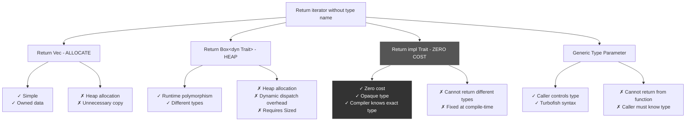

# R61: `impl Trait` - Opaque Type Returns and Argument Simplification

## Problem: Unnameable Iterator Types Need Return Syntax

**ANSWER UPFRONT**: `impl Trait` lets functions return complex iterator/closure types without naming them explicitly. In **return position** (RPIT), it's an opaque fixed type known to compiler. In **argument position**, it's shorthand for generic trait bounds.

**What's Wrong**: Returning `Vec<&Ticket>` allocates heap memory. Better to return an iterator (`filter()` result), but its type `std::iter::Filter<I, P>` includes an anonymous closure predicate `P` that has no name—literally cannot be written.

**The Solution**: Use `impl Iterator<Item = &Ticket>` as return type. Compiler knows exact type, but caller only sees trait bound. Fixed at compile-time (not generic), zero cost.

**Why It Matters**: Enables zero-cost iterator patterns, avoids unnecessary allocations, makes APIs flexible without exposing internal complexity. Essential for modern Rust library design.

---

## MCU Metaphor: Pym Particles Quantum Shrinking Protocol

**The Story**: Dr. Hank Pym's shrinking/growing technology returns to "normal" size without revealing quantum realm coordinates. `impl Trait` is like returning "something sized" without exposing subatomic position data.

**The Mapping**:

| Rust Concept | MCU Equivalent | How It Works |
|--------------|----------------|--------------|
| `impl Trait` return | Pym Particles quantum state | "Ant-sized object" without quantum coordinates |
| Opaque type | Quantum realm masking | Compiler knows exact state, caller sees only "shrunken" |
| RPIT | Return position shrinking | Function returns quantum object, caller can't name it |
| APIT | Argument position protocol | Accept "any shrinkable" following Pym Particle rules |
| Unnameable closure | Quantum uncertainty | Exact quantum state exists but cannot be measured/written |
| Generic vs impl Trait | Polymorphic vs fixed quantum | Generic = many states, impl = single hidden state |
| Iterator without allocation | Zero-energy traversal | Navigate quantum realm without creating new universe |

**The Insight**: Just as Pym Particles allow objects to shrink and grow while hiding quantum realm coordinates, `impl Trait` returns complex types (iterators with closures) while hiding their exact names. The compiler knows the precise "quantum state" (concrete type), but callers only see the "size category" (trait bounds)—enabling zero-cost abstractions without type complexity.

---

## Anatomy of `impl Trait`

### Return Position Impl Trait (RPIT)

```rust
// Problem: What type does this return?
impl TicketStore {
    pub fn to_dos(&self) -> ??? {
        // filter() returns Filter<Iter<'_, Ticket>, CLOSURE>
        // But the closure type has no name!
        self.tickets.iter().filter(|t| t.status == Status::ToDo)
    }
}

// Solution: Use impl Trait
impl TicketStore {
    pub fn to_dos(&self) -> impl Iterator<Item = &Ticket> {
        self.tickets.iter().filter(|t| t.status == Status::ToDo)
    }
}

// Caller perspective:
let store = TicketStore::new();
let todos: impl Iterator<Item = &Ticket> = store.to_dos();
// Can call .collect(), .count(), .map(), etc.
// Cannot know exact Filter<...> type
```

**Key Properties**:
- **Opaque to caller**: Type hidden behind trait bound
- **Fixed at compile-time**: Not generic, single concrete type per function
- **No heap allocation**: Compiler monomorphizes directly
- **Zero cost**: Same performance as naming the exact type

### Argument Position Impl Trait (APIT)

```rust
// Shorthand syntax
fn print_iter(iter: impl Iterator<Item = i32>) {
    for i in iter {
        println!("{}", i);
    }
}

// Equivalent to generic with trait bound
fn print_iter<T>(iter: T)
where
    T: Iterator<Item = i32>
{
    for i in iter {
        println!("{}", i);
    }
}

// Both accept any iterator of i32
print_iter(vec![1, 2, 3].into_iter());
print_iter((1..10).filter(|x| x % 2 == 0));
```

**Difference from Generics**:
- **APIT**: Cannot use turbofish (`::<>`) to specify type explicitly
- **Generic**: Caller can disambiguate with `func::<ConcreteType>(arg)`

**Rule of thumb**: Prefer generics over APIT for flexibility in complex scenarios.

---

## Use Cases: When `impl Trait` Shines

### 1. Returning Iterators (Most Common)

```rust
struct Library {
    books: Vec<String>,
}

impl Library {
    // Instead of Vec allocation
    fn fiction_books(&self) -> impl Iterator<Item = &str> {
        self.books
            .iter()
            .filter(|b| b.starts_with("Fiction:"))
            .map(|b| b.as_str())
    }
    
    // Multiple trait bounds
    fn sorted_books(&self) -> impl Iterator<Item = &str> + Clone {
        self.books.iter().map(|b| b.as_str())
    }
}

// Caller can chain without allocation
let lib = Library::new();
let count = lib.fiction_books().count();  // No Vec created
let collected: Vec<_> = lib.fiction_books().collect();  // Allocate only if needed
```

### 2. Returning Closures

```rust
// Closures have unnameable types
fn make_multiplier(factor: i32) -> impl Fn(i32) -> i32 {
    move |x| x * factor
}

let times_three = make_multiplier(3);
assert_eq!(times_three(5), 15);

// Without impl Trait, you'd need to box (heap allocation!)
fn make_multiplier_old(factor: i32) -> Box<dyn Fn(i32) -> i32> {
    Box::new(move |x| x * factor)  // Heap allocation!
}
```

### 3. Simplifying Complex Type Signatures

```rust
use std::collections::HashMap;

// Before impl Trait: type alias hell
type MyIter<'a> = std::iter::Map<
    std::collections::hash_map::Iter<'a, String, i32>,
    fn((&'a String, &'a i32)) -> &'a str
>;

// With impl Trait: readable
fn get_keys(map: &HashMap<String, i32>) -> impl Iterator<Item = &str> {
    map.iter().map(|(k, _v)| k.as_str())
}
```

### 4. Future/Async Return Types

```rust
async fn fetch_data() -> impl std::future::Future<Output = String> {
    // Async functions implicitly return impl Future
    async { "data".to_string() }
}

// This is why async fn works!
async fn fetch() -> String {
    "data".to_string()
}
// Desugars to:
// fn fetch() -> impl Future<Output = String> { ... }
```

---

## Pattern Comparison: `impl Trait` vs Alternatives



### When NOT to Use `impl Trait`

#### Cannot Return Different Types in Branches

```rust
// DOES NOT COMPILE
fn get_iter(flag: bool) -> impl Iterator<Item = i32> {
    if flag {
        vec![1, 2, 3].into_iter()  // IntoIter<i32>
    } else {
        (1..10).filter(|x| x % 2 == 0)  // Filter<Range<i32>, closure>
    }
}
// Error: match arms have incompatible types
// impl Trait must resolve to ONE type

// Solution: Use Box<dyn Trait> for runtime polymorphism
fn get_iter(flag: bool) -> Box<dyn Iterator<Item = i32>> {
    if flag {
        Box::new(vec![1, 2, 3].into_iter())
    } else {
        Box::new((1..10).filter(|x| x % 2 == 0))
    }
}
```

#### Cannot Use as Struct Field Directly

```rust
// DOES NOT COMPILE
struct Container {
    iter: impl Iterator<Item = i32>,  // Error: only allowed in fn signatures
}

// Solution: Use generic type parameter
struct Container<I>
where
    I: Iterator<Item = i32>,
{
    iter: I,
}
```

---

## Key Gotchas and Debugging

### Gotcha 1: Lifetime Elision Breaks

```rust
// This works fine
fn first_todo(tickets: &[Ticket]) -> impl Iterator<Item = &Ticket> {
    tickets.iter().filter(|t| t.status == Status::ToDo)
}

// But what if you add more inputs?
fn filtered(tickets: &[Ticket], statuses: &[Status]) -> impl Iterator<Item = &Ticket> {
    // Error: lifetime may not live long enough
    tickets.iter().filter(|t| statuses.contains(&t.status))
}

// Fix: Explicit lifetime annotations
fn filtered<'a>(
    tickets: &'a [Ticket],
    statuses: &'a [Status]
) -> impl Iterator<Item = &'a Ticket> + 'a {
    tickets.iter().filter(|t| statuses.contains(&t.status))
}
```

**Why**: `impl Trait` doesn't automatically capture all lifetimes. Must explicitly bound return type with `+ 'a`.

### Gotcha 2: APIT Hides Turbofish

```rust
fn process<T: Iterator<Item = i32>>(iter: T) {
    // Can call with turbofish
}
process::<std::vec::IntoIter<i32>>(vec![1, 2, 3].into_iter());

fn process(iter: impl Iterator<Item = i32>) {
    // CANNOT call with turbofish
}
process::<???>(vec![1, 2, 3].into_iter());  // Error: cannot specify type
```

**Fix**: Use generics when caller needs explicit type control.

### Gotcha 3: Cannot Name the Type for Storage

```rust
fn make_iter() -> impl Iterator<Item = i32> {
    (1..10).filter(|x| x % 2 == 0)
}

// Cannot store it without generic parameter
let my_iter = make_iter();  // What type is my_iter?
// Compiler knows: Filter<Range<i32>, [closure@...]>
// You cannot write this type!

// If you need to store it:
struct Container<I> {
    iter: I,
}
let container = Container { iter: make_iter() };  // I is inferred
```

---

## Technical Deep Dive: Opaque Types vs Generics

### What's Really Happening

```rust
// This function:
fn make_iter() -> impl Iterator<Item = i32> {
    vec![1, 2, 3].into_iter()
}

// Compiler sees (conceptually):
fn make_iter() -> std::vec::IntoIter<i32> {
    vec![1, 2, 3].into_iter()
}
// But hides IntoIter from caller's perspective

// Caller sees:
let x = make_iter();  // Type: impl Iterator<Item = i32> (opaque)
// Can call: x.next(), x.map(), x.filter(), etc.
// Cannot: construct new IntoIter, access internal fields
```

### Monomorphization

```rust
// Generic function
fn process<T: Iterator<Item = i32>>(iter: T) -> i32 {
    iter.sum()
}

// Calling with different types creates multiple copies
process(vec![1].into_iter());     // process::<IntoIter<i32>> generated
process((1..10).filter(|_| true)); // process::<Filter<...>> generated

// impl Trait function
fn make_iter() -> impl Iterator<Item = i32> {
    vec![1].into_iter()
}

// Only ONE implementation exists
let a = make_iter();  // Uses same function
let b = make_iter();  // Uses same function
// No polymorphism - fixed type!
```

### RFC 1522 Summary

From [RFC 1522](https://rust-lang.github.io/rfcs/1522-conservative-impl-trait.html):
- **RPIT** (Return Position): Opaque type known to compiler, hidden from caller
- **APIT** (Argument Position): Syntactic sugar for generic with trait bound
- No runtime cost, purely compile-time feature
- Cannot change return type across branches (must be single type)

---

## Common Patterns and Idioms

### Pattern: Lazy Iterator Chains

```rust
impl Database {
    // Returns iterator, caller decides when to collect
    pub fn active_users(&self) -> impl Iterator<Item = &User> {
        self.users
            .iter()
            .filter(|u| u.active)
            .filter(|u| u.verified)
    }
}

// Caller can:
// 1. Count without allocation
let count = db.active_users().count();

// 2. Find first without full scan
let first = db.active_users().next();

// 3. Collect to Vec only if needed
let vec: Vec<_> = db.active_users().collect();

// 4. Chain more operations
let names: Vec<_> = db.active_users()
    .map(|u| &u.name)
    .collect();
```

### Pattern: Multiple Trait Bounds

```rust
fn sorted_evens() -> impl Iterator<Item = i32> + Clone + Debug {
    (0..100).filter(|x| x % 2 == 0)
}

// Caller can clone the iterator
let iter1 = sorted_evens();
let iter2 = iter1.clone();  // Works because + Clone

// And debug print it
println!("{:?}", iter1);  // Works because + Debug
```

### Pattern: Async Functions (Implicit `impl Future`)

```rust
// This:
async fn fetch() -> String {
    "data".to_string()
}

// Desugars to:
fn fetch() -> impl Future<Output = String> {
    async { "data".to_string() }
}

// Why async fn works: returns opaque Future type
```

---

## Mental Model: The Pym Particles Quantum Protocol

Think of `impl Trait` like Ant-Man's shrinking:

1. **Quantum Realm Entry** (Function with impl Trait):
   - Scott Lang enters quantum realm with exact coordinates (concrete type)
   - Returns to normal size without revealing subatomic data (opaque to caller)

2. **Shrinking Categories** (Trait Bounds):
   - "Ant-sized" = `Iterator<Item = T>`
   - "Molecule-sized" = `Iterator + Clone`
   - Category visible, exact quantum state hidden

3. **Fixed Quantum State** (Not Generic):
   - Each shrinking event has ONE precise quantum position
   - Multiple calls use SAME protocol (fixed type)
   - Not polymorphic - single state per function

4. **Zero Energy Cost** (Zero Runtime Cost):
   - No heap allocation (like Vec)
   - No dynamic dispatch (like Box<dyn>)
   - Compiler knows exact type, inlines everything

5. **Cannot Change Mid-Flight** (Single Type Rule):
   - Once shrunk, cannot switch to different quantum state
   - Must commit to one shrinking protocol per function
   - Use Box<dyn> for runtime polymorphism instead

**The Analogy**: Just as Pym Particles let you work with shrunken objects without knowing their quantum coordinates, `impl Trait` lets you work with complex types (iterators, closures) without knowing their exact names—enabling zero-cost abstractions while hiding implementation complexity.

---

## Best Practices

### ✅ DO: Use RPIT for Iterators

```rust
// Good: Zero allocation, flexible for caller
fn get_items(&self) -> impl Iterator<Item = &Item> {
    self.items.iter().filter(|i| i.active)
}
```

### ✅ DO: Use APIT for Simple Function Signatures

```rust
// Good: Cleaner than generic + where clause
fn print_all(items: impl Iterator<Item = String>) {
    items.for_each(|s| println!("{}", s));
}
```

### ✅ DO: Add Lifetime Bounds When Capturing References

```rust
fn filtered<'a>(data: &'a [i32], threshold: &'a i32) 
    -> impl Iterator<Item = &'a i32> + 'a 
{
    data.iter().filter(move |x| *x > threshold)
}
```

### ✅ DO: Use Multiple Trait Bounds When Needed

```rust
fn make_iter() -> impl Iterator<Item = i32> + Clone + Debug {
    vec![1, 2, 3].into_iter()
}
```

### ❌ DON'T: Use APIT When Caller Needs Turbofish

```rust
// Bad: Cannot specify type explicitly
fn process(iter: impl Iterator<Item = i32>) { }

// Good: Allows process::<ConcreteType>(...)
fn process<T: Iterator<Item = i32>>(iter: T) { }
```

### ❌ DON'T: Return Different Types Across Branches

```rust
// Bad: Won't compile
fn get_iter(flag: bool) -> impl Iterator<Item = i32> {
    if flag {
        vec![1].into_iter()  // Type A
    } else {
        (1..10).filter(|_| true)  // Type B - ERROR!
    }
}

// Good: Use Box<dyn> for runtime polymorphism
fn get_iter(flag: bool) -> Box<dyn Iterator<Item = i32>> {
    if flag {
        Box::new(vec![1].into_iter())
    } else {
        Box::new((1..10).filter(|_| true))
    }
}
```

### ❌ DON'T: Use as Struct Fields (Use Generics Instead)

```rust
// Bad: Not allowed
struct Bad {
    iter: impl Iterator<Item = i32>,  // Error!
}

// Good: Generic parameter
struct Good<I: Iterator<Item = i32>> {
    iter: I,
}
```

---

## Real-World Example: API Design

```rust
pub struct Database {
    users: Vec<User>,
    posts: Vec<Post>,
}

impl Database {
    // Return iterators instead of Vec for efficiency
    pub fn active_users(&self) -> impl Iterator<Item = &User> {
        self.users.iter().filter(|u| u.active)
    }
    
    pub fn posts_by_user(&self, user_id: UserId) 
        -> impl Iterator<Item = &Post> 
    {
        self.posts.iter().filter(move |p| p.author_id == user_id)
    }
    
    // Multiple trait bounds for flexibility
    pub fn sorted_users(&self) 
        -> impl Iterator<Item = &User> + Clone 
    {
        self.users.iter().filter(|u| u.active)
    }
    
    // APIT for accepting any iterator
    pub fn count_active(&self, users: impl Iterator<Item = &User>) -> usize {
        users.filter(|u| u.active).count()
    }
}

// Usage: Caller controls allocation
let db = Database::new();

// Count without allocation
let count = db.active_users().count();

// Collect only if needed
let vec: Vec<_> = db.active_users().collect();

// Chain operations
let names: Vec<String> = db.active_users()
    .map(|u| u.name.clone())
    .collect();

// Clone iterator (requires + Clone bound)
let iter1 = db.sorted_users();
let iter2 = iter1.clone();
```

---

## The Essence: Opaque Zero-Cost Abstraction

`impl Trait` is Rust's solution to **unnameable types** (closures, complex iterators) while maintaining **zero-cost abstractions**. It's not generic (not polymorphic), but a compiler-known opaque type that hides complexity from callers.

**Return Position**: Hide complex iterator/closure types, return "something that implements Trait"  
**Argument Position**: Shorthand for generic trait bound (prefer generics for flexibility)  
**Zero Cost**: No heap allocation, no dynamic dispatch, compiler inlines everything  
**Single Type**: Fixed at compile-time, cannot change across branches

Like Pym Particles hiding quantum coordinates while enabling shrinking/growing capabilities, `impl Trait` hides type names while enabling zero-cost iterator chains and closure returns—essential for modern Rust API design and async programming.
