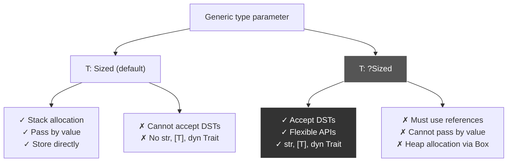

# R62: `Sized` Trait - Compile-Time Known Size and Dynamically Sized Types

## Problem: Not All Types Have Known Size at Compile-Time

**ANSWER UPFRONT**: `Sized` is a marker trait indicating compile-time known size. Most types are `Sized` (u32, String, &str). **Dynamically Sized Types (DSTs)** like `str` and `[T]` have unknown size, requiring **fat pointers** (pointer + metadata). Generic parameters implicitly bound by `T: Sized` unless opted out with `T: ?Sized`.

**What's Wrong**: Rust needs to know stack allocation size at compile-time. Types like `str` (string slice) have variable length—compiler cannot know size. Solution: references to DSTs (`&str`) become **fat pointers** (pointer + length), making the reference itself `Sized`.

**The Solution**: `Sized` trait marks types with compile-time known size. Compiler automatically implements it (auto trait). For DSTs, use references/pointers that store metadata alongside pointer.

**Why It Matters**: Enables stack allocation, generic type inference, and explains why `&str` is two `usize` values (fat pointer). Fundamental to Rust's memory model and zero-cost abstractions.

---

## MCU Metaphor: Vision's Mind Stone Size Calculation Protocol

**The Story**: Vision's physical form is powered by the Mind Stone, which grants him compile-time knowledge of his molecular structure. `Sized` types are like Vision—exact dimensions known. DSTs are like the quantum realm entities—dimensions unknown until measured at runtime.

**The Mapping**:

| Rust Concept | MCU Equivalent | How It Works |
|--------------|----------------|--------------|
| `Sized` trait | Vision's Mind Stone knowledge | Exact molecular structure known at "compile-time" |
| DST (Dynamically Sized Type) | Quantum realm entities | Size unknown until measured |
| `str` | Quantum realm path | Length varies, cannot be predicted |
| `&str` (fat pointer) | Vision's measurement beam | Pointer + length metadata (two usize) |
| Pointer | Mind Stone targeting | Address to data |
| Metadata (length) | Vision's scan results | Size/length measured at runtime |
| Marker trait | Vision's classification | No powers, just marks entity as "measurable" |
| Auto trait | Mind Stone automatic detection | Compiler implements automatically |
| `T: ?Sized` | Accept quantum entities | "May or may not have known size" |
| `[T]` slice DST | Variable-length energy array | Array of unknown length |

**The Insight**: Just as Vision uses the Mind Stone to calculate exact dimensions of physical objects (Sized) but needs additional scanning for quantum realm entities (DSTs via fat pointers with metadata), Rust knows sizes for most types at compile-time but uses fat pointers (pointer + metadata) for dynamically sized types—enabling flexible abstractions while maintaining zero-cost guarantees.

---

## Anatomy of `Sized`

### The Trait Definition

```rust
pub trait Sized {
    // Empty trait - no methods!
    // This is a MARKER trait
}
```

**Properties**:
- **Marker trait**: No methods to implement, only marks type properties
- **Auto trait**: Compiler implements automatically based on type definition
- **Implicit bound**: All generic parameters have implicit `T: Sized` unless opted out

### Sized Types (Compile-Time Known Size)

```rust
// All these types are Sized:
let x: u32 = 42;              // 4 bytes
let s: String = String::new(); // 3 * usize (pointer, len, capacity)
let b: bool = true;            // 1 byte
let r: &str = "hello";         // 2 * usize (fat pointer: pointer + len)
let t: (i32, i32) = (1, 2);   // 8 bytes

// Structs with Sized fields are Sized
struct Point {
    x: f64,  // 8 bytes
    y: f64,  // 8 bytes
}  // Total: 16 bytes (known at compile-time)
```

### Dynamically Sized Types (DSTs)

```rust
// These types are NOT Sized:
let s: str = ???;     // Error: str has unknown size!
let a: [i32] = ???;   // Error: [T] slice has unknown size!
let t: dyn Trait = ???; // Error: trait objects have unknown size!

// But references to DSTs ARE Sized (fat pointers):
let s: &str = "hello";      // 2 * usize (pointer + length)
let a: &[i32] = &[1, 2, 3]; // 2 * usize (pointer + length)
let t: &dyn Trait = &value; // 2 * usize (pointer + vtable)
```

**Key DST Types**:
1. **`str`**: String slice (variable length)
2. **`[T]`**: Slice of type T (variable length)
3. **`dyn Trait`**: Trait objects (variable size per implementor)

---

## Fat Pointers: Pointer + Metadata

### `&str` Memory Layout

```rust
let mut s = String::with_capacity(5);
s.push_str("Hello");
let slice: &str = &s[1..];  // "ello"
```

**Memory Diagram**:
```
                    s                              slice
      +---------+--------+----------+      +---------+--------+
Stack | pointer | length | capacity |      | pointer | length |
      |    |    |   5    |    5     |      |    |    |   4    |
      +----|----+--------+----------+      +----|----+--------+
           |        3 * usize                    |     2 * usize (FAT POINTER)
           |                                     |  
           v                                     | 
         +---+---+---+---+---+                   |
Heap:    | H | e | l | l | o |                   |
         +---+---+---+---+---+                   |
               ^                                 |
               |                                 |
               +---------------------------------+
```

**`&str` is Sized**: It's exactly 2 * usize (16 bytes on 64-bit), even though `str` itself is unsized.

### `&[T]` Slice Memory Layout

```rust
let numbers = vec![1, 2, 3];
let slice: &[i32] = &numbers[1..];  // [2, 3]
```

**Memory Diagram**:
```
                  numbers                          slice
      +---------+--------+----------+      +---------+--------+
Stack | pointer | length | capacity |      | pointer | length |
      |    |    |   3    |    4     |      |    |    |   2    |
      +----|----+--------+----------+      +----|----+--------+
           |                                    |  
           v                                    | 
         +---+---+---+---+                      |
Heap:    | 1 | 2 | 3 | ? |                      |
         +---+---+---+---+                      |
               ^                                |
               |                                |
               +--------------------------------+
```

**Fat pointer**: Pointer to start of slice + length (number of elements).

### `&dyn Trait` Trait Object Layout

```rust
trait Animal {
    fn speak(&self);
}

struct Dog;
impl Animal for Dog {
    fn speak(&self) { println!("Woof!"); }
}

let dog = Dog;
let animal: &dyn Animal = &dog;
```

**Memory Diagram**:
```
                    animal (fat pointer)
              +---------+---------+
        Stack | pointer | vtable  |  (2 * usize)
              |    |    |    |    |
              +----|----+----|----+
                   |         |
                   v         v
              Dog instance  Virtual table with speak() pointer
```

**Fat pointer**: Pointer to data + pointer to vtable (method dispatch table).

---

## Implicit `Sized` Bounds on Generics

### Default Behavior

```rust
// This:
struct Container<T> {
    value: T,
}

// Is actually:
struct Container<T: Sized> {
    //              ^^^^^^ Implicit bound!
    value: T,
}
```

**Why**: Compiler needs to know size to allocate `Container` on stack.

### Error Without `Sized`

```rust
// This does NOT compile:
struct Container {
    value: str,  // Error: str has unknown size!
}

// Compiler cannot determine size of Container
// How many bytes to allocate on stack?
```

### Solution: Use References or `Box`

```rust
// Use reference (fat pointer, Sized)
struct Container {
    value: &'static str,  // OK: &str is Sized (2 * usize)
}

// Or use Box (heap allocation, pointer is Sized)
struct Container {
    value: Box<str>,  // OK: Box<str> is Sized (fat pointer on heap)
}
```

---

## `?Sized` - Opting Out of the Implicit Bound

### Allowing Unsized Types

```rust
// Default: T must be Sized
struct Wrapper<T> {
    value: T,  // Error if T is DST!
}

// Opt-out: T may or may not be Sized
struct Wrapper<T: ?Sized> {
    //            ^^^^^^^ "Maybe Sized" bound
    value: T,  // Still error! Cannot store DST directly
}

// To actually use ?Sized, store behind pointer:
struct Wrapper<T: ?Sized> {
    value: Box<T>,  // OK: Box<T> is Sized even if T is not
}

// Now works with DSTs:
let w1: Wrapper<str> = Wrapper { value: Box::from("hello") };
let w2: Wrapper<[i32]> = Wrapper { value: Box::from([1, 2, 3]) };
```

**Why `?Sized` exists**: Enables generic containers for both sized and unsized types.

### Smart Pointers and `?Sized`

```rust
// Box works with DSTs:
pub struct Box<T: ?Sized> {
    ptr: *mut T,  // Fat pointer if T is DST
}

let boxed_str: Box<str> = Box::from("hello");
let boxed_slice: Box<[i32]> = Box::from([1, 2, 3]);

// Vec's deref target uses ?Sized:
impl<T> Deref for Vec<T> {
    type Target = [T];  // [T] is DST!
    
    fn deref(&self) -> &[T] {
        // Returns fat pointer
    }
}
```

---

## Use Cases and Patterns

### Pattern 1: Generic Functions with Sized Types

```rust
// Default: T must be Sized
fn print_value<T>(value: T)  // Implicit T: Sized
where
    T: std::fmt::Display,
{
    println!("{}", value);
}

// Works with Sized types:
print_value(42);
print_value("hello");  // Wait, this is &str, which IS Sized!
```

### Pattern 2: Accepting DSTs with `?Sized`

```rust
// Accept both Sized and unsized types
fn print_debug<T: ?Sized>(value: &T)
where
    T: std::fmt::Debug,
{
    println!("{:?}", value);
}

// Works with references to DSTs:
print_debug("hello");        // &str (fat pointer)
print_debug(&[1, 2, 3]);    // &[i32] (fat pointer)
print_debug(&42);           // &i32 (thin pointer)
```

**Why reference**: Cannot pass DST by value (unknown size), so take `&T`.

### Pattern 3: Smart Pointer Wrapping DSTs

```rust
// Box can wrap DSTs
let boxed: Box<str> = "hello".into();
let boxed: Box<[i32]> = vec![1, 2, 3].into_boxed_slice();

// Rc/Arc also support ?Sized
let shared: Rc<str> = Rc::from("hello");
let atomic: Arc<[i32]> = Arc::from(vec![1, 2, 3]);
```

### Pattern 4: String vs str - Most Common DST

```rust
// String is Sized (owns heap data, 3 * usize on stack)
let owned: String = String::from("hello");

// &str is Sized (fat pointer: pointer + length)
let borrowed: &str = &owned;

// str is NOT Sized (DST)
// let slice: str = ???;  // Error: cannot create directly

// deref coercion: String -> &str
fn takes_str(s: &str) {
    println!("{}", s);
}
takes_str(&owned);  // Deref coercion: &String -> &str
```

---

## Pattern Comparison: Sized vs ?Sized



---

## Common DST Patterns

### `str` - String Slice

```rust
// String (Sized) vs str (DST) vs &str (Sized)
let owned: String = String::from("hello");  // Heap-allocated, Sized
let slice_ref: &str = &owned[..];           // Fat pointer, Sized
// let slice: str = ???;                    // DST, cannot instantiate!

// Functions prefer &str (accepts both String and &str)
fn process(s: &str) {
    println!("Length: {}", s.len());
}

process(&owned);        // &String -> &str via deref coercion
process("literal");     // &str directly
```

### `[T]` - Slice

```rust
// Vec<T> (Sized) vs [T] (DST) vs &[T] (Sized)
let vec: Vec<i32> = vec![1, 2, 3];  // Heap-allocated, Sized
let slice_ref: &[i32] = &vec[..];   // Fat pointer, Sized
// let slice: [i32] = ???;          // DST, cannot instantiate!

// Functions prefer &[T] (accepts Vec, arrays, slices)
fn sum(nums: &[i32]) -> i32 {
    nums.iter().sum()
}

sum(&vec);           // &Vec<i32> -> &[i32] via deref coercion
sum(&[1, 2, 3]);     // &[i32; 3] -> &[i32]
```

### `dyn Trait` - Trait Objects

```rust
trait Draw {
    fn draw(&self);
}

struct Circle;
impl Draw for Circle {
    fn draw(&self) { println!("Circle"); }
}

// Cannot instantiate dyn Draw directly:
// let obj: dyn Draw = ???;  // DST, error!

// Use reference or Box:
let obj: &dyn Draw = &Circle;          // Fat pointer (data + vtable)
let boxed: Box<dyn Draw> = Box::new(Circle);  // Heap allocation
```

---

## Technical Deep Dive: Why Fat Pointers?

### Thin Pointer (Sized)

```rust
let x: i32 = 42;
let ptr: &i32 = &x;
```

**Memory**:
```
Stack:
  x: i32 = 42         (4 bytes)
  ptr: &i32           (1 * usize = 8 bytes on 64-bit)
    -> points to x
```

**Size**: 8 bytes (just the pointer address).

### Fat Pointer (DST)

```rust
let s: String = String::from("hello");
let slice: &str = &s[1..3];  // "el"
```

**Memory**:
```
Stack:
  s: String           (3 * usize = 24 bytes)
    pointer: *mut u8  (points to heap)
    length: usize     (5)
    capacity: usize   (5)
  
  slice: &str         (2 * usize = 16 bytes)  <- FAT POINTER
    pointer: *const u8 (points to heap[1])
    length: usize      (2)

Heap:
  ['h', 'e', 'l', 'l', 'o']
```

**Why fat pointer?**: Compiler needs to know:
1. Where data starts (pointer)
2. How much data there is (length metadata)

Without metadata, operations like `.len()` or iteration wouldn't work!

---

## Gotchas and Debugging

### Gotcha 1: Cannot Store DST Directly

```rust
// Error: str has unknown size
struct Container {
    text: str,  // Error: DST cannot be stored directly!
}

// Fix: Use reference or Box
struct Container {
    text: Box<str>,  // OK: Box<str> is Sized
}

// Or:
struct Container<'a> {
    text: &'a str,  // OK: &str is Sized
}
```

### Gotcha 2: Generic Bounds Need `?Sized` for DSTs

```rust
// This only accepts Sized types:
fn process<T>(value: T) {  // Implicit T: Sized
    // ...
}

// process(some_str);  // Error: str is not Sized!

// Fix: Add ?Sized and take reference
fn process<T: ?Sized>(value: &T) {
    // ...
}
process("hello");  // OK: &str is passed
```

### Gotcha 3: `?Sized` Only for `Sized` Trait

```rust
// This is illegal:
fn foo<T: ?Clone>(value: T) {}  // Error: ?Trait only works with Sized!

// ?Sized is special - only negative bound available
fn foo<T: ?Sized>(value: &T) {}  // OK
```

### Gotcha 4: Fat Pointer Size Matters

```rust
use std::mem::size_of;

assert_eq!(size_of::<&i32>(), 8);       // Thin pointer (64-bit)
assert_eq!(size_of::<&str>(), 16);      // Fat pointer (ptr + len)
assert_eq!(size_of::<&[i32]>(), 16);    // Fat pointer (ptr + len)
assert_eq!(size_of::<&dyn Debug>(), 16); // Fat pointer (ptr + vtable)
```

---

## Best Practices

### ✅ DO: Use `&str` and `&[T]` for Function Parameters

```rust
// Good: Accepts String, &str, and literals
fn process_text(text: &str) {
    println!("{}", text);
}

// Good: Accepts Vec, arrays, slices
fn sum(nums: &[i32]) -> i32 {
    nums.iter().sum()
}
```

### ✅ DO: Use `?Sized` for Generic Smart Pointers

```rust
// Good: Allows wrapping DSTs
struct MyBox<T: ?Sized> {
    ptr: *mut T,
}

impl<T: ?Sized> MyBox<T> {
    // Can create MyBox<str>, MyBox<[i32]>, etc.
}
```

### ✅ DO: Understand Fat Pointer Overhead

```rust
// Thin pointer: 8 bytes
let ptr: &i32 = &42;

// Fat pointer: 16 bytes (2x overhead)
let slice: &[i32] = &[1, 2, 3];

// Consider cost when passing around many references
```

### ❌ DON'T: Try to Store DSTs Directly

```rust
// Bad: Cannot store DST
struct Bad {
    text: str,  // Error!
}

// Good: Use Box or reference
struct Good {
    text: Box<str>,
}
```

### ❌ DON'T: Forget `?Sized` When Accepting DSTs

```rust
// Bad: Only accepts Sized types
fn print<T: Debug>(value: T) {
    println!("{:?}", value);
}

// Good: Accepts DSTs via reference
fn print<T: ?Sized + Debug>(value: &T) {
    println!("{:?}", value);
}
```

---

## Real-World Example: Generic Container

```rust
use std::fmt::Debug;

// Flexible container that works with both Sized and DSTs
struct Container<T: ?Sized> {
    inner: Box<T>,
}

impl<T: ?Sized> Container<T> {
    // Create from Sized types
    fn new(value: T) -> Self
    where
        T: Sized,  // Only this method requires Sized
    {
        Container {
            inner: Box::new(value),
        }
    }
    
    // Works with both Sized and DSTs
    fn get(&self) -> &T {
        &*self.inner
    }
}

// Usage with Sized types:
let c1 = Container::new(42);
let c2 = Container::new(String::from("hello"));

// Usage with DSTs (via Box::from):
let c3: Container<str> = Container {
    inner: Box::from("world"),
};
let c4: Container<[i32]> = Container {
    inner: Box::from([1, 2, 3]),
};

// All work with get():
println!("{}", c1.get());
println!("{}", c2.get());
println!("{}", c3.get());
```

---

## Mental Model: Vision's Mind Stone Size Protocol

Think of `Sized` like Vision's ability to calculate molecular structure:

1. **Mind Stone Scan** (Sized Trait):
   - Vision knows exact dimensions of physical objects (u32, String, bool)
   - Stored in his memory banks (compile-time known size)

2. **Quantum Realm Entities** (DSTs):
   - Quantum realm paths have variable length (str, [T])
   - Cannot predict size until measured (runtime)

3. **Vision's Measurement Beam** (Fat Pointers):
   - Scans quantum entity and records results (pointer + metadata)
   - Two pieces of data: target location + measurement (2 * usize)

4. **Automatic Classification** (Auto Trait):
   - Mind Stone automatically categorizes entities as "measurable"
   - No manual classification needed (compiler implements)

5. **Flexible Protocols** (?Sized):
   - Some systems accept quantum entities (opt-out with ?Sized)
   - Must use scanning equipment (references/Box)

6. **Container Design** (Generic Bounds):
   - Most containers require known size (implicit T: Sized)
   - Special containers can hold quantum entities (T: ?Sized + Box)

**The Analogy**: Just as Vision uses the Mind Stone to instantly know dimensions of physical objects (Sized) but needs additional scanning beams for quantum realm entities (fat pointers with metadata for DSTs), Rust knows sizes at compile-time for most types but uses fat pointers (pointer + metadata) for dynamically sized types—enabling flexible abstractions while maintaining zero-cost guarantees for sized types.

---

## The Essence: Compile-Time Size Guarantees

`Sized` is a marker trait indicating compile-time known size. Most types are `Sized` (can be allocated on stack). **Dynamically Sized Types (DSTs)** like `str`, `[T]`, and `dyn Trait` have unknown size and must be accessed via **fat pointers** (pointer + metadata).

**Sized Types**: Stack allocation, pass by value, direct storage  
**DSTs**: Unknown size, accessed via references or `Box`  
**Fat Pointers**: Store pointer + metadata (length for slices, vtable for trait objects)  
**Implicit Bound**: All generics have `T: Sized` unless `T: ?Sized`  
**Auto Trait**: Compiler implements automatically based on type definition

Like Vision's Mind Stone knowing exact dimensions of physical objects (Sized) while requiring measurement beams for quantum entities (fat pointers for DSTs), Rust's `Sized` trait enables compile-time size calculations for most types while supporting variable-sized types through fat pointers—the foundation of Rust's memory model and zero-cost abstractions.
