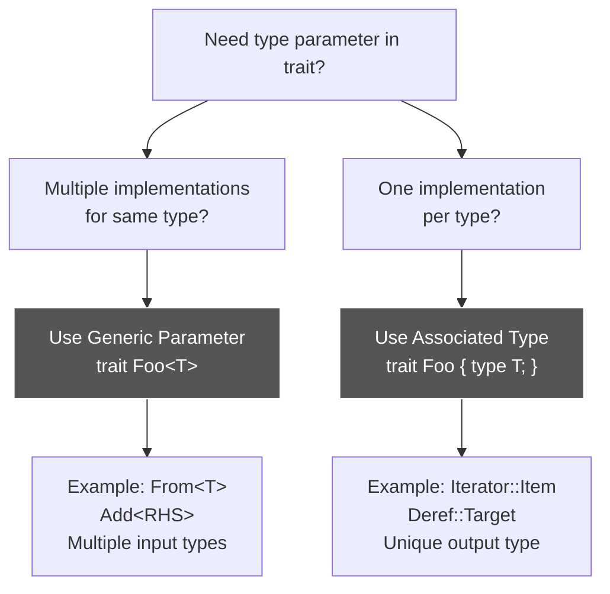

# R63: Associated Types vs Generic Parameters - Uniqueness vs Flexibility

## Problem: When to Use Associated Types vs Generics in Traits

**ANSWER UPFRONT**: Use **associated types** when the type must be uniquely determined for a trait implementation (one implementation per type). Use **generic parameters** when you want multiple implementations with different input types. Associated types avoid ambiguity, generics enable flexibility.

**What's Wrong**: `Deref` can only have one target type per implementor (String → str). If `Deref` used generics, `String` could deref to multiple types, causing ambiguity. Conversely, `From<T>` needs multiple implementations (from u32, from u16, etc.), requiring a generic parameter.

**The Solution**: Associated types (`type Target`) are fixed per implementation—unique and unambiguous. Generic parameters (`From<T>`) create distinct traits (`From<u32>` ≠ `From<u16>`), enabling multiple implementations.

**Why It Matters**: Fundamental trait design decision affecting API flexibility, type inference, and method disambiguation. Explains why `Iterator::Item` is associated but `From<T>` is generic.

---

## MCU Metaphor: Arc Reactor Configuration Protocol

**The Story**: Tony Stark's Arc Reactor has a **unique output type** (energy) but can accept **multiple input types** (palladium, new element). Associated types = unique output (one reactor design). Generic parameters = multiple input configurations (different fuel sources).

**The Mapping**:

| Rust Concept | MCU Equivalent | How It Works |
|--------------|----------------|--------------|
| Associated type | Arc Reactor output | Unique energy type per reactor design |
| Generic parameter | Arc Reactor fuel input | Multiple fuel sources (palladium, vibranium, etc.) |
| `Deref::Target` | Mark II output format | Only one output conversion per armor |
| `From<T>` | Fuel conversion protocols | Multiple input types → same reactor |
| One implementation (assoc) | Single output specification | Mark II produces repulsor energy only |
| Multiple implementations (generic) | Multiple input configs | Accepts palladium OR new element |
| Ambiguity problem | Conflicting output channels | Can't output both repulsor + laser simultaneously |
| `Add<RHS>` with `Output` | Combined weapon system | Input type varies, output uniquely determined |
| Type inference | J.A.R.V.I.S. auto-detection | Compiler determines types from context |

**The Insight**: Just as the Arc Reactor has a unique output energy type (associated) but accepts multiple fuel inputs (generic parameters create distinct configurations), Rust traits use associated types for uniquely determined results and generic parameters for flexible inputs—enabling both type safety and API flexibility.

---

## Anatomy: Associated Types vs Generics

### Associated Type Example: `Deref`

```rust
pub trait Deref {
    type Target;  // Associated type: uniquely determined
    
    fn deref(&self) -> &Self::Target;
}

// String can ONLY deref to str
impl Deref for String {
    type Target = str;  // Fixed: no other Target possible
    
    fn deref(&self) -> &str {
        // ...
    }
}

// Usage: unambiguous
let s = String::from("hello");
let slice: &str = &*s;  // Compiler knows Target = str
```

**Why associated type?**
- String can only have ONE deref target
- If multiple Targets allowed, which one for `&*s`? Ambiguous!
- Associated type ensures uniqueness

### Generic Parameter Example: `From`

```rust
pub trait From<T> {  // Generic parameter: multiple implementations
    fn from(value: T) -> Self;
}

// WrappingU32 can implement From for MULTIPLE types
impl From<u32> for WrappingU32 {
    fn from(value: u32) -> Self {
        WrappingU32 { inner: value }
    }
}

impl From<u16> for WrappingU32 {
    fn from(value: u16) -> Self {
        WrappingU32 { inner: value.into() }
    }
}

// Usage: From<u32> and From<u16> are DIFFERENT traits
let w1 = WrappingU32::from(42u32);
let w2 = WrappingU32::from(10u16);
```

**Why generic parameter?**
- Need multiple implementations for different input types
- `From<u32>` and `From<u16>` are distinct traits
- Compiler chooses based on argument type

---

## Key Difference: One vs Many Implementations

### Associated Types → One Implementation

```rust
trait Container {
    type Item;  // Associated: fixed per implementation
    
    fn get(&self) -> &Self::Item;
}

// Vec<T> implements Container ONCE
impl<T> Container for Vec<T> {
    type Item = T;  // Determined by Vec's generic parameter
    
    fn get(&self) -> &T {
        &self[0]
    }
}

// CANNOT implement Container again for Vec<T>!
// This would be error:
// impl<T> Container for Vec<T> {
//     type Item = String;  // Error: conflicting implementation!
// }
```

**Rule**: One trait implementation = one associated type value.

### Generic Parameters → Multiple Implementations

```rust
trait Converter<T> {  // Generic: multiple implementations possible
    fn convert(&self, value: T) -> String;
}

struct Printer;

// Implement for i32
impl Converter<i32> for Printer {
    fn convert(&self, value: i32) -> String {
        value.to_string()
    }
}

// Implement for f64 (different trait: Converter<f64>)
impl Converter<f64> for Printer {
    fn convert(&self, value: f64) -> String {
        format!("{:.2}", value)
    }
}

// Both work: different traits!
let p = Printer;
p.convert(42i32);    // Uses Converter<i32>
p.convert(3.14f64);  // Uses Converter<f64>
```

**Rule**: Multiple implementations possible, each with different generic parameter creates distinct trait.

---

## Case Study: `Add` - Both Mechanisms

```rust
pub trait Add<RHS = Self> {  // Generic with default
    type Output;  // Associated type
    
    fn add(self, rhs: RHS) -> Self::Output;
}
```

**Why both?**

### Generic Parameter `RHS`: Multiple Input Types

```rust
// u32 + u32 → u32
impl Add<u32> for u32 {
    type Output = u32;
    fn add(self, rhs: u32) -> u32 { self + rhs }
}

// u32 + &u32 → u32 (different trait!)
impl Add<&u32> for u32 {
    type Output = u32;
    fn add(self, rhs: &u32) -> u32 { self + *rhs }
}

// Enables flexible addition:
let x = 5u32 + &5u32 + 6u32;  // Mix owned and borrowed
```

**`RHS` is generic**: Different right-hand side types need different implementations.

### Associated Type `Output`: Unique Result

```rust
// &u32 + &u32 → u32 (owned result, not reference!)
impl Add<&u32> for &u32 {
    type Output = u32;  // Different from Self (&u32)
    
    fn add(self, rhs: &u32) -> u32 {
        *self + *rhs
    }
}

// Output is associated: once RHS is known, Output is determined
// Cannot have:
// impl Add<&u32> for &u32 { type Output = i64; }  // Conflict!
```

**`Output` is associated**: For given implementor + RHS, only one output type makes sense.

---

## Decision Matrix: When to Use Each



### Use Associated Types When:

1. **Uniqueness required**: Only one logical type for the relationship
   - `Iterator::Item`: An iterator yields ONE type
   - `Deref::Target`: A type derefs to ONE target
   - `Future::Output`: A future produces ONE result type

2. **Avoid ambiguity**: Multiple implementations would cause confusion
   - Which `Target` to use for `&*s`?
   - Which `Item` to iterate over?

3. **Type determined by implementation**: The type is a "property" of the implementor
   - `Vec<i32>` iterator yields `i32` items
   - `String` derefs to `str`

### Use Generic Parameters When:

1. **Flexibility needed**: Multiple implementations make sense
   - `From<u32>`, `From<u16>`, `From<String>` for same type
   - `Add<u32>`, `Add<&u32>` for arithmetic

2. **Input variation**: Different input types, same operation
   - Convert FROM multiple types
   - Add with multiple RHS types

3. **Distinct traits**: Each generic value creates separate trait
   - `From<u32>` ≠ `From<u16>` (different traits)
   - Compiler selects based on argument types

---

## Real-World Examples

### Iterator: Associated Type `Item`

```rust
pub trait Iterator {
    type Item;  // What this iterator produces
    
    fn next(&mut self) -> Option<Self::Item>;
}

// Vec<i32> iterator yields i32
impl Iterator for VecIter<i32> {
    type Item = i32;  // Uniquely determined
    
    fn next(&mut self) -> Option<i32> {
        // ...
    }
}

// Usage: compiler knows Item type
let vec = vec![1, 2, 3];
let mut iter = vec.iter();
let first: Option<&i32> = iter.next();  // Item = &i32 inferred
```

**Why not generic?** An iterator can't yield multiple different types in one iteration.

### From: Generic Parameter `T`

```rust
pub trait From<T> {
    fn from(value: T) -> Self;
}

// String can be created FROM multiple types
impl From<&str> for String {
    fn from(s: &str) -> String {
        s.to_owned()
    }
}

impl From<Box<str>> for String {
    fn from(s: Box<str>) -> String {
        s.into_string()
    }
}

impl From<Vec<u8>> for String {
    fn from(vec: Vec<u8>) -> String {
        String::from_utf8(vec).unwrap()
    }
}

// All three implementations coexist!
let s1 = String::from("hello");
let s2 = String::from(Box::from("world"));
let s3 = String::from(vec![72, 101, 108, 108, 111]);
```

**Why generic?** String can be created from MANY input types.

### Index: Both Mechanisms

```rust
pub trait Index<Idx> {  // Generic: multiple index types
    type Output;  // Associated: unique output per Idx
    
    fn index(&self, index: Idx) -> &Self::Output;
}

// Vec can be indexed by usize
impl<T> Index<usize> for Vec<T> {
    type Output = T;  // Output determined by Idx=usize
    
    fn index(&self, index: usize) -> &T {
        &self[index]
    }
}

// Vec can ALSO be indexed by Range<usize> (different trait!)
impl<T> Index<Range<usize>> for Vec<T> {
    type Output = [T];  // Different output for range indexing
    
    fn index(&self, index: Range<usize>) -> &[T] {
        &self[index]
    }
}

// Usage:
let vec = vec![1, 2, 3, 4];
let elem: &i32 = &vec[0];        // Index<usize>, Output = i32
let slice: &[i32] = &vec[1..3];  // Index<Range<usize>>, Output = [i32]
```

**Why both?**
- **`Idx` is generic**: Different index types (usize, Range, etc.)
- **`Output` is associated**: For given Idx, output type is determined

---

## Type Inference and Disambiguation

### Associated Types: Inferred from Implementation

```rust
trait Container {
    type Item;
    fn get(&self) -> Self::Item;
}

impl Container for Vec<i32> {
    type Item = i32;
    fn get(&self) -> i32 { self[0] }
}

// Compiler knows Item = i32 from impl
let vec = vec![1, 2, 3];
let item = vec.get();  // Type inferred: i32
```

**No ambiguity**: Only one Container impl for Vec<i32>.

### Generic Parameters: Require Type Hints

```rust
trait Parser<T> {
    fn parse(&self, s: &str) -> T;
}

impl Parser<i32> for MyParser {
    fn parse(&self, s: &str) -> i32 { s.parse().unwrap() }
}

impl Parser<f64> for MyParser {
    fn parse(&self, s: &str) -> f64 { s.parse().unwrap() }
}

// Ambiguous! Which Parser to use?
let parser = MyParser;
// let x = parser.parse("42");  // Error: cannot infer type

// Need type annotation:
let x: i32 = parser.parse("42");  // Uses Parser<i32>
let y: f64 = parser.parse("3.14");  // Uses Parser<f64>

// Or turbofish:
let x = parser.parse::<i32>("42");
```

**Potential ambiguity**: Multiple impls, must specify which trait.

---

## Common Patterns

### Pattern 1: Collection Iterator (Associated)

```rust
// Standard pattern: iterator returns one Item type
trait Collection {
    type Item;
    type Iter: Iterator<Item = Self::Item>;
    
    fn iter(&self) -> Self::Iter;
}

impl<T> Collection for Vec<T> {
    type Item = T;
    type Iter = std::slice::Iter<'_, T>;
    
    fn iter(&self) -> Self::Iter {
        self.as_slice().iter()
    }
}
```

### Pattern 2: Conversion Traits (Generic)

```rust
// Multiple conversions from different types
trait TryFrom<T> {
    type Error;  // Associated: unique error per conversion
    fn try_from(value: T) -> Result<Self, Self::Error>;
}

// Can implement for many T values
impl TryFrom<i64> for i32 {
    type Error = TryFromIntError;
    fn try_from(value: i64) -> Result<i32, Self::Error> { /*...*/ }
}

impl TryFrom<u64> for i32 {
    type Error = TryFromIntError;
    fn try_from(value: u64) -> Result<i32, Self::Error> { /*...*/ }
}
```

### Pattern 3: Operator Overloading (Both)

```rust
// Generic RHS for flexibility, associated Output for uniqueness
trait Mul<RHS = Self> {
    type Output;
    fn mul(self, rhs: RHS) -> Self::Output;
}

// Matrix * scalar
impl Mul<f64> for Matrix {
    type Output = Matrix;
    fn mul(self, scalar: f64) -> Matrix { /*...*/ }
}

// Matrix * Matrix
impl Mul<Matrix> for Matrix {
    type Output = Matrix;
    fn mul(self, other: Matrix) -> Matrix { /*...*/ }
}
```

---

## Gotchas and Debugging

### Gotcha 1: Cannot Have Multiple Associated Type Values

```rust
// Error: cannot implement trait twice
trait Container {
    type Item;
}

impl Container for Vec<String> {
    type Item = String;
}

// This won't compile!
// impl Container for Vec<String> {
//     type Item = str;  // Error: conflicting implementations
// }
```

**Fix**: Use generic parameter if multiple implementations needed.

### Gotcha 2: Associated Types Break Type Inference

```rust
trait Parse {
    type Output;
    fn parse(&self, s: &str) -> Self::Output;
}

impl Parse for JsonParser {
    type Output = JsonValue;
    fn parse(&self, s: &str) -> JsonValue { /*...*/ }
}

// Works: Output uniquely determined
let parser = JsonParser;
let value = parser.parse("{}");  // Type: JsonValue
```

### Gotcha 3: Generic Parameters Need Type Annotations

```rust
trait Convert<T> {
    fn convert(&self) -> T;
}

impl Convert<i32> for Parser {
    fn convert(&self) -> i32 { 42 }
}

impl Convert<String> for Parser {
    fn convert(&self) -> String { "hello".into() }
}

// Error: ambiguous!
let p = Parser;
// let x = p.convert();  // Which Convert<T>?

// Fix: specify type
let x: i32 = p.convert();  // Convert<i32>
let y: String = p.convert();  // Convert<String>
```

---

## Best Practices

### ✅ DO: Use Associated Types for Output/Result Types

```rust
// Good: Item uniquely determined per iterator
trait Iterator {
    type Item;
    fn next(&mut self) -> Option<Self::Item>;
}

// Good: Target uniquely determined per type
trait Deref {
    type Target;
    fn deref(&self) -> &Self::Target;
}
```

### ✅ DO: Use Generics for Input Variation

```rust
// Good: Multiple input types possible
trait From<T> {
    fn from(value: T) -> Self;
}

// Good: Different RHS types for operations
trait Add<RHS = Self> {
    type Output;
    fn add(self, rhs: RHS) -> Self::Output;
}
```

### ✅ DO: Combine Both When Appropriate

```rust
// Good: Generic input, associated output
trait Convert<T> {
    type Output;  // Determined by Self + T
    fn convert(&self, input: T) -> Self::Output;
}
```

### ❌ DON'T: Use Generics When One Implementation Suffices

```rust
// Bad: Unnecessarily generic
trait Container<Item> {  // Should be associated!
    fn get(&self) -> Item;
}

// Good: Associated type
trait Container {
    type Item;
    fn get(&self) -> Self::Item;
}
```

### ❌ DON'T: Use Associated Types for Multiple Implementations

```rust
// Bad: Cannot implement multiple conversions
trait Convert {
    type Input;  // Problem: only one Input per impl
    fn convert(&self, input: Self::Input) -> String;
}

// Good: Generic allows multiple implementations
trait Convert<Input> {
    fn convert(&self, input: Input) -> String;
}
```

---

## Mental Model: Arc Reactor Configuration

Think of associated types vs generics like Tony Stark's Arc Reactor:

1. **Unique Output** (Associated Type):
   - Arc Reactor has ONE output energy type per design
   - Mark II produces repulsor energy (unique)
   - Cannot output both repulsor + laser simultaneously
   - Like `Deref::Target` = exactly one target type

2. **Multiple Inputs** (Generic Parameter):
   - Reactor accepts MANY fuel types (palladium, new element)
   - Each fuel type = separate configuration protocol
   - Like `From<u32>`, `From<u16>` = different traits
   - J.A.R.V.I.S. selects protocol based on fuel type

3. **Combined System** (Both Mechanisms):
   - Weapon system: input varies (repulsor/unibeam)
   - Output format uniquely determined per weapon
   - Like `Add<RHS>` with `Output`
   - Input flexibility + output uniqueness

4. **Ambiguity Prevention** (Why Associated):
   - If reactor had multiple outputs, which power armor?
   - Associated types prevent "which Target?" confusion
   - One design = one output specification

5. **Configuration Flexibility** (Why Generic):
   - Need to switch fuel sources dynamically
   - Generic parameters enable multiple protocols
   - Compiler selects based on fuel type

**The Analogy**: Just as the Arc Reactor has a unique output energy format (associated type ensuring no ambiguity) but accepts multiple fuel configurations (generic parameters creating distinct protocols), Rust traits use associated types for uniquely determined results and generic parameters for flexible inputs—enabling both type safety and API flexibility while preventing ambiguity in method resolution.

---

## The Essence: Uniqueness vs Flexibility

Associated types ensure **uniqueness**: one value per trait implementation, avoiding ambiguity. Generic parameters enable **flexibility**: multiple implementations with different types, creating distinct traits.

**Associated Types**: Uniquely determined per impl, one value, no ambiguity  
**Generic Parameters**: Multiple impls possible, creates distinct traits, needs type hints  
**When Both**: Generics for input flexibility, associated for output uniqueness  
**Type Inference**: Associated types inferred from impl, generics need annotations  
**Design Rule**: Use associated for "properties," generics for "parameters"

Like the Arc Reactor's unique output energy type (associated—no ambiguity about what powers the armor) versus multiple fuel input configurations (generics—palladium or new element as distinct protocols), Rust's associated types ensure uniquely determined results while generic parameters enable flexible inputs—the foundation of expressive, unambiguous trait-based APIs.
