# R67: Rust Typestate Pattern - Compile-Time State Machine Enforcement

## Part 1: The Problem - Runtime Validation of Invalid States

### 1.1 Why Invalid States Matter

**The typestate pattern eliminates impossible states at compile time by encoding state machines into the type system, preventing entire classes of bugs before your program runs.**

Traditional approaches force runtime validation:

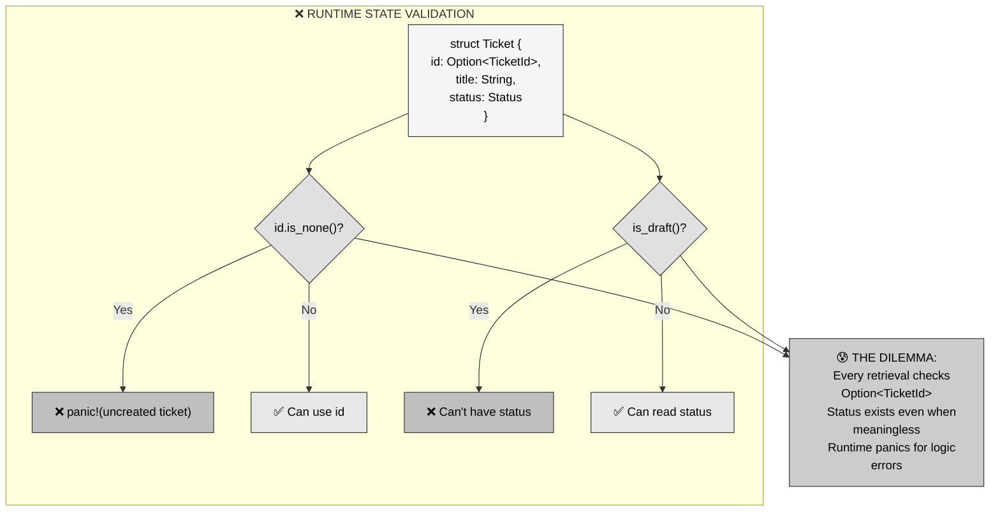

**The pain**: You must defensively check `Option<TicketId>` every time you retrieve a ticket, even though conceptually "a stored ticket ALWAYS has an ID." Status fields exist in drafts where they're meaningless. The compiler can't help—it allows `Ticket { id: None, status: Closed }`.

---

### 1.2 Two Conflicting Requirements

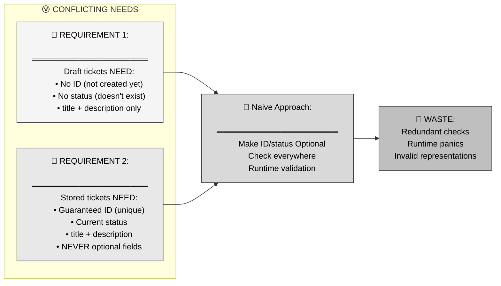

**The insight**: Drafts and stored tickets are fundamentally different states with different invariants. Representing them with the same type forces compromises (optional fields) that create maintenance burden and bugs.

---

## Part 2: The Solution - Separate Types for Each State

### 2.1 Typestate Pattern Core Idea

**Instead of runtime checks on optional fields, create separate types for each state—making invalid states unrepresentable.**

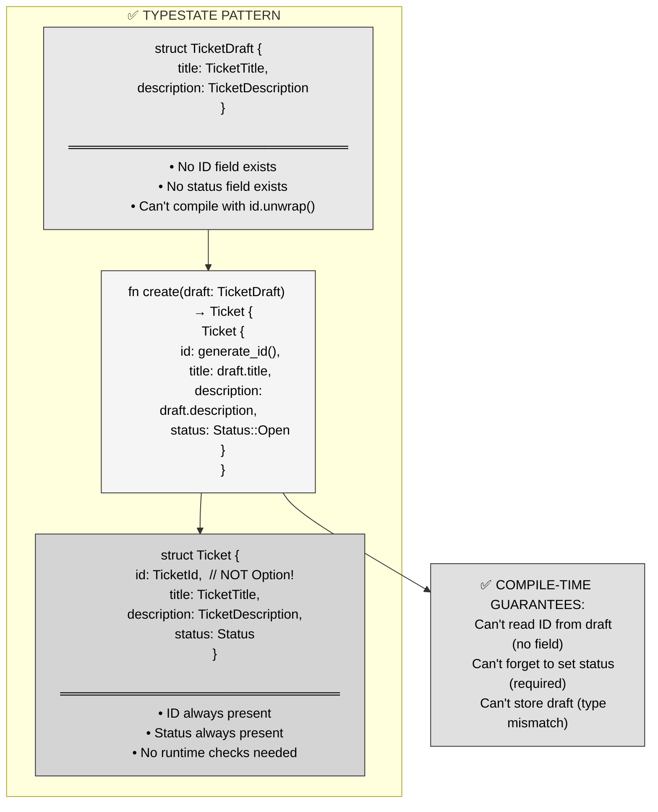

**Key insight**: By making `id` and `status` non-optional in `Ticket` and absent in `TicketDraft`, the compiler enforces state invariants—you literally cannot write code that accesses an ID on a draft.

---

### 2.2 State Transition as Function Signatures

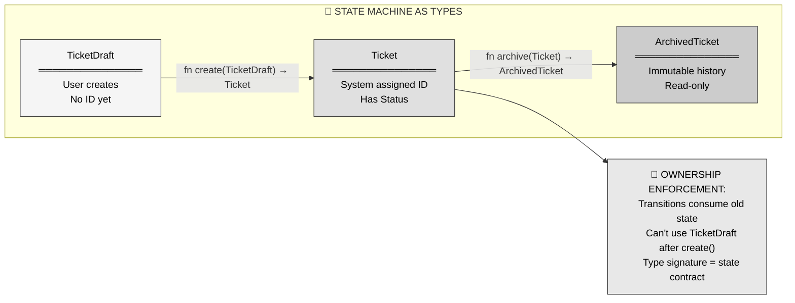

**Pattern**: State transitions are functions that take ownership of the old state (consuming it) and return the new state. Once you call `create(draft)`, the `draft` is moved—you can't accidentally use it again.

---

## Part 3: Mental Model - Vision's Mind Stone Calibration Protocol

### 3.1 The MCU Metaphor

**The Vision creation sequence in *Avengers: Age of Ultron*—incomplete vessel → complete android → activated Mind Stone bearer—mirrors typestate transitions.**

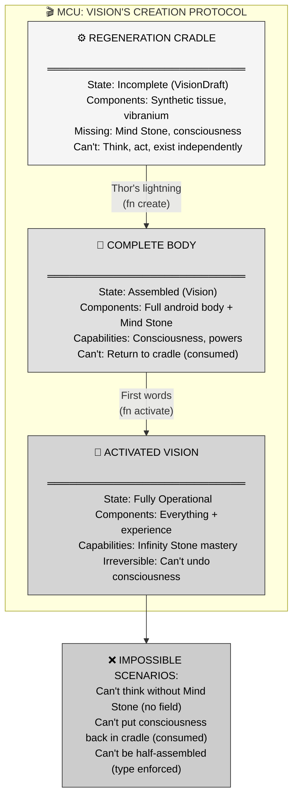

---

### 3.2 MCU-to-Rust Mapping Table

| MCU Concept | Rust Typestate | Enforced Invariant |
|-------------|----------------|-------------------|
| **Regeneration Cradle (incomplete)** | `TicketDraft` | No ID/status fields exist—can't access what isn't there |
| **Complete Body (Mind Stone inserted)** | `Ticket` | ID/status are non-optional—always present, no runtime checks |
| **Activated Vision (conscious)** | `ArchivedTicket` | Immutable history—can't modify archived state |
| **Thor's lightning (creation)** | `fn create(draft: TicketDraft) → Ticket` | Consumes draft via ownership—can't reuse old state |
| **First words (activation)** | `fn activate(ticket: Ticket) → Active` | Transition function signature encodes valid flow |
| **Can't think without Stone** | Compiler error: `draft.id` | Field doesn't exist on that type—caught at compile time |
| **Can't return to cradle** | Ownership moved | Once `create()` called, `draft` is gone—prevents misuse |

**Narrative**: When Ultron's cradle holds the incomplete Vision body, it's like `TicketDraft`—you can't query its Mind Stone status because that field doesn't exist yet. Thor's lightning (the `create` function) consumes the cradle contents (moves ownership) and returns a complete Vision (`Ticket` with guaranteed ID). Once activated, Vision can't be disassembled back into the cradle—the state transition is one-way, enforced by consuming the previous state through ownership.

Just as you can't ask "what are Vision's thoughts?" while he's still in the cradle (the question is meaningless), Rust's compiler won't let you write `draft.id` because `TicketDraft` has no such field. The type system makes impossible states unrepresentable.

---

## Part 4: Anatomy of Typestate Pattern

### 4.1 State Type Definitions

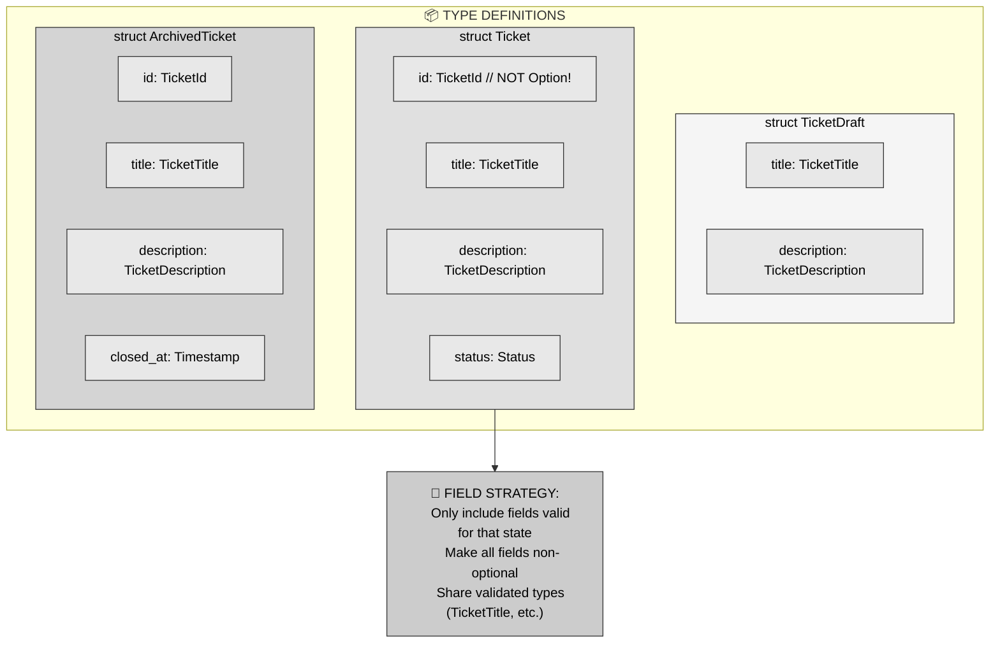

**Critical pattern**: Each state type contains *only* the fields that make sense for that state. No `Option` wrappers, no nullable fields. `TicketDraft` physically cannot have an `id` field—accessing `draft.id` is a compiler error, not a runtime check.

**Validation reuse**: Notice `title: TicketTitle` appears in all three types. The validation logic lives in `TicketTitle`'s constructor—each state reuses the validated type without duplicating validation code.

---

### 4.2 Transition Functions

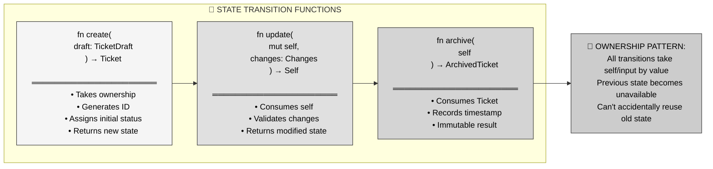

**Key mechanism**: Every transition function consumes the input state via ownership. After `let ticket = create(draft);`, the variable `draft` is moved—attempting to use it again produces a compiler error: "value borrowed after move."

**Method syntax**: Notice `update` uses `self` (not `&self`), meaning it consumes the `Ticket` and returns a new one. This is the builder pattern merged with typestate—you chain transitions while the compiler tracks state validity.

---

### 4.3 Complete Lifecycle Example

```rust
// Step 1: Create draft (no ID, no status)
let draft = TicketDraft {
    title: TicketTitle::new("Fix bug")?,
    description: TicketDescription::new("Details here")?,
};

// Compiler error if you try:
// println!("{}", draft.id);  // ERROR: no field `id` on type `TicketDraft`

// Step 2: Transition to Ticket (creates ID, assigns status)
let ticket = create(draft);

// Compiler error if you try:
// println!("{}", draft.title);  // ERROR: value borrowed after move

// Step 3: Ticket operations (ID and status guaranteed present)
println!("Ticket ID: {}", ticket.id);  // No Option unwrapping!
println!("Status: {:?}", ticket.status);  // Always valid

// Step 4: Archive (consume Ticket, produce ArchivedTicket)
let archived = archive(ticket);

// Compiler error if you try:
// println!("{}", ticket.id);  // ERROR: value borrowed after move
```

---

## Part 5: Common Typestate Patterns

### 5.1 The Builder Pattern Typestate

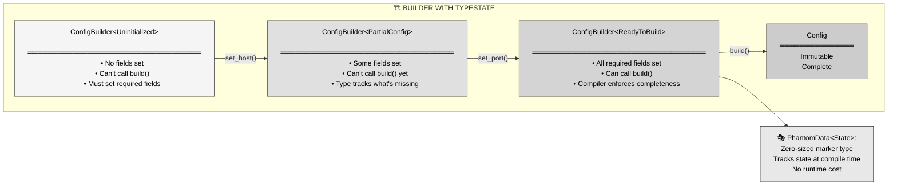

**Pattern**: Use generic type parameters (`ConfigBuilder<State>`) with marker types (`Uninitialized`, `ReadyToBuild`) to track builder state. Only implement `build()` on `ConfigBuilder<ReadyToBuild>` so the compiler prevents calling it prematurely.

**Zero cost**: The state markers are `PhantomData<State>`—they occupy zero bytes at runtime. The state tracking is purely compile-time information.

---

### 5.2 Protocol State Machines

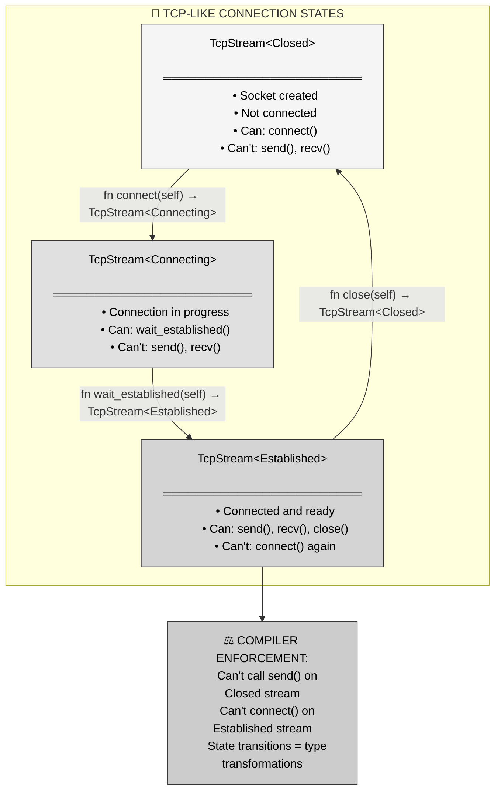

**Real-world use**: This pattern appears in:
- **tokio_postgres**: `Client` vs `Transaction` types (can't start transaction on transaction)
- **hyper**: `Request<Empty>` vs `Request<Body>` (can't send body twice)
- **rusqlite**: `Statement` vs `Rows` (can't mix prepare and execute)

---

### 5.3 Generic State Parameter Pattern

```rust
// Define marker types for each state
pub struct Draft;
pub struct Active;
pub struct Archived;

// Generic type with state parameter
pub struct Ticket<State> {
    id: Option<TicketId>,  // Optional in Draft, guaranteed in Active/Archived
    title: TicketTitle,
    description: TicketDescription,
    status: Status,
    _state: PhantomData<State>,
}

// Implement state-specific constructors
impl Ticket<Draft> {
    pub fn new(title: TicketTitle, description: TicketDescription) -> Self {
        Self {
            id: None,  // No ID yet
            title,
            description,
            status: Status::Open,
            _state: PhantomData,
        }
    }
    
    // Transition to Active
    pub fn create(self, id: TicketId) -> Ticket<Active> {
        Ticket {
            id: Some(id),  // Now has ID
            title: self.title,
            description: self.description,
            status: self.status,
            _state: PhantomData,
        }
    }
}

// Only Active tickets can be archived
impl Ticket<Active> {
    pub fn archive(self) -> Ticket<Archived> {
        Ticket {
            id: self.id,
            title: self.title,
            description: self.description,
            status: Status::Closed,
            _state: PhantomData,
        }
    }
}
```

**Trade-off**: This approach uses a single struct with generic state parameters, reducing code duplication but still requiring `Option<TicketId>`. Better for cases where many fields are shared across states.

---

## Part 6: Real-World Use Cases

### 6.1 Database Transaction States

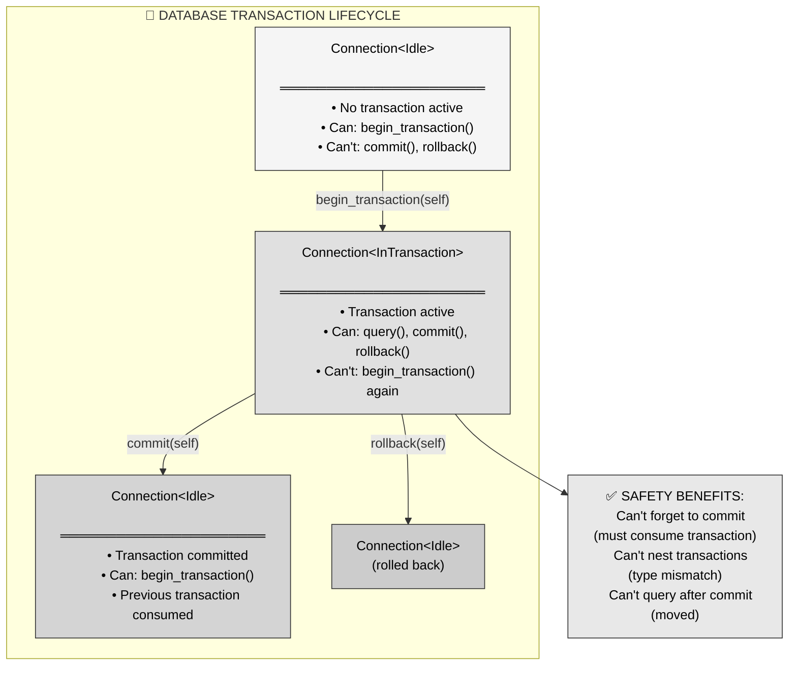

**Example**: The `diesel` ORM uses this pattern—`Connection::transaction()` returns a `Transaction` type that must be explicitly committed or rolled back. The compiler prevents you from forgetting.

---

### 6.2 API Client Authentication States

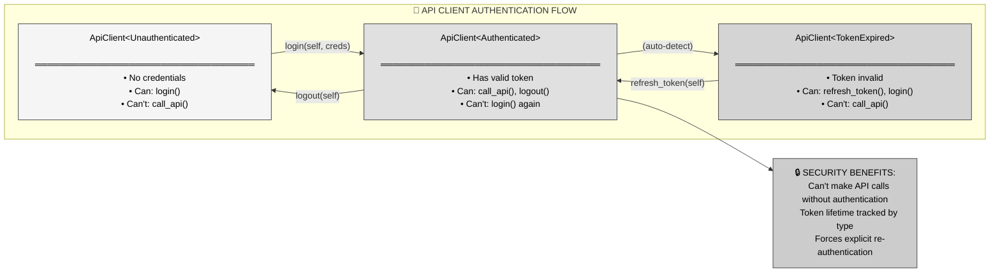

**Real implementation**: The `aws-sdk-rust` uses similar patterns—unauthenticated clients cannot call AWS APIs, enforced by the type system.

---

### 6.3 File Handle State Management

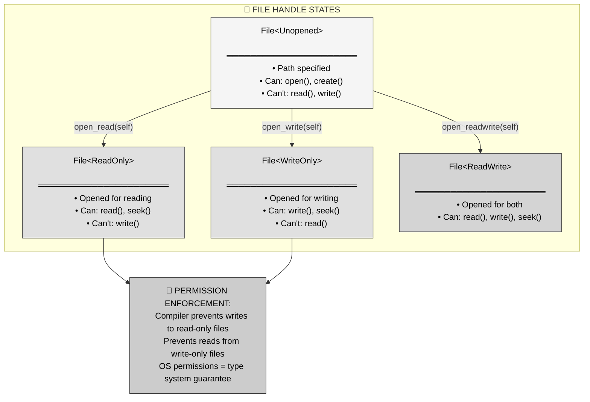

**Real-world library**: The `typestate-file` crate implements exactly this, making file permission errors impossible at compile time.

---

## Part 7: Performance Characteristics

### 7.1 Zero-Cost Abstraction Guarantee

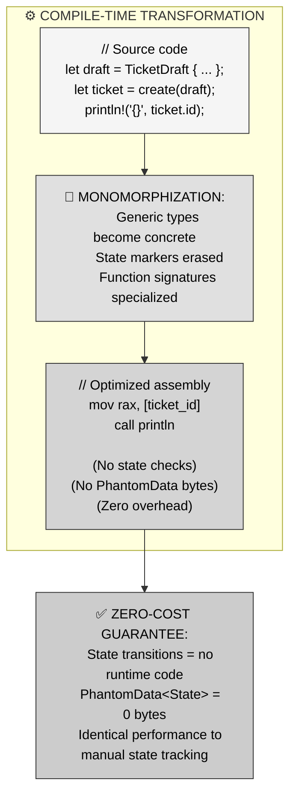

**Key insight**: The state parameters (`<Draft>`, `<Active>`) are purely compile-time metadata. The final binary contains no state checks, no type wrappers, no overhead—the compiler erases all the safety machinery, leaving only the underlying data.

**Measurement**: Benchmark comparisons show typestate implementations compile to identical assembly as hand-rolled state machines, but with compile-time safety.

---

### 7.2 Compilation Cost

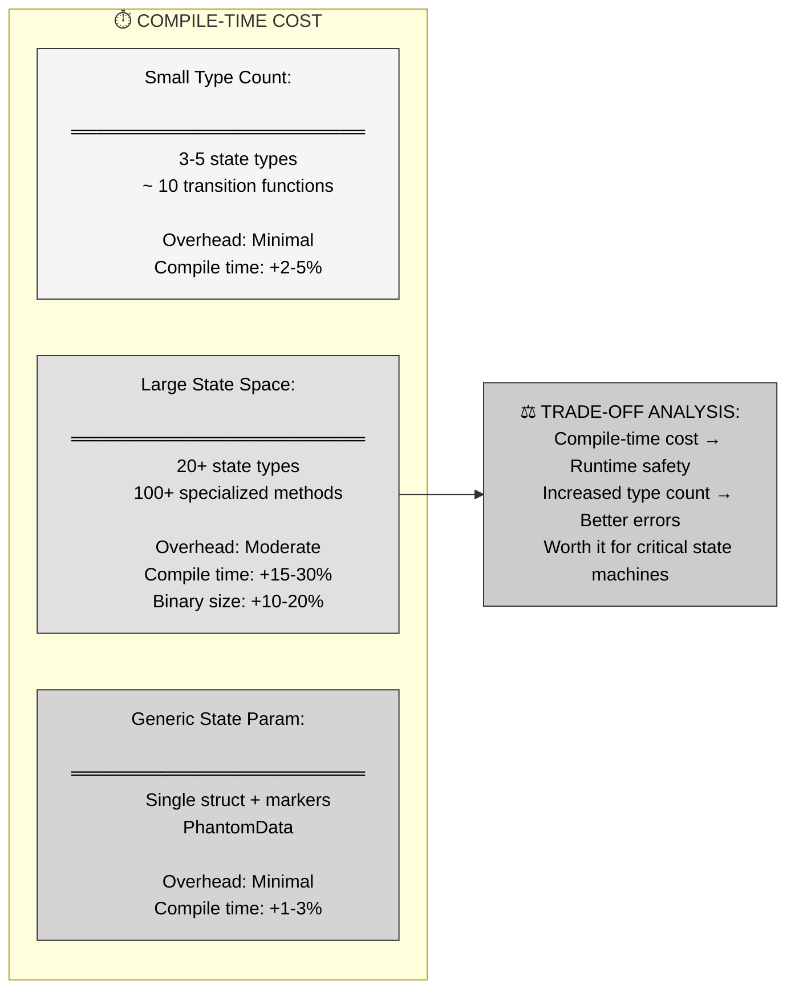

**Recommendation**: For simple state machines (3-10 states), the compilation cost is negligible. For complex state spaces (20+ states), consider the generic parameter approach or evaluate if the safety benefits justify the cost.

---

## Part 8: Comparison to Other Patterns

### 8.1 Typestate vs Runtime State Machines

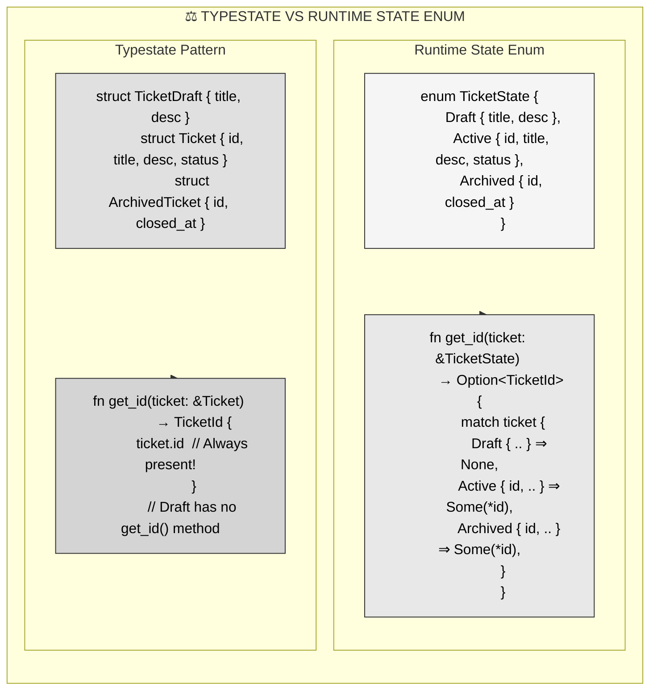

**When to use each**:

| Scenario | Runtime Enum | Typestate Pattern |
|----------|--------------|------------------|
| **States known at runtime** | ✅ Best choice | ❌ Can't represent dynamic states |
| **State transitions sequential** | 🤷 Works but verbose | ✅ Compiler-enforced flow |
| **Invalid state access critical** | 🤷 Requires exhaustive match | ✅ Compile error, impossible to access |
| **Need to store mixed states** | ✅ `Vec<TicketState>` easy | ❌ Can't mix `Vec<TicketDraft>` + `Vec<Ticket>` |
| **Builder APIs** | ❌ Can't enforce required fields | ✅ Perfect fit |
| **Protocol implementations** | ❌ Easy to call wrong method | ✅ Type-safe API |

---

### 8.2 Typestate vs Option-Based Design

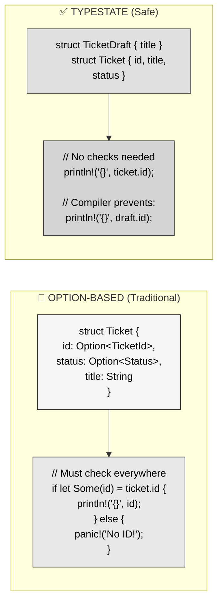

**Migration path**: If you have an existing codebase with `Option`-based state, you can refactor incrementally:
1. Identify distinct states with different invariants
2. Create separate types for each state
3. Replace `Option<T>` with state-specific fields
4. Update functions to use state-specific types
5. Remove runtime checks (now compile errors)

---

## Part 9: Best Practices and Gotchas

### 9.1 When to Use Typestate

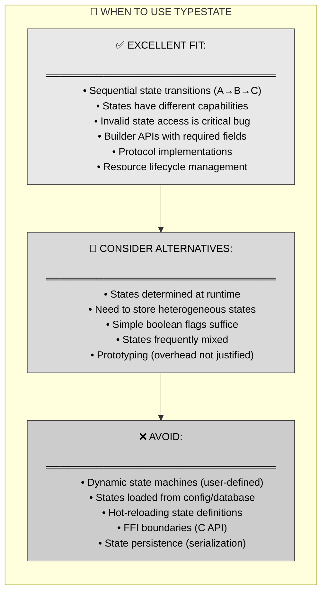

**Heuristic**: If you find yourself writing `if state == X { panic!("Invalid state"); }` more than twice, typestate pattern will eliminate those runtime checks at compile time.

---

### 9.2 Common Pitfalls

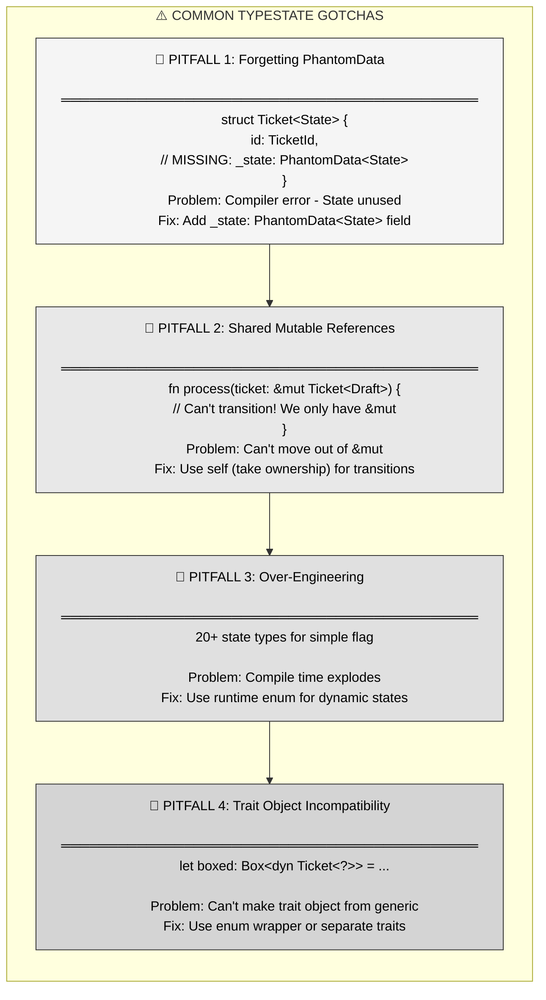

---

### 9.3 Design Checklist

**Before implementing typestate pattern, verify:**

1. **Distinct States**: Can you clearly enumerate all states?
2. **Sequential Transitions**: Are state changes mostly one-directional?
3. **State-Specific Behavior**: Do different states have different valid operations?
4. **Ownership Feasible**: Can transition functions take ownership?
5. **Compilation Cost Acceptable**: Are you willing to pay 2-10% longer compile times?
6. **Not Dynamic**: Are states known at compile time?

**If all YES → Typestate is a great fit.**

---

## Part 10: Advanced Patterns

### 10.1 Combining Typestate with Sealed Traits

```rust
// Prevent external crates from implementing state traits
mod sealed {
    pub trait Sealed {}
}

pub trait State: sealed::Sealed {}

pub struct Draft;
pub struct Active;

impl sealed::Sealed for Draft {}
impl sealed::Sealed for Active {}
impl State for Draft {}
impl State for Active {}

// Now only your crate can define new states
pub struct Ticket<S: State> {
    data: String,
    _state: PhantomData<S>,
}
```

**Purpose**: The sealed trait pattern prevents external crates from adding new states, maintaining your state machine invariants.

---

### 10.2 Const Generics for State Parameters

```rust
// State encoded as const generic
pub struct Ticket<const STATE: u8> {
    id: Option<TicketId>,
    title: String,
}

const DRAFT: u8 = 0;
const ACTIVE: u8 = 1;

impl Ticket<DRAFT> {
    pub fn create(self) -> Ticket<ACTIVE> {
        Ticket {
            id: Some(generate_id()),
            title: self.title,
        }
    }
}
```

**Benefit**: Const generics enable compile-time state tracking without defining separate marker types, though this approach has limited adoption (marker types are more idiomatic).

---

### 10.3 Drop-Based Transition Enforcement

```rust
impl<T> Drop for Transaction<T> {
    fn drop(&mut self) {
        if !self.completed {
            panic!("Transaction dropped without commit or rollback!");
        }
    }
}

impl Transaction<InProgress> {
    pub fn commit(mut self) -> Transaction<Committed> {
        self.completed = true;  // Mark before state change
        // ... actual commit logic
        Transaction {
            completed: true,
            _state: PhantomData,
        }
    }
}
```

**Safety**: Using `Drop` to enforce that certain state transitions must occur (like committing or rolling back a transaction) prevents resource leaks at runtime if the typestate transitions are bypassed.

---

## Part 11: Key Takeaways and Cross-Language Comparison

### 11.1 Core Principles Summary

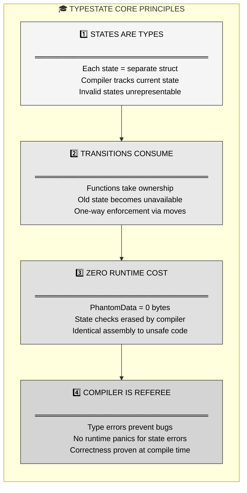

---

### 11.2 Cross-Language Comparison

| Language | Equivalent Pattern | Implementation | Limitations |
|----------|-------------------|----------------|-------------|
| **Rust** | Typestate Pattern | Separate types + ownership | ✅ Zero-cost, compile-time enforced |
| **TypeScript** | Discriminated Unions + Type Guards | `type Ticket = Draft \| Active`; `if (ticket.state === 'draft')` | ⚠️ Runtime checks, no ownership |
| **C++** | Template Metaprogramming | `template<State S> class Ticket` | ⚠️ Complex syntax, no move semantics like Rust |
| **Java** | Sealed Classes (Java 17+) | `sealed interface State permits Draft, Active` | ⚠️ Runtime polymorphism overhead |
| **Go** | Interface + Type Assertions | `switch t := ticket.(type)` | ❌ Runtime checks only, no compile-time safety |
| **Haskell** | GADTs (Generalized ADTs) | `data Ticket (s :: State) where ...` | ✅ Similar to Rust, but different ownership model |

**Rust's advantage**: The combination of zero-cost generics, ownership-based consumption, and trait system makes Rust's typestate pattern uniquely powerful—compile-time safety without runtime cost.

---

### 11.3 When NOT to Use Typestate

**Anti-patterns where typestate creates more problems than it solves:**

1. **Dynamic State Machines**: If states are loaded from config files or databases at runtime, use runtime enums instead.
2. **Serialization Boundaries**: Typestate types with `PhantomData` don't serialize cleanly—wrap in a runtime enum for JSON/DB storage.
3. **FFI (Foreign Function Interface)**: C APIs can't understand Rust's type-level states—use runtime state fields at FFI boundaries.
4. **Heterogeneous Collections**: Can't store `Vec<Ticket<??>>` with mixed states—use `enum TicketState { Draft(TicketDraft), Active(Ticket) }` instead.
5. **Prototyping**: The upfront design cost (identifying all states, defining transitions) slows down rapid iteration—add typestate after the design stabilizes.

---

## Part 12: Summary - Compile-Time State Machine Magic

**The typestate pattern transforms state machines from runtime validation nightmares into compile-time correctness guarantees by encoding states as types.**

**Three key mechanisms:**
1. **Separate types per state** → Invalid states physically unrepresentable
2. **Ownership-consuming transitions** → Can't reuse old states after transitions
3. **Zero-cost abstraction** → All safety checks erased by compiler

**MCU metaphor recap**: Vision's creation—incomplete cradle body (Draft), Mind Stone insertion (transition), activated consciousness (Active)—mirrors typestate's irreversible, type-tracked state progression. Just as you can't ask Vision's thoughts before the Mind Stone exists, Rust won't compile `draft.id` because the field literally doesn't exist on that type.

**When to use**: Builder APIs, protocol implementations, resource lifecycle management, any sequential state machine where invalid state access is a critical bug.

**When to avoid**: Dynamic states, serialization boundaries, FFI, heterogeneous collections, rapid prototyping.

**The promise**: Write your state machine once with typestate, and the compiler will forever prevent state-related bugs—no runtime checks, no performance cost, just compile-time proof of correctness.

---

## References

**Primary source**: Mainmatter's "100 Exercises To Learn Rust" - Section 6 (Ticket Management), Chapter 12 (Two States)

**Key concepts covered**:
- Problem: `Option<TicketId>` forces redundant runtime checks
- Solution: Separate `TicketDraft` and `Ticket` types with distinct fields
- Transitions: Functions consume old state via ownership
- Validation reuse: Shared validated types (`TicketTitle`, `TicketDescription`) across state types

**Real-world implementations**:
- `diesel` ORM: Transaction types
- `tokio_postgres`: Connection vs Transaction
- `hyper`: Request body state tracking
- `aws-sdk-rust`: Authenticated vs unauthenticated clients

**Academic background**: Typestate pattern originated in Robert Strom and Shimon Yemini's 1986 paper "Typestate: A Programming Language Concept for Enhancing Software Reliability" (CMU technical report). Rust's ownership system makes the pattern practical at zero runtime cost.
