# R69: Rust Interior Mutability in Concurrent Contexts - Shared Mutation Safety

## Part 1: The Problem - Shared References Block Mutation

### 1.1 The Paradox of Shared Mutation

**Interior mutability enables safe mutation through shared references by using runtime borrow checking and atomic operations, allowing concurrent data structures that the compile-time borrow checker alone cannot express.**

Traditional borrow checker rules create an impossibility:

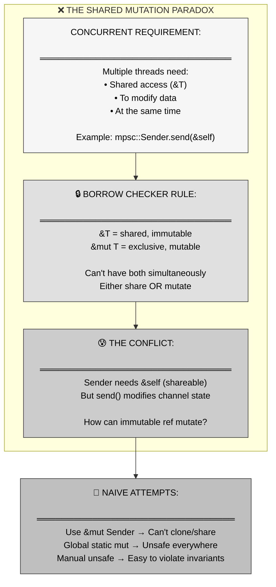
```mermaid
flowchart TD
    subgraph PARADOX["❌ THE SHARED MUTATION PARADOX"]
        direction TB
        
        NEED["CONCURRENT REQUIREMENT:
        ═══════════════════════════════
        Multiple threads need:
        • Shared access (&T)
        • To modify data
        • At the same time
        
        Example: mpsc::Sender.send(&self)"]
        
        RULE["🔒 BORROW CHECKER RULE:
        ═══════════════════════════════
        &T = shared, immutable
        &mut T = exclusive, mutable
        
        Can't have both simultaneously
        Either share OR mutate"]
        
        CONFLICT["😰 THE CONFLICT:
        ═══════════════════════════════
        Sender needs &self (shareable)
        But send() modifies channel state
        
        How can immutable ref mutate?"]
        
        NEED --> RULE
        RULE --> CONFLICT
    end
    
    NAIVE["🤷 NAIVE ATTEMPTS:
    ════════════════════════════════
    Use &mut Sender → Can't clone/share
    Global static mut → Unsafe everywhere
    Manual unsafe → Easy to violate invariants"]
    
    CONFLICT --> NAIVE
    
    style NEED fill:#f5f5f5,stroke:#333,color:#000
    style RULE fill:#e0e0e0,stroke:#333,color:#000
    style CONFLICT fill:#cccccc,stroke:#333,color:#000
    style NAIVE fill:#bfbfbf,stroke:#333,color:#000
```

**The pain**: `Sender<T>::send(&self, t: T)` takes `&self` (shared reference) but clearly mutates the channel's internal queue. This violates the apparent rule that `&T` means immutable. Yet it compiles and is thread-safe. How?

---

### 1.2 Compiler Optimizations Assume Immutability

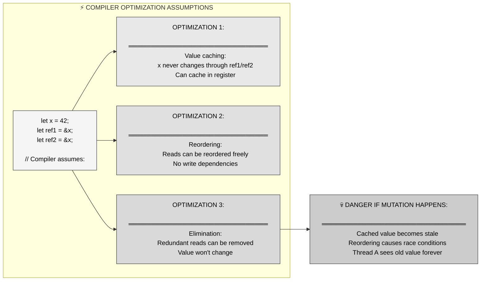
```mermaid
flowchart LR
    subgraph ASSUMPTIONS["⚡ COMPILER OPTIMIZATION ASSUMPTIONS"]
        direction LR
        
        CODE["let x = 42;
        let ref1 = &x;
        let ref2 = &x;
        
        // Compiler assumes:"]
        
        OPT1["OPTIMIZATION 1:
        ═══════════════════════════════
        Value caching:
        x never changes through ref1/ref2
        Can cache in register"]
        
        OPT2["OPTIMIZATION 2:
        ═══════════════════════════════
        Reordering:
        Reads can be reordered freely
        No write dependencies"]
        
        OPT3["OPTIMIZATION 3:
        ═══════════════════════════════
        Elimination:
        Redundant reads can be removed
        Value won't change"]
        
        CODE --> OPT1
        CODE --> OPT2
        CODE --> OPT3
    end
    
    DANGER["💀 DANGER IF MUTATION HAPPENS:
    ════════════════════════════════
    Cached value becomes stale
    Reordering causes race conditions
    Thread A sees old value forever"]
    
    OPT3 --> DANGER
    
    style CODE fill:#f5f5f5,stroke:#333,color:#000
    style OPT1 fill:#e8e8e8,stroke:#333,color:#000
    style OPT2 fill:#e0e0e0,stroke:#333,color:#000
    style OPT3 fill:#d9d9d9,stroke:#333,color:#000
    style DANGER fill:#cccccc,stroke:#333,color:#000
```

**Critical insight**: The compiler's optimizer relies on `&T` being truly immutable to perform aggressive optimizations (caching, reordering, elimination). If mutation happens secretly, these optimizations become wrong, causing memory unsafety. Interior mutability must explicitly tell the compiler "don't optimize this."

---

## Part 2: The Solution - UnsafeCell and Safe Wrappers

### 2.1 UnsafeCell: The Compiler Signal

**`UnsafeCell<T>` is the primitive that opts out of compiler optimizations, enabling mutation through shared references by explicitly marking data as potentially mutable.**

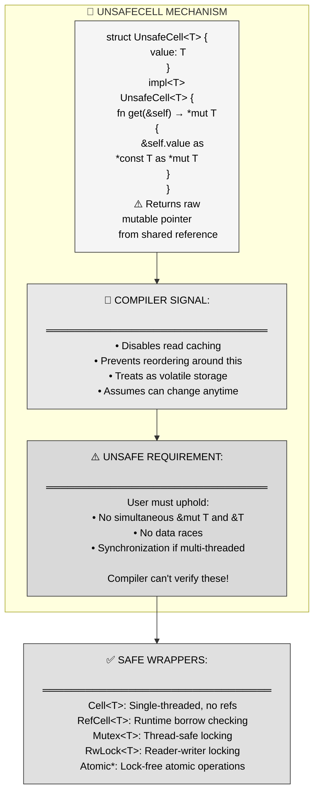
```mermaid
flowchart TD
    subgraph UNSAFECELL["🔧 UNSAFECELL MECHANISM"]
        direction TB
        
        CORE["struct UnsafeCell&lt;T&gt; {
        value: T
        }
        
        impl&lt;T&gt; UnsafeCell&lt;T&gt; {
        fn get(&self) → *mut T {
            &self.value as *const T as *mut T
        }
        }
        
        ⚠️ Returns raw mutable pointer
        from shared reference"]
        
        SIGNAL["🚨 COMPILER SIGNAL:
        ═══════════════════════════════
        • Disables read caching
        • Prevents reordering around this
        • Treats as volatile storage
        • Assumes can change anytime"]
        
        UNSAFE["⚠️ UNSAFE REQUIREMENT:
        ═══════════════════════════════
        User must uphold:
        • No simultaneous &mut T and &T
        • No data races
        • Synchronization if multi-threaded
        
        Compiler can't verify these!"]
        
        CORE --> SIGNAL
        SIGNAL --> UNSAFE
    end
    
    WRAPPER["✅ SAFE WRAPPERS:
    ════════════════════════════════
    Cell&lt;T&gt;: Single-threaded, no refs
    RefCell&lt;T&gt;: Runtime borrow checking
    Mutex&lt;T&gt;: Thread-safe locking
    RwLock&lt;T&gt;: Reader-writer locking
    Atomic*: Lock-free atomic operations"]
    
    UNSAFE --> WRAPPER
    
    style CORE fill:#f5f5f5,stroke:#333,color:#000
    style SIGNAL fill:#e8e8e8,stroke:#333,color:#000
    style UNSAFE fill:#d9d9d9,stroke:#333,color:#000
    style WRAPPER fill:#e0e0e0,stroke:#333,color:#000
```

**Key mechanism**: `UnsafeCell::get()` returns `*mut T` from `&self`. This is the *only* way in safe Rust to get a mutable pointer from a shared reference. The compiler sees this and disables optimizations. But it's `unsafe` to use directly—you must build safe APIs on top.

---

### 2.2 The Spectrum of Interior Mutability

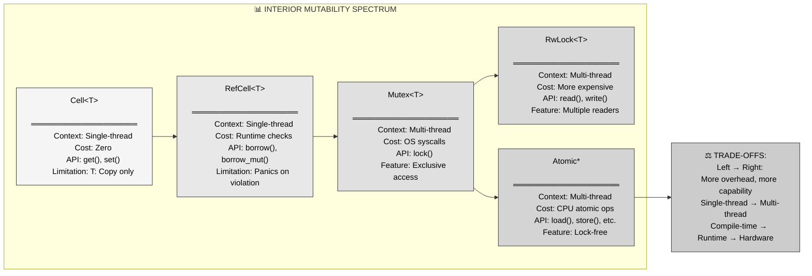
```mermaid
flowchart LR
    subgraph SPECTRUM["📊 INTERIOR MUTABILITY SPECTRUM"]
        direction LR
        
        CELL["Cell&lt;T&gt;
        ═══════════════════
        Context: Single-thread
        Cost: Zero
        API: get(), set()
        Limitation: T: Copy only"]
        
        REFCELL["RefCell&lt;T&gt;
        ═══════════════════
        Context: Single-thread
        Cost: Runtime checks
        API: borrow(), borrow_mut()
        Limitation: Panics on violation"]
        
        MUTEX["Mutex&lt;T&gt;
        ═══════════════════
        Context: Multi-thread
        Cost: OS syscalls
        API: lock()
        Feature: Exclusive access"]
        
        RWLOCK["RwLock&lt;T&gt;
        ═══════════════════
        Context: Multi-thread
        Cost: More expensive
        API: read(), write()
        Feature: Multiple readers"]
        
        ATOMIC["Atomic*
        ═══════════════════
        Context: Multi-thread
        Cost: CPU atomic ops
        API: load(), store(), etc.
        Feature: Lock-free"]
        
        CELL --> REFCELL
        REFCELL --> MUTEX
        MUTEX --> RWLOCK
        MUTEX --> ATOMIC
    end
    
    TRADEOFF["⚖️ TRADE-OFFS:
    Left → Right:
    More overhead, more capability
    Single-thread → Multi-thread
    Compile-time → Runtime → Hardware"]
    
    ATOMIC --> TRADEOFF
    
    style CELL fill:#f5f5f5,stroke:#333,color:#000
    style REFCELL fill:#e8e8e8,stroke:#333,color:#000
    style MUTEX fill:#e0e0e0,stroke:#333,color:#000
    style RWLOCK fill:#d9d9d9,stroke:#333,color:#000
    style ATOMIC fill:#d4d4d4,stroke:#333,color:#000
    style TRADEOFF fill:#cccccc,stroke:#333,color:#000
```

**Progression**: Start with cheapest (`Cell`), escalate as needed. Most code needs `RefCell` (single-threaded) or `Mutex` (multi-threaded). `RwLock` for read-heavy workloads. Atomics for lock-free algorithms.

---

## Part 3: Mental Model - Tony Stark's Arc Reactor Control System

### 3.1 The MCU Metaphor

**Tony Stark's arc reactor core—a power source monitored by multiple systems simultaneously while J.A.R.V.I.S. safely modulates output—mirrors interior mutability's shared-yet-mutable design.**

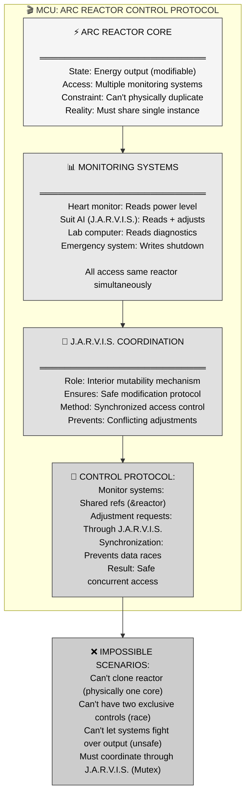
```mermaid
flowchart TD
    subgraph MCU["🎬 MCU: ARC REACTOR CONTROL PROTOCOL"]
        direction TB
        
        REACTOR["⚡ ARC REACTOR CORE
        ═══════════════════════════
        State: Energy output (modifiable)
        Access: Multiple monitoring systems
        Constraint: Can't physically duplicate
        Reality: Must share single instance"]
        
        MONITORS["📊 MONITORING SYSTEMS
        ═══════════════════════════
        Heart monitor: Reads power level
        Suit AI (J.A.R.V.I.S.): Reads + adjusts
        Lab computer: Reads diagnostics
        Emergency system: Writes shutdown
        
        All access same reactor simultaneously"]
        
        JARVIS["🤖 J.A.R.V.I.S. COORDINATION
        ═══════════════════════════
        Role: Interior mutability mechanism
        Ensures: Safe modification protocol
        Method: Synchronized access control
        Prevents: Conflicting adjustments"]
        
        REACTOR --> MONITORS
        MONITORS --> JARVIS
        JARVIS --> CONTROL["🔐 CONTROL PROTOCOL:
        Monitor systems: Shared refs (&reactor)
        Adjustment requests: Through J.A.R.V.I.S.
        Synchronization: Prevents data races
        Result: Safe concurrent access"]
    end
    
    IMPOSSIBLE["❌ IMPOSSIBLE SCENARIOS:
    Can't clone reactor (physically one core)
    Can't have two exclusive controls (race)
    Can't let systems fight over output (unsafe)
    Must coordinate through J.A.R.V.I.S. (Mutex)"]
    
    CONTROL --> IMPOSSIBLE
    
    style REACTOR fill:#f5f5f5,stroke:#333,color:#000
    style MONITORS fill:#e8e8e8,stroke:#333,color:#000
    style JARVIS fill:#e0e0e0,stroke:#333,color:#000
    style CONTROL fill:#d4d4d4,stroke:#333,color:#000
    style IMPOSSIBLE fill:#cccccc,stroke:#333,color:#000
```

---

### 3.2 MCU-to-Rust Mapping Table

| MCU Concept | Rust Interior Mutability | Enforced Invariant |
|-------------|-------------------------|-------------------|
| **Arc reactor core** | Data wrapped in `Mutex<T>` | Single logical resource shared across threads |
| **Multiple monitoring systems** | Multiple `Arc<Mutex<T>>` clones | Shared ownership via reference counting |
| **J.A.R.V.I.S. coordination** | `Mutex::lock()` mechanism | Synchronization primitive prevents races |
| **Shared access protocol** | `&Mutex<T>` (shared ref) | All threads can access lock interface |
| **Adjustment through J.A.R.V.I.S.** | `MutexGuard<T>` from lock() | Exclusive access while holding guard |
| **Monitor reads power level** | `lock().read_value()` | Safe concurrent reads (if RwLock) |
| **Emergency system writes** | `lock().write_value()` | Exclusive write access enforced |
| **Can't clone reactor** | `Mutex` not Clone | Must use Arc for shared ownership |

**Narrative**: Tony Stark's arc reactor powers his heart and suit, monitored by multiple systems. The reactor itself can't be cloned (it's one physical device), so all systems share access to the same core. When J.A.R.V.I.S. needs to adjust power output, he coordinates with all monitoring systems to ensure no conflicts—just as `Mutex<T>` coordinates thread access. Monitor systems can observe the reactor simultaneously (shared references), but adjustments go through J.A.R.V.I.S.'s protocol (lock acquisition) to prevent two systems from fighting over the power level.

The pattern: `Arc<Mutex<ReactorCore>>`. Arc provides shared ownership (multiple systems), Mutex provides synchronized mutation (J.A.R.V.I.S. coordination). Each system holds an Arc clone (cheap refcount increment), and when adjustment is needed, they call `.lock()` to get exclusive access through the MutexGuard.

---

## Part 4: Anatomy of Concurrent Interior Mutability

### 4.1 Mutex<T> Structure and API

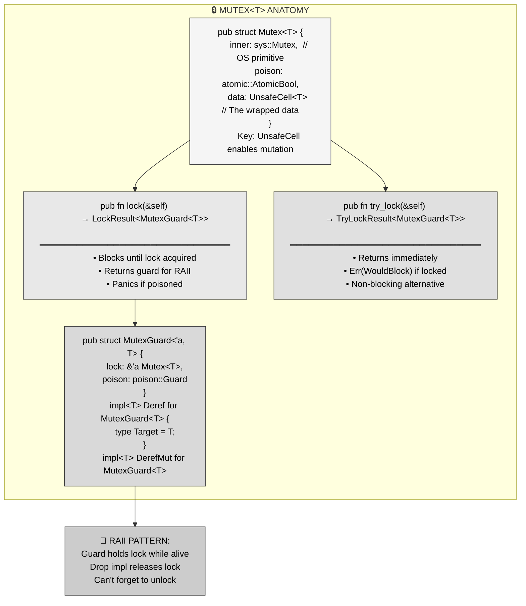
```mermaid
flowchart TD
    subgraph MUTEX["🔒 MUTEX&lt;T&gt; ANATOMY"]
        direction TB
        
        DEFINITION["pub struct Mutex&lt;T&gt; {
        inner: sys::Mutex,  // OS primitive
        poison: atomic::AtomicBool,
        data: UnsafeCell&lt;T&gt;  // The wrapped data
        }
        
        Key: UnsafeCell enables mutation"]
        
        LOCK["pub fn lock(&self) 
        → LockResult&lt;MutexGuard&lt;T&gt;&gt;
        ═══════════════════════════════
        • Blocks until lock acquired
        • Returns guard for RAII
        • Panics if poisoned"]
        
        TRYLOCK["pub fn try_lock(&self) 
        → TryLockResult&lt;MutexGuard&lt;T&gt;&gt;
        ═══════════════════════════════
        • Returns immediately
        • Err(WouldBlock) if locked
        • Non-blocking alternative"]
        
        GUARD["pub struct MutexGuard&lt;'a, T&gt; {
        lock: &'a Mutex&lt;T&gt;,
        poison: poison::Guard
        }
        
        impl&lt;T&gt; Deref for MutexGuard&lt;T&gt; {
        type Target = T;
        }
        impl&lt;T&gt; DerefMut for MutexGuard&lt;T&gt;"]
        
        DEFINITION --> LOCK
        DEFINITION --> TRYLOCK
        LOCK --> GUARD
    end
    
    RAII["🔐 RAII PATTERN:
    Guard holds lock while alive
    Drop impl releases lock
    Can't forget to unlock"]
    
    GUARD --> RAII
    
    style DEFINITION fill:#f5f5f5,stroke:#333,color:#000
    style LOCK fill:#e8e8e8,stroke:#333,color:#000
    style TRYLOCK fill:#e0e0e0,stroke:#333,color:#000
    style GUARD fill:#d9d9d9,stroke:#333,color:#000
    style RAII fill:#cccccc,stroke:#333,color:#000
```

**Critical details**:
- `lock(&self)` takes shared reference—interior mutability!
- `MutexGuard` implements `Deref<Target=T>` and `DerefMut<Target=T>`
- Guard's `Drop` releases lock automatically (RAII)
- `MutexGuard` is NOT `Send` (must unlock on same thread)

---

### 4.2 Arc<Mutex<T>> Pattern

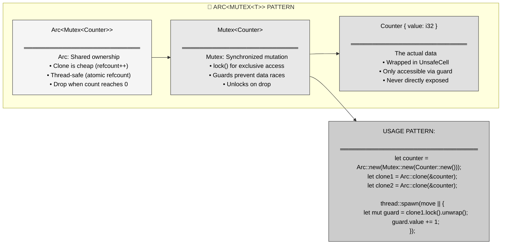
```mermaid
flowchart LR
    subgraph ARCMUTEX["🔗 ARC&lt;MUTEX&lt;T&gt;&gt; PATTERN"]
        direction LR
        
        ARC["Arc&lt;Mutex&lt;Counter&gt;&gt;
        ═══════════════════════════
        Arc: Shared ownership
        • Clone is cheap (refcount++)
        • Thread-safe (atomic refcount)
        • Drop when count reaches 0"]
        
        MUTEX_INNER["Mutex&lt;Counter&gt;
        ═══════════════════════════
        Mutex: Synchronized mutation
        • lock() for exclusive access
        • Guards prevent data races
        • Unlocks on drop"]
        
        DATA["Counter { value: i32 }
        ═══════════════════════════
        The actual data
        • Wrapped in UnsafeCell
        • Only accessible via guard
        • Never directly exposed"]
        
        ARC --> MUTEX_INNER
        MUTEX_INNER --> DATA
    end
    
    USAGE["USAGE PATTERN:
    ════════════════════════════════
    let counter = Arc::new(Mutex::new(Counter::new()));
    let clone1 = Arc::clone(&counter);
    let clone2 = Arc::clone(&counter);
    
    thread::spawn(move || {
        let mut guard = clone1.lock().unwrap();
        guard.value += 1;
    });"]
    
    MUTEX_INNER --> USAGE
    
    style ARC fill:#f5f5f5,stroke:#333,color:#000
    style MUTEX_INNER fill:#e8e8e8,stroke:#333,color:#000
    style DATA fill:#e0e0e0,stroke:#333,color:#000
    style USAGE fill:#cccccc,stroke:#333,color:#000
```

**Why both Arc and Mutex?**
- **Arc alone**: Shared ownership, but immutable data (like `Rc`)
- **Mutex alone**: Not `Clone`, can't share across threads easily
- **Arc<Mutex<T>>**: Combines both—shared ownership + synchronized mutation

---

### 4.3 Complete Concurrent Example

```rust
use std::sync::{Arc, Mutex};
use std::thread;

fn main() {
    // Shared counter wrapped in Arc<Mutex<T>>
    let counter = Arc::new(Mutex::new(0));
    let mut handles = vec![];
    
    for _ in 0..10 {
        // Clone Arc (cheap, increments refcount)
        let counter_clone = Arc::clone(&counter);
        
        let handle = thread::spawn(move || {
            // Acquire lock (blocks if another thread holds it)
            let mut guard = counter_clone.lock().unwrap();
            
            // Exclusive access to counter value
            *guard += 1;
            
            // Lock released when guard drops (RAII)
        });
        
        handles.push(handle);
    }
    
    // Wait for all threads
    for handle in handles {
        handle.join().unwrap();
    }
    
    // Final value: guaranteed to be 10
    println!("Final count: {}", *counter.lock().unwrap());
}
```

**Flow**:
1. Create `Arc<Mutex<T>>` in main thread
2. Clone Arc for each thread (refcount: 1 → 11)
3. Move clones into threads (ownership transfer)
4. Each thread locks, modifies, unlocks
5. Threads finish, Arc clones drop (refcount: 11 → 1)
6. Main thread locks and reads final value

---

## Part 5: Common Patterns in Concurrent Code

### 5.1 Shared State Across Threads

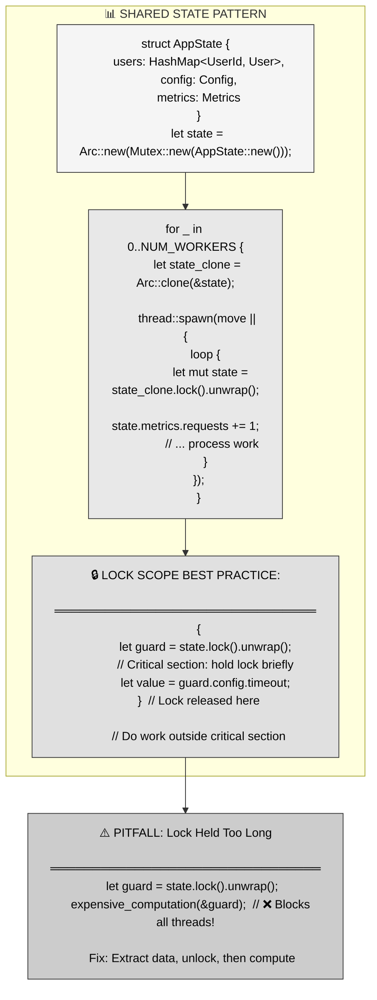
```mermaid
flowchart TD
    subgraph SHARED["📊 SHARED STATE PATTERN"]
        direction TB
        
        SETUP["struct AppState {
        users: HashMap&lt;UserId, User&gt;,
        config: Config,
        metrics: Metrics
        }
        
        let state = Arc::new(Mutex::new(AppState::new()));"]
        
        SPAWN["for _ in 0..NUM_WORKERS {
        let state_clone = Arc::clone(&state);
        
        thread::spawn(move || {
            loop {
                let mut state = state_clone.lock().unwrap();
                state.metrics.requests += 1;
                // ... process work
            }
        });
        }"]
        
        GUARD["🔒 LOCK SCOPE BEST PRACTICE:
        ═══════════════════════════════
        {
            let guard = state.lock().unwrap();
            // Critical section: hold lock briefly
            let value = guard.config.timeout;
        }  // Lock released here
        
        // Do work outside critical section"]
        
        SETUP --> SPAWN
        SPAWN --> GUARD
    end
    
    PITFALL["⚠️ PITFALL: Lock Held Too Long
    ════════════════════════════════
    let guard = state.lock().unwrap();
    expensive_computation(&guard);  // ❌ Blocks all threads!
    
    Fix: Extract data, unlock, then compute"]
    
    GUARD --> PITFALL
    
    style SETUP fill:#f5f5f5,stroke:#333,color:#000
    style SPAWN fill:#e8e8e8,stroke:#333,color:#000
    style GUARD fill:#e0e0e0,stroke:#333,color:#000
    style PITFALL fill:#cccccc,stroke:#333,color:#000
```

**Best practice**: Minimize critical section (time holding lock). Extract needed data, release lock, process outside critical section.

---

### 5.2 Fine-Grained vs Coarse-Grained Locking

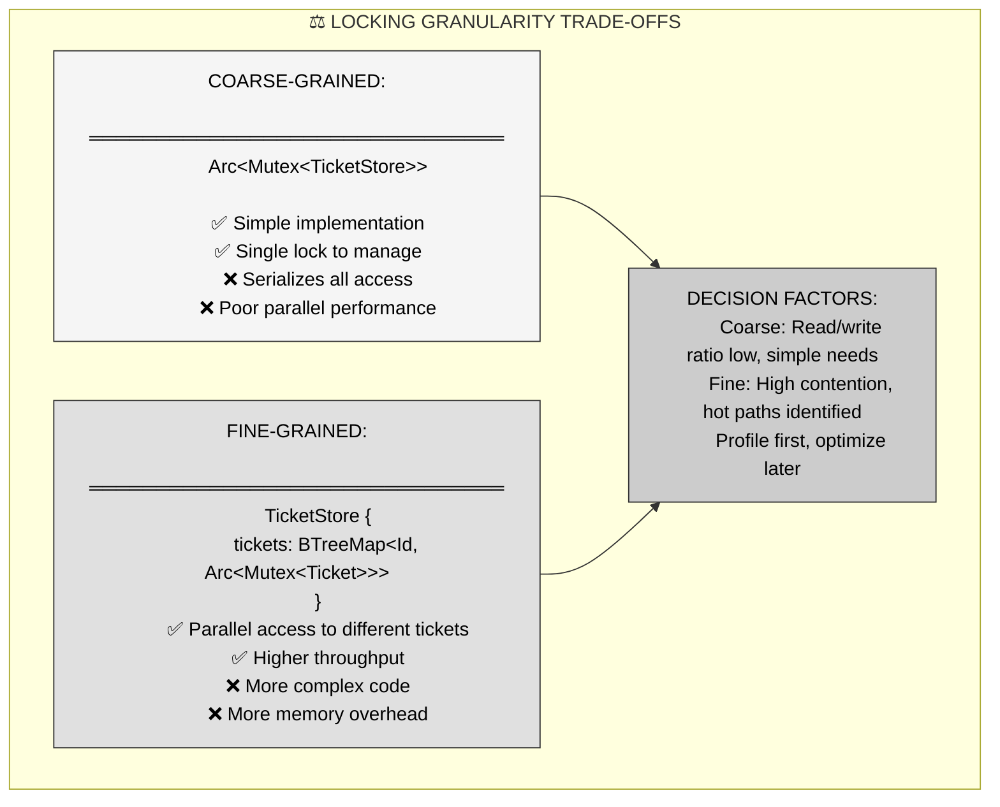
```mermaid
flowchart LR
    subgraph GRANULARITY["⚖️ LOCKING GRANULARITY TRADE-OFFS"]
        direction LR
        
        COARSE["COARSE-GRAINED:
        ═══════════════════════════════
        Arc&lt;Mutex&lt;TicketStore&gt;&gt;
        
        ✅ Simple implementation
        ✅ Single lock to manage
        ❌ Serializes all access
        ❌ Poor parallel performance"]
        
        FINE["FINE-GRAINED:
        ═══════════════════════════════
        TicketStore {
            tickets: BTreeMap&lt;Id, Arc&lt;Mutex&lt;Ticket&gt;&gt;&gt;
        }
        
        ✅ Parallel access to different tickets
        ✅ Higher throughput
        ❌ More complex code
        ❌ More memory overhead"]
        
        COARSE --> DECISION["DECISION FACTORS:
        Coarse: Read/write ratio low, simple needs
        Fine: High contention, hot paths identified
        Profile first, optimize later"]
        
        FINE --> DECISION
    end
    
    style COARSE fill:#f5f5f5,stroke:#333,color:#000
    style FINE fill:#e0e0e0,stroke:#333,color:#000
    style DECISION fill:#cccccc,stroke:#333,color:#000
```

**Rule of thumb**: Start coarse, profile, refine to fine-grained only where proven bottleneck.

---

### 5.3 RwLock for Read-Heavy Workloads

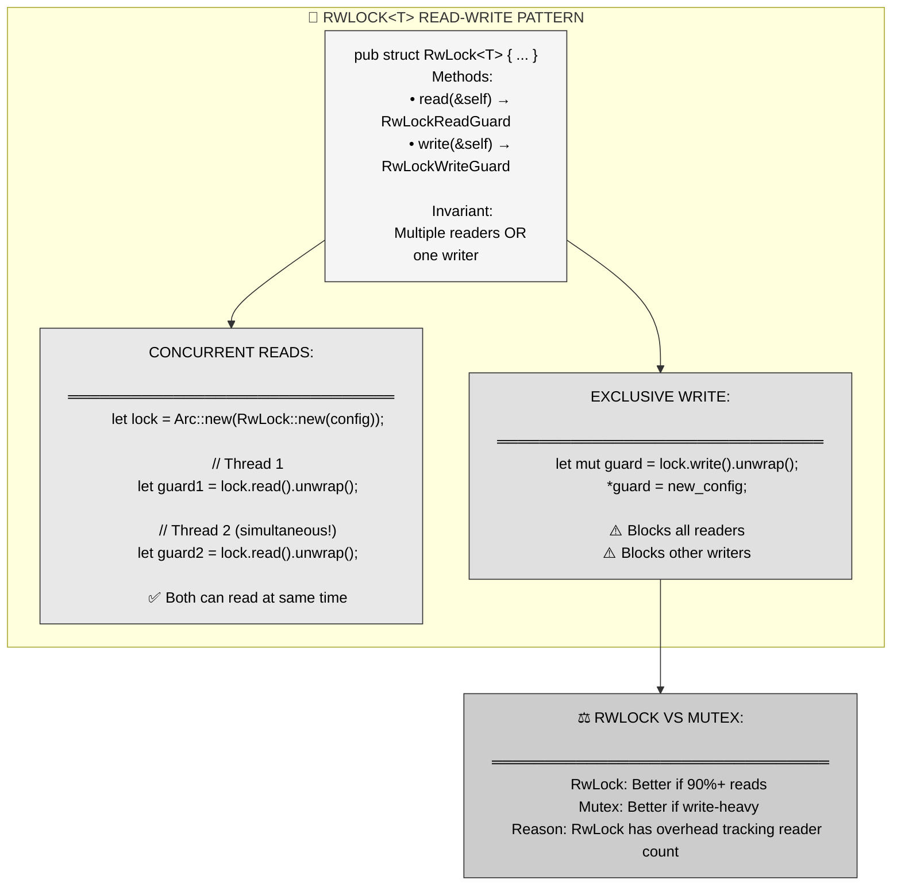
```mermaid
flowchart TD
    subgraph RWLOCK["📖 RWLOCK&lt;T&gt; READ-WRITE PATTERN"]
        direction TB
        
        CONCEPT["pub struct RwLock&lt;T&gt; { ... }
        
        Methods:
        • read(&self) → RwLockReadGuard
        • write(&self) → RwLockWriteGuard
        
        Invariant:
        Multiple readers OR one writer"]
        
        READS["CONCURRENT READS:
        ═══════════════════════════════
        let lock = Arc::new(RwLock::new(config));
        
        // Thread 1
        let guard1 = lock.read().unwrap();
        
        // Thread 2 (simultaneous!)
        let guard2 = lock.read().unwrap();
        
        ✅ Both can read at same time"]
        
        WRITE["EXCLUSIVE WRITE:
        ═══════════════════════════════
        let mut guard = lock.write().unwrap();
        *guard = new_config;
        
        ⚠️ Blocks all readers
        ⚠️ Blocks other writers"]
        
        CONCEPT --> READS
        CONCEPT --> WRITE
    end
    
    TRADEOFF["⚖️ RWLOCK VS MUTEX:
    ════════════════════════════════
    RwLock: Better if 90%+ reads
    Mutex: Better if write-heavy
    Reason: RwLock has overhead tracking reader count"]
    
    WRITE --> TRADEOFF
    
    style CONCEPT fill:#f5f5f5,stroke:#333,color:#000
    style READS fill:#e8e8e8,stroke:#333,color:#000
    style WRITE fill:#e0e0e0,stroke:#333,color:#000
    style TRADEOFF fill:#cccccc,stroke:#333,color:#000
```

**When to use `RwLock`**: Configuration that's read frequently but updated rarely. Cache that's queried often, invalidated occasionally.

---

## Part 6: Real-World Applications

### 6.1 Thread-Safe Cache Implementation

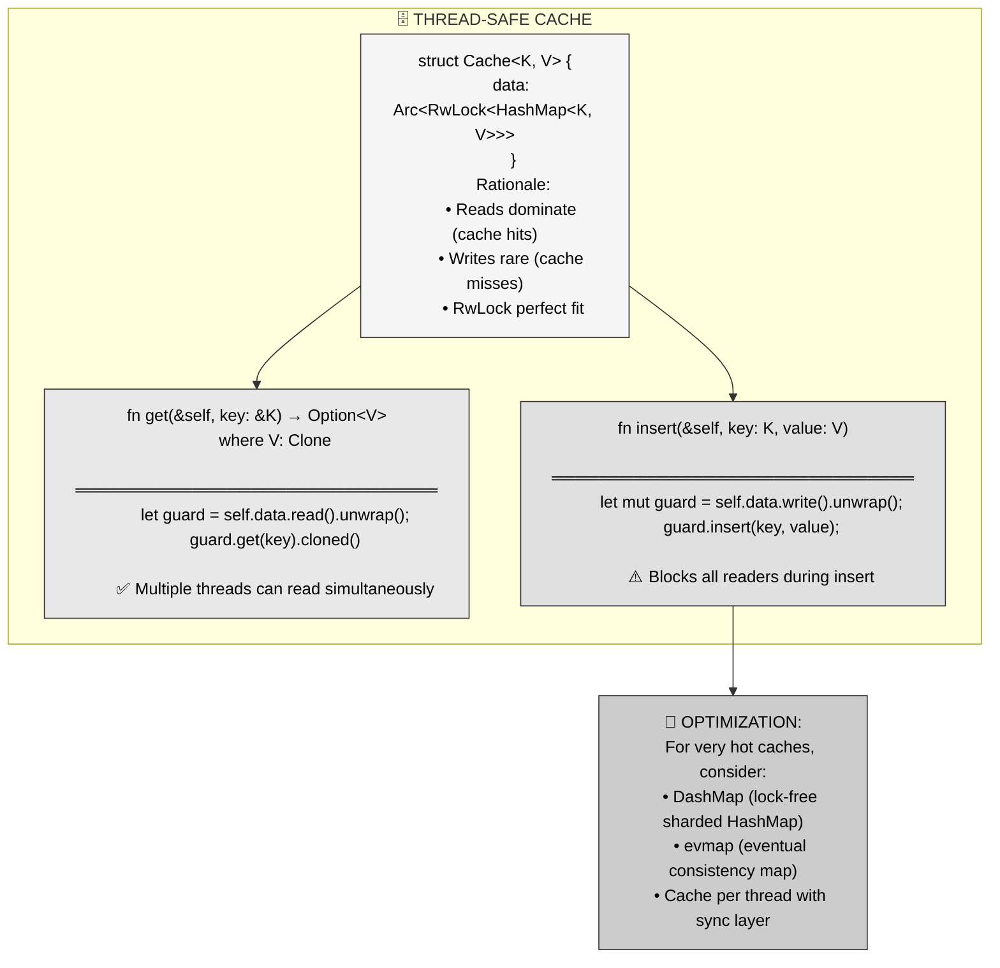
```mermaid
flowchart TD
    subgraph CACHE["🗄️ THREAD-SAFE CACHE"]
        direction TB
        
        DESIGN["struct Cache&lt;K, V&gt; {
        data: Arc&lt;RwLock&lt;HashMap&lt;K, V&gt;&gt;&gt;
        }
        
        Rationale:
        • Reads dominate (cache hits)
        • Writes rare (cache misses)
        • RwLock perfect fit"]
        
        GET["fn get(&self, key: &K) → Option&lt;V&gt;
        where V: Clone
        ═══════════════════════════════
        let guard = self.data.read().unwrap();
        guard.get(key).cloned()
        
        ✅ Multiple threads can read simultaneously"]
        
        INSERT["fn insert(&self, key: K, value: V)
        ═══════════════════════════════
        let mut guard = self.data.write().unwrap();
        guard.insert(key, value);
        
        ⚠️ Blocks all readers during insert"]
        
        DESIGN --> GET
        DESIGN --> INSERT
    end
    
    OPTIMIZATION["🚀 OPTIMIZATION:
    For very hot caches, consider:
    • DashMap (lock-free sharded HashMap)
    • evmap (eventual consistency map)
    • Cache per thread with sync layer"]
    
    INSERT --> OPTIMIZATION
    
    style DESIGN fill:#f5f5f5,stroke:#333,color:#000
    style GET fill:#e8e8e8,stroke:#333,color:#000
    style INSERT fill:#e0e0e0,stroke:#333,color:#000
    style OPTIMIZATION fill:#cccccc,stroke:#333,color:#000
```

**Real implementation**: Web server caching compiled templates—reads on every request, writes only when template changes.

---

### 6.2 Producer-Consumer with Shared Queue

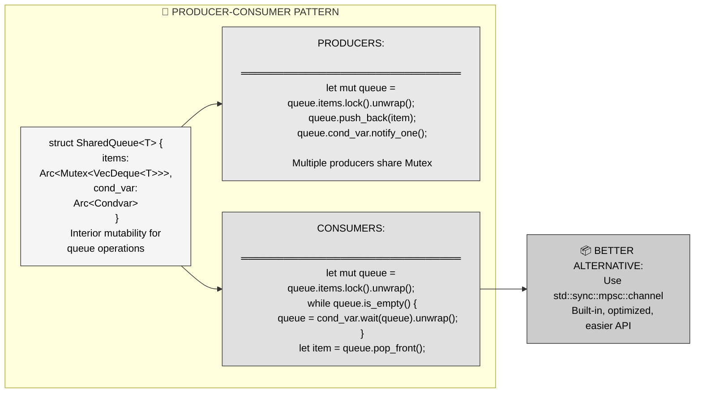
```mermaid
flowchart LR
    subgraph PRODCONS["🔄 PRODUCER-CONSUMER PATTERN"]
        direction LR
        
        QUEUE["struct SharedQueue&lt;T&gt; {
        items: Arc&lt;Mutex&lt;VecDeque&lt;T&gt;&gt;&gt;,
        cond_var: Arc&lt;Condvar&gt;
        }
        
        Interior mutability for queue operations"]
        
        PRODUCER["PRODUCERS:
        ═══════════════════════════════
        let mut queue = queue.items.lock().unwrap();
        queue.push_back(item);
        queue.cond_var.notify_one();
        
        Multiple producers share Mutex"]
        
        CONSUMER["CONSUMERS:
        ═══════════════════════════════
        let mut queue = queue.items.lock().unwrap();
        while queue.is_empty() {
            queue = cond_var.wait(queue).unwrap();
        }
        let item = queue.pop_front();"]
        
        QUEUE --> PRODUCER
        QUEUE --> CONSUMER
    end
    
    ALTERNATIVE["📦 BETTER ALTERNATIVE:
    Use std::sync::mpsc::channel
    Built-in, optimized, easier API"]
    
    CONSUMER --> ALTERNATIVE
    
    style QUEUE fill:#f5f5f5,stroke:#333,color:#000
    style PRODUCER fill:#e8e8e8,stroke:#333,color:#000
    style CONSUMER fill:#e0e0e0,stroke:#333,color:#000
    style ALTERNATIVE fill:#cccccc,stroke:#333,color:#000
```

**Note**: This pattern is mostly educational—use channels instead. But it shows how `Mutex + Condvar` enables custom synchronization primitives.

---

### 6.3 Actor Model with Message Passing

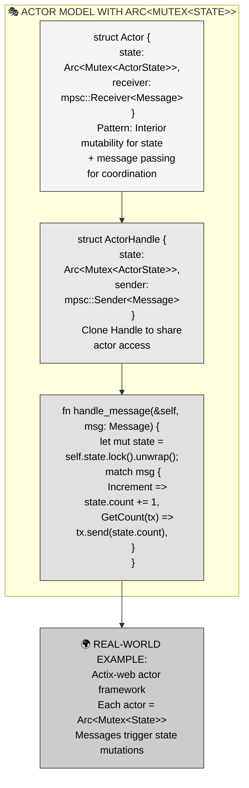
```mermaid
flowchart TD
    subgraph ACTOR["🎭 ACTOR MODEL WITH ARC&lt;MUTEX&lt;STATE&gt;&gt;"]
        direction TB
        
        ACTOR_DEF["struct Actor {
        state: Arc&lt;Mutex&lt;ActorState&gt;&gt;,
        receiver: mpsc::Receiver&lt;Message&gt;
        }
        
        Pattern: Interior mutability for state
        + message passing for coordination"]
        
        HANDLE["struct ActorHandle {
        state: Arc&lt;Mutex&lt;ActorState&gt;&gt;,
        sender: mpsc::Sender&lt;Message&gt;
        }
        
        Clone Handle to share actor access"]
        
        MESSAGE["fn handle_message(&self, msg: Message) {
        let mut state = self.state.lock().unwrap();
        match msg {
            Increment =&gt; state.count += 1,
            GetCount(tx) =&gt; tx.send(state.count),
        }
        }"]
        
        ACTOR_DEF --> HANDLE
        HANDLE --> MESSAGE
    end
    
    REALWORLD["🌍 REAL-WORLD EXAMPLE:
    Actix-web actor framework
    Each actor = Arc&lt;Mutex&lt;State&gt;&gt;
    Messages trigger state mutations"]
    
    MESSAGE --> REALWORLD
    
    style ACTOR_DEF fill:#f5f5f5,stroke:#333,color:#000
    style HANDLE fill:#e8e8e8,stroke:#333,color:#000
    style MESSAGE fill:#e0e0e0,stroke:#333,color:#000
    style REALWORLD fill:#cccccc,stroke:#333,color:#000
```

**Pattern**: Actor owns state (`Arc<Mutex<T>>`), handles clones allow external communication. Messages trigger state mutations under lock protection.

---

## Part 7: Performance Characteristics

### 7.1 Lock Overhead Comparison

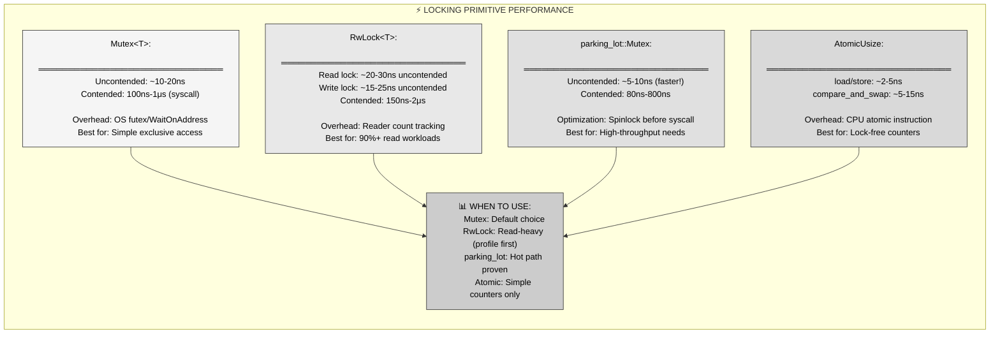
```mermaid
flowchart TD
    subgraph PERF["⚡ LOCKING PRIMITIVE PERFORMANCE"]
        direction TB
        
        MUTEX["Mutex&lt;T&gt;:
        ═══════════════════════════════
        Uncontended: ~10-20ns
        Contended: 100ns-1μs (syscall)
        
        Overhead: OS futex/WaitOnAddress
        Best for: Simple exclusive access"]
        
        RWLOCK["RwLock&lt;T&gt;:
        ═══════════════════════════════
        Read lock: ~20-30ns uncontended
        Write lock: ~15-25ns uncontended
        Contended: 150ns-2μs
        
        Overhead: Reader count tracking
        Best for: 90%+ read workloads"]
        
        PARKING["parking_lot::Mutex:
        ═══════════════════════════════
        Uncontended: ~5-10ns (faster!)
        Contended: 80ns-800ns
        
        Optimization: Spinlock before syscall
        Best for: High-throughput needs"]
        
        ATOMIC["AtomicUsize:
        ═══════════════════════════════
        load/store: ~2-5ns
        compare_and_swap: ~5-15ns
        
        Overhead: CPU atomic instruction
        Best for: Lock-free counters"]
        
        MUTEX --> COMPARISON["📊 WHEN TO USE:
        Mutex: Default choice
        RwLock: Read-heavy (profile first)
        parking_lot: Hot path proven
        Atomic: Simple counters only"]
        
        RWLOCK --> COMPARISON
        PARKING --> COMPARISON
        ATOMIC --> COMPARISON
    end
    
    style MUTEX fill:#f5f5f5,stroke:#333,color:#000
    style RWLOCK fill:#e8e8e8,stroke:#333,color:#000
    style PARKING fill:#e0e0e0,stroke:#333,color:#000
    style ATOMIC fill:#d9d9d9,stroke:#333,color:#000
    style COMPARISON fill:#cccccc,stroke:#333,color:#000
```

**Benchmark context**: 4-core CPU, 100k operations. Contention = 50% of operations conflict.

---

### 7.2 Memory Overhead

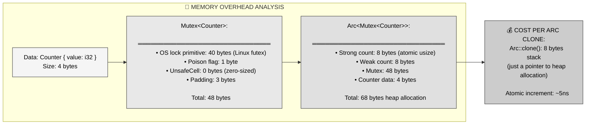
```mermaid
flowchart LR
    subgraph MEMORY["🧠 MEMORY OVERHEAD ANALYSIS"]
        direction LR
        
        DATA["Data: Counter { value: i32 }
        Size: 4 bytes"]
        
        MUTEX["Mutex&lt;Counter&gt;:
        ═══════════════════════════════
        • OS lock primitive: 40 bytes (Linux futex)
        • Poison flag: 1 byte
        • UnsafeCell: 0 bytes (zero-sized)
        • Padding: 3 bytes
        
        Total: 48 bytes"]
        
        ARC["Arc&lt;Mutex&lt;Counter&gt;&gt;:
        ═══════════════════════════════
        • Strong count: 8 bytes (atomic usize)
        • Weak count: 8 bytes
        • Mutex: 48 bytes
        • Counter data: 4 bytes
        
        Total: 68 bytes heap allocation"]
        
        DATA --> MUTEX
        MUTEX --> ARC
    end
    
    COST["💰 COST PER ARC CLONE:
    Arc::clone(): 8 bytes stack
    (just a pointer to heap allocation)
    
    Atomic increment: ~5ns"]
    
    ARC --> COST
    
    style DATA fill:#f5f5f5,stroke:#333,color:#000
    style MUTEX fill:#e8e8e8,stroke:#333,color:#000
    style ARC fill:#e0e0e0,stroke:#333,color:#000
    style COST fill:#cccccc,stroke:#333,color:#000
```

**Takeaway**: Each `Arc<Mutex<T>>` has ~64 bytes overhead regardless of `T` size. For tiny data (<8 bytes), overhead dominates. For large data (>1KB), overhead negligible.

---

## Part 8: Comparison to Alternatives

### 8.1 Interior Mutability vs Message Passing

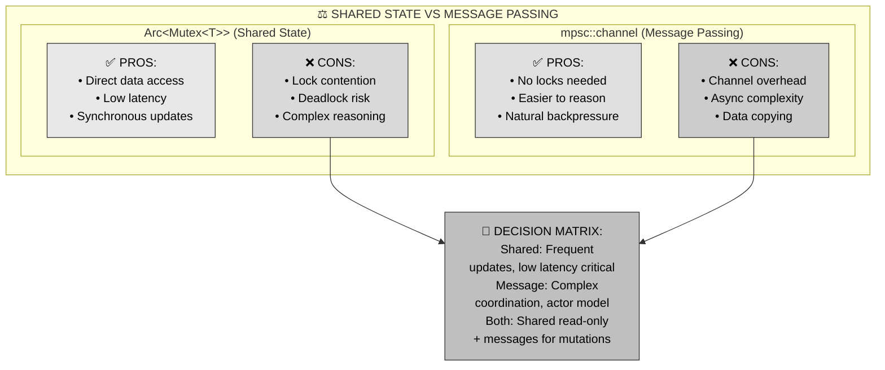
```mermaid
flowchart TD
    subgraph COMPARISON["⚖️ SHARED STATE VS MESSAGE PASSING"]
        direction TB
        
        subgraph SHARED["Arc&lt;Mutex&lt;T&gt;&gt; (Shared State)"]
            SH_PRO["✅ PROS:
            • Direct data access
            • Low latency
            • Synchronous updates"]
            
            SH_CON["❌ CONS:
            • Lock contention
            • Deadlock risk
            • Complex reasoning"]
        end
        
        subgraph MESSAGE["mpsc::channel (Message Passing)"]
            MSG_PRO["✅ PROS:
            • No locks needed
            • Easier to reason
            • Natural backpressure"]
            
            MSG_CON["❌ CONS:
            • Channel overhead
            • Async complexity
            • Data copying"]
        end
    end
    
    SH_CON --> DECISION["🎯 DECISION MATRIX:
    Shared: Frequent updates, low latency critical
    Message: Complex coordination, actor model
    Both: Shared read-only + messages for mutations"]
    
    MSG_CON --> DECISION
    
    style SH_PRO fill:#e8e8e8,stroke:#333,color:#000
    style SH_CON fill:#d9d9d9,stroke:#333,color:#000
    style MSG_PRO fill:#e0e0e0,stroke:#333,color:#000
    style MSG_CON fill:#cccccc,stroke:#333,color:#000
    style DECISION fill:#bfbfbf,stroke:#333,color:#000
```

**Rust's philosophy**: "Fearless concurrency" means both are safe. Choose based on problem structure, not safety concerns.

---

### 8.2 RefCell vs Mutex

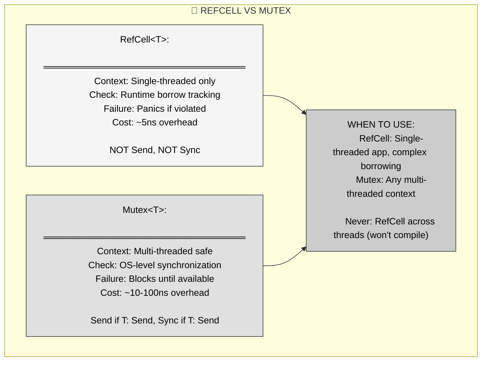
```mermaid
flowchart LR
    subgraph REFCELLVSMUTEX["🔀 REFCELL VS MUTEX"]
        direction LR
        
        REFCELL["RefCell&lt;T&gt;:
        ═══════════════════════════════
        Context: Single-threaded only
        Check: Runtime borrow tracking
        Failure: Panics if violated
        Cost: ~5ns overhead
        
        NOT Send, NOT Sync"]
        
        MUTEX_COMPARE["Mutex&lt;T&gt;:
        ═══════════════════════════════
        Context: Multi-threaded safe
        Check: OS-level synchronization
        Failure: Blocks until available
        Cost: ~10-100ns overhead
        
        Send if T: Send, Sync if T: Send"]
        
        REFCELL --> WHEN["WHEN TO USE:
        RefCell: Single-threaded app, complex borrowing
        Mutex: Any multi-threaded context
        
        Never: RefCell across threads (won't compile)"]
        
        MUTEX_COMPARE --> WHEN
    end
    
    style REFCELL fill:#f5f5f5,stroke:#333,color:#000
    style MUTEX_COMPARE fill:#e0e0e0,stroke:#333,color:#000
    style WHEN fill:#cccccc,stroke:#333,color:#000
```

**Critical**: `RefCell` is NOT thread-safe. Compiler enforces this via `Send`/`Sync` trait bounds.

---

## Part 9: Best Practices and Gotchas

### 9.1 Common Pitfalls

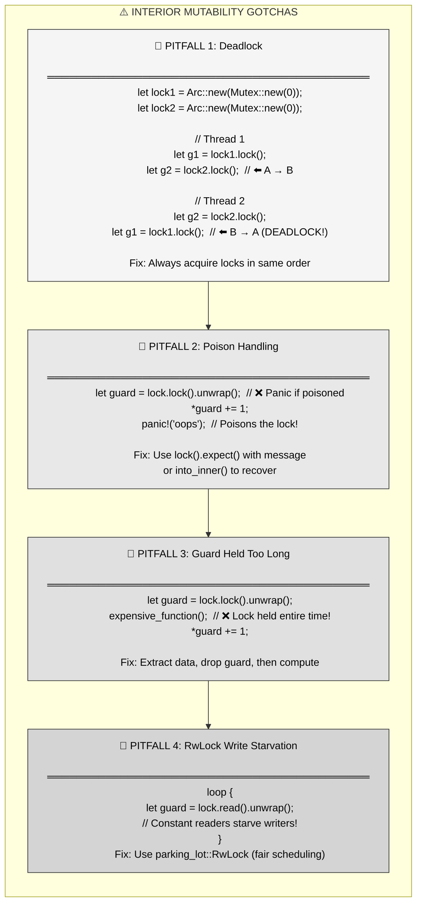
```mermaid
flowchart TD
    subgraph GOTCHAS["⚠️ INTERIOR MUTABILITY GOTCHAS"]
        direction TB
        
        DEADLOCK["🚨 PITFALL 1: Deadlock
        ════════════════════════════════════════════
        let lock1 = Arc::new(Mutex::new(0));
        let lock2 = Arc::new(Mutex::new(0));
        
        // Thread 1
        let g1 = lock1.lock();
        let g2 = lock2.lock();  // ⬅️ A → B
        
        // Thread 2
        let g2 = lock2.lock();
        let g1 = lock1.lock();  // ⬅️ B → A (DEADLOCK!)
        
        Fix: Always acquire locks in same order"]
        
        POISON["🚨 PITFALL 2: Poison Handling
        ════════════════════════════════════════════
        let guard = lock.lock().unwrap();  // ❌ Panic if poisoned
        *guard += 1;
        panic!('oops');  // Poisons the lock!
        
        Fix: Use lock().expect() with message
        or into_inner() to recover"]
        
        GUARD_LEAK["🚨 PITFALL 3: Guard Held Too Long
        ════════════════════════════════════════════
        let guard = lock.lock().unwrap();
        expensive_function();  // ❌ Lock held entire time!
        *guard += 1;
        
        Fix: Extract data, drop guard, then compute"]
        
        RWLOCK_WRITE["🚨 PITFALL 4: RwLock Write Starvation
        ════════════════════════════════════════════
        loop {
        let guard = lock.read().unwrap();
        // Constant readers starve writers!
        }
        
        Fix: Use parking_lot::RwLock (fair scheduling)"]
    end
    
    DEADLOCK --> POISON
    POISON --> GUARD_LEAK
    GUARD_LEAK --> RWLOCK_WRITE
    
    style DEADLOCK fill:#f5f5f5,stroke:#333,color:#000
    style POISON fill:#e8e8e8,stroke:#333,color:#000
    style GUARD_LEAK fill:#e0e0e0,stroke:#333,color:#000
    style RWLOCK_WRITE fill:#d4d4d4,stroke:#333,color:#000
```

---

### 9.2 Safe Concurrent Patterns

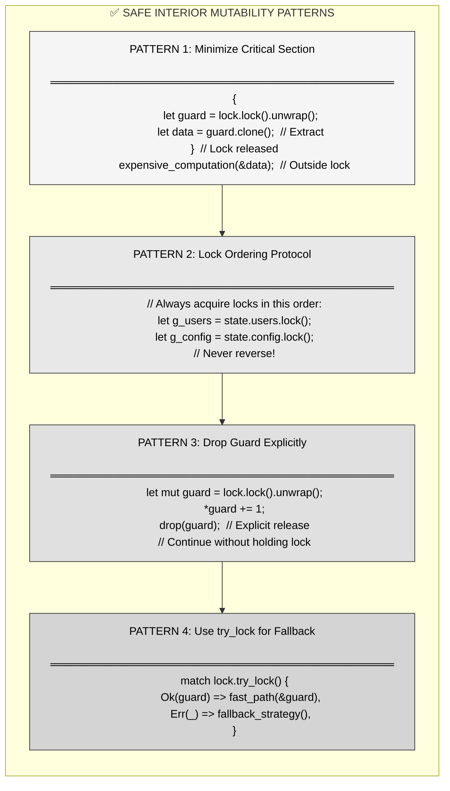
```mermaid
flowchart TD
    subgraph SAFE["✅ SAFE INTERIOR MUTABILITY PATTERNS"]
        direction TB
        
        PATTERN1["PATTERN 1: Minimize Critical Section
        ════════════════════════════════════════════
        {
            let guard = lock.lock().unwrap();
            let data = guard.clone();  // Extract
        }  // Lock released
        expensive_computation(&data);  // Outside lock"]
        
        PATTERN2["PATTERN 2: Lock Ordering Protocol
        ════════════════════════════════════════════
        // Always acquire locks in this order:
        let g_users = state.users.lock();
        let g_config = state.config.lock();
        // Never reverse!"]
        
        PATTERN3["PATTERN 3: Drop Guard Explicitly
        ════════════════════════════════════════════
        let mut guard = lock.lock().unwrap();
        *guard += 1;
        drop(guard);  // Explicit release
        // Continue without holding lock"]
        
        PATTERN4["PATTERN 4: Use try_lock for Fallback
        ════════════════════════════════════════════
        match lock.try_lock() {
            Ok(guard) =&gt; fast_path(&guard),
            Err(_) =&gt; fallback_strategy(),
        }"]
    end
    
    PATTERN1 --> PATTERN2
    PATTERN2 --> PATTERN3
    PATTERN3 --> PATTERN4
    
    style PATTERN1 fill:#f5f5f5,stroke:#333,color:#000
    style PATTERN2 fill:#e8e8e8,stroke:#333,color:#000
    style PATTERN3 fill:#e0e0e0,stroke:#333,color:#000
    style PATTERN4 fill:#d4d4d4,stroke:#333,color:#000
```

---

## Part 10: Key Takeaways and Cross-Language Comparison

### 10.1 Core Principles Summary

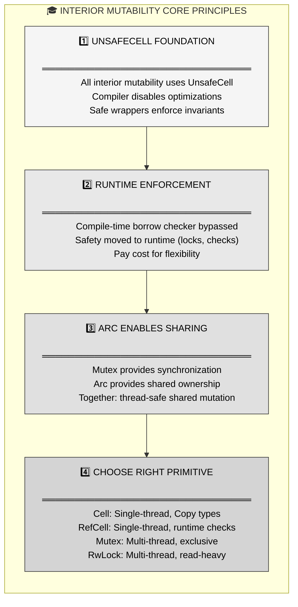
```mermaid
flowchart TD
    subgraph PRINCIPLES["🎓 INTERIOR MUTABILITY CORE PRINCIPLES"]
        direction TB
        
        P1["1️⃣ UNSAFECELL FOUNDATION
        ════════════════════════════════
        All interior mutability uses UnsafeCell
        Compiler disables optimizations
        Safe wrappers enforce invariants"]
        
        P2["2️⃣ RUNTIME ENFORCEMENT
        ════════════════════════════════
        Compile-time borrow checker bypassed
        Safety moved to runtime (locks, checks)
        Pay cost for flexibility"]
        
        P3["3️⃣ ARC ENABLES SHARING
        ════════════════════════════════
        Mutex provides synchronization
        Arc provides shared ownership
        Together: thread-safe shared mutation"]
        
        P4["4️⃣ CHOOSE RIGHT PRIMITIVE
        ════════════════════════════════
        Cell: Single-thread, Copy types
        RefCell: Single-thread, runtime checks
        Mutex: Multi-thread, exclusive
        RwLock: Multi-thread, read-heavy"]
        
        P1 --> P2
        P2 --> P3
        P3 --> P4
    end
    
    style P1 fill:#f5f5f5,stroke:#333,color:#000
    style P2 fill:#e8e8e8,stroke:#333,color:#000
    style P3 fill:#e0e0e0,stroke:#333,color:#000
    style P4 fill:#d4d4d4,stroke:#333,color:#000
```

---

### 10.2 Cross-Language Comparison

| Language | Equivalent Pattern | Safety | Limitations |
|----------|-------------------|--------|-------------|
| **Rust** | `Arc<Mutex<T>>` | ✅ Compile + runtime enforced | Must handle `PoisonError`, deadlock possible |
| **C++** | `std::shared_ptr<std::mutex>` + manual locking | ⚠️ Easy to forget lock/unlock | No RAII guard, easy to misuse |
| **Java** | `synchronized` keyword | ⚠️ Runtime only | Hidden locks, performance cost |
| **Go** | `sync.Mutex` + careful use | ⚠️ No compile-time checks | Easy to access without lock |
| **Python** | `threading.Lock()` | ❌ GIL limits true parallelism | Not truly concurrent |
| **Swift** | `actor` (Swift 5.5+) | ✅ Compile-time isolated state | Less flexible than Rust |

**Rust's advantage**: RAII guards prevent forgetting to unlock. `Send`/`Sync` traits catch thread-safety errors at compile time. Type system guides correct usage.

---

## Part 11: Summary - Safe Shared Mutation

**Interior mutability bridges the gap between Rust's strict borrow checker and the need for shared mutable state in concurrent programs.**

**Three key mechanisms:**
1. **UnsafeCell** → Opts out of compiler optimizations, enables raw pointer mutation
2. **Safe wrappers** → `Mutex<T>`, `RwLock<T>` enforce invariants at runtime
3. **Arc + Mutex** → Shared ownership + synchronized mutation = thread-safe sharing

**MCU metaphor recap**: Tony Stark's arc reactor (shared resource) monitored by multiple systems (threads), with J.A.R.V.I.S. (Mutex) coordinating adjustments. All systems share access (Arc clones), but modifications go through synchronization protocol (lock/unlock).

**When to use**: Shared state across threads, caches, counters, any scenario where multiple threads need to observe and modify the same data concurrently.

**Pattern choice**:
- Single-thread: `RefCell<T>`
- Multi-thread exclusive: `Arc<Mutex<T>>`
- Multi-thread read-heavy: `Arc<RwLock<T>>`
- Lock-free counters: `AtomicUsize`

**The promise**: Write concurrent code with shared mutable state safely—the type system prevents data races at compile time, runtime locks prevent conflicts, and RAII guards prevent lock leaks.

---

## References

**Primary source**: Mainmatter's "100 Exercises To Learn Rust" - Section 7 (Threads), Chapter 6 (Interior Mutability), Chapter 11 (Locks)

**Key concepts covered**:
- Problem: `&T` should be immutable, but concurrent code needs shared mutation
- UnsafeCell: Primitive enabling mutation through shared references
- Mutex<T>: Thread-safe exclusive access with RAII guards
- Arc<Mutex<T>>: Pattern for shared ownership + synchronized mutation
- RwLock<T>: Reader-writer locks for read-heavy workloads

**Related standard library types**:
- `std::cell::UnsafeCell<T>` - primitive interior mutability
- `std::cell::RefCell<T>` - single-threaded runtime borrow checking
- `std::sync::Mutex<T>` - mutual exclusion lock
- `std::sync::RwLock<T>` - reader-writer lock
- `std::sync::Arc<T>` - atomic reference counting

**Further reading**:
- "Rust Atomics and Locks" by Mara Bos (O'Reilly)
- std::sync documentation
- Rustonomicon chapter on "Ownership and Lifetimes"
