# R70: Rust Tokio Runtime Architecture - Async Execution Engine

## Part 1: The Problem - Futures Need an Executor

### 1.1 The Polling Paradox

**Futures are inert state machines that require an external runtime to poll them, coordinate wakeups, and schedule concurrent execution—without a runtime, async functions never run.**

The async/await illusion breaks down without infrastructure:

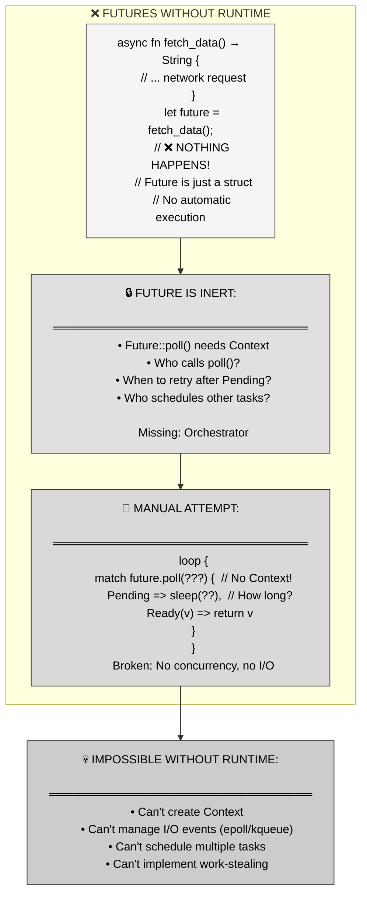

**The pain**: `async fn` returns a `Future`, but futures don't execute themselves. You need a **runtime** (executor + reactor) to poll futures, wake them when I/O is ready, and schedule thousands concurrently on a thread pool.

---

### 1.2 The Blocking vs Concurrency Conflict

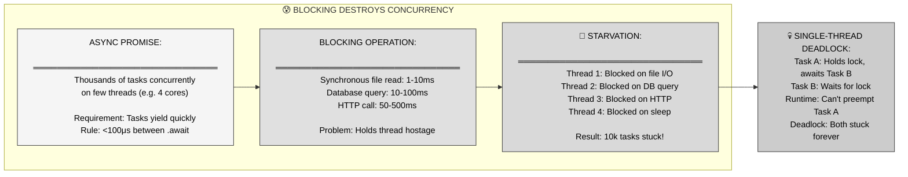

**Critical insight**: Async tasks are **cooperative**, not preemptive. If a task never yields (via `.await`), the runtime can't schedule other tasks. One blocking operation on a 4-thread runtime = 25% capacity loss.

---

## Part 2: The Solution - Tokio Runtime Architecture

### 2.1 Two-Layer Architecture: Executor + Reactor

**Tokio combines a work-stealing executor (schedules tasks across threads) with an I/O reactor (monitors OS events via epoll/kqueue), enabling thousands of concurrent async tasks on a small thread pool.**

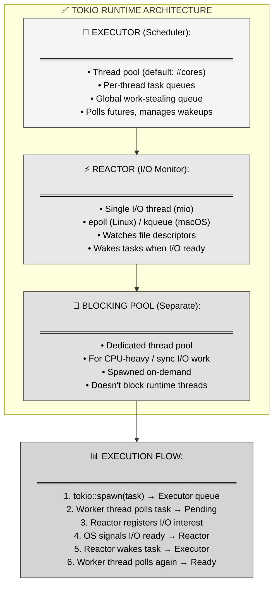

**Key separation**: Executor schedules CPU work, Reactor handles I/O waits. This division enables efficient concurrency—tasks yield during I/O, freeing threads for other work.

---

### 2.2 Multi-Threaded vs Current-Thread Runtime

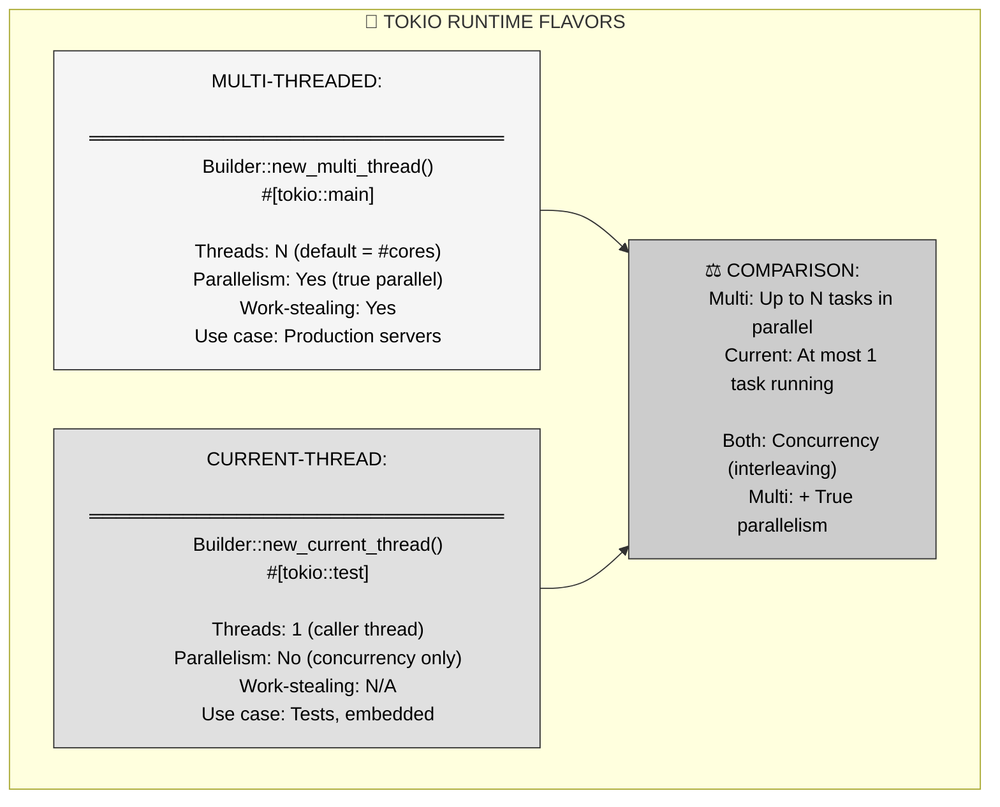

**Choice**: Multi-threaded for servers (CPU parallelism), current-thread for tests (deterministic execution, easier debugging).

---

## Part 3: Mental Model - S.H.I.E.L.D. Operations Center

### 3.1 The MCU Metaphor

**S.H.I.E.L.D.'s operations center—where multiple agent missions run concurrently with Maria Hill coordinating task assignments and Fury monitoring external intel—mirrors Tokio's executor-reactor architecture.**

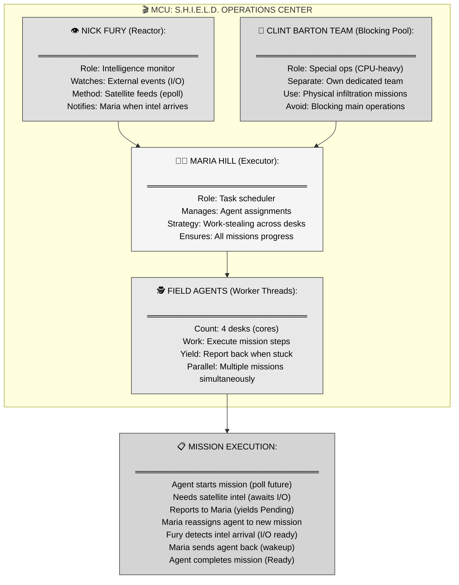

---

### 3.2 MCU-to-Rust Mapping Table

| MCU Concept | Tokio Runtime | Enforced Invariant |
|-------------|---------------|-------------------|
| **Maria Hill** | Executor / scheduler | Assigns tasks to worker threads, manages task queues |
| **Field agents** | Worker threads (4 cores) | Execute async tasks, poll futures to completion |
| **Agent's desk** | Per-thread task queue | Local work queue for each worker thread |
| **Work-stealing protocol** | Idle thread steals from busy thread | Load balancing across workers |
| **Nick Fury's satellite room** | I/O reactor (mio) | Monitors OS events (epoll/kqueue) for I/O readiness |
| **Satellite feed alerts** | I/O events (socket ready) | Wakes tasks waiting on network/file operations |
| **Agent reports "stuck"** | Future returns `Poll::Pending` | Task yields control, can't make progress yet |
| **Maria reassigns agent** | Executor schedules different task | Work-stealing or queue rotation |
| **Intel arrives** | I/O becomes ready | OS signals data available on file descriptor |
| **Maria notifies agent** | Waker::wake() | Task added back to run queue for polling |
| **Barton's special ops team** | Blocking thread pool | Handles CPU-heavy/sync I/O without blocking runtime |

**Narrative**: S.H.I.E.L.D. operations center runs dozens of field missions concurrently with just 4 agents. Maria Hill (executor) assigns mission steps to agents (worker threads). When an agent needs satellite intel (awaiting network I/O), they report to Maria ("I'm stuck"), who immediately reassigns them to a different mission. Nick Fury (reactor) monitors satellite feeds (epoll) and notifies Maria the instant intel arrives. Maria then sends the original agent back to that mission. This is exactly how Tokio works: executor schedules tasks, reactor monitors I/O, tasks yield when waiting, and wakeups restore progress.

Clint Barton's team handles special ops missions that require physical presence (CPU-bound work like encryption)—these use the blocking pool so they don't tie up the main operations center.

---

## Part 4: Anatomy of Tokio Runtime

### 4.1 Runtime Builder Configuration

```mermaid
flowchart TD
    subgraph BUILDER["🔧 RUNTIME BUILDER API"]
        direction TB
        
        BASIC["use tokio::runtime::Builder;
        
        let runtime = Builder::new_multi_thread()
        .worker_threads(4)
        .thread_name(\"tokio-worker\")
        .enable_all()  // I/O + time
        .build()?;"]
        
        PARAMS["⚙️ KEY PARAMETERS:
        ═══════════════════════════════
        worker_threads(n): Thread pool size
        enable_io(): I/O reactor (epoll)
        enable_time(): Timer support
        thread_stack_size(bytes): Stack per thread
        max_blocking_threads(n): Blocking pool limit
        thread_keep_alive(dur): Idle timeout"]
        
        MACROS["📝 CONVENIENCE MACROS:
        ═══════════════════════════════
        #[tokio::main]
        async fn main() { ... }
        
        Expands to:
        fn main() {
        Builder::new_multi_thread()
            .enable_all()
            .build().unwrap()
            .block_on(async { ... })
        }"]
        
        BASIC --> PARAMS
        PARAMS --> MACROS
    end
    
    style BASIC fill:#f5f5f5,stroke:#333,color:#000
    style PARAMS fill:#e8e8e8,stroke:#333,color:#000
    style MACROS fill:#e0e0e0,stroke:#333,color:#000
```

**Default behavior**: `#[tokio::main]` creates multi-threaded runtime with `worker_threads = num_cpus`, I/O and time enabled.

---

### 4.2 Task Spawning and Send Bounds

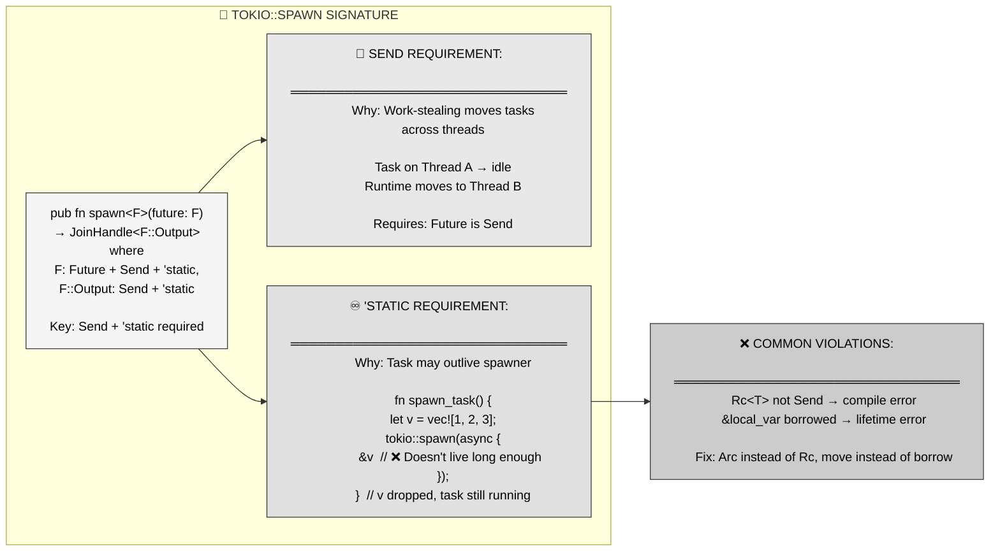

**Critical**: `Send` bound = work-stealing safe. `'static` bound = no dangling references. Same rationale as `std::thread::spawn`.

---

### 4.3 Work-Stealing Scheduler

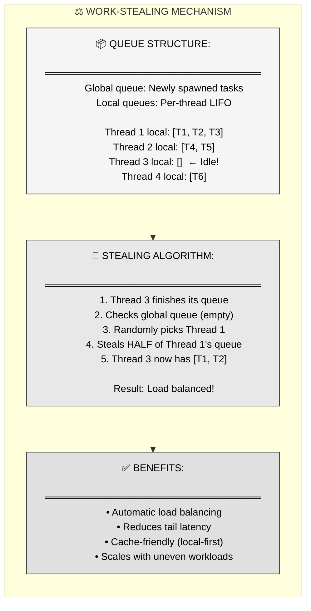

**Performance**: Work-stealing prevents thread starvation. One slow task doesn't bottleneck the entire system—other threads steal work and keep going.

---

## Part 5: Blocking Operations Pattern

### 5.1 The Blocking Problem

```mermaid
flowchart TD
    subgraph BLOCKING["🚨 BLOCKING RUNTIME THREADS"]
        direction TB
        
        CODE["async fn handle_request() {
        let file = std::fs::read(\"big_file\");  // ❌ BLOCKS!
        // Synchronous I/O: 10ms
        // Thread stuck, can't poll other tasks
        }
        
        Runtime with 4 threads, 10k tasks:
        1 blocking task = 25% capacity loss"]
        
        CASCADE["🔥 CASCADE FAILURE:
        ═══════════════════════════════
        Thread 1: Blocked on file read
        Thread 2: Blocked on DB query
        Thread 3: Blocked on sleep(10s)
        Thread 4: Blocked on HTTP call
        
        Result: 10,000 tasks frozen!
        Latency: p99 explodes to seconds"]
        
        PREEMPT["⚠️ NO PREEMPTION:
        ═══════════════════════════════
        OS threads: Can preempt
        Async tasks: Cooperative only
        
        Blocked task never yields
        Runtime can't schedule others
        Deadlock risk on single-thread"]
        
        CODE --> CASCADE
        CASCADE --> PREEMPT
    end
    
    style CODE fill:#f5f5f5,stroke:#333,color:#000
    style CASCADE fill:#e0e0e0,stroke:#333,color:#000
    style PREEMPT fill:#cccccc,stroke:#333,color:#000
```

**Rule of thumb**: Tasks should yield every <100μs. File I/O (1-10ms), DB queries (10-100ms), HTTP calls (50-500ms) all violate this.

---

### 5.2 spawn_blocking Solution

```mermaid
flowchart LR
    subgraph SOLUTION["✅ SPAWN_BLOCKING PATTERN"]
        direction LR
        
        SEPARATE["🔨 BLOCKING POOL:
        ═══════════════════════════════
        tokio::task::spawn_blocking(|| {
        std::fs::read(\"file\")
        }).await?
        
        Spawns on separate thread pool
        Doesn't block runtime threads"]
        
        RUNTIME["🔧 RUNTIME THREADS:
        ═══════════════════════════════
        Thread 1: Task A (polls)
        Thread 2: Task B (polls)
        Thread 3: Task C (polls)
        Thread 4: Task D (polls)
        
        All available for async work!"]
        
        BLOCKING_POOL["🔨 BLOCKING POOL THREADS:
        ═══════════════════════════════
        Pool Thread 1: File I/O (10ms)
        Pool Thread 2: Idle
        Pool Thread 3: Idle
        
        Spawned on-demand, long-lived"]
        
        SEPARATE --> RUNTIME
        SEPARATE --> BLOCKING_POOL
    end
    
    PATTERN["📋 USAGE PATTERN:
    ════════════════════════════════
    let handle = task::spawn_blocking(expensive_cpu_work);
    // Do other async work
    let result = handle.await?;
    
    Cost: Thread spawn amortized (pool)"]
    
    BLOCKING_POOL --> PATTERN
    
    style SEPARATE fill:#f5f5f5,stroke:#333,color:#000
    style RUNTIME fill:#e8e8e8,stroke:#333,color:#000
    style BLOCKING_POOL fill:#e0e0e0,stroke:#333,color:#000
    style PATTERN fill:#cccccc,stroke:#333,color:#000
```

**Key benefit**: Runtime threads stay responsive. Blocking pool threads can block for seconds without affecting async task scheduling.

---

## Part 6: Real-World Patterns

### 6.1 Web Server with Tokio

```mermaid
flowchart TD
    subgraph WEBSERVER["🌐 WEB SERVER ARCHITECTURE"]
        direction TB
        
        SETUP["use tokio::net::TcpListener;
        
        #[tokio::main]
        async fn main() {
        let listener = TcpListener::bind(\"0.0.0.0:8080\").await?;
        
        loop {
            let (socket, _) = listener.accept().await?;
            tokio::spawn(handle_connection(socket));
        }
        }"]
        
        CONCURRENCY["⚡ CONCURRENCY MODEL:
        ═══════════════════════════════
        • 10k concurrent connections
        • 4 worker threads (cores)
        • Each connection = lightweight task
        • Reactor monitors all sockets
        • I/O-bound: scales to millions"]
        
        HANDLER["async fn handle_connection(socket) {
        let req = read_request(&socket).await;  // Yields
        let data = query_db(&req).await;  // Yields
        write_response(&socket, data).await;  // Yields
        }
        
        Each await = yield point
        Thread free for other connections"]
        
        SETUP --> CONCURRENCY
        CONCURRENCY --> HANDLER
    end
    
    style SETUP fill:#f5f5f5,stroke:#333,color:#000
    style CONCURRENCY fill:#e8e8e8,stroke:#333,color:#000
    style HANDLER fill:#e0e0e0,stroke:#333,color:#000
```

**Scalability**: 10k connections on 4 threads. Each `await` (network I/O) yields, allowing threads to handle other connections. Reactor wakes tasks when their socket has data.

---

### 6.2 Mixed CPU and I/O Workload

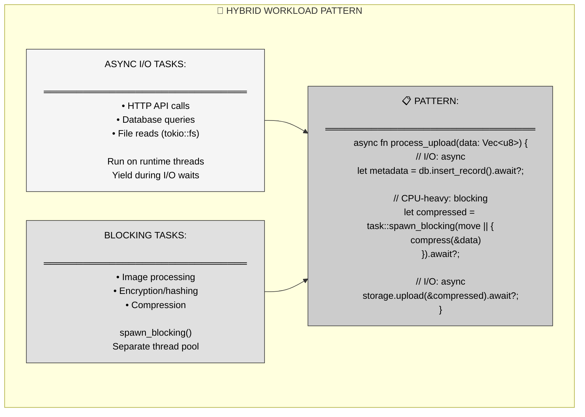

**Best practice**: Async for I/O-bound, `spawn_blocking` for CPU-bound. Keep them separated for optimal performance.

---

### 6.3 Graceful Shutdown

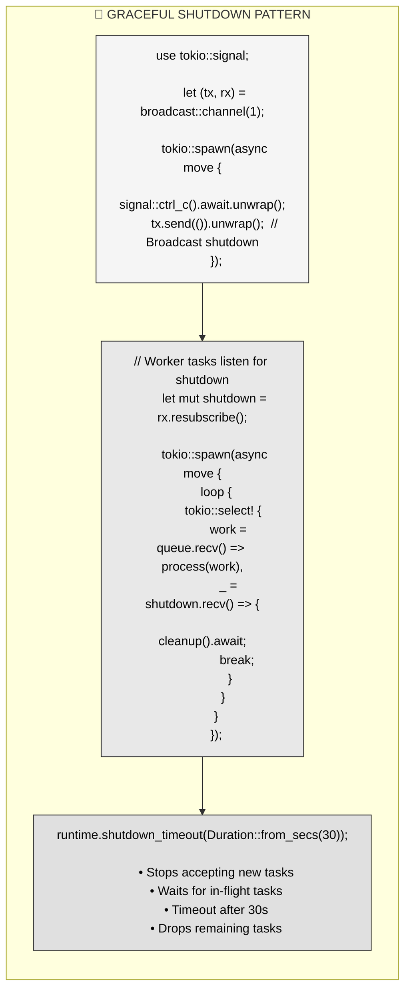

**Production pattern**: Catch SIGINT, broadcast shutdown signal via channel, give tasks time to clean up, enforce timeout.

---

## Part 7: Performance Characteristics

### 7.1 Task Spawn Overhead

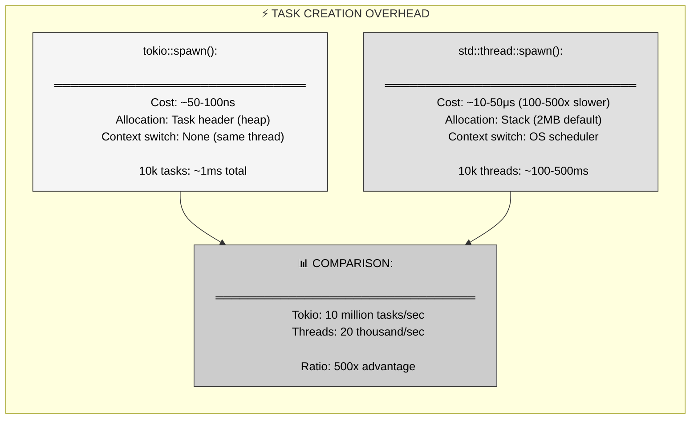

**Benchmark**: Spawning 100k echo server connections—Tokio: 10ms, threads: 5000ms (500x difference).

---

### 7.2 Context Switch Cost

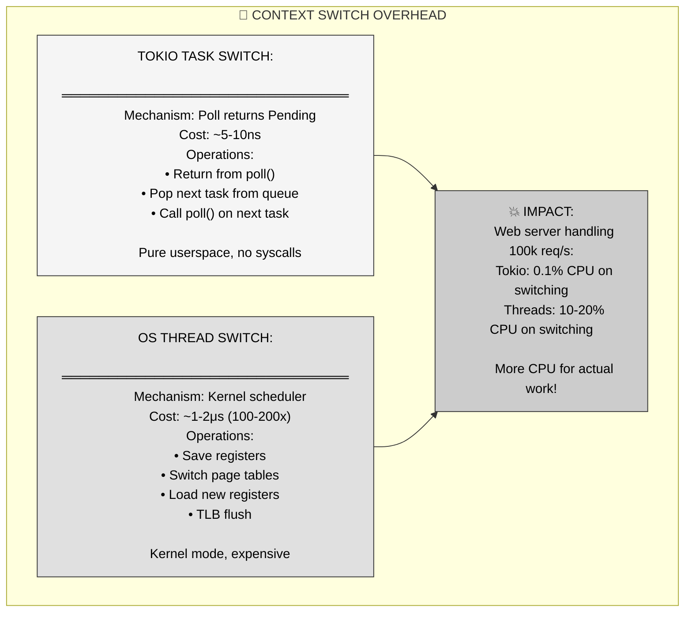

**Real-world**: HTTP proxy forwarding requests—Tokio achieves 2x higher throughput than thread-per-request because context switching is negligible.

---

## Part 8: Best Practices and Gotchas

### 8.1 Common Runtime Pitfalls

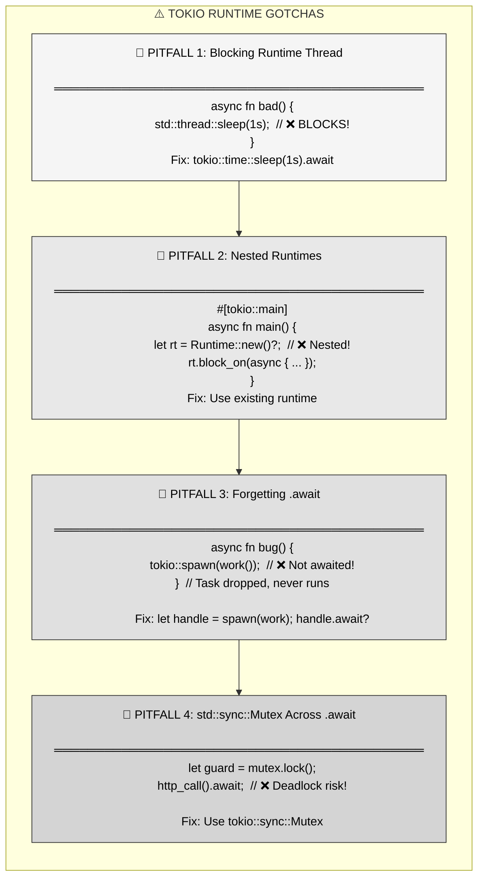

---

### 8.2 Safe Async Patterns

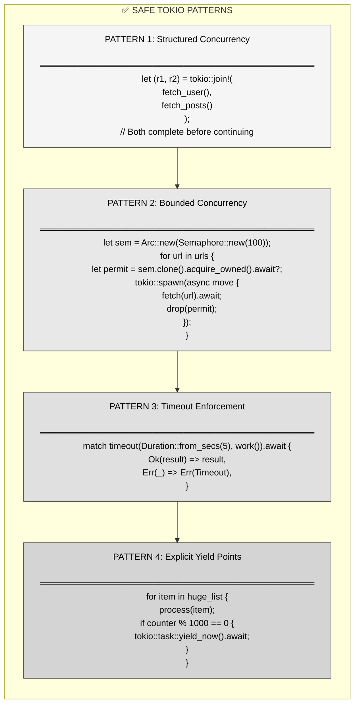

---

## Part 9: Key Takeaways and Cross-Language Comparison

### 9.1 Core Principles Summary

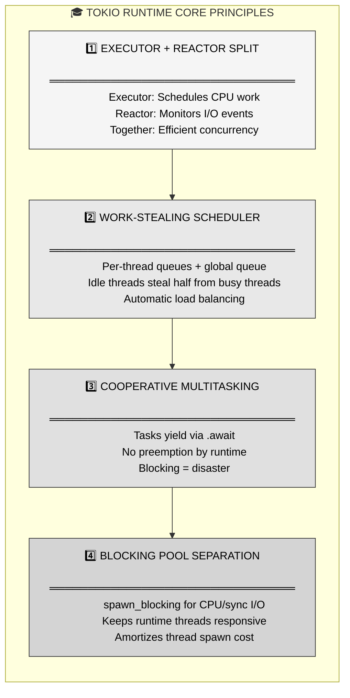

---

### 9.2 Cross-Language Comparison

| Language | Async Runtime | Work-Stealing | Limitations |
|----------|--------------|---------------|-------------|
| **Rust (Tokio)** | Executor + reactor | ✅ Per-thread queues | Must handle blocking manually |
| **Go** | Goroutine scheduler | ✅ M:N scheduler | ⚠️ Hidden runtime, less control |
| **Node.js** | Event loop (libuv) | ❌ Single-threaded | No parallelism (unless worker threads) |
| **Python (asyncio)** | Event loop | ❌ Single-threaded | GIL prevents parallelism |
| **Java (Virtual Threads)** | ForkJoinPool | ✅ Work-stealing | ⚠️ Heavier weight than Tokio tasks |
| **C# (async/await)** | ThreadPool | ✅ Work-stealing | ⚠️ OS threads, not green threads |

**Rust's advantage**: Explicit async (no hidden runtime), zero-cost futures (no boxing), compile-time Send checking prevents data races.

---

## Part 10: Summary - The Async Execution Engine

**Tokio runtime transforms inert futures into scalable concurrent execution through a work-stealing executor and I/O reactor architecture.**

**Three key mechanisms:**
1. **Executor** → Work-stealing scheduler manages task queues across worker threads
2. **Reactor** → I/O monitor (epoll/kqueue) wakes tasks when events arrive
3. **Blocking pool** → Separate threads for CPU-heavy/sync I/O work

**MCU metaphor recap**: S.H.I.E.L.D. operations center—Maria Hill (executor) assigns missions to field agents (worker threads), Nick Fury (reactor) monitors satellite intel (I/O events), Clint Barton's team (blocking pool) handles special ops. Work-stealing ensures balanced workload, reactor enables efficient I/O waits.

**When to use multi-threaded**: Production servers, CPU parallelism needed, high throughput.

**When to use current-thread**: Tests, embedded systems, deterministic execution.

**Critical rules**:
- Tasks must yield every <100μs
- Use `spawn_blocking` for sync I/O or CPU-heavy work
- Use `tokio::sync` primitives, not `std::sync`, across `.await`
- Always `.await` spawned tasks to ensure completion

**The promise**: Write highly concurrent code (10k+ connections on 4 threads) with explicit control, compile-time safety, and zero-cost abstractions.

---

## References

**Primary source**: Mainmatter's "100 Exercises To Learn Rust" - Section 8 (Futures), Chapter 3 (Runtime), Chapter 5 (Blocking)

**Key concepts covered**:
- Problem: Futures need executor to poll them
- Runtime flavors: Multi-threaded vs current-thread
- Work-stealing: Automatic load balancing across threads
- Send + 'static bounds: Required for spawn() due to work-stealing
- Blocking operations: Cooperative multitasking requires explicit yields
- spawn_blocking: Separate thread pool for CPU/sync I/O work

**Related Tokio documentation**:
- `tokio::runtime::Builder` - runtime configuration
- `tokio::spawn` - task spawning with Send bounds
- `tokio::task::spawn_blocking` - blocking operations
- `tokio::sync` - async-aware synchronization primitives

**Further reading**:
- "Asynchronous Programming in Rust" book
- Alice Ryhl's blog: "What is blocking?"
- Tokio documentation on runtime architecture
