# R71: Rust Async-Aware Primitives - Deadlock-Free Concurrency

## Part 1: The Problem - std::sync Deadlocks in Async

### 1.1 The Yield Point Deadlock

**Holding std::sync::Mutex across .await creates deadlocks because async tasks are cooperatively scheduled—when a task yields while holding a lock, other tasks waiting for that lock cannot be scheduled, causing permanent starvation.**

The async/sync collision:

```mermaid
flowchart TD
    subgraph DEADLOCK["💀 STD::SYNC::MUTEX DEADLOCK"]
        direction TB
        
        CODE["async fn dangerous() {
        let guard = std_mutex.lock().unwrap();
        http_call(&guard).await;  // ❌ DEADLOCK!
        println!(\"{:?}\", guard);
        }
        
        Single-threaded runtime:
        Task A acquires lock, yields at .await
        Task B tries to acquire lock, blocks forever"]
        
        TIMELINE["📊 DEADLOCK TIMELINE:
        ═══════════════════════════════
        Task A          Task B
        |
        Acquire lock
        Start http_call
        Yields to runtime
        |
        +--------------+
                       |
            Try acquire lock
            ❌ BLOCKED (no yield!)
            Holds CPU forever
                       |
        Task A never scheduled again
        💀 PERMANENT DEADLOCK"]
        
        REASON["⚠️ ROOT CAUSE:
        ═══════════════════════════════
        std::sync::Mutex::lock() blocks thread
        • No .await = no yield to runtime
        • Task B holds CPU, can't progress
        • Runtime can't preempt Task B
        • Task A never runs again
        
        Cooperative scheduling breaks!"]
        
        CODE --> TIMELINE
        TIMELINE --> REASON
    end
    
    MULTITHREAD["⚠️ MULTITHREADED DOESN'T FIX IT:
    ════════════════════════════════
    4-thread runtime needs 5 concurrent tasks
    All 4 threads blocked on mutex = deadlock
    
    Liveness risk remains!"]
    
    REASON --> MULTITHREAD
    
    style CODE fill:#f5f5f5,stroke:#333,color:#000
    style TIMELINE fill:#e0e0e0,stroke:#333,color:#000
    style REASON fill:#d9d9d9,stroke:#333,color:#000
    style MULTITHREAD fill:#cccccc,stroke:#333,color:#000
```

**The pain**: `std::sync::Mutex` blocks the thread—no yielding, no scheduling. In async contexts, this creates deadlocks even with seemingly simple code. The runtime cannot preempt tasks, so blocked tasks halt all progress.

---

### 1.2 The Performance vs Safety Tradeoff

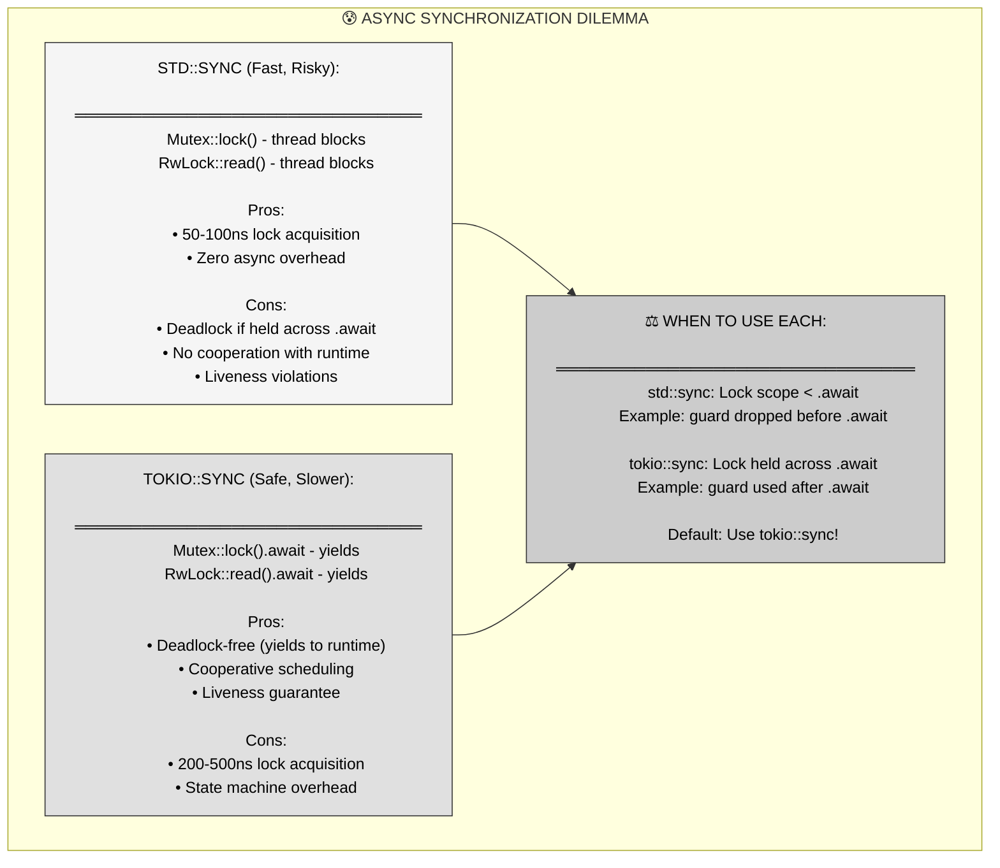

**Critical insight**: `std::sync` is 2-5x faster but unsafe across `.await`. `tokio::sync` is slightly slower but guarantees deadlock-free async code. The 300ns difference rarely matters compared to I/O wait times (ms).

---

## Part 2: The Solution - Tokio Async-Aware Primitives

### 2.1 tokio::sync::Mutex - Cooperative Locking

**tokio::sync::Mutex replaces blocking lock acquisition with async yielding—lock().await returns control to the runtime when the lock is contended, enabling deadlock-free concurrent access.**

```mermaid
flowchart TD
    subgraph TOKIO_MUTEX["✅ TOKIO::SYNC::MUTEX SOLUTION"]
        direction TB
        
        CODE["use tokio::sync::Mutex;
        
        async fn safe() {
        let guard = tokio_mutex.lock().await;  // ✅ YIELDS!
        http_call(&guard).await;
        println!(\"{:?}\", guard);
        }
        
        Single-threaded runtime:
        Task A acquires lock, yields at http .await
        Task B tries lock, YIELDS to runtime (not blocks)
        Runtime schedules Task A, completes, releases lock
        Task B acquires lock"]
        
        TIMELINE["📊 SAFE TIMELINE:
        ═══════════════════════════════
        Task A          Task B
        |
        Acquire lock
        Start http_call
        Yields to runtime
        |
        +--------------+
                       |
            Try acquire lock
            ✅ YIELDS to runtime
                       |
        +--------------+
        |
        http_call completes
        Release lock
        Yield to runtime
        |
        +--------------+
                       |
            Acquire lock
            Continue work
        
        ✅ NO DEADLOCK!"]
        
        MECHANISM["⚙️ HOW IT WORKS:
        ═══════════════════════════════
        lock() returns Future<MutexGuard>
        .await polls the future
        
        If locked:
        • Registers waker with mutex
        • Returns Poll::Pending
        • Runtime schedules other tasks
        
        When unlocked:
        • Mutex wakes waiting task
        • Runtime polls again
        • Returns Poll::Ready(guard)"]
        
        CODE --> TIMELINE
        TIMELINE --> MECHANISM
    end
    
    style CODE fill:#f5f5f5,stroke:#333,color:#000
    style TIMELINE fill:#e8e8e8,stroke:#333,color:#000
    style MECHANISM fill:#e0e0e0,stroke:#333,color:#000
```

**Key mechanism**: `lock().await` is a yield point. If the lock is held, the task registers a waker and yields. When the lock is released, the waker notifies the runtime to reschedule the waiting task.

---

### 2.2 Other Async-Aware Primitives

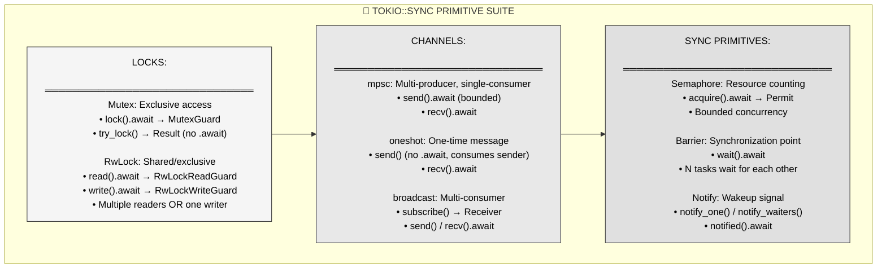

**Comprehensive suite**: Tokio provides async versions of all std::sync primitives plus additional utilities (Notify, oneshot, broadcast) designed specifically for async patterns.

---

## Part 3: Mental Model - Sanctum Sanctorum Library

### 3.1 The MCU Metaphor

**The Sanctum Sanctorum's mystical library—where Ancient One manages access to forbidden texts with time-manipulation (yielding) instead of physical locks—mirrors tokio::sync's cooperative scheduling approach.**

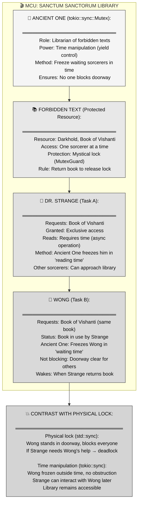

---

### 3.2 MCU-to-Rust Mapping Table

| MCU Concept | Tokio Async Primitives | Enforced Invariant |
|-------------|------------------------|-------------------|
| **Ancient One** | tokio::sync::Mutex | Manages access to protected resources via async yields |
| **Forbidden text (Darkhold)** | Protected data `T` inside Mutex<T> | Only one guard can access at a time |
| **Mystical lock** | MutexGuard<'_, T> | RAII lock guard, dropped to release |
| **Time manipulation (freeze)** | `.await` yield point | Task suspended, returns control to runtime |
| **Dr. Strange reading** | Task A holding lock across .await | Guard held during async operation (safe!) |
| **Wong waiting** | Task B calling `lock().await` | Task yields (Pending), registers waker |
| **Wong frozen in time** | Task B in ready queue, not scheduled | Not consuming CPU, runtime free to schedule others |
| **Strange returns book** | `drop(guard)` or guard goes out of scope | Mutex unlocked, wakes waiting task |
| **Wong unfrozen** | Waker notifies runtime, Task B scheduled | lock() future returns Ready(guard) |
| **Doorway stays clear** | No thread blocking, runtime responsive | Other tasks can run while Task B waits |
| **Reading room (RwLock)** | tokio::sync::RwLock | Multiple readers OR one writer |

**Narrative**: The Sanctum Sanctorum library holds dangerous forbidden texts (shared resources). When Dr. Strange (Task A) requests the Book of Vishanti, the Ancient One (tokio::sync::Mutex) grants exclusive access via a mystical lock (MutexGuard). Strange then studies the book, which takes time (async operation like http_call().await). Instead of physically occupying the library and blocking others, the Ancient One uses time manipulation to freeze Strange in a "reading time bubble" (yield point)—he's suspended but not blocking the doorway.

When Wong (Task B) arrives and requests the same book, he finds it in use. A physical lock (std::sync::Mutex) would force Wong to stand in the doorway, preventing anyone from entering or leaving—a deadlock if Strange needed Wong's help. But the Ancient One instead freezes Wong in "waiting time" outside the normal flow (registers waker, returns Pending). The doorway remains clear (runtime can schedule other tasks). When Strange finishes reading and returns the book (drops guard), the Ancient One unfreezes Wong (wakes the task), who then receives the book. No blocking, no deadlocks—pure cooperative time-sharing.

---

## Part 4: Anatomy of tokio::sync

### 4.1 Mutex API and Usage

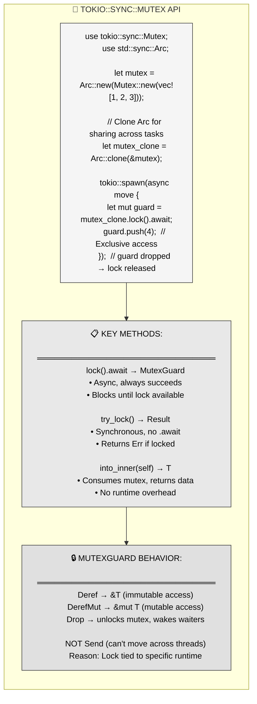

**Critical detail**: `MutexGuard` is NOT `Send`. You cannot move it across tasks. This prevents lock leaks across runtime boundaries but means you must acquire and release within the same task.

---

### 4.2 RwLock - Concurrent Reads

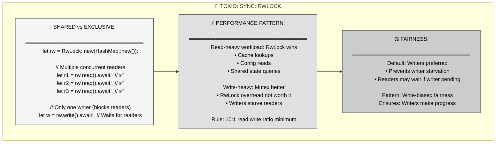

**When to use**: RwLock for read-heavy workloads (>10:1 read:write ratio). Otherwise, Mutex is simpler and often faster due to lower overhead.

---

### 4.3 Semaphore - Bounded Concurrency

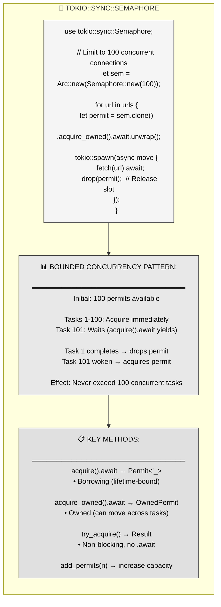

**Use case**: Limit concurrent connections to a database (e.g. max 50), API rate limiting (max 100 req/s), resource pools (thread pool size).

---

## Part 5: Cancellation Patterns

### 5.1 The Cancellation Problem

```mermaid
flowchart TD
    subgraph CANCEL["🛑 ASYNC CANCELLATION MECHANICS"]
        direction TB
        
        PROBLEM["use tokio::time::timeout;
        
        async fn http_call() {
        let stream = TcpStream::connect(...).await?;
        stream.write_all(&request).await?;
        stream.read(&mut buffer).await?;
        }
        
        async fn run() {
        if let Err(_) = timeout(10ms, http_call()).await {
            println!(\"Timeout!\");
        }
        }
        
        What happens? http_call dropped mid-execution"]
        
        YIELD_POINTS["⚠️ CANCELLATION POINTS:
        ═══════════════════════════════
        Every .await is a cancellation point
        
        Timeline:
        1. connect().await → succeeds
        2. write_all().await → partial write
        3. Timeout expires → future dropped
        4. read() never happens
        
        Result: Partial request sent, connection leaked"]
        
        COOPERATIVE["🤝 COOPERATIVE NATURE:
        ═══════════════════════════════
        Runtime cannot preempt tasks
        • No async \"interrupts\"
        • Task only cancellable at .await
        
        Between .await points:
        • Task runs to completion
        • No cancellation possible
        
        Granularity: Determined by .await spacing"]
        
        PROBLEM --> YIELD_POINTS
        YIELD_POINTS --> COOPERATIVE
    end
    
    style PROBLEM fill:#f5f5f5,stroke:#333,color:#000
    style YIELD_POINTS fill:#e0e0e0,stroke:#333,color:#000
    style COOPERATIVE fill:#cccccc,stroke:#333,color:#000
```

**Critical**: Cancellation is **implicit** (dropping future) and **cooperative** (only at .await). This makes it powerful (caller controls cancellation) but dangerous (resources may leak).

---

### 5.2 Graceful Cancellation with Drop

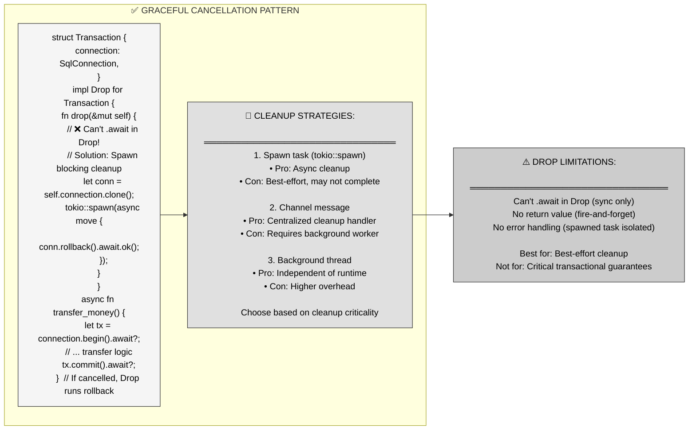

**Key limitation**: `Drop` is synchronous—you cannot `.await` inside it. Spawn a new task for async cleanup, but understand it's best-effort.

---

### 5.3 Explicit Cancellation with JoinHandle

```mermaid
flowchart TD
    subgraph EXPLICIT["🎯 EXPLICIT CANCELLATION"]
        direction TB
        
        ABORT["async fn run() {
        let handle = tokio::spawn(long_running_task());
        
        // ... some condition
        if should_cancel {
            handle.abort();  // Explicit cancellation
        }
        
        match handle.await {
            Ok(result) =&gt; println!(\"Completed: {:?}\", result),
            Err(e) if e.is_cancelled() =&gt; println!(\"Cancelled\"),
            Err(e) =&gt; println!(\"Panicked: {:?}\", e),
        }
        }"]
        
        TOKEN["📡 CANCELLATION TOKEN:
        ═══════════════════════════════
        use tokio_util::sync::CancellationToken;
        
        let token = CancellationToken::new();
        let token_clone = token.clone();
        
        tokio::spawn(async move {
        loop {
            tokio::select! {
                _ = token_clone.cancelled() =&gt; break,
                work = do_work() =&gt; process(work),
            }
        }
        });
        
        // Trigger cancellation from anywhere
        token.cancel();"]
        
        COMPARISON["⚖️ JOINHANDLE VS TOKEN:
        ════════════════════════════════
        JoinHandle::abort():
        • Immediate cancellation
        • No cooperation needed
        • Forceful shutdown
        
        CancellationToken:
        • Cooperative cancellation
        • Task checks token periodically
        • Graceful shutdown possible
        
        Prefer: Token for graceful, abort for forceful"]
        
        ABORT --> TOKEN
        TOKEN --> COMPARISON
    end
    
    style ABORT fill:#f5f5f5,stroke:#333,color:#000
    style TOKEN fill:#e8e8e8,stroke:#333,color:#000
    style COMPARISON fill:#e0e0e0,stroke:#333,color:#000
```

**Best practice**: Use `CancellationToken` for graceful shutdown (task checks periodically), `JoinHandle::abort()` for immediate forceful termination.

---

## Part 6: Real-World Patterns

### 6.1 Async Cache with RwLock

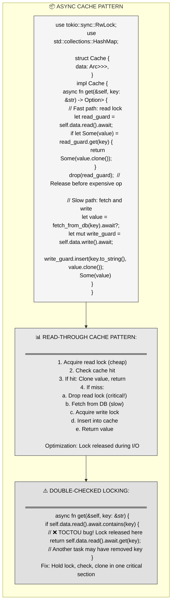

**Performance tip**: Always drop read lock before expensive I/O. Never hold locks across `.await` unless the operation is fast (<100μs).

---

### 6.2 Graceful Shutdown with Broadcast

```mermaid
flowchart LR
    subgraph SHUTDOWN["🛑 GRACEFUL SHUTDOWN PATTERN"]
        direction LR
        
        SETUP["use tokio::sync::broadcast;
        use tokio::signal;
        
        let (shutdown_tx, _) = broadcast::channel(1);
        
        // Shutdown signal handler
        let tx = shutdown_tx.clone();
        tokio::spawn(async move {
        signal::ctrl_c().await.unwrap();
        tx.send(()).unwrap();
        });"]
        
        WORKER["// Worker tasks
        let mut shutdown_rx = shutdown_tx.subscribe();
        
        tokio::spawn(async move {
        loop {
            tokio::select! {
                msg = queue.recv() =&gt; {
                    process(msg).await;
                }
                _ = shutdown_rx.recv() =&gt; {
                    cleanup().await;
                    break;
                }
            }
        }
        println!(\"Worker shutdown complete\");
        });"]
        
        SETUP --> COORDINATION["📡 COORDINATION:
        ════════════════════════════════
        broadcast::channel: 1-to-N signaling
        • Each worker subscribes
        • Ctrl-C triggers broadcast
        • All workers receive signal
        • Cleanup before exit
        
        Graceful: Wait for in-flight work"]
        
        WORKER --> COORDINATION
    end
    
    style SETUP fill:#f5f5f5,stroke:#333,color:#000
    style WORKER fill:#e0e0e0,stroke:#333,color:#000
    style COORDINATION fill:#cccccc,stroke:#333,color:#000
```

**Production pattern**: Use `broadcast` channel for shutdown signals, `select!` to race work vs shutdown, enforce timeout with `shutdown_timeout()`.

---

### 6.3 Rate Limiting with Semaphore

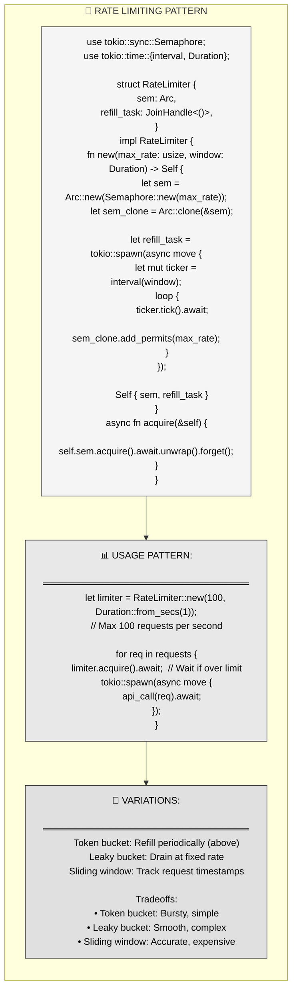

**Production use**: API rate limiting, connection pool management, request throttling to protect downstream services.

---

## Part 7: Best Practices and Gotchas

### 7.1 Common Pitfalls

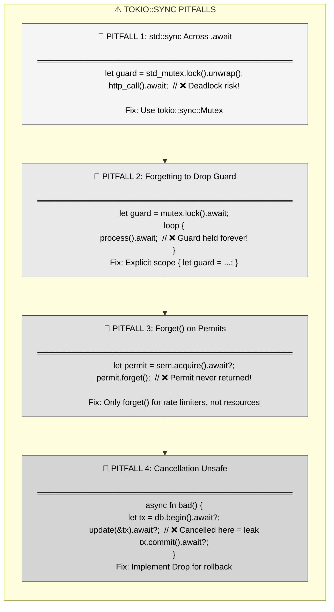

---

### 7.2 Safe Patterns

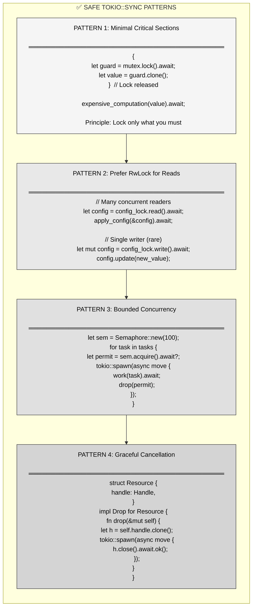

---

## Part 8: Key Takeaways and Cross-Language Comparison

### 8.1 Core Principles Summary

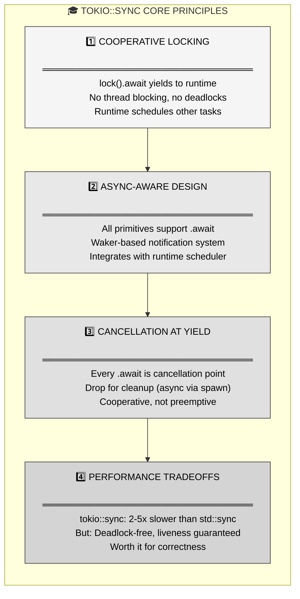

---

### 8.2 Cross-Language Comparison

| Language | Async Sync Primitives | Cancellation | Limitations |
|----------|----------------------|--------------|-------------|
| **Rust (Tokio)** | Explicit (tokio::sync) | Drop-based, cooperative | ⚠️ No .await in Drop, best-effort cleanup |
| **Go** | Standard sync works | context.Context | ✅ Goroutines preemptible, easier cleanup |
| **C# (async/await)** | No special async locks | CancellationToken | ✅ Finalizers for cleanup, but GC overhead |
| **Python (asyncio)** | asyncio.Lock | Task.cancel() | ⚠️ GIL prevents true parallelism |
| **JavaScript (Node.js)** | No locks (single-threaded) | AbortController | ❌ No parallelism without workers |
| **Java (Virtual Threads)** | Standard locks work | Thread.interrupt() | ✅ Preemptive, but heavier weight |

**Rust's distinction**: Explicit async-aware primitives prevent deadlocks at compile time (std::sync guard not Send across .await), but cleanup requires manual Drop implementations.

---

## Part 9: Summary - Deadlock-Free Async Concurrency

**Tokio's async-aware primitives replace blocking synchronization with cooperative yielding, eliminating deadlocks at the cost of slight performance overhead.**

**Three key mechanisms:**
1. **tokio::sync::Mutex** → `.await` yields when contended, runtime schedules other tasks
2. **Semaphore** → Bounded concurrency with automatic permit management
3. **Cancellation** → Every `.await` is a cancellation point, Drop for cleanup

**MCU metaphor recap**: Sanctum Sanctorum library—Ancient One (tokio::sync::Mutex) uses time manipulation (yielding) to freeze waiting sorcerers outside normal time flow, keeping the library accessible. Physical locks (std::sync) block doorways and cause deadlocks; mystical locks (tokio::sync) suspend tasks without obstruction.

**When to use std::sync**: Lock scope ends before any `.await`, performance-critical (<100ns matters), zero contention guaranteed.

**When to use tokio::sync**: Lock held across `.await`, any contention risk, production code (safety > speed).

**Critical rules**:
- Never hold `std::sync::Mutex` across `.await`
- Drop locks before expensive operations
- Use `CancellationToken` for graceful shutdown
- Implement `Drop` for cleanup, spawn async work

**The promise**: Write async code with safe concurrent access patterns, deadlock-free guarantees, and explicit cancellation boundaries.

---

## References

**Primary source**: Mainmatter's "100 Exercises To Learn Rust" - Section 8 (Futures), Chapter 6 (Async-Aware Primitives), Chapter 7 (Cancellation)

**Key concepts covered**:
- Problem: std::sync::Mutex deadlocks in async contexts
- Solution: tokio::sync primitives yield to runtime when contended
- Mutex, RwLock, Semaphore async APIs
- Cancellation mechanics: cooperative, .await as cancellation point
- Graceful cancellation with Drop (spawning cleanup tasks)
- JoinHandle::abort vs CancellationToken

**Related Tokio documentation**:
- `tokio::sync::Mutex` - async mutex with .await
- `tokio::sync::RwLock` - async reader-writer lock
- `tokio::sync::Semaphore` - bounded concurrency
- `tokio::sync::broadcast` - multi-consumer channel
- `tokio_util::sync::CancellationToken` - cooperative cancellation

**Further reading**:
- Alice Ryhl's blog: "Shared mutable state in async Rust"
- Tokio tutorial: "Select" and cancellation safety
- "Asynchronous Programming in Rust" book - Chapter on cancellation
