# R72: Rust Bounded Channels - Backpressure and Request-Response

## Part 1: The Problem - Unbounded Growth and One-Way Communication

### 1.1 The Memory Explosion Problem

**Unbounded channels allow producers to enqueue messages faster than consumers can process them, leading to unbounded memory growth and eventual out-of-memory crashes—production systems must enforce capacity limits.**

The unbounded channel disaster:

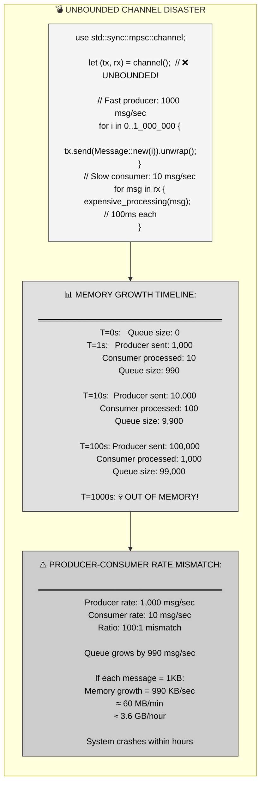

**The pain**: Unbounded channels hide capacity issues during development (low load) but fail catastrophically in production (high load). There's no backpressure—fast producers overwhelm slow consumers.

---

### 1.2 The One-Way Communication Problem

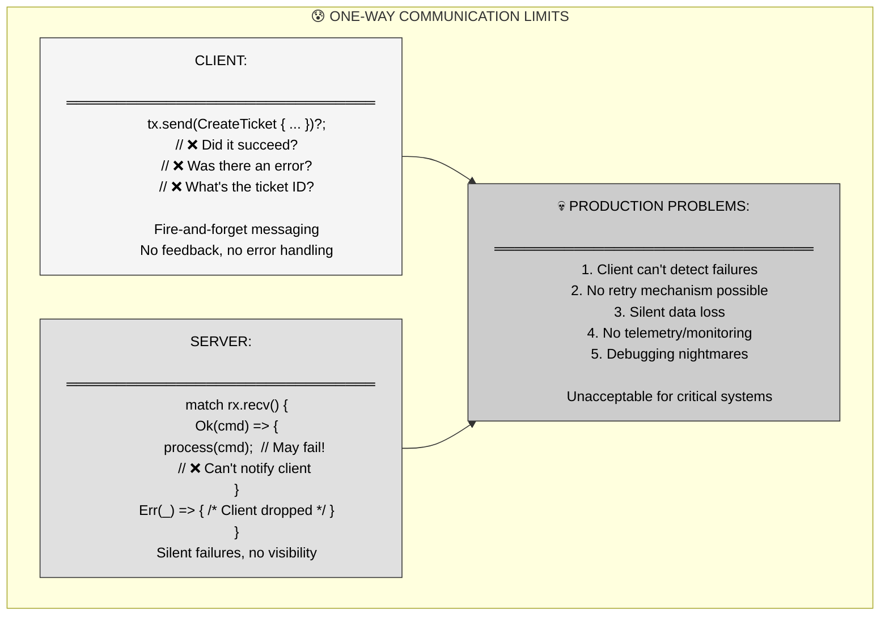

**Critical insight**: One-way channels are fire-and-forget. Clients have no visibility into success/failure, making error handling, retries, and monitoring impossible.

---

## Part 2: The Solution - Bounded Channels with Request-Response

### 2.1 Bounded Channels - Enforced Capacity Limits

**sync_channel(capacity) creates bounded channels that block producers when full, enforcing backpressure and preventing unbounded memory growth—essential for production systems.**

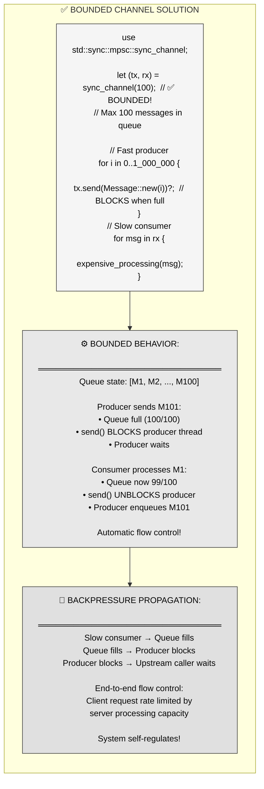

**Key mechanism**: `send()` blocks when the channel is full. This blocking propagates upstream, naturally rate-limiting producers to match consumer capacity.

---

### 2.2 Request-Response Pattern - Two-Way Communication

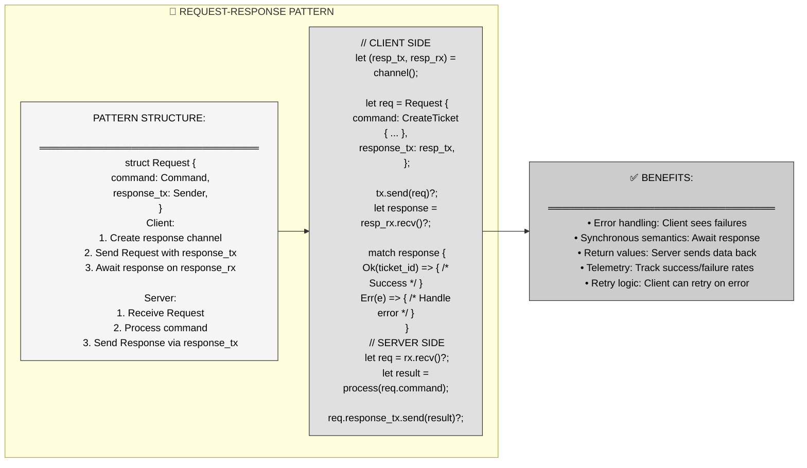

**Pattern essence**: Embed a response channel in each request. Server uses it to send results back. Client blocks on response, achieving synchronous request-response over async channels.

---

## Part 3: Mental Model - S.H.I.E.L.D. Command Center

### 3.1 The MCU Metaphor

**S.H.I.E.L.D.'s command center with a limited mission briefing room (bounded capacity) and mandatory mission reports (acknowledgments)—mirrors bounded channels with request-response patterns.**

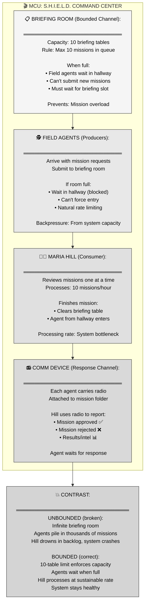

---

### 3.2 MCU-to-Rust Mapping Table

| MCU Concept | Bounded Channels | Enforced Invariant |
|-------------|------------------|-------------------|
| **Briefing room** | `sync_channel(10)` | Bounded capacity prevents unbounded growth |
| **10 briefing tables** | Channel capacity (10 messages) | Hard limit on in-flight messages |
| **Field agents** | Producer threads (Sender) | Send messages via `send()` |
| **Mission folder** | Message (struct/enum) | Data sent through channel |
| **Agent waits in hallway** | `send()` blocks when full | Backpressure propagates to producer |
| **Briefing table clears** | Consumer calls `recv()` | Frees slot in channel |
| **Agent enters from hallway** | Blocked `send()` completes | Producer unblocks, message enqueued |
| **Maria Hill** | Consumer thread (Receiver) | Single consumer processes messages |
| **Processing rate** | Consumer throughput | Bottleneck that determines system capacity |
| **Comm device (radio)** | `Sender<Response>` in request | Response channel for acknowledgment |
| **Agent waits for radio call** | `resp_rx.recv()` blocks | Client awaits server response |
| **Hill reports via radio** | `resp_tx.send(result)` | Server sends result back |

**Narrative**: S.H.I.E.L.D.'s command center has a briefing room with exactly 10 tables (bounded channel capacity). Field agents (producers) arrive with mission requests and place folders on tables. When all 10 tables are occupied, arriving agents must wait in the hallway (blocked send)—they cannot force their missions through. Maria Hill (consumer) reviews missions one at a time, taking about 6 minutes each (consumer throughput). When she finishes a mission and clears a table, an agent waiting in the hallway can enter and place their mission (send unblocks).

This bounded system prevents mission overload. If agents could pile unlimited missions (unbounded channel), Hill would be buried under thousands of folders, the system would collapse, and critical missions would be lost. The 10-table limit enforces natural backpressure—agents arriving faster than Hill can process must wait, automatically rate-limiting the system to Hill's processing capacity.

Additionally, each agent carries a comm device (response channel) attached to their mission folder. After Hill processes a mission, she radios the agent (sends response) with approval/rejection/results. The agent waits by their radio (blocks on recv) until they hear back. This two-way communication ensures agents know whether their missions succeeded and can retry if needed—no more fire-and-forget uncertainty.

---

## Part 4: Anatomy of Bounded Channels

### 4.1 sync_channel API

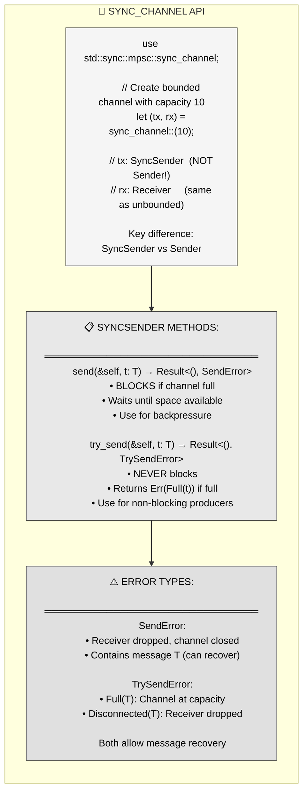

**Critical**: `sync_channel` returns `SyncSender`, not `Sender`. Only `SyncSender` supports `send()` blocking. Both are cloneable for multiple producers.

---

### 4.2 Blocking vs Non-Blocking Send

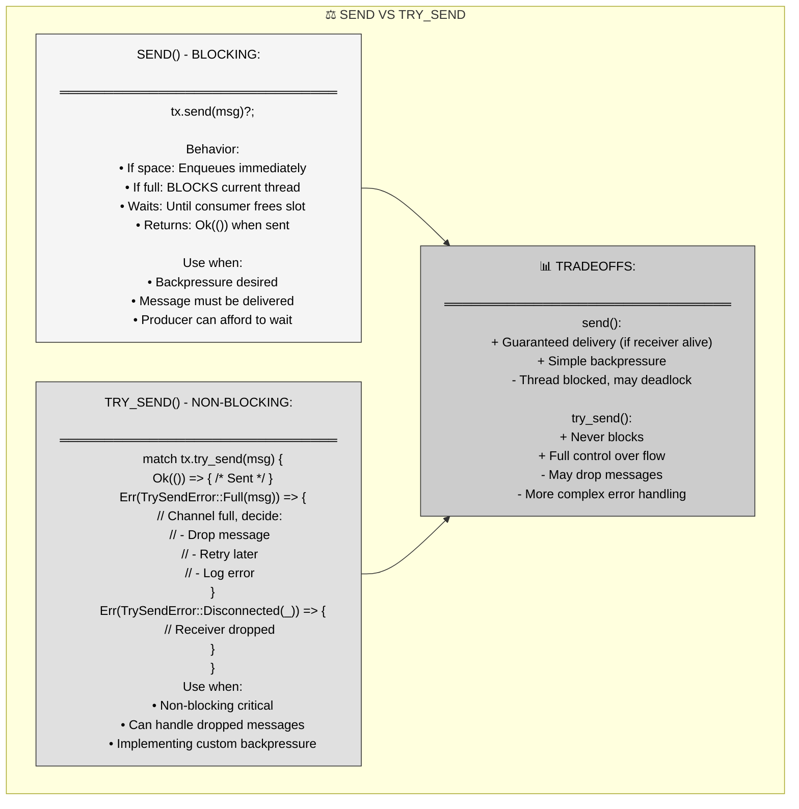

**When to use**: `send()` for most cases (simple backpressure). `try_send()` when blocking is unacceptable (e.g., real-time systems, UI threads).

---

### 4.3 Capacity Selection

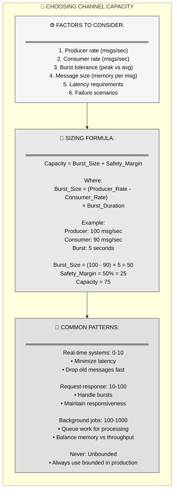

**Rule of thumb**: Start with capacity = 2× expected burst size. Monitor queue depth in production. Adjust based on observed p99 latency and memory usage.

---

## Part 5: Request-Response Implementation Patterns

### 5.1 Basic Request-Response

```mermaid
flowchart TD
    subgraph BASIC["📨 BASIC REQUEST-RESPONSE PATTERN"]
        direction TB
        
        TYPES["// Define request/response types
        enum Command {
        CreateTicket(TicketData),
        GetTicket(u64),
        }
        
        enum Response {
        TicketCreated(u64),  // ticket_id
        Ticket(Ticket),
        Error(String),
        }
        
        struct Request {
        command: Command,
        response_tx: Sender<Response>,
        }"]
        
        CLIENT["// CLIENT CODE
        fn create_ticket(
        tx: &Sender<Request>,
        data: TicketData
        ) -> Result<u64> {
        // Create response channel
        let (resp_tx, resp_rx) = channel();
        
        // Send request
        let req = Request {
            command: Command::CreateTicket(data),
            response_tx: resp_tx,
        };
        tx.send(req)?;
        
        // Await response (blocks!)
        match resp_rx.recv()? {
            Response::TicketCreated(id) =&gt; Ok(id),
            Response::Error(e) =&gt; Err(e.into()),
            _ =&gt; Err(\"Unexpected response\".into()),
        }
        }"]
        
        SERVER["// SERVER CODE
        fn server_loop(rx: Receiver<Request>) {
        for req in rx {
            let result = match req.command {
                Command::CreateTicket(data) =&gt; {
                    match store.create(data) {
                        Ok(id) =&gt; Response::TicketCreated(id),
                        Err(e) =&gt; Response::Error(e.to_string()),
                    }
                }
                Command::GetTicket(id) =&gt; {
                    match store.get(id) {
                        Some(t) =&gt; Response::Ticket(t),
                        None =&gt; Response::Error(\"Not found\".into()),
                    }
                }
            };
            
            // Send response (ignore if client dropped)
            let _ = req.response_tx.send(result);
        }
        }"]
        
        TYPES --> CLIENT
        CLIENT --> SERVER
    end
    
    style TYPES fill:#f5f5f5,stroke:#333,color:#000
    style CLIENT fill:#e8e8e8,stroke:#333,color:#000
    style SERVER fill:#e0e0e0,stroke:#333,color:#000
```

**Pattern flow**: Client creates response channel → embeds in request → sends request → blocks on response. Server receives → processes → sends result back via embedded channel.

---

### 5.2 Client Abstraction

```mermaid
flowchart LR
    subgraph ABSTRACTION["🎨 CLIENT ABSTRACTION PATTERN"]
        direction LR
        
        STRUCT["struct Client {
        tx: Sender<Request>,
        }
        
        impl Client {
        fn new(tx: Sender<Request>) -&gt; Self {
            Self { tx }
        }
        
        fn create_ticket(
            &self,
            data: TicketData
        ) -> Result<u64> {
            let (resp_tx, resp_rx) = channel();
            
            let req = Request {
                command: Command::CreateTicket(data),
                response_tx: resp_tx,
            };
            
            self.tx.send(req)?;
            
            match resp_rx.recv()? {
                Response::TicketCreated(id) =&gt; Ok(id),
                Response::Error(e) =&gt; Err(e.into()),
                _ =&gt; Err(\"Bad response\".into()),
            }
        }
        }"]
        
        USAGE["// USAGE
        let (tx, rx) = sync_channel(100);
        
        // Spawn server
        thread::spawn(move || {
        server_loop(rx);
        });
        
        // Create client
        let client = Client::new(tx);
        
        // Use clean API
        let ticket_id = client.create_ticket(data)?;
        let ticket = client.get_ticket(ticket_id)?;
        
        // No manual channel management!"]
        
        STRUCT --> BENEFITS["✅ BENEFITS:
        ════════════════════════════════
        • Encapsulation: Hides channel details
        • Ergonomics: Clean API surface
        • Type safety: Method per command
        • Error handling: Centralized logic
        • Testability: Mock client interface"]
        
        USAGE --> BENEFITS
    end
    
    style STRUCT fill:#f5f5f5,stroke:#333,color:#000
    style USAGE fill:#e0e0e0,stroke:#333,color:#000
    style BENEFITS fill:#cccccc,stroke:#333,color:#000
```

**Best practice**: Always wrap request-response in a Client struct. Hides boilerplate, provides clean API, centralizes error handling.

---

### 5.3 Timeout Handling

```mermaid
flowchart TD
    subgraph TIMEOUT["⏱️ TIMEOUT PATTERN"]
        direction TB
        
        CODE["use std::time::Duration;
        
        impl Client {
        fn create_ticket_with_timeout(
            &self,
            data: TicketData,
            timeout: Duration
        ) -> Result<u64> {
            let (resp_tx, resp_rx) = channel();
            
            let req = Request {
                command: Command::CreateTicket(data),
                response_tx: resp_tx,
            };
            
            self.tx.send(req)?;
            
            // Timeout on recv
            match resp_rx.recv_timeout(timeout) {
                Ok(Response::TicketCreated(id)) =&gt; Ok(id),
                Ok(Response::Error(e)) =&gt; Err(e.into()),
                Err(RecvTimeoutError::Timeout) =&gt; {
                    Err(\"Server timeout\".into())
                }
                Err(RecvTimeoutError::Disconnected) =&gt; {
                    Err(\"Server died\".into())
                }
                Ok(_) =&gt; Err(\"Bad response\".into()),
            }
        }
        }"]
        
        RATIONALE["📊 WHY TIMEOUTS:
        ═══════════════════════════════
        Without timeout:
        • Client blocks forever if server hangs
        • No way to detect server death
        • Resource leaks (waiting threads)
        
        With timeout:
        • Client detects slow/dead server
        • Can retry or fail fast
        • Frees resources (thread returns)
        
        Production: ALWAYS use timeouts"]
        
        TUNING["🎯 TIMEOUT TUNING:
        ═══════════════════════════════
        Too short:
        • False positives (server slow, not dead)
        • Unnecessary retries
        • Wasted work
        
        Too long:
        • Slow failure detection
        • Resources held too long
        
        Guideline:
        • Start: 10× avg processing time
        • Monitor: p99 latency
        • Adjust: Based on metrics"]
        
        CODE --> RATIONALE
        RATIONALE --> TUNING
    end
    
    style CODE fill:#f5f5f5,stroke:#333,color:#000
    style RATIONALE fill:#e8e8e8,stroke:#333,color:#000
    style TUNING fill:#e0e0e0,stroke:#333,color:#000
```

**Production requirement**: Always use `recv_timeout()` in production. Prevents indefinite blocking if server crashes or hangs.

---

## Part 6: Real-World Patterns

### 6.1 Multi-Client Server Architecture

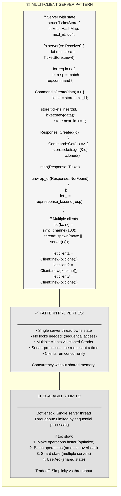

**Key advantage**: No locks! Server thread owns state exclusively. Channel provides synchronization. Simpler than Arc<Mutex>, easier to reason about.

---

### 6.2 Priority Channels

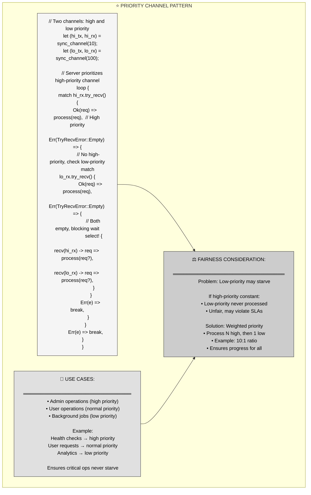

**When to use**: Systems with mixed workload criticality. Health checks, admin ops must not wait behind bulk user requests.

---

### 6.3 Worker Pool Pattern

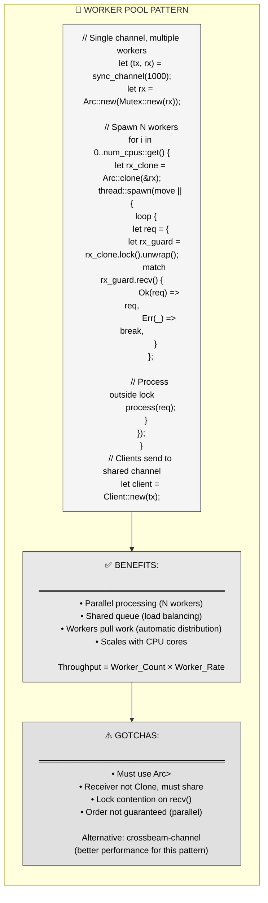

**Use case**: CPU-bound work that can be parallelized. Image processing, data transformation, batch jobs.

---

## Part 7: Best Practices and Gotchas

### 7.1 Common Pitfalls

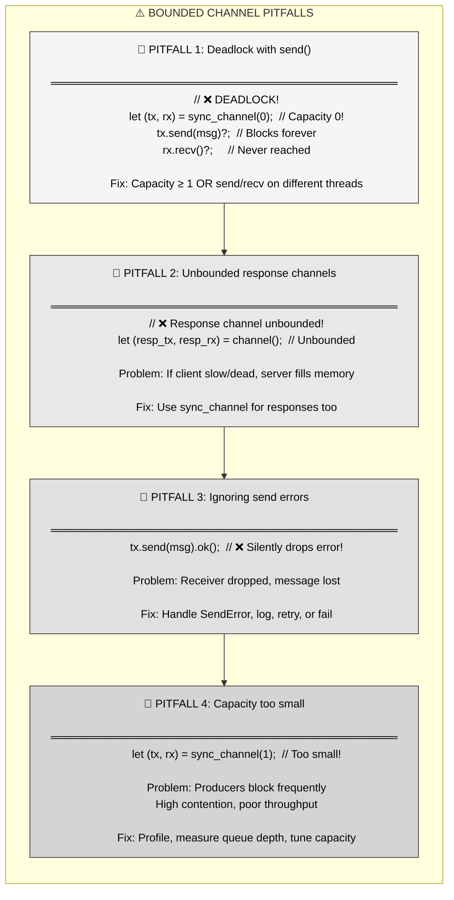

---

### 7.2 Safe Patterns

```mermaid
flowchart TD
    subgraph SAFE["✅ SAFE BOUNDED CHANNEL PATTERNS"]
        direction TB
        
        PATTERN1["PATTERN 1: Always bound ALL channels
        ════════════════════════════════════════════
        // Request channel
        let (tx, rx) = sync_channel(100);
        
        // Response channels too!
        let (resp_tx, resp_rx) = sync_channel(1);
        
        Prevents: Memory leaks from slow consumers"]
        
        PATTERN2["PATTERN 2: Use timeouts in production
        ════════════════════════════════════════════
        let timeout = Duration::from_secs(10);
        match resp_rx.recv_timeout(timeout) {
        Ok(resp) =&gt; Ok(resp),
        Err(RecvTimeoutError::Timeout) =&gt; {
            Err(\"Server timeout\")
        }
        Err(RecvTimeoutError::Disconnected) =&gt; {
            Err(\"Server died\")
        }
        }
        
        Prevents: Indefinite blocking"]
        
        PATTERN3["PATTERN 3: Monitor queue depth
        ════════════════════════════════════════════
        // Telemetry in server loop
        let depth = estimate_queue_depth();
        metrics.record(\"queue_depth\", depth);
        
        if depth > capacity * 0.8 {
        warn!(\"Queue near capacity\");
        }
        
        Enables: Capacity tuning, alerting"]
        
        PATTERN4["PATTERN 4: Graceful shutdown
        ════════════════════════════════════════════
        // Drop sender to signal shutdown
        drop(tx);
        
        // Server recv() returns Err when all senders dropped
        for req in rx {  // Processes remaining messages
        process(req);
        }
        // Loop exits when queue drained
        
        Ensures: Clean shutdown, no lost messages"]
    end
    
    PATTERN1 --> PATTERN2
    PATTERN2 --> PATTERN3
    PATTERN3 --> PATTERN4
    
    style PATTERN1 fill:#f5f5f5,stroke:#333,color:#000
    style PATTERN2 fill:#e8e8e8,stroke:#333,color:#000
    style PATTERN3 fill:#e0e0e0,stroke:#333,color:#000
    style PATTERN4 fill:#d4d4d4,stroke:#333,color:#000
```

---

## Part 8: Key Takeaways and Cross-Language Comparison

### 8.1 Core Principles Summary

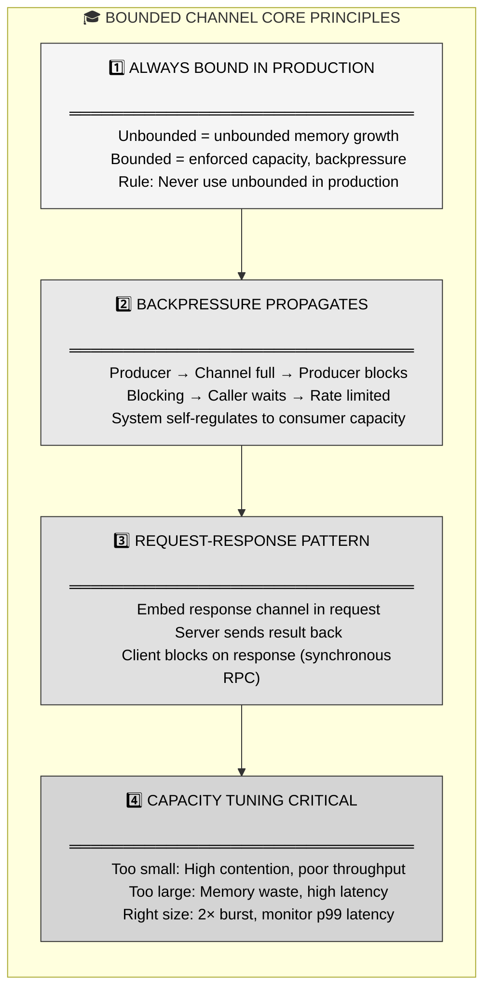

---

### 8.2 Cross-Language Comparison

| Language | Bounded Channels | Backpressure | Request-Response |
|----------|------------------|--------------|------------------|
| **Rust (std::sync::mpsc)** | `sync_channel(N)` | `send()` blocks | Manual pattern (embed Sender) |
| **Go** | `make(chan T, N)` | `ch <-` blocks | Manual pattern (response chan) |
| **Erlang/Elixir** | Mailbox (unbounded!) | ⚠️ Process isolation prevents OOM | Built-in (GenServer call) |
| **Java (BlockingQueue)** | `ArrayBlockingQueue(N)` | `put()` blocks | Manual pattern (CompletableFuture) |
| **Python (queue.Queue)** | `Queue(maxsize=N)` | `put()` blocks | Manual pattern (response queue) |
| **C# (Channels)** | `Channel.CreateBounded(N)` | `WriteAsync` waits | Manual pattern (TaskCompletionSource) |

**Rust's advantage**: Zero-cost channels, compile-time Send checking, explicit bounded/unbounded choice at creation. No runtime overhead compared to Go's runtime scheduler or Erlang's process model.

---

## Part 9: Summary - Backpressure and Acknowledgments

**Bounded channels with request-response patterns provide production-safe message passing with capacity limits, backpressure propagation, and two-way communication.**

**Three key mechanisms:**
1. **sync_channel(N)** → Enforced capacity prevents memory explosion
2. **send() blocks** → Backpressure propagates to producers automatically
3. **Response channel** → Server sends results back, client awaits synchronously

**MCU metaphor recap**: S.H.I.E.L.D. command center with 10-table briefing room (bounded capacity). Field agents wait in hallway when full (blocked send), Maria Hill processes at sustainable rate (consumer throughput), agents carry radios for mission reports (response channels). Natural rate-limiting prevents system overload.

**When to use bounded**: Always in production. Start with capacity = 2× burst size, monitor queue depth, tune based on p99 latency.

**When to use unbounded**: Never in production. Only during prototyping/development when capacity unknown.

**Critical rules**:
- Never use unbounded channels in production
- Always use timeouts on `recv()` in clients
- Monitor queue depth metrics, tune capacity
- Embed response channels for acknowledgments
- Handle SendError (receiver may drop)

**The promise**: Build reliable multi-threaded systems with controlled memory usage, automatic backpressure, and error-aware request-response patterns.

---

## References

**Primary source**: Mainmatter's "100 Exercises To Learn Rust" - Section 7 (Threads), Chapter 7 (Acknowledgment), Chapter 9 (Bounded Channels)

**Key concepts covered**:
- Problem: Unbounded channels cause memory exhaustion
- Solution: sync_channel(N) enforces capacity limits
- Backpressure: send() blocks when full, propagates to producers
- Request-response: Embed Sender<Response> in requests
- Client abstraction: Clean API hiding channel boilerplate
- Capacity tuning: Balance throughput, latency, memory

**Related std documentation**:
- `std::sync::mpsc::sync_channel` - bounded channel creation
- `std::sync::mpsc::SyncSender` - blocking send operations
- `std::sync::mpsc::Receiver` - receiving from channels
- `std::sync::mpsc::TrySendError` - non-blocking send errors

**Further reading**:
- "Communicating Sequential Processes" - Tony Hoare
- Rust Book - Chapter 16.2 on message passing
- Production channel patterns in async Rust (crossbeam, flume, tokio::sync::mpsc)
