# R73: Rust Numeric Operations - Saturating Arithmetic and Type Casting

## Part 1: The Problem - Silent Overflow and Unsafe Casting

### 1.1 The Overflow Behavior Problem

**Integer overflow has three possible behaviors in Rust (wrapping, panicking, saturating), but the choice affects correctness—wrapping silently produces wrong results, panicking crashes programs, and saturating clamps to bounds.**

The overflow behavior dilemma:

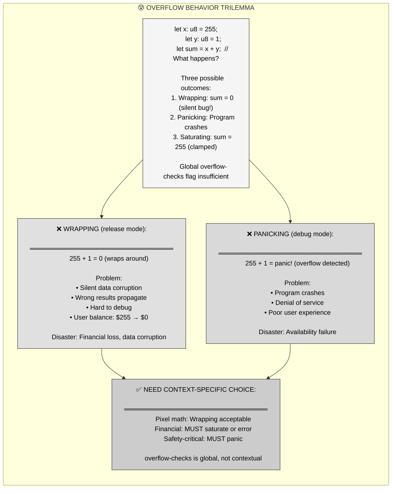

**The pain**: Global `overflow-checks` setting is binary (wrap or panic), but real code needs per-operation control. Financial calculations need saturation, graphics need wrapping, safety systems need panics.

---

### 1.2 The Type Casting Truncation Problem

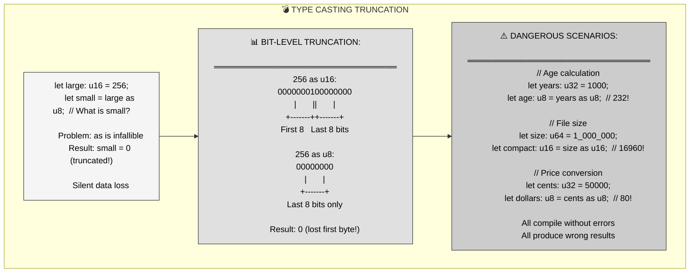

**Critical insight**: `as` casting is infallible—it always succeeds, even when converting from larger to smaller types. Truncation is silent, leading to data corruption without compile-time or runtime errors.

---

## Part 2: The Solution - Explicit Overflow Control

### 2.1 Saturating Arithmetic - Clamping to Bounds

**Saturating methods (saturating_add, saturating_sub, saturating_mul) clamp results to type bounds instead of wrapping or panicking—essential for financial calculations and safety-critical code where incorrect values are unacceptable.**

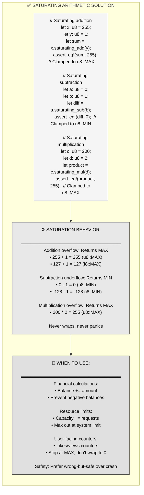

**Key advantage**: Saturating arithmetic produces incorrect but safe results. Better to show $255 balance (wrong but conservative) than $0 (catastrophic data loss) or crash (denial of service).

---

### 2.2 Wrapping Arithmetic - Explicit Overflow

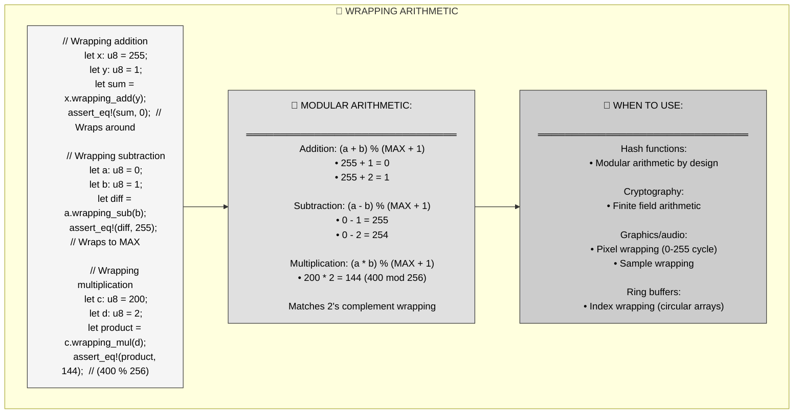

**When to use**: Wrapping is correct for algorithms designed around modular arithmetic (hashing, cryptography, graphics). Make it explicit with `wrapping_*` methods to document intent.

---

## Part 3: Mental Model - Stark Tower Energy Systems

### 3.1 The MCU Metaphor

**Tony Stark's arc reactor power management systems—with different overflow handlers for different subsystems (suit power saturates, diagnostics wrap, safety systems panic)—mirrors Rust's context-specific overflow control.**

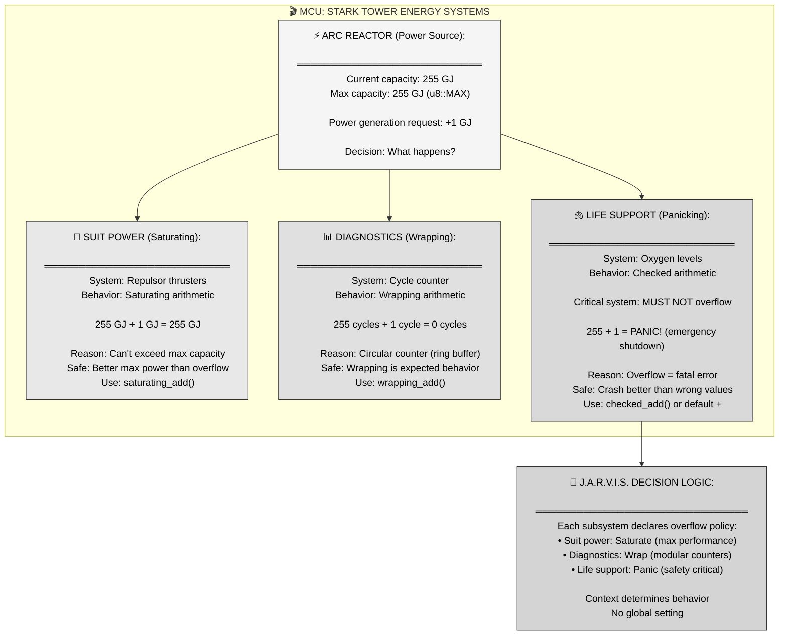

---

### 3.2 MCU-to-Rust Mapping Table

| MCU Concept | Rust Numeric Operations | Enforced Invariant |
|-------------|-------------------------|-------------------|
| **Arc reactor** | Integer type (u8, i32, etc.) | Has MIN and MAX bounds |
| **Suit power system** | `saturating_add()` | Clamps to MAX, never exceeds capacity |
| **255 GJ + 1 GJ = 255 GJ** | Saturating arithmetic behavior | Result clamped to u8::MAX |
| **Diagnostics cycle counter** | `wrapping_add()` | Modular arithmetic, cycles back to 0 |
| **255 cycles + 1 = 0** | Wrapping arithmetic behavior | (a + b) % (MAX + 1) |
| **Life support system** | `checked_add()` or default `+` | Panic on overflow (safety critical) |
| **Emergency shutdown** | Panic at runtime | Program terminates to prevent corruption |
| **J.A.R.V.I.S. decision** | Explicit method choice | Developer selects overflow behavior per operation |
| **Type casting calibration** | `as` casting with truncation | Converts u16 → u8 by dropping high byte |
| **Power reading conversion** | `TryFrom` fallible conversion | Returns Err if value doesn't fit |

**Narrative**: Stark Tower runs on arc reactor power. Different subsystems need different overflow handling. The suit's repulsor thrusters use saturating arithmetic—if Tony tries to add 1 GJ to a 255 GJ-maxed reactor (saturating_add), it stays at 255 GJ. The suit just outputs maximum power; better to cap at 100% than wrap to 0% and fall from the sky.

Diagnostics systems use wrapping counters for cycle tracking (wrapping_add). A counter at 255 cycles wraps to 0—this is expected behavior for circular buffers and modular arithmetic. No harm in wrapping since it's tracking non-critical metrics.

Life support systems (oxygen levels) use checked arithmetic—overflow is catastrophic. If oxygen calculation overflows, J.A.R.V.I.S. triggers emergency shutdown (panic). Better to crash and force manual review than continue with wrong oxygen readings that could kill Tony.

Each subsystem explicitly declares its overflow policy via method choice. There's no global setting—context determines correctness. This is exactly how Rust works: saturating_*, wrapping_*, checked_*, or default operations with overflow-checks.

---

## Part 4: Anatomy of Overflow Control Methods

### 4.1 Complete Method Suite

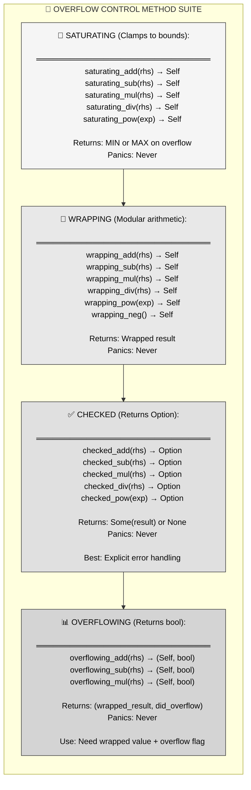

**Method selection guide**: `saturating_*` for safety (financial, resources), `wrapping_*` for algorithms (hashing, graphics), `checked_*` for explicit error handling (parse input), `overflowing_*` for advanced algorithms (big integer math).

---

### 4.2 Type Casting with `as`

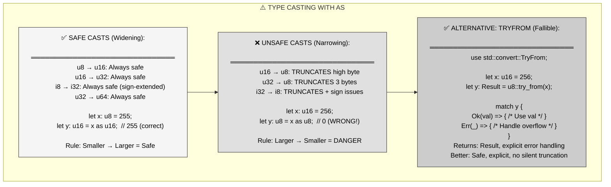

**Critical rule**: Use `as` ONLY for widening casts (u8 → u16). For narrowing (u16 → u8), use `TryFrom` which returns `Result` and makes errors explicit.

---

### 4.3 Checked Arithmetic Pattern

```mermaid
flowchart TD
    subgraph CHECKED_PATTERN["✅ CHECKED ARITHMETIC PATTERN"]
        direction TB
        
        CODE["fn safe_add(a: u8, b: u8) -&gt; Result<u8, &str> {
        a.checked_add(b)
            .ok_or(\"Addition overflow\")
        }
        
        fn safe_multiply(a: u8, b: u8) -&gt; Result<u8, &str> {
        a.checked_mul(b)
            .ok_or(\"Multiplication overflow\")
        }
        
        // Usage
        match safe_add(255, 1) {
        Ok(result) =&gt; println!(\"Result: {}\", result),
        Err(e) =&gt; eprintln!(\"Error: {}\", e),
        }"]
        
        CHAINING["🔗 CHAINING CHECKED OPERATIONS:
        ═══════════════════════════════
        fn calculate(a: u8, b: u8, c: u8) -&gt; Option<u8> {
        a.checked_add(b)?
            .checked_mul(c)?
            .checked_sub(10)
        }
        
        // Returns None if ANY operation overflows
        
        Benefit: Early return on first overflow
        Pattern: Use ? operator for propagation"]
        
        COMPARISON["📊 CHECKED VS SATURATING VS WRAPPING:
        ═══════════════════════════════
        let x: u8 = 255;
        let y: u8 = 1;
        
        checked_add: Some(255) or None
        saturating_add: Always 255
        wrapping_add: Always 0
        default +: Panic (debug) or 0 (release)
        
        Choose based on requirements"]
        
        CODE --> CHAINING
        CHAINING --> COMPARISON
    end
    
    style CODE fill:#f5f5f5,stroke:#333,color:#000
    style CHAINING fill:#e8e8e8,stroke:#333,color:#000
    style COMPARISON fill:#e0e0e0,stroke:#333,color:#000
```

**Best practice**: Use `checked_*` methods for input validation, API boundaries, parsing. Explicit `Option<T>` return type documents possibility of overflow.

---

## Part 5: Real-World Patterns

### 5.1 Financial Calculations

```mermaid
flowchart TD
    subgraph FINANCIAL["💰 FINANCIAL CALCULATION PATTERN"]
        direction TB
        
        CODE["struct Account {
        balance_cents: u64,  // Balance in cents
        }
        
        impl Account {
        fn deposit(&mut self, amount_cents: u64) -&gt; Result<(), &str> {
            self.balance_cents = self.balance_cents
                .checked_add(amount_cents)
                .ok_or(\"Balance overflow\")?;
            Ok(())
        }
        
        fn withdraw(&mut self, amount_cents: u64) -&gt; Result<(), &str> {
            self.balance_cents = self.balance_cents
                .checked_sub(amount_cents)
                .ok_or(\"Insufficient funds\")?;
            Ok(())
        }
        }"]
        
        RATIONALE["📊 WHY CHECKED:
        ═══════════════════════════════
        Saturating: WRONG
        • Deposit $100 to $MAX balance
        • Balance stays $MAX
        • $100 disappears (money lost!)
        
        Wrapping: CATASTROPHIC
        • Deposit $1 to $MAX balance
        • Balance wraps to $0
        • Customer loses everything!
        
        Checked: CORRECT
        • Returns Err on overflow
        • Transaction rejected
        • Money not lost, explicit error"]
        
        ALTERNATIVE["🔄 ALTERNATIVE: USE LARGER TYPE:
        ═══════════════════════════════
        // Don't use u32 for money!
        // Use u64 or u128 for large ranges
        
        u64 max: 18,446,744,073,709,551,615 cents
        = $184,467,440,737,095.52
        
        u128 max: Astronomical (never overflow)
        
        Prefer: Large types + checked arithmetic"]
        
        CODE --> RATIONALE
        RATIONALE --> ALTERNATIVE
    end
    
    style CODE fill:#f5f5f5,stroke:#333,color:#000
    style RATIONALE fill:#e8e8e8,stroke:#333,color:#000
    style ALTERNATIVE fill:#e0e0e0,stroke:#333,color:#000
```

**Financial rule**: NEVER use saturating or wrapping for money. Always use `checked_*` methods and explicit error handling. Consider u64 or u128 to avoid overflow entirely.

---

### 5.2 Image Processing

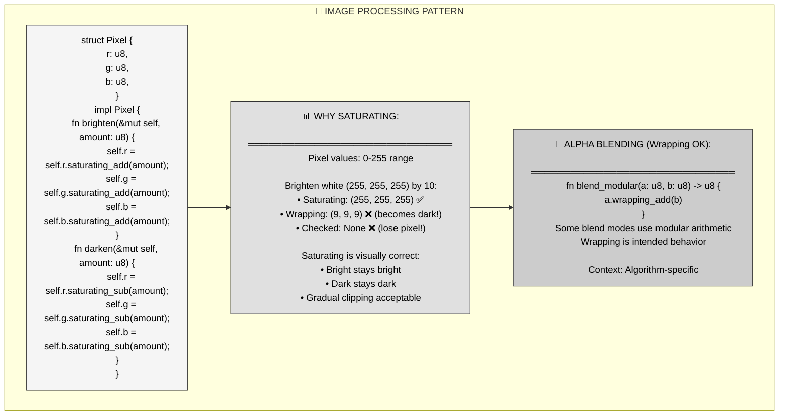

**Graphics rule**: Saturating is almost always correct for pixel arithmetic. Preserves visual continuity, prevents black/white flashes from wrapping.

---

### 5.3 Safe Type Conversion

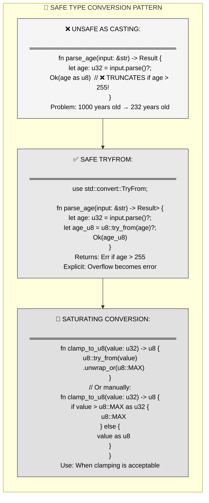

**Conversion rule**: Use `TryFrom` for fallible conversions (API input, parsing). Use `as` only for widening. Implement custom clamping if saturating is semantically correct.

---

## Part 6: Best Practices and Gotchas

### 6.1 Common Pitfalls

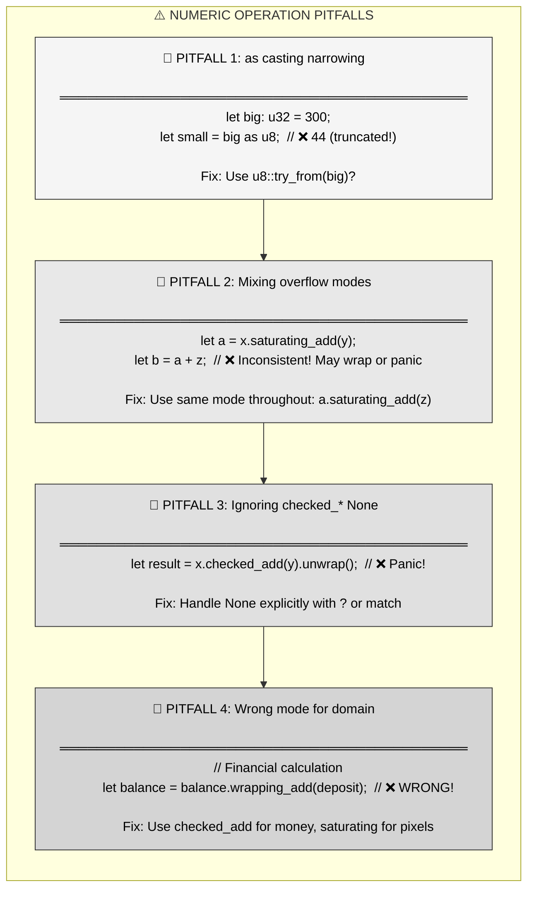

---

### 7.2 Safe Patterns

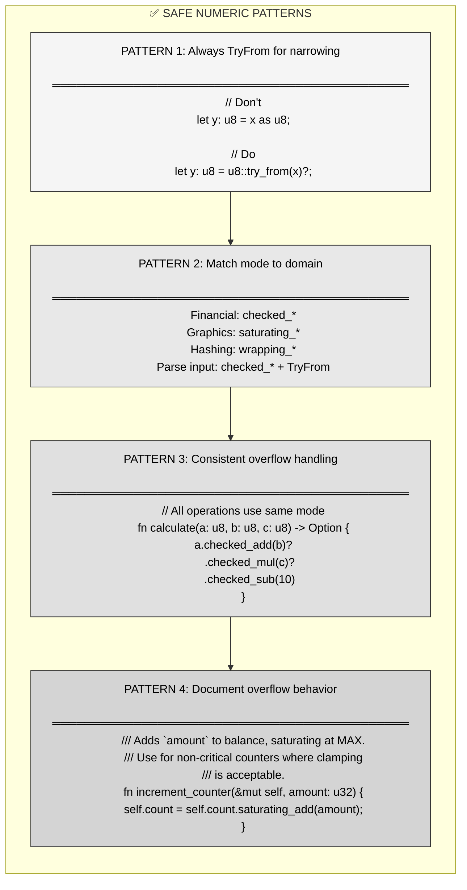

---

## Part 7: Key Takeaways and Cross-Language Comparison

### 7.1 Core Principles Summary

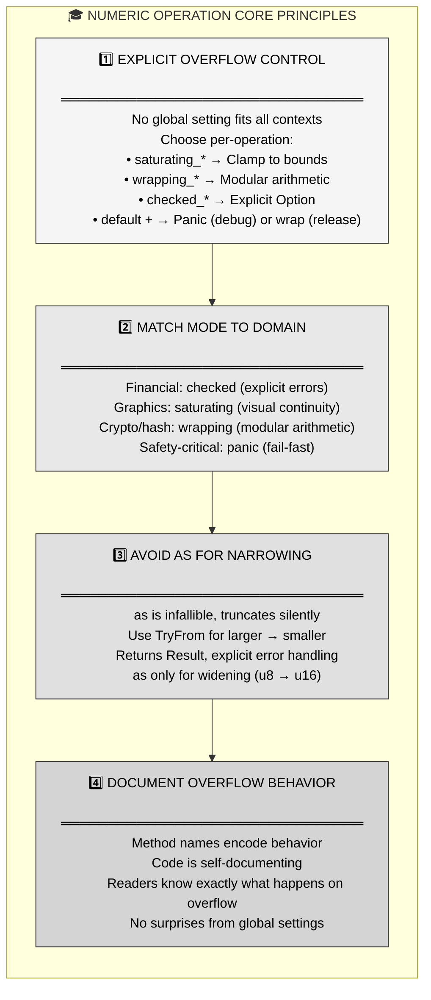

---

### 7.2 Cross-Language Comparison

| Language | Overflow Behavior | Type Casting | Safety |
|----------|------------------|--------------|--------|
| **Rust** | Explicit per-operation (saturating/wrapping/checked) | `as` (infallible) or `TryFrom` (fallible) | ✅ Choice + explicit |
| **C/C++** | Undefined behavior (signed), wrapping (unsigned) | Implicit conversions, truncates | ❌ Silent corruption |
| **Java** | Wrapping (silent) | Explicit casts, truncates | ⚠️ Silent wrapping |
| **Python** | Arbitrary precision (no overflow) | Implicit promotion | ✅ No overflow (perf cost) |
| **Go** | Wrapping (silent) | Explicit conversions | ⚠️ Silent wrapping |
| **Swift** | Panic on overflow (debug), wrapping (release) | Explicit, failable initializers available | ✅ Similar to Rust |

**Rust's advantage**: Explicit per-operation control, compile-time method selection, self-documenting code. No hidden global settings, no undefined behavior.

---

## Part 8: Summary - Safe Numeric Operations

**Rust provides explicit per-operation overflow control (saturating, wrapping, checked) and safe type conversions (TryFrom), eliminating silent truncation and context-inappropriate defaults.**

**Three key mechanisms:**
1. **saturating_*** → Clamps to MIN/MAX, for financial/resource calculations
2. **wrapping_*** → Modular arithmetic, for hashing/crypto/graphics
3. **checked_*** → Returns Option, for explicit error handling

**MCU metaphor recap**: Stark Tower energy systems—suit power saturates (can't exceed max), diagnostics counters wrap (circular buffers), life support panics (safety critical). J.A.R.V.I.S. selects overflow behavior per subsystem, no global setting.

**When to use each**:
- **Saturating**: Financial balances, resource limits, pixel operations
- **Wrapping**: Hash functions, modular arithmetic, ring buffers
- **Checked**: Input validation, parsing, API boundaries
- **TryFrom**: Type conversions with validation

**Critical rules**:
- Never use `as` for narrowing casts (u32 → u8)
- Always use `TryFrom` for fallible conversions
- Match overflow mode to domain (financial=checked, graphics=saturating)
- Document overflow behavior in comments

**The promise**: Write numeric code with explicit overflow handling, no silent truncation, context-appropriate behavior, and self-documenting method names.

---

## References

**Primary source**: Mainmatter's "100 Exercises To Learn Rust" - Section 2 (Basic Calculator), Chapter 9 (Saturating), Chapter 10 (As Casting)

**Key concepts covered**:
- Problem: Integer overflow has multiple behaviors (wrap, panic, saturate)
- Solution: Explicit methods per operation (saturating_*, wrapping_*, checked_*)
- Type casting: `as` truncates silently, `TryFrom` is explicit
- Domain-specific choice: Financial (checked), graphics (saturating), crypto (wrapping)
- Safety: Per-operation control eliminates surprises

**Related std documentation**:
- Integer primitive methods (saturating_add, checked_mul, etc.)
- `std::convert::TryFrom` - fallible type conversion trait
- `as` operator reference - type casting semantics
- Overflow behavior in Rust reference

**Further reading**:
- "Myths and legends about integer overflow in Rust" - Huon Wilson
- Rust reference on numeric cast expressions
- The Rust Book - Chapter on operator overloading and traits
