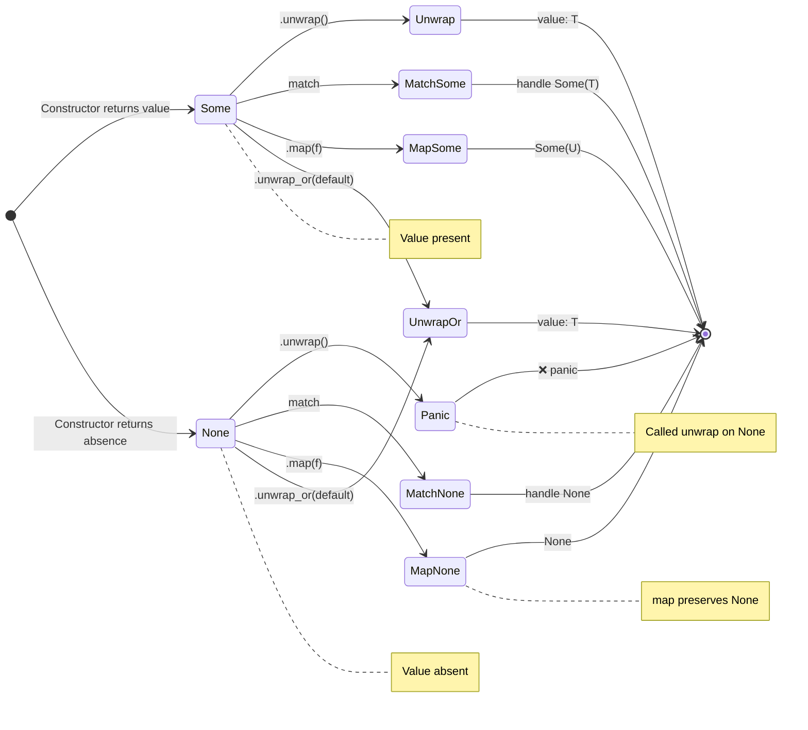
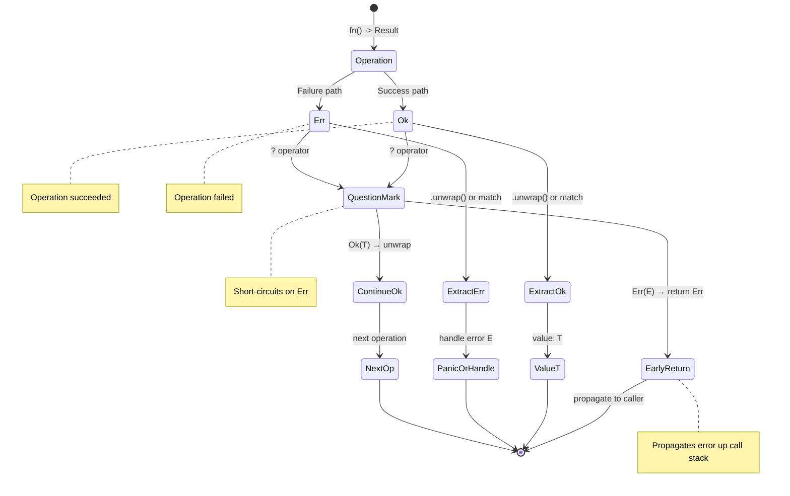
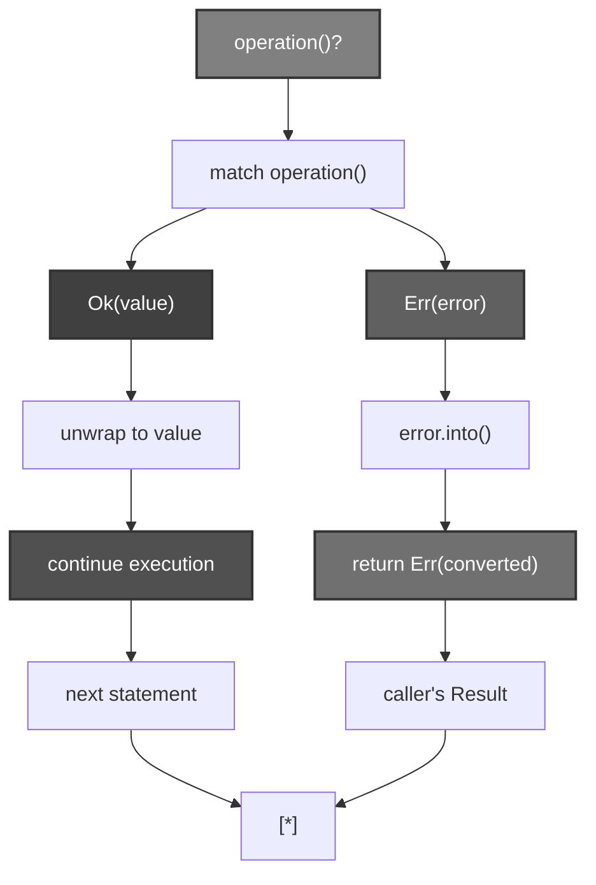
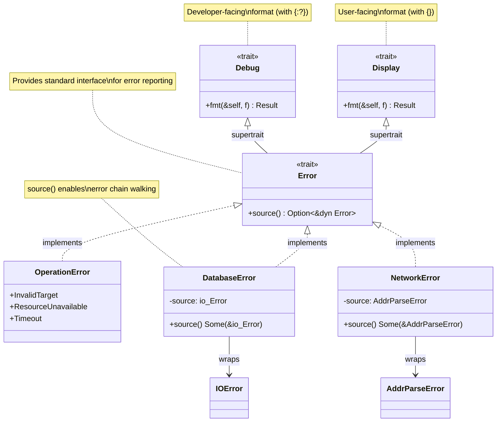
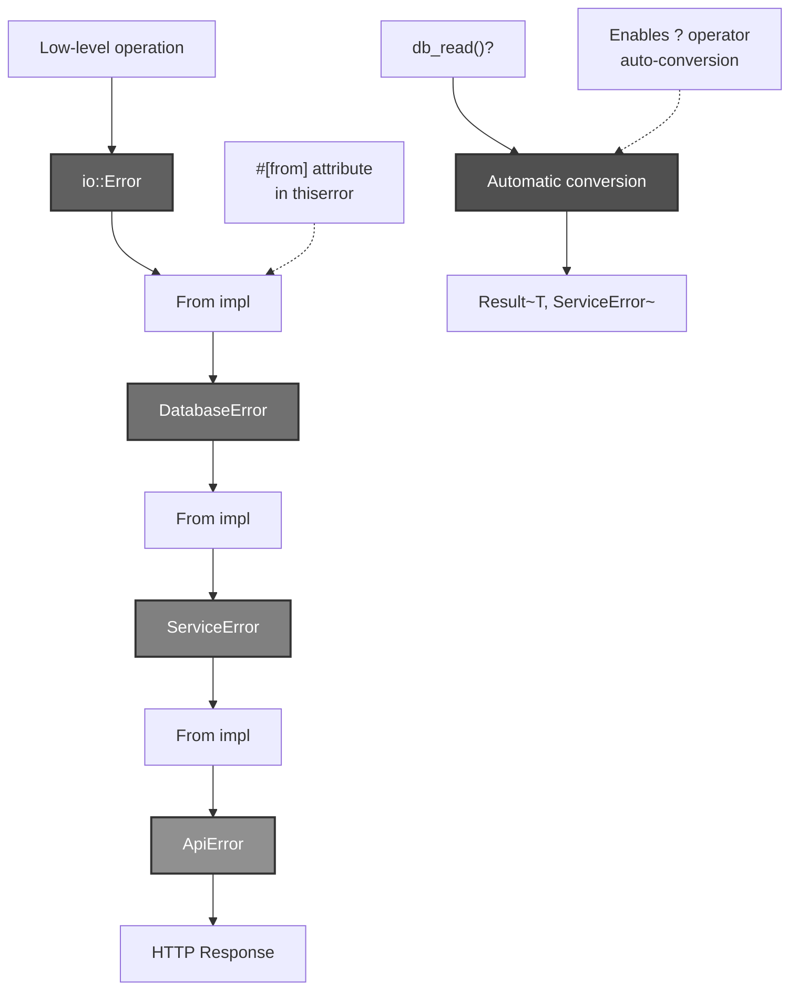
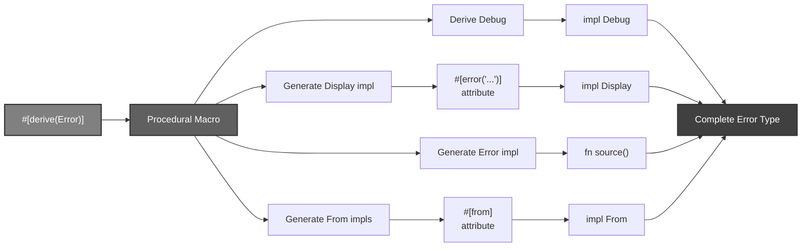
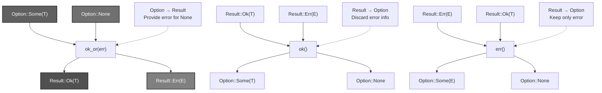
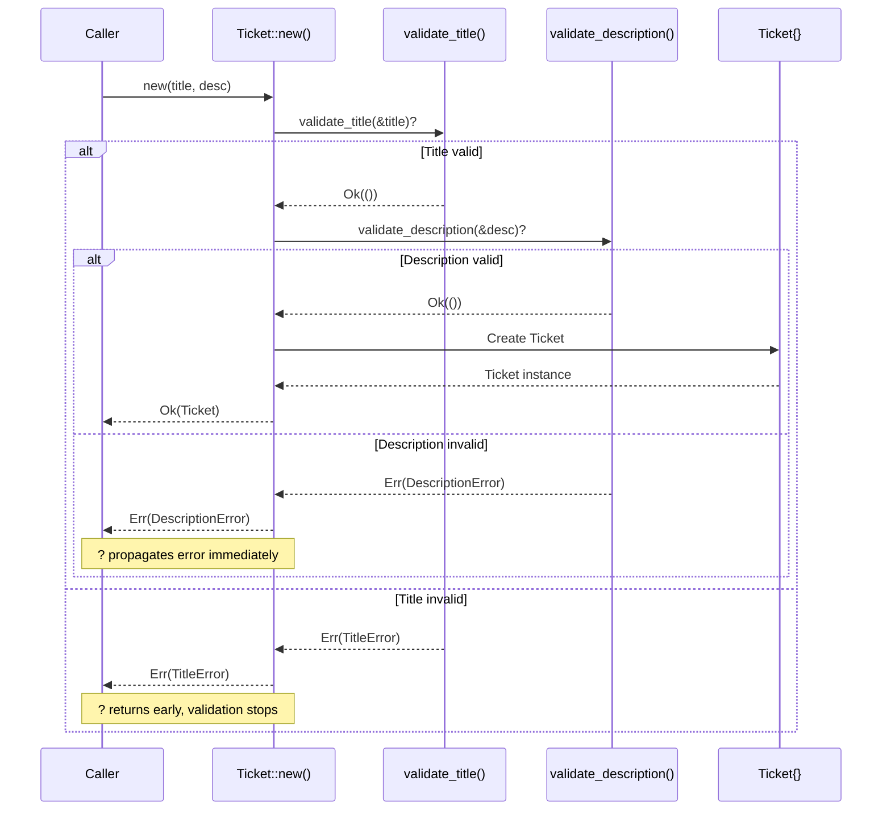
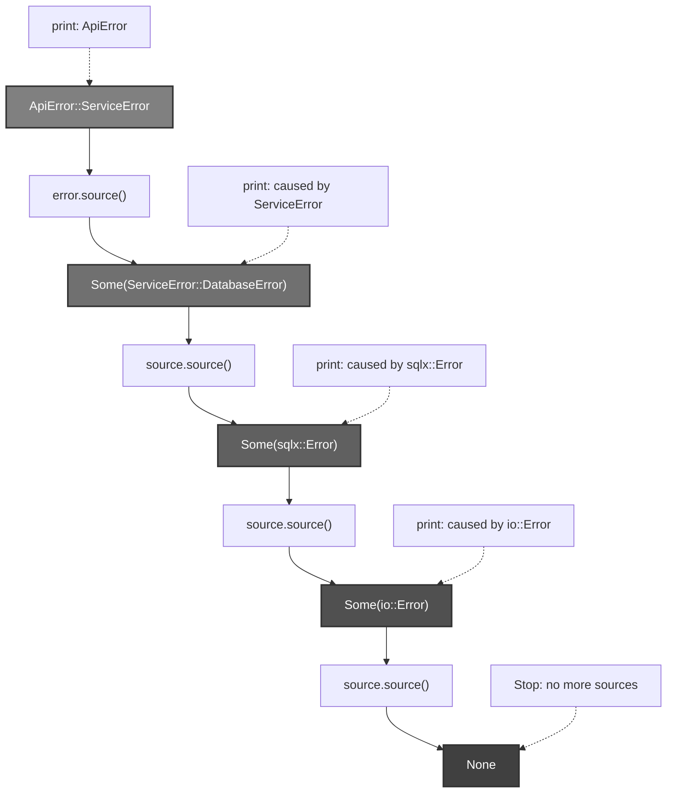
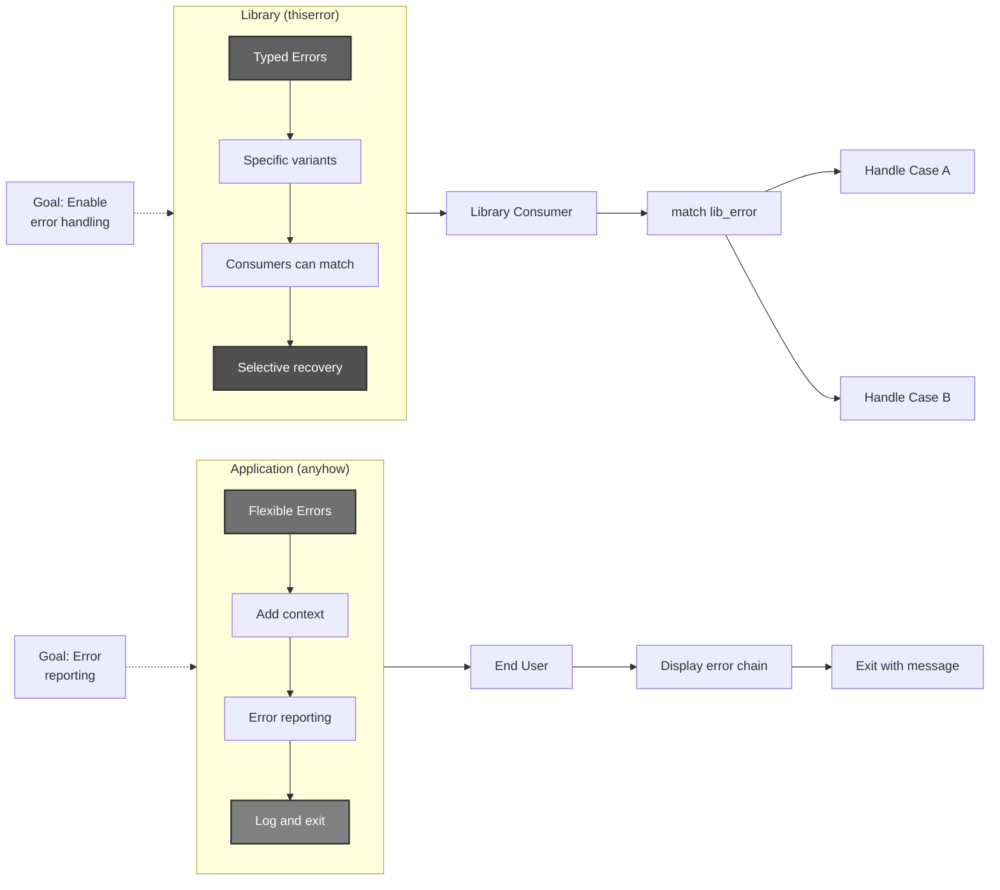

# R74: Rust Option, Result, and Error Handling Patterns

## PROBLEM

**How can Rust achieve memory safety AND eliminate null pointer dereferences AND provide structured error handling without exceptions?**

**Answer**: **Rust encodes nullability and fallibility directly in the type system using `Option<T>` and `Result<T,E>` enums, forcing explicit handling of missing values and errors at compile-time. This eliminates null pointer crashes and exception control flow chaos by representing both as values with compiler-verified pattern matching, propagating errors with the `?` operator, and enabling structured error chains via the `Error` trait.**

## SOLUTION

### The Core Insight

**Traditional languages have two fundamental problems**:

1. **Null references** - Tony Hoare's "billion-dollar mistake" where any pointer might be null, but the type system doesn't track this
2. **Exception control flow** - Errors create hidden paths through code with no signature tracking, poor locality between throw/catch sites, and no compile-time guarantees

**Rust's solution**:
- **Nullability** → `Option<T>` enum: `Some(T)` or `None` - forces explicit handling
- **Fallibility** → `Result<T,E>` enum: `Ok(T)` or `Err(E)` - errors as values, tracked in signatures
- **Error propagation** → `?` operator: early return with automatic conversion
- **Error contracts** → `Error` trait: standardized reporting with `Debug` + `Display` + `source()`
- **Error composition** → `thiserror` macro: deriving Error impls with minimal boilerplate

### The Mental Model: Wakanda's Vibranium Detection Network

Imagine **Wakanda's defense system** monitoring for vibranium signatures worldwide:

**Shuri's Scanner System**:
- **Sensor readings** can be:
  - `Some(VibraniumSignature)` - detected the signal
  - `None` - no vibranium in scan area
- **Mission operations** can be:
  - `Ok(MissionReport)` - operation succeeded
  - `Err(MissionFailure)` - operation failed with specific cause

**System Architecture**:
1. **Sensor Layer** (Option)
   - Shuri's sensors return `Option<Reading>` - signal or silence
   - `.unwrap()` = Shuri assumes signal is there (panics if wrong)
   - `.expect("msg")` = Shuri assumes with custom alert message
   - `match` = Shuri handles both signal/silence cases explicitly

2. **Mission Layer** (Result)
   - Border Tribe operations return `Result<Report, OperationError>`
   - Signature encodes fallibility: "This mission can fail with these error types"
   - `?` operator = W'Kabi reports failure immediately to command, otherwise continues
   - Error chains = Primary failure → caused by → sensor malfunction → caused by → power fluctuation

3. **Command Center** (Error trait)
   - All error reports implement Error trait
   - `Debug` = Technical details for Shuri (developer view)
   - `Display` = Status report for T'Challa (user view)
   - `source()` = Chain of causation for investigation

4. **Report Templates** (thiserror)
   - Pre-formatted error report structures
   - `#[derive(Error)]` = Auto-generate standard reporting format
   - `#[error("...")]` = Template for Display messages
   - `#[from]` = Automatic conversion from subsystem errors

### Mapping Table

| Wakanda Concept | Rust Concept | Purpose |
|----------------|--------------|---------|
| Sensor reading (signal/silence) | `Option<T>` | Nullable values |
| `Some(VibraniumSignature)` | `Some(value)` | Value is present |
| `None` (no signal) | `None` | Value is absent |
| Mission outcome | `Result<T,E>` | Fallible operations |
| `Ok(MissionReport)` | `Ok(value)` | Operation succeeded |
| `Err(MissionFailure)` | `Err(error)` | Operation failed |
| Shuri assumes signal exists | `.unwrap()` | Panic if None/Err |
| Shuri assumes with alert message | `.expect("msg")` | Panic with custom message |
| W'Kabi handles both outcomes | `match result { Ok/Err }` | Explicit handling |
| W'Kabi reports failures upward | `?` operator | Early return error propagation |
| Error report standard | `Error` trait | Standardized error interface |
| Technical diagnostics | `Debug` trait | Developer-facing format |
| Status briefing | `Display` trait | User-facing format |
| Investigation chain | `source()` method | Error causation chain |
| Report template system | `thiserror` crate | Derive Error implementations |
| Mission type validation | `TryFrom/TryInto` | Fallible conversions |

### The Narrative

**Act I: The Sensor Problem (Option)**

Shuri deploys vibranium sensors across Wakanda's borders. Each sensor either detects a signature (`Some(Reading)`) or reports silence (`None`).

**Old approach** (other languages):
```rust
// sensor might return null - no compile-time tracking
let reading = sensor.get_reading(); // Reading?
let intensity = reading.intensity; // CRASH if null!
```

**Wakanda's approach** (Rust):
```rust
// Sensor explicitly returns Option<Reading>
fn get_reading(&self) -> Option<Reading> { ... }

// Compiler forces handling both cases:
match sensor.get_reading() {
    Some(reading) => println!("Detected: {}", reading.intensity),
    None => println!("No signal detected"),
}
```

Shuri can't accidentally dereference a null reading - the type system won't compile code that ignores the `None` case.

**When to unwrap**: If Shuri is testing a known vibranium sample in the lab, she can `.unwrap()` because she *knows* the sensor will detect it. If she's wrong, the system panics with clear error location.

**Act II: The Mission Problem (Result)**

The Border Tribe conducts operations that can fail. W'Kabi needs to report both success and specific failure modes to T'Challa.

**Old approach** (exceptions):
```java
// No indication in signature that this can fail
public MissionReport conductOperation(String target) {
    if (targetInvalid) throw new InvalidTargetException();
    if (teamUnavailable) throw new ResourceException();
    // ... control flow hidden from signature
}

// Caller might forget try/catch → crash
MissionReport report = conductOperation("Border Zone 7");
```

**Wakanda's approach** (Result):
```rust
// Signature EXPLICITLY declares fallibility and error types
fn conduct_operation(target: &str) -> Result<MissionReport, OperationError> {
    if target.is_empty() {
        return Err(OperationError::InvalidTarget);
    }
    if team_unavailable() {
        return Err(OperationError::ResourceUnavailable);
    }
    Ok(MissionReport { ... })
}

// Compiler forces handling:
match conduct_operation("Border Zone 7") {
    Ok(report) => process_success(report),
    Err(OperationError::InvalidTarget) => retry_with_default(),
    Err(OperationError::ResourceUnavailable) => reschedule(),
}
```

**Key insight**: Fallibility is encoded in the function signature. You can't ignore errors - the compiler won't let you access the `MissionReport` without handling the `Err` case.

**Act III: The Reporting Chain (? operator)**

W'Kabi conducts a multi-step operation. Each step can fail. He needs to report failures immediately upward without boilerplate.

**Without ? operator**:
```rust
fn complex_mission() -> Result<Report, OperationError> {
    let intel = match gather_intel() {
        Ok(i) => i,
        Err(e) => return Err(e),
    };
    
    let team = match assemble_team() {
        Ok(t) => t,
        Err(e) => return Err(e),
    };
    
    let result = match execute(intel, team) {
        Ok(r) => r,
        Err(e) => return Err(e),
    };
    
    Ok(result)
}
```

**With ? operator**:
```rust
fn complex_mission() -> Result<Report, OperationError> {
    let intel = gather_intel()?;     // Returns Err immediately if fails
    let team = assemble_team()?;     // Otherwise continues
    let result = execute(intel, team)?;
    Ok(result)
}
```

The `?` operator:
1. Unwraps `Ok(value)` and continues
2. Returns `Err(e)` early if error occurs
3. Automatically converts error types via `From` implementations

**Act IV: The Investigation Chain (Error trait)**

When operations fail, Shuri needs both user-facing status reports for T'Challa and technical diagnostics for debugging.

**Error trait requirements**:
```rust
pub trait Error: Debug + Display {
    fn source(&self) -> Option<&(dyn Error + 'static)> {
        None
    }
}
```

**Example implementation**:
```rust
#[derive(Debug)]
enum OperationError {
    SensorMalfunction { code: u32 },
    CommunicationFailure { source: std::io::Error },
}

// Display: User-facing message for T'Challa
impl Display for OperationError {
    fn fmt(&self, f: &mut Formatter) -> fmt::Result {
        match self {
            Self::SensorMalfunction { code } => 
                write!(f, "Sensor malfunction (code {})", code),
            Self::CommunicationFailure { .. } => 
                write!(f, "Communication system failure"),
        }
    }
}

// Error: Provides investigation chain
impl Error for OperationError {
    fn source(&self) -> Option<&(dyn Error + 'static)> {
        match self {
            Self::CommunicationFailure { source } => Some(source),
            _ => None,
        }
    }
}
```

Now Shuri can walk the error chain:
```rust
let mut current_error: &dyn Error = &operation_error;
while let Some(source) = current_error.source() {
    eprintln!("Caused by: {}", source);
    current_error = source;
}
```

**Act V: The Template System (thiserror)**

Creating Error implementations manually is repetitive. Shuri creates report templates.

**Manual approach** (shown above): Lots of boilerplate for Display + Error impls

**Template approach** (thiserror):
```rust
use thiserror::Error;

#[derive(Error, Debug)]
enum OperationError {
    #[error("Sensor malfunction (code {code})")]
    SensorMalfunction { code: u32 },
    
    #[error("Communication system failure")]
    CommunicationFailure {
        #[from]  // Auto-generates From<io::Error> + sets as source
        source: std::io::Error,
    },
    
    #[error("Invalid target: {0}")]
    InvalidTarget(String),
}
```

Benefits:
- `#[derive(Error)]` generates Error trait impl
- `#[error("...")]` generates Display impl
- `#[from]` generates From impl + sets error source
- Field named `source` automatically used for `Error::source()`

## ANATOMY

### Option<T> Deep Dive

```rust
pub enum Option<T> {
    Some(T),
    None,
}
```

**Key characteristics**:
- **Generic**: Works with any type `T`
- **Zero-cost abstraction**: Compiler optimizes to same efficiency as null checks
- **Explicit**: Type signature tells you "this value might not exist"

**Common methods**:

```rust
impl<T> Option<T> {
    // Panic if None
    fn unwrap(self) -> T;
    fn expect(self, msg: &str) -> T;
    
    // Safe extraction with default
    fn unwrap_or(self, default: T) -> T;
    fn unwrap_or_else<F>(self, f: F) -> T where F: FnOnce() -> T;
    
    // Transformation (stays Option)
    fn map<U, F>(self, f: F) -> Option<U> where F: FnOnce(T) -> U;
    fn and_then<U, F>(self, f: F) -> Option<U> where F: FnOnce(T) -> Option<U>;
    
    // Boolean checks
    fn is_some(&self) -> bool;
    fn is_none(&self) -> bool;
    
    // Convert to Result
    fn ok_or<E>(self, err: E) -> Result<T, E>;
    fn ok_or_else<E, F>(self, err: F) -> Result<T, E> where F: FnOnce() -> E;
}
```

**Example progression**:

```rust
// Sensor reading example
fn get_reading() -> Option<Reading> { ... }

// 1. Explicit match (most verbose, most control)
match get_reading() {
    Some(r) => println!("Intensity: {}", r.intensity),
    None => println!("No signal"),
}

// 2. If-let (single case handling)
if let Some(r) = get_reading() {
    println!("Intensity: {}", r.intensity);
}

// 3. Unwrap with default
let intensity = get_reading()
    .unwrap_or(Reading::default())
    .intensity;

// 4. Transform and chain
let doubled_intensity = get_reading()
    .map(|r| r.intensity * 2)
    .unwrap_or(0);

// 5. Convert to Result
let reading: Result<Reading, &str> = get_reading()
    .ok_or("No reading available");
```

### Result<T, E> Deep Dive

```rust
pub enum Result<T, E> {
    Ok(T),
    Err(E),
}
```

**Key characteristics**:
- **Two generics**: Success type `T` and error type `E`
- **Explicit fallibility**: Signature declares "this can fail with error type E"
- **No hidden control flow**: Unlike exceptions, errors are just values
- **Composable**: Can be transformed, chained, and propagated

**Common methods**:

```rust
impl<T, E> Result<T, E> {
    // Panic if Err
    fn unwrap(self) -> T;
    fn expect(self, msg: &str) -> T;
    
    // Safe extraction
    fn unwrap_or(self, default: T) -> T;
    fn unwrap_or_else<F>(self, f: F) -> T where F: FnOnce(E) -> T;
    
    // Transformation
    fn map<U, F>(self, f: F) -> Result<U, E> where F: FnOnce(T) -> U;
    fn map_err<F, O>(self, f: F) -> Result<T, O> where F: FnOnce(E) -> O;
    fn and_then<U, F>(self, f: F) -> Result<U, E> where F: FnOnce(T) -> Result<U, E>;
    
    // Boolean checks
    fn is_ok(&self) -> bool;
    fn is_err(&self) -> bool;
    
    // Convert to Option
    fn ok(self) -> Option<T>;
    fn err(self) -> Option<E>;
}
```

**Example progression**:

```rust
fn conduct_operation(target: &str) -> Result<Report, OperationError> { ... }

// 1. Explicit match (full control)
match conduct_operation("target") {
    Ok(report) => process(report),
    Err(OperationError::InvalidTarget) => retry(),
    Err(OperationError::ResourceUnavailable) => reschedule(),
    Err(e) => log_error(e),
}

// 2. If-let (single case)
if let Ok(report) = conduct_operation("target") {
    process(report);
}

// 3. Unwrap or default
let report = conduct_operation("target")
    .unwrap_or(Report::default());

// 4. Transform success value
let summary = conduct_operation("target")
    .map(|report| report.summary())
    .unwrap_or_else(|e| format!("Failed: {}", e));

// 5. Transform error type
let report: Result<Report, String> = conduct_operation("target")
    .map_err(|e| format!("Operation failed: {}", e));
```

### The ? Operator Mechanics

**Desugaring**:

```rust
// This line:
let value = fallible_operation()?;

// Expands to:
let value = match fallible_operation() {
    Ok(v) => v,
    Err(e) => return Err(e.into()),  // Note: .into() for conversion
};
```

**Key behaviors**:

1. **Early return**: Returns from current function immediately on Err
2. **Automatic conversion**: Uses `From` trait to convert error types
3. **Works with Option too**: Returns `None` early in functions returning Option

**Requirements**:
- Function must return `Result<T, E>` or `Option<T>`
- Error types must be compatible (via `From` implementations)

**Example**:

```rust
// Multi-step operation with ? operator
fn complex_mission(
    target: &str
) -> Result<MissionReport, OperationError> {
    // Each ? either unwraps Ok or returns Err early
    let intel = gather_intel(target)?;
    let team = assemble_team()?;
    let equipment = acquire_equipment()?;
    
    // Can mix operations returning different error types
    // as long as From implementations exist
    let location = parse_coordinates(target)
        .map_err(|e| OperationError::InvalidCoordinates(e))?;
    
    execute_mission(intel, team, equipment, location)
}

// Without ? operator (for comparison):
fn complex_mission_verbose(
    target: &str
) -> Result<MissionReport, OperationError> {
    let intel = match gather_intel(target) {
        Ok(i) => i,
        Err(e) => return Err(e),
    };
    let team = match assemble_team() {
        Ok(t) => t,
        Err(e) => return Err(e),
    };
    let equipment = match acquire_equipment() {
        Ok(eq) => eq,
        Err(e) => return Err(e),
    };
    let location = match parse_coordinates(target) {
        Ok(loc) => loc,
        Err(e) => return Err(OperationError::InvalidCoordinates(e)),
    };
    
    execute_mission(intel, team, equipment, location)
}
```

### The Error Trait Ecosystem

```rust
pub trait Error: Debug + Display {
    fn source(&self) -> Option<&(dyn Error + 'static)> {
        None
    }
}
```

**Supertrait requirements**:
- `Debug`: Technical representation for developers (via `{:?}`)
- `Display`: User-friendly representation (via `{}`)

**Error chain walking**:

```rust
fn print_error_chain(error: &dyn Error) {
    eprintln!("Error: {}", error);
    
    let mut source = error.source();
    while let Some(err) = source {
        eprintln!("Caused by: {}", err);
        source = err.source();
    }
}
```

**Example error implementation**:

```rust
use std::fmt;
use std::error::Error;

#[derive(Debug)]
struct DatabaseError {
    operation: String,
    source: std::io::Error,
}

impl fmt::Display for DatabaseError {
    fn fmt(&self, f: &mut fmt::Formatter) -> fmt::Result {
        write!(f, "Database operation '{}' failed", self.operation)
    }
}

impl Error for DatabaseError {
    fn source(&self) -> Option<&(dyn Error + 'static)> {
        Some(&self.source)
    }
}

// Usage creates error chain:
// DatabaseError: "Database operation 'read' failed"
//   caused by: io::Error: "Connection refused"
```

### thiserror Integration Patterns

**Basic enum with variants**:

```rust
use thiserror::Error;

#[derive(Error, Debug)]
pub enum OperationError {
    #[error("Invalid target: {0}")]
    InvalidTarget(String),
    
    #[error("Resource unavailable: {resource}")]
    ResourceUnavailable { resource: String },
    
    #[error("Operation timed out after {timeout}s")]
    Timeout { timeout: u64 },
}
```

**With error sources**:

```rust
#[derive(Error, Debug)]
pub enum ServiceError {
    #[error("Database error")]
    Database {
        #[from]  // Generates From<sqlx::Error> + sets as source
        source: sqlx::Error,
    },
    
    #[error("Network error")]
    Network {
        #[source]  // Just sets as source, no From impl
        inner: std::io::Error,
    },
    
    #[error("Configuration error")]
    Config {
        source: toml::de::Error,  // Field named 'source' auto-used
    },
}

// #[from] enables this:
let db_result: Result<Data, sqlx::Error> = query();
let service_result: Result<Data, ServiceError> = db_result?;
// Automatically converts sqlx::Error to ServiceError::Database
```

**With additional context**:

```rust
#[derive(Error, Debug)]
pub enum ParseError {
    #[error("Failed to parse {field}: {message}")]
    InvalidField {
        field: String,
        message: String,
    },
    
    #[error("Unexpected token '{token}' at line {line}, column {col}")]
    UnexpectedToken {
        token: String,
        line: usize,
        col: usize,
    },
    
    #[error(transparent)]  // Use inner error's Display
    Other(#[from] anyhow::Error),
}
```

### TryFrom and TryInto

**Fallible conversions**:

```rust
pub trait TryFrom<T>: Sized {
    type Error;
    fn try_from(value: T) -> Result<Self, Self::Error>;
}

pub trait TryInto<T>: Sized {
    type Error;
    fn try_into(self) -> Result<T, Self::Error>;
}
```

**Example implementation**:

```rust
use std::convert::TryFrom;

#[derive(Debug)]
struct PositiveInteger(u32);

#[derive(Error, Debug)]
#[error("Value must be positive, got {0}")]
struct NotPositiveError(i32);

impl TryFrom<i32> for PositiveInteger {
    type Error = NotPositiveError;
    
    fn try_from(value: i32) -> Result<Self, Self::Error> {
        if value > 0 {
            Ok(PositiveInteger(value as u32))
        } else {
            Err(NotPositiveError(value))
        }
    }
}

// Usage:
let positive = PositiveInteger::try_from(42)?;
let negative = PositiveInteger::try_from(-5); // Err(NotPositiveError(-5))

// TryInto (dual trait, implemented automatically):
let positive: PositiveInteger = 42.try_into()?;
```

## PATTERNS AND USE CASES

### Pattern 1: Defensive Unwrapping

**When to unwrap safely**:

```rust
// ✅ SAFE: Parsing known-good constant
let localhost = "127.0.0.1".parse::<IpAddr>().unwrap();

// ✅ SAFE: After explicit check
if config.is_some() {
    let cfg = config.unwrap();
}

// ✅ SAFE: With expect and clear invariant
let home_dir = env::var("HOME")
    .expect("HOME environment variable must be set");

// ❌ UNSAFE: Unwrapping user input
let age = user_input.parse::<u32>().unwrap(); // WILL CRASH

// ✅ BETTER: Handle error
let age = user_input.parse::<u32>()
    .unwrap_or(18); // Default
```

**When to use expect vs unwrap**:
- `expect()`: When failure indicates programmer error or broken invariant
- `unwrap()`: In tests or when error message doesn't add value
- `match`/`?`: When error is expected and handleable

### Pattern 2: Error Conversion Hierarchies

**Building error type hierarchies with From**:

```rust
use thiserror::Error;

// Domain-specific errors
#[derive(Error, Debug)]
pub enum TicketError {
    #[error("Invalid title: {0}")]
    InvalidTitle(String),
    
    #[error("Invalid description: {0}")]
    InvalidDescription(String),
}

// Service-layer errors
#[derive(Error, Debug)]
pub enum ServiceError {
    #[error("Ticket validation failed")]
    Ticket {
        #[from]
        source: TicketError,
    },
    
    #[error("Database operation failed")]
    Database {
        #[from]
        source: sqlx::Error,
    },
    
    #[error("Authentication required")]
    Unauthorized,
}

// API-layer errors
#[derive(Error, Debug)]
pub enum ApiError {
    #[error("Service error")]
    Service {
        #[from]
        source: ServiceError,
    },
    
    #[error("Invalid request")]
    BadRequest { message: String },
}

// Usage - errors bubble up automatically:
fn validate_ticket(title: String) -> Result<Ticket, TicketError> {
    if title.is_empty() {
        return Err(TicketError::InvalidTitle("empty".into()));
    }
    Ok(Ticket { title })
}

fn create_ticket_service(title: String) -> Result<Ticket, ServiceError> {
    let ticket = validate_ticket(title)?; // Auto-converts to ServiceError
    // ... database operations might fail with sqlx::Error
    Ok(ticket)
}

fn create_ticket_api(title: String) -> Result<Response, ApiError> {
    let ticket = create_ticket_service(title)?; // Auto-converts to ApiError
    Ok(Response::success(ticket))
}
```

### Pattern 3: Option and Result Interplay

**Converting between Option and Result**:

```rust
// Option → Result
let reading: Option<SensorReading> = sensor.read();

// Provide error if None
let result: Result<SensorReading, &str> = 
    reading.ok_or("No sensor reading available");

// Lazy error computation
let result: Result<SensorReading, String> = 
    reading.ok_or_else(|| format!("Sensor {} offline", sensor.id()));

// Result → Option
let operation_result: Result<Report, Error> = conduct_operation();

// Discard error, keep only success
let success: Option<Report> = operation_result.ok();

// Keep only error
let error: Option<Error> = operation_result.err();

// Chaining example: Get config value or use default
fn get_config_or_default(key: &str) -> String {
    std::env::var(key)           // Result<String, VarError>
        .ok()                     // Option<String>
        .unwrap_or_else(|| default_config(key))
}
```

### Pattern 4: Early Return Chains

**Complex validation with ? operator**:

```rust
use thiserror::Error;

#[derive(Error, Debug)]
pub enum ValidationError {
    #[error("Title cannot be empty")]
    EmptyTitle,
    
    #[error("Title too long: {0} bytes (max 50)")]
    TitleTooLong(usize),
    
    #[error("Description cannot be empty")]
    EmptyDescription,
    
    #[error("Description too long: {0} bytes (max 500)")]
    DescriptionTooLong(usize),
}

struct Ticket {
    title: String,
    description: String,
}

impl Ticket {
    fn new(
        title: String,
        description: String,
    ) -> Result<Self, ValidationError> {
        // Each validation either succeeds or returns early
        Self::validate_title(&title)?;
        Self::validate_description(&description)?;
        
        Ok(Ticket { title, description })
    }
    
    fn validate_title(title: &str) -> Result<(), ValidationError> {
        if title.is_empty() {
            return Err(ValidationError::EmptyTitle);
        }
        if title.len() > 50 {
            return Err(ValidationError::TitleTooLong(title.len()));
        }
        Ok(())
    }
    
    fn validate_description(desc: &str) -> Result<(), ValidationError> {
        if desc.is_empty() {
            return Err(ValidationError::EmptyDescription);
        }
        if desc.len() > 500 {
            return Err(ValidationError::DescriptionTooLong(desc.len()));
        }
        Ok(())
    }
}

// Usage:
match Ticket::new(title, description) {
    Ok(ticket) => println!("Created: {:?}", ticket),
    Err(ValidationError::EmptyTitle) => {
        eprintln!("Please provide a title");
    }
    Err(ValidationError::TitleTooLong(len)) => {
        eprintln!("Title is {} bytes, max is 50", len);
    }
    Err(e) => eprintln!("Validation failed: {}", e),
}
```

### Pattern 5: Combining Multiple Results

**When you need all operations to succeed**:

```rust
// Sequential operations - stop at first error
fn deploy_system() -> Result<(), DeployError> {
    initialize_database()?;
    start_web_server()?;
    configure_monitoring()?;
    Ok(())
}

// Parallel operations - collect all errors
fn validate_all_tickets(
    tickets: Vec<Ticket>
) -> Result<Vec<Ticket>, Vec<ValidationError>> {
    let mut errors = Vec::new();
    let mut valid = Vec::new();
    
    for ticket in tickets {
        match Ticket::validate(ticket) {
            Ok(t) => valid.push(t),
            Err(e) => errors.push(e),
        }
    }
    
    if errors.is_empty() {
        Ok(valid)
    } else {
        Err(errors)
    }
}

// Using iterators
fn process_readings(
    readings: Vec<RawReading>
) -> Result<Vec<Reading>, ParseError> {
    readings
        .into_iter()
        .map(|raw| Reading::parse(raw))  // Each returns Result
        .collect()  // Collects into Result<Vec<_>, _>
                    // Stops at first Err
}

// Transpose: Vec<Result<T,E>> → Result<Vec<T>, E>
let results: Vec<Result<Reading, Error>> = vec![
    Ok(reading1),
    Ok(reading2),
    Err(error),
];
let combined: Result<Vec<Reading>, Error> = 
    results.into_iter().collect();
// Result is Err(error) because one failed
```

### Pattern 6: Graceful Degradation

**Fallback strategies when operations fail**:

```rust
// Try multiple sources until one succeeds
fn get_user_config() -> Config {
    load_from_file("config.toml")
        .or_else(|_| load_from_env())
        .or_else(|_| load_from_defaults())
        .unwrap_or_else(|_| Config::minimal())
}

// Provide partial results
fn fetch_sensor_data() -> SensorData {
    let primary = read_primary_sensor().ok();
    let backup = read_backup_sensor().ok();
    let default = SensorReading::default();
    
    SensorData {
        primary: primary.unwrap_or_else(|| default.clone()),
        backup: backup.unwrap_or(default),
    }
}

// Log and continue
fn process_batch(items: Vec<Item>) -> Vec<ProcessedItem> {
    items
        .into_iter()
        .filter_map(|item| {
            match process_item(item) {
                Ok(processed) => Some(processed),
                Err(e) => {
                    eprintln!("Failed to process item: {}", e);
                    None
                }
            }
        })
        .collect()
}
```

### Pattern 7: Context-Rich Errors

**Adding context as errors propagate**:

```rust
use thiserror::Error;

#[derive(Error, Debug)]
pub enum FileError {
    #[error("Failed to read file '{path}'")]
    Read {
        path: String,
        #[source]
        source: std::io::Error,
    },
    
    #[error("Failed to parse file '{path}'")]
    Parse {
        path: String,
        #[source]
        source: serde_json::Error,
    },
}

fn load_config(path: &str) -> Result<Config, FileError> {
    let contents = std::fs::read_to_string(path)
        .map_err(|source| FileError::Read {
            path: path.to_string(),
            source,
        })?;
    
    let config: Config = serde_json::from_str(&contents)
        .map_err(|source| FileError::Parse {
            path: path.to_string(),
            source,
        })?;
    
    Ok(config)
}

// Using anyhow for ad-hoc context (applications):
use anyhow::{Context, Result};

fn load_config_anyhow(path: &str) -> Result<Config> {
    let contents = std::fs::read_to_string(path)
        .context(format!("Failed to read config from {}", path))?;
    
    let config: Config = serde_json::from_str(&contents)
        .context(format!("Failed to parse config from {}", path))?;
    
    Ok(config)
}
```

### Pattern 8: Typed Errors for Different Audiences

**Library errors vs application errors**:

```rust
// LIBRARY: Use thiserror, expose specific error types
// Libraries should provide detailed, typed errors
// so consumers can match on specific cases

use thiserror::Error;

#[derive(Error, Debug)]
pub enum ParserError {
    #[error("Unexpected token '{token}' at line {line}")]
    UnexpectedToken { token: String, line: usize },
    
    #[error("Unterminated string at line {line}")]
    UnterminatedString { line: usize },
    
    #[error("Invalid number format: {0}")]
    InvalidNumber(String),
}

// APPLICATION: Use anyhow for flexibility
// Applications focus on error reporting, not handling

use anyhow::{Result, Context};

fn main() -> Result<()> {
    let config = load_config("config.toml")
        .context("Failed to load configuration")?;
    
    let db = connect_database(&config.db_url)
        .context("Failed to connect to database")?;
    
    run_server(config, db)
        .context("Server error")?;
    
    Ok(())
}
```

### Pattern 9: Domain Modeling with Option

**Using Option to encode domain constraints**:

```rust
#[derive(Debug)]
enum Status {
    ToDo,
    InProgress { assigned_to: String },
    Done,
}

struct Ticket {
    title: String,
    status: Status,
}

impl Ticket {
    // Return type encodes domain rule:
    // "assigned_to only exists for InProgress tickets"
    fn assigned(&self) -> Option<&str> {
        match &self.status {
            Status::InProgress { assigned_to } => Some(assigned_to),
            _ => None,
        }
    }
    
    // Compile-time enforcement: can't access field directly
    // Must go through method that returns Option
}

// Usage:
match ticket.assigned() {
    Some(person) => println!("Assigned to: {}", person),
    None => println!("Not assigned"),
}

// Or with if-let:
if let Some(person) = ticket.assigned() {
    send_notification(person);
}
```

### Pattern 10: Result<(), E> for Effectful Operations

**Using Result with unit type for operations without return values**:

```rust
use thiserror::Error;

#[derive(Error, Debug)]
pub enum UpdateError {
    #[error("Ticket not found: {0}")]
    NotFound(String),
    
    #[error("Invalid status transition")]
    InvalidTransition,
    
    #[error("Database error")]
    Database {
        #[from]
        source: sqlx::Error,
    },
}

// Result<(), E> indicates: "This might fail, but has no return value"
fn update_ticket_status(
    id: &str,
    new_status: Status,
) -> Result<(), UpdateError> {
    let ticket = find_ticket(id)
        .ok_or_else(|| UpdateError::NotFound(id.to_string()))?;
    
    if !ticket.can_transition_to(&new_status) {
        return Err(UpdateError::InvalidTransition);
    }
    
    save_ticket_status(id, new_status)?; // Might fail with DB error
    
    Ok(()) // Success, no value returned
}

// Usage:
if let Err(e) = update_ticket_status("TICKET-123", Status::Done) {
    eprintln!("Failed to update ticket: {}", e);
}

// Or with ?:
fn batch_update() -> Result<(), UpdateError> {
    update_ticket_status("TICKET-1", Status::Done)?;
    update_ticket_status("TICKET-2", Status::InProgress)?;
    Ok(())
}
```

## DIAGRAMS

### Diagram 1: Option<T> State Machine



### Diagram 2: Result<T,E> Flow



### Diagram 3: ? Operator Desugaring



### Diagram 4: Error Trait Hierarchy



### Diagram 5: Error Conversion Chain (From Trait)



### Diagram 6: thiserror Attribute Processing



### Diagram 7: Option/Result Conversion Patterns



### Diagram 8: Validation Chain with Early Return



### Diagram 9: Error Source Chain Walking



### Diagram 10: Library vs Application Error Strategies



## COMPARISON WITH OTHER APPROACHES

### Rust vs Null Pointers (C/C++)

| Aspect | C/C++ NULL | Rust Option<T> |
|--------|-----------|----------------|
| **Type safety** | NULL can be any pointer type | `Option<T>` is distinct type |
| **Compiler checking** | No compile-time null checks | Compiler forces handling |
| **Runtime cost** | Dereference can crash | match/unwrap explicit |
| **Defaults** | Uninitialized pointers may be null | No implicit null |
| **Documentation** | Comments, maybe nullable annotation | Type signature encodes nullability |

**Example**:
```c
// C: No indication in type that this can return NULL
User* find_user(int id);

User* user = find_user(42);
printf("%s", user->name); // CRASH if NULL!

// Must remember to check:
if (user != NULL) {
    printf("%s", user->name);
}
```

```rust
// Rust: Type signature declares possibility of absence
fn find_user(id: i32) -> Option<User>;

let user = find_user(42);
// println!("{}", user.name); // COMPILE ERROR

// Forced to handle:
match user {
    Some(u) => println!("{}", u.name),
    None => println!("User not found"),
}
```

### Rust vs Exceptions (Java/Python/C#)

| Aspect | Exceptions | Rust Result<T,E> |
|--------|-----------|------------------|
| **Signature tracking** | No indication which exceptions thrown | `Result<T,E>` encodes error type |
| **Forced handling** | Can forget try/catch | Compiler forces handling |
| **Control flow** | Hidden paths, non-local | Explicit returns, local reasoning |
| **Performance** | Stack unwinding overhead | Zero-cost abstraction |
| **Error composition** | Catch all or specific types | Pattern match on error variants |
| **Partial results** | Hard to return partial results | Can return `Result<Vec<_>, _>` |

**Example**:
```java
// Java: No indication of failure in signature
public Report conductOperation(String target) 
    throws NetworkException, ValidationException {
    // ...
}

// Caller might forget try/catch → crash
Report report = conductOperation("target");

// Must wrap in try/catch:
try {
    Report report = conductOperation("target");
} catch (NetworkException e) {
    // handle network
} catch (ValidationException e) {
    // handle validation
}
```

```rust
// Rust: Signature explicitly declares fallibility
fn conduct_operation(target: &str) 
    -> Result<Report, OperationError> {
    // ...
}

// Compiler forces handling:
match conduct_operation("target") {
    Ok(report) => process(report),
    Err(OperationError::Network(e)) => retry(e),
    Err(OperationError::Validation(e)) => log_error(e),
}

// Or propagate with ?:
let report = conduct_operation("target")?;
```

### Rust vs Maybe/Either (Haskell)

| Aspect | Haskell | Rust |
|--------|---------|------|
| **Option equivalent** | `Maybe a` | `Option<T>` |
| **Result equivalent** | `Either a b` | `Result<T,E>` |
| **Early return** | Monadic bind `>>=` | `?` operator |
| **Error trait** | No standard trait | `std::error::Error` |
| **Derive macros** | Generics + typeclasses | Procedural macros (thiserror) |

**Similarities**:
- Both use algebraic data types (enums)
- Both force explicit handling
- Both support functional composition (map, and_then)

**Differences**:
- Rust has more imperative syntax (`?` vs monadic bind)
- Rust has standardized Error trait ecosystem
- Haskell has more general abstraction (Monad, Functor)

### Rust vs Go Error Handling

| Aspect | Go | Rust |
|--------|-----|------|
| **Error type** | `error` interface | `Result<T, impl Error>` |
| **Multiple returns** | `(value, error)` tuple | `Result` enum |
| **Checking** | `if err != nil` idiom | Pattern matching or `?` |
| **Ignoring errors** | Can ignore second return value | Compiler warning on unused Result |
| **Error wrapping** | `fmt.Errorf`, `errors.Wrap` | Error trait `source()` chain |

**Example**:
```go
// Go: Multiple return values
func ReadFile(path string) ([]byte, error) {
    // ...
}

// Can accidentally ignore error:
data, _ := ReadFile("config.toml") // Silently ignores error

// Idiomatic checking:
data, err := ReadFile("config.toml")
if err != nil {
    return err
}
```

```rust
// Rust: Single Result return
fn read_file(path: &str) -> Result<Vec<u8>, io::Error> {
    // ...
}

// Compiler warns if Result unused:
let _ = read_file("config.toml"); // Warning: unused Result

// Idiomatic handling:
let data = read_file("config.toml")?;
```

## BEST PRACTICES AND GOTCHAS

### Best Practice 1: Prefer ? Over Unwrap in Production

**Why**: `?` propagates errors to caller, allowing recovery. `unwrap()` panics immediately.

```rust
// ❌ BAD: Panics in production
fn load_config() -> Config {
    let contents = std::fs::read_to_string("config.toml")
        .unwrap(); // PANICS if file missing
    serde_json::from_str(&contents).unwrap() // PANICS if invalid JSON
}

// ✅ GOOD: Propagates errors
fn load_config() -> Result<Config, ConfigError> {
    let contents = std::fs::read_to_string("config.toml")?;
    let config = serde_json::from_str(&contents)?;
    Ok(config)
}

// Caller can handle:
let config = match load_config() {
    Ok(cfg) => cfg,
    Err(e) => {
        eprintln!("Failed to load config: {}", e);
        Config::default()
    }
};
```

### Best Practice 2: Use thiserror for Libraries, anyhow for Applications

**Libraries need typed errors** for consumers to match on:
```rust
// Library code
use thiserror::Error;

#[derive(Error, Debug)]
pub enum ParseError {
    #[error("Invalid syntax at line {line}")]
    Syntax { line: usize },
    
    #[error("Unknown token: {0}")]
    UnknownToken(String),
}
```

**Applications need flexible error reporting**:
```rust
// Application code
use anyhow::{Context, Result};

fn main() -> Result<()> {
    let config = load_config()
        .context("Failed to load config")?;
    
    let db = connect_database(&config.db_url)
        .context("Database connection failed")?;
    
    Ok(())
}
```

### Best Practice 3: Implement Error for Custom Error Types

**Why**: Enables error chains, standard reporting, and integration with ecosystem.

```rust
// ❌ BAD: String errors lose structure
fn parse(input: &str) -> Result<Ast, String> {
    Err("Invalid syntax".to_string())
}

// Can't match on error cases
// Can't chain with source()
// Doesn't implement Error trait

// ✅ GOOD: Typed errors with Error impl
#[derive(Error, Debug)]
pub enum ParseError {
    #[error("Invalid syntax at line {line}")]
    Syntax { line: usize },
}

fn parse(input: &str) -> Result<Ast, ParseError> {
    Err(ParseError::Syntax { line: 1 })
}

// Can match on specific variants
// Implements Error trait
// Can be part of error chains
```

### Best Practice 4: Provide expect Messages That Describe Invariants

```rust
// ❌ BAD: No context when panic occurs
let value = option.expect("unwrap failed");

// ✅ GOOD: Explains what invariant was violated
let value = option.expect("HOME environment variable must be set");

let value = result.expect("config.toml must exist in production deployments");

let index = list.get(0)
    .expect("list guaranteed non-empty by constructor");
```

### Best Practice 5: Use is_some()/is_err() for Booleans, Not matches!

```rust
// ❌ BAD: Verbose
if matches!(option, Some(_)) {
    // ...
}

// ✅ GOOD: Concise
if option.is_some() {
    // ...
}

// ❌ BAD: Verbose
if matches!(result, Err(_)) {
    // ...
}

// ✅ GOOD: Concise
if result.is_err() {
    // ...
}
```

### Gotcha 1: unwrap() Panics Are Hard to Recover

**Problem**: Once unwrap panics, thread terminates (or program in main thread).

```rust
// ❌ DANGEROUS: Will crash the thread
thread::spawn(|| {
    let value = risky_operation().unwrap(); // Panic kills thread
    // ...
});

// ✅ SAFER: Handle errors explicitly
thread::spawn(|| {
    match risky_operation() {
        Ok(value) => {
            // ...
        }
        Err(e) => {
            eprintln!("Thread error: {}", e);
            // Can log, retry, etc.
        }
    }
});
```

### Gotcha 2: ? Only Works in Functions Returning Result/Option

```rust
// ❌ COMPILE ERROR: main returns ()
fn main() {
    let config = load_config()?; // ERROR: can't use ? in fn returning ()
}

// ✅ SOLUTION 1: Change return type
fn main() -> Result<(), Box<dyn Error>> {
    let config = load_config()?;
    Ok(())
}

// ✅ SOLUTION 2: Handle explicitly
fn main() {
    let config = match load_config() {
        Ok(cfg) => cfg,
        Err(e) => {
            eprintln!("Error: {}", e);
            std::process::exit(1);
        }
    };
}
```

### Gotcha 3: Option<&T> vs &Option<T>

**Different types with different uses**:

```rust
// Option<&T>: Optional reference to T
let opt_ref: Option<&String> = Some(&my_string);

// &Option<T>: Reference to optional T
let ref_opt: &Option<String> = &Some(my_string);

// as_ref() converts &Option<T> → Option<&T>
let owned: Option<String> = Some("hello".to_string());
let borrowed: Option<&String> = owned.as_ref();

// Useful for avoiding moves:
fn process_if_present(opt: &Option<Config>) {
    if let Some(cfg) = opt.as_ref() {
        // cfg is &Config, not Config (no move)
        use_config(cfg);
    }
    // opt still valid here
}
```

### Gotcha 4: Result<T, E> Cannot Be Ignored (But Can Be Explicitly Ignored)

```rust
// ⚠️ WARNING: Unused Result
let _ = fallible_operation(); 
// Compiler warning: "unused `Result` that must be used"

// ❌ BAD: Silently ignore
let _ = std::fs::remove_file("temp.txt");

// ✅ EXPLICIT: Acknowledge you're ignoring
let _ = std::fs::remove_file("temp.txt"); // Accept warning

// ✅ BETTER: Handle at least to log
if let Err(e) = std::fs::remove_file("temp.txt") {
    eprintln!("Failed to remove temp file: {}", e);
}

// ✅ BEST: Propagate if it matters
std::fs::remove_file("temp.txt")?;
```

### Gotcha 5: Error Type Conversion Requires From Implementations

```rust
use thiserror::Error;

#[derive(Error, Debug)]
enum ServiceError {
    #[error("Database error")]
    Database(#[from] sqlx::Error), // #[from] generates From impl
    
    #[error("Validation error")]
    Validation(String), // No From impl
}

fn handle_request() -> Result<(), ServiceError> {
    // ✅ WORKS: From<sqlx::Error> exists
    let data = database_query().await?;
    
    // ❌ ERROR: No From<&str> for ServiceError
    validate(data)?; // If validate returns Result<(), &str>
    
    // ✅ FIX: Manual conversion
    validate(data)
        .map_err(|s| ServiceError::Validation(s.to_string()))?;
    
    Ok(())
}
```

### Gotcha 6: map vs and_then

**Confusion about when to use which**:

```rust
let option: Option<String> = Some("42".to_string());

// map: Function returns non-Option value
let doubled: Option<i32> = option
    .map(|s| s.parse::<i32>().unwrap() * 2); // Returns i32

// and_then: Function returns Option value
let parsed: Option<i32> = option
    .and_then(|s| s.parse::<i32>().ok()); // Returns Option<i32>

// ❌ WRONG: Using map when result is Option
let wrong: Option<Option<i32>> = option
    .map(|s| s.parse::<i32>().ok()); // Returns Option<Option<i32>>!

// ✅ RIGHT: Using and_then to flatten
let right: Option<i32> = option
    .and_then(|s| s.parse::<i32>().ok()); // Returns Option<i32>
```

**Rule of thumb**:
- Use `map` when closure returns `T`
- Use `and_then` when closure returns `Option<T>` or `Result<T, E>`

### Gotcha 7: Display vs Debug for Error Messages

```rust
#[derive(Error, Debug)]
#[error("Operation failed: {reason}")]
struct MyError {
    reason: String,
    context: Vec<String>, // Not in Display message
}

let error = MyError {
    reason: "timeout".to_string(),
    context: vec!["tried 3 times".to_string()],
};

// Display (user-facing): "Operation failed: timeout"
println!("Error: {}", error);

// Debug (developer-facing): Full struct with all fields
println!("Error: {:?}", error);
// "MyError { reason: \"timeout\", context: [\"tried 3 times\"] }"

// Alt Debug (pretty-printed):
println!("Error: {:#?}", error);
```

**Best practice**: Use `{}` for user-facing logs, `{:?}` for debugging.

## FURTHER READING

### Official Documentation
- [std::option::Option](https://doc.rust-lang.org/std/option/)
- [std::result::Result](https://doc.rust-lang.org/std/result/)
- [std::error::Error](https://doc.rust-lang.org/std/error/trait.Error.html)
- [thiserror crate](https://docs.rs/thiserror/)
- [anyhow crate](https://docs.rs/anyhow/)

### Conceptual Resources
- [Rust Book - Error Handling](https://doc.rust-lang.org/book/ch09-00-error-handling.html)
- [Parse, Don't Validate](https://lexi-lambda.github.io/blog/2019/11/05/parse-don-t-validate/)
- [Error Handling Survey (2019)](https://blog.yoshuawuyts.com/error-handling-survey/)
- [The Rust RFC Book - Error Handling](https://rust-lang.github.io/rfcs/2116-alloc-me-maybe.html)

### Advanced Topics
- [Error handling in a correctness-critical Rust project](https://sled.rs/errors)
- [Error Handling - Rust Design Patterns](https://rust-unofficial.github.io/patterns/idioms/pass-var-to-closure.html)
- [Building powerful CLI apps in Rust](https://rust-cli.github.io/book/tutorial/errors.html)

---

**Key Takeaway**: Rust eliminates null pointer dereferences and exception chaos by encoding nullability with `Option<T>` and fallibility with `Result<T,E>` directly in the type system, forcing compile-time handling of edge cases. The `?` operator provides ergonomic error propagation, while the `Error` trait ecosystem enables structured error reporting and composition. This makes impossible states unrepresentable and error paths explicit, trading minimal syntax overhead for guaranteed correctness.
