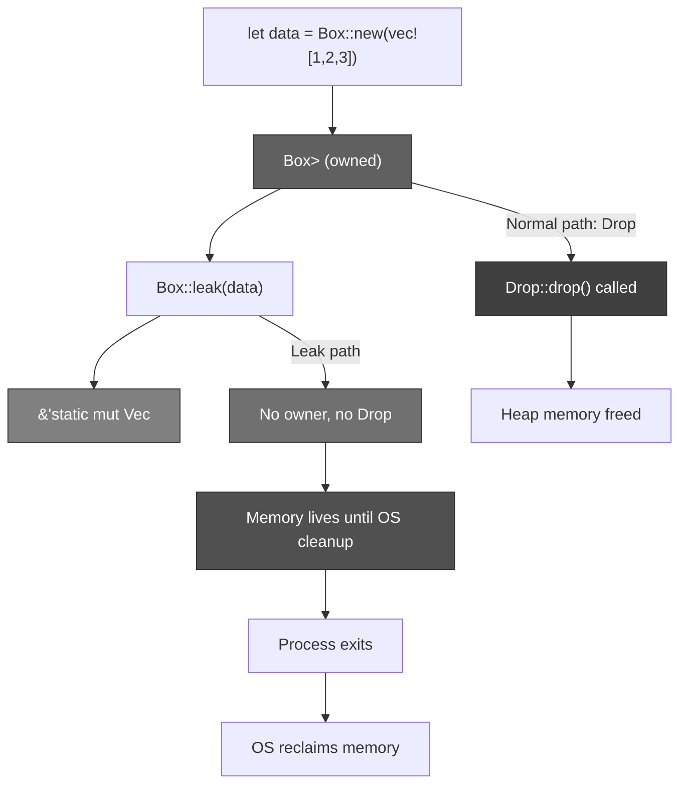
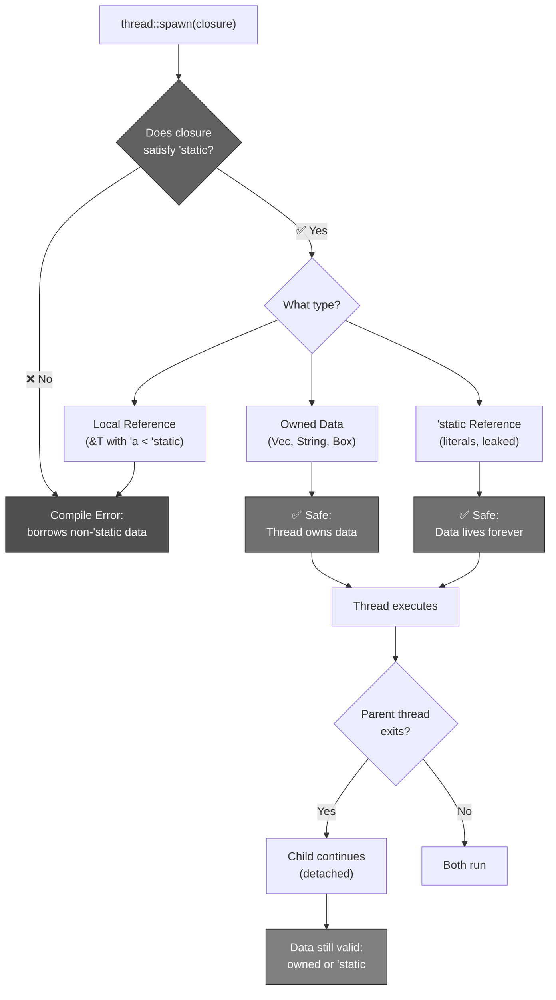
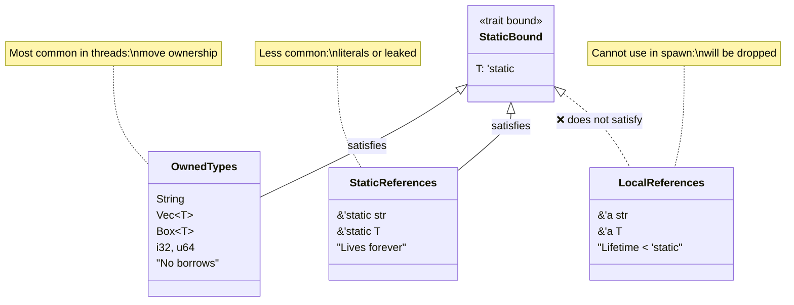
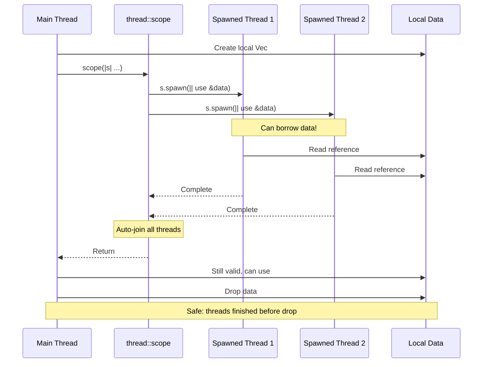
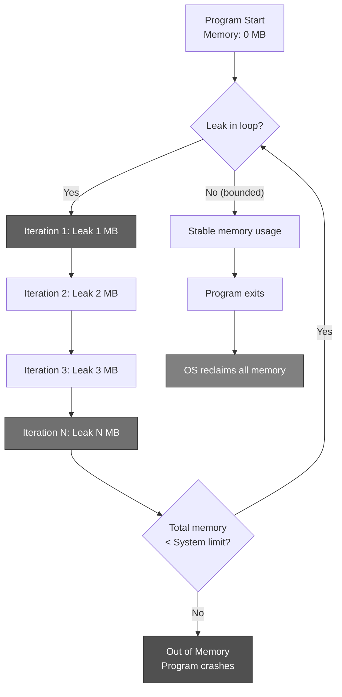
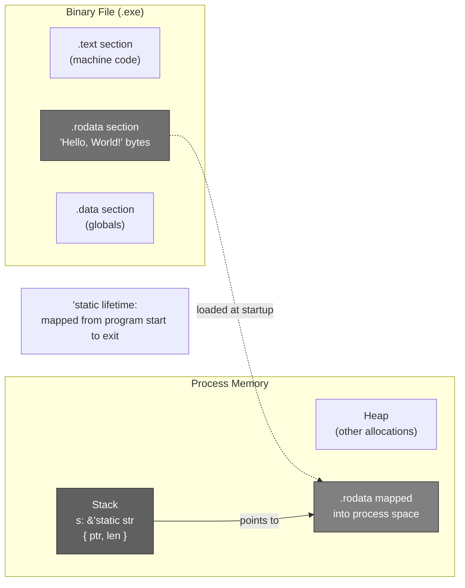
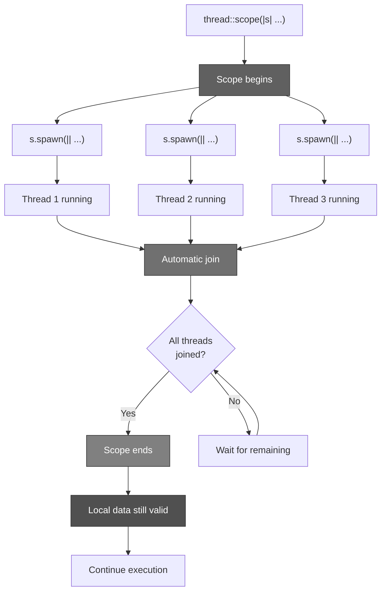
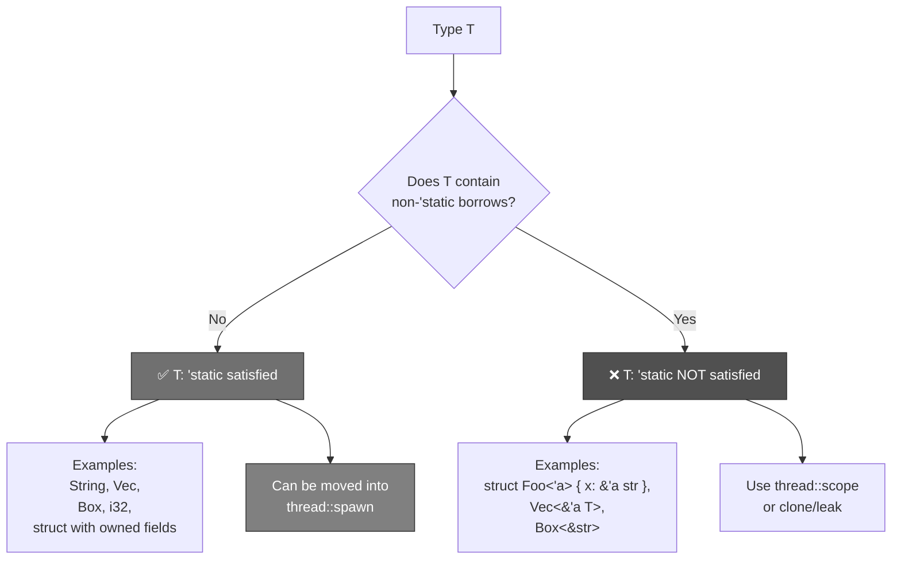

# R75: Rust 'static Lifetime and Memory Leaking Patterns

## PROBLEM

**How can Rust allow spawned threads to outlive their parent threads while maintaining memory safety AND without forcing all thread data to be copied?**

**Answer**: **Rust uses the `'static` lifetime bound to ensure spawned threads only capture data that's either owned (moved into the thread) or guaranteed to live for the program's entire duration. This allows both zero-copy sharing via static data and safe detached threads via `Box::leak`, trading controlled memory leaks for the ability to share heap data across arbitrary thread lifetimes without garbage collection.**

## SOLUTION

### The Core Insight

**Traditional threading models have fundamental tradeoffs**:

1. **Copy everything** (Go, Java) - Safe but wasteful, forces serialization
2. **Garbage collection** (Java, Python) - Safe but runtime overhead + pause times
3. **Manual management** (C/C++) - Fast but unsafe, use-after-free bugs everywhere

**Rust's solution**:
- **`'static` lifetime bound** - Compile-time guarantee that thread data lives "forever"
- **Two paths to `'static`**:
  - Owned data (`Vec<T>`, `String`) - Moves ownership into thread
  - True static references (`&'static T`) - Points to compile-time data or leaked memory
- **`Box::leak`** - Explicit memory leaking to convert heap allocations into `'static` refs
- **Scoped threads** - Alternative that allows borrowing by guaranteeing joins

### The Mental Model: Infinity Stones and Their Guardians

Imagine the **MCU Infinity Stones** guarded across cosmic time:

**The Cosmic Timeline**:
- **'static lifetime** = The Stone exists from the Big Bang until the end of time (program start → exit)
- **Thread lifetime** = A Guardian's mission (might end before universe ends, might not)
- **Local lifetime** = Events on a single planet (definitely ends before universe ends)

**System Architecture**:

1. **The Ancient One's Rule** ('static requirement)
   - When Wong (parent thread) sends a Guardian (spawned thread) with a Stone (data)
   - That Guardian might outlive Wong (detached threads)
   - Therefore: Stone must be either **eternal** ('static) or **owned** by Guardian

2. **Two Types of Eternal Stones** (two paths to 'static):
   - **Original Infinity Stones** (`&'static str` literals) - Existed since Big Bang (compiled into binary)
   - **Created Eternal Artifacts** (`Box::leak`) - Wong creates new artifact, abandons it to cosmic void (intentional memory leak)

3. **Owned Stones** (moved ownership):
   - Guardian creates their own Stone (clones data)
   - Takes full ownership → can keep it forever
   - No lifetime issues because they own it

4. **Sanctum Sanctorum Problem** (local borrowing):
   - Wong wants Guardian to use Sanctum's library books (local references)
   - Guardian might leave Sanctum → books become invalid
   - **Solution**: Scoped threads (Guardians must return books before leaving)

5. **Memory Leaking Strategy** (Box::leak):
   - The Collector's Archive: "I'll never clean this up, OS will when universe ends"
   - Acceptable if: Amount is bounded OR universe (program) is short-lived
   - Danger: Keep leaking → eventually fill all space (OOM)

### Mapping Table

| MCU Concept | Rust Concept | Purpose |
|-------------|--------------|---------|
| Infinity Stone lifetime | `'static` lifetime | Lives entire program duration |
| Guardian mission | Thread lifetime | Arbitrary duration |
| Planet events | Local scope lifetime | Ends before program |
| Original Infinity Stones | String literals `&'static str` | Compiled into binary |
| Created Eternal Artifacts | `Box::leak(data)` | Intentional memory leak → 'static ref |
| Guardian owns Stone | Owned data (Vec, String) | Moved into thread |
| Wong (parent thread) | Spawning thread | Creates child threads |
| Guardian (child thread) | Spawned thread | Might outlive parent |
| Guardian outlives Wong | Detached thread | Parent exits, child continues |
| Sanctum library books | Local references `&T` | Can't leave scope |
| Time Stone constraint | `'static` bound | F: FnOnce() + 'static |
| Scoped mission | `thread::scope` | Must return before scope ends |
| Collector's Archive | Leaked memory | Never deallocated until process exit |
| OS cleans universe | OS reclaims on exit | Process-scoped memory |
| Fill all space | Out-of-memory | Unbounded leaking |

### The Narrative

**Act I: The Detached Guardian Problem**

Wong spawns a Guardian to protect a Sanctum artifact. Wong's mission ends (function returns), but the Guardian continues protecting the artifact indefinitely.

**Problem**: What if the artifact was borrowed from Sanctum's library (local reference)? When Sanctum closes (scope ends), the artifact disappears, but Guardian still holds the reference → use-after-free!

```rust
// ❌ WON'T COMPILE: Guardian references Sanctum artifact after Sanctum closes
fn spawn_guardian() {
    let artifact = vec![1, 2, 3]; // Local to Sanctum
    
    thread::spawn(|| {
        // Guardian tries to use artifact
        println!("Guarding: {:?}", &artifact); // ERROR: artifact not 'static
    });
    
    // Sanctum closes (function returns)
    // artifact dropped
    // Guardian still running with dangling reference!
}
```

**The Ancient One's decree**: Guardians can only guard **eternal** things ('static).

**Act II: Understanding 'static - Two Paths**

The Ancient One explains: "'static means the data lives from Big Bang (program start) to Heat Death (program exit)."

**Path 1: Original Infinity Stones (compile-time data)**

```rust
// String literal stored in binary's read-only data segment
let message: &'static str = "Time Stone activated";

thread::spawn(|| {
    // Guardian can use this forever - it's compiled into the binary
    println!("{}", message); // ✅ WORKS: 'static reference
});
```

**Why this works**: String literals are baked into the executable. They exist in read-only memory for the program's entire lifetime.

**Path 2: Owned Stones (Guardian creates their own)**

```rust
fn spawn_with_owned() {
    let artifact = vec![1, 2, 3]; // Local artifact
    
    thread::spawn(move || {
        // Guardian OWNS their copy
        println!("My artifact: {:?}", artifact); // ✅ WORKS: owned Vec<T>
    });
    
    // Original artifact moved into Guardian
    // Guardian can keep it as long as they want
}
```

**Why this works**: `Vec<T>` doesn't reference external data (it owns its heap allocation). When moved into the closure, the Guardian owns it completely. Owned types satisfy `'static` because ownership can last arbitrarily long.

**Act III: The Leaking Strategy (Box::leak)**

Wong needs a Guardian to protect a large artifact (heap data). Copying is too expensive. Sanctum data isn't available.

**Wong's solution**: Create the artifact, then **abandon it to the cosmic void** - never clean it up. OS will reclaim when universe ends (process exits).

```rust
fn spawn_with_leaked() {
    // Create artifact on heap
    let artifact = Box::new(vec![1, 2, 3, 4, 5]);
    
    // Leak it intentionally → convert Box<T> to &'static mut T
    let static_ref: &'static mut Vec<i32> = Box::leak(artifact);
    
    thread::spawn(move || {
        // Guardian has 'static reference
        static_ref.push(6); // Can mutate
        println!("Artifact: {:?}", static_ref); // ✅ WORKS
    });
    
    // artifact never gets Drop called
    // Memory leaked until process exit
    // OS reclaims when program terminates
}
```

**The tradeoff**: Memory grows unbounded if you keep leaking. Acceptable when:
- Amount is bounded/known upfront
- Program is short-lived (won't hit OOM before exit)
- You really need 'static and can't use owned types

**Act IV: Scoped Missions (thread::scope)**

The Ancient One offers an alternative: **Scoped missions with guaranteed return**.

```rust
use std::thread;

fn scoped_mission() {
    let artifact = vec![1, 2, 3]; // Sanctum artifact
    let midpoint = artifact.len() / 2;
    
    thread::scope(|scope| {
        // Guardian 1: Guards first half
        scope.spawn(|| {
            let first_half = &artifact[..midpoint];
            println!("First: {:?}", first_half); // ✅ Borrowing allowed!
        });
        
        // Guardian 2: Guards second half
        scope.spawn(|| {
            let second_half = &artifact[midpoint..];
            println!("Second: {:?}", second_half); // ✅ Borrowing allowed!
        });
        
        // Both Guardians MUST complete before leaving scope
    }); // Auto-join happens here
    
    // artifact still valid, all Guardians returned
    println!("Original: {:?}", artifact); // ✅ Still accessible
}
```

**Why this works**: `thread::scope` guarantees all spawned threads finish before the scope ends. Since `artifact` lives longer than all threads, borrowing is safe. No 'static needed.

**Act V: The Static Lifetime Signature**

Let's examine `std::thread::spawn`'s signature:

```rust
pub fn spawn<F, T>(f: F) -> JoinHandle<T>
where
    F: FnOnce() -> T + Send + 'static,  // ← The constraint!
    T: Send + 'static,
{
    // ...
}
```

**What `'static` means here**:
- NOT "closure must live forever"
- NOT "closure can only use string literals"
- MEANS: "Closure cannot borrow anything that will be dropped before program exits"

**This allows**:
- ✅ Owned types (Vec, String, Box) - moved into closure
- ✅ &'static references - string literals, static variables, leaked memory
- ❌ Local borrows - will be dropped when scope ends

## ANATOMY

### 'static Lifetime Deep Dive

**Definition**: The `'static` lifetime is a special lifetime annotation that means "valid for the entire program duration."

**Common misconception**: "'static means only string literals"
**Reality**: "'static means either owned OR truly static"

**Two categories**:

1. **'static references** (`&'static T`):
   - Points to data that lives forever
   - Examples: string literals, static variables, leaked heap memory
   - Rare in practice (except string literals)

2. **Types that satisfy 'static bound** (`T: 'static`):
   - Owned types (no borrowed data)
   - Examples: `String`, `Vec<T>`, `i32`, `Box<T>`
   - Very common in threaded code

**Example illustrating the difference**:

```rust
// Type 1: 'static reference (rare)
let s: &'static str = "hello";
thread::spawn(move || println!("{}", s)); // ✅ 'static ref

// Type 2: Owned type satisfying 'static (common)
let owned = String::from("hello");
thread::spawn(move || println!("{}", owned)); // ✅ Owned String

// Type 3: Local reference (won't work)
let local = String::from("hello");
thread::spawn(move || println!("{}", &local)); // ❌ Local borrow
```

### String Literals and Read-Only Data Segment

**Compilation process**:

```rust
let s: &'static str = "Hello, World!";
```

**What happens**:
1. Compiler embeds "Hello, World!" bytes in binary's `.rodata` (read-only data) section
2. `s` is a fat pointer to that embedded data
3. Data lives as long as the binary is loaded (entire program runtime)
4. Multiple instances of the same literal share the same memory location

**Memory layout**:

```text
Binary sections:
  .text     → Machine code
  .rodata   → "Hello, World!" ← String literal lives here
  .data     → Initialized global variables

Stack:
  s = { ptr: &.rodata[offset], len: 13 }
```

**Why it's 'static**: `.rodata` is mapped into process memory at startup, unmapped at exit. Valid for entire program lifetime.

### Box::leak Mechanics

**Signature**:

```rust
impl<T: ?Sized, A: Allocator> Box<T, A> {
    pub fn leak<'a>(b: Box<T, A>) -> &'a mut T 
    where
        A: 'a,
    {
        // Consumes the Box without running Drop
        // Returns a mutable reference with chosen lifetime 'a
        // Caller typically chooses 'static
    }
}
```

**What happens**:

```rust
let boxed = Box::new(vec![1, 2, 3]);
// boxed: Box<Vec<i32>> on heap

let leaked: &'static mut Vec<i32> = Box::leak(boxed);
// 1. Box is consumed (ownership transferred to leak)
// 2. Drop::drop is NOT called
// 3. Heap allocation remains allocated
// 4. Returns mutable reference with 'static lifetime
// 5. No one owns the allocation anymore → memory leak

// leaked points to heap memory that will never be freed
// Until process exits, when OS reclaims it
```

**Key points**:
- Converts owned heap data to 'static reference
- Circumvents Rust's ownership model intentionally
- Memory is "forgotten" by Rust, cleaned up by OS on exit
- Useful for FFI, global state, thread-local storage

### Owned Types and 'static Bound

**What makes a type `T: 'static`?**

A type satisfies the `'static` bound if it doesn't borrow anything with a lifetime shorter than `'static`.

**Examples**:

```rust
// ✅ 'static: No borrows
struct Owned {
    name: String,        // Owns heap data
    count: i32,          // Value type
    items: Vec<u32>,     // Owns heap data
}

// ❌ NOT 'static: Contains non-'static borrow
struct Borrowed<'a> {
    name: &'a str,       // Borrows with lifetime 'a
    count: i32,
}

// ✅ 'static: Borrows 'static reference
struct StaticBorrow {
    name: &'static str,  // 'static borrow is fine
    count: i32,
}

// ✅ 'static: Generic over T: 'static
struct Container<T: 'static> {
    data: T,             // T must not contain non-'static borrows
}
```

**In practice**:

```rust
fn spawn_owned<T: Send + 'static>(data: T) -> thread::JoinHandle<()> {
    thread::spawn(move || {
        // Can use data here
        drop(data);
    })
}

// ✅ WORKS: String is owned
spawn_owned(String::from("hello"));

// ✅ WORKS: Vec<i32> is owned
spawn_owned(vec![1, 2, 3]);

// ✅ WORKS: i32 is Copy (implicitly 'static)
spawn_owned(42);

// ❌ WON'T COMPILE: &str borrows from somewhere
// spawn_owned(&local_string[..]);
```

### thread::spawn vs thread::scope

**Comparison**:

| Feature | thread::spawn | thread::scope |
|---------|---------------|---------------|
| **Join guarantee** | Manual (via JoinHandle) | Automatic at scope end |
| **Lifetime bound** | `'static` required | Can borrow from environment |
| **Detachment** | Can detach (leak handle) | Cannot detach |
| **Use case** | Long-running, independent threads | Parallel computation over local data |
| **Overhead** | None (no join tracking) | Minimal (scope bookkeeping) |

**thread::spawn example**:

```rust
use std::thread;

let data = String::from("hello");

// ❌ WON'T COMPILE: data not 'static
// let handle = thread::spawn(|| {
//     println!("{}", &data);
// });

// ✅ WORKS: Move ownership
let handle = thread::spawn(move || {
    println!("{}", data); // data moved into closure
});

handle.join().unwrap();
// data no longer accessible here (moved)
```

**thread::scope example**:

```rust
use std::thread;

let data = String::from("hello");

thread::scope(|s| {
    // ✅ WORKS: Can borrow data
    s.spawn(|| {
        println!("{}", &data); // Borrowing allowed!
    });
    
    s.spawn(|| {
        println!("{}", &data); // Multiple borrows OK
    });
}); // All spawned threads joined here

// data still accessible
println!("{}", data);
```

**When to use which**:

- **thread::spawn**: Background tasks, servers, long-running workers
- **thread::scope**: Parallel iteration, divide-and-conquer, bounded parallelism

### Static Variables

**Global static data**:

```rust
// Immutable static
static GREETING: &str = "Hello, World!";

// Mutable static (unsafe to access)
static mut COUNTER: u32 = 0;

fn use_statics() {
    thread::spawn(|| {
        // ✅ Accessing immutable static is safe
        println!("{}", GREETING);
    });
    
    thread::spawn(|| {
        // ⚠️ Accessing mutable static requires unsafe
        unsafe {
            COUNTER += 1;
            println!("Count: {}", COUNTER);
        }
    });
}
```

**Why immutable statics are safe**:
- Read-only access from any thread
- No data races (immutable → no writes)
- Lives for entire program → always valid

**Why mutable statics are unsafe**:
- Multiple threads can access simultaneously
- No synchronization enforced
- Data race potential
- Requires unsafe block + manual synchronization

**Better alternative**: Use `static` with `Mutex` or atomic types:

```rust
use std::sync::Mutex;

static COUNTER: Mutex<u32> = Mutex::new(0);

fn increment() {
    let mut count = COUNTER.lock().unwrap();
    *count += 1;
}
```

## PATTERNS AND USE CASES

### Pattern 1: Thread Pools with Leaked Shared State

**Problem**: Thread pool needs access to shared configuration that outlives all threads.

```rust
use std::thread;

struct Config {
    max_connections: usize,
    timeout_ms: u64,
}

fn create_thread_pool(config: Config) -> Vec<thread::JoinHandle<()>> {
    // Leak config to get 'static reference
    let config: &'static Config = Box::leak(Box::new(config));
    
    (0..4)
        .map(|id| {
            thread::spawn(move || {
                // All threads share the same config
                println!("Worker {} with max_conn: {}", 
                         id, config.max_connections);
            })
        })
        .collect()
}

// Usage:
let pool = create_thread_pool(Config {
    max_connections: 100,
    timeout_ms: 5000,
});

for handle in pool {
    handle.join().unwrap();
}

// Config leaked - OS will clean up on exit
```

**When to use**: Long-lived servers where config lives for entire process anyway.

### Pattern 2: Lazy Static Initialization

**Problem**: Need global state initialized once, accessed from many threads.

```rust
use std::sync::OnceLock;

// OnceLock provides thread-safe lazy initialization
static LOGGER: OnceLock<Logger> = OnceLock::new();

struct Logger {
    name: String,
}

impl Logger {
    fn log(&self, msg: &str) {
        println!("[{}] {}", self.name, msg);
    }
}

fn get_logger() -> &'static Logger {
    LOGGER.get_or_init(|| Logger {
        name: String::from("GlobalLogger"),
    })
}

fn worker_thread() {
    thread::spawn(|| {
        let logger = get_logger(); // ✅ Returns &'static Logger
        logger.log("Worker started");
    });
}
```

**Advantages**:
- No memory leak (OnceLock deallocates on exit)
- Thread-safe initialization
- 'static lifetime for all accessors

### Pattern 3: FFI with C Libraries

**Problem**: C library expects pointers that live for entire program.

```rust
use std::ffi::CString;

extern "C" {
    fn register_callback(name: *const i8);
}

fn register_rust_callback() {
    let name = CString::new("rust_callback").unwrap();
    
    // Leak to ensure pointer stays valid
    let static_name: &'static CStr = Box::leak(name.into_boxed_c_str());
    
    unsafe {
        register_callback(static_name.as_ptr());
    }
    
    // C library can use this pointer forever
    // No Rust cleanup will invalidate it
}
```

**Critical use case**: Passing Rust data to C code that expects stable pointers.

### Pattern 4: Scoped Parallel Iteration

**Problem**: Sum elements of large array in parallel.

```rust
use std::thread;

fn parallel_sum(data: &[i32]) -> i32 {
    let chunk_size = data.len() / 4;
    
    thread::scope(|s| {
        let handles: Vec<_> = data
            .chunks(chunk_size)
            .map(|chunk| {
                // ✅ Can borrow chunk (part of data)
                s.spawn(move || chunk.iter().sum::<i32>())
            })
            .collect();
        
        // Collect results from all threads
        handles
            .into_iter()
            .map(|h| h.join().unwrap())
            .sum()
    }) // All threads joined here, data still valid
}

// Usage:
let numbers: Vec<i32> = (1..=1000).collect();
let sum = parallel_sum(&numbers);
println!("Sum: {}", sum);
```

**Advantages**:
- Zero-copy parallelism
- Borrow checker ensures safety
- Clean, functional style

### Pattern 5: Owned Data in Long-Running Threads

**Problem**: Background worker needs to process owned data.

```rust
use std::sync::mpsc;
use std::thread;

struct Task {
    id: usize,
    data: Vec<u8>,
}

fn spawn_worker() -> mpsc::Sender<Task> {
    let (tx, rx) = mpsc::channel();
    
    thread::spawn(move || {
        // Worker owns the receiver
        for task in rx {
            // Task is owned by this thread
            process_task(task);
        }
    });
    
    tx // Return sender for main thread
}

fn process_task(task: Task) {
    println!("Processing task {}", task.id);
    // task dropped here, data freed
}

// Usage:
let worker = spawn_worker();
worker.send(Task { id: 1, data: vec![1, 2, 3] }).unwrap();
```

**Pattern**: Move ownership of each task into the thread. No 'static issues.

### Pattern 6: Thread-Local Storage with Leaked Data

**Problem**: Each thread needs its own cached data structure.

```rust
use std::cell::RefCell;
use std::collections::HashMap;
use std::thread;

thread_local! {
    static CACHE: RefCell<HashMap<String, i32>> = RefCell::new(HashMap::new());
}

fn get_cached(key: &str) -> Option<i32> {
    CACHE.with(|cache| cache.borrow().get(key).copied())
}

fn set_cached(key: String, value: i32) {
    CACHE.with(|cache| cache.borrow_mut().insert(key, value));
}

// Each thread gets its own CACHE
let handles: Vec<_> = (0..3)
    .map(|id| {
        thread::spawn(move || {
            set_cached(format!("key{}", id), id);
            get_cached(&format!("key{}", id))
        })
    })
    .collect();
```

**Pattern**: thread_local! provides per-thread 'static storage automatically.

### Pattern 7: Bounded Memory Leak for Caching

**Problem**: Cache that grows but has maximum size.

```rust
use std::collections::VecDeque;
use std::sync::Mutex;

struct BoundedCache {
    items: Mutex<VecDeque<Box<[u8]>>>,
    max_size: usize,
}

impl BoundedCache {
    fn new(max_size: usize) -> &'static Self {
        // Leak bounded structure
        Box::leak(Box::new(BoundedCache {
            items: Mutex::new(VecDeque::new()),
            max_size,
        }))
    }
    
    fn add(&'static self, data: Vec<u8>) {
        let mut items = self.items.lock().unwrap();
        
        if items.len() >= self.max_size {
            // Drop oldest
            items.pop_front();
        }
        
        items.push_back(data.into_boxed_slice());
    }
}

// Usage:
let cache = BoundedCache::new(100); // Max 100 items

thread::spawn(move || {
    cache.add(vec![1, 2, 3]);
});
```

**Safe because**: Total leaked memory is bounded (max_size * item_size).

### Pattern 8: Avoiding 'static with Scoped Channels

**Problem**: Parent thread needs results from child threads without 'static.

```rust
use std::sync::mpsc;
use std::thread;

fn process_chunks(data: &[i32]) -> Vec<i32> {
    let chunk_size = data.len() / 4;
    
    thread::scope(|s| {
        let (tx, rx) = mpsc::channel();
        
        for chunk in data.chunks(chunk_size) {
            let tx = tx.clone();
            // ✅ Can borrow chunk
            s.spawn(move || {
                let sum: i32 = chunk.iter().sum();
                tx.send(sum).unwrap();
            });
        }
        drop(tx); // Close channel
        
        // Collect results
        rx.iter().collect()
    })
}
```

**Pattern**: Combine scoped threads with channels for complex communication.

### Pattern 9: Static Constants vs Static Variables

**Pattern**: Use `const` for compile-time constants, `static` for runtime globals.

```rust
// ✅ Compile-time constant (inlined everywhere)
const MAX_SIZE: usize = 1024;

// ✅ Runtime static (single memory location)
static BANNER: &str = "Application v1.0";

// ✅ Mutable static with synchronization
static COUNTER: AtomicUsize = AtomicUsize::new(0);

fn use_constants() {
    // const is copy-pasted at compile time
    let buffer = vec![0u8; MAX_SIZE];
    
    // static has single memory location
    println!("{}", BANNER);
    
    // Atomic operations are safe without unsafe
    COUNTER.fetch_add(1, Ordering::SeqCst);
}
```

**Rule of thumb**:
- `const`: Values, small data, inlined everywhere
- `static`: Addresses, large data, shared state

### Pattern 10: Converting Local to 'static via Clone + Leak

**Problem**: Need 'static ref to local data without moving.

```rust
use std::thread;

fn spawn_with_clone<T: Clone + Send + 'static>(data: &T) -> thread::JoinHandle<()> {
    let data_clone = data.clone();
    thread::spawn(move || {
        // Use data_clone
        drop(data_clone);
    })
}

// Alternative: Clone + Leak
fn spawn_with_leaked_clone<T: Clone>(data: &T) -> thread::JoinHandle<()> {
    let leaked: &'static T = Box::leak(Box::new(data.clone()));
    thread::spawn(move || {
        // Multiple threads can share this 'static ref
        println!("{:?}", leaked);
    })
}
```

**Tradeoff**: Clone cost vs memory leak.

## DIAGRAMS

### Diagram 1: 'static Lifetime Timeline

```mermaid
gantt
    title Lifetime Comparison
    dateFormat X
    axisFormat %s
    
    section Program
    Program Start     :milestone, m1, 0, 0
    Program Running   :active, prog, 0, 100
    Program Exit      :milestone, m2, 100, 0
    
    section 'static Data
    String Literals   :crit, static1, 0, 100
    Leaked Memory     :crit, static2, 20, 80
    Static Variables  :crit, static3, 0, 100
    
    section Spawned Thread
    Thread Spawn      :milestone, t1, 30, 0
    Thread Running    :active, thread, 30, 90
    Thread Join/Exit  :milestone, t2, 120, 0
    
    section Local Data
    Local Scope       :local, 40, 60
    
    note: 'static spans entire program
    note: Thread can outlive parent
    note: Local data invalid after scope
```



### Diagram 2: Box::leak Memory Transformation



### Diagram 3: thread::spawn 'static Requirement



### Diagram 4: Owned vs 'static Reference



### Diagram 5: thread::scope vs thread::spawn



### Diagram 6: Memory Leak Growth Pattern



### Diagram 7: String Literal Memory Layout



### Diagram 8: Detached Thread Lifetime

```mermaid
stateDiagram-v2
    direction LR
    
    [*] --> ParentStart: Program starts
    ParentStart --> ParentRunning: Parent thread runs
    
    ParentRunning --> SpawnChild: thread::spawn
    SpawnChild --> BothRunning: Parent + Child both run
    
    BothRunning --> ParentExits: Parent function returns
    ParentExits --> ChildOnly: Child thread detached
    
    ChildOnly --> ChildExits: Child completes
    ChildExits --> [*]: Process may continue
    
    note right of SpawnChild: Closure must be 'static
    note right of ParentExits: Child continues independently
    note right of ChildOnly: Detached thread pattern
```

### Diagram 9: Scoped Thread Guarantee



### Diagram 10: Owned Type Satisfaction of 'static



## COMPARISON WITH OTHER APPROACHES

### Rust 'static vs Garbage Collection (Java/Python)

| Aspect | Rust 'static | GC Languages |
|--------|--------------|--------------|
| **Memory safety** | Compile-time guaranteed | Runtime checked |
| **Thread data** | Must be 'static or owned | Any reference works |
| **Overhead** | Zero runtime cost | GC pauses, memory overhead |
| **Detached threads** | 'static bound prevents use-after-free | GC tracks references |
| **Explicit leaks** | Box::leak for intentional leaks | Leaks possible but hidden |
| **Developer burden** | Must understand lifetimes | Easier to use |
| **Performance** | Predictable, no GC pauses | Unpredictable GC pauses |

### Rust 'static vs C++ Reference Semantics

| Aspect | Rust 'static | C++ References/Pointers |
|--------|--------------|------------------------|
| **Lifetime tracking** | Compiler-enforced | Manual, error-prone |
| **Thread safety** | Checked at compile-time | Unchecked, runtime bugs |
| **Dangling pointers** | Impossible with safe code | Common source of bugs |
| **Explicit leaks** | Box::leak | new without delete |
| **Smart pointers** | Arc, Box with clear semantics | shared_ptr, weak_ptr |
| **Learning curve** | Steep (borrow checker) | Moderate (manual management) |

### Rust thread::scope vs Go Goroutines

| Aspect | Rust thread::scope | Go Goroutines |
|--------|-------------------|---------------|
| **Borrowing data** | Explicit, compile-time safe | Implicit, runtime checked |
| **Join guarantee** | Automatic at scope end | Manual with WaitGroup |
| **Data races** | Impossible (checked) | Possible (race detector) |
| **Overhead** | OS threads | Green threads (lighter) |
| **Expressiveness** | More verbose | Concise |
| **Performance** | No GC overhead | GC overhead |

### Rust 'static vs JavaScript Closures

| Aspect | Rust 'static | JavaScript Closures |
|--------|--------------|---------------------|
| **Capture semantics** | Explicit move or borrow | Implicit capture by reference |
| **Lifetime issues** | Compile-time errors | Runtime crashes |
| **Memory model** | Manual with safety | GC handles everything |
| **Concurrency** | Threads with Send/Sync | Single-threaded (+ Workers) |
| **Learning curve** | Steep | Gentle |

## BEST PRACTICES AND GOTCHAS

### Best Practice 1: Prefer thread::scope Over Box::leak

**Why**: Scoped threads avoid memory leaks and are clearer in intent.

```rust
// ❌ WORKS but leaks memory
fn parallel_process_leak(data: &[i32]) -> i32 {
    let leaked: &'static [i32] = Box::leak(data.to_vec().into_boxed_slice());
    
    let handles: Vec<_> = (0..4)
        .map(|i| {
            let chunk = &leaked[i * 10..(i + 1) * 10];
            thread::spawn(move || chunk.iter().sum::<i32>())
        })
        .collect();
    
    handles.into_iter().map(|h| h.join().unwrap()).sum()
}

// ✅ BETTER: Use scoped threads
fn parallel_process_scoped(data: &[i32]) -> i32 {
    thread::scope(|s| {
        let handles: Vec<_> = (0..4)
            .map(|i| {
                let chunk = &data[i * 10..(i + 1) * 10];
                s.spawn(move || chunk.iter().sum::<i32>())
            })
            .collect();
        
        handles.into_iter().map(|h| h.join().unwrap()).sum()
    })
}
```

### Best Practice 2: Use 'static for Long-Lived Threads Only

**Principle**: Reserve 'static for truly long-lived or detached threads.

```rust
// ✅ GOOD: Long-lived server thread
fn start_server(config: Config) {
    let config: &'static Config = Box::leak(Box::new(config));
    
    thread::spawn(move || {
        // Server runs for process lifetime
        run_server(config);
    });
}

// ❌ WASTEFUL: Short computation
fn compute_sum_bad(numbers: Vec<i32>) -> i32 {
    let leaked: &'static Vec<i32> = Box::leak(Box::new(numbers));
    
    thread::spawn(move || leaked.iter().sum())
        .join()
        .unwrap()
}

// ✅ BETTER: Move ownership or use scope
fn compute_sum_good(numbers: Vec<i32>) -> i32 {
    thread::spawn(move || numbers.iter().sum())
        .join()
        .unwrap()
}
```

### Best Practice 3: Document Intentional Leaks

```rust
use std::sync::Once;

static INIT: Once = Once::new();

fn initialize_global_logger() {
    INIT.call_once(|| {
        let logger = create_logger();
        
        // INTENTIONAL LEAK: Logger needs 'static lifetime for global access
        // Memory is bounded (single instance) and process-scoped.
        let logger: &'static Logger = Box::leak(Box::new(logger));
        
        set_global_logger(logger);
    });
}
```

### Best Practice 4: Understand 'static Does Not Mean Immutable

```rust
use std::sync::Mutex;

// 'static mutable reference
fn get_mutable_static() -> &'static Mutex<Vec<i32>> {
    static SHARED: Mutex<Vec<i32>> = Mutex::new(Vec::new());
    &SHARED
}

// ✅ Can mutate through 'static reference
fn modify_static() {
    let shared = get_mutable_static();
    shared.lock().unwrap().push(42);
}
```

**Insight**: `'static` describes lifetime, not mutability. You can have `&'static mut T`.

### Best Practice 5: Avoid 'static in Function Return Types When Possible

```rust
// ❌ CONSTRAINING: Forces caller to provide 'static
fn process_string(s: &'static str) -> usize {
    s.len()
}

// ✅ FLEXIBLE: Works with any lifetime
fn process_string_generic(s: &str) -> usize {
    s.len()
}

// Can call with non-'static:
let local = String::from("hello");
let len = process_string_generic(&local); // ✅ Works
// let len = process_string(&local); // ❌ Compile error
```

### Gotcha 1: 'static Bound vs 'static Lifetime

**Confusion**: `T: 'static` doesn't mean "T is a reference that lives forever"

```rust
// This is 'static BOUND (common)
fn spawn_owned<T: Send + 'static>(data: T) {
    thread::spawn(move || {
        // data can be String, Vec, etc. (owned types)
    });
}

// This is 'static LIFETIME (rare)
fn spawn_ref(data: &'static str) {
    thread::spawn(move || {
        // data must be string literal or leaked
    });
}

// ✅ WORKS: String satisfies 'static bound (owned)
spawn_owned(String::from("hello"));

// ❌ WON'T WORK: String is not a 'static reference
// spawn_ref(&String::from("hello"));

// ✅ WORKS: String literal is 'static reference
spawn_ref("hello");
```

### Gotcha 2: Leaked Memory Is Never Deallocated by Rust

```rust
fn leak_in_loop() {
    loop {
        let data = vec![0u8; 1024 * 1024]; // 1 MB
        let _leaked: &'static mut Vec<u8> = Box::leak(Box::new(data));
        
        // This leaks 1 MB per iteration!
        // Eventually will OOM
    }
}
```

**Solution**: Only leak when amount is bounded or process is short-lived.

### Gotcha 3: Static Variables Require Const Initialization

```rust
// ❌ WON'T COMPILE: Vec::new() is not const
// static GLOBAL_VEC: Vec<i32> = Vec::new();

// ✅ WORKS: Const value
static GLOBAL_ARRAY: [i32; 3] = [1, 2, 3];

// ✅ WORKS: Use OnceLock for runtime initialization
use std::sync::OnceLock;
static GLOBAL_VEC: OnceLock<Vec<i32>> = OnceLock::new();

fn get_vec() -> &'static Vec<i32> {
    GLOBAL_VEC.get_or_init(|| vec![1, 2, 3])
}
```

### Gotcha 4: String Literals Are &'static str, Not String

```rust
// ✅ This is 'static
let s: &'static str = "hello";

// ❌ This is NOT 'static (it's String, which is owned)
let s: String = "hello".to_string();

// To get 'static String reference, must leak:
let s: &'static String = Box::leak(Box::new(String::from("hello")));
```

### Gotcha 5: Clone Before Spawn Does Not Satisfy 'static

```rust
fn spawn_with_clone() {
    let data = vec![1, 2, 3];
    
    // ❌ WON'T COMPILE: closure captures &data
    // thread::spawn(|| {
    //     let cloned = data.clone();
    //     drop(cloned);
    // });
    
    // ✅ WORKS: Clone before closure
    let data_clone = data.clone();
    thread::spawn(move || {
        drop(data_clone);
    });
}
```

**Key**: Closure captures happen before the body runs. Must clone outside closure, then move the clone.

### Gotcha 6: Box::leak Returns Mutable Reference

```rust
let data = vec![1, 2, 3];
let leaked: &'static mut Vec<i32> = Box::leak(Box::new(data));

// ⚠️ Can mutate through leaked reference
leaked.push(4);

// ❌ Can't share mutable reference between threads directly
// Need to wrap in Mutex or similar
```

**Solution**: Wrap leaked data in `Arc<Mutex<T>>` if sharing between threads.

### Gotcha 7: Scoped Threads Can't Be Detached

```rust
thread::scope(|s| {
    let handle = s.spawn(|| {
        thread::sleep(Duration::from_secs(10));
    });
    
    // ❌ CAN'T: Drop handle to detach
    // drop(handle);
    
    // Scope WILL wait for thread to complete
});
```

**Design choice**: Scoped threads guarantee joining for safety. Use `thread::spawn` for detachment.

## FURTHER READING

### Official Documentation
- [std::thread::spawn](https://doc.rust-lang.org/std/thread/fn.spawn.html)
- [std::thread::scope](https://doc.rust-lang.org/std/thread/fn.scope.html)
- [The 'static Lifetime](https://doc.rust-lang.org/book/ch10-03-lifetime-syntax.html#the-static-lifetime)
- [Box::leak](https://doc.rust-lang.org/std/boxed/struct.Box.html#method.leak)

### Conceptual Resources
- [Common Rust Lifetime Misconceptions](https://github.com/pretzelhammer/rust-blog/blob/master/posts/common-rust-lifetime-misconceptions.md)
- [Understanding Rust's 'static Lifetime](https://blog.thoughtram.io/lifetimes-in-rust/)
- [Data Segment (Wikipedia)](https://en.wikipedia.org/wiki/Data_segment)

### Advanced Topics
- [OnceLock for Lazy Static Initialization](https://doc.rust-lang.org/std/sync/struct.OnceLock.html)
- [Thread-Local Storage](https://doc.rust-lang.org/std/macro.thread_local.html)
- [Memory Ordering and Atomics](https://doc.rust-lang.org/nomicon/atomics.html)

---

**Key Takeaway**: Rust's `'static` lifetime bound enables safe multi-threading without garbage collection by guaranteeing that spawned threads only capture data that's either owned (moved into the thread) or truly permanent (lives for program duration). This compile-time check prevents use-after-free bugs while allowing both zero-copy parallelism (via scoped threads) and detached long-running threads (via 'static). `Box::leak` provides an escape hatch to intentionally leak heap memory for cases requiring 'static references with bounded cost.
