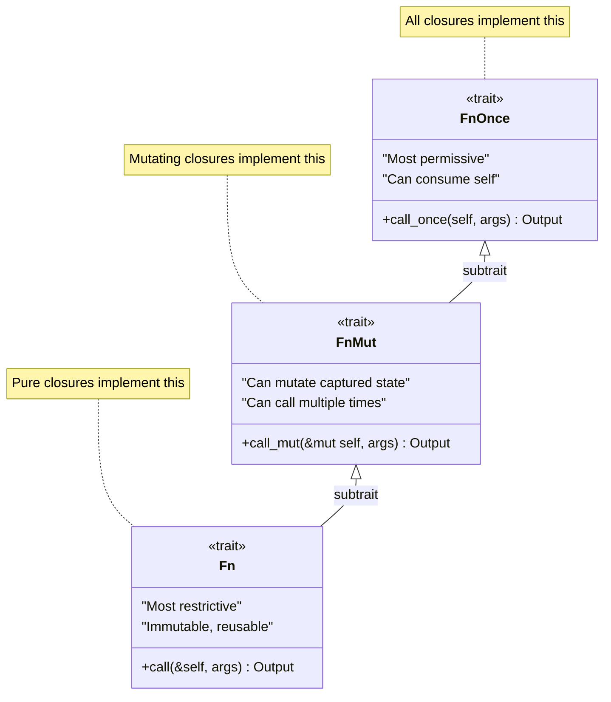
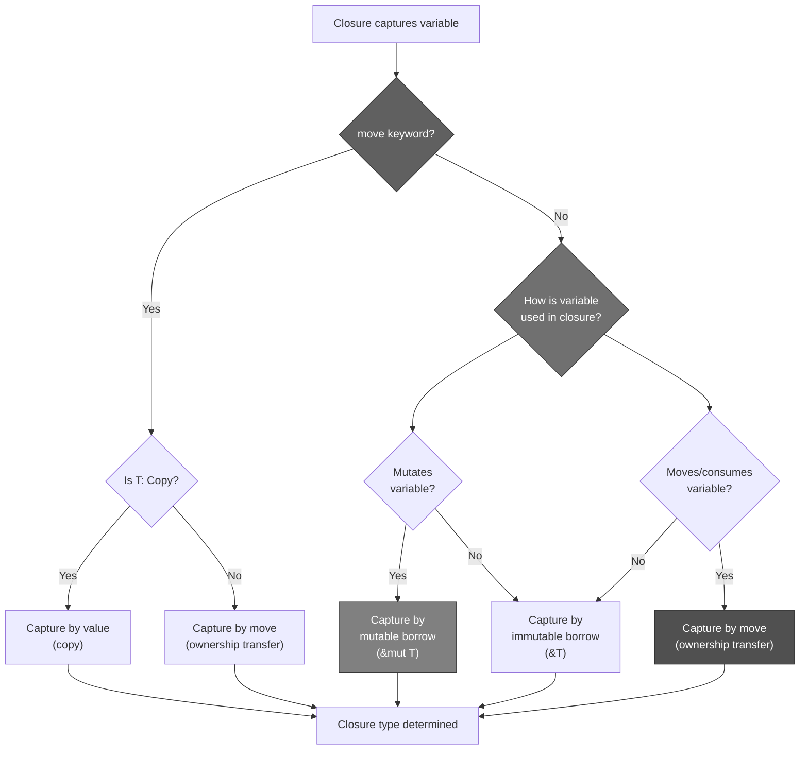
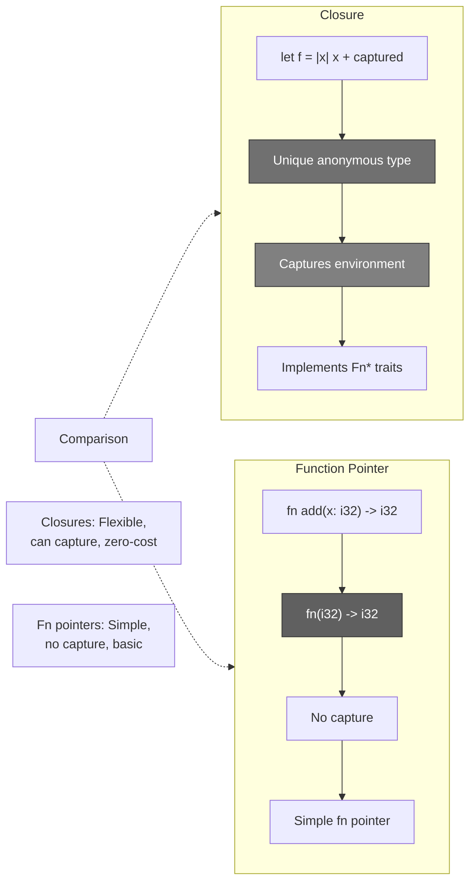
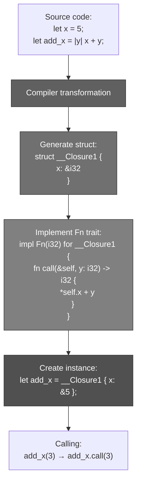
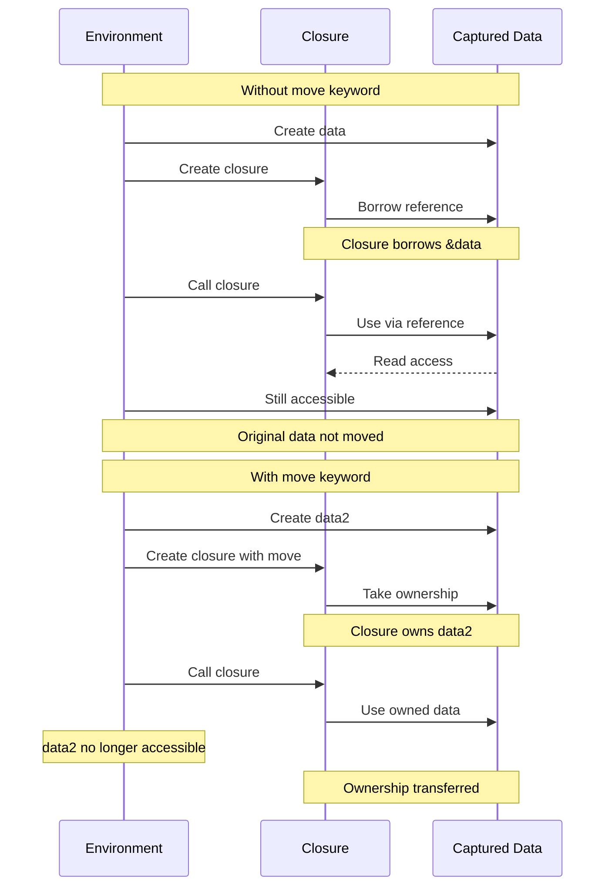
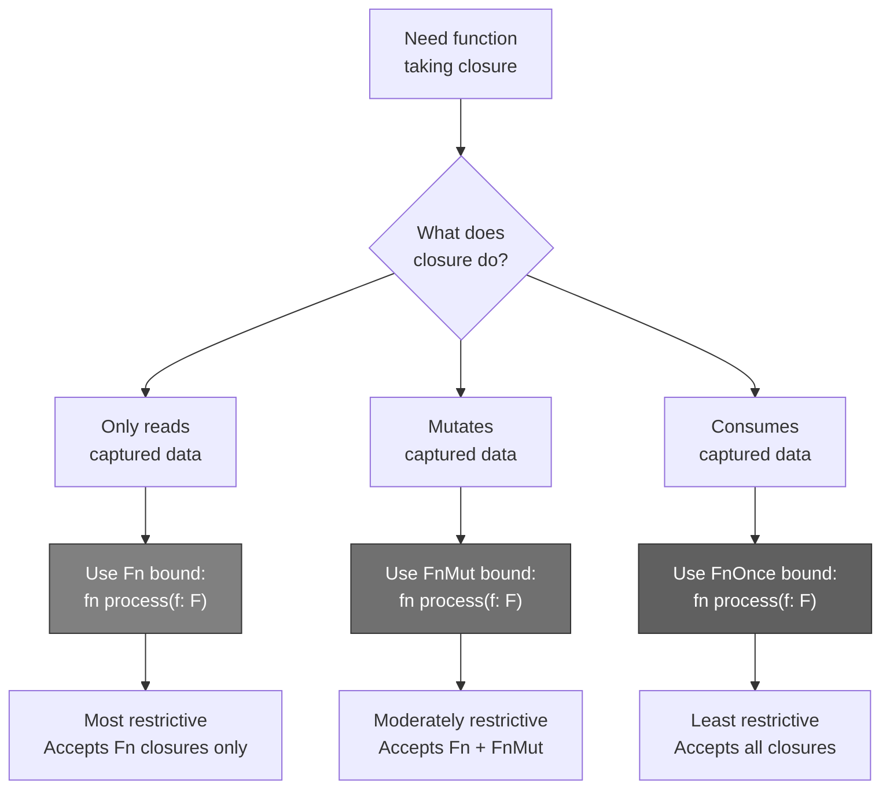
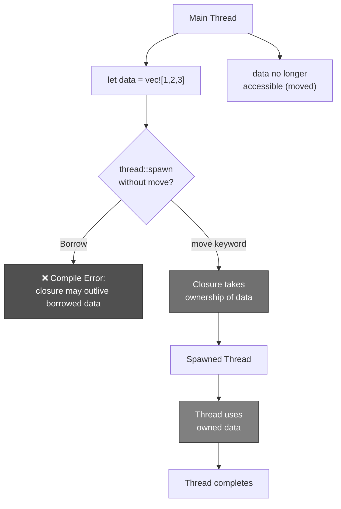
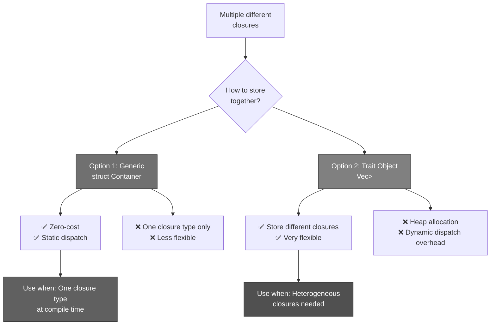
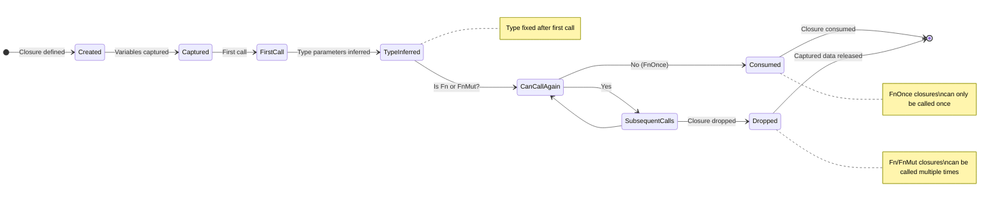

# R76: Rust Closures and Fn Trait Hierarchy

## PROBLEM

**How can Rust provide first-class anonymous functions that capture their environment safely while maintaining zero-cost abstraction AND compile-time memory safety?**

**Answer**: **Rust implements closures as anonymous structs that automatically capture environment variables through the Fn/FnMut/FnOnce trait hierarchy, with the compiler inferring the minimal capture mode (borrow, mutable borrow, or move) needed. This allows closures to be zero-cost abstractions (often inlined) while the trait system ensures that mutable access and ownership transfer are checked at compile-time, preventing data races and use-after-move bugs.**

## SOLUTION

### The Core Insight

**Traditional closure implementations have tradeoffs**:

1. **Function pointers** (C) - No environment capture, limited expressiveness
2. **Heap-allocated closures** (JavaScript, Python) - Runtime overhead, garbage collection needed
3. **Manual capture** (C++ before C++11) - Verbose, error-prone
4. **Lambda capture** (C++) - Flexible but unsafe, easy to create dangling references

**Rust's solution**:
- **Closures are anonymous structs** - Each closure has unique type
- **Three traits: Fn, FnMut, FnOnce** - Express different calling capabilities
- **Automatic capture inference** - Compiler determines minimal capture mode
- **Move semantics** - `move` keyword forces ownership transfer
- **Zero-cost** - Often inlined, no runtime overhead
- **Compile-time safety** - Borrow checker validates all captures

### The Mental Model: Doctor Strange's Spell Scrolls

Imagine **Doctor Strange's magical spell system** from the MCU:

**The Sanctum Library System**:
- **Spell scrolls** (closures) are created by sorcerers (functions)
- Each scroll **captures mystical energy** from the environment (captured variables)
- Scrolls can be **invoked multiple times** or **consumed** when cast

**System Architecture**:

1. **The Three Casting Methods** (Fn/FnMut/FnOnce hierarchy)
   - **Fn** = Spell that can be cast infinitely without changing reality (immutable borrows)
   - **FnMut** = Spell that modifies reality each time cast (mutable borrows)
   - **FnOnce** = Spell that consumes itself when cast, one-time use (moves/consumes)

2. **Energy Capture Modes** (capture semantics)
   - **Borrow** (`&T`) = Scroll references ambient energy, doesn't consume it
   - **Mutable Borrow** (`&mut T`) = Scroll channels energy, modifying it temporarily
   - **Move** (`T`) = Scroll absorbs energy permanently into its fabric

3. **The Ancient One's Rule** (automatic inference)
   - Doctor Strange writes spell, compiler (Ancient One) determines minimal capture needed
   - If scroll only reads from Time Stone → immutable borrow
   - If scroll modifies Space Stone → mutable borrow
   - If scroll consumes Reality Stone → ownership transfer

4. **Force Move Incantation** (`move` keyword)
   - Wong says "I need this scroll to work even after library closes" (outlive scope)
   - Adds `move` keyword → scroll absorbs all referenced energy permanently
   - Essential for sending scrolls to other dimensions (threads)

5. **Scroll Types** (closure types)
   - Each scroll has unique mystical signature (unique type)
   - Can't store different scrolls in same grimoire directly (different types)
   - Solution: Use trait objects (`Box<dyn Fn()>`) or generic bounds

### Mapping Table

| MCU Concept | Rust Concept | Purpose |
|-------------|--------------|---------|
| Spell scroll | Closure | Anonymous function |
| Casting a spell | Calling closure | Invoking `closure()` |
| Cast infinitely | `Fn` trait | Immutable borrow, multiple calls |
| Cast with reality changes | `FnMut` trait | Mutable borrow, multiple calls |
| Cast once, consume scroll | `FnOnce` trait | Moves/consumes, single call |
| Reference ambient energy | Capture by borrow `&T` | Read-only access |
| Channel energy temporarily | Capture by mut borrow `&mut T` | Mutable access |
| Absorb energy permanently | Capture by move `T` | Ownership transfer |
| Ancient One analyzes spell | Compiler inference | Determines capture mode |
| Force absorption | `move` keyword | Forces ownership transfer |
| Unique mystical signature | Unique closure type | Each closure has distinct type |
| Generic spell container | `impl Fn()` | Generic over closure type |
| Trait object grimoire | `Box<dyn Fn()>` | Store different closures |
| Spell sent to other dimension | Closure sent to thread | Requires `move` + `'static` |
| Library closing | Scope ending | Variables being dropped |
| Scroll outlives library | Closure outlives scope | `move` prevents dangling refs |

### The Narrative

**Act I: The Basic Spell (Simple Closures)**

Doctor Strange creates his first spell scroll:

```rust
// Simple spell that adds mystic energy
let mystic_energy = 42;
let amplify = |x| x + mystic_energy;  // Closure capturing mystic_energy

let result = amplify(10);  // 52
println!("Amplified: {}", result);
```

**What happened**:
- `amplify` is a closure (spell scroll)
- Captures `mystic_energy` from environment by immutable borrow
- Can be called multiple times (implements `Fn` trait)

**Act II: Reality-Altering Spells (FnMut)**

Doctor Strange creates a spell that modifies reality each time it's cast:

```rust
let mut reality_counter = 0;

// Spell that alters reality (needs mutable access)
let mut alter_reality = || {
    reality_counter += 1;  // Modifies captured variable
    println!("Reality altered {} times", reality_counter);
};

alter_reality();  // Reality altered 1 times
alter_reality();  // Reality altered 2 times
alter_reality();  // Reality altered 3 times

// ✅ Can call multiple times, but need `mut` binding
```

**What happened**:
- Closure captures `reality_counter` by mutable borrow
- Implements `FnMut` trait (not `Fn`)
- Closure binding must be `mut` because it needs mutable access
- Can be called multiple times, each time modifying state

**Act III: One-Time Consumable Spells (FnOnce)**

Doctor Strange creates a spell that consumes the Eye of Agamotto when cast:

```rust
let eye_of_agamotto = String::from("Time Stone");

// Spell that consumes the Eye when cast
let consume_time_stone = || {
    println!("Using: {}", eye_of_agamotto);
    drop(eye_of_agamotto);  // Consumes the Eye
};

consume_time_stone();  // ✅ Works
// consume_time_stone();  // ❌ ERROR: value moved in previous call
```

**What happened**:
- Closure captures `eye_of_agamotto` by move (because `drop` consumes)
- Implements only `FnOnce` trait
- Can only be called once because it consumes captured value
- Second call would be use-after-move

**Act IV: The Force Move Incantation**

Wong needs to send a spell to the Mirror Dimension (another thread):

```rust
use std::thread;

let sanctum_artifact = String::from("Cloak of Levitation");

// ❌ Won't compile without `move`:
// thread::spawn(|| {
//     println!("Artifact: {}", sanctum_artifact);  // ERROR: borrowed value
// });

// ✅ Works with `move`:
thread::spawn(move || {
    println!("Artifact: {}", sanctum_artifact);  // Closure owns artifact
}).join().unwrap();

// sanctum_artifact no longer accessible here (moved)
```

**Why `move` is needed**:
- Thread might outlive current scope
- Without `move`, closure would borrow `sanctum_artifact`
- Borrow would become invalid when scope ends → dangling reference
- `move` transfers ownership into closure → safe

**Act V: The Three Traits Hierarchy**

The Ancient One explains the spell hierarchy:

```rust
// Trait hierarchy (from most restrictive to least):
// FnOnce (can call once, may consume)
//   ↓ subtrait
// FnMut (can call multiple times, may mutate)
//   ↓ subtrait
// Fn (can call multiple times, immutable)

fn cast_spell<F: Fn()>(spell: F) {
    spell();
    spell();  // Can call multiple times
}

fn cast_spell_mut<F: FnMut()>(mut spell: F) {
    spell();
    spell();  // Can call multiple times, may mutate
}

fn cast_once<F: FnOnce()>(spell: F) {
    spell();  // Can only call once
    // spell();  // ❌ ERROR: would try to call again
}
```

**Hierarchy insight**:
- Every `Fn` closure is also `FnMut`
- Every `FnMut` closure is also `FnOnce`
- Function expecting `FnOnce` accepts all closures
- Function expecting `Fn` only accepts non-mutating closures

## ANATOMY

### Closure Syntax and Type Inference

**Basic syntax**:

```rust
// Minimal: inferred types
let add = |x, y| x + y;

// With type annotations
let add = |x: i32, y: i32| x + y;

// With return type
let add = |x: i32, y: i32| -> i32 { x + y };

// Block body
let complex = |x: i32| {
    let doubled = x * 2;
    let squared = doubled * doubled;
    squared
};
```

**Type inference rules**:
- Closure parameter and return types usually inferred from usage
- First call determines the concrete types
- Can't call same closure with different types

```rust
let identity = |x| x;

let num = identity(42);       // Infers |i32| -> i32
// let text = identity("hi"); // ❌ ERROR: expected i32, found &str
```

### The Three Fn Traits

**Trait definitions**:

```rust
pub trait FnOnce<Args> {
    type Output;
    fn call_once(self, args: Args) -> Self::Output;
}

pub trait FnMut<Args>: FnOnce<Args> {
    fn call_mut(&mut self, args: Args) -> Self::Output;
}

pub trait Fn<Args>: FnMut<Args> {
    fn call(&self, args: Args) -> Self::Output;
}
```

**Key observations**:
- `call_once` takes `self` (consumes)
- `call_mut` takes `&mut self` (mutates)
- `call` takes `&self` (immutable)
- Trait hierarchy: `Fn` ⊆ `FnMut` ⊆ `FnOnce`

**Examples**:

```rust
// Fn: Only immutable borrows
let x = 5;
let read_only = || println!("{}", x);  // Borrows &x
// Type: impl Fn()

// FnMut: Mutable borrow
let mut count = 0;
let mut incrementer = || {
    count += 1;  // Borrows &mut count
};
// Type: impl FnMut()

// FnOnce: Moves/consumes
let data = vec![1, 2, 3];
let consumer = || {
    drop(data);  // Moves data
};
// Type: impl FnOnce()
```

### Capture Modes Deep Dive

**Three capture modes**:

1. **By immutable reference** (`&T`):
```rust
let value = 42;
let reader = || {
    println!("{}", value);  // Borrows &value
};
// value still accessible here
```

2. **By mutable reference** (`&mut T`):
```rust
let mut value = 42;
let mut modifier = || {
    value += 1;  // Borrows &mut value
};
modifier();
// value accessible here after closure dropped
```

3. **By move** (`T`):
```rust
let value = String::from("hello");
let owner = move || {
    println!("{}", value);  // Moves value
};
// value NOT accessible here (moved)
```

**Automatic capture inference**:

```rust
let x = 5;
let y = String::from("hello");

// Compiler determines captures:
let closure = || {
    println!("{}", x);      // Captures &x (immutable borrow)
    println!("{}", y);      // Captures &y (immutable borrow)
};

let closure2 = move || {
    println!("{}", x);      // Captures x by value (Copy type)
    println!("{}", y);      // Moves y (non-Copy type)
};
```

**Rule**: Compiler uses the **least restrictive capture** that satisfies the closure body.

### The `move` Keyword

**Purpose**: Force all captures to be by-move.

**Without `move`** (borrow by default):
```rust
let data = vec![1, 2, 3];
let closure = || {
    println!("{:?}", data);  // Borrows &data
};
closure();
println!("{:?}", data);  // ✅ Still accessible
```

**With `move`** (force ownership transfer):
```rust
let data = vec![1, 2, 3];
let closure = move || {
    println!("{:?}", data);  // Moves data
};
closure();
// println!("{:?}", data);  // ❌ ERROR: value moved
```

**Critical for threads**:
```rust
use std::thread;

let data = vec![1, 2, 3];

// ❌ Won't compile:
// thread::spawn(|| {
//     println!("{:?}", data);  // Borrows, but thread may outlive scope
// });

// ✅ Works:
thread::spawn(move || {
    println!("{:?}", data);  // Owns data, safe across threads
});
```

### Closure Types Are Unique

**Each closure has a unique, unnameable type**:

```rust
let closure1 = || println!("A");
let closure2 = || println!("A");

// closure1 and closure2 have DIFFERENT types
// Can't do: let x = closure1; x = closure2;  // ❌ Type mismatch
```

**Why**: Compiler generates unique struct for each closure with captured variables as fields.

**Conceptual desugaring**:

```rust
// This closure:
let x = 5;
let add_x = |y| x + y;

// Roughly becomes:
struct __Closure1 {
    x: &i32,  // Captured variable
}
impl FnOnce<(i32,)> for __Closure1 {
    type Output = i32;
    fn call_once(self, (y,): (i32,)) -> i32 {
        *self.x + y
    }
}
let add_x = __Closure1 { x: &5 };
```

### Using Closures in Functions

**Generic with trait bounds**:

```rust
fn call_twice<F>(mut f: F)
where
    F: FnMut(),
{
    f();
    f();
}

// Usage:
let mut counter = 0;
call_twice(|| counter += 1);
```

**impl Trait (simpler)**:

```rust
fn call_twice(mut f: impl FnMut()) {
    f();
    f();
}
```

**Trait objects (dynamic dispatch)**:

```rust
fn store_closure() -> Box<dyn Fn(i32) -> i32> {
    let x = 5;
    Box::new(move |y| x + y)  // Must use move
}

// Usage:
let closure = store_closure();
println!("{}", closure(3));  // 8
```

**Choosing the right trait bound**:
- Use `Fn` if closure doesn't mutate captures
- Use `FnMut` if closure might mutate captures
- Use `FnOnce` if closure might consume captures (most permissive)

## PATTERNS AND USE CASES

### Pattern 1: Iterator Combinators

**Problem**: Transform collections with functional style.

```rust
let numbers = vec![1, 2, 3, 4, 5];

// Filter + map with closures
let even_squares: Vec<i32> = numbers
    .iter()
    .filter(|&x| x % 2 == 0)  // Closure: |&i32| -> bool
    .map(|&x| x * x)          // Closure: |&i32| -> i32
    .collect();

println!("{:?}", even_squares);  // [4, 16]
```

**Pattern**: Closures as predicates and transformers.

### Pattern 2: Lazy Initialization

**Problem**: Defer expensive computation until needed.

```rust
use std::cell::OnceCell;

struct Config {
    expensive_data: OnceCell<Vec<String>>,
}

impl Config {
    fn get_data(&self) -> &Vec<String> {
        self.expensive_data.get_or_init(|| {
            // Expensive computation, only runs once
            println!("Computing...");
            vec!["data1".to_string(), "data2".to_string()]
        })
    }
}

// Usage:
let config = Config { expensive_data: OnceCell::new() };
println!("{:?}", config.get_data());  // Prints "Computing..." then data
println!("{:?}", config.get_data());  // Just prints data (cached)
```

**Pattern**: Closure defers execution until `get_or_init` is called.

### Pattern 3: Callbacks and Event Handlers

**Problem**: Register callbacks to be invoked later.

```rust
struct Button {
    on_click: Option<Box<dyn FnMut()>>,
}

impl Button {
    fn new() -> Self {
        Button { on_click: None }
    }
    
    fn set_on_click<F>(&mut self, callback: F)
    where
        F: FnMut() + 'static,
    {
        self.on_click = Some(Box::new(callback));
    }
    
    fn click(&mut self) {
        if let Some(ref mut callback) = self.on_click {
            callback();
        }
    }
}

// Usage:
let mut button = Button::new();
let mut count = 0;

button.set_on_click(move || {
    count += 1;
    println!("Button clicked {} times", count);
});

button.click();  // Button clicked 1 times
button.click();  // Button clicked 2 times
```

**Pattern**: Store closure as trait object for dynamic dispatch.

### Pattern 4: Builder Pattern with Configuration

**Problem**: Configure object with flexible options.

```rust
struct HttpRequest {
    url: String,
    headers: Vec<(String, String)>,
}

impl HttpRequest {
    fn new(url: String) -> Self {
        HttpRequest {
            url,
            headers: vec![],
        }
    }
    
    fn with_config<F>(mut self, config: F) -> Self
    where
        F: FnOnce(&mut Self),
    {
        config(&mut self);
        self
    }
    
    fn add_header(&mut self, key: String, value: String) {
        self.headers.push((key, value));
    }
}

// Usage:
let request = HttpRequest::new("https://example.com".to_string())
    .with_config(|req| {
        req.add_header("Accept".to_string(), "application/json".to_string());
        req.add_header("User-Agent".to_string(), "RustClient/1.0".to_string());
    });
```

**Pattern**: Closure configures object before construction completes.

### Pattern 5: Custom Iterators with Closures

**Problem**: Create iterator that applies transformation.

```rust
struct MapIterator<I, F> {
    iter: I,
    f: F,
}

impl<I, F, T, U> Iterator for MapIterator<I, F>
where
    I: Iterator<Item = T>,
    F: FnMut(T) -> U,
{
    type Item = U;
    
    fn next(&mut self) -> Option<U> {
        self.iter.next().map(|x| (self.f)(x))
    }
}

// Usage:
let numbers = vec![1, 2, 3];
let mut doubled = MapIterator {
    iter: numbers.into_iter(),
    f: |x| x * 2,
};

assert_eq!(doubled.next(), Some(2));
assert_eq!(doubled.next(), Some(4));
assert_eq!(doubled.next(), Some(6));
assert_eq!(doubled.next(), None);
```

**Pattern**: Store closure as field in struct, invoke in iterator implementation.

### Pattern 6: Retry Logic with Backoff

**Problem**: Retry operation with custom backoff strategy.

```rust
use std::thread;
use std::time::Duration;

fn retry<F, T, E>(mut operation: F, max_attempts: u32) -> Result<T, E>
where
    F: FnMut() -> Result<T, E>,
{
    let mut attempts = 0;
    loop {
        match operation() {
            Ok(result) => return Ok(result),
            Err(e) => {
                attempts += 1;
                if attempts >= max_attempts {
                    return Err(e);
                }
                thread::sleep(Duration::from_millis(100 * attempts as u64));
            }
        }
    }
}

// Usage:
let mut attempt_count = 0;
let result = retry(
    || {
        attempt_count += 1;
        if attempt_count < 3 {
            Err("Failed")
        } else {
            Ok("Success")
        }
    },
    5,
);

assert_eq!(result, Ok("Success"));
```

**Pattern**: Closure encapsulates operation to retry, FnMut allows retries.

### Pattern 7: Memoization / Caching

**Problem**: Cache expensive function results.

```rust
use std::collections::HashMap;

struct Memoized<F, T, U>
where
    F: FnMut(T) -> U,
    T: Eq + std::hash::Hash + Clone,
    U: Clone,
{
    function: F,
    cache: HashMap<T, U>,
}

impl<F, T, U> Memoized<F, T, U>
where
    F: FnMut(T) -> U,
    T: Eq + std::hash::Hash + Clone,
    U: Clone,
{
    fn new(function: F) -> Self {
        Memoized {
            function,
            cache: HashMap::new(),
        }
    }
    
    fn call(&mut self, arg: T) -> U {
        if let Some(result) = self.cache.get(&arg) {
            result.clone()
        } else {
            let result = (self.function)(arg.clone());
            self.cache.insert(arg, result.clone());
            result
        }
    }
}

// Usage:
let mut fib = Memoized::new(|n: u32| {
    println!("Computing fib({})", n);
    if n <= 1 {
        n
    } else {
        // This is inefficient without full memoization
        n  // Simplified
    }
});

println!("{}", fib.call(5));  // Computes
println!("{}", fib.call(5));  // Cached
```

**Pattern**: Wrap closure with caching layer.

### Pattern 8: Thread Pool with Closures

**Problem**: Execute closures on worker threads.

```rust
use std::sync::mpsc;
use std::thread;

type Job = Box<dyn FnOnce() + Send + 'static>;

struct ThreadPool {
    sender: mpsc::Sender<Job>,
}

impl ThreadPool {
    fn new(size: usize) -> Self {
        let (sender, receiver) = mpsc::channel();
        let receiver = std::sync::Arc::new(std::sync::Mutex::new(receiver));
        
        for _ in 0..size {
            let receiver = receiver.clone();
            thread::spawn(move || loop {
                let job = receiver.lock().unwrap().recv();
                match job {
                    Ok(job) => job(),
                    Err(_) => break,
                }
            });
        }
        
        ThreadPool { sender }
    }
    
    fn execute<F>(&self, job: F)
    where
        F: FnOnce() + Send + 'static,
    {
        self.sender.send(Box::new(job)).unwrap();
    }
}

// Usage:
let pool = ThreadPool::new(4);
for i in 0..10 {
    pool.execute(move || {
        println!("Task {}", i);
    });
}
```

**Pattern**: FnOnce closures executed once on worker threads.

### Pattern 9: Fluent API with Closures

**Problem**: Chain method calls with configuration closures.

```rust
struct QueryBuilder {
    filters: Vec<Box<dyn Fn(&str) -> bool>>,
}

impl QueryBuilder {
    fn new() -> Self {
        QueryBuilder { filters: vec![] }
    }
    
    fn filter<F>(mut self, predicate: F) -> Self
    where
        F: Fn(&str) -> bool + 'static,
    {
        self.filters.push(Box::new(predicate));
        self
    }
    
    fn execute(&self, items: Vec<&str>) -> Vec<&str> {
        items
            .into_iter()
            .filter(|item| {
                self.filters.iter().all(|f| f(item))
            })
            .collect()
    }
}

// Usage:
let items = vec!["apple", "apricot", "banana", "blueberry"];
let results = QueryBuilder::new()
    .filter(|s| s.starts_with('a'))
    .filter(|s| s.len() > 5)
    .execute(items);

println!("{:?}", results);  // ["apricot"]
```

**Pattern**: Store closures as trait objects, apply all filters.

### Pattern 10: Custom Drop with Cleanup Closure

**Problem**: Execute cleanup code when value is dropped.

```rust
struct Guard<F: FnOnce()> {
    cleanup: Option<F>,
}

impl<F: FnOnce()> Guard<F> {
    fn new(cleanup: F) -> Self {
        Guard {
            cleanup: Some(cleanup),
        }
    }
}

impl<F: FnOnce()> Drop for Guard<F> {
    fn drop(&mut self) {
        if let Some(cleanup) = self.cleanup.take() {
            cleanup();
        }
    }
}

// Usage:
fn with_guard() {
    let _guard = Guard::new(|| {
        println!("Cleanup executed");
    });
    
    println!("Doing work...");
    
    // Guard dropped here, cleanup runs
}

with_guard();
// Output:
// Doing work...
// Cleanup executed
```

**Pattern**: FnOnce closure executed exactly once in Drop implementation.

## DIAGRAMS

### Diagram 1: Fn Trait Hierarchy



### Diagram 2: Capture Mode Decision Tree



### Diagram 3: Closure vs Function Pointer



### Diagram 4: Closure Desugaring Example



### Diagram 5: Move vs Borrow Capture



### Diagram 6: Trait Bound Selection



### Diagram 7: Closure in Thread Context



### Diagram 8: Closure Type Uniqueness

```mermaid
flowchart LR
    subgraph Closure1[" Closure Instance 1"]
        C1Code["|| println!(\"A\")"]
        C1Type["Type: __Closure1"]
        C1Impl["Implements Fn()"]
    end
    
    subgraph Closure2[" Closure Instance 2"]
        C2Code["|| println!(\"A\")"]
        C2Type["Type: __Closure2"]
        C2Impl["Implements Fn()"]
    end
    
    C1Code --> C1Type
    C1Type --> C1Impl
    
    C2Code --> C2Type
    C2Type --> C2Impl
    
    Compare["Same code,\nDIFFERENT types"] -.-> Closure1
    Compare -.-> Closure2
    
    Note["Cannot assign\nclosure1 to closure2\n(type mismatch)"]
    
    style C1Type fill:#707070,stroke:#333,color:#fff
    style C2Type fill:#808080,stroke:#333,color:#fff
    style Compare fill:#606060,stroke:#333,color:#fff
```

### Diagram 9: Trait Object Storage



### Diagram 10: Closure Lifecycle



## COMPARISON WITH OTHER APPROACHES

### Rust Closures vs C++ Lambdas

| Aspect | Rust Closures | C++ Lambdas |
|--------|--------------|-------------|
| **Capture syntax** | Automatic inference | Explicit `[=]` or `[&]` |
| **Safety** | Borrow checker prevents dangling | Easy to create dangling references |
| **Default capture** | Borrow by reference | Copy by value (`[=]`) or ref (`[&]`) |
| **Move semantics** | `move` keyword | `[=]` or explicit move |
| **Type system** | Unique types, Fn trait hierarchy | Generic function types |
| **Performance** | Zero-cost, often inlined | Zero-cost, often inlined |
| **Mutability** | Explicit `mut` on binding | `mutable` keyword |

**Example comparison**:

```cpp
// C++: Easy to create dangling reference
auto dangerous() {
    int x = 5;
    return [&x]() { return x + 1; };  // Dangling reference!
}
```

```rust
// Rust: Compiler prevents this
fn safe() -> impl Fn() -> i32 {
    let x = 5;
    // move || x + 1  // ✅ Works, moves x
    // || x + 1  // ❌ Error: x doesn't live long enough
    move || x + 1  // Must use move
}
```

### Rust Closures vs JavaScript Functions

| Aspect | Rust Closures | JavaScript Functions |
|--------|--------------|---------------------|
| **Capture** | Borrow checker enforced | Always by reference |
| **Memory management** | Stack/inline when possible | Heap allocated |
| **Type checking** | Compile-time | Runtime |
| **Performance** | Zero-cost abstraction | GC overhead |
| **Mutability** | Explicit Fn/FnMut distinction | All functions can mutate |

### Rust Closures vs Python Lambdas

| Aspect | Rust Closures | Python Lambdas |
|--------|--------------|----------------|
| **Syntax** | `|x| x + 1` | `lambda x: x + 1` |
| **Multi-line** | ✅ Full blocks | ❌ Single expression only |
| **Performance** | Compiled, zero-cost | Interpreted, slower |
| **Type annotations** | Optional, inferred | Not available |
| **Capture** | Compile-time checked | Runtime |

## BEST PRACTICES AND GOTCHAS

### Best Practice 1: Prefer Fn Over FnMut When Possible

**Why**: More flexible, can be shared/cloned more easily.

```rust
// ✅ GOOD: Fn closure
fn process_items<F>(items: &[i32], f: F)
where
    F: Fn(i32) -> i32,
{
    for &item in items {
        println!("{}", f(item));
    }
}

// ❌ LESS FLEXIBLE: FnMut when not needed
fn process_items_mut<F>(items: &[i32], mut f: F)
where
    F: FnMut(i32) -> i32,
{
    for &item in items {
        println!("{}", f(item));
    }
}
```

### Best Practice 2: Use move for Thread-Bound Closures

```rust
use std::thread;

// ❌ BAD: Will fail to compile
fn spawn_bad() {
    let data = vec![1, 2, 3];
    // thread::spawn(|| {
    //     println!("{:?}", data);  // ERROR: borrowed value
    // });
}

// ✅ GOOD: Use move
fn spawn_good() {
    let data = vec![1, 2, 3];
    thread::spawn(move || {
        println!("{:?}", data);  // Owns data
    });
}
```

### Best Practice 3: Be Explicit About Capture Intent

```rust
// ❌ UNCLEAR: What's being captured?
let x = 5;
let y = 10;
let closure = || x + y;

// ✅ CLEAR: Document or make explicit
let x = 5;
let y = 10;
let closure = move || {
    // Explicitly captures x and y
    x + y
};
```

### Best Practice 4: Use impl Trait for Return Types

```rust
// ❌ COMPLEX: Generic function
fn make_adder<F>(x: i32) -> impl Fn(i32) -> i32 {
    move |y| x + y
}

// ✅ SIMPLE: impl Trait
fn make_adder_simple(x: i32) -> impl Fn(i32) -> i32 {
    move |y| x + y
}
```

### Gotcha 1: Type Inference Locks After First Call

```rust
let identity = |x| x;

let num = identity(42);       // Infers |i32| -> i32
// let text = identity("hi"); // ❌ ERROR: expected i32
```

**Solution**: Annotate types if multiple uses needed:
```rust
let identity = |x: i32| x;  // Explicit type
```

### Gotcha 2: FnMut Requires mut Binding

```rust
let mut count = 0;
let incrementer = || count += 1;  // ❌ ERROR: closure is FnMut

// ✅ FIX: Make binding mut
let mut incrementer = || count += 1;
incrementer();
```

### Gotcha 3: Move Doesn't Mean FnOnce

```rust
let x = 5;  // i32 is Copy
let closure = move || x + 1;

closure();
closure();  // ✅ Works! x was copied, not moved
```

**Insight**: `move` forces capture-by-move, but Copy types are copied.

### Gotcha 4: Closure Size Can Be Large

```rust
let large_array = [0u8; 10000];
let closure = move || {
    println!("{}", large_array[0]);
};

// closure size includes large_array!
println!("Size: {}", std::mem::size_of_val(&closure));
```

**Solution**: Capture reference or Box the data.

### Gotcha 5: Can't Name Closure Types

```rust
// ❌ CAN'T DO THIS:
// let closure1 = || 42;
// let closure2: typeof(closure1) = || 42;  // No typeof

// ✅ USE: impl Trait or trait objects
fn returns_closure() -> impl Fn() -> i32 {
    || 42
}
```

### Gotcha 6: Trait Objects Require 'static

```rust
fn store_closure(x: &i32) -> Box<dyn Fn() -> i32> {
    // ❌ ERROR: x doesn't live long enough
    // Box::new(|| *x)
    
    // ✅ FIX: Use move and Copy
    let x = *x;
    Box::new(move || x)
}
```

### Gotcha 7: FnOnce Closures Consumed on Call

```rust
let data = vec![1, 2, 3];
let consumer = || drop(data);

consumer();   // ✅ First call OK
// consumer();  // ❌ ERROR: value used after move
```

**Solution**: Clone data if multiple calls needed, or restructure.

## FURTHER READING

### Official Documentation
- [Closures in Rust Book](https://doc.rust-lang.org/book/ch13-01-closures.html)
- [Fn trait](https://doc.rust-lang.org/std/ops/trait.Fn.html)
- [FnMut trait](https://doc.rust-lang.org/std/ops/trait.FnMut.html)
- [FnOnce trait](https://doc.rust-lang.org/std/ops/trait.FnOnce.html)

### Advanced Topics
- [Rust RFC: Closures](https://rust-lang.github.io/rfcs/0114-closures.html)
- [Closure Implementation Details](https://rustc-dev-guide.rust-lang.org/closure.html)
- [Zero-Cost Abstractions](https://blog.rust-lang.org/2015/05/11/traits.html)

---

**Key Takeaway**: Rust closures are zero-cost abstractions implemented as anonymous structs with automatic environment capture through the Fn/FnMut/FnOnce trait hierarchy. The compiler infers the minimal capture mode (borrow, mutable borrow, or move) while the borrow checker ensures all captures are safe, preventing data races and use-after-free bugs at compile time. This allows expressive functional programming patterns with no runtime overhead compared to manual implementations.
