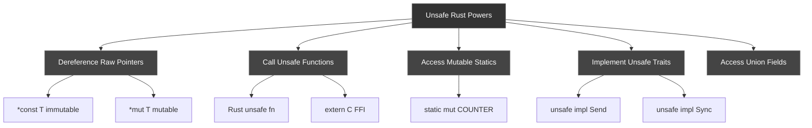

# R77: Rust Unsafe Code - When Safety Guarantees Aren't Enough

## Problem Statement
**Rust's safety guarantees are its superpower, but sometimes you need to break the rules.** <cite index="1-10,1-11">The borrow checker and type system can't verify certain operations that are actually correct, like interfacing with C code, implementing low-level data structures, or optimizing performance-critical sections</cite>. Without `unsafe`, you can't dereference raw pointers, call foreign functions, or implement certain performance optimizations. **How do you safely use unsafe Rust without undermining the language's memory safety guarantees?**

## Solution in One Sentence
**`unsafe` blocks and functions create explicit boundaries where programmers take responsibility for upholding memory safety contracts that the compiler cannot verify, enabling five specific "superpowers" while maintaining safety in the surrounding code through careful encapsulation and documentation.**

## Conceptual Foundation

### What is Unsafe Rust?

<cite index="1-3,1-4,1-5,1-6,1-7,1-8,1-9">Unsafe Rust grants five specific superpowers: dereferencing raw pointers, calling unsafe functions, accessing/modifying mutable static variables, implementing unsafe traits, and accessing union fields</cite>.

**Key Insight**: <cite index="1-10,1-11,1-12">unsafe doesn't disable the borrow checker or other safety checks—it only gives access to these five operations that aren't checked for memory safety</cite>.

```rust
// Safe Rust: Cannot dereference raw pointer
let x: i32 = 42;
let ptr: *const i32 = &x;
// let val = *ptr; // ERROR: cannot dereference without unsafe

// Unsafe Rust: Can dereference with explicit unsafe block
unsafe {
    let val = *ptr; // OK: You promise this is valid
    println!("Value: {}", val);
}
```

### The Contract Model

<cite index="3-11,3-12">unsafe declares contracts that cannot be verified by the type system, and programmers must manually check these contracts are upheld</cite>.

**Two sides of unsafe**:
1. **Declaration**: `unsafe fn` or `unsafe trait` declares "callers must uphold these contracts"
2. **Verification**: `unsafe {}` blocks declare "I have verified the contracts are upheld"

## MCU Metaphor: Quantum Realm Navigation

Think of **Rust's type system as the normal world** where <cite index="1-10,1-11">the borrow checker ensures memory safety automatically</cite>—like operating in the regular-sized world with physics that protects you.

**The unsafe keyword is Ant-Man's quantum suit**—it allows you to shrink down to the Quantum Realm where:
- **Normal physics (borrow checker) still applies to references**: You still can't violate aliasing rules
- **But you gain new powers**: You can manipulate quantum particles (raw pointers) directly
- **The danger is real**: <cite index="5-2,5-3">Misusing these powers causes Undefined Behavior, giving the compiler full rights to do arbitrarily bad things</cite>
- **You must navigate carefully**: Just as Ant-Man needs precise calculations to survive the Quantum Realm, unsafe code needs documented safety contracts

| Quantum Realm Concept | Rust Unsafe Equivalent |
|----------------------|------------------------|
| Shrinking to subatomic scale | Entering `unsafe` block |
| Quantum particles | Raw pointers (`*const T`, `*mut T`) |
| Quantum tunnel risks | Undefined Behavior (UB) |
| Janet van Dyne's survival map | Safety contracts (`// SAFETY:` comments) |
| Regular physics still apply | Borrow checker still active for references |
| Controlled re-entry | Safe abstractions wrapping unsafe code |

## Anatomy of Unsafe Rust

### The Five Unsafe Superpowers



### 1. Raw Pointers

<cite index="1-16,1-17">Raw pointers are similar to references but can be immutable (*const T) or mutable (*mut T)</cite>.

```rust
// Creating raw pointers (SAFE - no dereference yet)
let mut num = 42;
let ptr_immutable: *const i32 = &num;
let ptr_mutable: *mut i32 = &mut num;

// Creating from arbitrary address (DANGEROUS but valid creation)
let address = 0x012345usize;
let ptr = address as *const i32;

// Dereferencing (UNSAFE - must be in unsafe block)
unsafe {
    println!("Value: {}", *ptr_immutable);
    *ptr_mutable = 100;
}
```

**Key differences from references**:
<cite index="1-20">Raw pointers ignore borrowing rules—you can have multiple mutable pointers to the same location</cite>.

```rust
let mut x = 42;
let ptr1: *mut i32 = &mut x;
let ptr2: *mut i32 = &mut x; // OK! Multiple mutable raw pointers

// But you must be careful when dereferencing
unsafe {
    *ptr1 = 100;
    *ptr2 = 200; // Aliasing violation if not coordinated!
}
```

### 2. Unsafe Functions

<cite index="2-6,2-7">unsafe functions have requirements that programmers must uphold when calling them, because Rust cannot guarantee these requirements are met</cite>.

```rust
/// # Safety
///
/// - `ptr` must be aligned to `T`'s alignment
/// - `ptr` must point to a valid instance of `T`
/// - `ptr` must not be null
unsafe fn dereference<T>(ptr: *const T) -> T 
where
    T: Copy,
{
    // Inside unsafe fn, we still need unsafe blocks!
    unsafe {
        *ptr
    }
}

// Calling unsafe function
let x = 42;
let ptr = &x as *const i32;

unsafe {
    let value = dereference(ptr); // Caller promises contracts upheld
    println!("Value: {}", value);
}
```

**Documentation Standard**: <cite index="1-1,1-2">It's idiomatic to write a comment starting with `# Safety` explaining what the caller needs to do</cite>.

### 3. Mutable Static Variables

<cite index="1-7">Accessing or modifying mutable static variables requires unsafe</cite> because they are globally accessible and can cause data races.

```rust
static mut COUNTER: u32 = 0;

fn increment_counter() {
    unsafe {
        COUNTER += 1;
    }
}

fn read_counter() -> u32 {
    unsafe { COUNTER }
}

// Better alternative: Use atomic types or Mutex
use std::sync::atomic::{AtomicU32, Ordering};
static SAFE_COUNTER: AtomicU32 = AtomicU32::new(0);

fn increment_safe() {
    SAFE_COUNTER.fetch_add(1, Ordering::SeqCst); // No unsafe needed!
}
```

### 4. Unsafe Traits

<cite index="6-3,6-4">unsafe trait implementations declare that the implementation upholds the trait's contract, like a type implementing Send being truly safe to move to another thread</cite>.

```rust
// Declaring an unsafe trait
unsafe trait Zeroable {
    // Contract: Type must be safe to zero-initialize
    // (no invalid bit patterns)
}

// Implementing for safe types
unsafe impl Zeroable for u32 {}  // All bit patterns valid
unsafe impl Zeroable for i32 {}  // All bit patterns valid

// WRONG: Don't implement for types with invalid states
// unsafe impl Zeroable for &T {}  // BAD: null pointer is invalid!
// unsafe impl Zeroable for bool {} // BAD: only 0 and 1 are valid!

fn zero_init<T: Zeroable>() -> T {
    unsafe {
        std::mem::zeroed() // Safe because T: Zeroable
    }
}
```

**Standard unsafe traits**: <cite index="6-9">Send and Sync are marker traits that promise thread safety</cite>.

```rust
use std::marker::PhantomData;

struct MyBox<T> {
    ptr: *mut T,
    _marker: PhantomData<T>,
}

// Manually implement Send if T: Send
unsafe impl<T: Send> Send for MyBox<T> {}

// Manually implement Sync if T: Sync
unsafe impl<T: Sync> Sync for MyBox<T> {}
```

### 5. Union Fields

Unions allow multiple fields to share memory—accessing them is unsafe because you might read the wrong type.

```rust
union MyUnion {
    i: i32,
    f: f32,
}

let u = MyUnion { i: 42 };

unsafe {
    let value = u.i; // Must use unsafe to access
    println!("Integer: {}", value);
}
```

## Safe Abstractions Over Unsafe Code

**The Golden Rule**: <cite index="2-3,2-4">Build safe abstractions that the borrow checker doesn't understand, encapsulating unsafe code behind safe interfaces</cite>.

### Pattern: Encapsulated Invariants

```rust
pub struct VecWrapper<T> {
    ptr: *mut T,
    len: usize,
    capacity: usize,
}

impl<T> VecWrapper<T> {
    // Safe constructor maintains invariants
    pub fn new() -> Self {
        Self {
            ptr: std::ptr::NonNull::dangling().as_ptr(),
            len: 0,
            capacity: 0,
        }
    }
    
    // Safe push method - internally uses unsafe
    pub fn push(&mut self, value: T) {
        if self.len == self.capacity {
            self.grow();
        }
        
        unsafe {
            // SAFETY: self.len < self.capacity (checked above)
            // SAFETY: ptr + len is within allocated region
            let end = self.ptr.add(self.len);
            std::ptr::write(end, value);
        }
        
        self.len += 1;
    }
    
    // Safe get method
    pub fn get(&self, index: usize) -> Option<&T> {
        if index < self.len {
            unsafe {
                // SAFETY: index < len, so within bounds
                Some(&*self.ptr.add(index))
            }
        } else {
            None
        }
    }
    
    fn grow(&mut self) {
        // Growth logic with unsafe allocation...
    }
}

// The unsafe code is internal, but the API is completely safe!
let mut v = VecWrapper::new();
v.push(1);
v.push(2);
assert_eq!(v.get(0), Some(&1));
```

<cite index="2-33,2-34">The resulting safe function can be called from safe Rust, creating a safe abstraction using unsafe code internally</cite>.

## Memory Safety Contracts

### What is Undefined Behavior (UB)?

<cite index="5-2,5-3,5-4">Undefined Behavior gives the compiler full rights to do arbitrarily bad things to your program—you definitely should not invoke it</cite>.

**Common causes of UB**:
<cite index="5-19">Dereferencing dangling or unaligned pointers</cite>
- Data races
- <cite index="5-22">Reading uninitialized memory</cite>
- Invalid primitive values (e.g., bool that's not 0 or 1)
- <cite index="5-27">Null or dangling references/pointers</cite>

```rust
// UNDEFINED BEHAVIOR - Don't do this!
fn cause_ub() {
    let ptr: *const i32 = std::ptr::null();
    
    unsafe {
        let value = *ptr; // UB: Dereferencing null pointer!
    }
}

// UNDEFINED BEHAVIOR - Don't do this!
fn use_after_free() {
    let ptr: *const i32;
    {
        let x = 42;
        ptr = &x as *const i32;
    } // x dropped here
    
    unsafe {
        let value = *ptr; // UB: Dangling pointer!
    }
}
```

### Safety Documentation Template

```rust
/// Does something with a raw pointer.
///
/// # Safety
///
/// The caller must ensure that:
/// - `ptr` is non-null and properly aligned
/// - `ptr` points to a valid, initialized instance of `T`
/// - The memory at `ptr` is not mutated for the duration of this call
/// - `len` does not exceed the size of the allocation at `ptr`
unsafe fn process<T>(ptr: *const T, len: usize) {
    // Implementation with // SAFETY comments
    unsafe {
        // SAFETY: Caller guarantees ptr is valid and aligned
        let value = *ptr;
        
        // SAFETY: len checked by caller to be within bounds
        let slice = std::slice::from_raw_parts(ptr, len);
    }
}
```

## Practical Patterns

### Pattern 1: Split Slice (Standard Library Example)

<cite index="4-27,4-28,4-29">The borrow checker can't understand borrowing different parts of a slice, but it's fundamentally okay</cite>.

```rust
fn split_at_mut<T>(slice: &mut [T], mid: usize) -> (&mut [T], &mut [T]) {
    let len = slice.len();
    let ptr = slice.as_mut_ptr();
    
    assert!(mid <= len);
    
    unsafe {
        // SAFETY: mid <= len checked by assertion
        // SAFETY: left and right slices don't overlap
        (
            std::slice::from_raw_parts_mut(ptr, mid),
            std::slice::from_raw_parts_mut(ptr.add(mid), len - mid),
        )
    }
}

// Usage (completely safe)
let mut arr = [1, 2, 3, 4, 5];
let (left, right) = split_at_mut(&mut arr, 2);
left[0] = 10;
right[0] = 40;
assert_eq!(arr, [10, 2, 40, 4, 5]);
```

### Pattern 2: Transmutation (Type Reinterpretation)

<cite index="6-6">mem::transmute reinterprets values as a different type, bypassing type safety</cite>.

```rust
use std::mem;

// Convert between same-size types
fn u32_to_bytes(x: u32) -> [u8; 4] {
    unsafe {
        // SAFETY: u32 and [u8; 4] have same size
        mem::transmute(x)
    }
}

// BETTER: Use safe alternatives
fn u32_to_bytes_safe(x: u32) -> [u8; 4] {
    x.to_ne_bytes() // No unsafe needed!
}

// Transmute is often a code smell - prefer safer alternatives
```

### Pattern 3: Low-Level Data Structures

```rust
use std::alloc::{alloc, dealloc, Layout};

pub struct RawVec<T> {
    ptr: *mut T,
    cap: usize,
}

impl<T> RawVec<T> {
    pub fn new() -> Self {
        Self {
            ptr: std::ptr::NonNull::dangling().as_ptr(),
            cap: 0,
        }
    }
    
    pub fn with_capacity(cap: usize) -> Self {
        let layout = Layout::array::<T>(cap).unwrap();
        
        let ptr = unsafe {
            // SAFETY: layout has non-zero size
            alloc(layout) as *mut T
        };
        
        Self { ptr, cap }
    }
}

impl<T> Drop for RawVec<T> {
    fn drop(&mut self) {
        if self.cap != 0 {
            let layout = Layout::array::<T>(self.cap).unwrap();
            unsafe {
                // SAFETY: ptr was allocated with this layout
                dealloc(self.ptr as *mut u8, layout);
            }
        }
    }
}
```

### Pattern 4: FFI-Safe Types

```rust
// C-compatible struct
#[repr(C)]
pub struct Point {
    pub x: f64,
    pub y: f64,
}

// Declare C function
extern "C" {
    fn calculate_distance(p1: *const Point, p2: *const Point) -> f64;
}

// Safe wrapper
pub fn distance(p1: &Point, p2: &Point) -> f64 {
    unsafe {
        // SAFETY: References are always valid and aligned
        // SAFETY: Point is repr(C), matches C struct layout
        calculate_distance(p1 as *const Point, p2 as *const Point)
    }
}
```

## Comparison with Other Languages

| Language | Unsafe/Unsafe Code | Safety Model |
|----------|-------------------|--------------|
| **Rust** | Explicit `unsafe` keyword | **Opt-in unsafety**: Safe by default, explicit unsafe boundaries |
| **C/C++** | All code is "unsafe" | **No safety guarantees**: Programmer responsible for everything |
| **Java** | `sun.misc.Unsafe` class | **Hidden unsafety**: JVM internals use unsafe, user code mostly safe |
| **Go** | `unsafe` package | **Limited unsafety**: Can convert pointers, but GC still active |
| **Zig** | No unsafe keyword | **Explicit contracts**: Safety through assertions, not type system |

## Common Use Cases

### 1. Foreign Function Interface (FFI)

<cite index="2-2">Interfacing with C code is a major use case for raw pointers</cite>.

```rust
use std::ffi::{CStr, CString};
use std::os::raw::c_char;

extern "C" {
    fn strlen(s: *const c_char) -> usize;
}

fn rust_strlen(s: &str) -> usize {
    let c_str = CString::new(s).unwrap();
    unsafe {
        // SAFETY: CString guarantees null-terminated valid C string
        strlen(c_str.as_ptr())
    }
}
```

### 2. Performance Optimization

```rust
// Bounds-checked version (safe but slower)
fn sum_safe(slice: &[i32]) -> i32 {
    let mut sum = 0;
    for i in 0..slice.len() {
        sum += slice[i]; // Bounds check on every access
    }
    sum
}

// Unchecked version (unsafe but faster)
fn sum_unsafe(slice: &[i32]) -> i32 {
    let mut sum = 0;
    for i in 0..slice.len() {
        unsafe {
            // SAFETY: i is always < slice.len() due to loop bounds
            sum += *slice.get_unchecked(i);
        }
    }
    sum
}

// BEST: Iterator version (safe AND fast)
fn sum_iterator(slice: &[i32]) -> i32 {
    slice.iter().sum() // Compiler can eliminate bounds checks
}
```

### 3. Intrinsics and SIMD

```rust
use std::arch::x86_64::*;

#[target_feature(enable = "avx2")]
unsafe fn simd_add(a: &[f32; 8], b: &[f32; 8]) -> [f32; 8] {
    // SAFETY: Caller must ensure AVX2 is available (target_feature)
    unsafe {
        let va = _mm256_loadu_ps(a.as_ptr());
        let vb = _mm256_loadu_ps(b.as_ptr());
        let vc = _mm256_add_ps(va, vb);
        
        let mut result = [0.0f32; 8];
        _mm256_storeu_ps(result.as_mut_ptr(), vc);
        result
    }
}
```

## Best Practices and Gotchas

### ✅ DO: Minimize Unsafe Surface Area

```rust
// ❌ BAD: Exposing raw pointers
pub fn get_ptr<T>(data: &T) -> *const T {
    data as *const T
}

// ✅ GOOD: Keep unsafe internal
pub fn process<T>(data: &T) -> T 
where
    T: Copy,
{
    // Unsafe internally, safe interface
    let ptr = data as *const T;
    unsafe { *ptr }
}
```

### ✅ DO: Document Safety Contracts

```rust
// ✅ GOOD: Clear safety documentation
/// # Safety
///
/// - `ptr` must be valid for reads of `len * size_of::<T>()` bytes
/// - `ptr` must be properly aligned for type `T`
/// - `len` must not overflow `isize::MAX`
unsafe fn from_raw_parts<T>(ptr: *const T, len: usize) -> &[T] {
    // Implementation
}
```

### ✅ DO: Use SAFETY Comments

```rust
fn process_data(slice: &[u8]) {
    if slice.len() >= 4 {
        unsafe {
            // SAFETY: We just checked that len >= 4, so indices 0..4 are valid
            let value = slice.get_unchecked(2);
        }
    }
}
```

### ❌ DON'T: Assume Alignment

```rust
// ❌ BAD: Assuming alignment
fn read_u32(bytes: &[u8]) -> u32 {
    unsafe {
        *(bytes.as_ptr() as *const u32) // May be misaligned!
    }
}

// ✅ GOOD: Use safe conversion
fn read_u32_safe(bytes: &[u8]) -> u32 {
    u32::from_ne_bytes(bytes[0..4].try_into().unwrap())
}

// ✅ GOOD: Check alignment explicitly
fn read_u32_checked(bytes: &[u8]) -> Option<u32> {
    if bytes.len() >= 4 && bytes.as_ptr().align_offset(4) == 0 {
        unsafe {
            Some(*(bytes.as_ptr() as *const u32))
        }
    } else {
        None
    }
}
```

### ❌ DON'T: Create Invalid References

```rust
// ❌ BAD: Creating reference to uninitialized memory
fn create_invalid_ref() -> &'static i32 {
    let ptr: *const i32 = 0x1234 as *const i32;
    unsafe {
        &*ptr // UB: Invalid reference!
    }
}

// ✅ GOOD: Return raw pointer instead
fn create_ptr() -> *const i32 {
    0x1234 as *const i32 // OK: Just a pointer value
}
```

### ❌ DON'T: Rely on Layout Without repr

```rust
// ❌ BAD: Assuming struct layout
struct Data {
    a: u8,
    b: u32,
}

// Rust can reorder fields! Size != 5 bytes due to padding

// ✅ GOOD: Use repr(C) for predictable layout
#[repr(C)]
struct CData {
    a: u8,
    b: u32,
}
```

## Tools for Working with Unsafe

### Miri: Detect Undefined Behavior

```bash
# Install miri
rustup +nightly component add miri

# Run tests with miri
cargo +nightly miri test
```

Miri detects:
- Use-after-free
- Null pointer dereferences
- Unaligned accesses
- Data races
- Violation of pointer aliasing rules

### AddressSanitizer

```bash
# Build with AddressSanitizer
RUSTFLAGS="-Z sanitizer=address" cargo +nightly build

# Run the binary
./target/debug/my_program
```

### Lints and Warnings

```rust
// Forbid all unsafe code in this crate
#![forbid(unsafe_code)]

// Require unsafe blocks even inside unsafe functions
#![deny(unsafe_op_in_unsafe_fn)]

// This is now required (Rust 2024 edition)
unsafe fn foo() {
    let x: *const i32 = std::ptr::null();
    unsafe {  // Must have explicit unsafe block
        let _ = *x;
    }
}
```

## Integration Patterns

### With Error Handling

```rust
use std::io;

unsafe fn read_exact_unchecked(
    file: &std::fs::File,
    buf: &mut [u8],
) -> io::Result<()> {
    // Unsafe operation wrapped in Result
    // ...
}

// Safe wrapper
fn read_data(file: &std::fs::File) -> io::Result<Vec<u8>> {
    let mut buf = vec![0; 1024];
    unsafe {
        // SAFETY: buf is valid and initialized
        read_exact_unchecked(file, &mut buf)?;
    }
    Ok(buf)
}
```

### With Drop and RAII

```rust
struct RawBuffer {
    ptr: *mut u8,
    len: usize,
}

impl RawBuffer {
    fn new(len: usize) -> Self {
        let layout = Layout::array::<u8>(len).unwrap();
        let ptr = unsafe { alloc(layout) };
        Self { ptr, len }
    }
}

impl Drop for RawBuffer {
    fn drop(&mut self) {
        if !self.ptr.is_null() {
            unsafe {
                // SAFETY: ptr allocated with this layout in new()
                let layout = Layout::array::<u8>(self.len).unwrap();
                dealloc(self.ptr, layout);
            }
        }
    }
}
```

## Summary

**Unsafe Rust is not "turning off safety"**—it's <cite index="3-20">accepting extra responsibilities to ensure soundness where the compiler cannot</cite>. The five unsafe superpowers are:

1. Dereference raw pointers
2. Call unsafe functions
3. Access mutable statics
4. Implement unsafe traits
5. Access union fields

**Key principles**:
- <cite index="3-13,3-14">Safe Rust cannot cause Undefined Behavior—this is soundness</cite>
- <cite index="1-13">unsafe doesn't mean dangerous, it means "programmer-verified"</cite>
- <cite index="2-34">Build safe abstractions that encapsulate unsafe code</cite>
- Document safety contracts meticulously
- Minimize unsafe surface area
- Use tools (Miri, sanitizers) to verify correctness

**Remember**: <cite index="7-4,7-5">Minimize the amount of unsafe code in your codebase</cite>—unsafe should be a last resort, not a first choice.

---

**Further Reading**:
- [The Rustonomicon](https://doc.rust-lang.org/nomicon/) - The dark arts of unsafe Rust
- [Unsafe Code Guidelines](https://rust-lang.github.io/unsafe-code-guidelines/) - Formal specification of unsafe
- [Miri](https://github.com/rust-lang/miri) - Interpreter for detecting UB

<citations>
  <document>
    <document_type>WEB_SEARCH_RESULT</document_type>
    <document_id>1</document_id>
  </document>
  <document>
    <document_type>WEB_SEARCH_RESULT</document_type>
    <document_id>2</document_id>
  </document>
  <document>
    <document_type>WEB_SEARCH_RESULT</document_type>
    <document_id>3</document_id>
  </document>
  <document>
    <document_type>WEB_SEARCH_RESULT</document_type>
    <document_id>4</document_id>
  </document>
  <document>
    <document_type>WEB_SEARCH_RESULT</document_type>
    <document_id>5</document_id>
  </document>
  <document>
    <document_type>WEB_SEARCH_RESULT</document_type>
    <document_id>6</document_id>
  </document>
  <document>
    <document_type>WEB_SEARCH_RESULT</document_type>
    <document_id>7</document_id>
  </document>
</citations>
