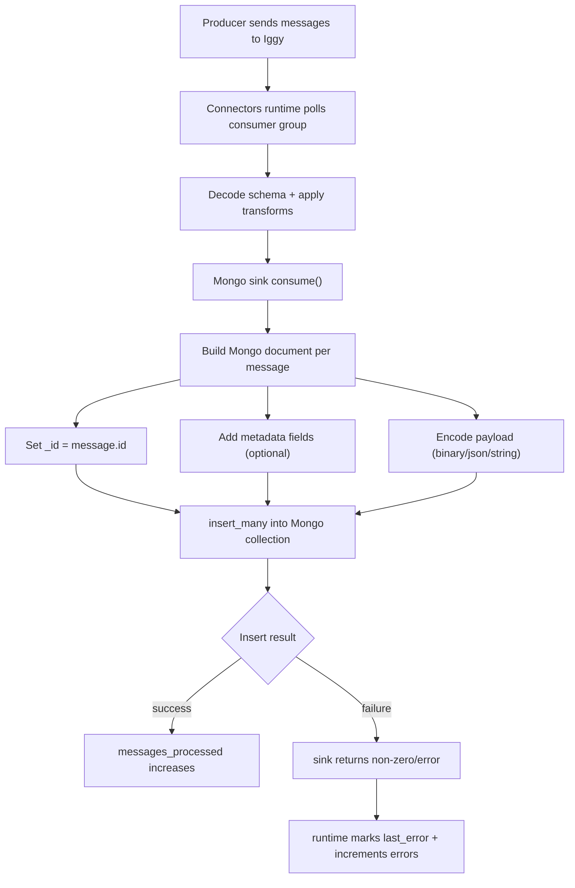
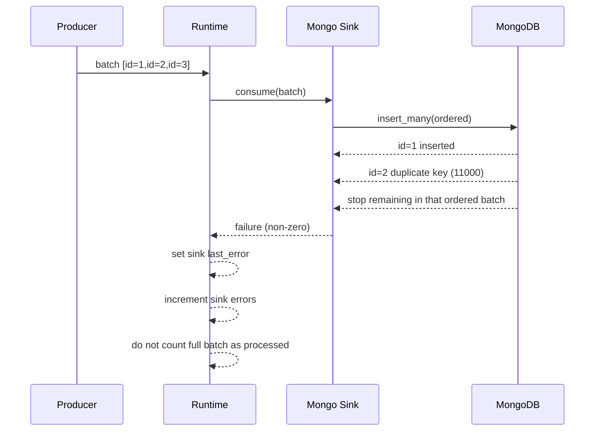

You mean the full #2739 MongoDB sink, not just the last fix. Here is the complete ELI5 model.

**Confidence**
It is working in tested conditions after a full clean rebuild. I ran unit + integration + runtime tests from scratch, including the duplicate-key E2E.

**ELI5 (entire sink)**
Think of Iggy as a conveyor belt of packages, and MongoDB as shelves in a warehouse.

1. The runtime watches an Iggy stream/topic and takes packages in small batches.
2. The Mongo sink turns each package into a Mongo document.
3. It gives each document a unique shelf label `_id` from Iggy message ID.
4. It stores payload + optional metadata (`offset`, `stream`, `topic`, timestamps, checksum).
5. If Mongo says “this `_id` already exists,” that is a hard error (insert-only mode, no upsert).
6. Runtime must report that error clearly, not fake success metrics.

**Where this logic lives**
1. Sink config shape and lifecycle (`open`, `consume`, `close`): [lib.rs](/Users/amuldotexe/Desktop/A01_20260131/iggy-issue02/iggy_2739_sink/core/connectors/sinks/mongodb_sink/src/lib.rs) at line 47 and line 110.
2. Core processing + batching: [lib.rs](/Users/amuldotexe/Desktop/A01_20260131/iggy-issue02/iggy_2739_sink/core/connectors/sinks/mongodb_sink/src/lib.rs) at line 211.
3. `_id` mapping to `message.id` (critical): [lib.rs](/Users/amuldotexe/Desktop/A01_20260131/iggy-issue02/iggy_2739_sink/core/connectors/sinks/mongodb_sink/src/lib.rs) at line 294.
4. Retry + transient error classification (duplicate key treated as non-transient): [lib.rs](/Users/amuldotexe/Desktop/A01_20260131/iggy-issue02/iggy_2739_sink/core/connectors/sinks/mongodb_sink/src/lib.rs) at line 362 and line 408.
5. Runtime calling sink and now checking callback result: [sink.rs](/Users/amuldotexe/Desktop/A01_20260131/iggy-issue02/iggy_2739_sink/core/connectors/runtime/src/sink.rs) at line 525.
6. Runtime converting sink failure into connector error state/metrics: [sink.rs](/Users/amuldotexe/Desktop/A01_20260131/iggy-issue02/iggy_2739_sink/core/connectors/runtime/src/sink.rs) at line 223.
7. Runtime sink manager exposing `last_error`: [sink.rs](/Users/amuldotexe/Desktop/A01_20260131/iggy-issue02/iggy_2739_sink/core/connectors/runtime/src/manager/sink.rs) at line 86.
8. Connector config defaults: [config.toml](/Users/amuldotexe/Desktop/A01_20260131/iggy-issue02/iggy_2739_sink/core/connectors/sinks/mongodb_sink/config.toml) at line 18.
9. Integration harness config for sink tests: [sink.toml](/Users/amuldotexe/Desktop/A01_20260131/iggy-issue02/iggy_2739_sink/core/integration/tests/connectors/mongodb/sink.toml) at line 18.

**Why these rules are needed (Mongo-specific)**
1. Mongo `_id` is unique, so duplicate message IDs naturally collide.
2. At-least-once delivery means duplicates can happen in real systems.
3. Insert-only sink semantics mean collision is failure by design, not “update existing.”
4. If runtime ignores sink failure code, you get silent data loss + fake processed counters.
5. The fix ensures “if Mongo write failed, runtime says failed.”

**Code x tests (different types)**
1. Unit tests (sink crate): `cargo test -p iggy_connector_mongodb_sink`  
   Covers payload format mapping, retry parsing/classification, no-client error propagation, initial state counters.
2. Integration tests (real Mongo + runtime): `cargo test -p integration --test mod -- mongodb_sink`  
   Covers JSON path, binary path, large batch, auto-create collection, duplicate-key explicit failure test.
3. Runtime tests: `cargo test -p iggy-connectors`  
   Covers runtime metrics/error plumbing and connector manager behavior.

Key new contract test is here: [mongodb_sink.rs](/Users/amuldotexe/Desktop/A01_20260131/iggy-issue02/iggy_2739_sink/core/integration/tests/connectors/mongodb/mongodb_sink.rs) at line 256.