# The 12 Principles of LLM-Native Development: Comprehensive Reference

> A comprehensive breakdown of each principle with mathematical models, visual diagrams, and actionable insights.

---

## Principle 1: LLMs are Search Engines, Not Thinkers

**One-Liner:** LLMs retrieve and combine training patterns via semantic search, not through novel reasoning.

**Mermaid Diagram:**
```mermaid
flowchart LR
    subgraph MYTH["❌ The Myth"]
        You1[You] -->|Ask question| Brain[LLM Brain]
        Brain -->|Thinks deeply| Answer1[Novel Answer]
    end

    subgraph REALITY["✓ The Reality"]
        You2[You] -->|Keywords| Search[LLM Search]
        Search -->|Retrieves| Patterns[Training Patterns]
        Patterns -->|Assembles| Answer2[Pattern Mashup]
    end
```

**ELI5:** LLMs are like librarians that find and paste together book pages matching your keywords, not scientists who think up new ideas. Better words = better results.

**Mathematical Model:**
```
P(output | input) ≈ Σ P(pattern_i) × similarity(input, pattern_i)
```

This shows output is a weighted sum of training patterns where weights are similarity scores computed via attention. Naming is retrieval optimization—`filter_implementation_entities_only()` creates a more specific query vector than `filter()`, retrieving more relevant patterns.

**Key Insight:** Your prompts are search queries optimizing retrieval, not instructions to a thinking mind.

---

## Principle 2: First Output is Never Final (The Iteration Law)

**One-Liner:** Quality emerges through iterative refinement—explore, constrain, refine, validate—never accept first outputs.

**Mermaid Diagram:**
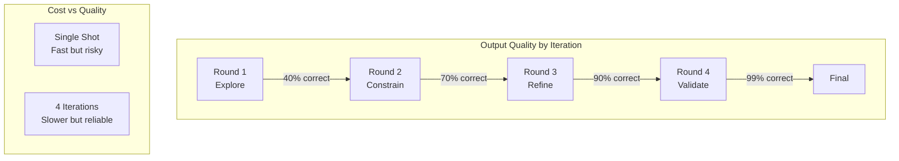

**ELI5:** Nobody draws a perfect picture in one try. First you sketch rough shapes, then add details, then fix mistakes, then finish. Same with LLM code.

**Mathematical Model:**
```
Quality(n) = Quality_max × (1 - e^(-λn))
```

Where `n` is iterations and `λ` is the learning rate per iteration. This convergence model shows quality asymptotically approaches maximum as iterations increase. For complex tasks, 4-iteration ROI >> 1-iteration ROI because quality improvement dominates linear cost increase.

**Key Insight:** Single-step optimization rarely finds global optima; iteration is gradient descent with decreasing step size.

---

## Principle 3: Context Window Forgets (The Memory Cliff)

**One-Liner:** Attention decays exponentially with distance—use summary documents to checkpoint critical information before the memory cliff.

**Mermaid Diagram:**
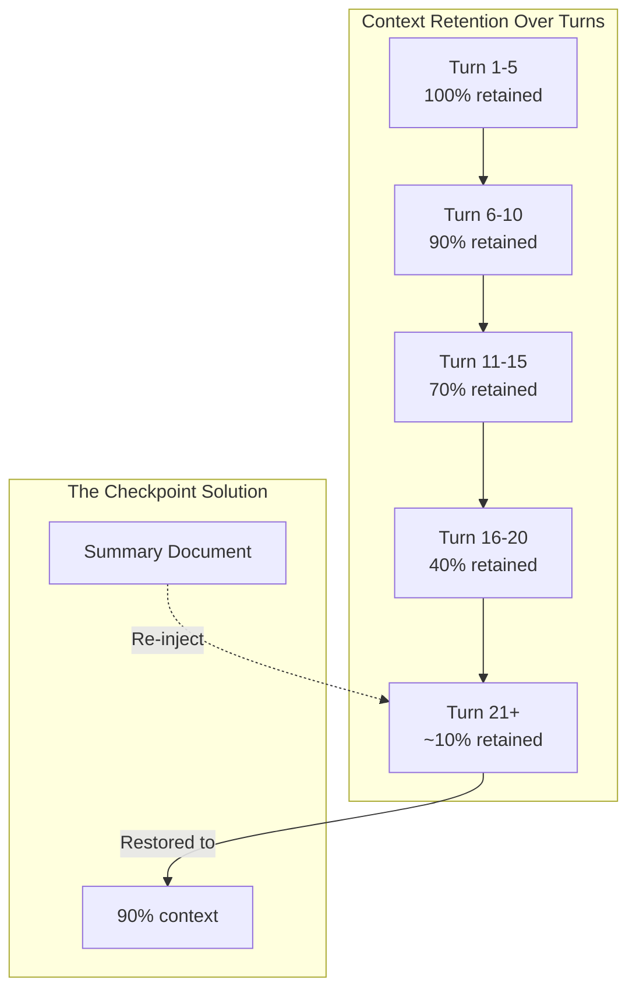

**ELI5:** LLMs are like friends with small memory windows who forget old sentences. Write summary notes every few chapters to help them remember.

**Mathematical Model:**
```
Effective_Attention(token_i) ∝ 1 / (distance_from_current)^α
Retention(turn_n) = e^(-n/τ)
```

Where α ≈ 1.5-2.0 and τ ≈ 15-20 turns. Tokens beyond ~8K positions receive negligible attention weight. Periodic summarization converts O(n) degradation to O(1) by trading compute for memory.

**Key Insight:** This is checkpointing in reverse-mode automatic differentiation—trade computation for memory retention.

---

## Principle 4: Self-Critique Surfaces Hidden Flaws

**One-Liner:** Ask LLMs to critique their own outputs with targeted questions—overconfidence drops from 80% to 40% when wrong.

**Mermaid Diagram:**
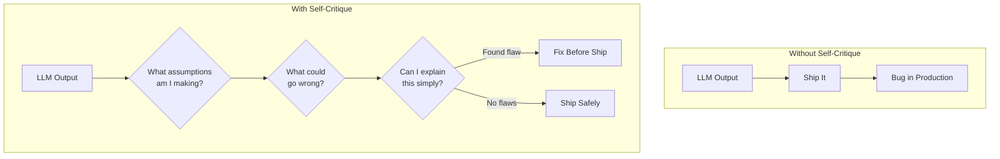

**ELI5:** LLMs say "looks good!" without checking carefully. Ask them to critique themselves: "What could go wrong?" and suddenly they find their own mistakes.

**Mathematical Model:**
```
P(LLM says correct | actually correct) ≈ 0.95
P(LLM says correct | actually wrong) ≈ 0.80  // Overconfidence!
P(LLM says correct after critique | actually wrong) ≈ 0.40
```

Self-critique activates different attention patterns that surface inconsistencies. Different prompts create different "views" of the same problem—disagreement reveals uncertainty.

**Key Insight:** Self-critique is ensemble learning with a single model; prompts like "What assumptions?" retrieve edge cases from training data.

---

## Principle 5: Negative Knowledge is More Valuable Than Positive

**One-Liner:** Constraints eliminate solution space faster than examples—one negative pattern excludes 10^4 solutions, one positive example shows just one.

**Mermaid Diagram:**
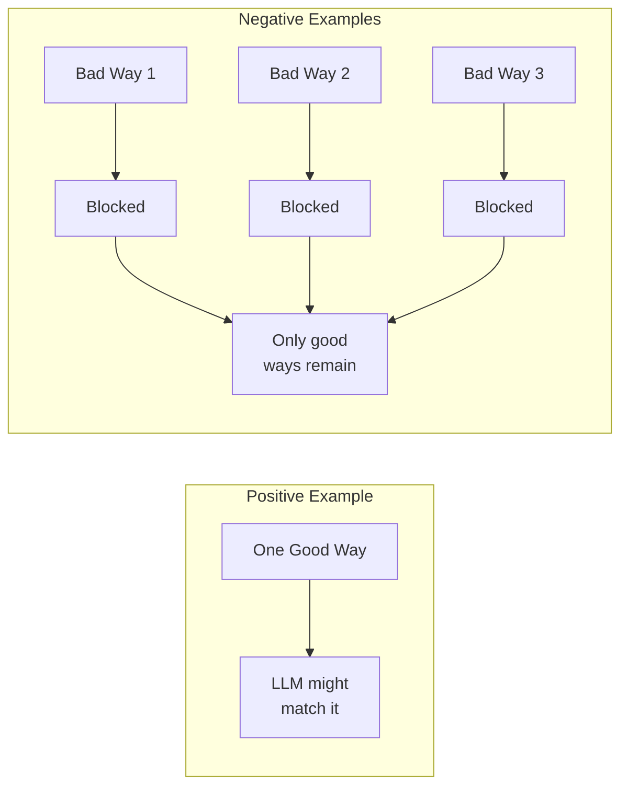

**ELI5:** In a maze, saying "don't go right, don't go straight, don't go left at turn 3" eliminates hundreds of paths. One "do this" shows only one path.

**Mathematical Model:**
```
Valid_Solutions = All_Possible - Invalid_Solutions

Info(positive_example) = log(|All| / |All|) ≈ 0 bits
Info(negative_pattern) = log(|All| / |All - excluded|) ≈ 13 bits
```

Given |All_Possible| ≈ 10^6 and |Valid_Solutions| ≈ 10^2, a negative pattern excluding ~10^4 solutions carries exponentially more information than a positive example covering ~1 solution.

**Key Insight:** This is Bayesian inference—define the posterior by eliminating inconsistent regions, not by finding one good point.

---

## Principle 6: Tests ARE Specifications (The Executable Contract)

**One-Liner:** Tests define exact input-output mappings that eliminate ambiguity—correctness probability jumps from 60% to 95%.

**Mermaid Diagram:**
```mermaid
flowchart LR
    subgraph VAGUE["❌ Vague Spec"]
        Words[Written Requirements] -->|Interpreted| LLM1[LLM]
        LLM1 -->|Guesses| Output1[Maybe Right?]
    end

    subgraph PRECISE["✓ Test as Spec"]
        Test[Failing Test] -->|Exact target| LLM2[LLM]
        LLM2 -->|Matches| Output2[Definitely Right]
    end
```

**ELI5:** Asking someone to "draw a cat" gives many results. Saying "cat with 4 legs, 2 ears, whiskers, fits in 10x10 box" gives exactly what you want. Tests are measurements, not descriptions.

**Mathematical Model:**
```
Oracle(input, output) → {correct, incorrect}

P(correct | vague_spec) ≈ 0.6  // High hallucination risk
P(correct | failing_test) ≈ 0.95  // Clear target
```

Tests ARE oracles converting ambiguous "meets requirements?" into precise "output equals expected output?" They transform generation tasks (open-ended) into completion tasks (constrained).

**Key Insight:** Tests define the feasible set in optimization—vastly smaller than all possible functions.

---

## Principle 7: 4 Words is Optimal Token Density

**One-Liner:** Semantic specificity peaks at 4-word identifiers where attention-per-token and match-precision balance optimally.

**Mermaid Diagram:**
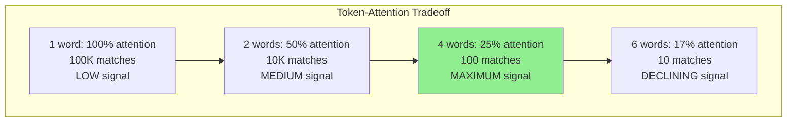

**ELI5:** Guessing game—"animal" = thousands of options, "animal with four legs, orange, with stripes" = tiger immediately! But too many words and people stop listening. 4 words is the sweet spot.

**Mathematical Model:**
```
S(n) = log(|corpus| / |matches(n)|)  // Specificity increases with words
A(n) = 1/n  // Attention per word decreases

Effective_Signal: E(n) = S(n) × A(n) = log(|corpus| / |matches(n)|) / n
```

This function peaks around n=4 for typical code vocabularies. Too few words = ambiguous; too many = attention diluted.

**Key Insight:** This is the bias-variance tradeoff in naming—balance precision and attention capacity.

---

## Principle 8: Work Type Determines Process Weight

**One-Liner:** Match process investment to error cost and uncertainty—bugs need minimal process, products need heavy research.

**Mermaid Diagram:**
```mermaid
flowchart TD
    subgraph MATCH["Match Process to Work"]
        Bug[🔴 Bug<br/>Something broke] -->|Hours| Light1[Light process<br/>Fix + test]
        Enhance[🟡 Enhancement<br/>Small improvement] -->|Days| Light2[Light process<br/>Find pattern + extend]
        Feature[🟢 Feature<br/>New capability] -->|Weeks| Medium[Medium process<br/>PRD + ARCH + TDD]
        Product[🔵 Product<br/>New system] -->|Months| Heavy[Heavy process<br/>Discovery + Spikes + MVP]
    end

    subgraph WASTE["Mismatch = Waste"]
        BugHeavy[Bug with heavy process] --> Waste1[Waste: over-engineering]
        ProductLight[Product with light process] --> Waste2[Waste: building wrong thing]
    end
```

**ELI5:** Flat tire? Just fix it—don't redesign the bike. Building a flying bike? Need lots of research! Wrong amount of thinking = waste.

**Mathematical Model:**
```
Total_Cost = Process_Cost + Error_Cost × P(Error | Process)

Optimal_Process ∝ sqrt(Error_Cost × Uncertainty)
```

| Work Type | Error_Cost | Uncertainty | Optimal Process |
|-----------|------------|-------------|-----------------|
| Bug | Low | Low | Minimal |
| Enhancement | Low | Low | Light |
| Feature | Medium | Medium | Medium |
| Product | High | High | Heavy |

**Key Insight:** This is portfolio theory—allocate process investment based on risk and potential loss.

---

## Principle 9: PRD and Architecture Co-Evolve

**One-Liner:** Requirements and architecture mutually constrain—iterate between them to find simplest solution that delivers value.

**Mermaid Diagram:**
```mermaid
flowchart LR
    subgraph WRONG["❌ Linear (Wrong)"]
        PRD1[PRD Final] --> ARCH1[Architecture]
        ARCH1 --> Build1[Build]
    end

    subgraph RIGHT["✓ Co-Evolution (Right)"]
        PRD2[PRD v1] --> ARCH2[ARCH v1]
        ARCH2 -->|Simpler arch possible?| PRD3[PRD v2 Simplified]
        PRD3 --> ARCH3[ARCH v2]
        ARCH3 -->|Even simpler?| PRD4[PRD v3 Minimal]
        PRD4 --> Build2[Build Minimal]
    end
```

**ELI5:** Planning a treehouse—you list features, then realize "if I skip electricity, this becomes super easy!" So you simplify the list. Requirements and design should talk to each other.

**Mathematical Model:**
```
Level 1 (PRD): minimize |requirements| subject to user_value ≥ threshold
Level 2 (ARCH): minimize complexity subject to requirements

while not converged:
    arch = optimize_architecture(prd)
    if arch.reveals_simplification:
        prd = simplify_prd(arch.insight)
```

Each architectural parameter creates PRD simplification opportunities. ARCH discoveries modify constraints, enabling simpler solutions.

**Key Insight:** This is Lagrangian relaxation—architecture insights modify constraint multipliers on requirements.

---

## Principle 10: State Serialization Enables Continuity

**One-Liner:** Checkpoint phase, tests, decisions, and progress to create Markov blankets enabling perfect session resumption.

**Mermaid Diagram:**
```mermaid
flowchart TD
    subgraph WITHOUT["❌ Without State Tracking"]
        Session1[Session 1<br/>Progress made] --> Break1[Break]
        Break1 --> Session2[Session 2<br/>Start over 😢]
    end

    subgraph WITH["✓ With State Tracking"]
        Session3[Session 1<br/>Progress made] --> Save[Save State<br/>Phase + Tests + Decisions]
        Save --> Break2[Break]
        Break2 --> Load[Load State]
        Load --> Session4[Session 2<br/>Continue exactly 🎉]
    end
```

**ELI5:** Building LEGO castle—take pictures and notes before dinner. When you return, you know exactly where you stopped and what's next.

**Mathematical Model:**
```
Without serialization:
Context(t+1) = degraded_context(t) + new_input

With serialization:
Checkpoint(t) = {phase, tests, decisions, progress}
Context(t+1) = Checkpoint(t) + new_input
```

The checkpoint acts as a Markov blanket—all information needed to continue is captured. A checkpoint is sufficient iff:
```
P(correct_continuation | checkpoint) = P(correct_continuation | full_history)
```

**Key Insight:** This is the Markov property—the checkpoint is a sufficient statistic for the future, independent of the past.

---

## Principle 11: Explicit Delegation Prevents Drift

**One-Liner:** Use "can I write a failing test right now?" as decision boundary—prevents autonomous drift from intended direction.

**Mermaid Diagram:**
```mermaid
flowchart TD
    subgraph IMPLICIT["❌ Implicit (Drift Risk)"]
        Task1[Task] --> Vibes{Gut feeling}
        Vibes --> Maybe[Maybe proceed?<br/>Maybe ask?<br/>🤷]
    end

    subgraph EXPLICIT["✓ Explicit (No Drift)"]
        Task2[Task] --> Test{Can I write<br/>failing test<br/>RIGHT NOW?}
        Test -->|Yes| Proceed[Proceed]
        Test -->|No, need info| Research[Delegate: Research]
        Test -->|No, unclear req| Escalate[Escalate: Human]
    end
```

**ELI5:** Team project rule—if you know exactly what to do and can prove it works, do it. Need to learn first? Research. Nobody knows what's "right"? Ask.

**Mathematical Model:**
```
Drift = ||Actual_Direction - Intended_Direction||
Total_Drift(n) = Σ Drift(decision_i)

def decide_action(task):
    if can_write_test_now(task):
        return PROCEED  // Confidence(correct_path) > threshold
    elif missing_knowledge(task):
        return DELEGATE_TO_RESEARCH
    elif requirements_ambiguous(task):
        return ESCALATE_TO_HUMAN
```

"Can I write a test?" is a proxy for having a precise definition of "correct"—low drift risk.

**Key Insight:** This is a bandit algorithm for decision routing minimizing expected cost of each route.

---

## Principle 12: Feedback Closes the Loop

**One-Liner:** Closed-loop systems converge via learning from production—capture failures as anti-patterns, successes as patterns.

**Mermaid Diagram:**
```mermaid
flowchart TD
    subgraph OPEN["❌ Open Loop (No Learning)"]
        Build1[Build] --> Ship1[Ship]
        Ship1 --> Next1[Next Feature]
        Next1 --> Build1
    end

    subgraph CLOSED["✓ Closed Loop (Learning)"]
        Build2[Build] --> Ship2[Ship]
        Ship2 --> Observe[Observe Production]
        Observe --> Learn{Did it work?}
        Learn -->|No| Diagnose[Diagnose Why]
        Learn -->|Yes| Extract[Extract Pattern]
        Diagnose --> UpdateAnti[Update Anti-Patterns]
        Extract --> UpdatePatterns[Update Patterns]
        UpdateAnti --> Next2[Next Feature]
        UpdatePatterns --> Next2
    end
```

**ELI5:** Basketball practice—if you never look whether shots go in, you won't improve. Watch results, adjust next shot. Same with code: observe production, learn, write it down.

**Mathematical Model:**
```
Performance(t+1) = Performance(t) + Learning_Rate × Feedback(t)

Knowledge(t) = Knowledge(0) + Σ (anti_patterns_added(i) + patterns_added(i))

if production_error:
    anti_patterns.add({pattern, failure, prevention})
if production_success:
    patterns.add({pattern, context})
```

Without feedback, Learning_Rate × Feedback = 0, and performance is constant or degrades. Teams that close the loop accumulate knowledge; teams that don't repeat mistakes.

**Key Insight:** This is gradient descent on organizational competence—feedback is the gradient signal preventing random walk.

---

## Comprehensive Summary Table

| # | Principle Name | One-Liner | ELI5 | Mathematical Formula |
|---|----------------|-----------|------|---------------------|
| 1 | LLMs are Search Engines, Not Thinkers | LLMs retrieve and combine training patterns via semantic search, not through novel reasoning | Librarians that find and paste book pages matching keywords, not scientists thinking up new ideas | `P(output \| input) ≈ Σ P(pattern_i) × similarity(input, pattern_i)` |
| 2 | First Output is Never Final | Quality emerges through iterative refinement—explore, constrain, refine, validate | Nobody draws perfect pictures in one try—sketch, add details, fix mistakes, finish | `Quality(n) = Quality_max × (1 - e^(-λn))` |
| 3 | Context Window Forgets | Attention decays exponentially with distance—use summary documents to checkpoint critical information | Friends with small memory windows who forget old sentences—write summary notes | `Effective_Attention(token_i) ∝ 1 / (distance)^α` |
| 4 | Self-Critique Surfaces Hidden Flaws | Ask LLMs to critique their own outputs—overconfidence drops from 80% to 40% when wrong | Ask them to be their own critic: "What could go wrong?" and they find mistakes | `P(says correct \| wrong) drops from 0.80 to 0.40 with critique` |
| 5 | Negative Knowledge is More Valuable | Constraints eliminate solution space faster—one negative excludes 10^4 solutions vs one positive showing one | Three "don't do this" eliminates hundreds of paths vs one "do this" shows one path | `Info(negative) = log(\|All\| / \|All - excluded\|) ≈ 13 bits` |
| 6 | Tests ARE Specifications | Tests define exact input-output mappings that eliminate ambiguity | Tests are measurements (cat with 4 legs, 2 ears, whiskers) not descriptions (draw a cat) | `P(correct \| test) ≈ 0.95` vs `P(correct \| vague) ≈ 0.6` |
| 7 | 4 Words is Optimal Token Density | Semantic specificity peaks at 4-word identifiers where attention and precision balance | "Animal orange four-legs stripes" = tiger! But too many words and people stop listening | `E(n) = log(\|corpus\| / \|matches(n)\|) / n` peaks at n=4 |
| 8 | Work Type Determines Process Weight | Match process investment to error cost and uncertainty | Flat tire? Fix it. Flying bike? Research lots. Wrong thinking = waste | `Optimal_Process ∝ sqrt(Error_Cost × Uncertainty)` |
| 9 | PRD and Architecture Co-Evolve | Requirements and architecture mutually constrain—iterate to find simplest solution | Treehouse planning—"skip electricity makes this easy!" so you simplify the list | Bi-level optimization with constraint propagation |
| 10 | State Serialization Enables Continuity | Checkpoint phase, tests, decisions to create Markov blankets enabling resumption | LEGO castle—take pictures and notes before dinner to know where you stopped | `P(continue \| checkpoint) = P(continue \| full_history)` |
| 11 | Explicit Delegation Prevents Drift | Use "can I write a failing test now?" as decision boundary | If you can prove it works, do it; need to learn? Research; unclear? Ask | `Drift = \|\|Actual - Intended\|\|` minimized by test heuristic |
| 12 | Feedback Closes the Loop | Closed-loop systems converge via learning from production observations | Basketball—watch if shots go in, adjust next shot, improve | `Performance(t+1) = Performance(t) + α × Feedback(t)` |

---

## How the Principles Connect

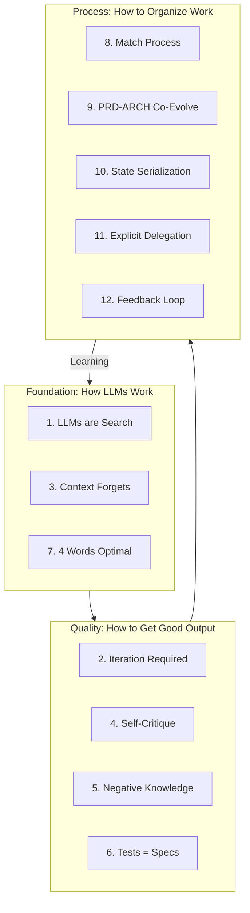

**Foundation** principles (1, 3, 7) explain why LLMs behave as they do—search engines with decaying attention optimized for ~4-word queries.

**Quality** principles (2, 4, 5, 6) tell you how to get good outputs—iterate, critique, constrain with negatives, specify with tests.

**Process** principles (8, 9, 10, 11, 12) tell you how to organize work—match process to work type, co-evolve requirements and design, checkpoint state, use explicit delegation boundaries, and close feedback loops.

They form a loop: Process learnings (12) improve Foundation understanding (1, 3, 7), which improves Quality techniques (2, 4, 5, 6), which improves Process (8-11).

---

## The One Core Insight

All 12 principles are variations of one fundamental insight:

> **Fill the context with the right information at the right time.**

That's the whole game.

- **Right information**: Search-optimized names (1, 7), negative constraints (5), executable specs (6), checkpointed state (10)
- **Right time**: Iteration stages (2), before memory cliff (3), during self-critique (4), at process decision points (8, 11), during PRD-ARCH evolution (9)
- **Closed loop**: Production feedback (12) tells you what "right" means

Master this, and you master LLM-native development.
