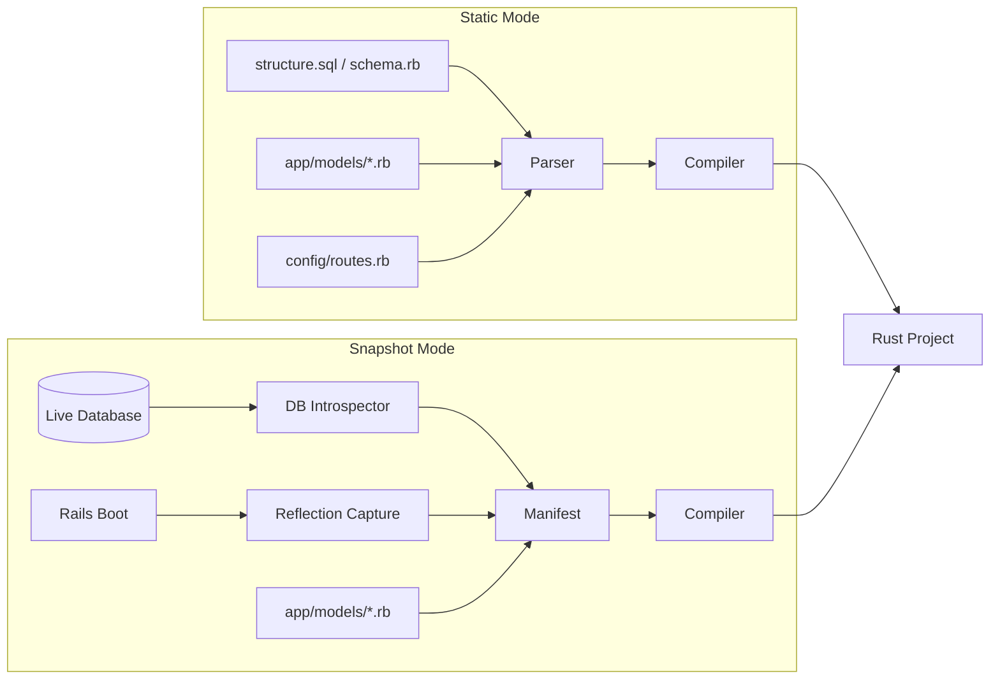
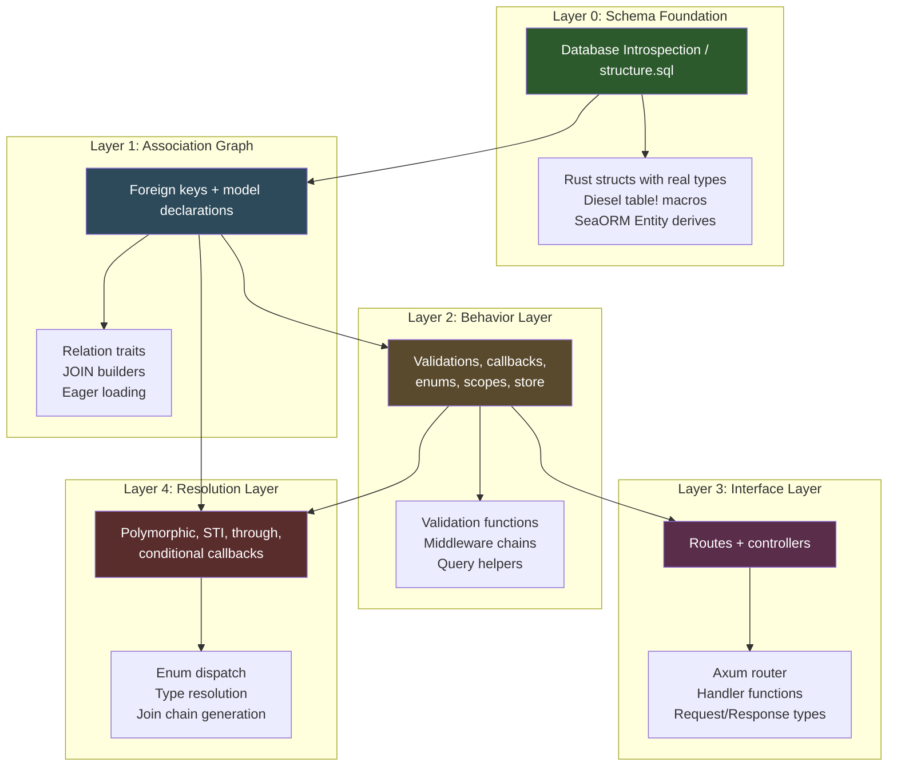
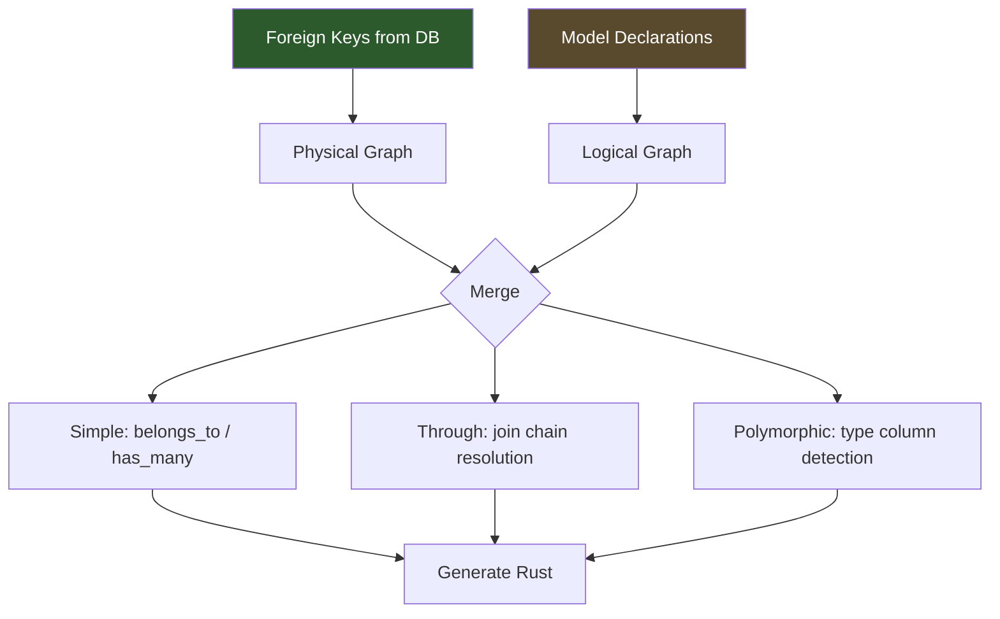
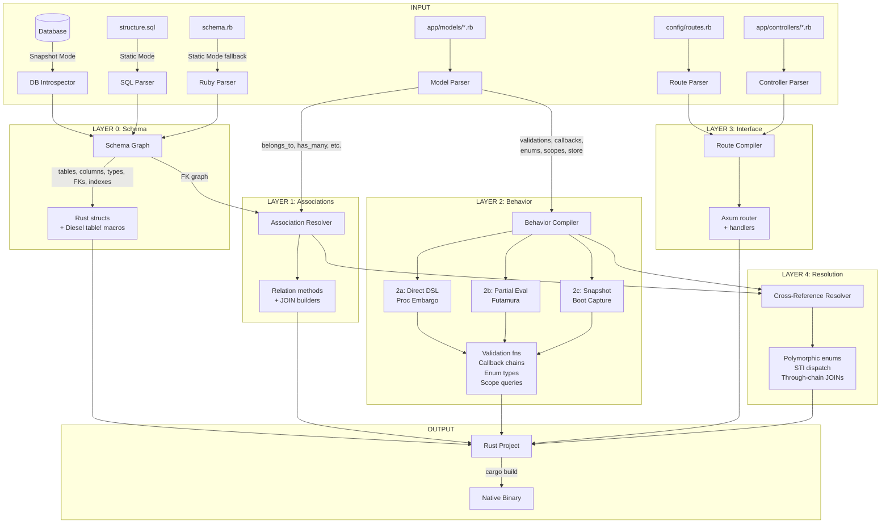

# Variant: DB-First Layered Transpilation

## Date: 2026-02-04

## Core Premise

**The database is the source of truth, not the Ruby files.**

A deployed Rails app's database schema IS the compiled output of years of migrations. `schema.rb` and `structure.sql` are just SERIALIZATIONS of what's already in the database. So: **introspect the database first, then layer the model files on top.**

This variant introduces two compilation modes (**Static** and **Snapshot**) and divides transpilation into distinct **layers** where each layer builds on the one below it.

---

## Two Compilation Modes

### Static Mode

No Ruby runtime. No database connection. Pure file analysis.

```
Inputs:  structure.sql OR schema.rb + app/models/**/*.rb + config/routes.rb
Output:  Rust project (Axum + Diesel/SeaORM)
Requires: Nothing — works offline from a git clone
```

**When to use**: CI/CD pipelines, cold builds, when you don't have DB access, open-source projects where you only have the source.

### Snapshot Mode

Connects to a LIVE database + optionally boots Rails for introspection.

```
Inputs:  DATABASE CONNECTION + app/models/**/*.rb + config/routes.rb
Output:  Rust project (Axum + Diesel/SeaORM)
Requires: PostgreSQL/MySQL/SQLite connection, optionally Ruby runtime
```

**When to use**: Initial migration of a legacy app, when schema.rb is stale or missing, when you need to capture runtime-generated methods (the Boot Snapshot from doc 07).



---

## Why DB Introspection First

### The Problem with File-First

`schema.rb` can be:
- **Stale** — migrations ran but `schema.rb` wasn't regenerated
- **Incomplete** — `structure.sql` has vendor-specific features (PostgreSQL domains, check constraints, partial indexes) that `schema.rb` can't represent
- **Wrong** — manual DB changes not tracked in migrations
- **Missing** — some teams use `structure.sql` exclusively

### What the Database Actually Knows

A direct database introspection gives you THE TRUTH:

| Information | Source | File Equivalent |
|------------|--------|----------------|
| Table names | `information_schema.tables` | `create_table` in schema.rb |
| Column names + types | `information_schema.columns` | `t.string :name` |
| Primary keys | `pg_constraint` / `information_schema` | `primary_key:` option |
| Foreign keys | `information_schema.key_column_usage` | `add_foreign_key` |
| Indexes (incl. unique) | `pg_indexes` / `SHOW INDEX` | `add_index` |
| Check constraints | `pg_constraint` | `check_constraint` |
| Default values | `column_default` | `default:` option |
| NOT NULL | `is_nullable` | `null: false` |
| Enum types (PostgreSQL) | `pg_enum` + `pg_type` | `create_enum` |
| JSON/JSONB columns | column type | `t.jsonb :data` |
| Array columns (PG) | `udt_name` | `t.string :tags, array: true` |

### The Key Insight

```
DATABASE  = ground truth (what actually exists)
schema.rb = serialization (what Rails thinks exists)
models    = behavior layer (what the app does with it)
```

**DB introspection gives you Layer 0 for FREE** — no parsing, no guessing, just querying `information_schema`.

---

## The 5 Transpilation Layers



---

## Layer 0: Schema Foundation (DB Introspection)

### Source: Database OR structure.sql/schema.rb

This is the BEDROCK. Everything else builds on knowing the exact table structure.

### Static Mode: Parse structure.sql

```sql
-- structure.sql (PostgreSQL)
CREATE TABLE users (
    id bigserial PRIMARY KEY,
    email character varying NOT NULL,
    name character varying,
    role integer DEFAULT 0 NOT NULL,
    settings jsonb DEFAULT '{}'::jsonb,
    created_at timestamp(6) without time zone NOT NULL,
    updated_at timestamp(6) without time zone NOT NULL
);

CREATE UNIQUE INDEX index_users_on_email ON users USING btree (email);
```

### Snapshot Mode: Introspect Database

```sql
-- Query information_schema directly
SELECT column_name, data_type, is_nullable, column_default, udt_name
FROM information_schema.columns
WHERE table_name = 'users'
ORDER BY ordinal_position;
```

Returns:

| column_name | data_type | is_nullable | column_default | udt_name |
|------------|-----------|-------------|----------------|----------|
| id | bigint | NO | nextval('users_id_seq') | int8 |
| email | character varying | NO | NULL | varchar |
| name | character varying | YES | NULL | varchar |
| role | integer | NO | 0 | int4 |
| settings | jsonb | YES | '{}'::jsonb | jsonb |
| created_at | timestamp without time zone | NO | NULL | timestamp |
| updated_at | timestamp without time zone | NO | NULL | timestamp |

### Generated Rust (same output from either mode)

```rust
// Generated by Layer 0: Schema Foundation
// Source: database introspection of `users` table

use chrono::NaiveDateTime;
use serde::{Deserialize, Serialize};
use serde_json::Value as JsonValue;

/// Generated from: users table (7 columns, 1 unique index)
#[derive(Debug, Clone, Serialize, Deserialize, Queryable, Insertable)]
#[diesel(table_name = users)]
pub struct User {
    pub id: i64,                          // bigint NOT NULL (PK)
    pub email: String,                    // varchar NOT NULL (UNIQUE)
    pub name: Option<String>,             // varchar NULL
    pub role: i32,                        // integer NOT NULL DEFAULT 0
    pub settings: Option<JsonValue>,      // jsonb DEFAULT '{}'
    pub created_at: NaiveDateTime,        // timestamp NOT NULL
    pub updated_at: NaiveDateTime,        // timestamp NOT NULL
}

/// New record (without auto-generated fields)
#[derive(Debug, Insertable)]
#[diesel(table_name = users)]
pub struct NewUser {
    pub email: String,
    pub name: Option<String>,
    pub role: Option<i32>,                // has default
    pub settings: Option<JsonValue>,      // has default
}

diesel::table! {
    users (id) {
        id -> BigInt,
        email -> VarChar,
        name -> Nullable<VarChar>,
        role -> Integer,
        settings -> Nullable<Jsonb>,
        created_at -> Timestamp,
        updated_at -> Timestamp,
    }
}
```

### Type Mapping (DB → Rust)

| PostgreSQL | MySQL | SQLite | Rust Type | Diesel Type |
|-----------|-------|--------|-----------|-------------|
| `bigint` / `bigserial` | `BIGINT` | `INTEGER` | `i64` | `BigInt` |
| `integer` / `serial` | `INT` | `INTEGER` | `i32` | `Integer` |
| `smallint` | `SMALLINT` | `INTEGER` | `i16` | `SmallInt` |
| `boolean` | `TINYINT(1)` | `INTEGER` | `bool` | `Bool` |
| `character varying` | `VARCHAR` | `TEXT` | `String` | `VarChar` |
| `text` | `TEXT` | `TEXT` | `String` | `Text` |
| `numeric` / `decimal` | `DECIMAL` | `REAL` | `BigDecimal` | `Numeric` |
| `real` / `float4` | `FLOAT` | `REAL` | `f32` | `Float` |
| `double precision` | `DOUBLE` | `REAL` | `f64` | `Double` |
| `timestamp` | `DATETIME` | `TEXT` | `NaiveDateTime` | `Timestamp` |
| `timestamptz` | `TIMESTAMP` | `TEXT` | `DateTime<Utc>` | `Timestamptz` |
| `date` | `DATE` | `TEXT` | `NaiveDate` | `Date` |
| `time` | `TIME` | `TEXT` | `NaiveTime` | `Time` |
| `jsonb` / `json` | `JSON` | `TEXT` | `serde_json::Value` | `Jsonb`/`Json` |
| `bytea` | `BLOB` | `BLOB` | `Vec<u8>` | `Binary` |
| `uuid` | `CHAR(36)` | `TEXT` | `uuid::Uuid` | `Uuid` |
| `inet` | N/A | N/A | `ipnetwork::IpNetwork` | `Inet` |
| `varchar[]` (PG) | N/A | N/A | `Vec<String>` | `Array<VarChar>` |
| PG enum type | N/A | N/A | Rust `enum` | Custom type |

### Snapshot Mode Bonus: Capturing PG Enums

```sql
-- PostgreSQL: introspect custom enum types
SELECT t.typname AS enum_name, e.enumlabel AS enum_value
FROM pg_type t
JOIN pg_enum e ON t.oid = e.enumtypid
ORDER BY t.typname, e.enumsortorder;
```

| enum_name | enum_value |
|-----------|-----------|
| order_status | pending |
| order_status | processing |
| order_status | shipped |
| order_status | delivered |

```rust
// Generated from PG enum introspection
#[derive(Debug, Clone, Copy, PartialEq, Eq, DbEnum, Serialize, Deserialize)]
pub enum OrderStatus {
    Pending,
    Processing,
    Shipped,
    Delivered,
}
```

**This is STRICTLY BETTER than parsing schema.rb** — PG enums aren't even representable in schema.rb but the DB knows about them.

---

## Layer 1: Association Graph

### Source: Foreign keys (DB) + model declarations (files)

Layer 1 combines two inputs:
1. **Foreign keys from DB/schema** → the physical relationships
2. **Association declarations from models** → the logical names and options

### Why Both Are Needed

The database knows:
- `posts.user_id` references `users.id` (foreign key)
- The constraint is `ON DELETE CASCADE`

The model file knows:
- This is called `belongs_to :author, class_name: "User"` (custom name)
- It has `dependent: :destroy` (Rails-level cascade)
- It has `counter_cache: true`

```ruby
# app/models/post.rb — the model file adds NAMES and BEHAVIOR
class Post < ApplicationRecord
  belongs_to :author, class_name: "User", counter_cache: true
  has_many :comments, dependent: :destroy
  has_many :tags, through: :taggings
  has_one :featured_image, class_name: "Image", as: :imageable  # polymorphic
end
```

### DB → Physical Graph

```sql
-- Foreign key introspection (PostgreSQL)
SELECT
    tc.table_name AS from_table,
    kcu.column_name AS from_column,
    ccu.table_name AS to_table,
    ccu.column_name AS to_column,
    rc.delete_rule
FROM information_schema.table_constraints tc
JOIN information_schema.key_column_usage kcu
    ON tc.constraint_name = kcu.constraint_name
JOIN information_schema.referential_constraints rc
    ON tc.constraint_name = rc.constraint_name
JOIN information_schema.constraint_column_usage ccu
    ON rc.unique_constraint_name = ccu.constraint_name
WHERE tc.constraint_type = 'FOREIGN KEY';
```

| from_table | from_column | to_table | to_column | delete_rule |
|-----------|-------------|----------|-----------|-------------|
| posts | user_id | users | id | CASCADE |
| comments | post_id | posts | id | CASCADE |
| taggings | post_id | posts | id | NO ACTION |
| taggings | tag_id | tags | id | NO ACTION |

### Model Files → Logical Graph

Parse model files for association DSL calls. Overlay on physical graph.

### Generated Rust

```rust
// Layer 1: Association Graph
// Physical: posts.user_id → users.id (FK CASCADE)
// Logical: belongs_to :author, class_name: "User", counter_cache: true

impl Post {
    /// belongs_to :author (users table via user_id)
    pub fn author(&self, conn: &mut PgConnection) -> QueryResult<User> {
        users::table.find(self.user_id).first(conn)
    }

    /// has_many :comments (comments.post_id → posts.id)
    pub fn comments(&self, conn: &mut PgConnection) -> QueryResult<Vec<Comment>> {
        comments::table
            .filter(comments::post_id.eq(self.id))
            .load(conn)
    }

    /// has_many :tags, through: :taggings
    pub fn tags(&self, conn: &mut PgConnection) -> QueryResult<Vec<Tag>> {
        taggings::table
            .inner_join(tags::table)
            .filter(taggings::post_id.eq(self.id))
            .select(tags::all_columns)
            .load(conn)
    }
}

// Counter cache support (from model declaration)
impl Post {
    /// Update counter cache on User when Post is created/destroyed
    fn update_author_counter_cache(
        conn: &mut PgConnection,
        user_id: i64,
        delta: i64,
    ) -> QueryResult<()> {
        diesel::update(users::table.find(user_id))
            .set(users::posts_count.eq(users::posts_count + delta))
            .execute(conn)?;
        Ok(())
    }
}
```

### Association Resolution Order



**Key**: If a foreign key exists in DB but NO model declaration exists → generate a basic `belongs_to`/`has_many` from the FK alone. If a model declaration exists but NO FK in DB → warn but still generate (Rails doesn't require FKs).

---

## Layer 2: Behavior Layer

### Source: Model files (validations, callbacks, enums, scopes, store)

This is where the "hard 20%" from doc 07 lives. Layer 2 handles it using the Layered Pyramid approach:

### Sublayer 2a: Direct DSL Compilation (Proc Embargo — 70%)

Problems that map directly because inputs are static:

| DSL | Input | Generated Rust |
|-----|-------|---------------|
| `validates :email, presence: true` | attribute name + validator type | `if self.email.is_empty() { errors.push(...) }` |
| `enum :status, [:active, :archived]` | enum name + values | Rust enum + predicate/bang/scope methods |
| `scope :active, -> { where(active: true) }` | scope name + query | `fn active() -> BoxedQuery` |
| `store_accessor :settings, :color, :theme` | store column + keys | getter/setter + dirty tracking methods |
| `before_save :normalize, if: :title_changed?` (symbol) | callback + method name | `if self.title_changed() { self.normalize(); }` |
| `belongs_to :user` change tracking | association name | `fn user_changed(&self) -> bool` |

### Sublayer 2b: Partial Evaluation (Futamura — 20%)

Problems that require reimplementing Rails' DSL interpretation:

| Pattern | What We Reimplement | Generated Rust |
|---------|-------------------|---------------|
| Concern `included do` blocks | Inline the block into the including model | Methods appear on the model struct |
| Callback chain ordering | Reimplement `CallbackChain` logic | Ordered function call sequence |
| Relation delegation | Know all scopes, generate direct methods | No `method_missing` needed |

### Sublayer 2c: Snapshot Fallback (Boot Snapshot — 10%)

Only in Snapshot Mode. For patterns that resist static analysis:

| Pattern | What We Capture | Generated Rust |
|---------|----------------|---------------|
| `before_save :check, if: -> { complex_logic }` | Proc body (best-effort AST) or flag as manual |  `// TODO: manual port required` with Ruby source as comment |
| Polymorphic type sets | `Model.reflections` → all known types | Closed Rust enum |
| Dynamic method tables | `Model.instance_methods(false)` | Method stubs |

### Callback Chain: Full Example

```ruby
# Rails model
class Order < ApplicationRecord
  before_validation :set_defaults
  before_save :normalize_email, if: :email_changed?
  before_save :calculate_total
  after_save :send_notification, if: :status_previously_changed?
  after_commit :sync_to_warehouse, on: :create
end
```

**Layer 2a resolves** (all conditions are symbols → known methods):

```rust
impl Order {
    pub fn run_before_validation_callbacks(&mut self) -> Result<(), ValidationAbort> {
        self.set_defaults();
        Ok(())
    }

    pub fn run_before_save_callbacks(&mut self) -> Result<(), SaveAbort> {
        if self.email_changed() {
            self.normalize_email();
        }
        self.calculate_total();
        Ok(())
    }

    pub fn run_after_save_callbacks(&self, conn: &mut PgConnection) {
        if self.status_previously_changed() {
            self.send_notification();
        }
    }

    pub fn run_after_commit_on_create_callbacks(&self) {
        self.sync_to_warehouse();
    }

    /// Full save lifecycle
    pub fn save(&mut self, conn: &mut PgConnection) -> Result<(), SaveError> {
        self.run_before_validation_callbacks()
            .map_err(|_| SaveError::Aborted)?;

        self.validate()?;

        self.run_before_save_callbacks()
            .map_err(|_| SaveError::Aborted)?;

        // actual INSERT/UPDATE
        diesel::update(orders::table.find(self.id))
            .set(&*self)
            .execute(conn)?;

        self.run_after_save_callbacks(conn);

        // after_commit runs after transaction
        // (handled by transaction wrapper)
        Ok(())
    }
}
```

---

## Layer 3: Interface Layer

### Source: config/routes.rb + app/controllers/**/*.rb

```ruby
# config/routes.rb
Rails.application.routes.draw do
  namespace :api do
    namespace :v1 do
      resources :users, only: [:index, :show, :create, :update] do
        resources :posts, only: [:index, :create]
      end
      resources :orders do
        member do
          post :ship
          post :cancel
        end
      end
    end
  end
end
```

### Generated Rust (Axum)

```rust
// Layer 3: Interface Layer
use axum::{Router, routing::{get, post, put, patch}};

pub fn api_v1_router() -> Router<AppState> {
    Router::new()
        // resources :users
        .route("/api/v1/users", get(users::index).post(users::create))
        .route("/api/v1/users/:id", get(users::show).patch(users::update))
        // nested: resources :posts under users
        .route("/api/v1/users/:user_id/posts", get(posts::index).post(posts::create))
        // resources :orders with member routes
        .route("/api/v1/orders", get(orders::index).post(orders::create))
        .route("/api/v1/orders/:id",
            get(orders::show).patch(orders::update).delete(orders::destroy))
        .route("/api/v1/orders/:id/ship", post(orders::ship))
        .route("/api/v1/orders/:id/cancel", post(orders::cancel))
}
```

---

## Layer 4: Resolution Layer (The Hard Parts)

### Source: Cross-cutting analysis of all previous layers

Layer 4 handles the 3 genuinely hard problems by combining information from Layers 0-3.

### 4a: Polymorphic Resolution

**Static Mode**: Scan ALL models for `as: :commentable` to find the closed type set.

```ruby
# Scanning models finds:
# Image model: has_many :comments, as: :commentable    → Image is commentable
# Post model:  has_many :comments, as: :commentable     → Post is commentable
# Video model: has_many :comments, as: :commentable     → Video is commentable
```

**Snapshot Mode**: Query the DB for distinct type values.

```sql
SELECT DISTINCT commentable_type FROM comments;
-- Returns: 'Image', 'Post', 'Video'
```

**Either way** → closed set → Rust enum:

```rust
/// Polymorphic type for :commentable
/// Sources: DB introspection + model scan
#[derive(Debug, Clone, Serialize, Deserialize)]
pub enum Commentable {
    Image(Image),
    Post(Post),
    Video(Video),
}

impl Commentable {
    /// Resolve from DB type string + ID
    pub fn load(
        commentable_type: &str,
        commentable_id: i64,
        conn: &mut PgConnection,
    ) -> QueryResult<Self> {
        match commentable_type {
            "Image" => Ok(Commentable::Image(
                images::table.find(commentable_id).first(conn)?
            )),
            "Post" => Ok(Commentable::Post(
                posts::table.find(commentable_id).first(conn)?
            )),
            "Video" => Ok(Commentable::Video(
                videos::table.find(commentable_id).first(conn)?
            )),
            other => Err(diesel::result::Error::NotFound),
        }
    }
}

impl Comment {
    pub fn commentable(&self, conn: &mut PgConnection) -> QueryResult<Commentable> {
        Commentable::load(&self.commentable_type, self.commentable_id, conn)
    }
}
```

### 4b: STI Resolution

**Static Mode**: Scan models for inheritance hierarchy (classes inheriting from same base that has `self.inheritance_column`).

**Snapshot Mode**: Query DB for distinct type values.

```sql
SELECT DISTINCT type FROM vehicles WHERE type IS NOT NULL;
-- Returns: 'Car', 'Truck', 'Motorcycle'
```

**Generated Rust**:

```rust
/// STI base: vehicles table
/// Subtypes from DB: Car, Truck, Motorcycle
#[derive(Debug, Clone)]
pub enum Vehicle {
    Car(Car),
    Truck(Truck),
    Motorcycle(Motorcycle),
}

/// Shared columns (from Layer 0)
#[derive(Debug, Clone, Queryable)]
pub struct VehicleBase {
    pub id: i64,
    pub type_name: String,      // STI discriminator
    pub make: String,
    pub model: String,
    pub year: i32,
    pub created_at: NaiveDateTime,
    pub updated_at: NaiveDateTime,
}

/// Car-specific (inherits VehicleBase + car-only columns/behavior)
#[derive(Debug, Clone)]
pub struct Car {
    pub base: VehicleBase,
    // Car-specific methods from model file
}

impl Car {
    pub fn doors(&self) -> i32 { 4 } // from Car model
}

/// Load from DB with STI dispatch
impl Vehicle {
    pub fn load(row: VehicleBase) -> Self {
        match row.type_name.as_str() {
            "Car" => Vehicle::Car(Car { base: row }),
            "Truck" => Vehicle::Truck(Truck { base: row }),
            "Motorcycle" => Vehicle::Motorcycle(Motorcycle { base: row }),
            _ => panic!("Unknown STI type: {}", row.type_name),
        }
    }

    pub fn all(conn: &mut PgConnection) -> QueryResult<Vec<Vehicle>> {
        let rows: Vec<VehicleBase> = vehicles::table.load(conn)?;
        Ok(rows.into_iter().map(Vehicle::load).collect())
    }

    /// STI-scoped query: only Cars
    pub fn cars(conn: &mut PgConnection) -> QueryResult<Vec<Car>> {
        let rows: Vec<VehicleBase> = vehicles::table
            .filter(vehicles::type_name.eq("Car"))
            .load(conn)?;
        Ok(rows.into_iter().map(|r| Car { base: r }).collect())
    }
}
```

### 4c: has_many :through — Recursive Resolution

Resolved at compile time using Layer 1's association graph:

```
User → has_many :posts → Post → has_many :taggings → Tagging → belongs_to :tag → Tag
User → has_many :tags, through: :posts, through: :taggings
```

The compiler walks the association graph recursively:

```rust
// Layer 4: Resolved through-chain
// User → posts → taggings → tags
impl User {
    pub fn tags(&self, conn: &mut PgConnection) -> QueryResult<Vec<Tag>> {
        posts::table
            .inner_join(taggings::table.inner_join(tags::table))
            .filter(posts::user_id.eq(self.id))
            .select(tags::all_columns)
            .distinct()
            .load(conn)
    }
}
```

---

## The Complete Pipeline



---

## Static vs Snapshot: Feature Comparison

| Feature | Static Mode | Snapshot Mode |
|---------|------------|---------------|
| **Input** | Files only | DB + Files (+ optional Ruby) |
| **Requires Ruby?** | No | Optional (for Boot Snapshot) |
| **Requires DB?** | No | Yes |
| **Schema source** | structure.sql / schema.rb | Live DB introspection |
| **PG enums** | Only if in structure.sql | Introspected directly |
| **Check constraints** | Only if in structure.sql | Introspected directly |
| **Stale schema?** | Trusts file (may be wrong) | Always current |
| **Polymorphic types** | Scanned from model files | Queried from DB + models |
| **STI types** | Scanned from model files | Queried from DB + models |
| **Proc conditions** | Flagged as TODO | Captured as AST (best-effort) |
| **Custom methods** | Flagged as TODO | Method table captured |
| **CI/CD friendly?** | Yes | Needs DB access |
| **Offline capable?** | Yes | No |

### Recommended Workflow

```
1. FIRST TIME (legacy migration):
   → Use Snapshot Mode against production-like DB
   → Captures everything, generates complete Rust project
   → Review + fix TODOs for proc conditions

2. ONGOING (after migration):
   → Use Static Mode in CI/CD
   → Regenerate from structure.sql + model files on every push
   → No DB or Ruby needed
```

---

## Comparison with Doc 07 Approaches

| Doc 07 Approach | This Variant's Equivalent | Key Difference |
|----------------|--------------------------|----------------|
| Boot Snapshot (A) | Snapshot Mode + Layer 2c | DB introspection added as primary source |
| Proc Embargo (B) | Layer 2a | Same — static DSL compilation |
| Futamura Projection (C) | Layer 2b | Same — reimplemented DSL interpretation |
| Layered Pyramid | 5-Layer Architecture | Adds Layer 0 (DB) and Layer 1 (FK graph) as foundations |

### What This Variant Adds

1. **DB as source of truth** — structure.sql and schema.rb are secondary, not primary
2. **Two explicit modes** — Static (offline) and Snapshot (connected) with clear tradeoffs
3. **Foreign key driven associations** — DB FKs give you the association graph for FREE before parsing models
4. **PG-specific features** — enum types, check constraints, partial indexes, array columns captured from DB
5. **Layered architecture** — clear separation means each layer can be tested independently
6. **Incremental adoption** — Layer 0 alone gives you typed structs from DB introspection. Each layer adds more.

---

## Implementation Priority

```mermaid
gantt
    title Layer Implementation Order
    dateFormat X
    axisFormat %s

    section Foundation
    Layer 0 - DB Introspection + SQL Parser    :l0, 0, 1
    Layer 0 - Rust struct generation           :l0g, 1, 2

    section Core
    Layer 1 - FK + Association resolution      :l1, 2, 3
    Layer 1 - JOIN builder generation          :l1g, 3, 4

    section Behavior
    Layer 2a - Direct DSL (validations, enums) :l2a, 4, 5
    Layer 2b - Partial eval (callbacks, concerns) :l2b, 5, 6

    section Interface
    Layer 3 - Routes + Controllers             :l3, 6, 7

    section Hard
    Layer 4 - Polymorphic + STI + Through      :l4, 7, 8
    Layer 2c - Snapshot mode (fallback)        :l2c, 8, 9
```



**Layer 0 is the most valuable starting point** — even without any other layer, you get type-safe Rust structs from your database schema. Every subsequent layer adds behavior on top.
