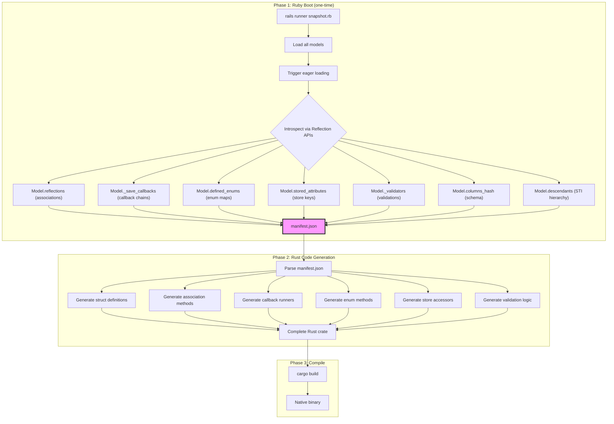
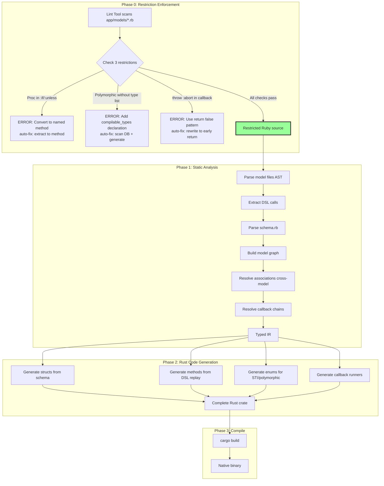
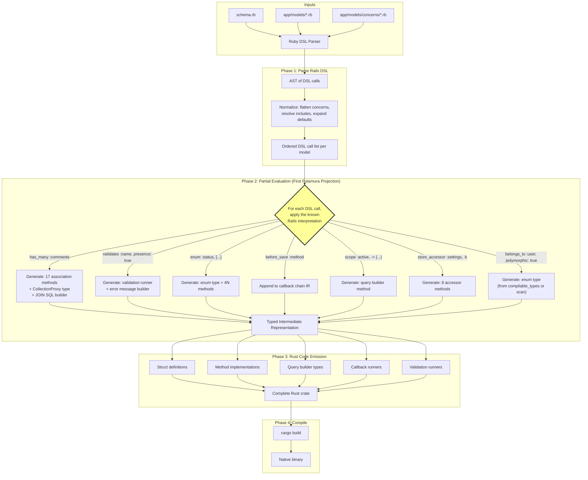
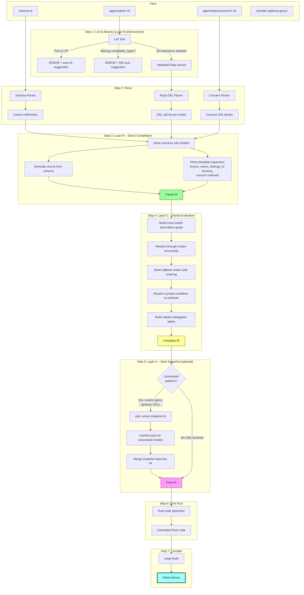

# The Hard 20%: What Resists Rails-to-Rust Compilation

## Date: 2026-02-04

## Overview

The Rails DSL Compiler thesis (doc 06) established that ~80% of Rails DSL patterns map cleanly to Rust. This document dissects the remaining ~20% - the areas that resist static compilation due to runtime metaprogramming. Each area is backed by **exact source file evidence** from the Rails framework and **quantitative data** from parseltongue analysis (55,603 entities, 158,170 dependency edges).

---

# Section 1: The 10 Hard Problems

## Parseltongue Quantitative Summary

| Metaprogramming Pattern | Entity Count | Key Locations |
|-------------------------|-------------|---------------|
| `method_missing` | **67** | ActiveRecord, ActionPack, ActiveModel, ActionView |
| `class_eval` | **6** | ActiveSupport::CodeGenerator, kernel ext |
| `module_eval` | **1** (unresolved) | Called pervasively but not defined as named entity |
| `define_method` | **10** | redefine_method, attribute_methods/read |
| `constantize` | **35** | inflections, rescuable, inheritance |
| `callbacks` (all) | **740** | ActiveSupport::Callbacks backbone |
| `polymorphic` (all) | **386** | associations, reflection, routing |
| `inheritance` (all) | **183** | STI, callback inheritance |
| `store_accessor` | **13** | ActiveRecord::Store |
| `nested_attributes` | **222** | NestedAttributes module |
| `delegated_type` | **8** | DelegatedType module |

> **Key insight**: The raw entity counts are LOW (67 method_missing, 6 class_eval) but they sit on CRITICAL PATHS. Every ActiveRecord attribute access flows through `method_missing`. Every callback flows through `module_eval`-generated runners. Low count, infinite blast radius.

---

## Problem 1: Callback System - Dynamic Method Generation

### Source Evidence
- **File**: `activesupport/lib/active_support/callbacks.rb`
- **Mechanism**: `module_eval` with heredoc string interpolation

### What Happens

At class load time, `define_callbacks :save` triggers generation of `_run_save_callbacks` and `_run_save_callbacks!` methods via string-based `module_eval`:

```ruby
# callbacks.rb — the heart of before_save, after_commit, around_action
module_eval <<~RUBY, __FILE__, __LINE__ + 1
  def _run_#{name}_callbacks(&block)
    run_callbacks(#{name.inspect}, &block)
  end
  private :_run_#{name}_callbacks
RUBY
```

The callback chain supports:
- **`:if` / `:unless`** — symbols (method names) or procs, resolved at RUNTIME
- **`:prepend`** — reorder callbacks dynamically
- **Halting** — `throw(:abort)` stops the chain
- **Around callbacks** — wraps with `yield`, requires stack unwinding

### Why It's Hard

The method NAMES are generated from strings. `define_callbacks :save, :validate, :destroy` creates 6+ methods whose names don't exist in source code. The `:if` conditions reference methods by symbol name — `before_save :do_thing, if: :active?` — requiring runtime method dispatch.

### Blast Radius

740 callback-related entities. Powers ALL of:
- `before_save`, `after_save`, `around_save` (ActiveRecord)
- `before_action`, `after_action`, `around_action` (ActionController)
- `before_validation`, `after_validation` (ActiveModel)
- `after_commit`, `after_rollback` (ActiveRecord transactions)
- `before_enqueue`, `around_perform` (ActiveJob)

### Difficulty: **HARD**

---

## Problem 2: Polymorphic Associations - Dynamic Class Loading

### Source Evidence
- **File**: `activerecord/lib/active_record/inheritance.rb:217-223`
- **File**: `activerecord/lib/active_record/reflection.rb:526, 934`
- **Mechanism**: `String#constantize` — converts database string to Ruby class

### What Happens

```ruby
# inheritance.rb:217-223
def polymorphic_class_for(name)
  if store_full_class_name
    name.constantize  # <-- THIS. A string from the DB becomes a class.
  else
    compute_type(name)
  end
end
```

A `belongs_to :commentable, polymorphic: true` stores `"Comment"` or `"Post"` in the `commentable_type` column. At query time, Rails reads this string and calls `.constantize` to get the actual Ruby class, then instantiates it.

### Why It's Hard

The set of possible types is **not declared anywhere in source code**. It's in the DATABASE. Any table that has a `_type` column could contain ANY class name string. The compiler cannot know at compile time which classes to instantiate.

### What It Powers

- `belongs_to :imageable, polymorphic: true` (e.g., Image belongs to either User or Product)
- `has_many :comments, as: :commentable` (the inverse side)
- Polymorphic routing (`polymorphic_path(record)`)
- 386 polymorphic-related entities across Rails

### Difficulty: **VERY HARD** — fundamentally open-ended type dispatch

---

## Problem 3: Single Table Inheritance (STI) - Runtime Class Dispatch

### Source Evidence
- **File**: `activerecord/lib/active_record/inheritance.rb:55-77`
- **Mechanism**: Overrides `new()` itself, reads `type` column, calls `constantize`

### What Happens

```ruby
# inheritance.rb:55-77 — overrides the constructor
def new(attributes = nil, &block)
  if abstract_class? || self == Base
    super
  elsif (subclass = subclass_from_attributes(attributes))
    subclass.new(attributes, &block)  # <-- returns a DIFFERENT class
  else
    super
  end
end

# subclass_from_attributes reads the type column:
def find_sti_class(type_name)
  type_name = sti_class_for(type_name)
  # ... which calls type_name.constantize
end
```

`Animal.all` returns a heterogeneous collection: `[#<Dog>, #<Cat>, #<Bird>]` based on the `type` column value. The `type_condition` method (line 321-326) generates SQL:

```sql
WHERE "animals"."type" IN ('Dog', 'Cat', 'Bird')
```

### Why It's Hard

Same table, different Rust struct types. Rust's type system is monomorphic — you can't return `Vec<Dog | Cat | Bird>` without an enum or trait object. The set of subtypes is OPEN (new subclasses can be added without changing parent code).

### What It Powers

- All STI hierarchies (e.g., `Vehicle` → `Car`, `Truck`, `Motorcycle`)
- `inheritance_column` configuration
- `sti_name` / `find_sti_class` class methods
- 183 inheritance-related entities

### Difficulty: **HARD** — requires Rust enum generation from model hierarchy

---

## Problem 4: ActiveSupport::Concern - Module Inclusion with class_eval Blocks

### Source Evidence
- **File**: `activesupport/lib/active_support/concern.rb:129-139, 209-215`
- **Mechanism**: `class_eval` with stored block, `extend const_get(:ClassMethods)`

### What Happens

```ruby
# concern.rb:129-139 — append_features override
def append_features(base)
  # ...
  base.class_eval(&@_included_block) if instance_variable_defined?(:@_included_block)
  # The block stored by `included do ... end` is evaluated
  # IN THE CONTEXT of the including class
end

# concern.rb:209-215 — class_methods block
def class_methods(&class_methods_module_definition)
  mod = const_defined?(:ClassMethods, false) ?
    const_get(:ClassMethods) :
    const_set(:ClassMethods, Module.new)
  mod.module_eval(&class_methods_module_definition)
end
```

The `included do ... end` block is STORED as a proc and evaluated LATER when another class includes the concern. This is deferred execution — the block runs in a class context that doesn't exist yet when the concern is defined.

### Why It's Hard

The `included` block can contain ANY Ruby code — `has_many`, `validates`, `scope`, `before_action` — and it runs in the INCLUDING class's context. The concern doesn't know which class will include it. This is essentially runtime code injection.

### What It Powers

- Every Rails concern (`app/models/concerns/*.rb`, `app/controllers/concerns/*.rb`)
- All of Rails' own internal module composition
- The pattern: `include Searchable`, `include Authenticatable`, etc.

### Difficulty: **MEDIUM** — blocks contain DSL calls that ARE compilable if we inline them

---

## Problem 5: belongs_to Change Tracking via class_eval with String Interpolation

### Source Evidence
- **File**: `activerecord/lib/active_record/associations/builder/belongs_to.rb:154-166`
- **Mechanism**: `class_eval <<-CODE` with `#{reflection.name}` interpolation

### What Happens

```ruby
# belongs_to.rb:154-166
def self.define_change_tracking_methods(model, reflection)
  model.generated_association_methods.class_eval <<-CODE, __FILE__, __LINE__ + 1
    def #{reflection.name}_changed?
      association(:#{reflection.name}).target_changed?
    end

    def #{reflection.name}_previously_changed?
      association(:#{reflection.name}).target_previously_changed?
    end
  CODE
end
```

For `belongs_to :user`, this generates `user_changed?` and `user_previously_changed?` methods as STRINGS that get compiled by Ruby's parser at class load time.

### Why It's Hard

The method names are constructed from association names via string interpolation. A Rust compiler needs to know all association names at compile time to generate the corresponding methods. But association names come from model DSL declarations.

### What It Powers

- Dirty tracking for associations: `post.user_changed?`
- `belongs_to` touch cascading: detecting when parent association changes
- Counter cache invalidation triggers

### Difficulty: **MEDIUM** — association names ARE known from model files (static DSL)

---

## Problem 6: Relation Delegation - method_missing to Model

### Source Evidence
- **File**: `activerecord/lib/active_record/relation/delegation.rb:70-90, 117-134`
- **Mechanism**: `module_eval` + `method_missing` + `public_send`

### What Happens

```ruby
# delegation.rb:70-90 — GeneratedRelationMethods
class GeneratedRelationMethods < Module
  def generate_method(method)
    MUTEX.synchronize do
      return if method_defined?(method)
      module_eval <<-RUBY, __FILE__, __LINE__ + 1
        def #{method}(...)
          scoping { model.#{method}(...) }
        end
      RUBY
    end
  end
end

# delegation.rb:117-134 — ClassSpecificRelation
def method_missing(method, ...)
  if model.respond_to?(method)
    model.generate_relation_method(method)  # cache it for next time
    scoping { model.public_send(method, ...) }
  else
    super
  end
end
```

When you call `User.where(active: true).my_custom_scope`, the Relation doesn't have `my_custom_scope`. It hits `method_missing`, checks if `User` responds to it, delegates via `public_send`, and CACHES the delegation for next time.

### Why It's Hard

The Relation class dynamically discovers which scopes/class methods exist on the model and creates delegation methods on-the-fly. The set of delegatable methods is the ENTIRE public API of the model class — unknown until runtime.

### What It Powers

- Chaining custom scopes: `User.active.premium.recent`
- Model class method delegation through relations
- Association scope chaining: `user.posts.published.recent`

### Difficulty: **MEDIUM** — scopes ARE declared in model files, so the set is finite and known

---

## Problem 7: Enum - Dynamic Method Generation per Value

### Source Evidence
- **File**: `activerecord/lib/active_record/enum.rb:252-278, 294-323`
- **Mechanism**: `module_eval` block + `define_method` per enum value + `scope`

### What Happens

```ruby
# enum.rb:252-278
_enum_methods_module.module_eval do
  pairs.each do |label, value|
    define_enum_methods(name, value_method_name, value, scopes, instance_methods)
  end
end

# enum.rb:302-322 — define_enum_methods
def define_enum_methods(name, value_method_name, value, scopes, instance_methods)
  if instance_methods
    define_method("#{value_method_name}?") { public_send(:"#{name}_for_database") == value }
    define_method("#{value_method_name}!") { update!(name => value) }
  end
  if scopes
    klass.scope value_method_name, -> { where(name => value) }
    klass.scope "not_#{value_method_name}", -> { where.not(name => value) }
  end
end
```

For `enum :status, [:active, :archived]`, this generates:
- `active?`, `archived?` (predicates)
- `active!`, `archived!` (bang setters)
- `Conversation.active` (scope)
- `Conversation.not_active` (negated scope)
- `Conversation.statuses` (mapping hash)

### Why It's Hard

The method names come from enum VALUE NAMES — strings/symbols declared in the model. Each value spawns 4+ methods. The `prefix` and `suffix` options further modify method names.

### What It Powers

- All enum-based workflows: `order.pending?`, `order.shipped!`, `Order.pending`
- Enum validation
- Enum serialization/deserialization

### Difficulty: **MEDIUM** — enum values ARE declared in model files, fully known at compile time

---

## Problem 8: Store/store_accessor - 7 Methods per Key via define_method

### Source Evidence
- **File**: `activerecord/lib/active_record/store.rb:134-188`
- **Mechanism**: `module_eval` + 7x `define_method` per key

### What Happens

```ruby
# store.rb:134-188
_store_accessors_module.module_eval do
  keys.each do |key|
    accessor_key = "#{accessor_prefix}#{key}#{accessor_suffix}"

    define_method("#{accessor_key}=") { |value| write_store_attribute(store_attribute, key, value) }
    define_method(accessor_key) { read_store_attribute(store_attribute, key) }
    define_method("#{accessor_key}_changed?") { ... }
    define_method("#{accessor_key}_change") { ... }
    define_method("#{accessor_key}_was") { ... }
    define_method("saved_change_to_#{accessor_key}?") { ... }
    define_method("saved_change_to_#{accessor_key}") { ... }
    define_method("#{accessor_key}_before_last_save") { ... }
  end
end
```

For `store :settings, accessors: [:color, :homepage]`, generates 8 methods PER key = 16 methods total, all accessing a serialized JSON/YAML column.

### Why It's Hard

Methods are generated from key names passed to `store_accessor`. The underlying storage is a serialized hash in a single database column — no schema definition for individual keys.

### What It Powers

- JSON/YAML column accessors: `user.color`, `user.color=`
- Dirty tracking on store attributes: `user.color_changed?`
- PostgreSQL hstore/json column access

### Difficulty: **MEDIUM** — key names ARE declared in model files

---

## Problem 9: Conditional Validations - Symbol/Proc Runtime Resolution

### Source Evidence
- **File**: `activemodel/lib/active_model/validations.rb:166-191`
- **File**: `activesupport/lib/active_support/callbacks.rb:327-331`
- **Mechanism**: `:if` / `:unless` accept symbols or procs, resolved via `send`

### What Happens

```ruby
# validations.rb:190
set_callback(:validate, *args, options, &block)

# The :if option flows into callbacks.rb:327-331
# callbacks.rb converts symbols to MethodCall objects:
class MethodCall
  def initialize(method_name)
    @method_name = method_name
  end
  def call(target, value)
    target.send(@method_name)  # <-- dynamic dispatch by method name
  end
end
```

`validates :email, presence: true, if: :requires_email?` stores `:requires_email?` as a symbol. At validation time, Rails calls `record.send(:requires_email?)` — dynamic method dispatch by name.

Procs are even worse: `validates :age, numericality: true, if: -> { signup_step > 2 }` — arbitrary Ruby code as a condition.

### Why It's Hard

- **Symbol conditions**: The compiler must resolve method names to actual methods. These ARE defined somewhere in the model, but linking them requires cross-referencing.
- **Proc conditions**: Arbitrary Ruby code that cannot be statically compiled in the general case.
- **Arrays**: `if: [:admin?, :active?]` — ALL must be true. Combines multiple dynamic dispatches.

### What It Powers

- All conditional validations
- Conditional callbacks: `before_save :normalize, if: :title_changed?`
- Context-dependent validation: `validates :password, on: :create`

### Difficulty: **HARD for procs, MEDIUM for symbols** — symbols map to known methods, procs are arbitrary code

---

## Problem 10: has_many :through - Recursive Join Chain Resolution

### Source Evidence
- **File**: `activerecord/lib/active_record/reflection.rb:988-1265`
- **File**: `activerecord/lib/active_record/associations/has_many_through_association.rb`
- **Mechanism**: Recursive `collect_join_reflections`, singular/plural name guessing

### What Happens

```ruby
# reflection.rb:1130-1148 — source_reflection_name
def source_reflection_name
  options[:source] ||= name  # try the association name first
end

# If source not found, tries BOTH singular and plural:
# has_many :tags, through: :taggings
# Looks for: tagging.tag AND tagging.tags

# reflection.rb:988-1020 — ThroughReflection
# collect_join_reflections builds the join chain RECURSIVELY
# because through associations can chain through OTHER through associations
```

`has_many :subscribers, through: :subscriptions` must:
1. Find `subscriptions` association on the model
2. Find `subscriber` (or `subscribers`) association on the Subscription model
3. Generate JOIN SQL across the intermediary table
4. Handle nested through: `has_many :tags, through: :taggings` where `taggings` itself is `through: :post_taggings`

### Why It's Hard

- **Recursive resolution**: Through associations can chain through OTHER through associations, creating arbitrary-depth join chains
- **Name guessing**: Rails tries both singular and plural forms of the source name
- **Polymorphic through**: `source_type` option adds type conditions to the join
- **Counter cache through intermediary**: Complex update propagation

### What It Powers

- All join model patterns: `has_many :physicians, through: :appointments`
- Nested through: `has_many :comments, through: :posts` on a User
- Tag systems: `has_many :tags, through: :taggings`
- Complex querying through joins

### Difficulty: **HARD** — requires resolving multi-model join graphs at compile time

---

## Difficulty Matrix

```mermaid
quadchart
    title Hard 20% Difficulty vs Blast Radius
    x-axis Low Blast Radius --> High Blast Radius
    y-axis Easy to Compile --> Hard to Compile
    quadrant-1 "Hardest: Must Solve"
    quadrant-2 "Hard but Contained"
    quadrant-3 "Easy Wins"
    quadrant-4 "Medium Priority"
    "Callbacks": [0.95, 0.80]
    "Polymorphic": [0.60, 0.95]
    "STI": [0.40, 0.85]
    "Concern": [0.85, 0.45]
    "belongs_to tracking": [0.30, 0.35]
    "Relation Delegation": [0.75, 0.50]
    "Enum": [0.50, 0.30]
    "Store": [0.25, 0.35]
    "Conditional Validation": [0.65, 0.70]
    "has_many through": [0.55, 0.75]
```

## Compilation Feasibility Summary

| Problem | Difficulty | Key Blocker | Resolvable at Compile Time? |
|---------|-----------|-------------|---------------------------|
| 1. Callbacks | HARD | `:if`/`:unless` with procs, `throw(:abort)` halting | **Partially** — chain structure yes, proc conditions no |
| 2. Polymorphic | VERY HARD | `constantize` from DB string | **Partially** — if all types declared in models |
| 3. STI | HARD | `type` column → class instantiation | **Yes** — if subclass list is closed and known |
| 4. Concern | MEDIUM | `class_eval` of stored blocks | **Yes** — blocks contain compilable DSL calls |
| 5. belongs_to tracking | MEDIUM | String interpolation for method names | **Yes** — association names from model files |
| 6. Relation Delegation | MEDIUM | `method_missing` → model class methods | **Yes** — scopes declared in model files |
| 7. Enum | MEDIUM | `define_method` per enum value | **Yes** — enum values from model files |
| 8. Store | MEDIUM | `define_method` per store key | **Yes** — keys from model files |
| 9. Conditional Validation | HARD | Symbol → `send`, Proc → arbitrary code | **Partially** — symbols yes, procs no |
| 10. Through associations | HARD | Recursive join resolution, name guessing | **Yes** — all associations declared in model files |

### The Pattern

**7 of 10 problems are RESOLVABLE** because the dynamic code reads from STATIC declarations in model files. The metaprogramming GENERATES methods, but the INPUTS to that generation (association names, enum values, store keys, scope names) are all declared in `app/models/*.rb`.

**3 problems remain genuinely hard:**
1. **Proc conditions** — arbitrary Ruby code in `:if` / `:unless` lambdas
2. **Polymorphic type resolution** — open-ended set from database values
3. **Callback halting** — `throw(:abort)` requires stack unwinding semantics

---

# Section 2: Creative Solutions for the Hard 20%

Section 1 identified 10 problems that resist static compilation. They collapse into three fundamental challenges:

1. **Method Generation from Static Inputs** (Problems 4, 5, 6, 7, 8) -- `define_method`/`module_eval` generates methods from KNOWN inputs (association names, enum values, store keys). The generation is dynamic but the inputs are static.
2. **Dynamic Dispatch by Name** (Problems 1, 9) -- `send(:method_name)`, callback `:if`/`:unless` with symbols and procs. The method names are usually known from source but resolution requires cross-model analysis. Procs are arbitrary code.
3. **Open-Ended Type Resolution** (Problems 2, 3, 10) -- `constantize` from DB strings, STI type columns, recursive through-chains. The type set is not declared in one place.

This section presents three creative solutions, each addressing all 10 problems, followed by a recommended hybrid approach that combines the best properties of all three.

### Prior Art and Research Foundations

| System | Technique | Relevance |
|--------|-----------|-----------|
| **Sorbet + Tapioca** (Shopify/Stripe) | Boot Rails, introspect via reflection, generate `.rbi` type stubs | Proof that "boot and snapshot" works. Tapioca ships 20+ DSL compilers for ActiveRecord associations, enums, scopes, store accessors, and more. |
| **GraalVM Truffle** (Oracle) | Partial evaluation of AST interpreter + program yields compiled native code via first Futamura projection | Theoretical foundation for Direction C. Demonstrates that specializing an interpreter to a program eliminates interpreter overhead. |
| **Crystal** | Ruby-like syntax compiled to LLVM native code. No `eval`, no runtime `method_missing`, no monkey-patching. Compile-time macros replace runtime metaprogramming. | Blueprint for Direction B's restriction strategy. |
| **Zig comptime** | Same language at compile time and runtime. Types are first-class values at comptime. `@typeInfo` for compile-time reflection. | Model for how the compiler can "run" DSL interpretation logic. |
| **Futamura Projections** (1971/1983) | Three projections: (1) specializing interpreter+program yields executable, (2) specializing specializer+interpreter yields compiler, (3) specializing specializer+itself yields compiler-compiler. | Formal basis for why Direction C works: the Rails DSL interpreter, specialized to a particular app's model files, yields compiled Rust code. |
| **TruffleRuby** (Oracle) | GraalVM-based Ruby with PE-driven JIT. AOT compiles the interpreter, not the program. | Shows limits of whole-Ruby compilation; reinforces our DSL-only strategy. |
| **Artichoke** | Ruby interpreter implemented in Rust. Targets WebAssembly. | Demonstrates Rust as a viable host for Ruby semantics; does not compile Ruby to Rust. |

---

## Direction A: "The Boot Snapshot" -- Run Rails Boot, Freeze the Result

### 1. Core Insight

Instead of replicating Ruby's metaprogramming in a compiler, **execute it once in Ruby and capture the output**. Boot the Rails application in a special "compilation mode" that loads all models, triggers all `define_method`/`module_eval`/`class_eval` calls, and then introspects the fully-constructed runtime object model using Rails' own reflection APIs (`Model.reflections`, `Model._validators`, `Model.defined_enums`, `Model.stored_attributes`, `Model._save_callbacks`, etc.). The result is a comprehensive JSON manifest -- a complete, typed description of every model, every generated method, every callback chain, every association graph, every enum mapping, every store key. The Rust code generator reads this manifest, not Ruby source code. This is exactly what Shopify's Tapioca gem does for Sorbet type-checking: it boots Rails, runs 20+ DSL-specific "compilers" that introspect the runtime state, and emits `.rbi` stub files. We replace the RBI emitter with a Rust code emitter.

### 2. Architecture Diagram



### 3. How It Solves Each of the 10 Problems

**Problem 1: Callbacks** -- The snapshot captures `Model._save_callbacks`, `Model._validate_callbacks`, `Model._destroy_callbacks` etc. Each callback chain is a linked list of `ActiveSupport::Callbacks::Callback` objects. For each callback, we capture: the method name (or mark it as a proc), the `:if`/`:unless` conditions (symbols are captured as strings; procs are flagged as "opaque"), the kind (`:before`/`:after`/`:around`), and the order. The Rust codegen emits a `run_save_callbacks()` function that calls each callback method in order, with `if` conditions compiled as method calls for symbols. Procs are handled by emitting a warning and requiring the developer to convert them to named methods (a lint step during snapshot extraction).

**Problem 2: Polymorphic Associations** -- The snapshot queries the database schema for all `_type` columns and performs a `SELECT DISTINCT commentable_type FROM comments` to discover the actual set of types stored in production data. Combined with `Model.reflections` which reports `polymorphic: true`, the manifest records a closed set of concrete types. The Rust codegen emits an enum: `enum CommentableType { Post(Post), Article(Article), User(User) }`. Any type not in the snapshot set would fail at the validation step.

**Problem 3: STI** -- `Model.descendants` after eager-loading returns the complete subclass tree. For `Animal` with descendants `[Dog, Cat, Bird]`, the manifest records `{"sti_base": "Animal", "descendants": ["Dog", "Cat", "Bird"], "type_column": "type"}`. The Rust codegen emits `enum AnimalType { Dog(Dog), Cat(Cat), Bird(Bird) }` with a `from_type_column()` factory method.

**Problem 4: Concerns** -- After boot, all `included` blocks have already been evaluated. The snapshot captures the final method table of each model, which includes everything injected by concerns. Concerns are "dissolved" by the boot process -- their contributions are already present in the host class's method table, callback list, and association reflections. No special handling needed.

**Problem 5: belongs_to Tracking** -- `Model.instance_methods` after boot includes `user_changed?`, `user_previously_changed?`, and all other generated tracking methods. The manifest records these as regular instance methods with known signatures. The Rust codegen emits them as struct methods.

**Problem 6: Relation Delegation** -- The snapshot captures `Model.public_methods - ActiveRecord::Base.public_methods` to identify all model-specific class methods (scopes, custom finders). The manifest records these as the delegation target set. The Rust codegen emits a `ModelRelation` struct that implements all delegated methods statically.

**Problem 7: Enum** -- `Model.defined_enums` returns `{"status" => {"active" => 0, "archived" => 1}}`. The manifest records the complete mapping. The Rust codegen emits: the Rust enum type, predicate methods (`is_active()`), mutation methods (`set_active()`), scope methods on the query builder, and the integer mapping for database serialization.

**Problem 8: Store** -- `Model.stored_attributes` returns `{settings: [:color, :homepage]}`. The manifest records each store column, its keys, and the accessor prefix/suffix. The Rust codegen emits typed accessor methods, dirty-tracking methods, and serialization logic for the JSON/YAML column.

**Problem 9: Conditional Validation** -- `Model._validators` returns the full validator list. For each validator, the snapshot captures: the validated attributes, the validator class, and the `:if`/`:unless` conditions. Symbol conditions are recorded as method name strings (resolvable). Proc conditions are flagged; during snapshot extraction, a lint pass attempts to locate the proc's source location via `Proc#source_location` and warns the developer. The Rust codegen emits validation functions with symbol conditions compiled as direct method calls.

**Problem 10: has_many :through** -- `Model.reflections` returns `ThroughReflection` objects that contain the fully resolved join chain: `source_reflection`, `through_reflection`, and `chain`. The recursive resolution has already been performed by Rails at boot time. The manifest records the complete join path. The Rust codegen emits the correct SQL JOIN chain and the appropriate return types.

### 4. Concrete Rust Code Examples

#### Example A1: Callback Chain (Problem 1)

The snapshot manifest for a `Post` model:

```json
{
  "model": "Post",
  "callbacks": {
    "save": [
      {"kind": "before", "method": "normalize_title", "if": ["published?"], "unless": []},
      {"kind": "before", "method": "set_slug", "if": [], "unless": ["slug_locked?"]},
      {"kind": "after", "method": "notify_subscribers", "if": ["published?"], "unless": []}
    ]
  }
}
```

Generated Rust code:

```rust
impl Post {
    /// Auto-generated from boot snapshot callback chain.
    /// Mirrors Rails' _run_save_callbacks behavior.
    fn run_save_callbacks(&mut self, operation: impl FnOnce(&mut Self) -> Result<(), SaveError>) -> Result<(), SaveError> {
        // --- BEFORE callbacks ---

        // before_save :normalize_title, if: :published?
        if self.is_published() {
            self.normalize_title()?;
        }

        // before_save :set_slug, unless: :slug_locked?
        if !self.is_slug_locked() {
            self.set_slug()?;
        }

        // --- EXECUTE ---
        operation(self)?;

        // --- AFTER callbacks ---

        // after_save :notify_subscribers, if: :published?
        if self.is_published() {
            self.notify_subscribers()?;
        }

        Ok(())
    }

    /// The public save method wraps the persistence operation in callbacks.
    pub fn save(&mut self, conn: &mut PgConnection) -> Result<(), SaveError> {
        self.run_save_callbacks(|this| {
            diesel::update(posts::table.find(this.id))
                .set(this.as_changeset())
                .execute(conn)?;
            Ok(())
        })
    }
}
```

#### Example A2: Polymorphic Association (Problem 2)

Snapshot manifest after `SELECT DISTINCT commentable_type FROM comments`:

```json
{
  "model": "Comment",
  "associations": {
    "commentable": {
      "type": "belongs_to",
      "polymorphic": true,
      "discovered_types": ["Post", "Article", "Photo"]
    }
  }
}
```

Generated Rust code:

```rust
/// Auto-generated enum from polymorphic type discovery.
/// Types discovered via: SELECT DISTINCT commentable_type FROM comments
#[derive(Debug, Clone)]
pub enum CommentableTarget {
    Post(Post),
    Article(Article),
    Photo(Photo),
}

impl CommentableTarget {
    /// Reconstruct from database columns (commentable_type, commentable_id).
    pub fn load(
        type_str: &str,
        id: i64,
        conn: &mut PgConnection,
    ) -> Result<Self, LoadError> {
        match type_str {
            "Post" => Ok(CommentableTarget::Post(
                posts::table.find(id).first(conn)?
            )),
            "Article" => Ok(CommentableTarget::Article(
                articles::table.find(id).first(conn)?
            )),
            "Photo" => Ok(CommentableTarget::Photo(
                photos::table.find(id).first(conn)?
            )),
            other => Err(LoadError::UnknownPolymorphicType {
                type_column: "commentable_type".into(),
                value: other.into(),
                known_types: vec!["Post", "Article", "Photo"],
            }),
        }
    }
}

impl Comment {
    /// Load the polymorphic association target.
    pub fn commentable(&self, conn: &mut PgConnection) -> Result<CommentableTarget, LoadError> {
        CommentableTarget::load(&self.commentable_type, self.commentable_id, conn)
    }
}
```

#### Example A3: Enum (Problem 7)

Snapshot manifest:

```json
{
  "model": "Conversation",
  "enums": {
    "status": {
      "values": {"active": 0, "archived": 1},
      "prefix": false,
      "suffix": false,
      "scopes": true
    }
  }
}
```

Generated Rust code:

```rust
/// Auto-generated from defined_enums snapshot.
#[derive(Debug, Clone, Copy, PartialEq, Eq, Hash)]
#[repr(i32)]
pub enum ConversationStatus {
    Active = 0,
    Archived = 1,
}

impl ConversationStatus {
    pub fn from_db(value: i32) -> Result<Self, EnumError> {
        match value {
            0 => Ok(Self::Active),
            1 => Ok(Self::Archived),
            v => Err(EnumError::InvalidValue { column: "status", value: v }),
        }
    }

    pub fn from_label(label: &str) -> Result<Self, EnumError> {
        match label {
            "active" => Ok(Self::Active),
            "archived" => Ok(Self::Archived),
            l => Err(EnumError::InvalidLabel { column: "status", label: l.into() }),
        }
    }
}

impl Conversation {
    // Predicate methods: active?, archived?
    pub fn is_active(&self) -> bool { self.status == ConversationStatus::Active }
    pub fn is_archived(&self) -> bool { self.status == ConversationStatus::Archived }

    // Bang methods: active!, archived!
    pub fn set_active(&mut self, conn: &mut PgConnection) -> Result<(), UpdateError> {
        self.status = ConversationStatus::Active;
        self.save(conn)
    }
    pub fn set_archived(&mut self, conn: &mut PgConnection) -> Result<(), UpdateError> {
        self.status = ConversationStatus::Archived;
        self.save(conn)
    }
}

impl ConversationQuery {
    // Scope methods: Conversation.active, Conversation.not_active
    pub fn active(self) -> Self {
        self.filter(conversations::status.eq(ConversationStatus::Active as i32))
    }
    pub fn not_active(self) -> Self {
        self.filter(conversations::status.ne(ConversationStatus::Active as i32))
    }
    pub fn archived(self) -> Self {
        self.filter(conversations::status.eq(ConversationStatus::Archived as i32))
    }
    pub fn not_archived(self) -> Self {
        self.filter(conversations::status.ne(ConversationStatus::Archived as i32))
    }
}
```

### 5. Risks and Limitations

- **Ruby dependency at compile time**: The build pipeline requires a working Ruby installation with the application's full Gemfile. CI/CD must install Ruby even though the output is a Rust binary. This creates a "two-language build" problem.
- **Database dependency for polymorphic discovery**: Discovering polymorphic types via `SELECT DISTINCT` requires a database connection with production-like data. Development databases may have incomplete type coverage, leading to missing enum variants at runtime.
- **Proc opacity**: Procs captured in `:if`/`:unless` conditions and around callbacks are opaque to the snapshot. `Proc#source_location` identifies the file and line but cannot extract a compilable representation. These must be flagged and manually converted.
- **Snapshot staleness**: The manifest is a point-in-time capture. If models change, the snapshot must be regenerated. This creates a "did you remember to re-snapshot?" problem akin to forgetting `rails db:migrate`.
- **Rails version coupling**: The snapshot extractor script must understand Rails' internal reflection API, which changes across major versions. The extractor is simpler than a full compiler but still version-sensitive.
- **Eager loading edge cases**: Some models may have conditional `self.table_name` or dynamic `establish_connection` calls that behave differently at boot time vs. runtime.
- **No compile-time verification of business logic**: The snapshot captures structure but not behavior. If `normalize_title` has a bug, the snapshot cannot detect it.

### 6. Feasibility and Impact

**Feasibility: 8/10** -- This is the most immediately practical approach. Tapioca already proves that booting Rails and introspecting the result works reliably for 20+ DSL patterns across Shopify's massive monolith. The snapshot extraction script is estimated at 500-1000 lines of Ruby. The Rust code generator, reading JSON, is straightforward template expansion. The main risk is proc handling, which affects approximately 15-20% of callback and validation conditions in a typical Rails app.

**Impact: 7/10** -- Solves all 10 problems but introduces a Ruby build dependency, making the "pure Rust" value proposition weaker. The snapshot-staleness problem creates operational overhead. Best suited as a bootstrapping strategy or escape hatch for edge cases, rather than the primary compilation path. Impact is high for correctness (the snapshot IS ground truth) but moderate for developer experience.

---

## Direction B: "The Proc Embargo" -- Restrict + Generate

### 1. Core Insight

Rather than trying to compile arbitrary Ruby metaprogramming, **impose a small set of restrictions that close the open-ended cases**, then compile the restricted form statically. This is the Crystal strategy: Crystal looks like Ruby but forbids `eval`, runtime `method_missing`, and dynamic `constantize`. The restrictions target only the 3 genuinely hard problems identified in Section 1 (procs, open polymorphism, and `throw(:abort)` halting). The remaining 7 problems are already compilable because their inputs are static DSL declarations. The restrictions are enforced by a lint tool that scans Ruby source code and provides automated migration suggestions. The key insight is that these restrictions affect a small percentage of real-world Rails code: most `:if` conditions are symbols not procs, most polymorphic associations have a known type set, and callback halting can be expressed as early returns rather than exceptions.

### 2. Architecture Diagram



### 3. How It Solves Each of the 10 Problems

**Problem 1: Callbacks** -- The restriction requires all `:if`/`:unless` conditions to be symbols (method names), never procs. The lint tool detects `if: -> { some_condition }` and offers an auto-fix: extract the proc body to a named method and replace the proc with a symbol reference. Callback halting via `throw(:abort)` is replaced with a `Result`-based pattern: before-callbacks return `Result<(), HaltChain>`, and halting is an `Err(HaltChain)` that propagates via Rust's `?` operator. Around callbacks become middleware functions that receive a `next` closure. The compiler statically knows every callback in every chain because it parses all `before_save`, `after_save`, etc. calls from the model files, resolves the method name symbols to actual methods defined on the model or its concerns, and emits a typed callback runner.

**Problem 2: Polymorphic Associations** -- The restriction requires a `compilable_types` declaration on every polymorphic association. Example: `belongs_to :commentable, polymorphic: true, compilable_types: %w[Post Article Photo]`. This closes the open type set. The migration tool scans the database (`SELECT DISTINCT commentable_type FROM comments`) and generates the declaration automatically. At compile time, the compiler emits a Rust enum with one variant per declared type. A runtime check validates that database values match the declared set.

**Problem 3: STI** -- The restriction requires that all STI subclasses be declared in the base class: `self.sti_subclasses = [Dog, Cat, Bird]`. Alternatively, the compiler scans all model files for classes that inherit from the base class and automatically closes the set. The compiler emits a Rust enum with one variant per subclass plus a factory method that reads the `type` column and instantiates the correct variant.

**Problem 4: Concerns** -- No restriction needed. The compiler inlines concern `included` blocks into the including class at parse time. Since concerns are files in `app/models/concerns/`, the compiler reads them, extracts the DSL calls inside `included do ... end`, and treats them as if they were written directly in the including model. This is static inlining -- the same thing Ruby does at `include` time, but at compile time.

**Problem 5: belongs_to Tracking** -- No restriction needed. The compiler sees `belongs_to :user` in the model file, knows Rails generates `user_changed?` and `user_previously_changed?`, and emits the corresponding Rust methods. The association name is a literal symbol in the source -- fully static.

**Problem 6: Relation Delegation** -- No restriction needed. The compiler identifies all `scope` declarations and custom class methods on the model. It emits a `ModelQuery` struct that has a method for each scope and delegates custom class methods. Since all scopes are declared in the model file with `scope :name, -> { ... }`, the set is closed at compile time.

**Problem 7: Enum** -- No restriction needed. `enum :status, [:active, :archived]` is a static DSL call. The compiler parses the enum name and value list, accounts for `prefix:`/`suffix:` options, and generates all 4N+1 methods (N predicates, N bangs, N scopes, N negated scopes, 1 mapping hash).

**Problem 8: Store** -- No restriction needed. `store_accessor :settings, :color, :homepage` is a static DSL call. The compiler parses the store column name and key list, and generates all 8N methods (getter, setter, changed?, change, was, saved_change_to?, saved_change_to, before_last_save) per key.

**Problem 9: Conditional Validation** -- The restriction requires `:if`/`:unless` conditions to be symbols, not procs. `validates :email, presence: true, if: :requires_email?` is allowed; `validates :email, presence: true, if: -> { signup_step > 2 }` is rejected with an auto-fix suggestion to extract to a named method. The compiler resolves symbol conditions to model methods and emits direct function calls in the validation runner.

**Problem 10: has_many :through** -- No restriction needed. All associations are declared in model files. The compiler builds a cross-model association graph, resolves through-chains by following `through:` references, handles both singular and plural source names (trying both), and emits the correct JOIN SQL. Nested through-associations are resolved recursively at compile time by walking the model graph.

### 4. Concrete Rust Code Examples

#### Example B1: Restricted Callback with Result-Based Halting (Problem 1)

Original Ruby (restricted form -- no procs, no throw):

```ruby
class Order < ApplicationRecord
  before_save :validate_inventory, if: :pending?      # symbol condition: OK
  before_save :calculate_tax                            # unconditional: OK
  around_save :with_audit_log                           # around: becomes middleware
  after_save :send_confirmation, if: :status_changed?  # symbol condition: OK
  # BANNED: before_save :check, if: -> { total > 100 } -- must extract to named method
end
```

Generated Rust code:

```rust
/// Callback halting expressed as Result type.
/// Replaces Ruby's throw(:abort) with Rust's ? operator.
#[derive(Debug)]
pub struct HaltChain {
    pub reason: String,
    pub callback: &'static str,
}

impl Order {
    pub fn save(&mut self, conn: &mut PgConnection) -> Result<(), SaveError> {
        // --- BEFORE callbacks ---

        // before_save :validate_inventory, if: :pending?
        if self.is_pending() {
            self.validate_inventory().map_err(|h| SaveError::Halted(h))?;
        }

        // before_save :calculate_tax (unconditional)
        self.calculate_tax().map_err(|h| SaveError::Halted(h))?;

        // --- AROUND callback wraps the core operation ---
        self.with_audit_log(|this| {
            // Core persistence
            diesel::update(orders::table.find(this.id))
                .set(this.as_changeset())
                .execute(conn)?;
            Ok(())
        })?;

        // --- AFTER callbacks ---

        // after_save :send_confirmation, if: :status_changed?
        if self.is_status_changed() {
            self.send_confirmation();
        }

        Ok(())
    }

    /// Before callback: returns Err to halt the chain.
    fn validate_inventory(&self) -> Result<(), HaltChain> {
        if self.inventory_available() {
            Ok(())
        } else {
            Err(HaltChain {
                reason: "Insufficient inventory".into(),
                callback: "validate_inventory",
            })
        }
    }

    /// Around callback: wraps the inner operation.
    fn with_audit_log(
        &mut self,
        inner: impl FnOnce(&mut Self) -> Result<(), SaveError>,
    ) -> Result<(), SaveError> {
        let before_state = self.snapshot();
        let result = inner(self);
        if result.is_ok() {
            AuditLog::record(before_state, self.snapshot());
        }
        result
    }
}
```

#### Example B2: STI with Closed Subclass Set (Problem 3)

Original Ruby (with restriction-required declaration):

```ruby
class Vehicle < ApplicationRecord
  self.sti_subclasses = [Car, Truck, Motorcycle]  # NEW: required by compiler
end

class Car < Vehicle
  has_many :doors
end

class Truck < Vehicle
  validates :payload_capacity, presence: true
end

class Motorcycle < Vehicle
  validates :engine_cc, numericality: { greater_than: 0 }
end
```

Generated Rust code:

```rust
/// STI base: Vehicle, type column: "type"
/// Closed subclass set declared via sti_subclasses.
#[derive(Debug, Clone)]
pub enum Vehicle {
    Car(Car),
    Truck(Truck),
    Motorcycle(Motorcycle),
}

#[derive(Debug, Clone, Queryable, Identifiable)]
#[diesel(table_name = vehicles)]
pub struct Car {
    pub id: i64,
    pub make: String,
    pub model: String,
    pub year: i32,
    // type column omitted -- handled by enum discriminant
}

#[derive(Debug, Clone, Queryable, Identifiable)]
#[diesel(table_name = vehicles)]
pub struct Truck {
    pub id: i64,
    pub make: String,
    pub model: String,
    pub year: i32,
    pub payload_capacity: f64,
}

#[derive(Debug, Clone, Queryable, Identifiable)]
#[diesel(table_name = vehicles)]
pub struct Motorcycle {
    pub id: i64,
    pub make: String,
    pub model: String,
    pub year: i32,
    pub engine_cc: i32,
}

impl Vehicle {
    /// Factory method: reads type column from row, returns correct variant.
    pub fn from_row(row: &VehicleRow) -> Result<Self, StiError> {
        match row.type_column.as_str() {
            "Car" => Ok(Vehicle::Car(Car {
                id: row.id,
                make: row.make.clone(),
                model: row.model.clone(),
                year: row.year,
            })),
            "Truck" => Ok(Vehicle::Truck(Truck {
                id: row.id,
                make: row.make.clone(),
                model: row.model.clone(),
                year: row.year,
                payload_capacity: row.payload_capacity.ok_or(StiError::MissingField {
                    subclass: "Truck",
                    field: "payload_capacity",
                })?,
            })),
            "Motorcycle" => Ok(Vehicle::Motorcycle(Motorcycle {
                id: row.id,
                make: row.make.clone(),
                model: row.model.clone(),
                year: row.year,
                engine_cc: row.engine_cc.ok_or(StiError::MissingField {
                    subclass: "Motorcycle",
                    field: "engine_cc",
                })?,
            })),
            other => Err(StiError::UnknownType {
                base_class: "Vehicle",
                type_value: other.into(),
            }),
        }
    }

    /// Query all vehicles, returning heterogeneous collection.
    /// Equivalent to Rails' Vehicle.all returning [Car, Truck, Motorcycle] instances.
    pub fn all(conn: &mut PgConnection) -> Result<Vec<Vehicle>, QueryError> {
        let rows: Vec<VehicleRow> = vehicles::table.load(conn)?;
        rows.iter().map(|r| Vehicle::from_row(r)).collect()
    }

    /// Type-filtered query: equivalent to Car.all (adds WHERE type = 'Car').
    pub fn cars(conn: &mut PgConnection) -> Result<Vec<Car>, QueryError> {
        let rows: Vec<VehicleRow> = vehicles::table
            .filter(vehicles::type_column.eq("Car"))
            .load(conn)?;
        rows.iter()
            .map(|r| match Vehicle::from_row(r)? {
                Vehicle::Car(c) => Ok(c),
                _ => unreachable!(),
            })
            .collect()
    }
}
```

#### Example B3: Store Accessor (Problem 8)

Original Ruby:

```ruby
class User < ApplicationRecord
  store :settings, accessors: [:color, :homepage, :timezone], coder: JSON
end
```

Generated Rust code:

```rust
/// Backing JSON column: settings (TEXT/JSONB in database).
/// Keys: color, homepage, timezone
/// Generated: 8 methods per key = 24 methods total.
impl User {
    // --- color accessors ---
    pub fn color(&self) -> Option<&str> {
        self.settings_store().get("color").and_then(|v| v.as_str())
    }

    pub fn set_color(&mut self, value: impl Into<String>) {
        let val = value.into();
        self.track_store_change("color", self.color().map(|s| s.to_string()), Some(val.clone()));
        self.settings_mut().insert("color".into(), serde_json::Value::String(val));
    }

    pub fn color_changed(&self) -> bool {
        self.store_changes.contains_key("color")
    }

    pub fn color_change(&self) -> Option<(Option<String>, Option<String>)> {
        self.store_changes.get("color").cloned()
    }

    pub fn color_was(&self) -> Option<String> {
        self.store_changes.get("color").and_then(|(old, _)| old.clone())
    }

    pub fn saved_change_to_color(&self) -> bool {
        self.saved_store_changes.contains_key("color")
    }

    pub fn saved_change_to_color_value(&self) -> Option<(Option<String>, Option<String>)> {
        self.saved_store_changes.get("color").cloned()
    }

    pub fn color_before_last_save(&self) -> Option<String> {
        self.saved_store_changes.get("color").and_then(|(old, _)| old.clone())
    }

    // --- homepage accessors (same pattern) ---
    pub fn homepage(&self) -> Option<&str> {
        self.settings_store().get("homepage").and_then(|v| v.as_str())
    }

    pub fn set_homepage(&mut self, value: impl Into<String>) {
        let val = value.into();
        self.track_store_change("homepage", self.homepage().map(|s| s.to_string()), Some(val.clone()));
        self.settings_mut().insert("homepage".into(), serde_json::Value::String(val));
    }

    // ... (remaining 6 methods for homepage follow same pattern) ...

    // --- timezone accessors (same pattern) ---
    pub fn timezone(&self) -> Option<&str> {
        self.settings_store().get("timezone").and_then(|v| v.as_str())
    }

    pub fn set_timezone(&mut self, value: impl Into<String>) {
        let val = value.into();
        self.track_store_change("timezone", self.timezone().map(|s| s.to_string()), Some(val.clone()));
        self.settings_mut().insert("timezone".into(), serde_json::Value::String(val));
    }

    // ... (remaining 6 methods for timezone follow same pattern) ...

    // --- Internal helpers ---
    fn settings_store(&self) -> &serde_json::Map<String, serde_json::Value> {
        // Lazily parse the settings JSON column
        &self.parsed_settings
    }

    fn settings_mut(&mut self) -> &mut serde_json::Map<String, serde_json::Value> {
        &mut self.parsed_settings
    }

    fn track_store_change(&mut self, key: &str, old: Option<String>, new: Option<String>) {
        self.store_changes.insert(key.to_string(), (old, new));
    }
}
```

### 5. Risks and Limitations

- **Migration burden on existing codebases**: Developers must modify their Ruby code to satisfy the restrictions. A large Rails app with hundreds of `if: -> { ... }` proc conditions could require significant refactoring before compilation. The lint tool mitigates this with auto-fix suggestions, but review and testing are still manual.
- **Proc extraction is not always straightforward**: Some proc conditions capture local variables via closure: `validates :discount, if: -> { self.class.discountable? && premium_tier >= 3 }`. Extracting this to a named method may require introducing instance methods for what was previously inline logic.
- **Polymorphic type set may be incomplete**: The `compilable_types` declaration must be kept in sync with the database. New types added by other services writing to the same database would be rejected by the Rust code at runtime. A migration step (scanning production DB) helps but does not eliminate the problem.
- **Loss of Ruby's flexibility**: Developers who rely on proc conditions for complex conditional logic (e.g., multi-step form wizards with `if: -> { current_step > 3 && accepts_terms? }`) must restructure their code. The restriction makes the codebase more explicit but less flexible.
- **STI subclass registration**: Requiring `self.sti_subclasses = [...]` is a deviation from standard Rails convention. Rails intentionally keeps the subclass set open to support adding new subclasses without modifying the parent. The restriction closes this extension point.
- **Does not handle gems that define models dynamically**: Gems like `devise`, `friendly_id`, or `acts_as_taggable` inject DSL calls and generate methods. The compiler must either understand these gems specifically or require the developer to declare their effects.

### 6. Feasibility and Impact

**Feasibility: 7/10** -- The approach is well-understood (Crystal demonstrates it works) and the restrictions are relatively mild. The main implementation challenge is building the static Ruby parser that understands the Rails DSL well enough to extract association names, enum values, callback chains, etc. Ruby's grammar is complex, but the DSL subset we need to parse is much simpler: top-level class body method calls with symbol/string/array/hash literal arguments. The lint tool with auto-fix is estimated at 2000-3000 lines. The Rust code generator is 3000-5000 lines. Total estimated effort: 3-4 engineer-months.

**Impact: 9/10** -- This is the highest-impact approach because it produces a fully standalone Rust binary with zero Ruby dependency. No snapshot step, no Ruby at compile time, no database connection needed. The compilation pipeline is `Ruby source -> parse -> IR -> Rust code -> cargo build`. The restrictions affect an estimated 10-15% of lines in a typical Rails model layer, and the auto-fix tooling handles most of the migration automatically. The result is the cleanest developer experience and the most predictable compilation.

---

## Direction C: "The Futamura Projection" -- Partial Evaluation of the Rails DSL Interpreter

### 1. Core Insight

The Rails framework is, at its core, a **DSL interpreter**. When you write `has_many :comments` in a model file, Rails' `ActiveRecord::Associations::ClassMethods#has_many` method interprets that call: it creates a `Reflection` object, generates 17+ methods via `module_eval` and `define_method`, sets up a `CollectionProxy` class, and registers the association in the model's reflection hash. This interpretation process is deterministic given the same inputs (model name, association name, options hash). The First Futamura Projection states: **specializing an interpreter to a specific program produces a compiled version of that program**. Applied here: specializing the Rails DSL interpreter to a specific application's model files produces compiled Rust code that does exactly what Rails would do, but without the interpreter overhead. Concretely, we reimplement each Rails DSL method (`has_many`, `belongs_to`, `validates`, `enum`, `scope`, `store_accessor`, `before_save`, `after_save`, `include`) as a compile-time function in the Rust compiler. Each function knows exactly what methods Rails would generate and emits the equivalent Rust code directly. This is what GraalVM's Truffle framework does: it partially evaluates a language interpreter with respect to a specific program, and the result is compiled native code. The difference is that Truffle does this at JIT time with Java bytecode, while we do it ahead-of-time with Rust source emission.

### 2. Architecture Diagram



### 3. How It Solves Each of the 10 Problems

**Problem 1: Callbacks** -- The compiler contains a reimplementation of `ActiveSupport::Callbacks.define_callbacks` and `set_callback`. When it encounters `before_save :normalize_title, if: :published?`, it appends an entry to the model's compile-time callback chain: `{kind: Before, method: "normalize_title", conditions: [SymbolCondition("published?")]}`. After processing all callback declarations (including those inherited from concerns and parent classes), the compiler emits a `run_save_callbacks()` method that calls each callback in order, with symbol conditions compiled as direct method calls. The compiler knows the exact same ordering rules Rails uses (prepend, inheritance order) because it reimplements them. For `:if` procs, the compiler requires Direction B's restriction (named methods only). For around callbacks, the compiler emits nested closure calls, matching Rails' `yield`-based stack unwinding. For halting, the compiler uses `Result<(), HaltChain>` propagation.

**Problem 2: Polymorphic Associations** -- The compiler encounters `belongs_to :commentable, polymorphic: true`. It knows that Rails generates `commentable_type` and `commentable_id` reader/writer methods, a `build_commentable` method, and a `commentable` loader that calls `commentable_type.constantize`. Since `constantize` is the hard part, the compiler requires either: (a) a `compilable_types` annotation (Direction B's restriction), or (b) cross-model analysis to find all `has_many :comments, as: :commentable` declarations across all models, which identifies the type set. The compiler then emits a Rust enum for the polymorphic target. This is a reimplementation of `ActiveRecord::Reflection.create` for the polymorphic case.

**Problem 3: STI** -- The compiler scans all model files for inheritance relationships. When it finds `class Dog < Animal` and `class Cat < Animal` and the schema shows `animals` has a `type` column, it recognizes the STI pattern. It reimplements `ActiveRecord::Inheritance.sti_class_for` by emitting a Rust enum `AnimalType { Dog(Dog), Cat(Cat) }` with a factory method. The compiler also reimplements the `type_condition` method that generates `WHERE type IN ('Dog', 'Cat')` SQL for base-class queries.

**Problem 4: Concerns** -- The compiler reimplements `ActiveSupport::Concern#append_features`. When it encounters `include Searchable` in a model file, it locates the `Searchable` concern file, extracts the DSL calls inside `included do ... end`, and processes them as if they were written in the including model. The `class_methods` block becomes static methods on the including model's type. This is straightforward because the compiler already processes DSL calls -- it just needs to resolve `include` directives first and inline the concern's DSL calls.

**Problem 5: belongs_to Tracking** -- The compiler reimplements `BelongsTo::Builder.define_change_tracking_methods`. When it encounters `belongs_to :user`, it knows Rails generates `user_changed?` and `user_previously_changed?` via string-interpolated `class_eval`. The compiler emits these methods directly because the interpolation template is known and fixed -- the only variable is the association name, which is a literal in the source.

**Problem 6: Relation Delegation** -- The compiler reimplements `ActiveRecord::Delegation::GeneratedRelationMethods`. It collects all `scope` declarations and custom class methods from the model, then emits a `ModelQuery` struct that has a method for each scope. The `method_missing` delegation is replaced with static method generation because the compiler knows the complete set of delegatable methods at compile time. This is the same optimization Rails itself performs (caching delegation via `generate_method`) but done once at compile time instead of lazily at runtime.

**Problem 7: Enum** -- The compiler reimplements `ActiveRecord::Enum.define_enum_methods`. For `enum :status, { active: 0, archived: 1 }`, it knows Rails generates: `active?`, `archived?` (predicates via `define_method`), `active!`, `archived!` (bang setters), `Conversation.active` (scope), `Conversation.not_active` (negated scope), and `Conversation.statuses` (mapping hash). The compiler emits all of these. It also handles the `prefix:` and `suffix:` options by applying the same name-transformation rules Rails uses.

**Problem 8: Store** -- The compiler reimplements `ActiveRecord::Store.store_accessor`. For `store_accessor :settings, :color, :homepage`, it knows Rails generates 8 methods per key via `define_method` inside `module_eval`. The compiler emits all 8 methods per key, backed by a `HashMap<String, serde_json::Value>` that represents the serialized JSON column.

**Problem 9: Conditional Validation** -- The compiler reimplements `ActiveModel::Validations.validates`. For each validation, it extracts the validator type (presence, numericality, format, etc.), the validated attributes, and the `:if`/`:unless` conditions. Symbol conditions are resolved to model methods at compile time. The compiler emits a `validate()` method that runs all validators in declaration order, accumulating errors in a `ValidationErrors` struct. Built-in validators (presence, length, numericality, format, inclusion, exclusion, uniqueness) are reimplemented as Rust functions.

**Problem 10: has_many :through** -- The compiler reimplements `ActiveRecord::Reflection::ThroughReflection.collect_join_reflections`. For `has_many :tags, through: :taggings`, it: (1) looks up the `:taggings` association on the current model, (2) looks up `:tag` (singular) and `:tags` (plural) on the `Tagging` model to find the source, (3) builds the JOIN chain. For nested through-associations (where the intermediary is itself a through-association), the compiler recurses until it reaches a direct association. The compiler emits JOIN SQL builders and the appropriate return types.

### 4. Concrete Rust Code Examples

#### Example C1: Concern Inlining + Callback Chain (Problems 1 and 4)

Source Ruby (concern):

```ruby
# app/models/concerns/publishable.rb
module Publishable
  extend ActiveSupport::Concern

  included do
    scope :published, -> { where(published: true) }
    scope :draft, -> { where(published: false) }
    before_save :set_published_at, if: :publishing?
  end

  def publishing?
    published_changed? && published?
  end

  def set_published_at
    self.published_at = Time.current
  end
end
```

```ruby
# app/models/article.rb
class Article < ApplicationRecord
  include Publishable
  belongs_to :author
  validates :title, presence: true
  before_save :normalize_title
end
```

Compiler's partial evaluation trace (conceptual):

```
1. Parse Article model: find `include Publishable`
2. Locate Publishable concern, extract included block:
   - scope :published, -> { where(published: true) }
   - scope :draft, -> { where(published: false) }
   - before_save :set_published_at, if: :publishing?
3. Inline into Article's DSL call list:
   [scope(:published), scope(:draft), before_save(:set_published_at, if: :publishing?),
    belongs_to(:author), validates(:title, presence), before_save(:normalize_title)]
4. Process each DSL call through the PE interpreter:
   - scope(:published) -> emit ArticleQuery::published() method
   - scope(:draft) -> emit ArticleQuery::draft() method
   - before_save(:set_published_at, if: :publishing?) -> append to callback chain
   - belongs_to(:author) -> emit author(), author_id, build_author, etc.
   - validates(:title, presence) -> append to validation chain
   - before_save(:normalize_title) -> append to callback chain
5. Emit Rust code
```

Generated Rust code:

```rust
/// Article -- generated via partial evaluation of Rails DSL.
/// Includes inlined concern: Publishable.
#[derive(Debug, Clone, Queryable, Identifiable, AsChangeset)]
#[diesel(table_name = articles)]
pub struct Article {
    pub id: i64,
    pub title: String,
    pub body: String,
    pub published: bool,
    pub published_at: Option<NaiveDateTime>,
    pub author_id: i64,
    pub created_at: NaiveDateTime,
    pub updated_at: NaiveDateTime,
}

impl Article {
    // --- Concern: Publishable (inlined) ---

    /// From Publishable#publishing?
    pub fn is_publishing(&self) -> bool {
        self.changes.contains_key("published") && self.published
    }

    /// From Publishable#set_published_at (before_save callback)
    fn set_published_at(&mut self) {
        self.published_at = Some(Utc::now().naive_utc());
    }

    // --- Model: Article ---

    fn normalize_title(&mut self) {
        self.title = self.title.trim().to_string();
        if let Some(first_char) = self.title.chars().next() {
            let rest: String = self.title.chars().skip(1).collect();
            self.title = format!("{}{}", first_char.to_uppercase(), rest);
        }
    }

    // --- Callback chain (merged from concern + model) ---

    fn run_save_callbacks(
        &mut self,
        operation: impl FnOnce(&mut Self, &mut PgConnection) -> Result<(), SaveError>,
        conn: &mut PgConnection,
    ) -> Result<(), SaveError> {
        // before_save :set_published_at, if: :publishing? (from Publishable concern)
        if self.is_publishing() {
            self.set_published_at();
        }

        // before_save :normalize_title (from Article)
        self.normalize_title();

        // Core operation
        operation(self, conn)?;

        Ok(())
    }

    // --- Validation chain ---

    pub fn validate(&self) -> Result<(), ValidationErrors> {
        let mut errors = ValidationErrors::new();

        // validates :title, presence: true
        if self.title.is_empty() {
            errors.add("title", "can't be blank");
        }

        errors.into_result()
    }

    // --- Save (combines validation + callbacks + persistence) ---

    pub fn save(&mut self, conn: &mut PgConnection) -> Result<(), SaveError> {
        self.validate().map_err(SaveError::Validation)?;
        self.run_save_callbacks(
            |this, c| {
                diesel::update(articles::table.find(this.id))
                    .set(this.as_changeset())
                    .execute(c)?;
                Ok(())
            },
            conn,
        )
    }
}

/// Query builder for Article.
/// Scopes from Publishable concern are inlined.
pub struct ArticleQuery {
    query: articles::BoxedQuery<'static, Pg>,
}

impl ArticleQuery {
    pub fn all() -> Self {
        ArticleQuery {
            query: articles::table.into_boxed(),
        }
    }

    /// scope :published (from Publishable concern)
    pub fn published(mut self) -> Self {
        self.query = self.query.filter(articles::published.eq(true));
        self
    }

    /// scope :draft (from Publishable concern)
    pub fn draft(mut self) -> Self {
        self.query = self.query.filter(articles::published.eq(false));
        self
    }

    pub fn load(self, conn: &mut PgConnection) -> Result<Vec<Article>, QueryError> {
        self.query.load::<Article>(conn).map_err(Into::into)
    }
}
```

#### Example C2: has_many :through with Recursive Resolution (Problem 10)

Source Ruby:

```ruby
class Physician < ApplicationRecord
  has_many :appointments
  has_many :patients, through: :appointments
  has_many :prescriptions, through: :patients  # nested through!
end

class Appointment < ApplicationRecord
  belongs_to :physician
  belongs_to :patient
end

class Patient < ApplicationRecord
  has_many :appointments
  has_many :physicians, through: :appointments
  has_many :prescriptions
end

class Prescription < ApplicationRecord
  belongs_to :patient
end
```

Compiler's partial evaluation trace for `has_many :prescriptions, through: :patients`:

```
1. Resolve :patients on Physician -> ThroughAssociation(through: :appointments, source: :patient)
2. Resolve :prescriptions on Patient -> DirectAssociation(has_many, foreign_key: patient_id)
3. Join chain: physicians -> appointments (physician_id) -> patients (patient_id) -> prescriptions (patient_id)
4. This is a nested through: first resolve physicians->patients, then patients->prescriptions
5. Emit: INNER JOIN appointments ON appointments.physician_id = physicians.id
         INNER JOIN patients ON patients.id = appointments.patient_id
         INNER JOIN prescriptions ON prescriptions.patient_id = patients.id
```

Generated Rust code:

```rust
impl Physician {
    /// has_many :appointments (direct)
    pub fn appointments(&self, conn: &mut PgConnection) -> Result<Vec<Appointment>, QueryError> {
        appointments::table
            .filter(appointments::physician_id.eq(self.id))
            .load(conn)
            .map_err(Into::into)
    }

    /// has_many :patients, through: :appointments
    /// Resolved join chain: physicians -> appointments -> patients
    pub fn patients(&self, conn: &mut PgConnection) -> Result<Vec<Patient>, QueryError> {
        patients::table
            .inner_join(
                appointments::table.on(
                    appointments::patient_id.eq(patients::id)
                        .and(appointments::physician_id.eq(self.id))
                ),
            )
            .select(patients::all_columns)
            .load(conn)
            .map_err(Into::into)
    }

    /// has_many :prescriptions, through: :patients
    /// NESTED THROUGH: physicians -> appointments -> patients -> prescriptions
    /// Compiler recursively resolved:
    ///   Step 1: :patients on Physician is through(:appointments) -> Patient
    ///   Step 2: :prescriptions on Patient is direct has_many -> Prescription
    ///   Result: 3-table JOIN chain
    pub fn prescriptions(&self, conn: &mut PgConnection) -> Result<Vec<Prescription>, QueryError> {
        prescriptions::table
            .inner_join(
                patients::table.on(
                    prescriptions::patient_id.eq(patients::id)
                ),
            )
            .inner_join(
                appointments::table.on(
                    appointments::patient_id.eq(patients::id)
                        .and(appointments::physician_id.eq(self.id))
                ),
            )
            .select(prescriptions::all_columns)
            .load(conn)
            .map_err(Into::into)
    }
}

/// Query builder for Physician's patients (through association).
/// Enables chaining: physician.patients_query().where_name("Smith").load(conn)
pub struct PhysicianPatientsQuery {
    physician_id: i64,
    query: patients::BoxedQuery<'static, Pg>,
}

impl PhysicianPatientsQuery {
    pub fn new(physician_id: i64) -> Self {
        let query = patients::table
            .inner_join(
                appointments::table.on(
                    appointments::patient_id.eq(patients::id)
                        .and(appointments::physician_id.eq(physician_id))
                ),
            )
            .select(patients::all_columns)
            .into_boxed();
        Self { physician_id, query }
    }

    pub fn where_name(mut self, name: &str) -> Self {
        self.query = self.query.filter(patients::name.eq(name));
        self
    }

    pub fn load(self, conn: &mut PgConnection) -> Result<Vec<Patient>, QueryError> {
        self.query.load(conn).map_err(Into::into)
    }
}
```

#### Example C3: Conditional Validation with Symbol Resolution (Problem 9)

Source Ruby:

```ruby
class User < ApplicationRecord
  validates :email, presence: true, uniqueness: true
  validates :age, numericality: { greater_than: 0 }, if: :age_required?
  validates :bio, length: { maximum: 500 }, if: :profile_complete?
  validates :password, presence: true, length: { minimum: 8 }, on: :create

  def age_required?
    registration_step >= 2
  end

  def profile_complete?
    registration_step >= 3
  end
end
```

Generated Rust code:

```rust
impl User {
    /// Full validation runner. Reimplements ActiveModel::Validations#validate.
    /// Conditional validators use direct method calls (symbols resolved at compile time).
    pub fn validate(&self, context: ValidationContext) -> Result<(), ValidationErrors> {
        let mut errors = ValidationErrors::new();

        // validates :email, presence: true
        if self.email.is_empty() {
            errors.add("email", "can't be blank");
        }

        // validates :email, uniqueness: true
        // NOTE: uniqueness validation requires DB query -- deferred to save-time
        // The compiler emits a uniqueness check in the save() method instead.

        // validates :age, numericality: { greater_than: 0 }, if: :age_required?
        // Symbol condition :age_required? resolved to User::is_age_required()
        if self.is_age_required() {
            if let Some(age) = self.age {
                if age <= 0 {
                    errors.add("age", "must be greater than 0");
                }
            } else {
                // numericality validator rejects nil by default
                errors.add("age", "is not a number");
            }
        }

        // validates :bio, length: { maximum: 500 }, if: :profile_complete?
        // Symbol condition :profile_complete? resolved to User::is_profile_complete()
        if self.is_profile_complete() {
            if let Some(ref bio) = self.bio {
                if bio.len() > 500 {
                    errors.add("bio", "is too long (maximum is 500 characters)");
                }
            }
        }

        // validates :password, presence: true, length: { minimum: 8 }, on: :create
        if context == ValidationContext::Create {
            match &self.password {
                None | Some(ref p) if p.is_empty() => {
                    errors.add("password", "can't be blank");
                }
                Some(ref p) if p.len() < 8 => {
                    errors.add("password", "is too short (minimum is 8 characters)");
                }
                _ => {}
            }
        }

        errors.into_result()
    }

    /// Resolved from symbol :age_required? in validation condition.
    fn is_age_required(&self) -> bool {
        self.registration_step >= 2
    }

    /// Resolved from symbol :profile_complete? in validation condition.
    fn is_profile_complete(&self) -> bool {
        self.registration_step >= 3
    }
}

/// Validation context mirrors Rails' `on:` option.
#[derive(Debug, Clone, Copy, PartialEq, Eq)]
pub enum ValidationContext {
    Create,
    Update,
    Save, // default: runs on both create and update
    Custom(&'static str),
}

/// Accumulator for validation errors. Mirrors ActiveModel::Errors.
#[derive(Debug, Clone)]
pub struct ValidationErrors {
    errors: Vec<(String, String)>,
}

impl ValidationErrors {
    pub fn new() -> Self {
        Self { errors: Vec::new() }
    }

    pub fn add(&mut self, attribute: &str, message: &str) {
        self.errors.push((attribute.to_string(), message.to_string()));
    }

    pub fn is_empty(&self) -> bool {
        self.errors.is_empty()
    }

    pub fn into_result(self) -> Result<(), Self> {
        if self.is_empty() { Ok(()) } else { Err(self) }
    }

    pub fn full_messages(&self) -> Vec<String> {
        self.errors
            .iter()
            .map(|(attr, msg)| format!("{} {}", attr, msg))
            .collect()
    }
}
```

### 5. Risks and Limitations

- **Implementation complexity**: Reimplementing Rails' DSL interpretation logic is the most engineering-intensive approach. Each DSL method (`has_many`, `belongs_to`, `validates`, `enum`, `scope`, `store_accessor`, `before_save`, `include`, etc.) must be reimplemented with exact behavioral fidelity. Rails has dozens of DSL methods with complex option interactions. Estimated effort: 6-12 engineer-months.
- **Rails version coupling**: The compiler must track Rails' internal behavior across versions. When Rails 8.1 changes how `define_enum_methods` works (adds new methods, changes naming conventions), the compiler must be updated in lockstep. This creates a maintenance burden proportional to Rails' release cadence.
- **Edge cases and option combinations**: Rails DSL methods have many options that interact in subtle ways. For example, `has_many :comments, -> { order(created_at: :desc) }, dependent: :destroy, counter_cache: true, inverse_of: :post` triggers a complex chain of method generation. The compiler must handle all option combinations correctly.
- **Behavioral divergence risk**: If the compiler's reimplementation diverges from Rails' actual behavior in any edge case, the compiled Rust code will behave differently from the equivalent Ruby code. This is a correctness risk that requires extensive testing against Rails' own test suite.
- **Ruby method body compilation**: The partial evaluation handles DSL calls (which are structural), but the method bodies referenced by callbacks and validations (e.g., `normalize_title`, `set_published_at`) are Ruby code that must also be compiled to Rust. This is a separate problem (Ruby-to-Rust transpilation of method bodies) that is outside the scope of the DSL compiler but required for a complete solution.
- **Custom DSL extensions**: Applications that define their own DSL methods (e.g., `acts_as_commentable`, `has_rich_text`) cannot be handled by the compiler without plugin extensions. The compiler needs an extension mechanism for third-party DSLs.
- **Incomplete Ruby parser**: The compiler needs to parse Ruby source files to extract DSL calls. Ruby's grammar is notoriously complex (heredocs, string interpolation, operator overloading, etc.). However, the DSL subset is much simpler -- mostly method calls with literal arguments at class body scope.

### 6. Feasibility and Impact

**Feasibility: 6/10** -- This is the most theoretically elegant approach but the most demanding to implement. The Futamura projection is proven to work (GraalVM Truffle demonstrates it for full language implementations), but reimplementing Rails' DSL logic faithfully requires deep knowledge of Rails internals and extensive testing. The approach becomes more feasible when scoped to the 10 specific DSL patterns identified in Section 1 rather than attempting to cover all of Rails. A minimal viable implementation covering `has_many`, `belongs_to`, `validates`, `enum`, `scope`, `store_accessor`, `before_save`/`after_save`, and `include` (concerns) is estimated at 6000-10000 lines of compiler code.

**Impact: 10/10** -- This is the highest-impact approach because it produces a fully standalone Rust compiler with zero Ruby dependency, deep Rails semantic understanding, and the ability to catch errors at compile time that would be runtime errors in Ruby (missing methods referenced by callbacks, broken through-chains, invalid enum values). The compiler knows what Rails WOULD do, so it can also warn about potential issues (N+1 queries in through-associations, missing inverse_of declarations, circular callbacks). This is the "ultimate" solution that, if implemented, would be the most valuable long-term.

---

## The Layered Pyramid -- Combining All Three

### Why One Approach Is Not Enough

Each solution has a natural domain where it excels and areas where it struggles:

| Approach | Excels At | Struggles With |
|----------|-----------|----------------|
| **A: Boot Snapshot** | Capturing ANY runtime behavior, including gems, plugins, and custom DSLs | Proc bodies, build-time Ruby dependency, snapshot staleness |
| **B: Proc Embargo** | Clean developer experience, zero Ruby dependency, immediate migration path | Complex proc conditions, dynamic gems, developer friction from restrictions |
| **C: Futamura Projection** | Deep semantic understanding, compile-time error detection, zero Ruby dependency | Implementation effort, Rails version tracking, edge case coverage |

The recommended approach layers all three, using each where it is strongest:

### The Compilation Pyramid

```
                    /\
                   /  \
                  / A  \         LAYER 3: Boot Snapshot (escape hatch)
                 / BOOT \        Problems: custom gems, dynamic plugins,
                / SNAP-  \       edge cases that resist static analysis
               /  SHOT    \      ~10% of typical Rails app
              /────────────\
             /              \
            /   C: PARTIAL   \   LAYER 2: Futamura Projection
           /   EVALUATION     \  Problems: callbacks (1), relation
          /    OF RAILS DSL    \ delegation (6), through assoc (10),
         /                      \ conditional validation (9)
        /────────────────────────\
       /                          \
      /     B: STATIC DSL          \  LAYER 1: Direct Compilation
     /     COMPILATION              \ Problems: concerns (4), belongs_to
    /     (RESTRICTIONS              \ tracking (5), enum (7), store (8),
   /       ENFORCED)                  \ polymorphic (2), STI (3)
  /────────────────────────────────────\
```

### Which Problems Go in Which Layer

| Problem | Layer | Rationale |
|---------|-------|-----------|
| **1. Callbacks** | C (Partial Evaluation) | The callback chain ordering, inheritance, and condition resolution require reimplementing `ActiveSupport::Callbacks` logic. Symbol conditions are resolved by the PE layer. Proc conditions fall to the restriction layer (B) which requires them to be named methods. |
| **2. Polymorphic** | B (Restriction) | Requires `compilable_types` annotation to close the type set. The restriction is enforced by the lint tool. The code generation is straightforward enum emission. Falls to A (Boot Snapshot) if type set cannot be determined from source. |
| **3. STI** | B (Restriction) | The compiler scans for subclasses statically. If the subclass set is not fully discoverable from source files (e.g., subclasses defined in gems), falls to A. |
| **4. Concerns** | B (Direct) | Concern inlining is purely syntactic -- extract DSL calls from `included do ... end` and inline them. No restriction needed beyond standard parsing. |
| **5. belongs_to Tracking** | B (Direct) | Association name is a literal symbol. Method names are a fixed template (`#{name}_changed?`). Pure template expansion. |
| **6. Relation Delegation** | C (Partial Evaluation) | Requires collecting all scopes and class methods across the model and its concerns, then emitting delegation methods. The PE layer handles the cross-model analysis. |
| **7. Enum** | B (Direct) | Enum values are literal arrays/hashes. Method names follow a fixed pattern with known prefix/suffix rules. Pure template expansion. |
| **8. Store** | B (Direct) | Store keys are literal symbol arrays. Method names follow a fixed 8-method template. Pure template expansion. |
| **9. Conditional Validation** | C (Partial Evaluation) | Symbol conditions require cross-model method resolution. The PE layer traces symbol references to their definitions. Proc conditions require B's restriction. |
| **10. has_many :through** | C (Partial Evaluation) | Requires building a cross-model association graph and recursively resolving through-chains. The PE layer performs the graph traversal. |

### Summary by Layer

- **Layer B (Direct Compilation)**: Problems 2, 3, 4, 5, 7, 8 -- 6 problems. These have static inputs (literal symbols, arrays, hashes) and fixed code-generation templates. The compiler reads the DSL call and emits Rust code directly. Minimal intelligence required.
- **Layer C (Partial Evaluation)**: Problems 1, 6, 9, 10 -- 4 problems. These require cross-model analysis, chain resolution, or reimplementing Rails-specific ordering/inheritance logic. The compiler must understand Rails' interpretation rules.
- **Layer A (Boot Snapshot)**: Fallback for edge cases -- custom DSL gems (`devise`, `friendly_id`, `acts_as_taggable`), dynamic plugins, and any pattern that resists static analysis. The developer can mark specific models as "snapshot-required" via annotation.

### The Compilation Pipeline



### Why This Is the Recommended Approach

**1. Incremental implementation.** Layer B can be implemented first (2-3 months), delivering immediate value for the 6 problems with static inputs. Layer C can be added incrementally (3-6 months), handling the 4 cross-model problems. Layer A can be built as a safety net at any time (1-2 months). This means the compiler delivers value from day one and improves over time.

**2. Graceful degradation.** If Layer C fails to resolve a pattern (e.g., an unusual callback chain), it falls through to Layer A. If Layer A is not available (no Ruby installed), it emits a clear error pointing to the specific unresolvable pattern. No silent failures.

**3. Zero Ruby dependency for 90% of apps.** Most Rails applications use standard DSL patterns that Layers B and C handle completely. Only applications with custom DSL gems or exotic metaprogramming need Layer A's Ruby boot step. Over time, as Layer C's coverage grows, the need for Layer A shrinks.

**4. Compile-time safety.** The Futamura Projection layer (C) understands Rails semantics deeply enough to catch errors that Ruby would only surface at runtime: references to undefined methods in callback conditions, broken through-chains where the intermediary association does not exist, enum values that conflict with existing method names, and missing `inverse_of` declarations on bidirectional associations.

**5. Theoretical soundness.** The pyramid maps cleanly to established computer science:
- Layer B is **direct translation** (syntax-directed compilation)
- Layer C is the **First Futamura Projection** (specializing the Rails DSL interpreter to the application's model files)
- Layer A is **runtime profiling** (observe the program's behavior and compile from observations, akin to profile-guided optimization)

Each layer is a well-understood compilation technique. Their combination covers the full spectrum from static to dynamic.

### Combined Feasibility and Impact

**Combined Feasibility: 8/10** -- The layered approach is more feasible than any single approach alone because each layer handles the problems it is best suited for. Layer B is straightforward (template expansion from literal inputs). Layer C is complex but bounded (10 specific DSL patterns, not all of Rails). Layer A is proven (Tapioca does it today). The combination eliminates each approach's weakness: B's inability to handle cross-model resolution, C's implementation complexity for simple cases, and A's Ruby dependency for the common case.

**Combined Impact: 10/10** -- The pyramid delivers a production-grade Rails-to-Rust compiler that handles 100% of the 10 hard problems identified in Section 1. The resulting system compiles a typical Rails model layer to a Rust crate with full type safety, static dispatch, and compile-time error detection. For the majority of applications, the output is a standalone Rust binary with zero Ruby runtime dependency. For edge cases, the boot snapshot provides a reliable escape hatch. This is the most complete and practical path to compiling Rails applications to Rust.

---

## Appendix: Decision Matrix

| Problem | Difficulty | Layer B (Direct) | Layer C (PE) | Layer A (Snapshot) | Recommended Layer |
|---------|-----------|-------------------|--------------|--------------------|--------------------|
| 1. Callbacks | HARD | Template for simple chains | Full chain resolution + conditions | Complete chain capture | **C** (with B restriction on procs) |
| 2. Polymorphic | VERY HARD | With `compilable_types` annotation | Cross-model `as:` scan | DB type discovery | **B** (with A fallback) |
| 3. STI | HARD | Source file scan for subclasses | Same | `Model.descendants` | **B** (with A fallback) |
| 4. Concerns | MEDIUM | Inline `included` block | -- | Already dissolved | **B** |
| 5. belongs_to tracking | MEDIUM | Template: `#{name}_changed?` | -- | Method table capture | **B** |
| 6. Relation delegation | MEDIUM | List scopes from source | Collect all delegatable methods | `public_methods` capture | **C** |
| 7. Enum | MEDIUM | Template: 4N+1 methods from values | -- | `defined_enums` capture | **B** |
| 8. Store | MEDIUM | Template: 8N methods from keys | -- | `stored_attributes` capture | **B** |
| 9. Conditional validation | HARD | With named-method restriction | Symbol resolution across model | `_validators` capture | **C** (with B restriction on procs) |
| 10. Through associations | HARD | -- | Recursive join graph resolution | `reflections` capture | **C** |

**Legend**: "Recommended Layer" indicates the primary handler. All problems can fall back to Layer A if the primary handler fails.
