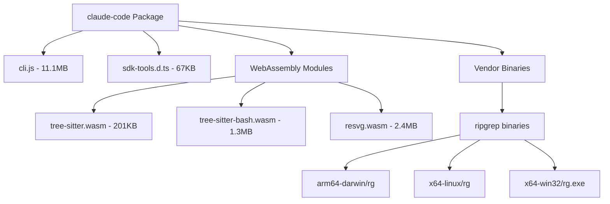
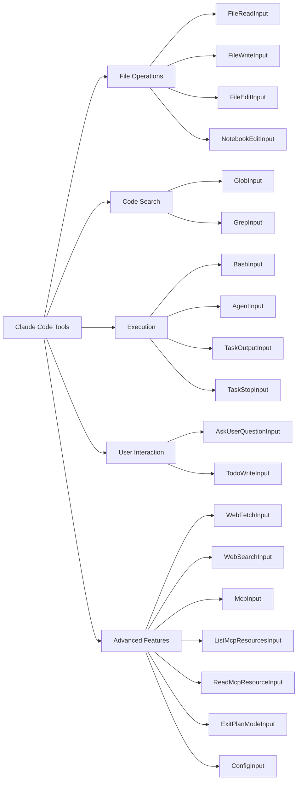
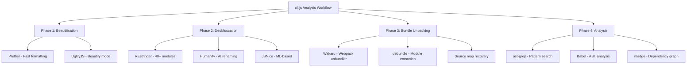
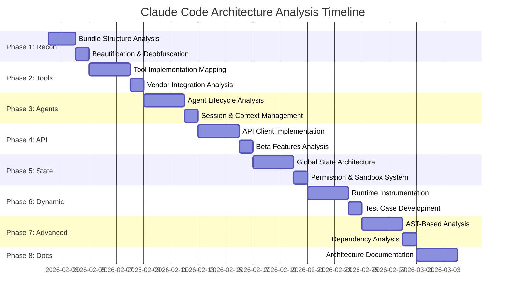
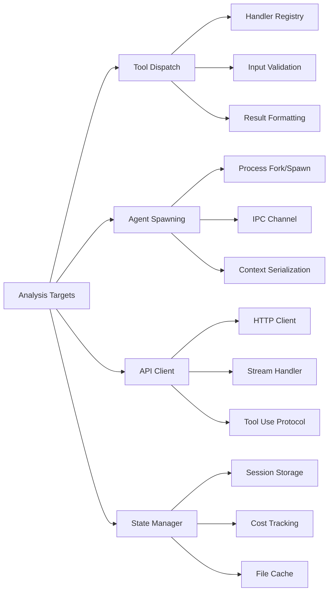
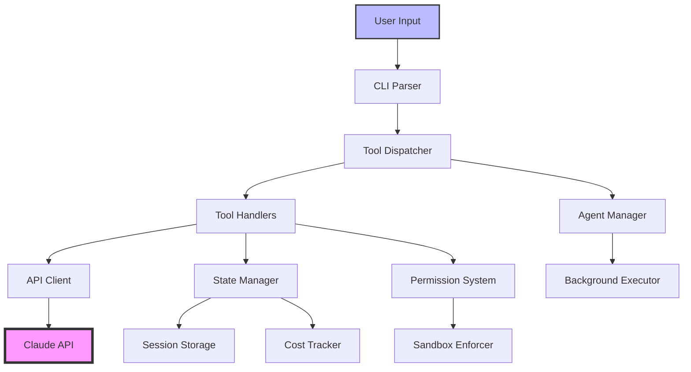

# Claude Code Architecture Analysis - 2026-02-01

## Overview
Analysis of `@anthropic-ai/claude-code` v2.1.29 package to understand its end-to-end architecture and tool system.

## Package Structure



## Tool System Architecture

### Discovered Tool Schemas (20 Total)



## Analysis Method

### Parseltongue Analysis Results

**Database Stats:**
- Code entities: 20 (all tool input schemas)
- Test entities: 0 (excluded for LLM context optimization)
- Dependency edges: 54,925
- Languages detected: Rust (TypeScript definitions parsed as Rust traits)

**Indexed Files:**
- `package/sdk-tools.d.ts` - TypeScript definitions for all tools

### Key Tool Details

#### BashInput Schema
```typescript
export interface BashInput {
  command: string;
  timeout?: number;
  description?: string;
  run_in_background?: boolean;
  dangerouslyDisableSandbox?: boolean;
  _simulatedSedEdit?: {
    filePath: string;
    newContent: string;
  };
}
```

#### AgentInput Schema
```typescript
export interface AgentInput {
  description: string;
  prompt: string;
  subagent_type: string;
  model?: "sonnet" | "opus" | "haiku";
  resume?: string;
  run_in_background?: boolean;
  max_turns?: number;
  name?: string;
  team_name?: string;
  mode?: "acceptEdits" | "bypassPermissions" | "default" | "delegate" | "dontAsk" | "plan";
}
```

## Current State

### What We Know
1. **Package Distribution**: npm tarball with bundled CLI (26.4MB compressed, 71MB unpacked)
2. **Main Entry Point**: `cli.js` (11.1MB minified JavaScript bundle)
3. **Tool Definitions**: Full TypeScript schemas in `sdk-tools.d.ts`
4. **Dependencies**: Embedded WebAssembly parsers and native ripgrep binaries
5. **Architecture**: Tool-based system with 20+ distinct operations

### What We Don't Know
1. **cli.js Internal Structure**: How the minified bundle is organized
2. **Tool Implementation**: How each tool schema maps to actual code execution
3. **Agent System**: How subagent spawning and management works
4. **Communication Protocol**: How tools communicate with Claude API
5. **State Management**: How context, files, and tasks are tracked
6. **Permission System**: How sandbox and permission modes are enforced

## Next Steps Required

### 1. Deconstruct cli.js Minified Bundle
**Challenges:**
- 11.1MB single-file bundle
- Likely minified/obfuscated
- Need industry-standard decompilation tools

**Potential Approaches:**
- Source map analysis (if available)
- AST-based deobfuscation
- Pattern matching for framework/library detection
- Static analysis of bundler artifacts

### 2. Map Tool Flow
**Goals:**
- Understand tool invocation pipeline
- Trace data flow from user input to API calls
- Identify middleware/interceptors
- Document permission/sandbox enforcement points

### 3. Reverse Engineer Agent System
**Focus Areas:**
- Subagent spawning mechanism
- Context inheritance
- Inter-agent communication
- Background execution model

## Tools and Methods

### Completed
- ✅ npm pack for package download
- ✅ tar extraction
- ✅ parseltongue indexing of TypeScript definitions
- ✅ REST API setup for code queries

### Pending
- 🔲 JavaScript deobfuscation/beautification
- 🔲 AST analysis of cli.js
- 🔲 Dependency graph extraction
- 🔲 Runtime behavior analysis
- 🔲 Protocol reverse engineering

## Parseltongue Server

**Endpoint**: `http://localhost:7778`

**Key Endpoints:**
- `/server-health-check-status` - Server status
- `/codebase-statistics-overview-summary` - Database stats
- `/code-entities-list-all` - All indexed entities
- `/code-entities-search-fuzzy?q=X` - Keyword search
- `/code-entity-detail-view?key=X` - Entity details

**Example Query:**
```bash
curl "http://localhost:7778/code-entities-search-fuzzy?q=Bash" | python3 -m json.tool
```

## Recommended Toolchain for Deconstruction

### Industry-Standard JS Analysis Tools



### Tool Installation Quick Start

```bash
# Core deobfuscation tools
npm install -g prettier uglify-js restringer humanify wakaru

# Analysis tools
npm install -g madge source-map-explorer @babel/parser @babel/traverse

# AST tools
npm install -g @ast-grep/cli jscodeshift

# Rust-based tools (faster)
cargo install ast-grep
```

### Recommended Analysis Workflow

**Step 1: Initial Assessment**
```bash
# Check for source maps
grep "sourceMappingURL" referenceRepo/package/cli.js

# Detect bundler type
grep -E "webpack|rollup|esbuild" referenceRepo/package/cli.js | head -20
```

**Step 2: Beautification**
```bash
cd referenceRepo/package
prettier cli.js --write --print-width 120 > ../analysis/cli-beautified.js
```

**Step 3: Deobfuscation**
```bash
NODE_OPTIONS="--max-old-space-size=8192" \
  restringer ../analysis/cli-beautified.js -v -o ../analysis/cli-deobfuscated.js
```

**Step 4: Bundle Unpacking**
```bash
npx wakaru ../analysis/cli-deobfuscated.js --output ../analysis/modules
```

**Step 5: Pattern Analysis**
```bash
# Find tool handlers
ast-grep --pattern 'case "$TOOL": { $$$ }' ../analysis/cli-deobfuscated.js

# Extract dependencies
madge ../analysis/cli-deobfuscated.js --json > ../analysis/deps.json
```

## Comprehensive Architecture Reverse Engineering Plan

### 30-Day Systematic Analysis Roadmap



### Phase-by-Phase Objectives

#### Phase 1: Bundle Reconnaissance (Days 1-2)
**Goals:**
- Identify bundler type (webpack/rollup/esbuild)
- Extract module map from bundled code
- Document import/export patterns

**Key Deliverables:**
- `analysis/01-bundle-structure.md`
- `analysis/module-map.json`
- `analysis/cli-beautified.js`

#### Phase 2: Tool Layer Mapping (Days 3-5)
**Goals:**
- Map each of 20 tool schemas to implementation code
- Trace tool dispatch mechanism
- Document ripgrep and WASM integration

**Key Deliverables:**
- `analysis/tool-implementation-map.md`
- `analysis/tool-flow-diagrams/` (Mermaid diagrams per tool)
- `analysis/vendor-integration.md`

#### Phase 3: Agent System (Days 6-8)
**Goals:**
- Understand subagent spawning mechanism
- Map agent state machine
- Document context inheritance

**Key Deliverables:**
- `analysis/agent-architecture.md`
- `analysis/agent-state-diagram.mmd`
- `analysis/session-management.md`

#### Phase 4: API Communication (Days 9-11)
**Goals:**
- Document Anthropic API integration
- Map request/response flow
- Identify beta feature handling

**Key Deliverables:**
- `analysis/api-protocol.md`
- `analysis/api-request-flow.mmd`
- `analysis/beta-features.md`

#### Phase 5: State & Permissions (Days 12-14)
**Goals:**
- Map global state hierarchy
- Document permission levels
- Understand sandbox implementation

**Key Deliverables:**
- `analysis/state-architecture.md`
- `analysis/permission-system.md`
- `analysis/sandbox-architecture.md`

#### Phase 6: Dynamic Analysis (Days 15-17)
**Goals:**
- Runtime tracing with Node debugger
- Network traffic capture
- Create reproducible test cases

**Key Deliverables:**
- `analysis/runtime-traces/`
- `analysis/network-captures/`
- `tests/` (Test suite)

#### Phase 7: Advanced Static Analysis (Days 18-20)
**Goals:**
- AST-based call graph extraction
- Data flow analysis
- Dependency mapping

**Key Deliverables:**
- `analysis/cli-ast.json`
- `analysis/call-graph.md`
- `analysis/dependency-graph.md`

#### Phase 8: Documentation Synthesis (Days 21-23)
**Goals:**
- Create master architecture document
- Generate comprehensive diagrams
- Document all integration points

**Key Deliverables:**
- `ARCHITECTURE.md`
- `diagrams/` (System-wide diagrams)
- `analysis/integration-points.md`

### Critical Discovery Targets



### Automation Scripts to Create

**1. Master Analysis Script**
```bash
#!/bin/bash
# scripts/analyze-all.sh
set -e

REPO_ROOT="/Users/amuldotexe/Desktop/A01_20260131/agent-room-of-requirements/referenceRepo"
cd "$REPO_ROOT"

echo "Phase 1: Beautification..."
prettier package/cli.js > analysis/cli-beautified.js

echo "Phase 2: String extraction..."
grep -o '"[^"]*"' analysis/cli-beautified.js | sort | uniq > analysis/strings.txt

echo "Phase 3: Tool extraction..."
./scripts/extract-tools.sh

echo "Phase 4: Agent mapping..."
./scripts/map-agents.sh

echo "Complete!"
```

**2. Tool Extractor**
```bash
#!/bin/bash
# scripts/extract-tools.sh
for tool in Bash Edit Read Write Grep Glob Agent TodoWrite; do
  echo "Extracting ${tool}..."
  grep -n "${tool}Input\|${tool}Handler" analysis/cli-beautified.js \
    > analysis/tools/${tool}-locations.txt
done
```

**3. Parseltongue Query Script**
```bash
#!/bin/bash
# scripts/query-schemas.sh
for tool in Agent Bash Edit Read Write Grep Glob; do
  curl -s "http://localhost:7778/code-entity-detail-view?key=typescript:trait:${tool}Input" \
    | jq '.' > analysis/schemas/${tool}Input.json
done
```

## Key Insights from Initial Analysis

### Bundle Characteristics
- **Size**: 11.1MB minified (likely 50-100MB beautified)
- **Module System**: CommonJS with ES6 imports
- **Wrapper Pattern**: `var r=(A,q,K)=>()=>(q||A((q={exports:{}}).exports,q),q.exports)`
- **Likely Bundler**: Modern bundler (webpack 5+ or esbuild)

### Known Frameworks
- **UI**: Likely Ink.js (React for CLIs) based on code patterns
- **HTTP Client**: Native fetch or axios
- **State Management**: Custom implementation

### Architecture Layers



## Success Criteria

- [ ] All 20 tools traced from schema to implementation
- [ ] Complete agent lifecycle documented with sequence diagrams
- [ ] API request/response protocol fully mapped
- [ ] State management system understood and documented
- [ ] Permission/sandbox system reverse engineered
- [ ] Reproducible test cases for major features
- [ ] <10% of codebase unexplained

## References

- Package: `@anthropic-ai/claude-code@2.1.29`
- Parseltongue: https://github.com/that-in-rust/parseltongue-dependency-graph-generator
- Location: `/Users/amuldotexe/Desktop/A01_20260131/agent-room-of-requirements/referenceRepo/`
- Tools Research: REstringer, Humanify, Wakaru, ast-grep, madge
- Plan: 30-day systematic reverse engineering roadmap

## Next Immediate Actions

1. **Install Analysis Tools** (15 min)
   ```bash
   npm install -g prettier restringer wakaru madge @ast-grep/cli
   ```

2. **Beautify cli.js** (5 min)
   ```bash
   cd referenceRepo
   prettier package/cli.js > analysis/cli-beautified.js
   ```

3. **Extract Initial Patterns** (10 min)
   ```bash
   grep -o '"[^"]*"' analysis/cli-beautified.js | sort | uniq > analysis/strings.txt
   grep -E "webpack|rollup|esbuild" analysis/cli-beautified.js > analysis/bundler-hints.txt
   ```

4. **Begin Phase 1 Analysis** (Day 1-2)
   - Document bundle structure
   - Create module map
   - Identify entry points