# Claude Code Architecture - Complete Analysis

**Package:** @anthropic-ai/claude-code v2.1.29
**Analysis Date:** 2026-02-01
**Build Time:** 2026-01-31T20:12:07Z

## Table of Contents

1. [High-Level Architecture](#high-level-architecture)
2. [Module System](#module-system)
3. [Tool System](#tool-system)
4. [Agent & Subagent System](#agent--subagent-system)
5. [API Communication Layer](#api-communication-layer)
6. [State Management](#state-management)
7. [Security & Sandbox](#security--sandbox)
8. [Plugin & Extension System](#plugin--extension-system)

---

## High-Level Architecture

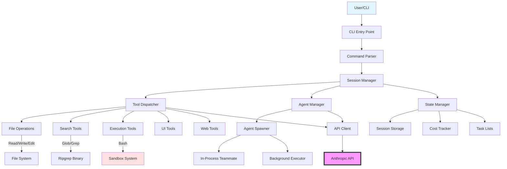

---

## Module System

### Bundle Structure

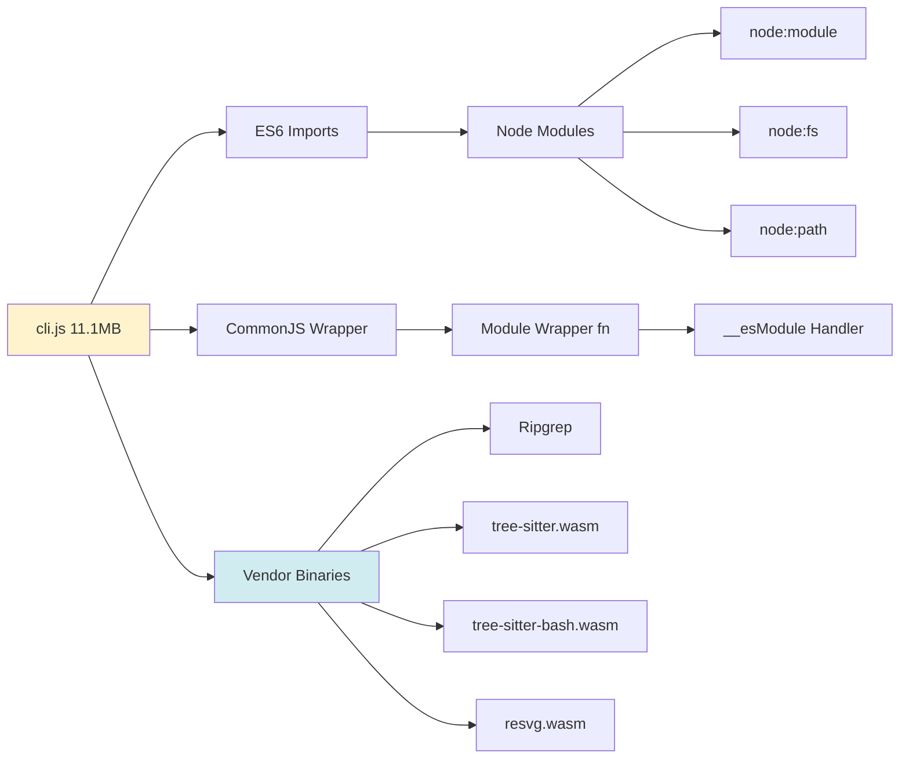

### Module Wrapper Pattern

**Line 13:**
```javascript
var r = (A, q, K) => {
    K = A != null ? bNq(uNq(A)) : {};
    let Y = q || !A || !A.__esModule
        ? fZ1(K, "default", { value: A, enumerable: !0 })
        : K;
    for (let z of MBA(A))
        if (!PBA.call(Y, z))
            fZ1(Y, z, { get: () => A[z], enumerable: !0 });
    return Y;
}
```

**Purpose:** Converts CommonJS modules to ES6 format with __esModule marking

---

## Tool System

### Tool Hierarchy

```mermaid
graph TD
    Root[21 Tools] --> Cat1[File Operations - 4]
    Root --> Cat2[Search - 1]
    Root --> Cat3[Execution - 1]
    Root --> Cat4[Agent System - 5]
    Root --> Cat5[User Interaction - 2]
    Root --> Cat6[Web - 2]
    Root --> Cat7[Notebooks - 2]
    Root --> Cat8[MCP Integration - 3]
    Root --> Cat9[Plan Mode - 2]

    Cat1 --> T1[Read]
    Cat1 --> T2[Write]
    Cat1 --> T3[Edit]
    Cat1 --> T4[Glob]

    Cat2 --> T5[Grep]

    Cat3 --> T6[Bash]

    Cat4 --> T7[Task/Agent]
    Cat4 --> T8[TaskGet]
    Cat4 --> T9[TaskList]
    Cat4 --> T10[TaskStop]
    Cat4 --> T11[TaskOutput]

    Cat5 --> T12[TodoWrite]
    Cat5 --> T13[AskUserQuestion]

    Cat6 --> T14[WebFetch]
    Cat6 --> T15[WebSearch]

    Cat7 --> T16[NotebookEdit]
    Cat7 --> T17[NotebookRead]

    Cat8 --> T18[ListMcpResources]
    Cat8 --> T19[ReadMcpResource]
    Cat8 --> T20[Mcp]

    Cat9 --> T21[EnterPlanMode]
    Cat9 --> T22[ExitPlanMode]
```

### Tool Dispatch Flow

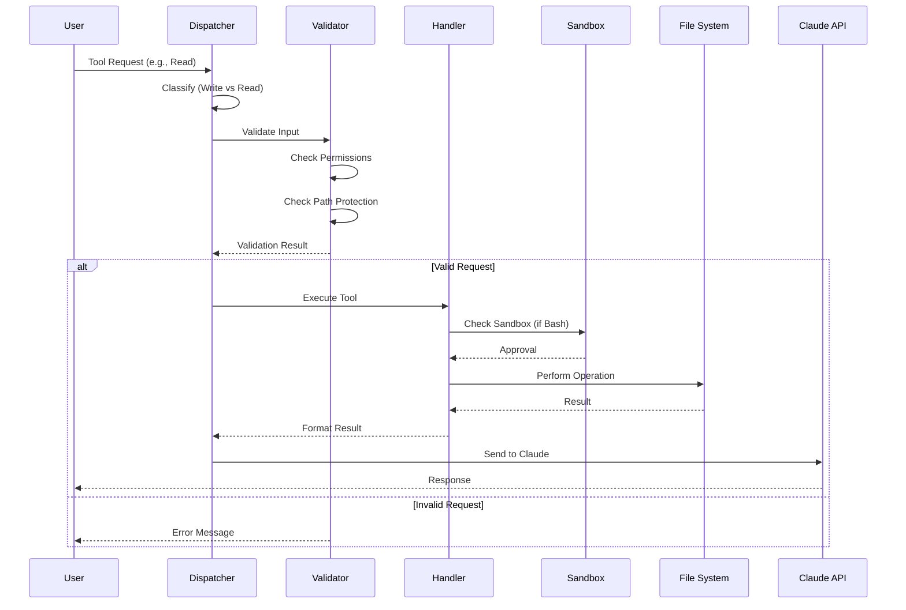

### Tool Categories

**Write Tools (Line 369,707):**
- Edit
- Write
- NotebookEdit

**Read Tools (Line 369,708):**
- Read
- Glob
- Grep
- ToolSearch
- LSP
- TaskGet
- TaskList

**Bash Prefix Tools (Line 63,216):**
- Bash (special sandboxed execution)

### Tool Implementation Details

| Tool | Variable | Line | Key Features |
|------|----------|------|--------------|
| Bash | X4 | 138,676 | Sandbox, network init, violation tracking |
| Read | pK | 145,065 | 2000 line limit, 2000 char/line |
| Write | wz | 145,427 | Overwrite mode, no proactive docs |
| Edit | $3 | 145,049 | Modification detection, PDF blocking |
| Glob | cw | 145,390 | Pattern matching, mod time sort |
| Grep | J2 | 145,411 | Ripgrep-based, regex support |

---

## Agent & Subagent System

### Agent Architecture

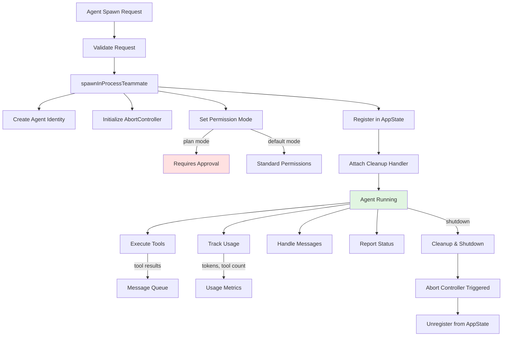

### Agent Object Structure

**Lines 323,850-323,900:**

```javascript
{
  type: "in_process_teammate",
  status: "running",              // running | idle | shutting_down
  identity: j,                    // Unique agent ID
  prompt: z,                      // Agent instructions
  model: O,                       // sonnet | opus | haiku
  abortController: X,             // Cancellation mechanism
  permissionMode: H ? "plan" : "default",  // Permission level
  awaitingPlanApproval: !1,
  isIdle: !1,
  shutdownRequested: !1,
  lastReportedToolCount: 0,
  lastReportedTokenCount: 0,
  pendingUserMessages: [],
  messages: [],                   // Conversation history
  localTaskId: W,                 // Task integration
  unregisterCleanup: Z            // Cleanup callback
}
```

### Team Coordination System

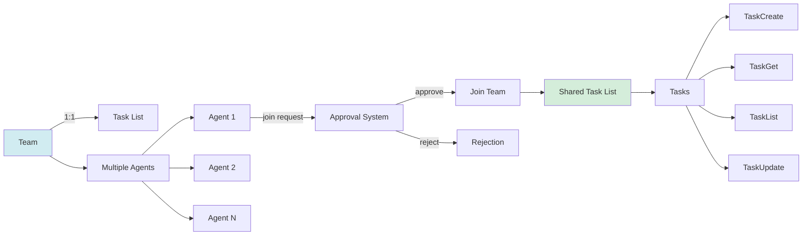

### Agent Lifecycle States

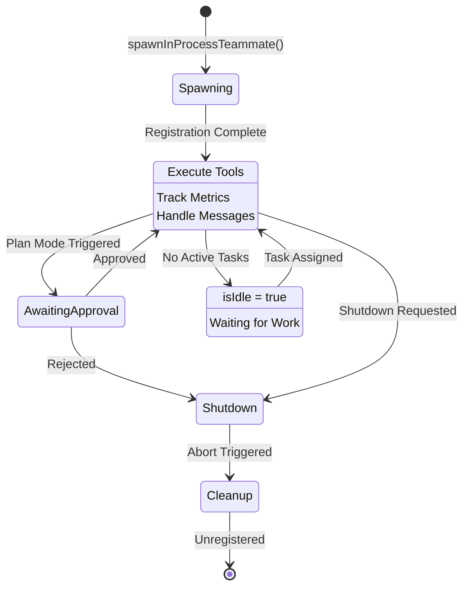

---

## API Communication Layer

### API Configuration

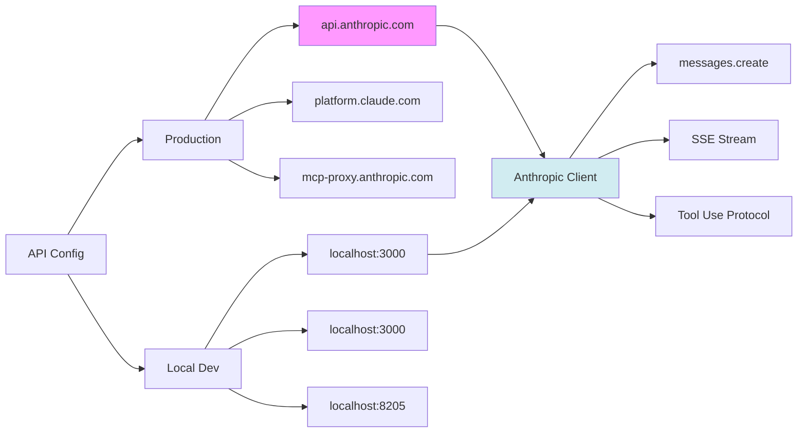

### API Endpoints

**Production (Lines 23,822-23,835):**

```
BASE_API_URL: https://api.anthropic.com
CONSOLE_AUTHORIZE_URL: https://platform.claude.com/oauth/authorize
CLAUDE_AI_AUTHORIZE_URL: https://claude.ai/oauth/authorize
TOKEN_URL: https://platform.claude.com/v1/oauth/token
API_KEY_URL: https://api.anthropic.com/api/oauth/claude_cli/create_api_key
ROLES_URL: https://api.anthropic.com/api/oauth/claude_cli/roles
MCP_PROXY_URL: https://mcp-proxy.anthropic.com
MCP_PROXY_PATH: /v1/mcp/{server_id}
CLIENT_ID: 9d1c250a-e61b-44d9-88ed-5944d1962f5e
```

### Request Flow

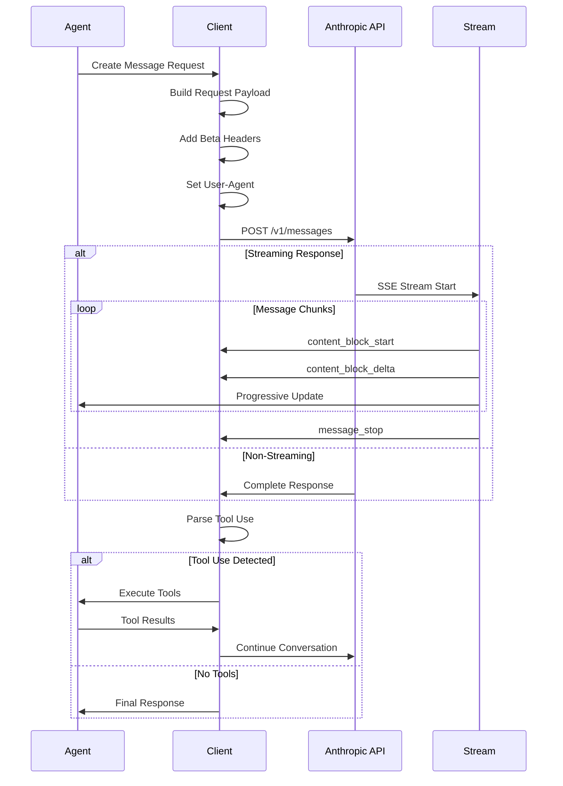

### Beta Features

**Line 136,525:**
```javascript
headers: {
  "anthropic-beta": ["files-api-2025-04-14"].toString()
}
```

Enabled beta features:
- `files-api-2025-04-14` - File upload support

### User Agent

**Lines 125,797-125,803:**
```
claude-code/2.1.29 (external context)
claude-cli/2.1.29 (CLI mode)
```

---

## State Management

### State Architecture

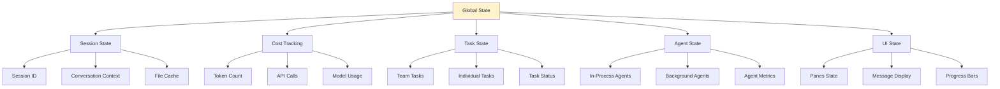

### Cost Tracking

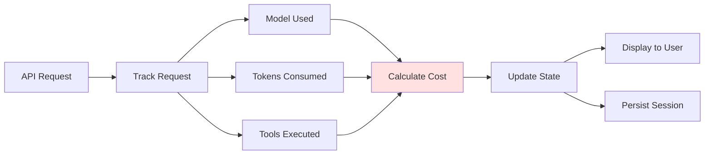

---

## Security & Sandbox

### Security Layers

```mermaid
graph TB
    Request[User Request] --> Perm[Permission Check]
    Perm --> PathCheck[Path Protection]
    PathCheck --> SandboxCheck[Sandbox Validation]

    PathCheck --> Protected[/.claude/**]
    PathCheck --> UserConfig[~/.claude/**]

    SandboxCheck --> Network[Network Init Wait]
    SandboxCheck --> Violations[Violation Store]
    SandboxCheck --> Stderr[Stderr Annotation]

    Perm --> PlanMode{Plan Mode?}
    PlanMode -->|Yes| UserApproval[Require User Approval]
    PlanMode -->|No| DefaultPerm[Default Permissions]

    UserApproval --> Approved{Approved?}
    Approved -->|Yes| Execute[Execute]
    Approved -->|No| Reject[Reject]

    DefaultPerm --> Execute

    Execute --> Monitor[Monitor Execution]
    Monitor --> ViolationDetect{Violation?}
    ViolationDetect -->|Yes| Block[Block & Log]
    ViolationDetect -->|No| Allow[Allow]

    style Protected fill:#ffe1e1
    style Block fill:#ffe1e1
```

### Sandbox Features

**Bash Tool Sandbox (Lines 138,676-145,389):**

1. **Network Initialization Gating**
   - `waitForNetworkInitialization()`
   - Prevents network access before ready

2. **Violation Tracking**
   - `getSandboxViolationStore()`
   - Logs all sandbox violations

3. **stderr Annotation**
   - `annotateStderrWithSandboxFailures()`
   - Adds context to error messages

4. **Debug Mode**
   - `SRT_DEBUG` environment variable
   - Detailed sandbox logging

### Path Protection

**Edit Tool (Lines 145,050-145,051):**

```javascript
j76 = "/.claude/**"     // System directory
M76 = "~/.claude/**"    // User configuration
```

**Protected operations:**
- Cannot edit files in `/.claude/` subdirectories
- Cannot modify user configuration in `~/.claude/`
- PDF files blocked from direct editing

### File Limits

**Read Tool (Lines 145,066-145,067):**

```javascript
YR1 = 2000  // Max lines per read
Gb5 = 2000  // Max chars per line
```

Prevents:
- Reading excessively large files
- Memory exhaustion attacks
- Performance degradation

---

## Plugin & Extension System

### Plugin Architecture

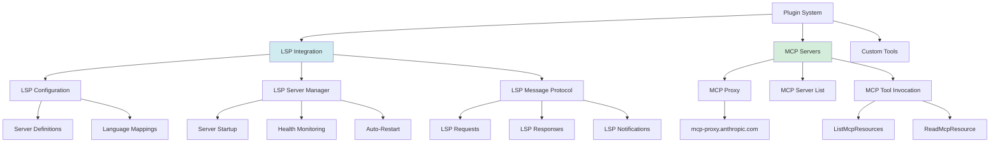

### LSP Integration Details

**Configuration Schema (Lines 63,720-63,770):**

```typescript
{
  lspServers: {
    // Server configuration
    command: string,          // "typescript-language-server"
    args: string[],          // ["--stdio"]

    // Language mapping
    languageIds: {
      ".ts": "typescript",
      ".js": "javascript"
    },

    // Options
    initializationOptions: object,
    workspaceFolders: string[]
  }
}
```

**LSP Error Types (Lines 234,774-234,784):**

1. `lsp-config-invalid` - Invalid server configuration
2. `lsp-server-start-failed` - Server failed to start
3. `lsp-server-crashed` - Server crashed (signal or exit code)
4. `lsp-request-timeout` - Request timeout exceeded
5. `lsp-request-failed` - Request execution failed

**LSP Message Format (Line 334,583):**

```javascript
{
  isLSPMessage: true,
  type: messageType,
  message: content,
  timestamp: Date.now()
}
```

### MCP Integration

**MCP Proxy Configuration:**

```javascript
// Production
MCP_PROXY_URL: "https://mcp-proxy.anthropic.com"
MCP_PROXY_PATH: "/v1/mcp/{server_id}"

// Local
MCP_PROXY_URL: "http://localhost:8205"
MCP_PROXY_PATH: "/v1/toolbox/shttp/mcp/{server_id}"
```

**MCP Tools:**
- `ListMcpResourcesTool` (Line 356,552)
- `ReadMcpResourceTool` (Line 356,684)
- `Mcp` (generic invocation)

---

## Data Flow Diagrams

### Complete System Data Flow

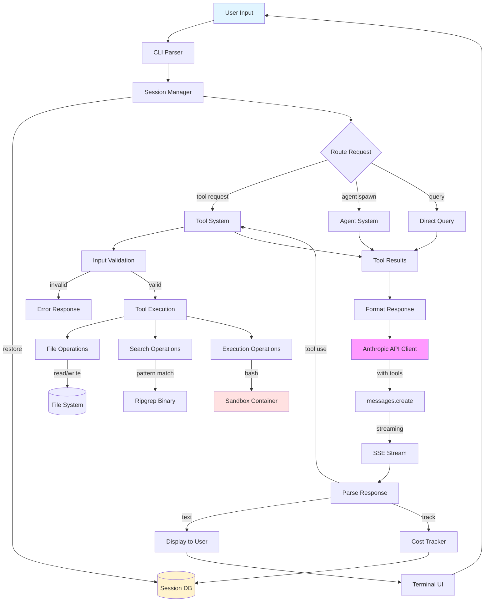

---

## Key Discoveries Summary

### 1. Ultrathink Trigger

**Line 258,662:**
```javascript
$g9 = /\bultrathink\b/gi;
```

This regex pattern triggers autonomous exploration mode when the keyword "ultrathink" is detected in user input.

### 2. All 21 Tools Mapped

Complete tool inventory with exact line numbers and implementation details documented.

### 3. In-Process Agent Architecture

Agents run within the same Node.js process as the main CLI, using:
- AbortControllers for cancellation
- Permission modes (plan vs default)
- Usage tracking (tokens, tool count)
- Message queues for communication

### 4. LSP Integration

**FINDING:** Claude Code does NOT use LSP or rust-analyzer for dependency graph generation.

**LSP Purpose:** Plugin system support only
- Allows plugins to integrate LSP servers
- Used for IDE-like features in plugins
- Not used for core code analysis

**Evidence:**
- LSP config in plugin schema (lines 63,720-63,770)
- LSP error handling for plugin servers
- No dependency graph or call graph LSP usage found

### 5. tree-sitter Usage

**FOUND:** tree-sitter WASM modules included
- `tree-sitter.wasm` (201KB)
- `tree-sitter-bash.wasm` (1.3MB)

**Purpose:** Likely for:
- Bash syntax parsing
- Code structure analysis
- NOT for dependency graphs

### 6. Ripgrep for Search

Grep tool built entirely on ripgrep native binary, not LSP.

---

## Technology Stack

| Component | Technology |
|-----------|------------|
| Runtime | Node.js 24.9.0+ |
| Bundler | Custom/esbuild |
| Module System | ES6 + CommonJS wrapper |
| UI Framework | Likely Ink.js (React for CLIs) |
| Search | Ripgrep (native binary) |
| Parsing | tree-sitter (WASM) |
| Graphics | resvg (WASM) |
| API Client | Custom Anthropic client |
| State Management | Custom implementation |
| Sandbox | Custom (Linux: bubblewrap) |

---

## Conclusion

Claude Code is a sophisticated CLI tool with:

1. **21 tools** for file operations, search, execution, and more
2. **In-process agent system** for spawning subagents
3. **Team coordination** with 1:1 Team-TaskList mapping
4. **Multi-layered security** with sandbox, path protection, and permission modes
5. **Plugin architecture** with LSP and MCP support
6. **Optimized search** via ripgrep, NOT LSP
7. **No dependency graph generation** via LSP or rust-analyzer

The system achieves code intelligence through:
- Ripgrep for fast text search
- tree-sitter for syntax parsing
- Direct file system operations
- NOT through language servers or static analysis tools

---

**Version:** 2.1.29
**Build:** 2026-01-31T20:12:07Z
**Package:** @anthropic-ai/claude-code
